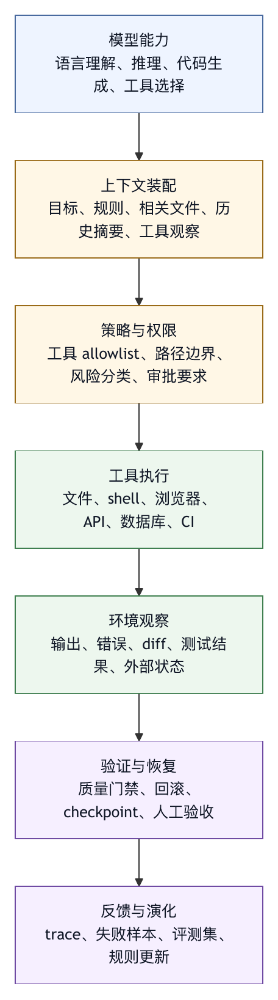

# 第一章 为什么需要 Harness Engineering

## 1.1 强模型仍需要系统边界

每一代更强的基础模型都会带来相似的期待：如果模型更会推理、更会写代码、更能使用工具、更能理解图片、音频和视频，那么智能体系统是否就会自然变得可靠？经验给出的回答更谨慎。更强的模型确实扩大了可完成任务的范围，但它并不会自动提供任务环境、权限边界、状态管理、审计机制和失败恢复。

在真实工程环境中，一个智能体任务很少只是“回答一个问题”。它往往需要读取仓库，理解项目规则，搜索代码，编辑文件，运行测试，分析失败，回滚错误修改，比较多个实现方案，遵守团队约定，避免泄露密钥，处理用户未保存的工作，并在不确定时请求确认。关键难点已经从单次语言生成转向：模型行为如何嵌入一个有状态、有风险、有责任归属的软件环境。

这就是 harness engineering 出现的原因。

本书把 harness 理解为基础模型与真实任务环境之间的运行基底〔注1-1〕。模型本身提供语言理解、推理、生成和工具选择能力，但这些能力只有经过 harness 的组织，才会变成一个可以操作真实环境的系统。Harness 决定模型能看到什么、能调用什么、能修改什么、在什么条件下必须等待用户确认、工具返回如何进入上下文、长任务如何压缩历史、失败如何保留证据、成本如何计量、经验如何进入下一次运行。

因此，一个 coding agent 的质量不能由模型单独决定。模型是引擎，harness 是传动系统、制动系统、仪表盘、道路规则和维修记录的组合。没有 harness，再强的模型也只是一个有能力但缺少运行约束的生成器。

还要避免一个误解：harness 不是“再包一层 API”。薄封装通常只负责把用户输入转成模型请求，把模型输出显示出来，最多附带几个工具调用接口。工程级 harness 则不同，它必须承担运行时责任。它需要知道当前工作区在哪里，哪些路径可以访问，哪些命令危险，哪些工具需要审批，哪些输出必须裁剪，哪些上下文优先级更高，哪些失败可以重试，哪些状态可以回滚，哪些日志必须脱敏，哪些任务应当进入评测集。

系统开始承担这些责任，才算从“模型调用程序”进入 harness engineering。

## 1.2 Demo 与生产系统之间的缺口

许多智能体 demo 令人印象深刻。用户输入一个目标，模型规划步骤，调用搜索或 shell，生成代码，运行测试，最后给出总结。这个流程在短视频和发布会上很自然，因为演示环境通常经过选择：任务范围有限，仓库状态干净，依赖可用，凭据风险低，失败成本可控，用户关注的是“是否看起来能完成”。

生产环境则不同。

真实工作区经常是不干净的。用户可能有未提交修改，生成文件可能和源码混在一起，测试可能因为外部服务波动失败，依赖安装可能受网络影响，权限可能来自多个配置层，团队规范可能写在 `AGENTS.md`、`CLAUDE.md`、README、内部 wiki 或历史代码风格中。智能体不仅要“会做事”，还要知道哪些事不能做、哪些事做之前要问、哪些证据足以证明完成、哪些证据只是表面通过。

生产环境还有组织责任。一个智能体如果误删文件、泄露 token、向错误分支推送代码、在 CI 未通过时宣布完成、把用户未要求的重构混进补丁，后果都不只是一次回答质量下降。它会影响信任。信任一旦被破坏，团队会从“让智能体多做一点”迅速退回到“每一步都要人工盯着”。这时模型能力没有消失，但系统价值会被运行风险抵消。

Demo 与生产系统之间的缺口，主要就落在 harness 上。

一个生产级 harness 至少要回答以下问题：

1. 模型如何获得任务所需上下文，而不是吞下整个仓库或只看见用户最后一句话？
2. 工具如何被描述、选择、调用、验证和限制？
3. 文件系统和外部服务如何隔离？
4. 哪些操作需要审批，审批信息如何展示给用户？
5. 长任务中间状态如何保存，失败后如何恢复？
6. 系统如何知道自己是否真的完成，而不是只是生成了一个看似完整的总结？
7. 一次失败如何进入后续改进，而不是只停留在聊天记录中？

这些问题必须进入早期架构设计。它们会反过来决定行动循环的设计、工具接口的粒度、UI 的信息密度、日志格式、评测集构造和组织治理流程。

## 1.3 Harness Engineering 与 Prompt Engineering 的差别

提示词工程（prompt engineering）曾经是大模型应用的主要入口。它的重要性没有消失。清晰的角色定义、任务边界、输出格式、例子、约束和优先级，仍然会显著影响模型行为。但是，在智能体系统中，提示词只是 harness 的一个部件。

提示词工程通常面对的是“如何让模型在当前上下文中产生更好的输出”。Harness engineering 面对的是“如何让模型驱动的系统在环境中产生可接受的结果”。前者的对象主要是语言行为，后者的对象是系统行为。

这个差别可以从几个方面观察。

第一，提示词工程主要优化输入文本，harness engineering 优化上下文供应链。系统指令、项目规则、用户目标、检索片段、工具结果、历史摘要、长期记忆和运行时状态，都需要被排序、裁剪、冲突处理和更新。上下文作为动态装配的控制面，不能被当成静态 prompt。

第二，提示词工程通常假设模型输出即结果，harness engineering 则把输出视为行动候选。模型说“我要修改这个文件”并不等于系统应该修改；模型生成 shell 命令并不等于命令应该执行；模型声称测试通过并不等于验证已经完成。Harness 要在模型意图和环境动作之间插入 schema、权限、审批、执行器和观测。

第三，提示词工程关注单次或短链路质量，harness engineering 关注长任务稳定性。一个 coding agent 可能运行几十轮工具调用，期间上下文不断增长，任务目标逐渐细化，环境状态持续变化。长链路中的小偏差会累积，最终表现为“看起来一直在工作，但方向已经错了”。Harness 必须提供计划跟踪、状态摘要、停止条件和中间检查点。

第四，提示词工程很难单独解决治理问题。组织需要知道智能体做了什么、为什么做、谁批准、影响哪些文件、消耗多少成本、是否触达外部服务、是否违反安全策略。这些信息来自 trace、日志、审批记录、权限系统和环境隔离，而不是来自更漂亮的提示词。

本书并不否定提示词工程，而是把它放回正确位置：提示词是 harness 的指令层；harness engineering 是智能体系统的运行时工程。

## 1.4 智能体系统的基本矛盾

智能体系统的吸引力来自自主性。用户不希望每一步都亲自操作，而希望系统能够理解目标、拆解任务、调用工具、处理反馈并完成工作。可是系统风险也来自自主性。只要智能体能行动，它就可能在错误上下文中行动、用错误工具行动、以过大权限行动，或在证据不足时宣布行动完成。

这形成了智能体系统的基本矛盾：我们希望智能体有足够自主性来创造价值，又希望它受到足够约束来避免事故。

Harness engineering 的任务是把自主性分层，而不是简单压制或放任。不同动作需要不同治理强度：

- 读取公开项目文件通常可以低风险执行。
- 修改源码需要记录 diff，并在高风险场景下请求确认。
- 删除文件、改写历史、安装依赖、访问网络、调用外部 API、提交代码、发送消息，需要更严格的权限和审计。
- 使用组织凭据或处理敏感数据时，需要额外隔离和策略检查。

成熟的 harness 不会用一个“允许”或“禁止”开关处理所有行为。它会根据工具、参数、路径、运行模式、用户偏好、项目策略和组织规则做分层判断。它也不会把安全完全交给模型自觉，因为模型并不是权限主体。模型可以解释风险，但权限系统必须由 harness 执行。

因此，很多智能体产品都会发展出相似的结构：计划模式、读写隔离、命令审批、工具 allowlist、项目指令文件、会话记录、diff 预览、撤销和恢复、trace、成本显示、测试验证。这些结构支撑自主性被接受，不能当作产品装饰。

## 1.5 Harness 是模型能力的放大器，也是限制器

从工程角度看，harness 同时扮演两个角色。

一方面，它放大模型能力。模型如果只能输出文本，它的能力停留在建议层；当它接入文件系统、搜索、终端、浏览器、数据库、知识库、CI 和 issue 系统，它就能进入真实工作流。工具、记忆和上下文让模型从“知道”走向“能做”。ReAct 等研究说明了推理与行动交替的重要性；Toolformer 等工作说明了工具调用能力可以成为语言模型能力的一部分；SWE-bench 和 Terminal-Bench 则把评测对象推向真实软件任务和终端任务〔注1-2〕。

另一方面，harness 限制模型能力。它拒绝危险命令，裁剪过长输出，隐藏密钥，限制路径，要求人工审批，禁止越权工具，压缩历史，强制测试，记录 trace。这些限制让模型能力进入可用状态。没有限制的智能体也许能偶尔完成惊艳任务，但难以进入需要责任归属的组织环境。

两个角色必须同时存在。只强调放大，系统会变得危险；只强调限制，系统会变成低效问答工具。Harness engineering 的成熟度，就体现在能否根据任务风险动态调整放大与限制的比例。

一个典型例子是 coding agent 的 shell 工具。没有 shell，智能体很难运行测试、查看 git 状态、执行构建、复现错误；shell 是能力放大器。但 shell 也是最危险的工具之一，因为它可以删除文件、联网下载脚本、改写权限、泄露环境变量、触发昂贵任务或改变系统状态。工程上不能简单地“给模型 shell”或“禁止 shell”，而要设计命令风险分类、审批提示、输出截断、工作目录限制、危险模式拦截和审计记录。

工具越强，harness 越重要。

## 1.6 从 API Wrapper 到 Harness Platform

许多团队最初构建大模型应用时，会从 API wrapper 开始。这是合理的起点：封装认证、请求、流式响应、错误处理和少量业务逻辑，就可以快速验证模型能力。但是，当系统进入智能体阶段，API wrapper 会迅速显得不足。

API wrapper 的缺口在于缺少完整运行时意识。它可以发送请求，却不知道任务状态；可以传递工具定义，却不知道工具调用是否安全；可以记录响应，却无法解释为什么某个文件被修改；可以重试 HTTP 请求，却无法恢复半完成的工作区；可以接入多个模型，却未必理解每个模型的真实约束。

Harness platform 则需要具备更完整的运行时能力：

- 模型契约层：明确模型能力、上下文限制、工具调用格式、推理内容、成本和供应商特定行为。
- 上下文层：装配系统指令、用户目标、项目规则、历史摘要、检索材料和工具观察。
- 工具层：提供 typed tools、schema、执行器、错误语义、权限策略和输出预算。
- 状态层：管理 session、工作区、checkpoint、任务进度和外部系统状态。
- 安全层：提供 sandbox、审批、策略、密钥保护、危险操作拦截和审计。
- 可观测层：记录 trace、日志、指标、成本、错误、审批和最终产物。
- 评测层：把真实任务、失败样本、回归测试和人工审稿纳入持续改进。
- 产品层：提供终端、Web、IDE、API 或队列等交互界面。

作者整理的匿名工程案例提供了一个可观察案例。它围绕某单一模型供应商的模型建立了工具注册、权限模式、上下文压缩、多模态预处理、MCP runtime、会话、checkpoint、diagnostics、多智能体调度和终端 TUI，而不只是调用模型。其成熟度复盘明确区分了“薄 API CLI”和“完整 harness 平台”的差别。

这类系统的复杂度看似高，但它并不是过度设计。复杂度来自任务本身。只要智能体被允许进入真实工作区，复杂度就已经存在；harness engineering 的价值是把隐性复杂度显性化、结构化和可治理化。

## 1.7 为什么现在需要一门工程学

Harness engineering 值得成为一门独立工程实践，是因为多个趋势已经汇合，而不只是出现了一个新名词。

第一，模型能力已经越过“只能回答问题”的阶段。现代模型可以长上下文阅读、生成代码、解释错误、选择工具、处理多模态信息，并在受控条件下推进计划。这使得模型开始有机会承担真实工作流中的多个环节。

第二，工具调用成为主流接口形态。无论是函数调用、MCP、浏览器自动化、终端工具还是企业内部 API，模型正在通过结构化接口进入外部系统。工具调用把模型输出从文本变成行动，也把风险从表达错误扩展到环境错误。

第三，coding agent 和企业智能体平台把智能体直接带入高价值场景。软件仓库、CI、issue、文档、数据系统、工单和审批流都不是玩具环境。它们要求可追溯、可回滚、可审计、可治理。

第四，评测对象正在从模型回答转向系统任务。SWE-bench、Terminal-Bench 等任务提醒我们，一个智能体是否有用，不取决于它能否在静态问答中给出正确句子，而取决于它能否在真实环境中完成任务并留下可验证证据。

第五，组织开始积累智能体事故和失败样本。错误补丁、误删文件、上下文误读、权限越界、过度修改、错误总结、无效测试和成本失控，都会迫使团队从“试试模型”转向“建设运行时”。

这些趋势共同说明，智能体系统已经进入需要工程纪律的阶段。就像 Web 应用的发展催生了后端工程、前端工程、DevOps、SRE 和平台工程，智能体系统的发展也需要自己的工程领域。Harness engineering 可以被看作 AI 时代的平台工程和运行时工程的交叉。

## 1.8 本书的基本框架

为了把 harness engineering 从概念变成可操作的工程实践，本书会围绕八个问题展开。

第一，边界问题：模型、harness、环境、用户和外部系统各自负责什么？如果边界不清，团队会把模型错误、工具错误、权限错误和产品交互错误混为一谈。

第二，上下文问题：系统如何决定模型应该看见什么？上下文是 harness 的控制面，错误上下文会导致错误行为，即使模型本身能力很强。

第三，工具问题：工具如何设计、描述、限制、调用和验证？工具系统决定智能体能否进入真实工作流，也决定风险如何被放大。

第四，状态问题：长任务如何保存进度，环境变化如何被感知，失败后如何恢复？没有状态意识的智能体无法可靠完成复杂任务。

第五，安全问题：权限、sandbox、审批、guardrail 和凭据隔离如何协同？安全不能只依赖模型自我约束。

第六，观测问题：系统如何记录和解释智能体做过什么？没有 trace，就没有审计、调试和持续改进。

第七，评测问题：如何证明智能体真的完成任务？自然语言总结不是证据，测试、diff、运行结果、人工审稿和回归集才是证据。

第八，演化问题：一次失败如何变成下一版更好的 harness？如果失败只停留在聊天记录中，系统无法形成学习闭环。

这八个问题会贯穿全书。不同章节会从不同角度进入，但最终都回到同一个目标：让模型能力在真实环境中形成可运行、可治理、可演化的系统。

## 1.9 运行基底的经济性：为什么 Harness 是成本控制机制

很多团队第一次讨论 harness engineering 时，会把它理解为“安全和治理成本”。这种理解只看到了一半。Harness 的确增加了运行时结构，也会带来工程投入；但从完整生命周期看，成熟 harness 更重要的作用是控制总成本。

智能体系统的成本不能只按 token 价格计算。一个智能体任务的真实成本至少包括五部分：模型调用成本、工具执行成本、工程师注意力成本、失败返工成本和事故风险成本。模型调用成本最容易被看见，因为它直接出现在账单里；后四类成本更隐蔽，却经常更大。一次错误文件修改可能只消耗几分钱 token，却让工程师花半小时检查；一次错误工具调用可能只运行几秒，却污染工作区；一次错误结论可能没有立即破坏系统，却让团队基于错误判断继续投入。

Harness 的经济性来自降低这些隐性成本。

第一，它降低上下文浪费。没有上下文装配机制的系统，常见做法是把尽可能多的材料塞给模型，或者在信息不足时让模型猜。前者增加成本和延迟，后者增加错误率。成熟 harness 会根据任务、文件相关性、最近工具结果、项目规则和历史摘要选择上下文，并记录选择依据。这样做的目标是让模型在更少噪声中做更可靠的判断，token 和延迟收益只是副产品。

第二，它降低重复劳动。没有状态层的智能体在长任务中容易反复搜索同一批文件、重复运行同一类命令、重新解释已经处理过的错误。状态层、checkpoint 和工具观察摘要可以把已经完成的工作稳定下来，让后续步骤基于已验证事实推进。对于一次运行看似只是小优化，对于组织级使用则会显著影响吞吐量。

第三，它降低人工监督负担。一个没有风险分级的智能体往往迫使用户在每个动作上做判断。审批过多会造成疲劳，审批过少会造成事故。Harness 通过工具风险分类、路径限制、命令策略和模式切换，把低风险动作自动化，把用户注意力留给需要判断的操作。用户少看无意义弹窗，并不意味着系统更危险；审批信号变得稀缺后，用户更可能认真处理。

第四，它降低失败诊断成本。没有 trace 的失败最贵。团队只能回看聊天记录，猜测模型当时看见了什么、为什么调用某个工具、工具输出是否被截断、权限策略是否生效。成熟 harness 会记录上下文片段、工具调用、参数、输出摘要、审批、文件变更、测试结果和最终证据。失败仍会发生，但失败能被定位、复现和修复。

第五，它降低组织扩展成本。单个高手可以用很薄的脚本配合模型完成复杂任务，因为他知道什么时候该停、该看什么、该怀疑什么。组织不能把这种判断全部寄托在个人经验上。Harness 把经验固化为规则、工具、评测、模板和审计机制，让更多人能在相近的安全边界内使用智能体。

因此，harness 投入不是单纯的“平台工程开销”。它更接近一套成本控制系统：用可观察、可审计、可复用的运行结构，换取更低的返工率、更少的事故、更稳定的吞吐量和更可预测的人工参与。越是高价值场景，这个交换越划算。

这里也要避免另一个极端：成本控制不等于永远选择最便宜模型，也不等于把所有工具都限制到最低权限。过弱的模型会增加工具轮次和人工纠错；过严的限制会让智能体无法完成任务；过度压缩的上下文会制造误判。Harness 的经济性来自匹配：用适当模型处理适当任务，用适当上下文支持适当判断，用适当权限执行适当动作。

从管理视角看，智能体的单位成本不应是“每次对话成本”，而应是“每个有效完成任务的总成本”。这个指标会把 token、延迟、人工审查、失败返工和事故风险放到同一个框架中。Harness engineering 的目标，就是让这个总成本随规模下降，而不是随规模失控。

## 1.10 例子：同一个修 Bug 任务在三种系统中的表现

为了让前面的抽象讨论更具体，可以设想一个常见任务：用户报告“设置页保存后刷新会丢失开关状态”，希望智能体修复。这个任务看似简单，但它已经包含真实软件工作的多个要素：需要理解现象，定位代码，修改文件，运行测试，说明风险，并避免影响用户未提交修改。

在第一种系统中，智能体只是一个聊天模型。用户需要手动复制错误信息、相关文件和测试结果。模型可以根据材料提出不错的假设，例如状态没有写入持久层，或者刷新后初始化逻辑覆盖了用户配置。可是模型无法自己检查仓库，也无法验证修改。它的价值主要是分析和建议。任务是否完成，取决于用户是否把建议正确落地。

在第二种系统中，智能体是一个带工具的 API wrapper。它可以读取文件、搜索代码、修改文件、运行测试。表面上看，它已经具备行动能力。但如果缺少完整 harness，它可能仍然暴露出一系列问题：没有先检查工作区是否有用户改动；没有理解项目里的智能体指令文件；搜索结果过长时被截断却没有意识到；修改了相邻模块以“顺手整理”；测试失败后只给出自然语言解释；最终总结中没有列出哪些验证没有执行。这个系统可能偶尔比聊天模型更快，但可靠性不稳定。

在第三种系统中，智能体运行在工程级 harness 内。任务开始时，harness 记录用户目标和约束，检查工作区状态，读取项目规则，建立初始计划。模型建议搜索设置页、状态管理和持久化相关代码；harness 执行搜索并控制输出大小。模型提出修改方案后，harness 将文件写入限制在工作区内，保留 diff，并在检测到高风险操作时请求确认。修改完成后，系统运行相关测试；如果测试命令不存在，harness 记录未验证项，而不是让模型含糊地说“应该可以”。最终答复包含修改范围、验证证据和残余风险。

这三个系统使用的底层模型可以相同，用户感受到的可靠性却完全不同。差别来自系统是否把模型能力组织成可检查、可恢复、可治理的行动，而不只是模型是否“知道”如何修 bug。

这个例子也说明，harness engineering 的设计对象不是某个孤立模块。任务开始前的上下文装配会影响定位速度；文件访问策略会影响安全；工具输出预算会影响模型判断；测试执行和结果记录会影响验收；最终总结会影响用户信任。一个环节薄弱，整个任务的可信度都会下降。

在真实团队中，类似任务每天会发生数十次、数百次。一次智能体成功修复 bug 不足以证明系统成熟；系统必须在不同仓库、不同用户、不同失败模式下保持相似的工程纪律。这正是 harness 从 demo 走向平台的分界线。

## 1.11 图 1-1：模型能力到系统行为的转换链

图 1-1 概括了这个转换关系：模型能力只有经过任务、控制和证据层，才会成为可承担责任的系统行为。

<figure><figcaption><p>图 1-1：模型能力到系统行为的转换链</p></figcaption></figure>

```text
模型能力
  语言理解、推理、代码生成、工具选择
      |
      v
上下文装配
  目标、规则、相关文件、历史摘要、工具观察
      |
      v
策略与权限
  工具 allowlist、路径边界、风险分类、审批要求
      |
      v
工具执行
  文件、shell、浏览器、API、数据库、CI
      |
      v
环境观察
  输出、错误、diff、测试结果、外部状态
      |
      v
验证与恢复
  质量门禁、回滚、checkpoint、人工验收
      |
      v
反馈与演化
  trace、失败样本、评测集、规则更新
```

这张图的重点是“转换”。模型能力不是直接变成系统行为，中间必须经过多个工程控制点。上下文装配决定模型基于什么事实行动；策略与权限决定哪些候选行动可以落地；工具执行把意图转化为环境副作用；环境观察让模型和系统更新判断；验证与恢复决定任务是否可以宣称完成；反馈与演化把一次运行变成下一次改进的材料。

如果一个团队发现智能体行为不稳定，可以沿着这条链定位问题。模型是否真的具备所需能力？上下文是否包含关键文件和约束？权限是否把危险动作挡住？工具结果是否被正确结构化？验证是否足够覆盖风险？失败是否进入改进闭环？这类问题比“模型是不是不够聪明”更可操作。

后续章节会不断回到这条链。第二章讨论边界，主要是在链条上划清责任；第六章讨论上下文，是在强化第一段转换；第八章讨论工具系统，是在强化行动接口；第三编讨论权限、安全和恢复，是在强化策略与环境边界；第四编讨论 trace、评测和质量门禁，是在强化验证与演化。

## 1.12 本章检查表

在开始设计或评审一个智能体系统时，可以用以下问题检查它是否已经进入 harness engineering 的范围：

1. 系统是否明确区分模型建议和环境执行？
2. 用户目标、项目规则、工具结果和历史摘要是否有稳定的上下文装配机制？
3. 工具是否具备 schema、权限、风险分类、输出限制和错误语义？
4. 文件系统、shell、网络和外部 API 是否有清晰边界？
5. 系统是否能识别哪些动作需要人工审批，审批信息是否足以帮助用户判断？
6. 长任务是否有状态记录，而不是只依赖聊天历史？
7. 失败后是否能看到模型看见了什么、调用了什么、修改了什么、验证了什么？
8. 最终完成声明是否基于证据，而不是基于模型总结？
9. 真实失败样本是否会进入评测、规则或工具改进？
10. 成本衡量是否覆盖 token、工具执行、人工审查、返工和事故风险？

如果这些问题大多没有答案，系统仍然处在 demo 或 API wrapper 阶段。它也许已经有价值，但还没有形成可扩展的工程能力。如果这些问题已经有明确设计，团队才开始建设 harness。

## 1.13 Harness Engineering 的定义边界

可以给出一个更严格的工作定义：harness engineering 是围绕基础模型行动能力所建立的运行时工程实践，它通过上下文、工具、权限、状态、观测、评测和反馈机制，把模型输出转化为可验证、可治理、可恢复的系统行为。

这个定义有几个限定。

第一，它强调运行时。Harness 不是离线训练方法，也不是模型权重优化。它处理的是模型被部署到任务环境之后，如何接收目标、获得上下文、调用工具、产生副作用、记录证据和从失败中改进。它可以利用模型能力，也可以反过来生成数据改进模型或提示词，但它的核心对象是运行中的系统。

第二，它强调行动能力。普通问答系统也需要提示词、检索和安全过滤，但 harness engineering 的独特压力来自行动。只要系统能改文件、运行命令、调用 API、写知识库、查询数据或代表用户访问外部系统，它就进入了 harness engineering 的问题域。行动越强，边界越重要。

第三，它强调可验证结果。模型给出一个看起来专业的回答，不等于任务完成。Harness engineering 要求任务完成能够被证据支持：diff、测试、日志、查询、引用、审批、审稿或用户验收。没有证据，系统只能提供建议；有证据，系统才可能承担工作流的一部分。

第四，它强调治理。治理不是企业场景才需要的附加功能。即使个人开发者使用本地 coding agent，也需要决定哪些文件可写、哪些命令危险、如何回滚、如何保护未提交修改。企业只是把治理问题放大到身份、审计、数据边界和组织策略。

这个定义也能区分相邻概念。

提示词工程主要处理语言层控制；harness engineering 处理语言控制如何进入运行时结构。

Agent framework 主要提供构建智能体的代码抽象；harness engineering 关注这些抽象在真实任务中的责任边界、证据和治理。

MLOps 主要处理模型训练、部署、监控和生命周期；harness engineering 处理模型被接入工具和环境后的行动系统。

Platform engineering 主要服务开发者平台和内部工具；harness engineering 可以成为 AI 时代平台工程的一部分，但它有模型上下文、工具调用和智能体评测等特殊问题。

本书使用 harness engineering 这个概念，是为了给一组已经反复出现的工程问题命名，而不是制造新标签。命名让团队能讨论、分工、评审和持续改进。

## 1.14 何时不需要完整 Harness

强调 harness engineering 并不意味着所有 LLM 应用都要建设完整 Agent OS。工程判断的一部分，是知道什么时候不需要复杂 harness。

如果系统只是生成一次性草稿，用户会人工阅读和改写，风险主要停留在表达质量上，那么轻量 prompt、基础检索和输出审查可能已经足够。比如帮用户改写一段内部通知、总结一篇公开文章、生成会议议程草案。这些任务需要清楚说明不确定性，但未必需要工作区 checkpoint、工具权限和长程 trace。

如果系统只做只读问答，且数据权限由上游系统强制过滤，那么 harness 可以较薄。它仍需要引用、权限继承、检索评测和 prompt injection 防护，但不需要文件写入、shell 风险分类和回滚机制。知识库问答和文档检索常在这个区间。

如果系统能产生持久副作用，即使副作用很小，也需要更强 harness。自动写文件、添加 PR 评论、更新 issue 状态、保存用户偏好、写入数据库、发送消息，都属于副作用。一旦系统改变环境，就必须回答谁授权、如何审计、如何撤销、如何证明动作正确。

如果系统处理敏感数据，harness 也必须增强。即使它完全只读，敏感数据也要求权限过滤、脱敏、trace 保留策略和输出门禁。数据分析和企业知识库场景中，读权限也构成风险边界。

如果系统进入长任务，harness 需要状态层。短任务可以靠用户记忆和人工检查，长任务会出现目标漂移、上下文压缩、工具失败、重复步骤和完成证据弱化。长任务不一定高风险，但它对状态和观测的要求天然更高。

可以用一个简单判断：

```text
文本建议          轻量 prompt + 人工审查
只读问答          检索治理 + 引用 + 权限过滤
可写工作区        工具权限 + diff + checkpoint + evidence
外部副作用        身份 + preview + 审批 + 审计 + 补偿
企业平台          策略 + 租户 + 评测 + 运营 + 组织学习
```

这个判断避免两个极端。一个极端是低估风险，把所有东西都做成聊天框；另一个极端是过度平台化，为很小的文本任务建设沉重系统。Harness engineering 的专业性，恰恰在于根据任务风险选择适当厚度。

## 1.15 组织采用 Harness Engineering 的触发信号

一个团队什么时候应该正式把 harness engineering 作为工程方向，而不是继续把智能体当作个人效率工具？通常有几类触发信号。

第一，任务开始跨越个人边界。个人使用智能体修自己的小脚本，失败成本由个人承担；团队让智能体参与共同仓库、PR、CI、文档和 issue，失败成本就进入协作系统。此时需要统一规则、trace 和审查方式。

第二，工具能力开始扩展。最初只是读文件和回答问题，后来加入写文件、shell、网络、MCP、数据库和外部连接器。工具每增加一类，风险面就增加一类。工具扩展速度超过治理速度，是许多事故的前兆。

第三，用户开始问“它到底做了什么”。这是可观测性不足的信号。用户需要知道修改范围、测试结果、工具调用、成本和未验证项。如果系统只能给自然语言总结，信任会停留在演示级。

第四，失败开始重复。一次失败可以靠人工提醒，重复失败说明系统缺少学习闭环。比如反复忘记运行测试、反复改错文件、反复误读 CI 日志、反复在总结中夸大完成度。这些失败应进入 eval、规则、工具或 UI 改造，而不是继续靠用户记忆。

第五，安全和合规团队开始介入。如果智能体访问企业数据、外部系统、生产环境或用户隐私，安全评审迟早会出现。越早把身份、权限、审计和数据边界做成 harness 的一部分，越容易通过评审，也越不容易被迫返工。

第六，成本开始不可预测。Agent 任务的成本不仅是模型账单，还包括测试时间、工具调用、人工审查、重试和失败返工。当团队无法解释为什么某些任务特别贵、为什么某些 run 特别长、为什么用户频繁重试，就需要成本 telemetry 和任务分层。

这些信号出现时，团队不一定要立刻建设完整平台，但应开始把 harness engineering 作为明确工作流：建立最低运行边界，记录真实失败，设计权限和观测，逐步把个人经验沉淀为系统能力。

## 1.16 从功能可用到责任可承受

衡量一个智能体系统是否成熟，不能只看它“能不能做事”。还要看：当它做事时，组织是否承受得起它带来的责任。功能可用是起点，责任可承受才是工程化的目标。

功能可用关注的是成功路径。模型能理解用户请求，能调用工具，能生成代码，能运行命令，能给出总结，这些都是重要能力。没有功能可用，讨论治理没有意义。但真实系统不会只运行在成功路径上。用户指令会含糊，项目规则会冲突，工具会失败，网络会超时，测试会 flaky，模型会误判，外部内容会污染上下文，用户会中途改变目标。一个只在成功路径上漂亮的系统，很容易在异常路径上失去控制。

责任可承受关注的是失败路径。它要求系统在出错时仍然知道发生了什么、谁批准了什么、哪些环境被改变、哪些证据可靠、哪些结论只是推断、如何停止、如何恢复、如何复盘。它并不要求智能体永远正确，而是要求智能体的错误被限制在可理解、可追踪、可纠正的范围内。传统软件工程早已接受这个原则：服务会失败，所以需要日志、监控、限流、回滚和事故处理。Harness engineering 把同样的原则应用到模型参与的行动系统中。

许多常见争论可以按这个标准重新拆开。

当有人说“模型已经足够聪明，不需要复杂 harness”，应该追问：模型聪明是否能替代权限边界、审批记录、工作区恢复和完成证据？如果不能，harness 的必要性并没有消失，只是被强模型暂时遮蔽。

当有人说“我们的智能体只服务内部用户，风险不大”，应该追问：内部用户是否会共享仓库、访问企业数据、修改文档、发起外部请求或影响生产流程？如果会，内部并不等于无风险。很多组织事故恰恰发生在“只是内部工具”的灰色区间。

当有人说“先快速上线，后面再补治理”，应该追问：上线后的 trace 是否足以支持补治理？如果早期没有记录工具调用、权限决策、失败样本和用户反馈，后续改进会缺少事实基础。快速上线可以接受，但不能以牺牲可观测性为代价。

当有人说“用户最终会检查结果”，应该追问：用户看到的是原始证据，还是模型整理后的叙述？用户是否有时间审查 diff、日志、测试和外部状态？如果系统把验证责任完全外包给用户，就没有降低工作负担，只是把风险转移到用户注意力上。

责任可承受还意味着成本可解释。一个智能体可能用大量 token、重复读取文件、运行昂贵测试、长时间占用环境，最后仍然没有完成任务。只用模型单价衡量成本，会低估真实运营压力。Harness 应让团队知道一次 run 为什么昂贵：是上下文装配过宽，工具输出过长，模型计划反复，测试选择不当，还是失败后缺少停止条件。成本解释属于系统稳定性的一部分。

本书后续章节会反复回到这一判断尺度。上下文装配要让模型在责任边界内看到必要事实；工具系统要把能力变成受治理接口；权限模型要让自动化可被信任；trace 要让失败能够被复盘；评测要判断系统行为是否达到了可承担的责任水平。

因此，harness engineering 的基本命题可以换一种说法：把“模型能做什么”转化为“系统能否负责任地让模型做这件事”。前者是能力问题，后者是工程问题。只有当两者同时成立，智能体才能从演示走向生产，从个人技巧走向组织能力。

在实际采用顺序上，团队不必一开始就建设完整平台。更合理的路径，是先找出系统已经承担的责任，再补最薄但有效的 harness。若系统只读，就先补来源、引用、权限继承和上下文污染防护；若系统可写，就先补 diff、写入边界、checkpoint 和完成证据；若系统能调用外部服务，就先补身份、preview、审批和审计；若系统进入团队流程，就先补 trace、失败样本和评测门禁。采用顺序应由责任压力决定，而不是由技术潮流决定。

这种顺序还能帮助组织逐步形成共同语言。产品人员会开始区分“用户体验问题”和“证据不足问题”；安全人员会开始区分“模型建议”和“工具执行”；工程人员会开始区分“提示词规则”和“权限策略”；管理者会开始区分“模型成本”和“返工成本”。当这些区分进入日常讨论，harness engineering 就不再是少数平台工程师的内部话题，而会成为整个组织理解 AI 工作流的方式。

也正因为如此，本书不会把 harness engineering 写成某个产品形态或某套框架的使用手册。框架会变化，模型会变化，协议会变化，企业工具也会变化；但把概率性模型接入有状态、有权限、有副作用的环境时，责任问题不会消失。只要这一基本矛盾存在，harness engineering 就有稳定的问题域和方法论。

这也决定了本书的读者对象。它不仅写给模型应用开发者，也写给平台工程师、安全工程师、研发效能团队、数据平台团队、产品经理和技术管理者。不同角色关心的问题不同：有人关心智能体能否更快完成任务，有人关心权限是否失控，有人关心成本是否可解释，有人关心失败能否复盘。本书提供的是一套能让这些角色共同讨论系统责任的工程语言。

这些问题构成本书的动机。后续每一项技术设计，都要回到它承担的责任。能力增长越快，越需要把治理轨道提前铺好。

## 1.17 第一章小结

Harness engineering 的出发点很简单：模型能力不是系统可靠性。基础模型越强，越值得把它接入真实环境；但接入越深，越需要运行基底来管理上下文、工具、权限、状态、观测和评测。

提示词工程仍然重要，但它只是 harness 的指令层。API wrapper 可以作为起点，但它不是完整运行时。成熟的智能体系统需要在模型之外建立工程结构，让行动有边界，让失败有证据，让恢复有路径，让改进有闭环。

下一章将界定模型、harness 与环境之间的系统边界。边界清楚后，关于上下文、工具、安全、评测和产品化的讨论才不会漂浮在抽象概念上。
