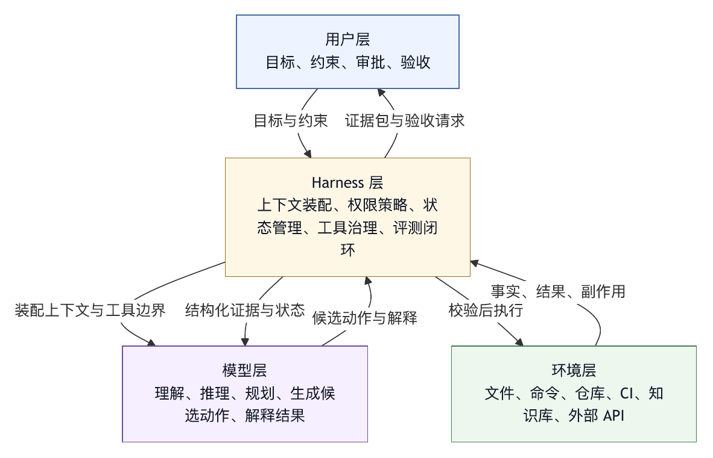

# 第二章 模型、Harness 与环境的系统边界

## 2.1 为什么先谈边界

工程问题常常先表现为边界问题。边界决定一个系统应该负责什么，不应该负责什么；决定故障发生时如何归因；决定接口如何设计；决定组织中的不同团队如何协作。对于智能体系统，边界尤其重要，因为“模型很聪明”这件事很容易掩盖系统结构。

当一个智能体给出错误结果时，团队常常会直接说“模型错了”。这有时成立，但更多时候过于粗糙。也许模型没有看到正确文件；也许工具返回被截断；也许系统指令和项目规则冲突；也许 shell 在错误目录执行；也许权限策略允许了不该允许的动作；也许评测只检查了测试通过，却没有检查行为是否符合需求；也许用户界面没有把高风险操作展示清楚。把这些问题都归因于模型，会让团队错过可改的部分。

Harness engineering 的第一步，是把模型、harness、环境、用户和外部系统分开看。

一个最简化的系统边界可以写成：

```text
用户目标
  -> Harness: 上下文、工具、权限、状态、观测、评测
  -> 模型: 理解、推理、生成、工具选择
  -> Harness: 校验、执行、记录、反馈、恢复
  -> 环境: 文件系统、终端、网络、仓库、CI、业务系统
```

这张图用于说明责任划分，不用于说明箭头顺序。模型不是直接操作世界；harness 也不是替代模型推理；环境不是被动背景；用户不是只在开头输入目标。一个真实智能体系统需要在这些部分之间持续交换信息，并在每一次交换中保持边界。

## 2.2 模型边界：概率能力与运行责任的分离

基础模型的能力可以很强，但它的边界也必须明确。模型擅长根据上下文生成下一步最可能有用的语言、结构化参数、解释、代码或计划。它可以比较方案，可以归纳错误，可以根据工具结果更新判断，可以在上下文中遵守大量规则。可是模型并不天然拥有运行责任。

运行责任包括：

- 判断某个工具调用是否被组织策略允许。
- 确认某个路径是否位于工作区内。
- 决定 shell 命令是否属于危险命令。
- 保证密钥不会进入日志或外部请求。
- 记录用户是否批准过某次修改。
- 在失败后恢复工作区。
- 判断测试结果是否足以证明任务完成。
- 持久保存 session 和 trace。

这些责任不应交给模型“自觉完成”。模型可以参与解释和建议，但最终执行必须由 harness 承担。原因并不复杂：模型输出是概率性的，而运行责任要求确定性、可审计性和可重复性。

这不降低模型的重要性。模型越强，边界越需要清楚。强模型可以处理更多上下文，进行更复杂计划，选择更多工具；如果没有边界，它也能以更快速度制造更复杂的错误。工程上必须把“模型建议什么”和“系统执行什么”分开。

在工具调用系统中，这种分离通常表现为三步：

1. 模型生成工具调用意图和参数。
2. Harness 校验工具、参数、权限、风险和环境。
3. Harness 执行工具，把结果以受控形式返回给模型。

第二步一旦缺失，工具调用就变成模型对环境的直接写权限。这样的系统可以用于低风险实验，但很难进入生产环境。

## 2.3 Harness 边界：运行基底不是业务系统本身

明确模型边界之后，还要明确 harness 自身的边界。Harness 是运行基底，但它不是所有业务逻辑的容器。它不应该把每个业务系统都重写一遍，也不应该把所有组织流程都硬编码在行动循环中。

Harness 的职责是提供通用运行能力：

- 上下文装配：把用户目标、系统规则、项目材料、工具观察和记忆组织给模型。
- 工具接入：把外部能力以 schema、执行器和权限策略的形式暴露给模型。
- 状态管理：维护 session、任务进度、工作区变更和中间产物。
- 安全控制：执行 sandbox、权限、审批、风险分类和密钥保护。
- 可观测性：记录 trace、日志、成本、错误、审批和最终证据。
- 评测与反馈：把任务结果、失败样本和人工反馈纳入改进闭环。

业务系统的职责则是提供领域能力。例如代码仓库负责版本管理，CI 负责构建测试，issue 系统负责需求和缺陷流转，知识库负责文档，数据平台负责查询和权限，审批系统负责组织流程。Harness 不需要替代它们，而是通过工具、协议和策略连接它们。

这个边界可以避免两类错误。

第一种错误是把 harness 做得太薄，只保留模型调用和少量工具。这样系统无法承担生产责任。

第二种错误是把 harness 做成万能业务平台，把每个外部系统的细节都塞进核心运行时。这样系统会变得难以维护，插件和业务集成无法独立演化。

更稳妥的方式是把 harness 核心保持为稳定运行层，把业务能力放入工具、插件、profile、skill、MCP server 或外部 service 中。核心负责统一权限、上下文、执行、观测和状态，外围负责领域能力。

## 2.4 环境边界：真实世界不是字符串

智能体系统常被描述成“模型读取上下文并输出结果”。这个描述对问答系统也许够用，对智能体系统明显不足。智能体的对象已经从字符串扩展到环境。

环境可以包括：

- 本地或远程文件系统。
- Git 仓库、分支、commit、diff 和工作区状态。
- shell、构建工具、测试框架和包管理器。
- 网络、浏览器、HTTP API 和数据库。
- CI、issue、pull request、code review 和部署系统。
- 企业知识库、文档、表格、消息、日历和审批流。
- 用户正在进行的临时工作和未提交修改。

环境有三个特征使它区别于普通上下文。

第一，环境有状态。文件会被修改，命令会改变目录或生成缓存，CI 状态会更新，外部 API 会产生副作用。模型的自然语言输出可以被丢弃，但环境副作用不能总是假装没有发生。

第二，环境有权限。不是所有信息都应该被读取，不是所有动作都可以执行，不是所有外部系统都可以用同一个身份访问。权限问题必须在环境边界处处理，而不是在模型输出之后靠人工补救。

第三，环境有不确定性。命令可能失败，网络可能超时，测试可能 flaky，文件可能被用户同时修改，外部服务可能返回不完整数据。Harness 必须把这种不确定性作为工具结果和状态更新的一部分，而不能只把成功路径喂给模型。

因此，环境不能被简单地序列化成 prompt。Harness 与环境之间需要执行器、适配器、隔离层、监控和回滚机制。环境反馈也不能原样无限制进入上下文，因为工具输出可能很长、含有敏感信息、带有误导性错误或包含 prompt injection。Harness 需要对环境反馈进行裁剪、脱敏、结构化和优先级处理。

## 2.5 用户边界：用户不是一次性输入源

在许多模型调用程序中，用户只是输入 prompt 的人。但在 harness engineering 中，用户是运行时的一部分。用户提供目标、偏好、审批、纠错、验收和责任判断。

用户边界至少包含四种交互。

第一，目标输入。用户告诉系统要完成什么。好的 harness 不仅记录原始目标，还会在任务过程中保留目标摘要，并在上下文压缩后保持目标不丢失。

第二，约束提供。用户可能指定不要改某些文件、不要联网、只做分析不做修改、保持某种代码风格、优先最小变更、必须运行某个测试。这些约束需要进入上下文和权限系统，而不只是停留在最后一条消息中。

第三，审批决策。当智能体准备执行高风险动作时，用户需要看到足够信息来判断是否允许。审批界面必须说明动作、影响范围、风险和可恢复性。一个只显示“是否允许执行命令”的弹窗，很容易造成审批疲劳。

第四，结果验收。用户最终关心的是任务是否真的完成，而不只是智能体的完成声明。Harness 应该帮助用户看到证据：修改了哪些文件，运行了哪些测试，哪些检查未运行，残余风险是什么。

用户参与并不意味着系统低自动化。成熟 harness 的目标是把用户注意力用在高价值判断上，而不是让用户手工监督每个低风险工具调用。读文件、搜索代码、查看 git 状态可以自动执行；删除文件、执行未知安装脚本、访问敏感系统则应请求确认。边界设计的好坏，直接决定用户是把智能体视为助手，还是视为需要不断看守的风险源。

## 2.6 外部系统边界：工具不是函数那么简单

从模型接口看，工具常常表现为函数：一个名字、一段描述、一个 JSON schema、一次调用和一个结果。这个抽象很有用，但它也容易让人低估外部系统的复杂度。

真实工具至少有六个维度。

第一，能力维度。工具能做什么，不能做什么，是否有副作用，是否幂等，是否支持 dry run。

第二，权限维度。工具使用哪个身份访问外部系统，权限来自用户、团队、服务账户还是临时 token，是否需要二次确认。

第三，状态维度。工具调用是否改变环境，改变是否可见，是否可回滚，是否会和其他调用竞争。

第四，成本维度。工具是否消耗外部额度、运行时间、计算资源或付费 API。

第五，失败维度。工具失败如何表达，哪些失败可以重试，哪些失败应停止任务，哪些失败需要用户介入。

第六，安全维度。工具输入是否可能携带 prompt injection，输出是否含敏感信息，参数是否可能被模型构造为越权访问。

如果把工具只当作函数，就会忽略这些维度。Harness engineering 要做的是把工具从“模型可调用函数”提升为“受治理的环境接口”。MCP 等协议的价值在于它们提供了更标准的工具、资源和提示连接方式，但协议本身并不替代 harness 的权限、观测和治理责任〔注2-1〕。

一个成熟工具接口应至少包含：

- 清晰名称和用途。
- 参数 schema 和校验。
- 风险分类。
- 权限策略入口。
- 超时和取消机制。
- 输出大小限制。
- 错误分类。
- 审计记录。
- 对上下文注入风险的处理。

工具接口的质量决定模型能否稳定行动。含糊、过宽、输出不可控的工具，会把行动循环推向不可预测。

## 2.7 上下文边界：模型看见的世界不是全部世界

上下文是 harness 最重要的控制面之一。模型只能根据可见上下文行动，但真实环境的信息远大于上下文窗口。即使模型支持超长上下文，把所有内容塞进去也不是好策略。上下文过大不仅增加成本和延迟，还会引入噪声、冲突和过期信息。

上下文边界要解决三个问题。

第一，选择。哪些信息应该进入当前轮次？用户目标、系统规则、最近工具结果、相关文件片段、错误日志、长期记忆、项目约定，都可能重要，但不能无差别进入。

第二，优先级。系统指令、组织政策、项目规则、用户请求、工具结果和模型历史之间可能冲突。Harness 必须定义优先级，并在上下文中表达出来。没有这个优先级，模型会根据局部语言强度而不是真实权限做判断。

第三，更新。工具结果会改变任务理解，用户纠错会改变计划，文件修改会改变环境状态，历史消息会超过预算。Harness 需要摘要、压缩、检索和遗忘机制。上下文是持续更新的状态投影。

一个重要原则是：模型看见的是经 harness 选择后的世界。这个选择属于工程决策。给少了，模型会盲目；给多了，模型会迷失；给错了，模型会自信地做错。

因此，上下文装配必须可调试。系统需要记录哪些材料进入了上下文，为什么进入，哪些材料被压缩或丢弃，压缩摘要是否保留了关键约束。没有这类 trace，上下文问题会变成最难排查的智能体故障之一。

## 2.8 状态边界：聊天历史不是状态管理

许多早期 LLM 应用把聊天历史当作状态。对于普通对话，这可能勉强可行；对于智能体系统，这远远不够。

智能体的状态包括但不限于：

- 用户原始目标和当前目标摘要。
- 当前计划、已完成步骤和未完成步骤。
- 工具调用历史和观察结果。
- 文件系统变更。
- 工作区 checkpoint。
- 审批结果。
- 失败和重试记录。
- 外部系统返回的任务 id、链接或状态。
- 成本和 token 使用。
- 模型生成但尚未执行的候选动作。

聊天历史只是其中一部分，而且不是最可靠的一部分。聊天历史可能被压缩，可能包含过期计划，可能夹杂模型错误总结，也可能因为上下文预算被截断。把状态管理寄托在聊天历史上，会导致长任务中常见的漂移：系统忘记最初约束，重复做已完成工作，或者基于过期观察继续行动。

Harness 需要独立状态层。状态层不一定复杂，但要明确：哪些状态持久化，哪些状态只在当前 run 内有效，哪些状态进入模型上下文，哪些状态只供 UI 和审计使用，哪些状态可以回滚。对于 coding agent，工作区 diff、checkpoint、测试结果和审批记录尤其重要，因为它们直接关系到任务是否可验证、可恢复。

## 2.9 评测边界：回答正确不等于任务完成

模型评测常常关注回答是否正确。Agent 评测则必须关注任务是否完成。两者差别巨大。

一个 coding agent 可以给出正确的 bug 分析，却没有修改代码；可以修改代码，却没有运行相关测试；可以运行测试，却只运行了无关测试；可以通过测试，却引入不必要重构；可以生成漂亮总结，却没有说明未验证风险。自然语言回答在这里不是充分证据。

评测边界要从模型输出扩展到系统结果：

- 输入任务是否被正确理解？
- 相关上下文是否被找到？
- 工具调用是否合理？
- 环境变更是否符合目标？
- 测试和检查是否覆盖风险？
- 最终产物是否满足用户验收？
- 过程是否遵守权限和安全策略？
- 成本和延迟是否可接受？
- 失败时是否留下足够诊断证据？

SWE-bench 和 Terminal-Bench 的价值在于，它们把评测推向真实软件任务和终端环境，而不是停留在静态文本回答〔注2-2〕。但即使这些 benchmark 也不能完全覆盖组织内部任务。企业 harness 需要把自己的真实失败样本、代码规范、业务约束和安全策略转化为内部评测。

评测也是边界。它决定系统优化什么。如果只优化“模型总结看起来完整”，系统会学会更好地解释自己；如果优化“任务完成并通过有效验证”，系统才会朝可靠行动改进。

## 2.10 一个工作性边界模型

综合以上讨论，本书采用以下工作性边界模型：

```text
用户层
  目标、约束、审批、纠错、验收

Harness 层
  上下文装配
  行动循环
  工具治理
  权限与 sandbox
  状态与 checkpoint
  记忆
  可观测性
  评测与反馈
  产品界面

模型层
  语言理解
  推理与规划
  代码生成
  工具选择
  结果解释

环境层
  文件系统
  shell
  代码仓库
  CI 与测试
  文档与知识库
  外部 API
  企业系统
```

这张图表达责任分布，不追求严格的物理部署。实际系统中，某些功能可能由同一个进程实现，也可能分布在本地 CLI、云服务、IDE 插件、MCP server 和企业平台之间。无论部署如何变化，责任边界仍然有效。

边界模型可以用于诊断问题。例如：

- 如果智能体没有遵守用户要求，检查用户约束是否进入上下文和权限系统。
- 如果智能体调错工具，检查工具描述、schema、错误反馈和模型能力。
- 如果智能体越权访问，检查 harness 权限层，而不是只改 prompt。
- 如果智能体忘记任务目标，检查状态层和上下文压缩。
- 如果智能体宣布完成但实际未完成，检查评测边界和验收证据。
- 如果用户不信任智能体，检查可观测性和交互界面。

这种诊断方式能把“模型不行”拆成可改进的工程问题。

## 2.11 边界图如何用于架构评审

边界模型如果只停留在文档里，价值有限。它的价值在于进入架构评审、事故复盘和产品设计评审。对于智能体系统，边界评审不应只问“模型调用链是否通了”，而要问“每一次从语言到行动的转换是否有责任主体、证据和恢复路径”。

一种实用做法是选择三类代表性任务画边界图。

第一类是低风险任务，例如读取项目文件、总结文档、解释错误日志。这类任务主要检验上下文选择、输出可信度和信息脱敏。评审重点是：模型看见了哪些材料，材料是否过期，工具输出是否可能包含敏感信息，最终总结是否区分事实和推断。

第二类是中风险任务，例如修改代码、生成配置、运行测试、创建文档。这类任务会产生工作区副作用。评审重点是：写入边界在哪里，diff 如何展示，用户未提交修改如何保护，测试结果如何记录，失败时如何回滚或停止。

第三类是高风险任务，例如删除文件、执行安装脚本、调用外部服务、推送代码、发送消息、访问生产数据。这类任务必须把权限和审批作为核心路径，而不是作为异常处理。评审重点是：动作由谁发起，使用哪个身份，审批展示哪些信息，是否有 dry run，是否可撤销，审计记录是否完整。

每一类任务都可以画出四条流。

第一条是数据流：信息从哪里来，经过哪些裁剪、脱敏和摘要，最终进入模型上下文的是什么。

第二条是控制流：模型产生什么候选动作，harness 如何校验，哪些动作自动执行，哪些动作等待用户，哪些动作被拒绝。

第三条是状态流：任务进度、工具结果、文件变更、审批结果和外部系统 id 存在哪里，哪些状态会进入后续上下文，哪些只用于审计。

第四条是证据流：系统最终用什么证明任务完成，测试、diff、日志、人工验收和外部链接如何组合成完成证据。

边界评审的常见失败，是只画组件框图，不画责任流。组件框图会告诉我们有模型、有工具、有数据库、有前端，却不会告诉我们密钥在哪里脱敏、谁能批准危险命令、测试失败如何阻止完成声明、用户取消任务后后台工具是否继续运行。对于 harness engineering，更有价值的是责任图和证据图。

边界图还可以用于预演事故。评审者可以提出具体失败假设：如果模型误解用户目标，哪一层能发现？如果工具输出被 prompt injection 污染，哪一层会隔离？如果测试命令在错误目录运行，哪一层能记录和纠正？如果用户说“只分析不要修改”，哪一层会阻止写文件？如果系统总结完成但没有跑测试，哪一层会暴露未验证风险？这些问题会迅速暴露设计中的空洞。

因此，边界评审不是形式主义。它是把智能体系统从“能跑起来”推进到“能承担责任”的关键活动。

## 2.12 例子：一次错误文件修改的边界归因

考虑一个真实团队很容易遇到的事故：用户对智能体说“帮我分析一下为什么登录页加载慢，先不要改代码”。智能体搜索代码后，发现一个明显可优化的请求逻辑，于是直接修改了登录页组件和一个公共请求工具。最终分析可能是对的，修改甚至可能有效，但它违反了用户明确约束。

如果只把事故归因于“模型没有听话”，团队通常会追加一条更强的提示词：“用户说不要修改时绝对不要修改”。这有帮助，但不充分。用边界模型分析，会看到至少五个责任点。

第一，用户约束边界失效。“先不要改代码”不应只存在于聊天文本中，而应被提升为当前任务模式：read-only analysis。这个模式应进入上下文，也应进入权限系统。模型接收约束，执行层也必须执行约束。

第二，上下文边界失效。系统也许在压缩历史时保留了“分析登录页加载慢”，却丢掉了“先不要改代码”。摘要机制没有把约束作为高优先级信息处理。对于智能体，任务目标和禁止事项同样重要，甚至禁止事项在安全上更重要。

第三，工具边界失效。文件编辑工具没有检查当前任务模式，或者检查只依赖模型自述。正确做法是：当 session 处于只读模式时，写文件工具在 harness 层直接不可用，或必须进入显式审批流程。不能让模型决定自己是否遵守只读模式。

第四，交互边界失效。用户界面如果没有显示当前运行模式，用户可能以为系统仍在分析，而实际上已经进入修改。成熟界面应让用户看到智能体当前是否有写权限、是否即将产生副作用、是否存在待批准动作。

第五，评测边界失效。最终总结如果只说“已优化登录页加载速度”，就进一步掩盖了事故。系统应明确指出本次任务原本是只读分析，任何写入都应被视为越界；如果写入已经发生，必须列出 diff、提供恢复路径，并标记为策略违规。

这个事故是边界链条连续失守。模型确实生成了错误行动，但 harness 没有把用户约束固化为状态，没有让工具系统执行模式边界，没有通过 UI 展示风险，也没有用评测层阻止错误完成声明。

修复应对应到多个层次：把“只读分析”做成正式运行模式；把禁止写入作为权限策略；在上下文摘要中保留用户约束；在 UI 中显示模式；在 trace 中记录被拒绝的写操作；在回归评测中加入“用户禁止修改但模型尝试修改”的样本。这类改进才会进入 harness。

## 2.13 图 2-1：责任边界与证据流

图 2-1 将责任边界、证据流和归因关系放在同一视图中，便于后续讨论边界契约。

<figure><figcaption><p>图 2-1：责任边界与证据流</p></figcaption></figure>

```text
用户层
  目标、约束、审批、验收
      |        ^
      v        |
Harness 层 ----+
  上下文装配：把目标和证据投影给模型
  权限策略：把约束转化为可执行规则
  状态管理：保存进度、模式、checkpoint
  工具治理：校验参数、执行动作、记录结果
  评测闭环：判断是否满足验收条件
      |        ^
      v        |
模型层 --------+
  理解、推理、规划、生成候选动作、解释结果
      |        ^
      v        |
环境层 --------+
  文件、命令、仓库、CI、知识库、外部 API
```

图中有两个方向。向下的方向是行动链：用户目标经过 harness 组织后进入模型，模型产生候选动作，harness 校验并执行到环境。向上的方向是证据链：环境返回结果，harness 结构化和记录证据，模型解释意义，用户据此验收。

责任边界可以这样理解：模型层可以提出候选动作和解释，但不能直接越过 harness 访问环境；环境层可以产生事实和副作用，但不能无条件进入上下文；用户层可以给出目标和约束，但这些信息必须被 harness 转化为状态和策略；harness 层承担转换、校验、记录和恢复责任。

这张图也能解释为什么“把所有规则写进 prompt”不够。Prompt 位于上下文装配的一部分，只能影响模型生成；权限策略、工具执行、状态持久化和证据记录必须在 harness 层实现。模型可以被要求不要写文件，阻止写文件的职责则属于工具系统和权限系统。

## 2.14 本章检查表

评审一个智能体系统的边界时，可以逐项检查：

1. 模型、harness、环境、用户和外部系统的责任是否分别写清楚？
2. 模型输出是否始终被视为候选动作，而不是直接动作？
3. 用户约束是否会进入状态层和权限层，而不仅是进入 prompt？
4. 每个有副作用的工具是否明确了身份、权限、风险、幂等性和回滚方式？
5. 工具输出是否经过裁剪、脱敏和结构化后再进入上下文？
6. 长任务状态是否独立于聊天历史保存？
7. 工作区、网络、外部 API 和敏感数据是否有独立边界？
8. 审批界面是否展示动作、影响范围、风险和恢复方式？
9. 完成声明是否绑定到测试、diff、日志、外部状态或人工验收等证据？
10. 事故复盘是否能定位到具体边界层，而不是笼统归因于模型？

这些问题的答案越清楚，系统越容易维护和扩展。答案越含糊，后续关于工具、安全、观测和评测的设计就越容易摇摆。

## 2.15 边界契约：把责任写成可执行协议

边界图能帮助团队理解系统，但生产环境还需要一种更硬的表达：边界契约。这里的“契约”指 harness 在运行时可以读取、执行、记录和审计的责任协议，而非法律意义上的合同。它把架构评审中的边界判断转化为配置、策略、状态和证据要求。

一个边界契约至少要回答七个问题。

第一，当前 run 属于什么运行模式。是只读分析、受控修改、自动修复、批量迁移、数据查询，还是外部系统写入？运行模式决定默认工具集、权限强度、审批条件和完成证据。如果运行模式没有显式表达，系统就只能从用户文字中推断风险，推断错误时很难补救。

第二，模型能产生什么类型的候选动作。模型可以建议读取文件、提出修改、选择测试、生成 API 参数、解释外部系统结果，但这些动作在进入环境前都应处于候选状态。边界契约要明确候选动作如何被 harness 接收：是结构化工具调用、计划对象、补丁对象、审批请求，还是自然语言建议。

第三，harness 在哪些点拥有最终裁决权。工具是否可用、路径是否可写、命令是否危险、输出是否可进入上下文、用户是否已经授权、完成证据是否足够，这些判断不能交给模型自我声明。契约要把裁决点绑定到具体模块：权限引擎、工具执行器、上下文装配器、质量门禁、审批界面或审计系统。

第四，环境副作用如何分类。读取文件、运行测试、安装依赖、修改代码、推送分支、发送消息、写入数据库，不是同一种行为。契约应为每类副作用定义风险等级、默认权限、是否允许自动执行、是否需要 dry run、是否必须留存恢复信息。风险分类越清楚，用户审批越不会沦为“什么都问一遍”的噪声。

第五，用户约束如何进入系统。用户说“只分析不要修改”“不要联网”“不要动配置文件”“优先最小改动”，这些约束不能只保留在聊天历史里。契约要规定它们如何被解析成状态字段、权限规则和最终验收条件。尤其是禁止性约束，要优先进入权限层；偏好性约束可以进入 prompt、计划和评测层。

第六，证据如何形成。完成声明必须绑定证据来源：diff、测试输出、命令退出码、外部系统状态、人工验收、审计日志或失败说明。契约要规定哪些证据是必需的，哪些证据可以替代，哪些情况下必须明确说明未验证。没有证据契约，最终回答会过度依赖模型叙述。

第七，异常如何升级。工具失败、权限拒绝、上下文冲突、外部服务超时、用户指令互相矛盾、敏感数据暴露风险，这些异常不能都交给模型继续猜。契约要定义哪些异常可以重试，哪些需要请求用户，哪些应停止 run，哪些要触发事故记录或安全审查。

下面是一个简化的边界契约示意：

```text
boundary_contract:
  run_mode: read_only_analysis
  user_constraints:
    - no_file_write
    - no_network_access
  model_actions:
    allowed:
      - propose_plan
      - request_read
      - summarize_findings
    forbidden:
      - execute_write
      - call_external_api
  harness_decisions:
    context: source_filter + priority_policy
    tools: allowlist + risk_classifier
    permissions: read_only_workspace_policy
    completion: evidence_gate
  environment_effects:
    read_file: auto_allow
    run_test: ask_if_costly
    write_file: deny
    network_call: deny
  evidence_required:
    - cited_files_or_logs
    - clear_fact_inference_split
    - unresolved_questions
  escalation:
    conflicting_instruction: ask_user
    sensitive_output_detected: redact_and_log
    write_attempt_in_read_only_mode: deny_and_record
```

这个示意用于说明边界契约应具备机器可处理的形态，不要求所有系统采用同一种固定格式。它可以存在于配置文件、数据库记录、运行时对象、策略引擎或平台控制面中；关键是它不能只存在于架构师脑中，也不能只靠模型在 prompt 中“记住”。

边界契约还有一个组织价值：它让跨团队讨论有共同对象。模型团队可以说明模型输出契约，平台团队可以说明执行契约，安全团队可以审查权限契约，产品团队可以设计审批和证据界面，业务团队可以定义验收标准。没有边界契约时，所有讨论都容易滑向抽象判断：“模型应该更聪明”“用户应该更小心”“工具应该更安全”。有契约之后，讨论会变成可修改的工程问题。

## 2.16 运行时不变量：边界不能只在设计稿里成立

边界契约需要通过运行时不变量来守住。所谓不变量，是系统在任何任务、任何模型、任何上下文长度和任何异常路径下都必须保持成立的约束。这些约束属于 harness 的底线。

第一个不变量：模型输出永远是候选，不是事实本身，也不是环境动作本身。模型可以说“测试通过”，但事实来自测试工具记录；模型可以说“我将修改文件”，但修改动作来自编辑工具；模型可以说“这个命令安全”，但安全判断来自权限层。只要系统把模型叙述直接当作事实来源，就会在观测、评测和审计上失去基础。

第二个不变量：任何有副作用的动作都必须经过 harness 校验。副作用不仅包括写文件和调用外部 API，也包括安装依赖、启动服务、生成缓存、修改本地配置、订阅事件、创建远程资源。校验内容至少包括工具身份、参数合法性、路径边界、权限策略、风险等级和可恢复性。模型可以提出理由，但理由不能绕过校验。

第三个不变量：用户约束必须同时进入上下文和控制面。进入上下文，是为了让模型理解任务；进入控制面，是为了让系统强制执行。只进入上下文会变成软提醒，只进入控制面又会让模型不理解为什么某些动作被拒绝。二者结合，才会形成可解释的约束执行。

第四个不变量：外部内容默认不可信。网页、issue、README、日志、数据库字段、用户上传文档和工具输出都可能包含错误、过期信息、敏感数据或恶意指令。Harness 应标注来源、限制优先级、做必要脱敏，并避免让外部内容伪装成系统指令。这个不变量是防御 prompt injection 和工具输出污染的基础。

第五个不变量：完成必须有证据，不能只有叙述。对代码任务，证据可能是 diff、测试、类型检查、审稿意见和未验证说明；对数据任务，证据可能是查询语句、口径、样本、结果校验和导出记录；对文档任务，证据可能是引用来源、冲突处理和版本链接。最终回答可以由模型组织语言，但证据应来自 harness 记录。

第六个不变量：环境变化必须可追踪。系统至少要知道哪些文件变了、哪些命令运行过、哪些外部资源被创建、哪些审批发生过、哪些失败被忽略或重试。没有追踪，恢复无法发生；没有恢复，用户很难把高价值任务交给智能体。

第七个不变量：异常路径不能比成功路径更少治理。很多事故发生在标准流程之外，比如“测试失败后顺手改更多文件”“权限拒绝后换一个工具”“上下文不够后猜测答案”“用户中途改需求后沿用旧计划”。运行时不变量要覆盖这些转弯处：失败后是否允许扩大范围，重试是否受预算限制，用户新约束是否覆盖旧计划，拒绝动作是否进入 trace。

这些不变量应尽量被实现为代码、策略和门禁，而不是写在文档里等待人记住。文档的作用是解释原因和提供审查入口；边界成立，依赖每次工具调用、每次状态更新、每次上下文装配和每次完成判断都执行相同规则。

## 2.17 边界评审的输出物

一个严肃的边界评审不应只产生会议纪要。它至少应产出四类可以被后续工程使用的材料。

第一类是责任矩阵。矩阵的行可以是关键行为：理解目标、选择上下文、调用工具、执行写入、请求审批、记录状态、判断完成、处理失败；列可以是用户、模型、harness、工具、环境、外部系统和人工运营。每个单元格不必都填满，但每个关键行为必须有唯一的最终责任主体。共同参与可以存在，最终裁决不能含糊。

```text
行为                  最终责任主体        辅助参与者
解析用户禁止事项        Harness             模型、用户界面
选择候选修复方案        模型                 Harness 提供上下文
判断写文件是否允许      Harness 权限层       用户审批
执行文件修改            工具执行器           Harness 状态层
证明任务完成            质量门禁             模型组织说明
处理测试失败            行动循环             模型、工具、用户
```

第二类是流图。数据流回答“信息从哪里来，如何进入模型”；控制流回答“动作如何产生、校验和执行”；状态流回答“系统记住什么，在哪里记住”；证据流回答“用户凭什么相信结果”。流图不需要复杂，但必须覆盖异常路径。只画成功路径的流图，会让系统在第一场真实事故中暴露盲区。

第三类是策略清单。评审后应能明确哪些策略已经存在，哪些需要实现，哪些由人工流程承担。策略清单可以包括路径写入策略、shell 风险策略、网络访问策略、敏感信息策略、审批策略、工具输出预算、上下文优先级、完成门禁和回滚策略。每项策略都应关联到运行模式和工具类别；缺少这种关联，规则很容易彼此孤立。

第四类是 trace 字段清单。很多团队在事故后才发现日志里没有关键字段。边界评审应提前定义需要记录什么：run id、用户目标摘要、运行模式、工具名、参数摘要、权限决策、审批结果、工作目录、影响文件、退出码、输出摘要、模型版本、上下文包版本、完成证据和异常分类。trace 字段要服务未来复盘，让团队能够定位责任边界。

此外，边界评审还应形成风险接受记录。并不是所有边界都能在第一版中做到最强。例如某些内部试点可以暂时没有复杂回滚，某些低风险读操作可以不要求人工审批，某些离线评测可以先用抽样方式。关键是团队要明确：这是经过选择的风险接受，不是因为没人想到。风险接受记录应包括范围、期限、补救计划和退出条件。

当这些输出物存在时，后续章节讨论工具、权限、sandbox、trace、评测和组织治理，就不是从零开始。它们都可以回到边界契约：这个控制保护的是哪条边界？这个指标观察的是哪条边界？这个事故打破的是哪条不变量？Harness engineering 的系统性，正是由这些可追踪的边界材料建立起来的。

## 2.18 边界不是一次性设计

边界设计很容易被误解为架构初期的一次性工作：画一张图，开一次评审会，写几条原则，然后系统就有了边界。真实情况正好相反。智能体系统的边界会随着模型能力、工具集合、用户群体、数据范围和组织流程变化而持续移动。Harness engineering 需要把边界当作运行中的治理对象，而不是项目启动阶段的静态说明。

模型升级会移动边界。更强的模型可能更会规划、更会使用工具、更会发现环境中的隐藏机会，也更可能主动扩大任务范围。原来只是辅助回答的模型，升级后可能生成更完整的行动计划；原来需要用户明确要求才会调用的工具，新模型可能更主动选择。模型能力提升是好事，但也要求重新检查工具权限、默认运行模式和完成门禁。不重新检查，系统会在不改变代码的情况下改变行为。

工具扩展会移动边界。一个智能体从只读文件工具扩展到编辑工具，从本地 shell 扩展到网络工具，从 GitHub 扩展到企业消息和数据平台，每一步都把责任推向新的环境。工具越多，工具之间的组合风险越高。单个工具看似低风险，组合后可能形成高风险路径：读取配置、生成脚本、调用 shell、发送结果到外部系统。边界治理必须关注工具组合，而不只是单点工具。

用户群体变化也会移动边界。早期试点用户通常理解系统限制，愿意容忍失败，也能自行判断结果。扩大到普通业务用户后，系统需要更清楚的状态展示、更保守的默认权限和更明确的完成证据。一个给专家使用的智能体，可以把更多判断留给用户；一个给大量普通用户使用的平台，必须把更多判断固化到 harness 中。

数据范围变化同样重要。只处理公开文档与处理企业内部数据，属于不同系统边界；只读取开发仓库与读取生产日志，也属于不同系统边界。数据敏感度提升后，上下文装配、输出脱敏、trace 保留、模型供应商选择和用户权限继承都要重新评审。很多系统的边界事故源于后续接入了更敏感的数据，却沿用了原来的运行策略，并不一定源于初始设计错误。

组织流程变化也会重塑边界。智能体一开始可能只是个人助手，后来进入 PR 流程、值班流程、数据分析流程、客户支持流程或发布流程。一旦智能体成为流程节点，它就不再只是工具，而是组织责任链的一部分。此时边界设计要回答：它的输出是否能触发下一步流程？谁验收？谁负责异常？失败是否进入事故系统？这些问题超出了模型调用本身，却决定系统能否进入生产。

成熟团队会建立边界变更触发器。只要发生模型升级、工具新增、权限扩大、数据源变更、用户范围扩大、自动化程度提高或事故暴露，就启动边界复核。复核不一定庞大，但应检查三件事：原有契约是否仍然成立，运行时不变量是否被新能力绕过，trace 和评测是否覆盖新的风险路径。

边界治理的目标是让系统进化有可见轨道，而不是把系统限制到不能进化。一个边界明确的系统可以大胆增加能力，因为每次能力增加都会对应到权限、状态、证据和评测的更新。一个边界含糊的系统则相反，功能越多越难信任，最终不得不靠人工盯防和事故后补救维持运转。

如果团队暂时无法补齐所有边界，也应显式记录“边界债务”。边界债务不是普通技术债，它直接影响系统能承担的任务范围。比如尚未实现回滚，就不应默认开放大规模批量写入；尚未记录审批上下文，就不应让智能体代表用户执行外部发送；尚未建立敏感信息脱敏，就不应把生产日志原样进入模型上下文。把这些债务写清楚，团队才能知道哪些能力可以试点，哪些能力必须等待治理能力补齐。

## 2.19 第二章小结

Harness engineering 首先要求边界清晰。模型负责生成和推理，但不承担最终运行责任；harness 负责把模型能力接入环境，并提供上下文、工具、权限、状态、观测和评测；环境提供真实任务对象，同时带来状态、副作用和不确定性；用户提供目标、约束、审批和验收；外部系统通过受治理工具接入。

如果边界不清，团队会把所有问题都归因于模型，或者把所有业务细节都塞进 harness，最终得到一个既不安全也不可维护的系统。边界清楚之后，后续章节才能进一步讨论上下文装配、工具系统、权限治理和评测闭环。

下一章将进入提示词工程与 harness engineering 的关系。我们会更具体地讨论：提示词仍然重要，但为什么它无法单独承担智能体运行时的工程责任。
