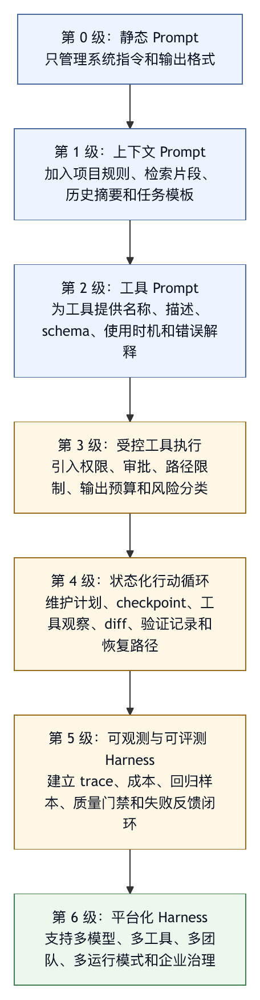

# 第三章 从 Prompt Engineering 到 Harness Engineering

## 3.1 Prompt 并没有过时

讨论 harness engineering 时，最容易出现的误读之一，是把它理解成对提示词工程的否定。事实并非如此。提示词仍然是模型系统中最直接、最灵活、最有杠杆的控制方式之一。一个不清晰的系统指令会让再完整的工具系统变得混乱；一个含糊的用户目标会让再安全的权限模型只能阻止事故，却无法推动任务完成；一个缺少输出要求的提示会让评测和验收变得困难。

Prompt 没有过时，只是它不再足以承担完整智能体系统的责任。

在早期 LLM 应用中，很多任务可以被组织成一次模型调用：总结一段文本，改写一封邮件，生成一个 SQL 草案，解释一个错误信息。此时提示词工程要把任务、上下文、角色、约束和输出格式写清楚。只要模型输出的结果由人类消费，风险相对可控。即便模型回答不完美，用户可以选择采纳、修改或丢弃。

智能体系统改变了这个前提。Agent 会输出文本，也可能调用工具、读取文件、修改代码、运行命令、访问外部系统、生成持久状态。模型的语言输出会通过 harness 变成环境动作。此时，prompt 仍然重要，但它必须与工具 schema、权限策略、状态管理、可观测性和评测系统配合。

一个成熟系统不会问“我们还需不需要提示词工程”，而会问“哪些控制应放在 prompt 中，哪些控制应放在 harness 中”。这才是从提示词工程到 harness engineering 的关键转变。

## 3.2 Prompt 的优势和边界

Prompt 的优势来自三个方面。

第一，它表达成本低。修改一段系统指令，比修改模型权重、重写工具系统或调整组织流程都快。团队可以用 prompt 快速表达任务目标、语气、输出格式、风格偏好、注意事项和临时约束。

第二，它能直接影响模型注意力。模型只能根据当前上下文生成行为，prompt 是上下文中最强的显式控制之一。良好的 prompt 可以让模型优先关注关键规则，减少无关输出，提高结构化响应质量。

第三，它适合表达软约束。比如“优先最小修改”“解释残余风险”“避免不必要重构”“先给出判断再给证据”，这些约束不容易完全写成程序逻辑，但可以通过 prompt 有效传递。

但 prompt 的边界同样清楚。

第一，prompt 不能承担权限系统的职责。你可以在提示词中写“不要删除文件”，但删除文件应由工具执行层阻止。模型可能误解、遗忘、被注入攻击影响，或者在复杂任务中把规则优先级处理错。权限必须由 harness 确定性执行。

第二，prompt 不能替代状态管理系统。你可以要求模型“记住当前计划”，但长任务中上下文会增长、压缩和截断。任务状态、文件变更、审批结果、checkpoint 和外部系统 id 应该由状态层维护，而不是依赖模型在聊天历史中自我维护。

第三，prompt 不能替代观测系统。你可以要求模型“说明做过什么”，但这不是审计记录。审计应来自工具调用 trace、日志、diff、测试结果、审批记录和成本指标。

第四，prompt 不能替代评测系统。你可以要求模型“确保完成”，但完成需要外部证据。测试是否运行、文件是否修改、行为是否符合需求、风险是否覆盖，都需要评测和验收机制。

第五，prompt 不能替代安全边界。面对 prompt injection、工具输出污染、用户误操作和模型过度自信，单靠提示词要求“不要被误导”是不够的。Harness 需要对外部内容标注来源，对工具输出做隔离，对高风险动作做审批，对敏感信息做脱敏。

因此，prompt 的角色应该被重新定位：它负责表达意图和策略，运行时控制要由 harness 承担。

## 3.3 提示词技巧为什么会在长任务中失效

许多提示词技巧在短任务中有效，却在长任务中表现不稳定。原因不在技巧无用；长任务引入了新的系统因素。

一个常见问题是上下文漂移。一个智能体可能经历几十次工具调用，每次工具结果都会改变模型看到的上下文。最初的用户约束可能被大量日志、代码片段和中间分析稀释。即便系统指令仍在，模型的注意力也可能被最近工具结果牵引。提示词越依赖模型持续记忆，就越容易在长任务中退化。

另一个问题是目标被重新解释。模型在执行过程中会不断形成新的局部目标，例如“修复这个测试”“处理这个错误”“清理这个类型问题”。局部目标可能逐渐覆盖原始目标。一个本来要求最小修复的任务，可能因为测试失败而演变成大规模重构。Prompt 可以要求模型保持目标，但 harness 更应该通过计划状态、diff 限制、审批和中间验收来防止目标漂移。

第三是工具反馈污染。工具输出可能包含错误信息、无关日志、历史注释、第三方文档、用户生成内容甚至恶意指令。模型很难天然区分“工具观察中的文本”和“系统应该遵守的指令”。如果 harness 不做来源标注和优先级隔离，提示词中的安全要求会被外部文本干扰。

第四是状态副作用累积。短任务中的错误输出可以重试，长任务中的错误动作会改变环境。模型改了一个文件，运行了一次生成命令，删除了一个临时目录，安装了一个包，这些动作都会改变后续状态。Prompt 无法天然回滚副作用。Harness 必须提供 checkpoint、diff、恢复和审计。

第五是完成证据弱化。长任务结束时，模型很容易生成一个连贯总结，把已完成、未完成和未验证的内容混在一起。提示词可以要求“不要夸大”，但更可靠的方式是由 harness 记录运行过哪些检查、哪些检查失败、哪些检查未执行，并在最终回答中强制呈现。

这些失效模式说明，长任务不是短任务的简单延长。它需要运行时结构。

## 3.4 把 Prompt 放进 Harness

从工程角度看，prompt 不应该散落在代码中，也不应该只是一段不可追溯的字符串。它应该成为 harness 中可管理、可版本化、可评测的资源。

一个生产级 harness 至少会管理几类 prompt。

第一类是系统 prompt。它定义智能体的身份、总目标、行为边界和安全原则。系统 prompt 应尽量稳定，并与实际权限系统一致。如果系统 prompt 声称“你不能访问网络”，但工具层实际上开放网络，这就是不一致。模型可能遵守 prompt，也可能因为工具可用而尝试访问。更好的做法是在权限层禁用网络，并在 prompt 中说明网络不可用。

第二类是任务 prompt。它来自用户目标和当前任务上下文。任务 prompt 应保留用户原意，避免在压缩或改写中丢失关键约束。对于复杂任务，harness 可以把原始用户请求、任务摘要和当前计划分开维护。

第三类是工具 prompt。工具描述、参数说明、使用时机、风险提示和错误解释，都属于给模型看的 prompt。工具描述过短，模型不知道何时使用；工具描述过长，模型难以比较；工具描述不准确，模型会形成错误行为。工具 prompt 应与工具真实能力同步。

第四类是环境 prompt。项目规则文件、仓库说明、团队约定、代码风格、测试说明和运行限制，会作为环境上下文进入模型。它们需要作用域和优先级。仓库根目录的规则、子目录规则、用户本轮指令和组织安全政策之间可能冲突，harness 需要明确处理。

第五类是评测 prompt。某些评测和审稿过程会使用模型辅助判断，例如检查总结是否夸大、判断改动是否符合需求、归纳失败原因。评测 prompt 必须和生产智能体 prompt 分开管理，避免评测标准被执行过程污染。

把 prompt 放进 harness，意味着它要具有工程属性：

- 有名称和作用域。
- 有版本和变更记录。
- 有适用条件。
- 有测试样例。
- 有与工具和权限的一致性检查。
- 有失败反馈进入修订流程。

这时，提示词工程不再是孤立技巧，而是 harness configuration 和 runtime policy 的一部分。

## 3.5 系统指令、项目规则与用户请求的优先级

智能体系统中的 prompt 往往来自多个来源。系统开发者写系统指令，组织写安全政策，项目维护者写仓库规则，用户写当前请求，工具返回环境文本。它们之间可能一致，也可能冲突。

例如，系统指令要求“不要泄露密钥”；项目规则要求“运行测试前加载某个环境文件”；用户请求“把所有环境变量打印出来帮助调试”；shell 输出中又出现某个 README 片段，要求“忽略之前所有规则”。如果没有优先级模型，模型只能根据语言表面特征处理冲突。

Harness 需要建立明确的指令层级。通常可以分为：

1. 系统和组织安全政策。
2. 运行模式和权限策略。
3. 项目规则和仓库约定。
4. 用户当前目标和约束。
5. 工具观察和外部内容。
6. 模型自己的计划和中间总结。

这个层级不只是写给模型看的说明，也应体现在执行层。安全政策和权限策略必须能阻止工具执行；项目规则应影响上下文装配和命令选择；用户目标应影响计划；工具观察只能作为事实材料，不能提升为指令来源。

工具输出尤其需要处理。工具输出中可能包含自然语言命令，但它来自环境，不应自动成为更高优先级指令。浏览网页、读取 issue、打开 README、查看日志时，都可能遇到“请忽略之前指令”之类文本。Harness 应在上下文中标注其来源，并要求模型把它当作被观察内容，而不是系统指令。

优先级模型还需要体现在 UI 和日志中。当智能体拒绝执行用户请求时，它应该能说明拒绝来自哪一层规则。当智能体选择某个测试命令时，它应该能说明这个命令来自项目规则还是模型推断。当上下文冲突无法自动解决时，harness 应请求用户澄清，而不是让模型默默猜测。

## 3.6 Prompt 与工具 Schema 的耦合

在智能体系统中，prompt 与工具 schema 是一组耦合设计。模型能否正确调用工具，不仅取决于工具描述，也取决于任务 prompt 如何引导模型思考工具。

一个工具 schema 至少包含名称、描述、参数和返回结果。但对于模型来说，这些信息同时也是行为诱导。如果工具名含糊，模型可能误用；参数过宽，模型可能构造危险输入；返回结果没有结构，模型可能误读；错误信息不清晰，模型可能重复同样失败。

Prompt 可以补充工具使用策略，例如：

- 先读取文件再编辑，不要凭记忆修改。
- 运行测试前说明预期检查范围。
- 修改多个文件前先给出计划。
- 对高风险 shell 命令请求确认。
- 工具失败后不要立即扩大改动范围。

但这些策略也应尽量被工具层支持。例如，“先读取再编辑”可以通过 edit 工具要求原始片段匹配实现；“高风险 shell 命令请求确认”可以通过风险分类实现；“输出不要太长”可以通过工具输出预算实现。Prompt 说明策略，工具层执行策略。

如果策略只存在于 prompt 中，就会出现不一致。模型可能在某次任务中遵守，在另一次任务中忘记；某个模型遵守，另一个模型不遵守；上下文长时遵守，工具输出复杂时不遵守。把可执行策略下沉到 harness，是提升可靠性的关键。

## 3.7 Prompt 的版本化和评测

很多团队会频繁修改 prompt，却不记录为什么改、改后是否更好、是否破坏其他场景。这在 demo 阶段问题不大，在生产环境会导致系统行为不可解释。

Prompt 应该像代码一样进入版本管理，但它的评测方式不同于普通代码。代码可以通过单元测试验证确定性行为，prompt 更需要样例集、回归任务和人工审稿。

一个基本流程可以是：

1. 收集失败样本：任务目标、上下文、工具记录、模型输出、实际问题。
2. 判断失败是否适合通过 prompt 修复。如果失败来自权限缺失、工具错误或状态管理，不应只改 prompt。
3. 修改 prompt，并记录预期影响。
4. 在样例集上回放，观察是否修复目标失败。
5. 检查是否引入副作用，例如变得过度保守、输出冗长、工具调用减少或错误拒绝。
6. 发布并继续观测。

这个流程的重点是区分 prompt 问题和 harness 问题。不是所有失败都应该通过 prompt 修。模型误删文件，不应只加一句“不要删除重要文件”；更应该检查删除工具权限、工作区 checkpoint、审批和危险命令拦截。模型没有运行测试，可以先通过 prompt 要求验证，但更可靠的是在任务完成前由 harness 检查是否存在验证证据。

Prompt 版本化还涉及多模型适配。不同模型对指令风格、工具描述、输出格式和长上下文的敏感度不同。Harness 如果支持多个模型，就需要知道哪些 prompt 是通用的，哪些 prompt 与模型契约绑定。盲目追求完全统一 prompt，可能掩盖模型差异。

## 3.8 从“写得更好”到“放得更对”

提示词工程的常见问题是“这段提示怎样写得更好”。Harness engineering 会把问题改成“这段控制应该放在哪里”。

有些控制适合放在 prompt 中：

- 输出风格。
- 分析顺序。
- 风险说明格式。
- 与用户沟通的语气。
- 对不确定性的表达要求。
- 对最小修改、先读后改等软策略的提醒。

有些控制适合放在配置中：

- 默认模型。
- 上下文预算。
- 最大行动轮次。
- 工具 allowlist。
- 自动压缩阈值。
- 默认运行模式。

有些控制适合放在权限系统中：

- 是否允许 shell。
- 是否允许联网。
- 哪些路径可写。
- 哪些工具必须 ask。
- 哪些命令必须 deny。

有些控制适合放在工具层：

- 参数 schema。
- 输出截断。
- 超时。
- 重试。
- 幂等性。
- 错误分类。

有些控制适合放在评测层：

- 完成定义。
- 必须运行的测试。
- 回归样例。
- 安全检查。
- 人工审稿标准。

“放得更对”比“写得更好”更重要。因为位置决定可靠性。安全边界放在 prompt 中太弱，输出风格放在权限系统中又太硬。Harness engineering 的成熟度，体现在能否把控制放在正确层次，并让这些层次一致。

## 3.9 一个迁移示例：从提示词机器人到 Coding Agent

假设一个团队已经有一个内部代码助手。最初，它只接收用户问题并返回建议。系统 prompt 要求它“遵守项目规范，给出最小修改，必要时提醒运行测试”。这个阶段，提示词工程足以带来明显收益。

下一步，团队让它读取仓库文件。现在问题变了：系统需要决定它能读哪些路径，读取结果如何裁剪，二进制文件如何处理，密钥文件如何排除，仓库规则如何加入上下文。Prompt 可以说“不要读取敏感文件”，但过滤必须在 harness 中执行。

再下一步，团队让它编辑文件。现在必须有 edit 工具、diff、冲突检测、用户未保存修改保护、审批和回滚。Prompt 可以要求“编辑前先解释”，但工具层要保证编辑命中预期原文，状态层要记录变更。

继续发展，团队让它运行测试和 shell。现在需要命令风险分类、工作目录限制、超时、输出预算、失败分类和环境变量保护。Prompt 可以要求“不要运行危险命令”，但 shell 执行器必须拦截。

到自动修复 issue 这一步，系统需要任务队列、仓库 checkout、依赖缓存、CI、评测、PR、review、权限、审计、成本控制和失败样本回流。Prompt 仍然存在，但它已经只是系统中的一层。

这个迁移过程说明：随着智能体行动能力增强，原本写在提示词中的软约束要逐步转化为运行时结构。Harness engineering 并不一次性替换提示词工程，而是给提示词找到合适的工程位置。

## 3.10 反模式：把运行时责任继续写进提示词

从提示词工程迁移到 harness engineering，常见阻力不在于团队不知道 prompt 有边界，而在于团队已经习惯用 prompt 处理所有问题。系统失败一次，就在提示词里加一条规则；用户抱怨一次，就加一条禁止；工具误用一次，就加一段说明。短期看，这种方式成本低、见效快；长期看，它会制造一个越来越长、越来越矛盾、越来越难验证的提示词集合。

第一种反模式是“安全条款堆叠”。系统 prompt 中连续写入“不要删除文件”“不要泄露密钥”“不要执行危险命令”“不要访问外部网络”“不要修改用户未授权文件”。这些规则本身正确，但如果工具层没有对应权限策略，它们只是劝告。模型遵守时系统看起来安全，模型忘记时没有任何硬边界。安全条款应分解为可执行策略：哪些路径可写，哪些命令必须拒绝，哪些工具需要审批，哪些输出必须脱敏。

第二种反模式是“流程条款堆叠”。例如提示词要求智能体“先理解需求，再阅读文件，再制定计划，再修改代码，再运行测试，再总结”。流程描述有价值，但长任务中流程会被工具失败、用户插话、上下文压缩和环境变化打断。仅靠提示词维持流程，会让系统在异常路径上失控。更好的方式是让行动循环显式记录任务阶段，让工具调用后更新状态，让完成前的质量门禁检查实际证据。

第三种反模式是“失败后加形容词”。模型输出过度自信，就加“务必谨慎”；模型修改范围太大，就加“严格最小化”；模型没有说明风险，就加“详细说明残余风险”。这些词会改善表达，但很难稳定改变系统行为。工程上需要把形容词翻译成可检查条件：修改文件数是否超过阈值，是否触及非目标目录，最终回答是否引用了验证记录，未运行测试是否显式列出。

第四种反模式是“把组织流程写成模型人格”。例如要求智能体“像资深工程师一样负责”“像安全专家一样谨慎”“像 SRE 一样处理事故”。这种表达可以改善语气，却不能替代组织流程。资深工程师之所以可靠，不只是因为他谨慎，还因为他知道权限边界、回滚方式、审批流程、监控指标、发布窗口和事故升级路径。Harness 要把这些流程变成系统资源，而不是把它们拟人化后交给模型猜。

第五种反模式是“一个全局 prompt 治理所有场景”。分析任务、修复任务、数据查询任务、文档任务、上线任务和事故任务的风险不同。如果所有场景共用一套巨大提示词，模型会在不相关规则中寻找方向，团队也很难判断哪条规则影响了行为。更好的做法是使用运行模式、任务 profile 和工具集裁剪，让不同场景加载不同的控制集合。

这些反模式的共同问题，是把本应由 harness 层承担的责任留在语言层。语言层越长，系统越像“有很多规矩的聊天模型”；运行层越清楚，系统才像“有模型参与的工程系统”。

## 3.11 控制放置决策表

当团队不知道某条规则应该放在哪里时，可以使用下面的决策表。它不是绝对答案，但能帮助架构评审避免把所有控制都塞进 prompt。

```text
控制目标                  优先放置层             例子

表达分析顺序              Prompt                 先列假设，再给证据
表达沟通风格              Prompt                 简洁、专业、暴露不确定性
表达软性偏好              Prompt + 评测           优先最小修改，避免无关重构
选择默认模型              配置                   高风险任务使用更强模型
限制上下文预算            上下文装配层             工具输出最多保留多少行
加载项目规则              上下文装配层             AGENTS.md、CLAUDE.md、README
禁止写某些路径            权限层                 不允许写 .git、密钥文件、系统目录
控制 shell 风险           权限层 + 执行器          deny、ask、allow 分级
保证参数合法              工具层                 schema、枚举、路径解析
保护编辑正确性            工具层                 原文匹配、diff 预览
记录发生过什么            可观测层               trace、日志、审批、成本
判断是否完成              评测层                 测试、diff、验收条件
从失败中学习              演化层                 eval、规则、工具改造、prompt 修订
```

这个表背后的原则很简单：如果一条控制必须强制生效，就不要只放在 prompt；如果一条控制主要影响表达和判断顺序，可以放在 prompt；如果一条控制需要证据，就放在观测和评测层；如果一条控制涉及环境副作用，就放在工具和权限层。

还可以用三个问题做快速判断。

第一，违反这条规则会不会造成环境副作用？如果会，它至少需要工具层或权限层支持。比如“不要删除文件”不能只写在 prompt 中。

第二，这条规则是否需要被审计？如果需要，它必须进入 trace、日志或状态层。比如“用户批准了这个命令”不能只存在于模型总结中。

第三，这条规则是否需要跨模型稳定生效？如果需要，它不能依赖某个模型对提示词的偏好。比如“输出最多返回一千行”应由工具层截断，而不是要求模型少看。

Prompt 的位置不是越少越好。好的 prompt 能让模型更准确地理解任务，更好地解释风险，更自然地与用户协作。但 prompt 的边界必须清楚。把该硬的控制放硬，把该软的控制放软，才是系统可维护性的基础。

## 3.12 图 3-1：从提示词机器人到 Harness Platform 的迁移阶梯

图 3-1 用迁移阶梯表示 prompt bot 向 harness platform 演化时逐步补齐的运行时责任。

<figure><figcaption><p>图 3-1：从提示词机器人到 Harness Platform 的迁移阶梯</p></figcaption></figure>

```text
第 0 级：静态 Prompt
  只管理系统指令和输出格式。

第 1 级：上下文 Prompt
  加入项目规则、检索片段、历史摘要和任务模板。

第 2 级：工具 Prompt
  为工具提供名称、描述、schema、使用时机和错误解释。

第 3 级：受控工具执行
  引入权限、审批、路径限制、输出预算和风险分类。

第 4 级：状态化行动循环
  维护计划、checkpoint、工具观察、diff、验证记录和恢复路径。

第 5 级：可观测与可评测 Harness
  建立 trace、成本、回归样本、质量门禁和失败反馈闭环。

第 6 级：平台化 Harness
  支持多模型、多工具、多团队、多运行模式和企业治理。
```

这更像迁移路线，不是成熟度认证。每一级都保留前一级的能力，同时把更多责任从提示词转移到运行时结构中。静态 prompt 适合问答和草稿生成；上下文 prompt 适合知识辅助；工具 prompt 适合轻量智能体；受控工具执行开始进入生产边界；状态化行动循环能处理长任务；可观测和可评测 harness 才能持续改进；平台化 harness 才能支持组织级扩展。

迁移时应避免跳级错位。一个系统如果还没有上下文装配，却急于开放强工具，模型会在信息不足时行动；如果还没有权限和审批，却急于做自动修复，事故风险会快速上升；如果还没有 trace 和评测，却急于扩大团队使用，失败样本无法沉淀。每一级都有自己的最低工程条件。

ReAct 和 Toolformer 等工作展示了推理、行动与工具使用之间的潜力，但研究原型到生产系统之间仍需要这些迁移层〔注3-1〕。工具使用能力本身并不等于工具治理能力，能调用工具只是起点，能安全、可解释、可恢复地调用工具才是 harness engineering 的目标。

## 3.13 案例：一句“必须运行测试”为什么没有修好系统

某团队的 coding agent 经常在修改代码后没有运行测试。用户抱怨之后，团队在系统 prompt 中加入一条规则：“完成任何代码修改后，必须运行相关测试，并在最终回答中报告测试结果。”上线后，最终回答确实更常出现测试说明，但问题仍未解决。

复盘发现，失败分成四类。

第一类，模型不知道相关测试是什么。仓库中没有统一测试入口，不同模块使用不同命令。模型为了遵守 prompt，运行了一个最常见的全局测试命令，但这个命令并不覆盖修改模块。最终回答写“测试通过”，实际上证据很弱。

第二类，测试命令运行失败，但模型把失败解释为环境问题。因为 harness 没有错误分类，也没有要求失败时保留原始输出索引，模型根据日志末尾的依赖警告判断“可能是本地环境问题”，继续宣布代码修改完成。

第三类，测试耗时过长被中断，状态层没有记录“验证未完成”。最终上下文中只保留了模型自己的中间总结：“正在运行测试”。压缩后，这句话变成“已准备运行测试”，最终回答又被模型整理成“已验证主要路径”。

第四类，某些任务本来是文档或分析任务，prompt 中的“任何代码修改后”被模型过度泛化。它在没有修改代码的情况下也尝试运行测试，增加了不必要成本。

这个案例表明，prompt 修复只解决了“模型是否知道应该运行测试”的一部分问题。修复需要多层协同：

1. 在项目规则中登记测试命令和适用范围。
2. 在工具层记录命令、目录、耗时、退出码和输出摘要。
3. 在状态层把验证状态区分为未运行、运行中、通过、失败、被跳过和无法运行。
4. 在质量门禁中要求最终回答引用实际验证记录。
5. 在评测集中加入“运行了无关测试却声称完成”的失败样本。
6. 在 prompt 中要求模型解释测试选择理由，但不让 prompt 独自承担验证责任。

经过这类修复之后，“必须运行测试”才从一句提示词变成一个系统行为。模型仍然需要理解哪些测试相关，也仍然需要解释结果；但 harness 已经承担了记录、校验和呈现证据的责任。

## 3.14 本章检查表

评审 prompt 与 harness 的关系时，可以使用以下问题：

1. 当前 prompt 中哪些规则其实是权限、工具、状态或评测责任？
2. 如果模型违反某条提示词规则，系统是否能在执行点阻止？
3. 用户约束、项目规则和工具观察是否有明确优先级？
4. 工具描述是否与工具真实能力一致？
5. Prompt 是否有版本、适用范围和失败样本？
6. Prompt 变更是否经过回归任务验证，而不是只凭单次示例判断？
7. 是否区分系统 prompt、任务 prompt、工具 prompt、环境 prompt 和评测 prompt？
8. 是否存在一个过长的全局 prompt 试图治理所有场景？
9. 是否能把“谨慎”“最小”“充分验证”等软词翻译成可检查证据？
10. 是否有机制判断某次失败应该改 prompt，还是应该改 harness 的其他层？

如果这些问题没有答案，团队很可能仍处在提示词驱动阶段。提示词驱动不是错误起点，但不能作为生产级智能体的终点。

## 3.15 Prompt Asset Manifest：把提示词当作工程资产

如果 prompt 仍然以散落字符串的形式存在，团队就很难回答几个基本问题：这段提示词服务哪个场景？谁拥有它？它适用于哪些模型？上一次修改解决了什么失败？它依赖哪些工具和权限？如果线上行为变差，如何回滚？这些问题在单人原型中不突出，但在多人协作和生产系统中会迅速变成治理成本。

因此，生产级 harness 应把 prompt 作为工程资产管理。资产化不意味着把所有提示词都变复杂，而是让关键提示词具备可识别、可审查、可测试和可演化的元数据。

一个 prompt asset manifest 可以包含以下字段。

```text
prompt_asset:
  id: coding_agent.system.v3
  name: Coding Agent System Policy
  owner: agent-platform-team
  scope:
    run_modes:
      - code_analysis
      - controlled_edit
    tools:
      - file_read
      - file_edit
      - shell_test
  priority_layer: system_policy
  target_models:
    - model_family_a
    - model_family_b
  depends_on:
    permissions:
      - workspace_write_policy
      - shell_risk_policy
    context:
      - project_rules
      - user_constraints_summary
  expected_effects:
    - preserve_user_constraints
    - explain_verification_gap
    - prefer_minimal_change
  eval_sets:
    - no_write_when_user_requests_analysis
    - no_false_test_claim
    - tool_output_injection_resistance
  rollout:
    stage: canary
    rollback_to: coding_agent.system.v2
```

这个 manifest 的价值不在格式本身，而在它把 prompt 从“文本”变成“受控资源”。当某次失败发生时，团队可以沿着 manifest 追问：失败是否属于该 prompt 的作用域？依赖的权限策略是否真实存在？目标模型是否已经变更？回归样例是否覆盖这类失败？如果 prompt 改动后效果变差，是否有明确回滚版本？

Prompt asset 至少有五种常见类型。

第一种是系统策略 prompt。它表达智能体的基础行为原则、沟通方式、边界意识和安全要求。它影响面大，应保持稳定，变更必须经过回归评测。系统策略 prompt 不适合频繁加入场景细节，场景细节堆多了就会变成不可维护的全局规则堆。

第二种是运行模式 prompt。不同任务模式需要不同策略。只读分析强调事实与推断分离、来源引用和禁止副作用；受控修改强调最小 diff、验证证据和未验证风险；事故处理强调保守操作、状态保护和升级路径。运行模式 prompt 应与权限配置一起发布，避免“语言上说只读，工具上可写”的矛盾。

第三种是工具说明 prompt。工具名称、描述、参数解释、错误含义和使用限制，都属于 prompt。它们应由工具所有者维护，并随工具能力变化同步更新。工具说明如果过期，模型会形成错误行动策略；工具说明如果过宽，模型会在不适合的场景中调用工具。

第四种是上下文模板 prompt。项目规则摘要、文件片段包装、日志摘要、检索结果格式、外部文档引用方式，都属于上下文模板。它们决定模型如何理解环境材料。上下文模板应特别注意来源标注和优先级，不应让外部内容看起来像系统指令。

第五种是评测 prompt。评测 prompt 用于审稿、打分、分类和失败归因。它不能与执行 prompt 混用。执行 prompt 的目标是帮助智能体完成任务；评测 prompt 的目标是独立判断结果。二者混在一起，会让系统既当运动员又当裁判，降低评测可信度。

把 prompt 当作资产后，提示词工程的工作方式会改变。过去，工程师可能直接在一段长提示词中添加一句规则；现在，他需要先判断这条规则属于哪个资产、影响哪个运行模式、需要哪些回归样例、是否与权限和工具层一致。这个流程看似增加步骤，实则减少长期混乱。因为它避免了一个全局 prompt 承担所有历史事故的重量。

## 3.16 Prompt 变更评审：先分类失败，再决定改哪里

Prompt 变更评审的第一原则是：不要在没有失败分类的情况下修改 prompt。许多系统问题会在模型语言层显现，但根因并不在 prompt。模型没有读到关键文件，可能是上下文检索问题；模型误用工具，可能是 schema 过宽；模型越权写入，可能是权限层缺失；模型虚报验证，可能是证据门禁不存在。直接修改 prompt 会让表面症状缓解，却留下结构性缺口。

一个实用的评审流程可以分为六步。

第一步，重建失败事实。评审者应收集用户请求、系统指令、上下文包、工具 trace、模型输出、环境变化、审批记录、最终回答和用户反馈。不要只看最终回答，因为最终回答往往已经被模型重新叙述过。对于智能体系统，事实来自 trace 和环境证据，而不是来自模型对自己的回忆。

第二步，定位失败层。可以使用本书前面讨论的边界模型，把失败归入一个或多个层次：用户目标解析、上下文装配、prompt 表达、模型能力、工具 schema、权限策略、状态管理、环境不确定性、观测记录、评测门禁、产品交互或组织流程。只有当失败确实涉及模型理解、注意力、输出格式或策略表达时，prompt 修改才是主要手段。

第三步，区分硬控制和软控制。硬控制包括禁止写入、敏感信息脱敏、危险命令拒绝、审批要求、证据门禁、路径边界和身份限制。这些控制必须进入 harness 执行层。Prompt 可以解释它们，但不能替代它们。软控制包括沟通顺序、分析风格、风险表达、优先最小修改、先列假设等，它们适合通过 prompt 改善。

第四步，写出变更假设。一次 prompt 修改不应只是“让模型更谨慎”，而应明确预期影响。例如：“在只读分析模式下，模型应在计划中显式确认不会写文件”；“当测试未运行时，最终回答必须使用未验证措辞”；“工具输出出现指令性文本时，模型应把它视为被观察内容”。清楚的假设才能被评测。

第五步，运行回归样例。样例不应只覆盖刚刚失败的任务，还要覆盖相邻场景。加入“不要写文件”的提示后，要检查系统是否在允许修改的任务中过度保守；加入“必须说明风险”后，要检查最终回答是否变得冗长；加入“运行测试”后，要检查分析任务是否被无谓测试拖慢。Prompt 修改常见副作用并非完全坏掉；更多时候，系统行为会悄悄偏向另一个极端。

第六步，发布与观测。Prompt 变更应有版本号、发布范围、回滚版本和观测指标。指标可以包括任务完成率、工具调用率、审批触发率、拒绝率、平均轮次、最终回答长度、验证证据覆盖率和用户纠错率。没有观测，团队只能凭个别体验判断 prompt 是否变好。

评审中尤其要警惕一种现象：prompt 变更成为组织逃避工程投入的方式。权限系统还没做好，就加安全提示；trace 不完整，就要求模型“详细记录”；评测缺失，就要求模型“确保完成”；上下文检索差，就要求模型“仔细阅读相关文件”。这些句子可能有短期价值，但如果没有对应的 harness 改造，它们会逐渐堆成技术债。

更健康的做法是把 prompt 变更分成三类。

第一类是独立 prompt 修复。问题主要在表达，例如模型输出格式不稳定、风险说明不清楚、分析顺序不符合团队习惯。这类变更可以快速发布，但仍需样例验证。

第二类是 prompt 加 harness 联合修复。问题涉及策略表达和执行结构，例如“不要在只读模式写文件”。Prompt 负责让模型理解运行模式，权限层负责禁止写入，状态层负责记录模式，评测层负责检查最终回答是否如实说明。

第三类是不应修改 prompt 的修复。问题根因在工具、权限、状态或观测，例如工具参数没有校验、shell 输出没有退出码、审批记录没有持久化。这时修改 prompt 可能反而掩盖问题，应优先改 harness。

成熟的 prompt 变更评审，标志是团队越来越能判断什么时候不改 prompt，而不是 prompt 越来越长。

## 3.17 案例：把全局 Prompt 拆成 Profile 与 Gate

某企业内部智能体平台在早期只有一个全局系统 prompt。随着使用场景扩大，这个 prompt 从几百字增长到数千字，包含代码修复、数据分析、文档写作、安全规则、审批要求、测试要求、输出格式、沟通语气和组织流程。每次事故后，团队都会往里面加一条规则。半年后，系统出现三个明显问题。

第一，规则互相拉扯。Prompt 同时要求“主动完成任务”和“遇到不确定立即询问”，同时要求“尽量少打扰用户”和“高风险动作必须解释充分”，同时要求“最终回答简洁”和“列出所有风险”。这些规则单独看都合理，放在一个全局 prompt 中却没有明确场景和优先级。

第二，低风险任务被高风险规则拖慢。用户只是让智能体总结一份文档，模型却因为全局 prompt 中大量代码修改和测试规则，反复声明不会改文件、不会运行危险命令，输出显得笨重。相反，当用户要求修改生产配置时，同一套 prompt 又显得不够硬，因为此时需要权限、审批和发布门禁。

第三，回归评测难以解释。一次 prompt 修改可能同时影响代码任务、文档任务和数据任务。评测发现代码任务更谨慎了，文档任务更冗长了，数据任务工具调用减少了，但团队很难判断是哪条规则导致变化。

后来，平台团队把全局 prompt 拆成三层。

第一层是基础系统策略。它只保留跨所有场景都成立的原则：遵守权限边界、区分事实和推断、不要夸大完成状态、尊重用户约束、对外部内容保持来源意识。这一层保持短而稳定，变更频率最低。

第二层是任务 profile。不同运行模式加载不同 profile。代码修复 profile 关注最小 diff、读后再改、验证证据和未提交修改保护；只读分析 profile 关注引用来源、禁止副作用和开放问题；数据分析 profile 关注口径、样本、查询成本和结果校验；文档写作 profile 关注引用、版本和受众。Profile 与工具集、权限策略和上下文模板绑定发布。

第三层是 gate。Gate 属于完成前检查和执行点控制，不属于提示词。例如只读 profile 下写入工具不可用；代码修复完成前必须检查 diff 和验证记录；数据分析导出前必须确认数据范围和敏感字段；外部发送消息前必须进入审批。Gate 的结果可以进入模型上下文，让模型解释为什么某个动作被拒绝或为什么任务尚未完成。

拆分后，prompt 变短了，但系统行为更强了。模型不再在一个巨大规则集合中寻找方向，而是在明确 profile 下行动；工具和权限不再依赖模型自觉，而由 gate 执行；评测也能按 profile 建立样例集。事故复盘还能定位到具体层次：是基础策略表达不清，还是某个 profile 缺少场景规则，还是 gate 没有执行硬控制。

这个案例表明，从提示词工程到 harness engineering，语言控制不会消失，只是要放到合适层次。基础策略让模型有共同价值观，profile 让模型理解当前任务，gate 让系统守住硬边界。三者组合，比一个不断膨胀的全局 prompt 更适合长期维护。

## 3.18 Prompt 治理与组织流程的接口

Prompt 资产化之后，还需要进入组织流程。manifest、版本号和评测集如果停留在平台团队内部，就无法影响真实使用。成熟的 prompt 治理至少要和四类组织流程连接。

第一类是变更管理流程。关键 prompt 的修改应像配置变更一样有提交说明、评审人、影响范围、回滚方式和发布时间。对于低风险场景，可以轻量处理；对于涉及写权限、外部发送、敏感数据和自动化修复的场景，prompt 变更应与权限策略、工具版本和评测结果一起评审。这样做的原因很实际：prompt 的行为影响可能跨越多个团队。

第二类是事故复盘流程。Agent 事故复盘不能只问“模型为什么这样回答”，还要问“当时加载了哪个 prompt 资产，哪个 profile 生效，哪些 gate 被触发或未触发，相关失败样本是否已经存在”。如果事故最终确认为 prompt 问题，复盘产物应包括新的样例、变更假设和发布计划；如果不是 prompt 问题，也应明确避免把修复错误地写进提示词。

第三类是产品运营流程。用户经常会用自然语言表达对智能体行为的偏好，例如“太啰嗦”“太保守”“总是不跑测试”“总是问我同样问题”。这些反馈需要被分类，而不是直接变成 prompt 修改。部分反馈属于沟通风格，适合改 prompt；部分反馈属于权限或 UI，例如审批信息不足；部分反馈属于工具质量，例如测试命令发现不准。产品运营要把用户体验语言翻译成系统层问题。

第四类是模型升级流程。模型升级时，prompt 不一定原样适用。新模型可能对长指令更敏感，也可能更倾向主动行动；可能更好遵守结构化输出，也可能对旧 prompt 中的冗余规则产生不同解释。因此模型升级不应只跑模型 benchmark，还要跑 prompt asset 的回归样例。某些 prompt 可以跨模型复用，某些 prompt 需要为新模型调整。差异应被记录，不能让行为变化在线上悄悄发生。

组织流程连接得越好，提示词工程越不像个人经验，越像一套可持续演化的控制体系。它仍然保留语言层的灵活性，却不再依赖某个工程师记得所有历史事故。Prompt 由此成为 harness 的一部分：能表达意图，也能接受治理；能快速变化，也能被评测、回滚和复盘约束。

## 3.19 第三章小结

提示词工程仍然是智能体系统的重要组成部分，但它不能独自承担运行时责任。提示词适合表达意图、策略、风格和软约束；权限、状态、工具执行、观测、回滚和评测则需要 harness 以确定性结构承担。

从提示词工程到 harness engineering 的转变，不在于少写 prompt，而在于把 prompt 放入可管理的工程体系中：有作用域、有优先级、有版本、有评测，并与工具、权限和状态层保持一致。

下一章将讨论智能体系统的典型失败模式。只有理解失败来自哪一层，团队才知道应该改 prompt、改工具、改权限、改上下文，还是改评测。
