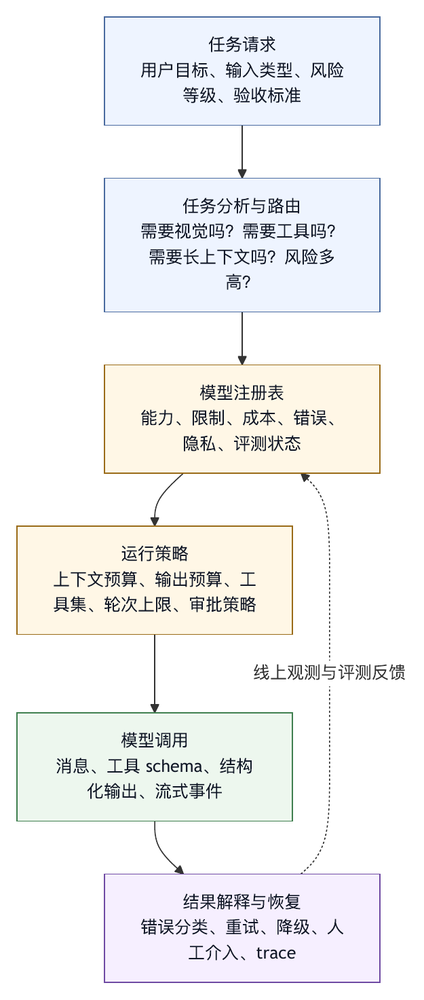

# 第五章 模型契约与能力边界

## 5.1 Harness 先要理解模型边界

进入第二编，我们开始拆解 harness 的核心结构。开篇先讨论模型契约，再讨论工具、上下文和行动循环。Harness 围绕模型运行，却不能把模型当作没有边界的智能黑箱。一个工程系统必须知道自己调用的模型能做什么、不能做什么、以什么格式接收输入、以什么格式返回输出、在什么条件下失败、成本如何计算、上下文如何衰减、工具调用如何表达、哪些能力是稳定接口、哪些能力只是经验表现。

很多智能体系统的问题，根源都在模型契约不清。团队说“这个模型支持长上下文”，于是把整个仓库塞进去；说“这个模型会调用工具”，于是开放几十个工具；说“这个模型推理能力强”，于是允许它自己决定何时停止；说“这个模型兼容某个 API”，于是忽略供应商特定参数、错误码、限流规则和计费模型。短期看，系统跑起来了；长期看，边界模糊会逐步表现为成本失控、行为不稳定、调试困难和安全策略失效。

模型契约不是宣传材料中的能力清单。它是 harness 与模型之间的工程接口。它至少包括输入输出格式、上下文窗口、输出预算、工具调用协议、多模态能力、流式行为、推理内容、错误类型、速率限制、成本模型、数据保留约定、区域和凭据差异，以及模型版本变化策略。

第一编回答“为什么需要 harness”，本章回答“harness 如何把模型变成一个可被工程系统调用的组件”。

## 5.2 模型是一组能力约束

在产品宣传和日常讨论中，人们习惯用一个模型名称代表某种能力。例如“某某模型会写代码”“某某模型上下文很长”“某某模型适合推理”。这种说法适合交流，却不适合工程设计。

对 harness 来说，一个模型应被描述为一组约束：

- 最大输入上下文。
- 最大输出长度。
- 支持的消息角色和内容类型。
- 是否支持工具调用。
- 工具调用是否支持并行。
- 是否支持结构化输出。
- 是否支持图像、音频、视频或文件输入。
- 是否暴露推理内容或中间推理摘要。
- 是否支持流式输出和流式工具调用。
- 是否支持取消。
- 典型延迟和超时行为。
- 速率限制和并发限制。
- 价格、token 计量和附加工具计费。
- 数据处理和隐私承诺。
- 错误码和可重试语义。

这些约束共同决定 harness 的运行策略。一个支持长上下文但输出预算较小的模型，适合读大材料后生成简短决策，不适合一次生成长篇报告；一个工具调用稳定但多模态能力弱的模型，可以作为 coding agent 主模型，再由多模态模型做预处理；一个延迟低但推理能力一般的模型，可以承担分类、摘要、路由和低风险子任务；一个成本高但可靠性强的模型，应被用于高价值决策，而不是每次文件搜索后都调用。

模型选择要看约束组合是否适合当前 harness 责任，而不是只问“哪个最强”。把模型抽象成无差别的 `chat()` 接口，会让这些差异消失在代码表面，却不会让它们在运行时消失。

## 5.3 模型注册表：把能力写成数据

成熟 harness 通常需要模型注册表。注册表的核心任务，是把模型能力和约束从口头知识变成可执行数据，而不只是列出所有可用模型。

一个最小模型注册表可以包含：

```text
模型 id
供应商
输入上下文上限
输出上限
支持的内容类型
是否支持工具调用
是否支持结构化输出
是否支持多模态
默认温度和采样限制
成本系数
推荐用途
禁止用途
错误处理策略
```

更完整的注册表还会记录区域、凭据类型、beta 功能、退役时间、替代模型、兼容性说明和内部评测结果。

模型注册表的价值体现在几件事上。

第一，它让路由可解释。系统为什么把某个任务交给某个模型，不应只是因为配置默认值，而应基于任务需要和模型能力。例如，带图片的任务不能路由到纯文本模型，除非 harness 先做多模态预处理。

第二，它让预算可控。上下文窗口、输出上限和成本系数进入注册表后，harness 可以在调用前估算成本和失败风险，而不是等 API 返回超限错误。

第三，它让工具暴露有边界。不是所有模型都同样适合工具调用。注册表可以决定某个模型是否允许进入行动循环，是否只能用于摘要，是否禁止直接调用写工具。

第四，它让升级可管理。模型版本变化会影响行为。注册表可以把“默认模型更新”变成显式变更，并触发回归评测。

作者整理的匿名工程案例中，模型白名单、上下文限制、输出预算、供应商特定参数、成本估计和错误处理都被视为 harness 的组成部分，而不是散落在调用点的临时判断。这类设计传递了一个重要原则：模型契约应集中管理，不能依赖每个功能模块各自记忆。

## 5.4 上下文窗口不是仓库容量

长上下文模型改变了 harness 设计，但也带来一个常见误区：既然模型能接收很长上下文，是否可以把更多材料直接塞进去？对于生产级智能体，这不是可持续策略。

上下文窗口只是模型输入容量，不能当作知识库容量或仓库容量。它有四个限制。

第一，成本限制。长上下文意味着更高 token 成本和更长延迟。即便某个任务可以在预算内完成，系统规模化后也可能不可接受。

第二，注意力限制。模型能接收很多内容，不代表会稳定关注最重要内容。上下文越长，噪声越多，过期信息、重复信息和冲突信息越容易影响输出。

第三，更新限制。工作区在任务执行中会变化。一次性塞入大量文件后，模型看到的可能很快变成旧状态。Harness 需要持续更新相关片段，而不是依赖初始大包输入。

第四，治理限制。长上下文可能包含敏感信息、未授权文件、外部注入文本和无关用户数据。上下文装配必须遵守权限和隐私策略，不能因为窗口足够大就放弃选择。

长上下文能力应被用来提高任务鲁棒性，不能取代上下文工程。更合理的做法是：把长上下文作为缓冲，把检索、摘要、优先级、来源标注和压缩作为主要机制。模型窗口越大，越需要上下文治理；缺少治理时，系统只是把更多不确定性一次性送给模型。

对于 coding agent，尤其不能把“读完整仓库”当作默认策略。完整仓库中包含大量无关文件、生成物、依赖目录、历史文档和测试夹具。Harness 应先用搜索、索引、项目规则和任务线索定位相关区域，再逐步扩大上下文。必要时可以让模型请求更多文件，但每次扩大都应有理由。

## 5.5 输出预算决定任务边界

输入上下文常被重视，输出预算常被低估。输出预算决定模型一次能生成多少计划、代码、解释或工具调用。对于 agent harness，输出限制不仅影响最终回答，还影响中间推理和工具调用。

如果输出预算太小，模型可能截断计划、生成不完整 patch、丢失风险说明，或者在需要解释时只给结论。输出被截断还可能造成危险：一个 shell 命令、JSON 参数或代码块如果部分生成，harness 必须能识别并拒绝执行。

如果输出预算太大，模型可能过度展开，生成冗长分析，增加延迟和成本，并把简单任务复杂化。某些模型在长输出中更容易出现自我重复、目标漂移和无关扩写。

输出预算应与任务类型绑定：

- 分类和路由任务需要短输出。
- 工具调用任务需要结构化、完整但不冗长的输出。
- 代码修改任务需要足够预算表达 patch 和解释。
- 审稿任务需要中等预算列出发现和证据。
- 长文写作任务需要分段生成，而不是一次生成全书。

Harness 可以通过“任务分片”管理输出预算。让模型一次完成一个明确步骤，而不是一次承担全部目标。对于本书这样的长写作任务，也应按章、按节、按资料范围推进；一次要求模型输出 50 万字，不仅不可行，也不利于质量控制。

输出预算还应影响停止条件。行动循环不能只看模型是否停止输出，还要看任务是否达到验证标准。模型输出完了不等于任务完成；输出被截断也不应被当作自然结束。

## 5.6 工具调用能力有多个维度

很多模型接口会用“支持工具调用”描述能力。但在 harness engineering 中，这种能力不能按简单布尔值处理。工具调用能力至少有多个维度：

- 模型能否根据 schema 生成合法参数。
- 模型是否能在多个工具中选择合适工具。
- 模型能否理解工具返回的错误。
- 模型是否倾向于过度调用工具。
- 模型能否在工具失败后调整策略。
- 模型是否支持并行工具调用。
- 模型是否支持多轮工具调用中的状态保持。
- 模型是否能区分工具输出中的事实和指令。
- 模型是否能在不确定时请求用户澄清，而不是盲目调用。

Toolformer 等研究说明，工具使用会改变语言模型解决问题的方式，并不只是外部附加物；ReAct 则从推理和行动交替的角度说明了工具观察如何进入下一步推理〔注5-2〕。对 harness 来说，关键在于让工具调用进入一个可控循环，而不是简单“打开工具”。

Harness 需要对不同模型设置不同工具策略。一个工具调用能力强的模型可以获得更丰富工具集；一个工具能力不稳定但摘要能力好的模型，可以只用于预处理；一个容易过度调用工具的模型，需要更严格的轮次限制和成本预算；一个参数构造不稳定的模型，需要更窄 schema 和更多执行前校验。

工具调用能力还需要内部评测。团队不能只依赖供应商说明，而应收集自己的任务样本：模型是否能正确选择读文件、搜索、编辑、运行测试、解释失败；是否会在不该联网时联网；是否会把工具输出中的文本当作高优先级指令；是否能在权限拒绝后采取合理替代方案。

## 5.7 多模态能力需要路由

多模态模型让智能体能处理图片、音频、视频和复杂文件。对于软件工程，截图、错误录屏、设计稿、日志图片、架构图和终端录制都可能成为任务输入。多模态能力扩展了 harness 的环境感知范围。

但多模态能力同样需要契约化。

一方面，多模态输入有成本和延迟。图片、视频和音频的处理成本高于普通文本，且不同模型对帧率、分辨率、音频长度和文件格式的支持不同。Harness 应在接收输入时就判断是否需要压缩、抽帧、转写或摘要。

另一方面，多模态理解需要事实性边界。模型描述截图时可能遗漏细节、误读小字或推断不可见状态。对于高风险任务，多模态预处理结果应被标注为“视觉摘要”而不是事实数据库。必要时，harness 应让用户确认关键视觉信息。

同时，多模态模型未必也是最好的代码推理模型。一个系统可以用多模态模型把截图转成结构化事实，再把事实交给更擅长代码推理的文本模型。一个匿名多模态路由案例体现了这种设计：当主模型是文本模型而用户提供媒体输入时，harness 先通过多模态模型生成事实摘要，再让主模型继续执行。

这类设计说明，多模态能力不一定要求统一模型包打天下。Harness 可以把模型视为能力组件：某个模型负责视觉理解，另一个模型负责长上下文代码推理，第三个模型负责快速分类。关键是路由过程要可观测、可追溯，并在上下文中标明哪些内容来自预处理。

## 5.8 推理内容、隐藏状态与可观测性

一些模型或接口会提供推理内容、推理摘要、thinking 模式或类似能力。它们对 harness 很有吸引力，因为智能体系统需要理解模型为什么选择某个动作。然而，推理内容的工程处理必须谨慎。

第一，推理内容不能当作真实因果解释。模型生成的中间推理可能帮助调试，但它仍是模型输出的一部分，不应被视为完全可靠的内部状态。Harness 可以使用它辅助观察，但不能把它作为唯一审计证据。

第二，推理内容可能包含敏感信息、用户数据或模型自我暴露的实现细节。是否保存、如何脱敏、是否展示给用户、是否进入评测，都需要策略。

第三，不同供应商对推理内容的接口和语义差异很大。有的模型要求在多轮工具调用中保留某种 reasoning 内容，有的只提供摘要，有的完全不暴露。Harness 如果做多模型支持，必须把这些差异写入模型契约，而不是假设所有模型行为一致。

作者整理的匿名工程案例中，thinking 模式、reasoning 内容保存和供应商特定字段被视为不应被通用抽象隐藏的不变量。这个判断可以推广：当模型接口中的某个字段影响工具调用、上下文连续性或计费行为时，它就是 harness 的一等契约，而不是实现细节。

可观测性也不能只依赖推理内容。可靠 trace 应包括输入上下文摘要、工具调用、参数、结果、权限判断、错误、成本、状态变化和最终验证。推理内容可以解释“模型似乎怎么想”，但 trace 才能证明“系统实际做了什么”。

## 5.9 错误语义与可重试性

模型调用会失败。失败可能来自网络、限流、认证、上下文超限、输出截断、服务端错误、内容安全策略、工具调用格式错误、区域配置错误或账户额度不足。Harness 必须把这些失败分类，而不是简单抛出“调用失败”。

错误语义影响恢复策略。

- 网络超时可能可以重试。
- 认证失败需要用户或运维处理。
- 上下文超限需要压缩或裁剪。
- 输出截断需要减少任务范围或增大预算。
- 限流需要退避、排队或降级。
- 内容策略拒绝需要改变任务或说明限制。
- 工具调用格式错误可能需要让模型重发结构化调用。
- 供应商区域错误需要检查配置。

如果错误分类不清，行动循环会做出糟糕决策。它可能对不可重试错误反复重试，浪费成本；也可能对可恢复错误直接放弃；还可能把模型调用错误误解释为任务失败，给用户错误结论。

错误语义还应进入最终回答。用户需要知道任务未完成是因为代码问题、测试失败、权限拒绝、模型额度不足，还是网络故障。不同原因对应不同下一步。

对于企业 harness，错误分类也关系到运营。限流和成本错误应进入容量规划；上下文超限应进入上下文工程改进；工具格式错误应进入模型和工具 schema 评测；内容拒绝应进入安全策略说明。

## 5.10 抽象供应商：什么时候该抽，什么时候不该抽

多供应商支持是很多平台的自然需求。团队希望在不同模型之间切换，控制成本，避免锁定，利用不同模型优势。这是合理目标。但 harness engineering 需要警惕过度抽象。

过度抽象的典型表现是把所有模型都压成同一个 `send(messages, tools)` 接口，然后把差异隐藏在适配器里。短期看接口简洁，长期看问题会浮现：某个模型的工具调用需要特殊上下文保留，某个模型的多模态输入格式不同，某个模型的长上下文成本极高，某个模型的错误码有特殊含义，某个模型的结构化输出稳定性不足。若这些差异被隐藏，上层 harness 就无法做正确决策。

供应商抽象应该遵守两个原则。

第一，抽象共同机制，不抽象关键不变量。认证、HTTP 重试、基础消息格式、流式事件可以抽象；上下文窗口、工具行为、多模态限制、推理内容、成本模型和错误语义应保留为显式契约。

第二，路由层应能看到能力差异。模型选择、任务分派、工具暴露和预算控制，都需要访问模型注册表。如果抽象层只暴露“可调用”，上层就只能盲选。

单供应商 harness 也不是低级形态。在某些场景中，深度适配一个供应商反而更可靠，尤其当供应商有特定上下文、计费、推理和工具语义时。匿名工程案例选择仅支持某单一模型供应商，不做通用 provider abstraction，正是为了把供应商特定行为作为一等约束处理。这不是所有系统都应复制的答案，但它说明“多供应商”不是天然高级，“契约清晰”才是高级。

## 5.11 模型契约清单

设计或审查一个 harness 时，可以用以下清单检查模型契约是否足够清晰。

模型身份：

- 模型 id 是否明确？
- 版本是否固定？
- 默认模型和备用模型是什么？
- 退役或升级策略是什么？

能力边界：

- 输入上下文上限是多少？
- 输出上限是多少？
- 支持哪些内容类型？
- 是否支持工具调用、结构化输出、多模态、流式和取消？
- 是否有内部评测证明适合当前任务？

运行参数：

- temperature、top-p、max tokens 等参数如何设置？
- 哪些参数允许用户覆盖？
- 哪些参数由 harness 根据任务自动设置？
- 是否存在供应商特定字段？

成本和容量：

- token 如何计量？
- 是否有附加工具或插件计费？
- 并发、速率和区域限制是什么？
- 失败重试是否会显著增加成本？

错误处理：

- 错误码如何分类？
- 哪些可重试？
- 哪些需要用户介入？
- 上下文超限和输出截断如何恢复？

安全和隐私：

- 数据是否会被供应商保留或用于训练？
- 是否支持企业数据隔离？
- 日志中如何脱敏请求和响应？
- 敏感任务是否禁用某些模型？

评测和升级：

- 模型变更前需要跑哪些回归任务？
- 线上失败样本如何回流？
- 不同模型的行为差异如何记录？
- 降级和回滚路径是什么？

这份清单用来防止“模型可以”这类模糊判断进入生产系统，而不是制造文档负担。只要智能体能行动，模型契约就必须可审计。

## 5.12 模型契约模板：从文档到可执行配置

模型契约如果只写在设计文档中，很容易过期。更好的方式是把契约写成可被 harness 读取的配置，同时保留面向人的解释。下面是一个抽象模板，用来说明模型注册表应如何表达工程约束。

```text
model:
  id: provider.model-version
  display_name: 面向用户和日志的名称
  provider: 供应商或内部服务
  version_policy: fixed | rolling | deprecated

capabilities:
  input_modalities: [text, image]
  output_modalities: [text]
  tool_calling: supported
  structured_output: supported
  streaming: supported
  cancellation: supported
  parallel_tool_calls: conditional

limits:
  max_input_tokens: ...
  max_output_tokens: ...
  recommended_output_tokens: ...
  max_tool_rounds: ...
  timeout_seconds: ...

runtime_defaults:
  temperature: ...
  top_p: ...
  reasoning_effort: ...
  response_format: ...

cost:
  input_token_weight: ...
  output_token_weight: ...
  cached_input_policy: ...
  tool_surcharge_policy: ...

routing:
  recommended_for:
    - coding_agent_main_loop
    - long_context_review
  avoid_for:
    - low_latency_classification
    - untrusted_external_browsing

security:
  data_retention: enterprise_policy
  allowed_workspaces: [...]
  sensitive_task_policy: allow_with_audit
  logging_redaction: required

errors:
  retryable:
    - timeout
    - rate_limit
    - transient_server_error
  non_retryable:
    - invalid_auth
    - policy_violation
    - unsupported_modality

evals:
  required_before_upgrade:
    - tool_call_schema_suite
    - coding_regression_suite
    - context_pressure_suite
    - safety_boundary_suite
```

这个模板的重点不在字段名称，而在表达方式。契约应让 harness 能回答三个问题：能不能用，适不适合用，出了问题如何恢复。

“能不能用”对应能力和限制。带图片的任务不能发送给不支持图像的模型；需要结构化 JSON 的任务不能发送给结构化输出不稳定的模型；需要长时间工具循环的任务不能发送给超时过短或状态保持能力弱的模型。

“适不适合用”对应路由和成本。一个模型可能可以完成任务，但成本过高、延迟过长或工具调用行为不稳定。注册表应允许 harness 把“可用”和“推荐”分开。生产系统中，很多事故源于系统在错误场景使用了模型，而非模型完全不能做。

“出了问题如何恢复”对应错误语义和升级策略。限流、超时、上下文超限、输出截断、工具格式错误和安全拒绝，应进入不同恢复路径。没有错误语义，行动循环只能用通用重试或通用失败处理，既浪费成本，又难以给用户准确解释。

模型契约还应区分“供应商声明”和“内部证据”。供应商文档说明某模型支持工具调用，这只是起点；团队仍需要在自己的工具集、项目规则、上下文压力和安全策略下评测。模型注册表可以保留两个字段：官方能力和内部验证状态。只有通过内部验证的能力，才应被 harness 用于高风险任务。

## 5.13 路由案例：同一任务中的多模型协作

模型契约最直接的用途是路由。下面以一个产品缺陷分析任务为例：用户上传一张错误页面截图，并要求智能体在代码仓库中定位原因、给出修复方案，必要时修改代码。

这个任务看起来是一个目标，实际上包含多个不同能力需求。

第一步，视觉理解。截图中可能包含错误提示、界面状态、按钮文案和浏览器控制台片段。Harness 可以把图片交给多模态模型，要求输出结构化视觉摘要：可见错误文本、页面路径、用户动作线索、截图中无法确认的信息。这个阶段的输出应标注为“视觉观察”，不能直接当作代码事实。

第二步，任务路由。根据视觉摘要和用户目标，harness 判断任务进入 coding agent 主循环，而不是只返回解释。此时需要选择擅长代码推理和工具调用的模型。多模态模型不一定继续担任主模型。

第三步，仓库检索。主模型根据错误文本、页面路径和项目规则，选择搜索工具、读取相关文件、查看路由和状态管理代码。这里更需要长上下文和工具调用稳定性，而不是视觉能力。

第四步，修复与验证。如果要修改代码，harness 根据模型契约决定输出预算、工具轮次和测试策略。生成 patch 需要足够输出空间，运行测试需要 shell 工具策略，最终总结需要引用 diff 和测试记录。

第五步，复核。对于高风险改动，可以调用另一个模型做审稿，或者使用同一模型在不同 prompt 下检查 diff 是否符合用户目标。审稿模型不需要写权限，只需要读取 diff、需求和验证证据。

这个案例表明，多模型协作的价值在于避免“一个模型做所有事”的错配，而不是堆叠复杂度。视觉模型负责视觉事实，代码模型负责仓库推理，低成本模型可以做路由和摘要，强模型用于高风险决策。模型契约让这种分工可配置、可审计、可替换。

路由还必须保留证据链。最终回答不能只说“根据截图和代码已修复”，而应能说明：截图被转成哪些观察，哪些观察进入代码分析，读了哪些文件，为什么选择这个模型进入主循环，哪些测试验证了结果。证据链缺失时，多模型系统会变成更难调试的黑箱。

## 5.14 模型升级门禁

模型升级是 harness 运营中最容易被低估的风险。一个新模型可能在公开 benchmark 上更强，却在某个组织的工具集、上下文格式或项目规则下表现更差。它可能更会写代码，但更爱扩大修改范围；可能更会调用工具，但更频繁触发昂贵命令；可能更遵循格式，但在长上下文中忽略早期约束；可能更谨慎，但导致任务完成率下降。

默认模型变更不应是简单配置改动，而应通过升级门禁。

第一道门是契约兼容。检查新模型是否支持现有消息格式、工具 schema、结构化输出、多模态输入、流式事件、推理字段和错误语义。如果接口层不兼容，不能用“适配器里补一下”草率处理，因为适配会改变上层 harness 能看到的能力。

第二道门是回归任务。使用内部任务集比较新旧模型。任务集应覆盖至少五类场景：普通问答或分析、代码定位、代码修改、工具失败恢复、安全边界。只看最终成功率不够，还要看工具调用次数、成本、延迟、无关 diff、审批触发、测试声明准确性和用户约束遵守。

第三道门是压力场景。长上下文、截断日志、冲突项目规则、工具输出含不可信文本、用户中途改目标、权限被拒绝，这些场景更能暴露 harness 与模型的真实耦合。新模型在简单任务上更好，不代表在压力场景下更稳。

第四道门是灰度发布。把新模型先用于低风险任务或少量用户，保留快速回滚。灰度期间，harness 应记录模型版本、任务类型、失败模式和人工反馈。模型升级是一段观测过程，不能当作一次性事件处理。

第五道门是契约更新。升级完成后，模型注册表、运行参数、路由策略、成本估算、错误处理和文档都要同步。不同步时，系统名义上升级了模型，实际契约仍停留在旧版本，后续问题会难以解释。

模型升级门禁并非阻止新模型，而是让新能力进入系统时不破坏已有可靠性。对于 agent harness，稳定性来自模型能力和运行结构的匹配。任何一方变化，都应触发验证。

## 5.15 图 5-1：模型契约在 Harness 中的位置

图 5-1 标出模型契约在任务、harness 控制面和执行环境之间的位置。

<figure><figcaption><p>图 5-1：模型契约在 Harness 中的位置</p></figcaption></figure>

```text
任务请求
  用户目标、输入类型、风险等级、验收标准
      |
      v
任务分析与路由
  需要视觉吗？需要工具吗？需要长上下文吗？风险多高？
      |
      v
模型注册表
  能力、限制、成本、错误、隐私、评测状态
      |
      v
运行策略
  上下文预算、输出预算、工具集、轮次上限、审批策略
      |
      v
模型调用
  消息、工具 schema、结构化输出、流式事件
      |
      v
结果解释与恢复
  错误分类、重试、降级、人工介入、trace
```

这张图强调，模型契约不只是“调用模型之前查一下参数”。它贯穿任务路由、上下文装配、工具暴露、成本控制、错误恢复和升级评测。契约越清楚，harness 越能把模型当作工程组件使用；契约越模糊，系统越依赖开发者经验和偶然成功。

OpenAI Agents SDK、Codex 相关材料、Claude Code 文档和匿名工程案例中的架构，都可以作为这个判断的旁证：成熟的智能体系统会把模型调用放在工具、上下文、权限、trace 和运行环境中一起设计，而不是孤立封装成一次文本生成〔注5-3〕。这些材料支撑的是工程趋势和设计取向，不能推出每个系统都必须复制某个产品的具体抽象。

## 5.16 表 5-1：模型能力证据分层

模型契约中最容易被误用的字段，是“支持某能力”。供应商文档可能说明某个模型支持长上下文、工具调用、结构化输出、多模态输入或推理模式，但这只能证明接口层可用，不能证明它适合某个组织的生产任务。Harness 需要把能力声明转化为能力证据。

能力证据至少分三层，见表 5-1。

| 证据层 | 回答的问题 | 典型证据 | 使用边界 |
|---|---|---|---|
| 官方声明 | 接口是否提供这个能力 | 是否接受图片、是否提供工具调用字段、是否支持流式输出、最大上下文窗口、错误码定义 | 决定 harness 能否接入和如何接入，但不能替代内部验证。 |
| 内部评测 | 这个能力在本组织任务、工具、上下文和安全策略下是否稳定 | 内部工具集测试、真实项目规则、冲突文档、截断日志、团队 schema、错误恢复路径、多模态样本 | 支撑上线前路由和灰度，但只覆盖已知样本。 |
| 线上观测 | 这个能力在真实用户和真实工作流中是否持续有效 | trace、失败分类、用户反馈、任务分布、工具失败、成本波动、异常组合 | 支撑持续路由调整和模型升级判断，不能只看离线快照。 |

落到实现中，可以把模型能力写成证据对象：

```text
model_capability_evidence:
  model_id: provider.model-version
  capability: tool_calling
  official_status: supported
  internal_status: validated_for_limited_tools
  validated_suites:
    - file_read_and_search
    - patch_generation
    - test_failure_recovery
    - permission_denied_recovery
  known_limits:
    - tends_to_overcall_shell_on_ambiguous_tasks
    - requires_strict_schema_for_nested_json
  online_metrics:
    tool_call_success_rate: ...
    invalid_argument_rate: ...
    permission_denial_recovery_rate: ...
  review_date: 2026-05-27
  owner: model-platform-team
```

这样的证据对象有两个好处。第一，它让模型路由更稳。系统可以把某个模型标为“官方支持工具调用，但只通过只读工具验证”，从而避免把它直接放进可写 coding agent 主循环。第二，它让模型升级更可控。新模型如果公开指标更好，但内部证据不足，harness 可以先把它用于低风险摘要或审稿，而不是立刻替换主模型。

能力证据还应明确“未验证”。很多事故来自把未知当作已知。例如模型是否能可靠处理十万 token 的混合上下文？是否会在工具输出含恶意指令时保持系统优先级？是否能在输出截断后正确请求继续？如果没有证据，就应写成未验证，而不是默认相信。专业的模型契约不怕暴露未知，怕的是把未知隐藏在乐观配置里。

## 5.17 模型路由策略：把选择模型变成策略，而不是习惯

模型注册表提供数据，路由策略决定如何使用这些数据。很多系统的路由最初只是一个默认模型配置，后来逐步增加例外：图片任务用多模态模型，简单摘要用便宜模型，复杂代码用强模型。例外多了之后，系统会变得难以解释。Harness engineering 要把模型选择提升为明确策略。

路由策略至少应考虑五类输入。

第一，任务类型。问答、摘要、代码定位、代码修改、审稿、数据分析、文档写作、外部系统写入，对模型能力的要求不同。任务分类越清楚，路由越容易稳定。低风险摘要可以使用低成本模型；代码修改主循环需要工具调用稳定性；高风险审稿可以使用更强模型或多模型复核。

第二，输入形态。纯文本、长文档、代码仓库、截图、音频、视频、表格、PDF、日志流，要求不同的预处理和模型能力。带图片任务不一定全程由多模态模型完成，但必须有多模态处理阶段；超长日志不一定直接进入长上下文模型，而可能先经过结构化摘要。

第三，风险等级。风险高不一定意味着模型越大越好，而是意味着路由必须更保守。高风险任务可能需要经过能力已验证的模型、禁用未验证工具能力、降低温度、增加审稿模型、要求人工审批和完整 trace。风险等级应影响模型选择、工具集和完成门禁。

第四，成本和延迟预算。一个平台不能把所有任务都交给最贵模型。低价值、低风险、高频任务应使用足够好的模型；高价值、低频、高风险任务可以使用更强模型和更多复核。成本策略的重点在于把强模型预算用在确实需要的地方，而非单纯省钱。

第五，失败历史。路由策略应从线上失败中学习。如果某个模型在某类任务中频繁产生无关 diff，就降低它在该类任务中的优先级；如果某个模型在权限拒绝后恢复更好，可以提高它在受控工具任务中的权重；如果某个模型在长上下文中更容易忽略早期约束，就限制它处理长任务。

一个策略化路由可以写成：

```text
model_routing_policy:
  task: controlled_code_edit
  required_capabilities:
    - stable_tool_calling
    - code_reasoning
    - structured_patch_explanation
  risk_controls:
    min_internal_validation: passed_core_regression
    allow_unvalidated_model: false
    require_review_model_for_high_risk_diff: true
  cost_policy:
    default_tier: balanced
    escalate_to_strong_model_when:
      - repeated_test_failure
      - security_sensitive_change
      - large_cross_module_diff
  fallback:
    on_rate_limit: queue_or_lower_tier_readonly
    on_context_overflow: summarize_then_retry
    on_tool_format_failure: narrower_schema_retry
```

路由策略还应可解释。用户不需要看到所有配置细节，但系统和运维人员应能回答：为什么这个任务用了这个模型？为什么没有使用更便宜模型？为什么高风险步骤需要另一个模型复核？为什么某个模型被禁用？这种可解释性对成本管理、事故复盘和组织信任都重要。

模型路由的反面，是“全局默认模型”思维。全局默认模型在早期很方便，但当任务类型、工具能力和风险等级增加后，它会变成隐性耦合点。每个功能都默认相信同一个模型，任何模型变更都影响全平台。成熟 harness 应允许默认值存在，但不应让默认值替代路由策略。

## 5.18 降级、回滚与模型不可用

模型契约必须包含失败时怎么办。很多团队在设计模型调用时只考虑成功响应，直到遇到限流、区域故障、供应商变更、成本异常、内容拒绝或质量回退，才发现系统没有降级路径。对于 agent harness，模型不可用是必须设计的运行状态，不能当作边缘情况。

降级首先要区分能力降级和任务降级。

能力降级是保留任务目标，但降低模型或能力级别。例如强模型限流时，把只读摘要任务路由到较低成本模型；多模态模型不可用时，让用户提供文本描述或等待重试；工具调用模型暂时不稳定时，只允许生成建议，不允许进入可写行动循环。能力降级要求 harness 知道替代模型的边界，不能盲目切换。

任务降级是缩小任务范围。例如用户要求“自动修复并提交 PR”，但模型或工具能力不足时，系统可以降级为“分析原因并给出 patch 建议”；用户要求“读取大批文档并生成完整报告”，上下文或成本超限时，可以降级为“先生成目录和缺口清单”。任务降级必须告知用户，不能假装原任务已经完成。

回滚则处理模型变更带来的质量风险。模型升级后，如果线上出现虚假测试声明、工具误选、输出格式异常或成本暴涨，harness 应能快速切回上一版本。回滚不只是改一个模型 id，还包括恢复运行参数、prompt 版本、工具暴露策略、输出预算和错误处理配置。模型契约如果没有版本化，回滚会变成手工猜测。

模型不可用还要求最终回答诚实。用户需要知道任务没有继续，是因为模型限流、认证失败、上下文超限、内容策略拒绝，还是系统主动降级。不同原因对应不同下一步。把所有问题都写成“遇到技术问题”会让用户无法判断，也会让运营团队失去诊断信号。

一个模型降级策略可以包含：

```text
model_degradation_policy:
  unavailable_strong_model:
    low_risk_readonly: use_balanced_model
    controlled_edit: pause_and_request_user
    external_side_effect: deny_and_retry_later
  context_overflow:
    first: compress_context
    second: split_task
    third: ask_user_to_reduce_scope
  output_truncation:
    structured_tool_call: reject_and_retry_with_smaller_scope
    final_answer: continue_or_summarize_with_disclosure
  quality_regression_detected:
    action: rollback_model_bundle
    preserve:
      - model_id
      - prompt_profile
      - tool_policy
      - eval_baseline
```

降级设计有一个底线：不能把高风险任务降级成低证据自动执行。强模型不可用时，系统可以少做、慢做、请求用户或暂停，但不应把同样权限交给未经验证的替代模型。可靠系统在能力不足时会缩小承诺，而不是维持承诺、降低保障。

## 5.19 模型契约与数据治理

模型调用天然涉及数据流。用户输入、项目文件、日志、截图、密钥片段、业务数据、工具输出和最终回答，都可能进入模型请求或模型相关日志。模型契约如果不包含数据治理，harness 就无法判断哪些任务能调用哪些模型。

数据治理至少包括四个问题。

第一，数据是否可以发送给该模型。不同模型可能运行在不同区域、不同供应商、不同账户和不同合规边界内。公开网页摘要、内部代码、客户数据、生产日志、个人信息和安全事件材料，应有不同发送策略。模型注册表应记录数据边界，而不是只记录能力。

第二，数据是否会被保留。供应商、企业网关、本地代理和 harness 自身都可能记录请求与响应。保留策略、脱敏策略、访问控制和保留周期应写入契约。缺少这些约束时，团队可能在模型调用层保护了敏感数据，却在 trace 或错误日志中泄露。

第三，数据是否用于改进模型或系统。有些环境允许用户数据用于模型训练，有些严格禁止；有些内部失败样本可以进入 eval，有些必须脱敏后才能使用。模型契约要区分模型供应商的数据使用承诺和 harness 内部的样本沉淀策略。

第四，数据如何影响路由。敏感任务不一定禁止使用所有模型，但必须使用经过批准的模型、区域、凭据和日志策略。某些高敏感任务可以只允许本地模型或企业隔离模型；某些普通任务可以使用通用模型；某些外部网页处理可以使用低成本模型，但不能让网页内容进入长期记忆或高优先级指令层。

可以把数据治理写入模型契约的路由条件：

```text
data_policy:
  allowed_data_classes:
    - public
    - internal_non_sensitive
  restricted_data_classes:
    - production_secret
    - personal_information
    - customer_confidential
  retention:
    request_response_logging: metadata_only
    raw_content_retention_days: 0
    trace_redaction: required
  eval_reuse:
    allowed_after_redaction: true
    requires_security_review_for_sensitive_incident: true
```

数据治理也会影响产品界面。用户上传文件或授权智能体读取仓库时，应能知道数据将进入哪类模型和日志系统。对于企业用户，模型选择不是纯技术问题，也是信任和合规问题。Harness 如果无法解释数据路径，模型契约就不完整。

## 5.20 常见反模式

模型契约不清时，系统会出现一组反模式。

第一种反模式是“模型全局单例”。整个 harness 只有一个默认模型，所有任务都走它。短期实现简单，长期会把任务差异、风险差异和成本差异都压到 prompt 和人工经验上。模型升级时，所有场景同时受影响，回归范围巨大。

第二种反模式是“把 benchmark 当契约”。公开 benchmark 有价值，但它不是组织内部任务契约。一个模型在公开软件工程评测上表现更好，不代表它会遵守你的工具权限、项目规则、审批界面和上下文压缩方式。Benchmark 可以作为选型线索，不能替代内部能力证据。

第三种反模式是“过度供应商抽象”。为了避免锁定，团队把所有供应商差异隐藏在统一接口后。结果上层 harness 看不到推理字段、错误语义、上下文限制、工具调用细节和成本模型。过度抽象原本想提高可替换性，结果会降低可治理性。

第四种反模式是“用 prompt 补模型错配”。模型不擅长工具调用，就加长工具使用提示；模型输出预算不足，就要求它“简洁但完整”；模型容易忽略早期约束，就加“务必记住用户要求”；模型不适合高风险任务，却用更严厉的系统 prompt 要它谨慎。Prompt 可以改善行为，但不能改变模型契约。错配应通过路由、工具策略、预算和评测处理。

第五种反模式是“无证据升级”。团队看到新模型发布，直接替换默认配置。上线后才发现成本变化、延迟变化、格式变化、拒绝策略变化或工具行为变化。这类事故通常源于升级门禁缺失，而不只是新模型本身的问题。模型变更应像平台依赖升级一样处理。

第六种反模式是“只记录调用成功，不记录能力失败”。模型返回 200 并不代表能力成功。工具参数可能不合法，输出可能被截断，最终回答可能没有证据，成本可能超过预算。Harness 应记录模型调用是否满足任务契约，而不是只记录 API 是否成功。

这些反模式的共同点，是把模型当作黑箱资源，没有把它当作工程组件。模型契约的价值不在束缚模型能力，而在让能力进入可理解、可选择、可回滚的系统结构。

模型契约还会直接约束下一章讨论的上下文装配。一个支持长上下文的模型，可以承接更大的资料包，但仍需要来源标注和噪声控制；一个输出预算有限的模型，需要更紧的上下文摘要和分步任务；一个工具调用不稳定的模型，不应收到过多工具描述；一个处理敏感数据受限的模型，不能进入某些资料流。换言之，上下文不是先装好再选择模型，模型也不是先选好再无条件塞入上下文。二者应由同一套契约和任务策略共同决定。

## 5.21 第五章小结

Harness 先要把模型视为有契约的工程组件。模型由一组约束构成：上下文、输出、工具、多模态、推理内容、错误、成本、隐私和供应商行为。模型越强，越需要清楚边界；边界不清时，强能力会把系统风险放大。

模型注册表、能力路由、预算控制、错误分类和供应商不变量，是 harness 的基础设施。不要把它们散落在调用点，也不要被过度抽象隐藏。

下一章将讨论上下文装配。模型契约回答“模型能接收什么”，上下文装配回答“我们应该让模型看见什么”。
