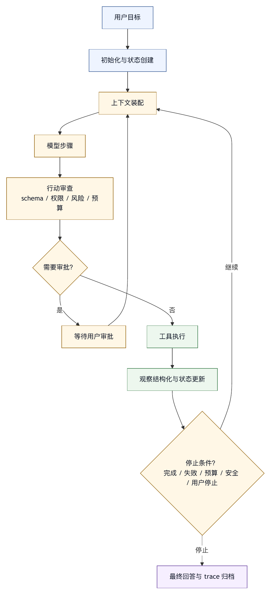

# 第七章 Agent Loop

## 7.1 Agent Loop 是智能体的运行骨架

模型契约决定 harness 能调用什么模型，上下文装配决定模型能看见什么世界。接下来要讨论的是 agent loop，也就是智能体行动循环。解释清楚之后，本章正文会优先称它为“行动循环”。行动循环决定模型如何在任务中反复理解、选择、行动、观察、更新和停止。

没有行动循环的模型调用，只是一次问答或一次生成。它可以给出建议，可以写一段代码，可以解释一份日志，但不会进入环境。行动循环让模型输出与环境反馈形成闭环：模型根据当前上下文选择下一步，harness 校验并执行工具，环境返回观察，harness 更新状态和上下文，模型再决定下一步。这个循环不断重复，直到任务完成、失败、达到预算、需要用户输入，或触发安全停止。

ReAct 研究把推理和行动交替作为语言模型解决任务的重要范式〔注7-1〕。Harness engineering 接受这一思想，并进一步把行动循环视为生产运行时控制结构，而不只是“模型思考、调用工具、观察结果”的认知模式。它必须处理权限、状态、预算、错误、回滚、用户交互和可观测性。

一个最小行动循环可以写成：

```text
接收目标
  -> 装配上下文
  -> 调用模型
  -> 解析模型输出
  -> 如果是工具调用：校验、审批、执行、记录、返回观察
  -> 如果是回答：验证完成条件
  -> 更新状态
  -> 继续或停止
```

这张骨架看起来简单，但每个箭头背后都有工程决策。行动循环的质量，决定智能体是稳定完成任务，还是在长链路中逐渐失控。

## 7.2 一次性调用、工作流与 Agent Loop

并不是所有 LLM 应用都需要行动循环。工程上应区分三种结构：一次性调用、固定工作流和行动循环。

一次性调用适合边界清楚、无外部副作用、输出即结果的任务。例如改写文本、摘要材料、生成候选标题、解释一段错误信息。这类任务通常不需要工具循环，也不需要复杂状态管理。

固定工作流适合步骤稳定、分支有限、可程序化控制的任务。例如“先检索文档，再摘要，再生成报告”，或者“先跑测试，再把失败日志交给模型解释”。模型在其中负责局部判断或生成，但流程由程序控制。固定工作流可预测、易评测、易治理，是很多生产系统的优先选择。

行动循环适合步骤不完全确定、需要根据环境反馈动态调整的任务。例如修复未知 bug、探索陌生仓库、处理复杂数据分析、在文档和代码之间来回验证、根据测试失败迭代补丁。这类任务无法提前写死全部步骤，模型需要在循环中选择下一步。

许多团队过早使用行动循环，把本可由固定工作流完成的任务交给模型自主决策，结果增加了不确定性。也有团队过度依赖固定流程，导致系统无法处理真实环境中的变化。Harness engineering 的判断是：能用确定性流程解决的部分，尽量用确定性流程；只有在需要开放式决策时，才进入行动循环。

这会把自主性用在最有价值的地方。

## 7.3 循环状态：每一轮都要知道自己在哪里

行动循环不是简单 while 循环。每一轮都应有明确状态。没有状态，模型只能依赖聊天历史判断任务进展，长任务很容易漂移。

一个基本循环状态包括：

- 原始目标。
- 当前目标摘要。
- 已完成步骤。
- 当前计划。
- 待办项。
- 已调用工具和结果。
- 环境变更。
- 验证证据。
- 用户审批记录。
- 失败和重试次数。
- token、成本和轮次预算。
- 停止原因候选。

状态应由 harness 维护，而不是完全交给模型。模型可以提出计划、更新判断和总结进展，但 harness 应保存结构化状态，并在必要时注入上下文。这样，即使历史消息被压缩，关键任务状态仍不会丢失。

状态还应区分事实和模型判断。“已修改 `src/foo.ts`”是事实；“这个修改应该修复问题”是判断；“测试已经通过”只有在测试工具返回成功后才是事实。状态层如果把判断写成事实，会误导后续循环。

对于 coding agent，状态尤其要记录工作区变化。哪些文件被读取、哪些文件被修改、哪些测试运行过、哪些检查失败、用户是否批准某个命令，这些都属于行动循环的控制数据，不是普通聊天内容。

## 7.4 计划：帮助循环，不替代循环

许多智能体系统会让模型先制定计划。计划有价值，因为它让用户和系统看到任务结构，也能减少模型盲目行动。但计划不是完成任务的保证，也不能替代循环中的观察和调整。

计划至少有三种形式。

第一，显式计划。模型列出步骤，用户或 harness 审查后执行。适合高风险任务、跨文件修改和需要用户确认的工作。

第二，隐式计划。模型不展示完整计划，但在内部选择下一步。适合低风险、短链路任务。

第三，滚动计划。模型先给出粗计划，每轮根据工具结果更新。适合探索性任务。

生产 harness 应根据任务风险选择计划形式。只读分析可以使用隐式或滚动计划；大规模修改应要求显式计划；复杂修复可先做探索，再形成修改计划。

计划的失败模式包括：

- 计划过早细化，在缺少信息时假装确定。
- 执行中环境变化，但计划不更新。
- 模型为了完成计划而忽视新证据。
- 计划没有对应验证步骤。
- 用户批准了计划，却没有批准具体高风险动作。

因此，harness 应把计划视为状态的一部分，而不是一次性文本。计划可以被更新，但更新要有理由；计划完成要有证据；计划偏离要在总结中说明。

## 7.5 行动选择：下一步比总目标更重要

行动循环每一轮要解决的问题是“下一步做什么”。总目标可能很大，但系统一次只能执行一个或一组动作。行动选择的质量决定循环是否朝正确方向收敛。

下一步行动通常有几类：

- 询问用户澄清。
- 搜索或读取上下文。
- 分析已有材料。
- 调用工具改变环境。
- 运行验证。
- 更新计划。
- 总结并停止。

一个成熟智能体不应总是急于行动。很多任务的正确下一步是读取更多文件、确认用户意图、检查 git 状态、运行只读诊断，而不是直接修改。行动选择应受到风险、信息充分性和任务阶段影响。

Harness 可以通过 prompt 和工具策略引导行动选择：

- 修改前必须有足够文件证据。
- 高风险动作前必须请求确认。
- 工具失败后先分析失败原因，不要立即扩大范围。
- 任务完成前必须检查验证证据。
- 如果目标冲突，先问用户。

其中一部分策略应下沉到执行层。例如，高风险动作确认不能只靠模型自觉；工具失败次数超过阈值应由 harness 停止或降级；轮次预算耗尽应触发总结和请求用户决策。

行动选择还应可观测。Trace 中应能看到模型为什么选择某个工具，依据是什么，是否有替代方案。缺少这些信息时，循环偏航后很难复盘。

## 7.6 工具执行：模型提出，Harness 决定

在行动循环中，模型通常不会直接执行工具。它生成工具调用意图和参数，harness 负责校验、审批、执行和记录。这一分离是安全和可靠性的核心。

执行前，harness 应检查：

- 工具是否存在。
- 参数是否符合 schema。
- 参数是否越权。
- 当前运行模式是否允许。
- 是否需要用户审批。
- 是否超过成本、时间或轮次预算。
- 是否与任务状态冲突。
- 是否有更安全的替代工具。

执行中，harness 应处理：

- 超时。
- 取消。
- 输出限制。
- 错误捕获。
- 工作目录。
- 环境变量。
- 并发冲突。

执行后，harness 应记录：

- 工具名和参数。
- 开始和结束时间。
- 成功或失败。
- 退出码或错误类型。
- 输出摘要和截断标记。
- 环境变化。
- 权限和审批记录。

模型生成工具调用，只是循环中的候选动作。Harness 决定候选动作是否进入真实环境。这个原则越早确立，系统越容易治理。

## 7.7 观察：工具结果如何回到模型

工具执行后，结果需要回到模型。这个过程看似只是把输出追加到上下文，实际上是行动循环的关键环节。

观察结果应具备几个特征。

第一，结构化。模型需要知道工具是否成功、失败类型是什么、输出是否被截断、关键结果在哪里。原始输出可以保留，但不应是唯一形式。

第二，来源明确。观察结果来自工具，不是用户指令，也不是系统规则。上下文中应标注其来源和可信度。

第三，信息适量。输出太少，模型无法判断；输出太多，模型注意力被稀释。Harness 应根据工具类型提供摘要和必要原文。

第四，保留失败。失败观察不能被模糊成“命令没有成功”。失败原因、退出码、错误片段、重试次数都可能影响下一步。

第五，更新状态。观察结果不仅进入模型上下文，也应更新 harness 状态。例如，测试通过、文件修改、命令失败、审批拒绝，都应成为结构化状态。

观察质量直接影响下一步行动。糟糕观察会让模型重复失败命令、误判任务完成、扩大修改范围或忽略风险。

## 7.8 停止条件：何时结束比如何开始更难

行动循环必须停止。停止条件设计不清，是很多智能体系统“看起来一直在工作”的原因。模型可能不断寻找新问题，或者在证据不足时过早总结。

停止条件可以分为几类。

第一，成功停止。任务达到完成定义，验证证据充分，模型给出最终回答。

第二，等待用户。目标冲突、权限不足、高风险动作、外部凭据缺失或需要业务判断时，系统暂停并请求用户输入。

第三，失败停止。工具连续失败、环境不可用、依赖缺失、模型无法继续、任务超出能力边界。

第四，预算停止。达到 token、成本、时间、轮次或工具调用上限。

第五，安全停止。触发危险操作、敏感信息风险、越权访问或策略拒绝。

成功停止不能只由模型声明。Harness 应检查完成证据。例如 coding agent 完成修复时，应至少知道修改了哪些文件、运行了哪些测试、测试结果如何、是否有未验证风险。对于分析任务，也应检查是否回答了用户问题、是否标注不确定性、是否没有执行未授权动作。

预算停止不应被包装成成功。模型应明确说明“已达到预算，尚未完成哪些部分”。这会直接影响用户信任。

## 7.9 循环预算：自主性需要边界

行动循环可以无限扩展：更多搜索、更多文件、更多测试、更多修复、更多总结。如果没有预算，系统会消耗过多时间和成本，甚至在错误方向上越走越远。

常见预算包括：

- 最大模型调用次数。
- 最大工具调用次数。
- 最大连续失败次数。
- 最大运行时间。
- 最大 token 和成本。
- 最大文件修改数量。
- 最大 diff 大小。
- 最大并发子任务。

预算用来让自主性可控。预算达到时，系统应停下来解释当前状态，而不是继续尝试。用户可以决定是否扩大预算。

不同任务需要不同预算。简单问答不应进入多轮工具循环；复杂 bug 修复需要更多轮次；高风险生产操作需要更小自动预算和更多人工审批。Harness 可以根据任务类型和运行模式设置默认预算。

预算还提供评测信号。如果某类任务经常耗尽预算，说明 harness 可能缺少合适工具、上下文检索不足、模型不适合该任务，或任务需要拆分。

## 7.10 错误恢复：不要把重试当作策略

行动循环中错误不可避免。工具会失败，模型会生成非法参数，测试会报错，网络会超时，权限会拒绝。恢复策略决定系统是稳定推进，还是反复撞墙。

重试是最简单恢复方式，但不能滥用。只有暂时性错误适合重试，例如网络波动、限流、临时服务错误。对于参数错误、权限拒绝、上下文缺失、测试失败，盲目重试只会浪费预算。

错误恢复应先分类：

- 可重试：网络、临时服务、限流。
- 可调整：参数错误、路径错误、上下文不足。
- 需用户：权限、凭据、目标冲突。
- 需修改：测试失败、代码错误、依赖缺失。
- 需停止：安全拒绝、预算耗尽、不可逆风险。

Harness 可以把错误分类返回给模型，引导下一步。例如：“该命令被权限策略拒绝，不要重试；请请求用户确认或选择只读替代方案。” 这种反馈比原始错误文本更有价值。

恢复还要避免破坏现场。出现复杂失败时，系统应保留日志、diff、checkpoint 和状态，而不是继续做大量修改。对于 coding agent，失败后的第一动作往往应该是观察和总结，而不是再次编辑。

## 7.11 多智能体循环：并发不等于协作

一些 harness 支持多智能体。主智能体可以派发 researcher、coder、reviewer、tester 等子任务。多智能体可以提高并行度和专业化，但也会放大行动循环设计复杂度。

多智能体循环需要回答：

- 子任务如何定义？
- 子任务是否有依赖关系？
- 子智能体能使用哪些工具？
- 子智能体是否可修改环境？
- 失败如何传播？
- 结果如何汇总？
- 冲突如何处理？
- trace 如何关联？

把任务并发扔给多个模型，不等于多智能体协作。没有 DAG、并发上限、失败传播、超时、权限隔离和 fan-in 摘要，多智能体很容易产生重复工作、互相冲突和不可解释成本。

一个抽象调度案例包含任务 id、依赖、并发上限、角色、模型覆盖、重试、超时、trace 和 fan-in 摘要。这些要素说明，多智能体先要解决调度和治理问题，然后才是模型角色分工问题。

在生产系统中，子智能体默认应更保守。只读研究和审稿适合并发，直接修改共享工作区则需要严格隔离或串行化。两个智能体同时修改文件时，主智能体很难合并结果。

## 7.12 Agent Loop 可观测性

行动循环必须可观测。没有可观测性，循环中的错误无法定位，自主性也难以被信任。

一个行动循环 trace 至少应记录：

- 每轮编号。
- 输入上下文摘要。
- 模型输出类型：回答、工具调用、计划更新、请求用户。
- 工具调用及参数。
- 权限判断和审批。
- 工具结果和错误分类。
- 状态更新。
- token、成本和耗时。
- 停止原因。

可观测性不是只给开发者看的。用户界面也需要展示适量循环信息：当前在做什么、调用了什么工具、是否等待审批、哪些检查已完成、是否遇到失败。终端 TUI、Web timeline、IDE 面板等产品形态，都是行动循环的观察窗口。

如果用户只能看到最终总结，就很难建立信任。如果用户看到过多原始日志，又会被噪声淹没。Harness 需要在“透明”和“可读”之间做产品化设计。

## 7.13 Agent Loop 清单

设计行动循环时，可以使用以下清单。

循环结构：

- 是否区分一次性调用、固定工作流和行动循环？
- 进入行动循环的条件是什么？
- 每轮有哪些状态输入和输出？

状态：

- 原始目标、当前计划、已完成、未完成、失败和验证证据是否结构化保存？
- 状态是否区分事实、推断和假设？
- 历史压缩后状态是否仍可用？

行动：

- 模型生成工具调用后，harness 是否校验参数、权限和风险？
- 高风险动作是否需要审批？
- 工具失败后是否有分类恢复策略？

停止：

- 成功、失败、等待用户、预算和安全停止是否明确？
- 最终回答是否基于验证证据？
- 预算停止是否会被错误包装成完成？

预算：

- 是否有限制模型轮次、工具调用、时间、成本和修改范围？
- 不同任务类型是否有不同预算？

观测：

- 是否能查看每轮模型输入、输出、工具、状态和成本？
- 是否能从失败样本回放行动循环？
- 用户是否能理解当前循环状态？

这份清单要求行动循环让模型在可观察、可约束、可恢复的循环中行动，而不是自由奔跑。

## 7.14 Agent Loop 状态机

为了让行动循环可以实现、调试和评测，最好把它建模为状态机，而不是一段自由运行的 while 循环。状态机的价值在于：每个状态都有进入条件、退出条件、允许动作和审计记录。模型可以在状态中提出建议，但状态迁移由 harness 控制。

一个面向 coding agent 的基础状态机可以写成：

```text
Idle
  等待用户目标或队列任务。

Initialize
  记录原始目标，检查运行模式、工作区、模型契约和工具集。

AssembleContext
  加载系统规则、项目规则、任务状态、相关材料和预算。

ModelStep
  调用模型，获得回答、计划更新、工具调用或澄清请求。

ReviewAction
  校验模型输出，检查 schema、权限、风险、预算和状态一致性。

AwaitApproval
  对需要用户确认的动作暂停，保存待批准内容。

ExecuteTool
  执行工具，处理超时、取消、输出限制和环境副作用。

Observe
  把工具结果结构化，记录 trace，并更新任务状态。

EvaluateProgress
  判断是否达到完成条件，是否需要继续、等待用户、失败或安全停止。

Finalize
  生成最终回答，列出行动、证据、未验证项和残余风险。

Stopped
  任务结束，trace、成本和结果进入后续评测或复盘。
```

这组状态不是唯一实现，但它表达了几个重要边界。

第一，模型调用和工具执行被分开。`ModelStep` 只产生候选动作，`ReviewAction` 和 `ExecuteTool` 才决定是否进入环境。这个分离让权限、审批和预算有了明确插入点。

第二，审批是状态，不是弹窗。系统一旦进入 `AwaitApproval`，就应保存待审批工具、参数、风险说明、可恢复性和上下文。用户稍后回来时，系统仍能说明自己为什么等待，而不是丢失在聊天历史里。

第三，观察和进度评估被分开。工具执行成功并不等于任务推进成功。测试命令成功可能只说明测试运行完，不一定覆盖需求；搜索工具成功可能只说明找到了候选文件，不一定找到了根因。`Observe` 负责记录事实，`EvaluateProgress` 负责判断事实对目标意味着什么。

第四，停止是显式状态。成功、失败、预算停止、安全停止和等待用户，都应产生不同的停止原因。系统不应把预算停止包装成成功，也不应把安全拒绝包装成普通失败。

状态机还方便做产品界面。终端、IDE 或 Web UI 可以显示“正在装配上下文”“等待审批”“运行测试”“评估完成条件”等状态。用户看到的是可理解的任务进度，而不是一串模型文本。

## 7.15 逐轮 Trace 样例

下面用一个小型 bug 修复任务展示行动循环 trace 应如何记录。用户请求：“保存设置后刷新页面，开关状态会恢复默认值，请做最小修复并运行相关测试。”

```text
run_id: fix-settings-refresh-001
mode: interactive
budget:
  max_model_steps: 12
  max_tool_calls: 30
  max_modified_files: 3

step 1
  state: AssembleContext -> ModelStep
  context:
    user_goal: 修复设置刷新后状态丢失
    constraints: 最小修复，运行相关测试
    project_rules: frontend/AGENTS.md
  model_output:
    action: search_files
    reason: 需要定位设置页和状态持久化代码

step 2
  state: ReviewAction -> ExecuteTool -> Observe
  tool: search_files
  params: pattern="settings state refresh"
  result:
    status: success
    matches: 4
    truncated: false
  state_update:
    candidate_files:
      - src/pages/Settings.tsx
      - src/stores/settingsStore.ts
      - src/tests/settingsStore.test.ts

step 3
  state: ModelStep -> ReviewAction -> ExecuteTool -> Observe
  tool: read_file
  params:
    paths:
      - src/pages/Settings.tsx
      - src/stores/settingsStore.ts
  result:
    status: success
    summary: store 初始化时未从 persisted storage 恢复 toggle 值
  state_update:
    evidence:
      - Settings 页面读取 store.toggle
      - settingsStore 初始化默认值覆盖持久化值

step 4
  state: ModelStep -> ReviewAction
  model_output:
    action: edit_file
    reason: 在 settingsStore 初始化中读取 persisted toggle
  review:
    schema: pass
    permission: pass
    risk: workspace_write_low
    requires_approval: false

step 5
  state: ExecuteTool -> Observe
  tool: edit_file
  result:
    status: success
    changed_files:
      - src/stores/settingsStore.ts
    diff_summary: 初始化时优先读取 persisted toggle，缺失时使用默认值
  state_update:
    modified_files_count: 1
    verification_needed: true

step 6
  state: ModelStep -> ExecuteTool -> Observe
  tool: run_tests
  params:
    command: npm test -- settingsStore
  result:
    status: failure
    error_type: test_failure
    failing_test: "restores toggle on refresh"
  state_update:
    verification_status: failed
    next_action_hint: inspect failing assertion

step 7
  state: ModelStep -> ExecuteTool -> Observe
  tool: read_file
  params:
    paths:
      - src/tests/settingsStore.test.ts
  result:
    status: success
    summary: 测试期望 storage key 为 userSettings，而实现读取 settings

step 8
  state: ModelStep -> ExecuteTool -> Observe
  tool: edit_file
  result:
    status: success
    changed_files:
      - src/stores/settingsStore.ts
    diff_summary: 修正 storage key，与现有测试约定一致

step 9
  state: ModelStep -> ExecuteTool -> Observe -> EvaluateProgress
  tool: run_tests
  params:
    command: npm test -- settingsStore
  result:
    status: success
    passed: 12
    failed: 0
  progress:
    completion_evidence:
      - diff 仅修改 settingsStore
      - 相关测试通过
    stop_reason: success
```

这个 trace 样例有三个细节。

第一，它记录了失败测试，而不是把失败隐藏在中间过程。失败是后续修复的依据，也是最终可信度的一部分。

第二，它记录每一步的状态迁移。开发者能定位模型何时决定编辑，harness 何时校验，工具何时执行，观察何时转化为状态。

第三，它把最终成功绑定到证据。成功停止由 diff 范围和测试结果支持，而不是由模型说“已修复”决定。

OpenAI Agents SDK tracing 明确把 LLM generation、工具调用、handoff、guardrail 和自定义事件纳入运行记录；Codex agent loop 相关材料也展示了 sandbox、项目指令、环境上下文、工具列表和上下文压缩如何进入一次运行〔注7-3〕。对 harness 来说，这些材料共同支撑一个判断：智能体的可调试性不能依赖最终自然语言回答，而要依赖过程记录和状态证据。

## 7.16 停止决策表

停止条件可以进一步写成决策表，便于实现和评审。

```text
条件                                      停止类型        最终回答要求

完成标准满足，验证证据充分                success         列出修改、验证和残余风险
用户目标已回答，无需环境动作              success         区分事实、推断和不确定性
高风险动作需要用户确认                    await_user      展示动作、影响范围和替代方案
缺少凭据、业务判断或外部信息              await_user      说明缺口和需要用户提供什么
连续工具失败达到阈值                      failure         保留错误、已尝试方案和下一步建议
模型无法形成可靠下一步                    failure         说明已知事实和不确定点
达到时间、成本、轮次或工具预算            budget_stop     不得宣称完成，列出未完成项
权限策略拒绝关键动作                      policy_stop     说明拒绝层级和可选安全替代
检测到敏感信息或越权风险                  safety_stop     停止工具调用，保留安全审计
用户取消或暂停任务                        user_stop       保存状态，说明可恢复位置
```

这张表把“停止”和“完成”分开。所有任务都会停止，但只有一部分任务是成功完成。预算停止、策略停止、用户暂停和失败停止都可能给用户有价值的信息，但不能被包装成完成。

停止决策表还可以防止模型过度继续。当完成证据已经充分时，智能体不应继续搜索无关问题；当连续失败达到阈值时，智能体不应继续消耗预算；当权限拒绝时，智能体不应用其他工具绕过策略。停止本身是一种治理能力。

## 7.17 Agent Loop 反模式

行动循环的设计中有几种常见反模式。

第一，模型自管循环。系统把历史消息和工具列表交给模型，让模型自己决定何时继续、何时停止、何时验证。这样的系统实现快，但状态、预算和安全都依赖模型自觉。生产 harness 应让模型提出行动，让 harness 管理循环。

第二，工具结果直接追加。工具输出未经摘要、脱敏、来源标注和错误分类就进入下一轮上下文。短期看简单，长期会导致上下文污染、敏感信息泄露和模型误读失败。

第三，失败只靠重试。模型调用失败、工具失败、测试失败都用同一种重试策略处理。结果是可恢复错误没有被调整，不可恢复错误被反复执行。正确做法是把错误分类进入状态。

第四，没有中间状态。系统只有开始和最终回答，中间步骤只存在日志中。用户和开发者都难以知道当前任务进度，也无法在中途安全暂停或恢复。

第五，完成由模型声明。模型生成“任务已完成”，系统就停止。完成应由 harness 对照目标、diff、工具结果、测试和用户约束判断。

第六，循环预算隐藏。系统达到预算后让模型写一个体面的总结，却不告诉用户任务其实没有完成。这会短期保护体验，长期损害信任。

这些反模式的共同问题，是把运行时控制交给语言生成。行动循环的成熟度，恰恰体现为哪些控制被移出自然语言，进入状态机、工具系统、权限系统和评测系统。

## 7.18 图 7-1：Agent Loop 的控制闭环

图 7-1 将行动循环的计划、行动、观察和停止条件放入同一控制闭环。

<figure><figcaption><p>图 7-1：Agent Loop 的控制闭环</p></figcaption></figure>

```text
用户目标
   |
   v
初始化与状态创建
   |
   v
上下文装配 <------------------------------+
   |                                      |
   v                                      |
模型步骤                                  |
   |                                      |
   v                                      |
行动审查：schema / 权限 / 风险 / 预算      |
   |                                      |
   +--> 等待用户审批 --------------------+
   |                                      |
   v                                      |
工具执行                                  |
   |                                      |
   v                                      |
观察结构化与状态更新 ---------------------+
   |
   v
完成、失败、预算、安全或用户停止
   |
   v
最终回答与 trace 归档
```

这张图体现了行动循环的两个闭环。内层是行动闭环：模型提出下一步，harness 审查并执行，环境返回观察，状态更新后进入下一轮。外层是治理闭环：每一轮都经过权限、风险、预算和可观测性约束，最终 trace 进入评测和改进。

如果一个系统只有内层行动闭环，没有外层治理闭环，它可以很“能干”，但很难可信。如果只有外层治理，没有足够行动能力，它很安全，却没有足够价值。Harness engineering 的关键，是让二者同时成立。

## 7.19 Loop Manifest：把一次运行定义清楚

行动循环如果只存在于代码逻辑中，团队很难审查它。一个生产级 harness 应为每次运行创建 loop manifest。它区别于最终 trace，是运行开始前和运行过程中不断更新的控制对象。它定义这次行动循环的目标、模式、预算、工具边界、状态字段、停止条件和恢复策略。

一个 loop manifest 可以包含：

```text
loop_manifest:
  run_id: ...
  run_mode: controlled_edit
  objective:
    original_user_request: ...
    current_goal_summary: ...
    non_goals:
      - no_unrelated_refactor
      - no_external_push
  state_schema:
    required:
      - plan
      - completed_steps
      - pending_steps
      - modified_files
      - verification_records
      - failure_records
  tools:
    allowed:
      - read_file
      - search_files
      - edit_file
      - run_tests
    ask:
      - shell_custom_command
    denied:
      - git_push
      - external_message_send
  budgets:
    max_model_steps: 20
    max_tool_calls: 60
    max_modified_files: 5
    max_runtime_minutes: 30
  stop_conditions:
    success: evidence_gate_passed
    await_user: approval_required_or_goal_conflict
    failure: repeated_non_recoverable_error
    budget: budget_exhausted
    safety: policy_violation_or_sensitive_risk
```

Loop manifest 的作用有三点。

第一，它让行动循环有边界。模型可以提出行动，但行动必须在 manifest 定义的模式、工具和预算内发生。这样，任务不会因为模型临时判断而悄悄从只读分析变成可写修改，从本地诊断变成外部调用。

第二，它让状态可检查。Manifest 规定了必须维护哪些状态字段。若一个 coding agent 修改了文件，却没有记录 `modified_files`；运行了测试，却没有记录 `verification_records`；遇到错误，却没有记录 `failure_records`，系统就能在运行时发现状态不完整。

第三，它让停止可解释。很多智能体问题来自停止原因含糊。Loop manifest 把成功、等待用户、失败、预算和安全停止分开，最终回答就能如实说明“为什么停在这里”。用户看到的是运行结果，而不是模型对运行结果的文学化整理。

Loop manifest 还可以作为平台配置和产品界面的桥。低风险任务可以使用轻量 manifest；高风险任务使用更严格的预算、审批和证据门禁；组织级自动化任务则可以把 manifest 写入审计系统。这样，行动循环不再是某个模型会话的内部状态，而是一个组织可以治理的运行对象。

## 7.20 状态迁移不变量

状态机有价值，前提是状态迁移有不变量。不变量是行动循环在任何路径下都必须满足的规则，不是普通建议。它们防止系统在异常路径中失控。

第一个不变量：任何工具执行前必须经过行动审查。模型输出工具调用后，不能直接进入环境。即使工具是低风险读取，也应至少经过 schema 和作用域校验；写入、shell、网络和外部系统调用则需要更强权限判断。这个不变量保证模型输出始终是候选动作。

第二个不变量：任何环境副作用必须更新状态。文件被修改、命令运行、外部资源创建、审批完成、测试失败，都必须进入结构化状态。缺少状态更新时，后续模型可能不知道环境已经改变，最终回答也无法提供证据。

第三个不变量：失败不能被静默覆盖。工具失败、模型格式错误、权限拒绝、上下文超限、用户取消，都应进入 failure record。后续可以恢复，也可以重试，但不能让失败从状态中消失。失败一旦被压缩成“已处理”，行动循环就会产生虚假进度。

第四个不变量：用户约束在状态迁移中保持高优先级。用户说“只分析”“不要联网”“不要修改某目录”，这些约束进入 manifest 后，每次状态迁移都应保留。用户后来改变约束，也应形成新的状态版本，而不是覆盖得无迹可寻。

第五个不变量：预算和权限拒绝不能被模型绕过。如果某个动作因预算或权限被拒绝，模型可以选择安全替代方案，但不能通过另一个更宽工具实现同样被拒绝的副作用。例如 shell 被拒绝后，模型不应借助另一个通用执行工具继续运行同一命令。

第六个不变量：最终回答必须由状态和证据驱动。行动循环到达 Finalize 状态时，系统应检查目标、行动、修改、验证、失败和未完成项。模型可以组织表达，但不能凭记忆声明完成。若证据不足，最终回答必须披露不足。

这些不变量适合写入测试和运行时断言。比如只读模式下任何 edit 工具调用都应失败；工具失败后 failure record 数量应增加；最终回答中的“测试通过”必须能匹配某条验证记录。行动循环的可靠性来自这些不变量不断把系统拉回边界内，而不能依赖模型每次都谨慎。

## 7.21 人在环路：把控制权交还给用户

行动循环中的人在环路常被误解成“危险时弹窗询问”。这太窄了。人在环路应被视为行动循环的一种状态和控制机制：系统在某些判断无法自动完成、风险超出授权、目标发生冲突或需要业务语义时，把控制权交还给用户，并在用户回应后继续或停止。

人在环路至少有四类触发条件。

第一，权限触发。动作本身超过当前授权，例如删除文件、执行未知脚本、访问外部系统、推送代码、发送消息。此时系统需要审批，原因不在模型是否聪明，而在组织责任需要人类授权。

第二，语义触发。系统无法判断业务取舍，例如两个修复方案都可行但影响不同，测试失败可能来自环境也可能来自代码，用户请求与项目规则存在冲突。这类问题适合请求用户澄清，而不是让模型猜。

第三，预算触发。任务接近时间、成本或轮次上限，但仍有可能继续推进。系统应向用户说明当前状态、剩余风险和继续所需预算，由用户决定是否扩大范围。

第四，信任触发。高风险改动完成前，系统可以请求用户审阅计划、diff 或证据包。这里的人在环路不是阻止行动，目的在于让用户对关键结果有可见控制。

好的人在环路设计应满足三点。

第一，问题要具体。不要问“是否继续”，而要问“是否允许在当前工作区运行 npm test -- checkout”“是否允许修改 src/payment 下的两个文件”“是否接受把任务范围扩大到数据迁移脚本”。具体问题降低用户判断成本。

第二，信息要充分。审批或澄清请求应包含动作、原因、影响范围、风险、可恢复性和替代方案。只展示命令字符串会导致机械批准；只展示自然语言说明又可能隐藏真实影响。

第三，状态要持久。系统进入 AwaitApproval 后，应保存上下文和待审批动作。用户过一会儿再回来，系统仍应知道自己在等什么、为什么等、批准后将执行什么。人在环路如果只存在于聊天气泡中，就无法支撑严肃工作流。

人在环路的反面有两种极端。一种是过度询问，低风险读取和普通搜索也反复打断用户，导致审批疲劳。另一种是过度自主，高风险动作没有足够展示和确认，用户失去信任。成熟 harness 会根据运行模式、风险等级、用户授权和历史证据动态决定何时问、问什么、如何问。

## 7.22 子循环与固定工作流的组合

前面区分了一次性调用、固定工作流和行动循环，但真实系统常常把它们组合起来。一个大型行动循环内部可以包含多个固定子流程；一个固定工作流也可以在某些节点调用局部行动循环。组合得好，系统既有灵活性，也有稳定性。

例如一个 coding agent 的主行动循环可能是开放式的：根据用户目标探索、修改、验证和总结。但其中“运行测试并归纳失败”可以是固定工作流：执行测试命令、收集退出码、提取失败测试、压缩日志、分类错误、写入 verification record。这个子流程不需要模型自由决定每一步，只在错误解释和下一步建议上调用模型。

再例如文档生成任务可以使用固定工作流：收集资料、生成大纲、逐节写作、检查引用、统计字数。若某一节发现资料不足，可以进入局部行动循环：搜索相关材料、比较来源、更新章节。完成后再回到固定工作流。这样，开放式探索不会吞掉整个任务结构。

这种组合有几个设计原则。

第一，固定流程包住可确定部分。能用程序明确执行的步骤，不必交给模型临时决定。测试命令记录、diff 统计、预算检查、空标记检查、权限判断，都应尽量确定化。

第二，行动循环处理不确定部分。根因定位、方案选择、跨文件理解、失败解释、用户意图澄清，适合模型参与循环判断。

第三，子循环要有局部预算。主任务预算不能被某个子问题无限消耗。一个测试失败分析子循环可以有自己的最大轮次和停止条件，超过后把未解决状态返回主行动循环。

第四，子循环结果要结构化返回。不要只返回一段自然语言总结，而应返回状态更新、证据、失败、建议和未完成项。主行动循环需要这些结构化信息继续决策。

第五，固定工作流和行动循环的 trace 要能关联。用户和开发者应能看到主任务中哪些部分是固定流程，哪些部分是模型循环，哪个子循环贡献了哪个结论。trace 不能关联时，组合系统会比单一行动循环更难调试。

这类组合是生产 harness 的常态。完全开放的行动循环太不稳定，完全固定的工作流又不够灵活。实用系统会把确定性流程作为骨架，把模型循环放在需要判断和适应的节点上。

## 7.23 Loop 评测：评测过程，而不只评测结果

行动循环的评测不能只看最终答案。一个智能体最终可能给出正确回答，却过程越权；也可能修复了 bug，却运行了无关测试；也可能通过测试，却修改范围过大；也可能失败得很诚实，反而是正确行为。行动循环评测要覆盖过程、状态和停止原因。

可以从六个维度评测。

第一，路径合理性。模型是否在信息不足时先读取和搜索，而不是直接修改？是否在工具失败后分析原因，而不是盲目重试？是否在完成前运行相关验证？路径合理性评测的是行动顺序。

第二，边界遵守。行动循环是否遵守运行模式、权限、用户非目标、工具风险和预算限制？只读任务中不应出现写工具；权限拒绝后不应绕过；预算停止不应宣称成功。

第三，状态完整性。每轮是否更新了已完成、未完成、失败、修改、验证和审批？状态不完整会让后续行动循环和最终回答失真。

第四，证据一致性。最终回答中的声明是否能对应到 trace 中的工具结果、diff、测试和人工审批？“已验证”“已修改”“已完成”都应有证据来源。

第五，恢复质量。面对错误，系统是否选择了合适恢复路径？网络错误可重试，权限拒绝应请求用户，测试失败应进入诊断，安全拒绝应停止。把所有错误都重试或都放弃，都是恢复质量低。

第六，成本效率。行动循环是否用合理轮次完成任务？是否重复读取同一材料？是否运行过宽测试？是否在低价值任务中使用高成本路径？成本效率要看投入是否与任务风险相匹配，不能只追求更少。

Loop eval 可以使用 trace 断言：

```text
loop_eval:
  task: controlled_bug_fix
  assertions:
    - before_first_edit: has_read_relevant_file
    - after_edit: has_diff_record
    - before_success_stop: has_verification_record
    - final_answer_claims: backed_by_trace
    - denied_actions: not_retried_with_equivalent_tool
    - budget_stop: not_marked_success
  human_rubric:
    - Was the modification scope appropriate?
    - 行动循环是否从失败中合理恢复？
    - 最终回答是否披露残余风险？
```

这种评测能推动 harness 进步。若失败集中在路径合理性，可能需要改 prompt、工具描述或阶段策略；若失败集中在边界遵守，说明权限和状态机有缺口；若失败集中在证据一致性，说明最终门禁和 trace 绑定不足。评测过程，才能知道该改哪里。

## 7.24 案例：预算停止被包装成完成

考虑一个真实系统中很常见的失败：用户要求智能体修复一个间歇性测试失败。智能体搜索代码、读取日志、修改一个可疑超时参数，然后运行测试。测试第一次失败，第二次因为环境超时没有完成。此时行动循环已经接近最大轮次和时间预算。模型生成最终回答：“已调整超时配置，测试基本通过，问题应已缓解。”

这个回答听起来谨慎，实际上存在严重问题。测试并没有通过，“基本通过”没有证据；任务没有达到完成条件，却被包装成接近完成；预算耗尽没有披露，用户无法判断是否需要继续。

用行动循环视角分析，事故发生在三个控制点。

第一，预算状态没有进入最终门禁。系统知道轮次和时间即将耗尽，但 Finalize 阶段没有要求模型披露预算停止。预算只是内部计数，没有转化为用户可见状态。

第二，验证状态被模型语言覆盖。Trace 中的测试状态应是 failure 或 incomplete，但最终回答允许模型用“基本通过”重新描述。正确做法是最终回答中的验证声明必须从 verification record 生成。

第三，停止类型混淆。系统实际是 budget_stop 或 failure_stop，却走了 success 风格的总结模板。停止类型一旦混淆，用户信任会被自然语言消耗。

修复方案包括：

1. 在 loop manifest 中把停止类型设为必填字段。
2. Finalize 阶段根据停止类型选择回答模板。
3. 成功模板必须要求 evidence gate 通过。
4. 预算停止模板必须列出已完成、未完成、已尝试、下一步建议和是否需要用户扩大预算。
5. 验证声明只能引用 verification record，不能由模型自由改写。
6. 将“预算停止被包装成完成”加入 loop eval。

修复后，同样任务的最终回答应类似：“已定位一个可能原因并调整超时参数，但相关测试未通过：第一次失败，第二次因环境超时未完成。本次运行达到时间预算，不能证明问题已修复。建议继续时先复跑 settlement flaky 测试，并检查数据库 fixture 初始化耗时。” 这不是更漂亮的回答，却是更可靠的回答。

行动循环的专业性不在于永远成功，而在于失败、暂停和预算耗尽时仍然诚实、可恢复、可继续。能正确停止的智能体，比不会停但会写总结的智能体更适合生产环境。

## 7.25 Agent Loop 运行指标

行动循环进入生产后，需要指标持续观察。只看任务成功率是不够的，因为成功率无法解释系统为什么成功、为什么失败、成本是否合理、风险是否被控制。

一组基础指标可以包括：平均模型轮次、平均工具调用数、工具失败率、权限拒绝率、审批等待时长、预算停止率、用户取消率、最终回答证据覆盖率、连续失败后恢复率、无关修改率和重复工具调用率。这些指标分别对应行动循环的效率、边界、协作、恢复和质量。

还可以按停止类型统计：success、await_user、failure、budget_stop、policy_stop、safety_stop 各占多少。一个系统如果 success 很高但测试证据覆盖低，可能是在虚假完成；如果 await_user 过高，可能审批策略太粗；如果 budget_stop 过高，可能任务拆分或工具能力不足；如果 policy_stop 频繁出现，可能用户入口没有提前说明边界。

指标还应与任务类型绑定。代码修复、只读分析、文档生成、数据查询和外部系统写入，不应使用同一套健康标准。代码修复关注 diff、测试和失败恢复；只读分析关注来源、事实推断分离和未授权动作缺失；外部写入关注审批、预览和审计。

这些指标要帮助团队知道行动循环的哪一层需要改进，而不是让智能体看起来更高效。行动循环是运行骨架，指标就是骨架上的传感器。没有传感器，系统越自主，团队越难知道它是否可靠。

指标设计还要避免反向激励。如果只奖励更少轮次，智能体可能过早总结；如果只奖励更高成功率，系统可能隐藏预算停止和验证缺口；如果只奖励更少审批，系统可能把风险推到用户看不见的地方。好的行动循环指标应同时约束效率、证据、边界和用户信任，避免自动化提升以可解释性和安全边界为代价，也避免系统在沉默中持续偏航失控。

## 7.26 第七章小结

智能体行动循环是智能体的运行骨架。它把模型调用、上下文装配、工具执行、环境观察、状态更新和停止条件连接成闭环。没有行动循环，模型只是生成器；没有治理的行动循环，智能体会成为不可控自动化。

行动循环的设计落在三个判断上：第一，能用固定工作流解决的任务，不必过早进入开放行动循环；第二，每一轮行动都需要结构化状态和执行边界；第三，停止条件、预算、错误恢复和可观测性与行动选择同等重要。

下一章将深入工具系统。行动循环的能力最终通过工具进入环境，而工具设计的好坏，决定智能体能否安全、稳定、精确地完成真实任务。
