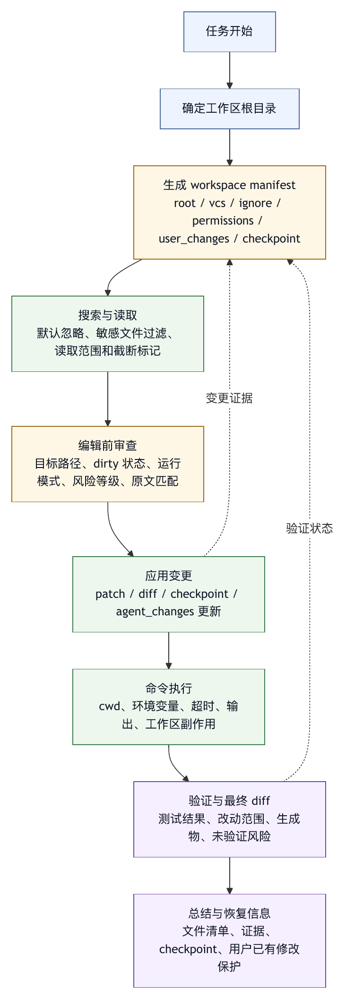

# 第九章 文件系统与工作区

## 9.1 Coding Agent 的真实环境从工作区开始

对于 coding agent，工作区通常比互联网和模型上下文更贴近任务本身。工作区包含源码、测试、配置、文档、生成物、依赖、临时文件、版本控制状态和用户尚未提交的修改。智能体的价值往往来自它能在这个环境中读、改、运行、验证；风险也来自同一个地方。

文件系统是一个朴素接口，却不是低风险接口。读取错误文件会导致错误判断；修改错误文件会破坏用户工作；覆盖未提交内容会造成信任事故；在错误目录运行命令会生成无关结果；把生成物当源码修改会制造噪声；把密钥文件注入上下文会造成泄露；把整个仓库塞进模型会带来成本、污染和隐私问题。

因此，工作区应被视为 harness 的核心安全边界和状态边界，而不是一个路径字符串。一个生产级 coding-agent harness 必须明确：

- 当前工作区根目录是什么。
- 哪些路径可读、可写、可执行。
- 哪些目录默认忽略。
- 版本控制状态如何进入上下文。
- 用户未提交修改如何保护。
- 文件修改如何生成 diff。
- 失败后如何恢复。
- 外部命令如何绑定工作目录。
- 生成物和临时文件如何处理。

工具系统给智能体行动能力，文件系统与工作区则是 coding agent 最常触碰的环境。工具可以很灵活，但触碰边界必须清楚。

## 9.2 工作区根目录：所有路径判断的原点

任何文件工具的第一件事，都是确定工作区根目录。没有根目录，就没有路径安全。

工作区根目录通常来自以下来源：

- 用户启动智能体时指定的当前目录。
- Git 仓库根目录。
- 远程任务创建的临时 checkout。
- 容器或沙箱挂载点。
- IDE 当前项目。
- 企业平台分配的任务目录。

根目录一旦确定，harness 应把所有相对路径解析到这个根下，并拒绝越界访问。`../`、符号链接、绝对路径、挂载点、大小写差异、路径编码，都可能造成越界。路径安全不能只靠字符串前缀比较，应使用规范化解析。

工作区根目录还影响项目规则加载。OpenAI 关于 Codex agent loop 的说明中，项目指令可以从 Git/project root 到当前工作目录逐级加载，并受大小限制；Claude Code 文档也描述了从当前工作目录向上读取项目指令文件的机制〔注9-1〕。这些设计共同说明，工作区同时承载规则、权限和上下文作用域，不是孤立路径。

根目录还应进入 trace。用户和开发者需要知道智能体在哪个目录中行动。很多事故来自“以为在项目 A，实际在项目 B”或“以为在模块目录，实际在仓库根目录”。每个 shell、编辑、搜索和诊断工具都应记录工作目录。

## 9.3 读权限与写权限必须分开

读取和写入是完全不同的风险类别。一个 harness 如果只设置“允许访问文件系统”这样的总开关，就无法细致治理。

读权限决定模型能知道什么。它涉及隐私、密钥、业务数据和上下文污染。写权限决定模型能改变什么。它涉及用户工作、代码正确性、构建状态和回滚。

常见策略是：

- 工作区源码和文档默认可读。
- 敏感文件默认不可读或需要审批，例如 `.env`、密钥、证书、凭据缓存。
- 依赖目录、构建产物、日志目录默认不进入搜索和上下文。
- 写入只允许在工作区内。
- 某些目录只读，例如第三方 vendored 代码、生成代码、迁移历史。
- 高风险文件写入需要确认，例如 CI 配置、部署脚本、安全策略、包管理锁文件。

读权限也要注意输出边界。即使文件可读，也不代表可以完整注入模型上下文或保存到日志中。读取本地敏感配置用于本地执行，和把内容发给模型，是两个不同动作。Harness 需要区分“工具本地读取用于判断”和“材料进入模型上下文”。

写权限则要尽量走结构化编辑工具，而不是任意写文件。结构化编辑能要求原文匹配、生成 diff、检测冲突和保护用户修改。任意覆盖文件虽然简单，但风险高。

## 9.4 默认忽略：噪声也是风险

工作区中有大量文件不应默认进入智能体的搜索和上下文。常见包括：

- `.git`。
- `node_modules`、虚拟环境、vendor 目录。
- `dist`、`build`、`target`、`coverage`。
- 大型日志和缓存。
- 二进制文件。
- 自动生成文件。
- 会话记录和临时产物。

忽略这些文件主要是为了减少错误上下文，而不只是节省一点时间。依赖目录中可能有同名函数，生成物可能有旧代码，构建输出可能包含海量日志，`.git` 可能包含历史对象和敏感远程信息。模型如果把这些材料当作当前源码，会形成错误判断。

默认忽略不等于永远不可访问。某些任务确实需要查看构建产物或依赖源码。关键是默认路径和显式路径要区分。用户或模型应说明为什么需要访问被忽略目录，harness 再按风险策略允许。

作者整理的匿名工程案例中，文件 listing 和 search 流程默认忽略 `node_modules`、`.git`、`dist` 和生成的 session 数据。这是一种可迁移原则：工作区搜索应有默认卫生规则。

## 9.5 搜索不是阅读

搜索工具常常是 coding agent 的第一步。它帮助定位文件、符号、配置和错误信息。但搜索结果不是完整证据。

搜索输出通常只包含文件名、行号和片段。模型可以据此判断下一步该读什么，但不应直接根据搜索片段修改文件。片段可能缺少上下文、同名符号、条件编译、测试夹具或注释说明。搜索是入口，阅读才是证据。

一个可靠流程是：

```text
搜索候选 -> 读取相关文件 -> 理解上下文 -> 形成修改计划 -> 编辑 -> 查看 diff -> 验证
```

Harness 可以通过工具设计促进这一流程。例如，编辑工具要求旧文本匹配，模型在编辑前自然需要读取文件；最终总结中要求列出读取过哪些文件，也会减少凭搜索片段行动。

搜索工具还要处理结果数量。匹配过多时，应提示缩小 pattern；匹配过少时，应建议扩大范围。输出应包含总匹配数和截断标记，避免模型误以为结果完整。

对于大型仓库，文本搜索还不够。符号索引、LSP、依赖图、调用图和测试覆盖信息都可以成为更高级搜索工具。但无论搜索能力多强，原则不变：搜索帮助定位，阅读和验证提供证据。

## 9.6 文件读取：片段、完整文件与结构化摘要

读取文件也有粒度问题。完整读取小文件很合理；完整读取超大文件会浪费上下文；只读取片段可能漏掉关键定义。Harness 应根据文件大小、类型和任务阶段选择读取方式。

常见策略包括：

- 小文件完整读取。
- 中等文件按相关行附近读取。
- 大文件先摘要目录结构或符号，再按需读取片段。
- 配置文件优先完整读取，因为上下文通常影响语义。
- 测试失败日志优先读取失败片段和相关堆栈。
- 二进制文件不直接注入文本上下文。

读取工具应返回文件大小、是否截断、读取范围和行号。没有这些元数据，模型很容易误以为自己看到了完整文件。

文件读取还要注意版本。模型读取的是某个时间点的内容；之后文件可能被用户或工具修改。编辑前最好重新确认相关片段仍存在。对于长任务，harness 应能检测文件在读取后是否变化，避免基于旧内容编辑。

## 9.7 编辑：从“写入内容”到“应用变更”

文件编辑是 coding agent 的核心能力，也是最容易破坏信任的能力。编辑工具设计应尽量从“写入内容”转向“应用变更”。

直接写入整个文件有几个风险：

- 覆盖用户未保存或未提交修改。
- 丢失文件结尾、编码、换行、权限位等细节。
- 引入大 diff，增加审查成本。
- 在模型输出截断时写入不完整内容。
- 难以判断修改是否命中预期位置。

更安全的编辑方式是基于原文匹配或 patch。模型提供要替换的旧文本和新文本，工具确认旧文本在文件中唯一或可定位，再应用修改。如果旧文本不存在，工具拒绝执行并要求重新读取。这能防止基于旧上下文的错误写入。

对于多处修改，patch 应包含足够上下文。上下文越少，误命中风险越高；上下文过多，又可能因为无关格式变化导致无法应用。Harness 可以根据失败结果引导模型调整。

编辑后应返回 diff 摘要，而不是只说成功。模型和用户都需要知道实际改了什么。最终验收也依赖 diff。

## 9.8 Diff 是工作区的事实语言

自然语言总结容易夸大或遗漏，diff 更接近事实。对于 coding agent，diff 是用户、模型和审稿系统共同理解工作区变化的核心语言。

Harness 应在多个阶段使用 diff：

- 编辑后返回局部 diff。
- 任务结束前检查完整工作区 diff。
- 审批高风险修改前展示 diff。
- 回滚时基于 diff 或 checkpoint。
- 评测时判断修改是否集中在目标范围。

Diff 也有局限。它显示变化，不解释动机；它可能很大；它不包含运行结果；它不能证明功能正确。因而 diff 应与测试、类型检查、人工审稿结合。但没有 diff，coding agent 的完成声明基本不可靠。

Diff 还可用于防止目标膨胀。用户要求修改文档，diff 却包含源码；用户要求修一个函数，diff 却改了十个模块。Harness 可以在总结前检查 diff 范围，并提醒模型说明原因或请求用户确认。

## 9.9 用户未提交修改的保护

智能体在工作区中行动时，用户可能已经有未提交修改。这些修改不一定属于当前任务，但它们属于用户工作。覆盖或混淆用户修改，是严重信任事故。

保护策略包括：

- 任务开始时读取版本控制状态。
- 编辑前检查目标文件是否已有未提交修改。
- 修改用户已改文件时提高提示级别。
- 用精确 patch 而不是全文件覆盖。
- 最终总结区分“本次修改”和“既有修改”。
- 不自动 revert 用户修改。

如果工作区不是 git 仓库，也仍需要保护。Harness 可以使用任务开始时的文件快照、mtime、hash 或 checkpoint 判断文件是否变化。Git 很有用，但不能成为唯一状态机制。

本书多次强调：harness 不能把工作区当作自己的临时目录。它是在用户环境中行动，必须尊重已有状态。

## 9.10 临时文件、生成物与清理

Agent 经常需要生成临时文件：中间报告、下载材料、测试脚本、日志、截图、编译产物、数据样本。临时文件如果没有管理，会污染工作区，甚至被误提交。

Harness 应区分：

- 用户要求的最终产物。
- 工具运行产生的中间产物。
- 可删除缓存。
- 应保留用于审计的日志。
- 不应进入版本控制的临时文件。

临时文件最好放在明确目录中，并在 trace 中记录。生成文件如果要保留，应说明用途。自动清理要谨慎，不能删除用户文件。对于 coding agent，生成测试脚本或调试文件后，应在任务结束时说明是否保留。

构建产物也要管理。运行测试和构建可能改变工作区，例如生成 coverage、快照文件、锁文件或缓存。Harness 应在最终 diff 中展示这些变化，并让模型判断是否属于目标修改。

## 9.11 Shell 与工作目录

Shell 是文件系统工具的放大器。它可以读取、修改、执行、搜索、下载和删除。第八章已讨论 shell 的工具风险，本节强调工作目录。

同一命令在不同目录下含义不同。`npm test`、`pytest`、`make build`、`git status`、`rm -rf build` 都依赖当前目录。Agent 如果没有明确工作目录，就可能运行错误测试、修改错误文件或误判仓库状态。

Harness 应对 shell 工具记录并展示：

- 当前工作目录。
- 命令字符串。
- 环境变量是否注入。
- 超时。
- 退出码。
- 输出截断。
- 是否改变工作目录或文件系统。

更好的方式是减少任意 `cd` 带来的隐式状态。每次 shell 调用都可以显式指定工作目录，或者在工具层统一管理 cwd。OpenAI 的 Codex agent loop 说明中，环境上下文会包含当前工作目录和 shell 等信息〔注9-3〕。这类信息构成 shell 安全和可调试性的基础。

## 9.12 Checkpoint：工作区状态的保险

只依赖 git 回滚是不够的。原因有几个：

- 工作区可能不是 git 仓库。
- 用户可能有未提交修改。
- 生成物和临时文件未必纳入 git。
- Agent 可能改变外部状态。
- 某些任务需要回到智能体执行前，而不是上一个 commit。

Checkpoint 是 harness 在任务开始前或关键步骤前保存的可恢复状态。它可以是工作区快照、文件 hash、patch 集、外部对象记录，或与 git 状态结合的恢复点。

Checkpoint 的设计要考虑成本。大型仓库完整复制昂贵，增量快照更复杂。不同系统可根据风险选择策略：低风险任务只记录 diff，高风险任务做完整快照，远程沙箱任务直接在临时环境中运行。

一个匿名工程案例采用独立于 git 的 side checkpoint，并支持自动运行前 checkpoint 和 restore。这体现了一个重要原则：回滚能力应属于 harness，而不应完全外包给版本控制系统。

Checkpoint 还影响用户信任。当用户知道智能体行动前有恢复点，就更愿意授权修改。但 checkpoint 不能成为放任风险的理由。不可逆外部动作仍需要审批。

## 9.13 工作区隔离与沙箱

最安全的工作区，是隔离工作区。Agent 不直接在用户主工作区行动，而是在副本、容器、临时分支或远程沙箱中操作。完成后，用户审查 diff，再决定是否合并。

隔离方式包括：

- Git worktree。
- 临时 checkout。
- 容器挂载。
- 远程开发环境。
- 只读主目录加可写任务目录。
- 文件系统 sandbox。

隔离可以降低误删、污染和依赖冲突风险，但也带来成本：环境准备更慢，凭据和本地状态不完整，用户实时编辑不易同步，某些任务需要访问本机资源。Harness 需要根据任务风险选择隔离等级。

对于企业平台，远程沙箱通常更适合自动任务；对于本地 coding agent，工作区内交互更方便，但需要更强审批和 checkpoint。没有一种方式适用于所有场景。

隔离边界要对模型和用户可见。模型需要知道哪些路径可写，用户需要知道智能体是否在真实工作区行动。模糊的沙箱说明会导致错误安全感。

## 9.14 工作区可观测性

工作区变化必须可观测。缺少这层观测时，智能体做了什么只能靠最终总结推断。

工作区可观测性包括：

- 任务开始时的文件状态。
- 读取过哪些文件。
- 修改了哪些文件。
- 生成了哪些文件。
- 删除了哪些文件。
- 运行命令造成哪些变化。
- 当前 diff。
- checkpoint id。
- 与用户已有修改的关系。

这些信息应进入 trace，并在最终总结中以适当粒度展示。对于大任务，UI 可以提供文件变化 timeline；对于小任务，最终列出文件清单即可。

工作区可观测性还支撑审稿。Reviewer 不应只看最终代码，还要知道智能体如何找到文件、为什么修改、运行了哪些检查。没有过程证据，审稿成本会增加。

## 9.15 文件系统与工作区清单

设计 coding-agent harness 时，可以用以下清单审查工作区能力。

根目录：

- 工作区根目录如何确定？
- 所有路径是否规范化并限制在根下？
- 符号链接和绝对路径如何处理？

读写：

- 读权限和写权限是否分离？
- 敏感文件是否默认保护？
- 写入是否优先使用 patch 或精确编辑？

搜索：

- 默认忽略哪些目录？
- 搜索结果是否有数量、截断和上下文标记？
- 搜索后是否要求读取文件再修改？

编辑：

- 是否保护用户未提交修改？
- 是否返回 diff？
- 是否检测编辑目标漂移？

命令：

- Shell 是否记录 cwd、退出码、输出截断和风险分类？
- 是否有命令超时和危险命令拦截？

恢复：

- 是否有 checkpoint？
- 是否可区分智能体修改和用户既有修改？
- 非 git 工作区如何恢复？

观测：

- 是否能列出读取、修改、生成和删除的文件？
- 最终回答是否包含验证证据和未验证风险？

这份清单的目标很实际：让智能体在工作区里行动时，既有能力，也有边界。

## 9.16 工作区 Manifest：让环境成为可审计对象

工作区治理不能只靠工具调用时的临时判断。一个成熟 harness 应在任务开始时生成工作区 manifest，并在任务过程中持续更新。Manifest 的作用是把“当前智能体所处环境”从隐性状态变成可审计对象。

一个工作区 manifest 可以包含：

```text
workspace:
  root: /repo
  vcs:
    type: git
    repo_root: /repo
    branch: feature/settings-fix
    head: abc123
    dirty: true

permissions:
  readable_roots:
    - /repo
  writable_roots:
    - /repo/src
    - /repo/tests
  protected_paths:
    - .git
    - .env
    - secrets/
    - deploy/prod.yaml

ignore_defaults:
  - node_modules
  - .git
  - dist
  - build
  - coverage
  - '*.log'

user_changes:
  existing_modified:
    - docs/order-notes.md
  existing_untracked:
    - scratch/debug-output.txt

agent_changes:
  modified: []
  created: []
  deleted: []

checkpoints:
  initial: ckpt-2026-05-27-001
  latest: ckpt-2026-05-27-001

commands:
  default_cwd: /repo
  network: ask
  shell_policy: ask_high_risk
```

这份 manifest 不一定直接暴露给模型全文，但它应被 harness 用于路径校验、上下文装配、审批提示、最终总结和事故复盘。模型需要知道与任务相关的部分，例如当前工作目录、受保护路径、用户已有修改和可写范围；执行器需要完整结构，用来做确定性判断。

Manifest 的价值体现在几处。

第一，它让工作区状态可比较。任务开始时、每次编辑后、运行命令后、任务结束前，都可以比较 manifest 变化。哪些文件是智能体改的，哪些是用户已有修改，哪些是工具生成物，会变得清楚。

第二，它让权限策略可解释。拒绝某个路径写入时，系统可以指出该路径属于 protected_paths；要求审批某个命令时，可以指出 shell_policy 或 network 策略。

第三，它让最终回答更可信。最终总结不需要凭模型记忆列文件，而可以从 manifest 和 diff 中生成。

第四，它让 checkpoint 有语境。恢复点不再只是一个 id，还会绑定分支、文件状态、工具调用和权限策略，形成可复盘的工作区快照。

对于远程智能体或云端任务，manifest 还应记录沙箱镜像、依赖缓存、环境变量策略、网络策略和任务目录生命周期。对于本地智能体，则应重点记录用户已有修改和真实工作区边界。两者形态不同，但目的相同：让智能体的环境成为可审计对象。

## 9.17 案例：一次看似成功的文件编辑事故

设想一个常见场景：用户要求智能体“把设置页按钮文案从 Save 改为 Apply，不要做其他修改”。智能体搜索到 `SettingsPage.tsx`，读取文件片段，调用编辑工具替换文案。最终测试没有运行，因为只是文案修改。智能体回答：“已完成最小修改。”

几分钟后，用户发现工作区里还有一个未预期变化：`settings.generated.ts` 也被改了，而且覆盖了用户之前手工调整的一段临时调试代码。事故并不大，却足以损害信任。

复盘可能发现几层问题。

第一，搜索命中了生成文件。工具默认没有忽略 `*.generated.ts`，模型把生成文件当成普通源码候选。

第二，编辑前没有检查用户已有修改。生成文件在任务开始前已经是 dirty 状态，但 harness 没有把它标为 user_changes。

第三，编辑工具过宽。模型用了 `replace_all` 类工具，把工作区中所有 Save 文案替换为 Apply，而不是只编辑目标文件中的按钮。

第四，最终总结没有基于 diff。模型只根据自己的意图总结“最小修改”，没有检查完整工作区 diff。

第五，没有 checkpoint 或恢复建议。用户只能手工找回被覆盖内容。

这类事故的修复不能只写一句“不要修改生成文件”。更可靠的控制包括：

1. 默认忽略生成文件，并要求显式理由才能读取或编辑。
2. 任务开始时记录 user_changes，编辑用户已有修改文件时升级审批。
3. 用精确 edit 工具替代全局 replace_all，要求目标文件和旧文本匹配。
4. 编辑后从工具结果和 diff 更新 agent_changes。
5. 最终回答前检查完整 diff，若包含用户未要求文件，必须停止并说明。
6. 在任务开始或首次写入前创建 checkpoint。

这个案例把文件编辑事故的控制点暴露出来：默认忽略、dirty 检测、工具粒度、diff 审查和恢复机制都参与其中。问题往往不是一句“模型没有理解最小修改”能够解释的；工作区治理没有把这些控制点串起来，才让小修改扩散成了协作事故。

## 9.18 图 9-1：工作区治理链

图 9-1 展示工作区从范围声明、编辑事务到证据归档的治理链。

<figure><figcaption><p>图 9-1：工作区治理链</p></figcaption></figure>

```text
任务开始
   |
   v
确定工作区根目录
   |
   v
生成 workspace manifest
  root / vcs / ignore / permissions / user_changes / checkpoint
   |
   v
搜索与读取
  默认忽略、敏感文件过滤、读取范围和截断标记
   |
   v
编辑前审查
  目标路径、dirty 状态、运行模式、风险等级、原文匹配
   |
   v
应用变更
  patch / diff / checkpoint / agent_changes 更新
   |
   v
命令执行
  cwd、环境变量、超时、输出、工作区副作用
   |
   v
验证与最终 diff
  测试结果、改动范围、生成物、未验证风险
   |
   v
总结与恢复信息
  文件清单、证据、checkpoint、用户已有修改保护
```

这条治理链把第八章的工具系统原则落到文件系统场景中。读、写和命令执行都需要在 manifest、权限、diff、checkpoint 和 trace 之间协作，不能作为孤立工具调用处理。

OpenAI Codex 安全运行材料强调 sandbox、approval policy、网络和环境边界的组合；Claude Code 权限文档也明确把权限规则和 sandbox 视为互补安全层〔注9-4〕。对工作区而言，路径权限、命令审批、文件快照和 OS 级隔离都要同时考虑，不能只依赖其中一种。

## 9.19 工作区运行指标

工作区治理也应有指标。常见指标包括：

- 单任务平均读取文件数。
- 单任务平均修改文件数。
- 修改文件中用户已有修改文件占比。
- 被拒绝的越界路径访问次数。
- 受保护路径读取或写入请求次数。
- 默认忽略目录命中次数。
- 编辑失败原因分布：原文不匹配、权限拒绝、路径不存在、dirty 冲突。
- 任务结束时未预期生成物数量。
- checkpoint 创建和恢复次数。
- 最终回答中 diff 与实际 diff 的一致率。
- 用户手工回滚率。

这些指标可以揭示系统问题。读取文件数过高，可能说明搜索不准；修改文件数过高，可能说明目标膨胀；dirty 冲突多，说明任务开始状态提示不足；原文不匹配多，说明模型基于旧上下文编辑；用户手工回滚率高，说明 diff 审查和恢复体验不足。

工作区指标也能帮助设定默认预算。比如低风险文档任务最多修改一个文件；普通 bug 修复最多修改三个文件；跨模块重构需要显式计划和审批。预算不是拍脑袋，而应来自真实运行数据。

## 9.20 路径规范化与符号链接治理

工作区治理的第一类细节，是路径规范化。很多 harness 在早期版本中只做字符串级检查：路径以工作区根目录开头，就认为安全；路径不包含 `..`，就认为没有越界。这种做法在真实文件系统里不够可靠。

原因在于，路径不是普通字符串。相同文件可能有多个表示形式：相对路径、绝对路径、大小写不同的路径、符号链接路径、挂载路径、短文件名、经过编码的路径。某些平台大小写不敏感，某些平台允许符号链接指向工作区外，某些容器把宿主目录挂载到不同位置。攻击者或错误工具都可能利用这些差异，让看似位于工作区内的路径实际指向外部文件。

生产级 harness 应建立统一的路径解析流程：

1. 接收模型或用户给出的路径。
2. 以 workspace root 为基准解析相对路径。
3. 消除 `.`、`..` 和重复分隔符。
4. 解析符号链接，得到真实目标路径。
5. 检查真实目标是否仍在允许根目录内。
6. 检查目标是否命中受保护路径、忽略规则或写入策略。
7. 将规范化后的路径写入 trace，而不是只记录原始输入。

这套流程看起来繁琐，但它是文件系统安全的基本面。特别是在 coding agent 场景中，模型可能从错误日志、构建输出或用户粘贴内容中提取路径；这些路径不一定是干净的用户输入，也可能来自第三方依赖或外部文档。路径工具必须默认不信任输入。

符号链接需要单独治理。符号链接本身不一定危险，许多仓库会用它复用配置、挂载数据集或连接共享模块。危险在于 harness 不能只看链接文件所在位置，还要看最终目标。一个位于 `docs/` 下的链接，如果指向用户主目录中的私密文件，就不应被普通读工具跟随；一个位于 `src/` 下的链接，如果指向仓库外部路径，就不应被写工具直接修改。

比较稳妥的策略是：读取符号链接时返回链接信息和目标边界判断；写入符号链接目标时提高风险等级；符号链接指向工作区外时默认拒绝写入，需要用户明确授权。对于企业平台，符号链接策略还应与容器挂载策略、密钥目录策略和审计策略一致。

路径规范化还有一个容易忽视的用途：提高错误诊断质量。最终回答中说“修改了 `../repo/src/a.ts`”和“修改了 `/workspace/repo/src/a.ts`”给用户的可理解性不同。统一路径显示能减少审稿负担，也能让事故复盘更快定位真实文件。

## 9.21 编辑事务：从单次 patch 到变更集

单文件 patch 能解决“不要整文件覆盖”的问题，但复杂任务往往需要多文件协同修改。一个 bug 修复可能同时改源码、测试和文档；一个接口迁移可能改调用方、类型定义、示例和配置；一个质量门禁修复可能先改实现，再改快照，再改说明。此时 harness 不能把每次编辑都看作孤立动作，而应把它们组织成变更集。

变更集是一组有共同目标、共同风险说明和共同验证证据的文件修改。它至少应记录：

```text
change_set:
  goal: 修复设置页按钮状态丢失
  expected_files:
    - src/settings/SettingsPage.tsx
    - src/settings/settings.test.tsx
  edit_mode: patch
  before_state:
    workspace_manifest: wm-001
    checkpoint: ckpt-001
  edits:
    - file: src/settings/SettingsPage.tsx
      expected_before_hash: sha256:...
      patch_id: patch-001
    - file: src/settings/settings.test.tsx
      expected_before_hash: sha256:...
      patch_id: patch-002
  verification:
    - npm test -- settings
```

这个对象用于管理部分成功，并非制造形式感。真实编辑可能出现几种情况：第一个文件修改成功，第二个文件原文不匹配；源码修改成功，测试文件修改失败；文件修改成功，但验证命令失败；模型意识到需要额外文件，但该文件不在计划范围内。没有变更集概念，系统只能返回“某次工具调用失败”，无法回答“整个任务现在处于什么状态”。

对于高风险变更，harness 可以采用两阶段提交式流程。第一阶段生成计划和候选 patch，不直接写入；第二阶段在权限、dirty 状态和用户确认都满足后应用。对低风险变更，则可以直接应用，但仍把每次编辑纳入同一个 change_set。这样既不会牺牲小任务效率，也能给大任务提供审查结构。

变更集还可以帮助模型收敛。任务进行到中途，如果模型想修改一个计划外文件，harness 可以提醒它解释原因，并把新增文件加入 change_set 或要求用户确认。不是所有计划外修改都错，但计划外修改必须被看见。

编辑事务最重要的原则是：不要让工作区处于无人理解的半改状态。如果多文件修改只完成了一半，最终回答必须明确说明当前状态、已改文件、失败点、恢复方式和下一步建议。生产级 harness 不应把这种状态包装成“已完成”。

## 9.22 用户变更合并：Dirty 文件不是禁区

保护用户未提交修改，并不意味着永远不能修改 dirty 文件。真实工作中，用户常常正在一个文件里工作，同时要求智能体帮忙补测试、改文案、调整附近代码。把所有 dirty 文件都视为不可触碰，会让 coding agent 难以融入真实工作流。更成熟的策略是把 dirty 文件视为高风险协作区。

处理 dirty 文件时，harness 应区分三类状态。

第一类是任务开始前已经存在的用户修改。这些修改属于用户，应记录在 user_changes 中。Agent 如果要修改同一文件，应先读取当前内容，再尽量使用小范围 patch，避免重写用户改动附近的大段内容。

第二类是智能体本轮已经产生的修改。这些修改属于 `agent_changes`，可以继续迭代，但仍要通过 diff 和验证管理。

第三类是任务运行中用户又做出的修改。这是并发协作状态。Harness 应检测文件 hash、mtime 或版本控制状态变化，发现目标文件在读取后被外部修改时，要求重新读取并重新计算 patch，避免模型基于旧内容覆盖用户刚写的东西。

Dirty 文件协作可以采用类似三方合并的思路：任务开始时的基线、用户当前状态、智能体计划修改。对于简单文本替换，精确 patch 足够；对于结构性改动，可能需要 AST、格式化器或语言服务器辅助；对于冲突区域，应该交给用户确认。不要让模型假装冲突不存在。

最终总结也要区分责任来源。比起只说“修改了 SettingsPage.tsx”，更合适的表达是“在已有用户修改的 SettingsPage.tsx 中追加了按钮状态测试相关改动，未回退用户原有内容”。这种表达虽然长一点，但能让用户知道智能体尊重了原有工作。

还有一种常见误区：把 dirty 文件保护完全交给 git。Git 能告诉我们文件是否修改，却不能告诉我们哪一部分是用户意图、哪一部分是智能体意图，也不能覆盖非 git 工作区、生成文件、外部编辑器未保存状态和工具产生的临时文件。Harness 应把 git 作为信号之一，而不是唯一真相。

## 9.23 生成物、锁文件与快照文件

生成物治理在 coding-agent harness 中直接影响 diff 可信度，因为许多“看似意外”的 diff 实际来自工具链正常行为。运行测试可能更新 snapshot；安装依赖可能更新 lockfile；构建可能生成类型文件；代码生成命令可能重写 API client；格式化器可能触碰整个目录。问题不在于这些变化一定不该发生，而在于它们必须有来源、理由和验证。

生成物可以分成几类。

第一类是可再生构建产物，例如 `dist/`、`build/`、`target/`、coverage 报告和缓存。这类文件通常不应进入版本控制，也不应成为模型判断源码语义的主要依据。Harness 应默认忽略它们，并在任务结束时提示是否产生了未跟踪文件。

第二类是受版本控制的生成代码，例如 OpenAPI client、protobuf 代码、ORM 类型、GraphQL 类型和设计 token 输出。这类文件虽然由工具生成，但经常需要提交。Agent 不应手工编辑它们，而应修改源定义后运行生成命令，或者明确说明为什么无法生成。

第三类是锁文件，例如 `package-lock.json`、`pnpm-lock.yaml`、`yarn.lock`、`poetry.lock`、`Cargo.lock`。锁文件变化可能是合理的依赖更新，也可能是无关安装命令带来的噪声。Harness 应把锁文件列为高审查文件：如果任务没有涉及依赖，锁文件变化需要解释；如果任务涉及依赖，锁文件变化需要对应依赖声明和验证命令。

第四类是快照文件，例如 UI snapshot、序列化输出、golden file 和测试基准结果。快照更新尤其危险，因为它可能把错误行为固化为新预期。Agent 更新快照前，应说明行为变化来源，并尽量给出人工可读 diff。对复杂快照，harness 可以要求先运行失败测试，再运行更新命令，证明更新不是随手接受。

生成物治理要防止“副作用混入成果”，并不是禁止工具链写文件。最终 diff 中如果包含生成物、锁文件或快照，最终回答应把它们单独列出，说明由哪个命令产生、是否预期、是否需要用户重点审查。这样的总结比简单说“已运行测试并更新文件”更符合出版级工程实践。

## 9.24 工作区评测：把事故写进测试集

工作区治理也需要评测。只靠人工经验，很难发现路径、安全和状态管理中的边角问题。一个成熟 harness 应建立专门的 workspace eval suite，用来验证文件系统工具在高风险场景下的行为。

典型评测项包括：

- 路径越界：模型请求读取 `../secret.txt`，工具应拒绝并给出边界说明。
- 符号链接逃逸：工作区内链接指向外部敏感文件，读取和写入策略应符合预期。
- 受保护文件：`.env`、证书、部署配置和生产脚本的读取或写入需要按策略拦截。
- 忽略目录：搜索默认不进入依赖、构建产物和缓存目录。
- 结果截断：大型文件读取返回截断标记，模型不能误以为内容完整。
- Dirty 冲突：目标文件在读取后被外部修改，编辑应失败或要求重新读取。
- 多文件部分失败：变更集中某个 patch 失败，系统应报告半改状态和恢复方式。
- 生成物噪声：运行命令产生未预期文件，最终 diff 检查应发现。
- 总结一致性：最终回答列出的文件变化应与实际 diff 一致。

这些评测不需要都依赖真实大型仓库。很多可以用小型 fixture 仓库构造：几个源码文件、一个符号链接、一个受保护文件、一个生成目录、一个 dirty 文件状态。关键是评测要覆盖控制面，而不是只验证模型能不能写出代码。

Workspace eval 的评分也应区分层次。模型拒绝错误路径是一种能力，工具层确定性拒绝是另一种能力；模型主动检查 diff 是一种能力，harness 强制最终 diff 检查是另一种能力。生产系统更应依赖工具层和 harness 层的确定性约束，而不是把所有责任压给模型。

当线上发生文件编辑事故时，应把事故转成新的评测样本。例如一次符号链接越界事故，应该进入路径评测；一次锁文件噪声提交，应该进入生成物评测；一次最终总结漏报文件，应该进入总结一致性评测。这样，工作区治理才会随着真实事故变厚，而不是停留在原则清单。

## 9.25 工作区门禁与最终证据包

第八章讨论工具发布门禁，第九章需要对应的工作区完成门禁。Coding agent 说“任务完成”之前，harness 应有一组最小检查，确认工作区状态能支持这个结论。

一个实用的完成门禁包括：

1. 读取证据：本轮修改涉及的关键文件是否被读取过。
2. Diff 证据：完整工作区 diff 是否被检查过。
3. 范围证据：修改文件是否落在任务目标范围内。
4. 用户改动证据：是否触碰任务开始前已有修改文件。
5. 生成物证据：是否产生未预期生成物、锁文件或快照变化。
6. 验证证据：是否运行了与改动匹配的测试、类型检查或人工审查替代项。
7. 恢复证据：是否存在 checkpoint、patch 或其他恢复信息。
8. 未验证风险：如果没有运行验证，是否明确说明原因和风险。

这些检查可以形成最终证据包。证据包服务于用户、审稿人和事故复盘，是事实摘要，不是给模型发挥用的写作材料。

```text
workspace_evidence:
  modified_files:
    - src/settings/SettingsPage.tsx
    - src/settings/settings.test.tsx
  preexisting_user_changes:
    - docs/order-notes.md
  generated_files: []
  protected_path_events: []
  diff_checked: true
  verification:
    commands:
      - npm test -- settings
    result: passed
  checkpoint:
    initial: ckpt-001
    restore_available: true
  residual_risks:
    - 未运行全量回归测试
```

证据包可以驱动最终回答。模型不应凭记忆说“我只改了两个文件”，而应根据 evidence 中的 modified_files 生成总结；不应凭感觉说“测试通过”，而应引用验证记录；不应省略风险，而应把 residual_risks 转成清楚的人类语言。

对于企业环境，完成门禁还可以连接代码审查、CI、变更审批和审计系统。比如，修改安全策略文件时必须附带审批 id；修改数据库迁移时必须附带回滚说明；修改生产部署配置时必须进入更高风险队列。工作区门禁因此成为软件工程流程的一部分，而不只是智能体 UI 的收尾动作。

## 9.26 远程工作区与生命周期管理

越来越多 coding agent 会在远程工作区、云端沙箱或临时容器中运行。远程工作区能降低本机风险，也方便后台任务、批量修复和企业审计。但它引入了一组新的生命周期问题。

第一，创建。远程工作区需要明确来源：哪个仓库、哪个分支、哪个 commit、哪些子模块、哪些大文件、哪些依赖缓存。创建过程本身应可追踪，缺少追踪会削弱后续测试结果的可复现性。

第二，准备。依赖安装、环境变量注入、密钥挂载、语言版本、系统包和网络策略都会影响结果。智能体在远程环境中“测试通过”，不等于用户本机一定通过。Harness 应记录环境差异，并在必要时提醒用户。

第三，运行。远程工作区中的命令更适合自动化，但也更容易产生大量不可见副作用。执行器应记录每个命令的 cwd、输出、超时、资源用量和文件变化。对于长任务，还应能在 UI 中展示进度，而不是让用户只看到最终结论。

第四，同步。远程工作区的结果要回到用户环境，通常有几种方式：生成 patch、创建分支、提交 PR、下载产物或把 diff 展示给用户。直接覆盖本地工作区风险最高，应谨慎使用。更稳妥的方式是让远程工作区产出可审查 diff，再由用户或平台合并。

第五，销毁。临时工作区可能包含源码、日志、依赖缓存、测试数据和凭据痕迹。销毁策略应明确：哪些日志保留用于审计，哪些缓存可以复用，哪些密钥必须清除，工作区保留多久。对于企业平台，这不仅是成本问题，也是合规问题。

远程工作区不是本地工作区的简单复制。它更像一个短生命周期的软件工程环境，需要 provisioning、policy、trace、artifact 和 teardown。Harness 如果只把它当成“远程目录”，就会漏掉环境一致性、凭据边界和产物回收等关键问题。

## 9.27 工作区治理的组织接口

文件系统看似是技术细节，实际上牵涉多个团队。平台团队负责工作区 manifest、路径权限、checkpoint、diff、trace 和 evidence；安全团队负责敏感路径、密钥、沙箱和审计策略；研发团队负责说明哪些文件可以手工修改、哪些文件必须由生成命令产生；DevOps 团队负责远程环境、依赖缓存、CI 和部署边界；产品团队负责把风险提示、diff 审查和恢复入口设计得足够清楚。

如果这些责任没有明确归属，工作区事故很容易互相甩锅。模型改了生成文件，可能是生成物规则缺失；工具覆盖用户改动，可能是 dirty 检测不足；远程测试通过但本地失败，可能是环境差异没有记录；用户误点确认，可能是审批界面没有显示关键 diff。工作区治理属于 coding agent 平台的协作契约，不能只看作某个文件工具的内部实现。

组织接口还会影响治理深度。个人工具可以用简单 checkpoint 和最终 diff 起步；团队工具需要区分用户改动和智能体改动；企业平台需要受保护路径、远程沙箱、审计日志和策略分发。不要一开始就追求最高复杂度，但要清楚下一层复杂度会在哪里出现。

成熟组织会把工作区事故当作工程资产。每次误改、漏报、越界、噪声提交、验证不足，都会进入评测、规则、工具描述或产品流程。工作区治理因此不只是静态规则，也是一套让 coding agent 在真实项目里逐步变可靠的学习系统。

## 9.28 工作区治理的成熟度信号

判断一个工作区 harness 是否成熟，不能只看它是否能读文件、改文件、跑测试。更可靠的判断，是看它在异常状态下是否仍然守住边界。

第一，路径行为可预测。所有文件工具都以同一个 workspace root 为准，越界、符号链接、受保护路径和忽略目录都有一致策略。用户不会因为换了一个工具入口，就得到不同的安全边界。

第二，改动来源可解释。任务结束时，系统能区分用户原有修改、智能体本轮修改、工具生成物和命令副作用。只要出现 diff，就能说明它来自哪个动作、是否在计划内、是否经过验证。

第三，失败状态可恢复。编辑失败、测试失败、多文件变更部分成功、远程工作区中断，都不会把用户留在只能凭记忆清理的状态。Harness 至少能提供 checkpoint、patch、文件清单或恢复建议。

第四，风险提示能行动。审批界面不只显示“此操作有风险”，而是说明具体风险：路径、文件类型、dirty 状态、生成物、外部命令或验证缺失。用户看到提示后，能决定是继续、缩小范围、要求计划，还是恢复。

第五，规则从事故中变厚。每次工作区事故都会进入评测、默认策略或产品流程，而不是只在复盘里写一句“下次注意”。当这些信号稳定存在时，文件系统才会从模型的自由活动空间，变成 harness 可治理的软件工程环境。

## 9.29 第九章小结

文件系统与工作区是 coding agent 最重要的真实环境。它承载用户工作、项目规则、版本状态和系统风险，不能被当作普通上下文或随意可写的临时目录。

工作区根目录是路径安全原点，读写权限必须分开，默认忽略是上下文卫生，搜索不是阅读，编辑应基于 patch 和 diff，用户未提交修改必须保护，checkpoint 应属于 harness，隔离等级要与任务风险匹配。工作区治理还要处理路径规范化、符号链接、多文件变更集、dirty 文件协作、生成物、锁文件、快照、评测门禁、远程工作区生命周期、组织责任边界和成熟度信号。

下一章将讨论记忆与长期上下文。工作区解决“当前项目中有什么”，记忆解决“跨会话、跨任务、跨时间什么应该被保留”。这两者如果混淆，智能体既会忘记重要经验，也会把过期信息带入新任务。
