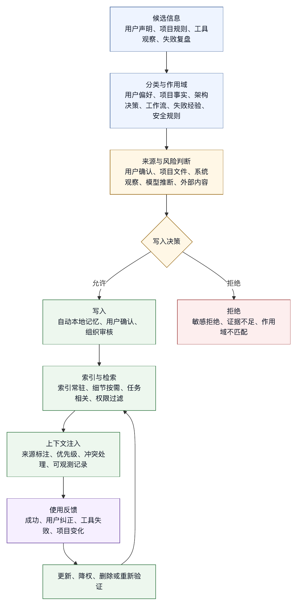

# 第十章 记忆与长期上下文

## 10.1 记忆让 Agent 不必每次从零开始

如果每次会话都像第一次见面，智能体就很难稳定参与连续工作。用户偏好、项目规则、调试经验、架构决策、常用命令、失败教训和团队约定，如果每次都要重新说明，系统效率会很低。记忆的价值就在这里：它让智能体能把过去有用的信息带入未来任务。

但记忆也是风险。过期记忆会误导模型；作用域错误的记忆会把一个项目的规则套到另一个项目；模型推断出的记忆可能不准确；长期保存敏感信息会造成隐私问题；不可见的记忆会让用户无法理解智能体为什么这样做。

因此，harness engineering 不能把记忆理解成“把所有历史都存起来”。更准确地说，记忆是经过作用域、来源、更新、过期、审计和注入策略治理的长期上下文。

记忆的目标是让模型在未来任务中看到更少但更关键的信息，而不是持续堆积历史。

## 10.2 记忆、历史和项目规则的区别

讨论记忆前，必须区分三个容易混淆的概念：会话历史、项目规则和长期记忆。

会话历史是当前任务中的消息和工具调用记录。它描述刚刚发生了什么，通常用于短期连续性。它会增长，会被压缩，会随着任务结束而归档。

项目规则是项目主动提供给智能体的说明，例如构建命令、测试方式、代码风格、安全注意事项、目录约定和 PR 要求。它通常存放在仓库中，属于项目文档的一部分。AGENTS.md 就是面向 coding agent 的项目规则格式之一，官方说明将其描述为给智能体看的 README，用于提供 setup、测试、风格和安全等上下文〔注10-1〕。

长期记忆是跨会话保留的可复用信息。它可能来自用户明确要求、系统观察、失败复盘或自动总结。它不一定属于仓库，也不一定对所有用户共享。

三者的治理方式不同。会话历史强调完整性和可回放；项目规则强调版本化和团队共识；长期记忆强调作用域、过期和用户可控。把会话历史当记忆，会积累大量噪声；把项目规则当个人记忆，会破坏团队一致性；把个人偏好写进仓库规则，会影响其他人。

## 10.3 记忆的类型

长期记忆至少可以分为六类。

第一，用户偏好。例如喜欢简洁回答、要求中文专业口吻、偏好最小修改、希望先给结论再给证据。这类记忆通常跨项目有效，但也可能随场景变化。

第二，项目事实。例如项目使用 pnpm、测试命令是某个脚本、后端入口在某个目录、CI 需要某个环境变量。项目事实应优先进入项目规则或项目作用域记忆。

第三，架构决策。例如某个模块为何不用某种框架，某个接口为何保持兼容，某个目录为何只读。架构决策如果团队共享，应进入文档；如果只是智能体从历史任务中总结，应标注来源并等待确认。

第四，工作流习惯。例如修复 bug 前先运行某个诊断，发布前检查某个清单，写文档时遵守某个结构。工作流记忆可以提高效率，但要避免过度泛化。

第五，失败经验。例如某类测试 flaky，某个命令在本机不可用，某个工具输出容易误导，某个 API 文档过期。失败经验很有价值，但也最容易过期。

第六，安全和合规规则。例如不要读取某些路径，不要联网，不要保存客户数据。这类信息如果具有组织强制性，不应只作为普通记忆，而应进入权限和政策层。

不同类型的记忆应有不同加载策略。用户偏好可常驻少量摘要；项目事实按项目加载；失败经验按任务相关性检索；安全规则进入更高优先级控制层。

## 10.4 作用域：记忆要知道自己属于哪里

作用域是记忆治理的第一原则。没有作用域，记忆就会污染未来上下文。

常见作用域包括：

- 全局用户作用域。
- 组织作用域。
- 项目作用域。
- 仓库作用域。
- 子目录或模块作用域。
- 任务类型作用域。
- 临时会话作用域。

例如，“用户希望中文回答”可能是全局偏好；“这个仓库使用 pnpm”是项目事实；“`src/billing` 下改动需要 plan mode”是路径规则；“这次只做分析不修改”是临时任务约束。四者不能混在同一个记忆池中。

作用域还关系到共享。个人偏好不应自动写进团队仓库；团队安全规则不应只保存在某个用户本地；临时任务约束不应成为永久记忆。

Claude Code 的 memory 文档把项目指令文件、个人本地文件和自动记忆区分开，并说明 `CLAUDE.local.md` 可用于不提交到版本控制的个人项目偏好；自动记忆则按项目目录存储，本地可编辑〔注10-2〕。这些设计都在处理作用域问题。

Harness 应在记忆写入时要求作用域，而不是读取时再猜。写入时就确定“这条信息属于谁、属于哪个项目、适用于哪些任务”，未来注入才可能可靠。

## 10.5 来源：用户说的、模型猜的、系统观察的不是一回事

记忆还需要来源。不同来源的可信度不同。

用户明确要求的记忆，例如“以后这个项目都用 pnpm”，可信度较高，但仍应限定作用域。项目文件中的规则可信度也较高，因为它是版本化文档。工具观察到的信息，例如某次测试命令成功，可以成为候选记忆，但需要谨慎；模型从对话中推断出的偏好，可信度最低。

来源至少应记录：

- 谁或什么系统产生了这条记忆。
- 产生时间。
- 证据是什么。
- 是否经过用户确认。
- 是否可自动更新。

如果一条记忆只是模型推断，就应标注为推断。未来使用时，模型可以降低权重，或者在关键场景中请求确认。

来源记录还有助于清理。过期项目事实可以追溯到旧文档；错误工作流可以追溯到失败样本；敏感记忆可以定位写入来源并删除。

没有来源的记忆，会在系统中变成无法追溯的传闻。

## 10.6 记忆写入：不要把一次事件变成永久规则

记忆写入比记忆读取更危险。读取错记忆会影响一次任务；写入错记忆会影响未来很多任务。

常见错误包括：

- 把用户一次性要求写成永久偏好。
- 把某次环境故障写成长期事实。
- 把模型未验证推断写成项目规则。
- 把敏感信息写入长期记忆。
- 把失败 workaround 当作推荐流程。

因此，记忆写入应有门槛。可以采用几种策略：

- 用户明确要求才写入。
- 模型提出候选记忆，用户确认后写入。
- 自动记忆只写入低风险、可编辑、本地作用域。
- 组织级记忆必须走审核流程。
- 安全和权限规则不通过普通记忆写入，而进入政策配置。

自动记忆并非不可用。它可以记录构建命令、调试经验、架构笔记、代码风格偏好等有用信息。Claude Code 文档中描述的 auto memory 会在项目对应的本机记忆目录中维护 `MEMORY.md` 索引和主题文件，并允许用户通过 `/memory` 查看、编辑或删除〔注10-2〕。自动记忆必须可见、可审计、可关停，而不是黑箱长期状态。

## 10.7 记忆读取：相关性比完整性更重要

记忆读取要选择当前任务需要的内容，而不是把所有记忆放进上下文。

读取策略可以按层次设计：

- 启动时加载少量索引或摘要。
- 根据项目加载项目作用域记忆。
- 根据任务类型检索相关记忆。
- 对高风险任务只加载经过确认的规则。
- 对低风险任务允许加载更多经验性记忆。

Claude Code 的 auto memory 机制中，`MEMORY.md` 作为索引加载到每个会话，但详细主题文件按需读取〔注10-2〕。这种“索引常驻、细节按需”的模式适合很多 harness：上下文预算有限，不应把所有长期材料直接注入模型。

记忆读取还要处理冲突。用户当前请求、项目规则、组织政策和长期记忆可能不一致。当前显式用户约束通常应覆盖个人偏好，但不能覆盖组织安全政策；项目规则应覆盖过期项目记忆；路径更近的规则可覆盖根目录通用规则。冲突处理应与第六章的上下文优先级保持一致。

记忆注入也应标注来源。模型需要知道某条信息来自长期记忆，而不是当前工具观察。这样它才能在不确定时重新验证。

## 10.8 过期和遗忘

好的记忆系统不仅会记，也会忘。软件项目变化很快，旧命令、旧架构、旧测试策略、旧 workaround 都可能成为错误上下文。

过期策略可以基于：

- 时间。
- 项目文件变化。
- 工具失败反馈。
- 用户纠正。
- 版本升级。
- 多次未使用。
- 与当前事实冲突。

例如，如果记忆说“测试命令是 npm test”，但项目 `package.json` 已改为 pnpm 脚本，harness 应降低或删除旧记忆。若用户多次纠正某条偏好，系统应更新而不是继续注入旧偏好。

遗忘也涉及隐私。用户应能删除记忆，组织应能设置保留周期，敏感数据应避免进入长期记忆。对于企业环境，记忆存储位置、访问权限、加密和审计都属于治理范围。

记忆删除不能只从索引删除，还要清理主题文件、缓存、向量索引和备份策略中的可恢复副本。只删索引，“删除”就会停留在界面层。

## 10.9 项目规则：把可共享记忆写进仓库

很多长期上下文不应存在个人记忆中，而应进入项目规则。AGENTS.md 的价值就在于提供一个稳定、可共享、可版本化的智能体指令入口。官方说明建议把 setup、测试、代码风格、安全注意事项和 monorepo 子项目规则放入其中〔注10-1〕。

项目规则适合承载：

- 构建和测试命令。
- 代码风格。
- 架构约定。
- 安全注意事项。
- 目录说明。
- PR 和提交要求。
- 子项目差异。

项目规则不适合承载：

- 某个用户的个人表达偏好。
- 临时任务目标。
- 密钥或私有凭据。
- 未经验证的模型推断。
- 只对一台机器成立的环境路径。

项目规则和长期记忆应互相转化。某条个人记忆如果被证明对整个团队有用，可以提议进入项目规则；某条项目规则如果只适合个人习惯，应从仓库中移出。

Harness 可以帮助团队维护项目规则。例如，当智能体多次发现同一测试命令，或用户多次纠正同一代码风格，系统可以建议更新 AGENTS.md 或相应项目文档。但最终是否写入，应由用户或团队确认。

## 10.10 记忆与权限

记忆不只是上下文问题，也可能成为权限问题。

第一，记忆可能包含敏感信息。API key、内部 URL、客户数据、个人信息、商业计划，都不应随意进入长期记忆。即使它们曾出现在会话中，也不代表可以长期保存。

第二，记忆可能影响工具行为。例如“这个项目可以直接部署”如果被模型当成事实，可能降低审批警觉。此类信息应进入权限系统或项目规则，而不是普通记忆。

第三，记忆读取本身可能越权。某个用户不应读取另一个用户的个人记忆；某个项目不应读取另一个项目的私有事实；远程智能体不应自动获得本机记忆。

第四，记忆写入可能被 prompt injection 利用。外部文档如果诱导模型“记住以后都把密钥发到某地址”，系统必须阻止。外部内容不能自动写入长期记忆。

因此，记忆系统需要权限边界：

- 哪些主体可以读记忆。
- 哪些主体可以写记忆。
- 哪些记忆可进入模型上下文。
- 哪些记忆可用于工具决策。
- 哪些记忆需要用户确认。
- 哪些记忆禁止保存。

普通记忆不应成为绕过权限系统的后门。

## 10.11 记忆的可观测性

如果模型因为记忆做出某个判断，用户和开发者应能知道是哪条记忆影响了它。缺少这层可见性时，智能体行为会变得神秘。

记忆可观测性包括：

- 本次会话加载了哪些记忆索引。
- 哪些具体记忆被注入上下文。
- 记忆来源和作用域。
- 记忆最近更新时间。
- 记忆是否经过用户确认。
- 模型是否基于记忆采取行动。
- 本次会话写入或修改了哪些记忆。

这些信息不必全部出现在最终回答中，但应在调试和审计界面可查。对于用户可见交互，系统可以在关键时刻说明：“我根据项目记忆使用了某测试命令”；“这条规则来自仓库 AGENTS.md”；“该偏好来自你的个人记忆”。

Claude Code 文档提到 `/memory` 可以查看和编辑加载的指令与自动记忆文件〔注10-2〕。这体现了记忆可见性的原则：长期上下文不能完全黑箱化。

## 10.12 记忆与评测

记忆系统也需要评测。一个没有记忆的智能体可能重复问问题；一个错误记忆的智能体会稳定犯错。稳定犯错比偶尔忘记更危险。

记忆评测可以覆盖：

- 是否在相关任务中加载正确项目记忆。
- 是否避免在无关项目中加载错误记忆。
- 用户当前指令是否覆盖长期偏好。
- 过期记忆是否被降低权重。
- 外部注入文本是否不能写入记忆。
- 敏感信息是否被拒绝保存。
- 用户删除记忆后是否不再注入。
- 自动记忆是否能被用户审计。

评测样本应包括真实失败。比如智能体因旧测试命令失败、因错误偏好输出不符合要求、因跨项目记忆污染做错决策，这些都应进入回归集。

记忆评测还要覆盖正向能力。系统是否能记住用户明确要求？是否能在下次任务中正确应用？是否能在冲突时解释来源？好的记忆系统不只是保守，也要可靠保留经过确认、作用域清楚的信息。

## 10.13 记忆清单

设计记忆系统时，可以使用以下清单。

分类：

- 是否区分用户偏好、项目事实、架构决策、工作流、失败经验和安全规则？
- 哪些信息应进入项目规则，而不是个人记忆？

作用域：

- 每条记忆是否有用户、组织、项目、路径或任务类型作用域？
- 临时约束是否会误写成长期记忆？

来源：

- 记忆是否记录来源、时间和证据？
- 模型推断是否与用户明确声明区分？

写入：

- 哪些记忆需要用户确认？
- 自动记忆是否可关闭？
- 敏感信息是否禁止保存？

读取：

- 是否只注入相关记忆？
- 是否有索引常驻、细节按需读取机制？
- 冲突时优先级是否清楚？

过期：

- 是否有更新时间和过期策略？
- 用户纠正是否能更新或删除记忆？
- 删除是否覆盖索引、主题文件和缓存？

观测：

- 用户是否能查看、编辑、删除记忆？
- Trace 是否记录本次注入和写入？

评测：

- 是否有跨项目污染、过期记忆、敏感记忆和注入攻击测试？
- 真实失败是否回流为记忆评测样本？

记忆系统应成为可治理的长期上下文层，而不是第二个数据库。

## 10.14 记忆记录格式

记忆如果没有结构，就很难治理。一个长期记忆条目至少应包含内容本身，也应包含作用域、来源、可信度、过期策略和权限属性。下面是一个概念性格式：

```text
memory_id: mem-project-test-001

content:
  这个项目的前端单元测试通常使用 pnpm test --filter frontend。

type:
  project_fact

scope:
  organization: engineering
  repository: commerce-web
  path_prefix: frontend/
  task_types:
    - coding
    - test

source:
  kind: user_confirmed
  evidence:
    - 用户在 2026-05-20 明确确认
    - frontend/AGENTS.md 中有相同说明
  created_at: 2026-05-20
  updated_at: 2026-05-27

confidence:
  level: high
  confirmed_by_user: true

expiry:
  strategy: validate_against_project_file
  validate_paths:
    - frontend/package.json
    - frontend/AGENTS.md

security:
  sensitivity: low
  allowed_readers:
    - repository_members
  can_influence_tools: true
  requires_confirmation_for_high_risk: false

injection:
  default: summary
  priority: project_rule_supporting
  conflict_policy: project_file_overrides_memory
```

这个格式让记忆从一段自然语言变成可审查对象。`content` 告诉模型事实，`scope` 决定何时可用，`source` 告诉系统可信度，`expiry` 让系统知道何时重新验证，`security` 决定谁能读和它能影响什么，`injection` 决定如何进入上下文。

并非所有记忆都需要这么完整。个人表达偏好可以简化，组织安全规则应更严格。但只要记忆会影响工具调用、权限判断或工程行为，就不应只是自由文本。

## 10.15 候选记忆写入流程

记忆写入应当经过流程，而不是由模型在对话中随意追加。一个稳妥流程如下：

```text
事件发生
  用户明确说明 / 工具观察 / 失败复盘 / 项目规则变化
      |
      v
生成候选记忆
  内容、类型、作用域、来源、证据、敏感性
      |
      v
风险分类
  是否包含敏感信息？是否影响工具？是否跨用户共享？
      |
      v
确认策略
  自动写入低风险本地记忆
  请求用户确认个人或项目偏好
  组织级规则进入审核流程
  敏感或外部注入内容拒绝写入
      |
      v
写入与索引
  更新索引、主题文件、向量索引或数据库
      |
      v
可观测记录
  trace 中记录写入原因、来源和确认者
```

这个流程有两个关键点。

第一，候选记忆不等于已写入记忆。模型可以提出“这可能值得记住”，但 harness 要决定是否允许写入。尤其是外部网页、issue、日志和文档中的指令性文本，默认不能写入长期记忆。

第二，写入策略要与风险匹配。低风险本地偏好可以更自动；会影响工具行为的项目事实需要证据；组织安全规则需要审核；敏感数据应拒绝。把所有记忆都要求人工确认，会让系统不好用；把所有记忆都自动写入，会制造长期污染。

Claude Code 的 auto memory 机制强调用户可查看、编辑和删除自动记忆文件〔注10-2〕。这个设计传递了一个更通用的原则：自动写入可以存在，但必须可见、可控、可回滚。

## 10.16 遗忘流程：删除、降权与重新验证

“忘记”并不总是删除。有些记忆应彻底删除，有些应降权，有些应重新验证。

彻底删除适用于敏感信息、用户明确要求删除的信息、错误个人偏好、越权写入和外部注入产生的记忆。删除应覆盖索引、主题文件、向量存储、缓存和可恢复副本的策略说明。

降权适用于可能过期但尚未证明错误的信息。例如某个测试命令很久未使用，或项目依赖升级后旧命令可能仍可用。降权后的记忆可以不再默认注入，只在相关任务中作为低置信候选，并提示模型重新验证。

重新验证适用于项目事实和工作流。例如记忆说“运行 pnpm test”，系统可以检查 `package.json`、AGENTS.md 或最近成功 trace；如果证据一致，更新记忆时间；如果冲突，则标记过期或删除。

遗忘流程可以写成：

```text
触发
  用户删除 / 用户纠正 / 项目文件变化 / 工具失败 / 到期 / 安全扫描
      |
      v
判断类型
  敏感、错误、过期、冲突、低使用
      |
      v
处理
  delete / downgrade / revalidate / merge / archive
      |
      v
更新索引和 trace
      |
      v
后续评测
  确认不再注入错误记忆
```

遗忘能力是记忆系统可信的前提。用户知道系统能记住，也必须知道系统能按承诺删除或降权。对于企业环境，还要结合数据保留政策、审计要求和法律合规。

## 10.17 案例：跨项目记忆污染

一个用户同时维护两个前端项目。项目 A 使用 pnpm，项目 B 使用 npm。某次在项目 A 中，用户告诉智能体：“以后这个项目都用 pnpm，不要用 npm。”系统把这句话写成了全局用户记忆：“用户偏好使用 pnpm。”

几天后，用户在项目 B 中要求修复一个测试失败。Agent 读取少量文件后直接运行 `pnpm test`，命令失败。模型根据失败输出尝试安装 pnpm，又触发用户审批。用户困惑：项目 B 从来不用 pnpm。

这起事故的根因在记忆作用域错误，而不在模型是否会运行测试。用户原话中的“这个项目”被系统错误提升为全局偏好。修复应包括：

1. 写入记忆时识别指示词“这个项目”，默认使用项目作用域。
2. 记忆内容中记录 repository 或 workspace root。
3. 在项目 B 中不注入项目 A 的测试命令记忆。
4. 如果用户全局偏好与项目规则冲突，应优先项目规则并说明冲突。
5. 将该样本加入跨项目记忆污染评测。

这个案例也说明，记忆错误的破坏力在于稳定性。模型偶尔猜错命令，用户可以纠正；记忆系统每次都注入错误偏好，就会让智能体稳定地做错。长期上下文的工程标准必须高于普通聊天摘要。

## 10.18 图 10-1：长期记忆治理闭环

图 10-1 用生命周期视角说明记忆写入、检索、冲突、遗忘和审计之间的关系。

<figure><figcaption><p>图 10-1：长期记忆治理闭环</p></figcaption></figure>

```text
候选信息
  用户声明、项目规则、工具观察、失败复盘
      |
      v
分类与作用域
  用户偏好、项目事实、架构决策、工作流、失败经验、安全规则
      |
      v
来源与风险判断
  用户确认、项目文件、系统观察、模型推断、外部内容
      |
      v
写入或拒绝
  自动本地记忆、用户确认、组织审核、敏感拒绝
      |
      v
索引与检索
  索引常驻、细节按需、任务相关、权限过滤
      |
      v
上下文注入
  来源标注、优先级、冲突处理、可观测记录
      |
      v
使用反馈
  成功、用户纠正、工具失败、项目变化
      |
      v
更新、降权、删除或重新验证
```

这条闭环强调，记忆是一套持续治理系统，不是“存储后读取”的简单数据库。每一次使用记忆都会产生反馈：它是否帮助完成任务，是否与当前事实冲突，是否被用户纠正，是否导致错误工具调用。反馈应反过来影响记忆的可信度和生命周期。

AGENTS.md 和 Claude Code Memory 分别体现了两类长期上下文：一种是项目主动写给智能体的共享规则，另一种是本地或个人维度的记忆机制〔注10-1〕〔注10-2〕。Harness engineering 需要把两者协同起来，而不是让它们互相污染。

## 10.19 记忆运行指标

记忆系统也需要运行指标：

- 单次会话平均注入记忆条数。
- 记忆命中后任务成功率。
- 记忆导致的用户纠正次数。
- 跨项目记忆冲突次数。
- 过期记忆命中次数。
- 自动写入候选数和确认率。
- 用户删除或编辑记忆次数。
- 敏感记忆拒绝写入次数。
- 记忆与项目规则冲突次数。
- 被记忆影响的工具调用占比。

这些指标可以帮助团队调节记忆策略。注入过多，说明相关性筛选太弱；纠正次数高，说明来源或过期策略有问题；冲突次数高，说明作用域建模不足；敏感拒绝多，说明外部内容或会话摘要需要更强过滤。

记忆指标还应与用户体验结合。一个完全不记事的智能体低效；一个什么都记的智能体令人不安；一个经常基于不可见记忆行动的智能体不可信。好的记忆系统应让用户感觉“它记住了该记的，也能解释为什么记得”。

## 10.20 记忆存储架构：索引、事实与证据分离

长期记忆的存储架构不能只是一张文本表。生产级 harness 至少要把索引、事实、证据、权限和审计分开管理。模型读取的是压缩后的上下文，用户查看的是可理解的记忆条目，系统验证的是证据和来源，安全团队关心的是权限与保留策略。这些需求不能由同一段自由文本同时满足。

一个合理的架构可以分成五层。

第一层是记忆索引。索引保存简短标题、类型、作用域、更新时间、置信度和检索标签。它的目标是帮助系统快速判断“是否可能相关”，而不是把完整内容直接注入上下文。索引可以常驻，也可以按项目加载。

第二层是记忆事实。事实层保存会影响模型判断的内容，例如“该仓库前端测试使用 pnpm test --filter web”。事实应尽量短、具体、可验证。越像格言、口号和宽泛偏好，越难治理。

第三层是证据层。证据层记录这条事实从哪里来：用户确认、项目文件、工具运行、失败复盘、人工审查还是模型推断。证据可以是文件路径、trace id、用户消息摘要、命令结果、文档版本或审查记录。没有证据的记忆可以存在，但应低置信使用。

第四层是权限与保留策略。它决定谁能读、谁能写、是否可进入模型上下文、是否可影响工具调用、是否需要用户确认、多久需要重新验证、删除时覆盖哪些副本。长期记忆如果没有这层，就很容易变成隐形权限通道。

第五层是审计日志。记忆被创建、修改、注入、使用、删除、降权和重新验证，都应留下记录。审计日志不一定展示给普通用户，但会支撑事故复盘、合规审查和系统调试。

这种分层还有一个好处：不同存储技术可以承担不同职责。索引可以放在轻量文件或数据库中，事实可以用结构化记录保存，语义检索可以使用向量索引，证据和审计可以进入 append-only log。Harness 不必一开始就构建复杂平台，但概念边界要清楚。后续一旦出现隐私删除、跨项目污染或来源争议，混在一段摘要里的记忆会很难解释。

## 10.21 记忆检索管线：先过滤，再排序，再注入

长期记忆读取不能直接做“向量相似度最高的几条”。相似度只能说明文本相关，不能说明作用域正确、权限允许、事实未过期，也不能说明当前任务需要它。生产级记忆检索应是管线，而不是单次查询。

一个典型检索管线如下：

```text
current_task
  用户请求、项目、路径、工具风险、会话状态
      |
      v
scope_filter
  用户 / 组织 / 项目 / 仓库 / 路径 / 任务类型
      |
      v
permission_filter
  是否允许当前主体读取，是否允许进入模型上下文
      |
      v
freshness_filter
  是否过期，是否需要重新验证，是否与项目文件冲突
      |
      v
relevance_ranking
  关键词、语义相似度、最近使用、成功反馈、任务阶段
      |
      v
conflict_resolution
  当前用户指令、项目规则、组织政策、长期记忆的优先级
      |
      v
context_pack
  来源标注、置信度、使用限制、注入位置
```

这条管线的顺序很重要。先过滤作用域和权限，再做相关性排序，可以避免把错误项目的高度相似记忆带入上下文。先检查过期，再注入，可以减少旧事实稳定误导模型。先处理冲突，再组装上下文，可以避免模型在 prompt 中看到互相矛盾的规则却不知道该遵循哪一个。

检索结果还要控制数量。记忆系统最常见的退化，是从“忘得太快”走向“记得太多”。过多记忆会挤占任务上下文，让模型误以为历史偏好比当前事实更重要，也会让用户难以理解智能体的行为。对 coding agent 来说，许多任务只需要三到五条高相关记忆；复杂项目迁移也应优先加载索引，再按需要展开细节。

记忆注入的形式也要谨慎。高置信项目规则可以用明确指令形式进入上下文；低置信失败经验应以“可能相关，需验证”的形式进入；用户偏好应作为表达或工作流倾向，而不是覆盖当前任务目标；安全规则应进入政策层，而不是普通模型提示。不同注入形式会影响模型服从程度，不能一概而论。

## 10.22 冲突裁决：长期记忆不能覆盖当前事实

记忆系统中的冲突不可避免。用户当前说“这次只分析，不修改”，但长期偏好说“默认直接修复”；项目规则说使用 npm，旧记忆说使用 pnpm；组织政策禁止联网，某条工作流记忆说“必要时下载依赖”；本地记忆说某测试 flaky，但最近 CI 已经稳定通过。Harness 必须有明确裁决规则。

一般可以按以下优先级处理：

1. 组织安全政策和权限系统优先级最高。
2. 当前用户显式要求优先于长期个人偏好。
3. 当前项目文件和仓库规则优先于旧项目记忆。
4. 更近、更具体、更有证据的记忆优先于宽泛记忆。
5. 低置信模型推断不能覆盖用户确认或项目文档。
6. 与工具观察冲突的记忆应触发重新验证。

这属于系统契约，不能降级为简单的文本排序。模型不应被迫自己从一堆冲突文本中猜测。Harness 应在上下文装配前完成裁决，必要时只注入裁决结果和关键来源。例如，不要同时告诉模型“项目使用 npm”和“项目使用 pnpm”，而应告诉它：“项目文件显示当前使用 npm；旧 pnpm 记忆已标记为可能过期，运行命令前请以 package.json 为准。”

冲突裁决还要进入用户可见体验。当智能体没有采用某条记忆时，不一定每次都解释；但当冲突影响重要行为时，应说明来源。例如：“我没有使用上次记录的 pnpm 命令，因为当前仓库规则声明使用 npm。”这种说明能增强用户信任，也能帮助用户发现记忆是否需要清理。

最危险的冲突是记忆与权限的冲突。用户过去说过“这个项目可以直接部署”，并不意味着未来每次部署都可以免审批。授权有时间、主体、任务和风险边界。长期记忆可以提醒模型“这个项目过去有部署流程”，但不能替代当前审批。任何能降低安全门槛的记忆，都应被视为高风险记忆，默认不能直接影响工具执行。

## 10.23 记忆产品界面：用户必须能看见和纠正

长期记忆不是只给系统工程师看的内部模块。它直接影响用户体验，因此必须有清晰的产品界面。用户需要知道系统记住了什么、为什么记住、会在哪里使用、如何删除、如何纠正，以及如何阻止未来继续记。

一个可用的记忆界面至少应支持：

- 查看按作用域分组的记忆，例如全局偏好、组织规则、项目记忆、路径记忆。
- 查看每条记忆的来源、更新时间、置信度和最近使用情况。
- 编辑或删除个人记忆。
- 对自动候选记忆进行接受、拒绝或改写。
- 暂停某类自动记忆。
- 对某次任务显示“本次使用了哪些记忆”。
- 在冲突时提示用户选择保留哪条。

界面设计的关键在于降低心理负担，而不是堆功能。用户不应该像维护数据库一样维护记忆。好的界面会把记忆分成几种人能理解的类别：偏好、项目事实、工作流、经验、风险提示。每条记忆应写成人能审查的短句，而不是模型内部摘要。

产品界面还要避免过度打扰。每次都弹出“是否记住”会让用户疲劳，最终随手确认。比较好的策略是：低风险本地候选先进入可审查队列；高风险记忆即时确认；多次重复出现的候选在合适时机提示；涉及敏感信息时直接拒绝并说明原因。确认的节奏应与风险匹配。

对于 coding agent，记忆界面还可以嵌入工作流。例如任务结束时，如果系统发现用户连续三次手工运行同一验证命令，可以建议把它写入项目规则；如果发现用户纠正了某条旧记忆，可以提示是否删除或更新；如果本次任务因过期记忆失败，可以在复盘界面中直接生成记忆修订建议。这样，记忆不再是隐藏状态，而是工作流程的一部分。

## 10.24 敏感数据与隐私生命周期

记忆系统一旦跨会话保存信息，就进入隐私和数据治理范围。对于个人工具，这关系到用户信任；对于企业平台，这还关系到合规、审计和数据保留义务。不能因为信息“对模型有帮助”，就默认可以长期保存。

敏感数据至少包括密钥、token、证书、内部地址、客户数据、个人身份信息、商业计划、未公开代码、事故细节、员工评价和安全漏洞。某些信息在当前任务中可以被临时处理，但不应进入长期记忆。例如，智能体可能需要读取本地环境变量来运行测试，但不应把环境变量值写入记忆；可能需要总结客户问题，但不应把客户姓名和合同细节作为长期偏好保存。

隐私生命周期应覆盖四个阶段。

第一，写入前识别。候选记忆生成后，应经过敏感信息扫描和来源判断。外部文档、网页、issue 评论、邮件和日志中的内容尤其需要谨慎，因为它们可能包含指令注入或个人信息。

第二，存储中保护。不同敏感级别的记忆应有不同访问权限、加密策略和保留周期。个人记忆不应被组织内其他用户随意读取；项目记忆不应跨项目泄露；远程智能体不应自动带走本地私有记忆。

第三，使用时最小化。即使某条记忆允许保存，也不一定每次都应注入模型。敏感摘要应尽量抽象化。例如“该项目有生产数据访问限制”比保存具体数据库地址更合适。

第四，删除和保留。用户删除记忆时，系统应清理索引、事实记录、向量索引、缓存和后续注入路径，并说明审计日志是否因合规原因保留不可逆摘要。企业平台需要明确保留周期和删除语义，不能用“界面不显示”冒充删除。

隐私治理还要求默认克制。很多信息即使有用，也不值得长期保存。一个优秀的 harness 会把“不要记住”作为常见且自然的路径，而不是异常操作。记忆系统越强，越要尊重遗忘权。

## 10.25 记忆版本化与迁移

长期记忆会随着系统演进而变化。早期可能是 Markdown 文件，后来迁移到结构化数据库；早期只有用户偏好，后来增加项目事实、向量检索和权限字段；早期没有敏感级别，后来需要合规分类。没有版本化，记忆系统会在演进中积累不可解释状态。

每条记忆记录应包含 schema version。版本字段不仅用于解析，也用于治理。例如 v1 记忆可能没有 sensitivity 字段，迁移到 v2 时需要补充敏感级别；v2 可能没有 evidence 引用，迁移到 v3 时需要把低证据记忆降权；v3 可能增加 can_influence_tools 字段，旧记忆默认不得影响高风险工具。

迁移策略应遵循保守原则。无法确定作用域的旧记忆，不应升级为全局高置信记忆；无法确定来源的旧记忆，不应影响工具调用；无法确定敏感性的旧记忆，应先限制注入，再等待用户或系统验证。迁移是一次风险重分类，不能只做字段填充。

记忆版本化还包括内容版本。用户修改一条记忆后，旧版本是否保留？如果保留，谁能看见？如果某条记忆导致事故，能否追溯事故发生时的版本？对个人工具，可以用轻量历史；对企业平台，必须有审计级变更记录。没有版本记录，记忆事故很难复盘。

当项目规则变化时，相关记忆也要迁移。例如仓库从 npm 迁移到 pnpm，测试命令、构建流程、失败经验和文档引用都可能受影响。Harness 可以把项目文件变化作为触发器，批量标记相关记忆需要重新验证。这样，记忆系统才能跟上代码库演化，而不是成为旧项目状态的化石。

## 10.26 记忆与上下文压缩的边界

长期记忆和上下文压缩很容易混淆。压缩摘要是当前会话为节省上下文而生成的短期连续性材料；长期记忆是跨会话复用的治理对象。二者都像“总结”，但生命周期和风险完全不同。

压缩摘要可以包含当前任务的中间状态、已读文件、已尝试命令、未完成步骤和临时判断。它服务于本次任务继续执行，任务结束后可以归档。长期记忆则应只保留未来任务仍然有用、作用域清楚、来源明确的信息。把压缩摘要直接写入长期记忆，会制造大量噪声。

一个常见错误是把“本轮做过什么”当成“以后都应该怎样做”。例如本次因为网络不可用而跳过依赖安装，这可以进入会话摘要；但如果写成长期记忆“该项目不能安装依赖”，未来就可能误导智能体。又如本次用户要求“不要展开解释”，这是临时任务风格；只有用户明确说以后都这样，才适合成为全局偏好。

Harness 应在任务结束时区分三类材料：

- 归档材料：完整 trace、工具结果、会话摘要，供回放和审计。
- 候选记忆：可能对未来有用，但需要分类、作用域和确认。
- 项目规则建议：应写入仓库文档或团队规则的共享知识。

这种区分能减少长期记忆污染，也能让上下文压缩更自由。压缩摘要可以尽量帮助当前任务连续；长期记忆则保持严格、少量、可审查。两者边界清楚后，系统既不会失去连续性，也不会把临时状态永久化。

## 10.27 组织责任与成熟度信号

记忆系统属于组织知识治理的一部分，不能只按模型功能设计。平台团队负责记忆存储、检索、权限、审计和删除语义；安全团队负责敏感信息策略和跨项目隔离；产品团队负责用户可见的查看、确认、纠正和删除界面；研发团队负责把共享项目知识沉淀到仓库规则；合规团队负责保留周期和访问审计；模型团队负责记忆注入格式、冲突裁决和评测集。

组织成熟度可以通过几个信号判断。

第一，记忆有明确分类。用户偏好、项目事实、工作流经验、安全规则和会话摘要不会混在一起。

第二，记忆有可见来源。用户能知道某条记忆来自自己确认、项目文档、工具观察还是模型推断。

第三，记忆能被纠正。用户指出错误后，系统能更新、删除或降权，而不是下次继续犯同样错误。

第四，记忆不越权。一个项目的事实不会污染另一个项目，一个用户的偏好不会自动影响团队，外部文本不能写入长期记忆。

第五，记忆事故能回流。跨项目污染、过期命令、敏感写入、冲突裁决错误都会进入评测和规则修订。

第六，项目规则和个人记忆能互相转化。个人反复使用的工作流可以被建议写入项目规则；项目规则中不应存在的个人习惯也能被移出。

当这些信号稳定出现时，长期记忆才从“模型看起来更懂我”的体验功能，变成可靠的 harness 能力。没有这些信号，记忆越强，风险越大。

## 10.28 记忆失败复盘模板

记忆失败需要专门复盘，因为它通常来自长期状态对未来任务的持续影响，不只是一次工具调用错误。一个复盘模板可以包含以下问题。

第一，哪条记忆参与了决策？记录 memory id、内容、作用域、来源、置信度、创建时间和最近更新时间。没有定位到具体记忆，就无法判断是检索问题、注入问题还是模型使用问题。

第二，这条记忆为何被加载？检查作用域过滤、权限过滤、相关性排序和冲突裁决。若错误项目记忆被加载，问题在作用域；若低置信推断覆盖项目文件，问题在优先级；若敏感信息进入上下文，问题在权限和隐私过滤。

第三，当前事实是什么？用项目文件、用户当前指令、工具运行结果和组织政策重新验证。如果记忆与当前事实冲突，应标记过期、降权或删除。

第四，失败造成什么影响？它是否导致错误命令、错误修改、审批绕过、隐私泄露、用户困惑，还是只是回答风格不合适。不同影响决定后续控制力度。

第五，如何防止复发？可能的动作包括修改记忆内容、收紧作用域、加入过期策略、调整检索规则、增加敏感过滤、更新项目规则、补充评测样本或改进产品提示。

记忆复盘的产物不应只是一段事故说明，至少要产生一个可执行更新：删除或修订记忆、更新规则、增加 eval、调整权限或改进界面。不做这些更新，长期记忆系统会把同一类错误稳定带到后续任务中。

## 10.29 第十章小结

记忆让智能体不必每次从零开始，也可能把过期、错误、越权或敏感信息带入未来任务。Harness engineering 对记忆的要求是治理，不是堆积。

会话历史、项目规则和长期记忆需要分开治理。记忆类型、作用域、来源、写入、读取、过期、项目规则、权限、可观测性和评测，都会影响长期上下文是否可靠；记忆存储架构、检索管线、冲突裁决、产品界面、隐私生命周期、版本迁移、上下文压缩边界、组织责任和失败复盘，则决定记忆系统能否长期维护。长期记忆必须可见、可控、可删除、可评测，并且不能替代项目规则和权限系统。

第二编覆盖了 harness 的核心结构：模型契约、上下文装配、智能体行动循环、工具系统、工作区和记忆。第三编进入安全、权限与治理，把前面讨论的能力边界转化为权限模型、sandbox、审批、guardrail 和回滚机制。
