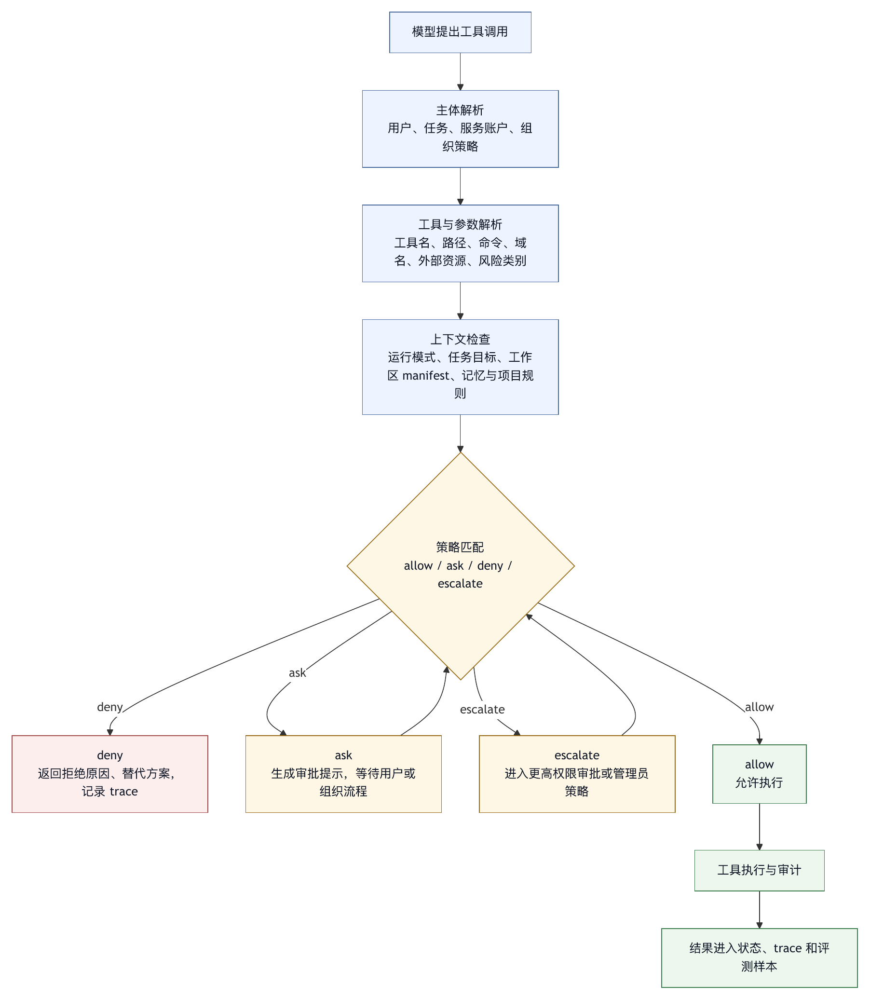

# 第十一章 权限模型

## 11.1 权限是智能体自主性的边界

前两编讨论了 harness 的能力结构：模型、上下文、循环、工具、工作区和记忆。第三编开始讨论安全、权限与治理。第三编的任务，是为自主性建立边界，而不是让智能体变得保守。

智能体系统的价值来自行动能力。它能读文件、改代码、运行命令、调用 API、访问知识库、生成报告、提交变更。可是行动能力越强，权限模型越重要。一个没有权限边界的智能体，相当于把用户或组织账户的能力交给概率模型；一个权限过窄的智能体，又会频繁停在低风险动作上，失去效率。权限模型要解决的正是这个平衡。

权限不是“每次问用户是否允许”这么简单。它应回答：

- 哪个主体在行动？
- 为了哪个任务行动？
- 调用哪个工具？
- 使用哪些参数？
- 访问哪个路径或外部资源？
- 是否有副作用？
- 当前运行模式允许到什么程度？
- 是否需要用户、团队或系统审批？
- 是否有日志、回滚和责任归属？

如果这些问题无法回答，权限提示就只是一个按钮，而不是治理机制。

## 11.2 模型不是权限主体

权限模型的第一原则是：模型不是权限主体。模型可以建议行动、解释风险、请求工具，但不能拥有权限。权限属于用户、服务账户、组织策略、运行环境和 harness 执行器。

这一区分很重要。模型可能输出“我需要读取这个文件”，但文件读取是否允许，应由 harness 根据路径、运行模式、用户授权和策略判断。模型可能输出“这个命令安全”，但 shell 命令是否执行，应由权限系统和 sandbox 判断。模型可能说“我已经得到用户同意”，但用户同意应来自可审计的交互事件，而不是模型总结。

把模型当作权限主体，会导致两类问题。

第一，模型可以被上下文污染或 prompt injection 影响，从而错误判断权限。外部文本可能诱导模型执行高风险动作；模型也可能误解用户意图。

第二，模型判断不可审计。组织需要知道谁授权、授权范围是什么、何时生效、何时过期。模型输出不应替代授权记录。

因此，权限执行点必须在 harness 中。模型提出，harness 决定；用户或策略授权，harness 记录；工具执行后，harness 审计。

## 11.3 权限的多维度

一个成熟权限模型通常需要多个维度，而不是单一 allow/deny。

工具维度：哪些工具可用。读取、搜索、编辑、shell、网络、MCP、git、消息发送、部署、数据库写入，风险完全不同。

风险维度：只读、写入、本地副作用、外部副作用、不可逆副作用、敏感数据访问、成本消耗。

路径维度：工作区内外、敏感文件、生成目录、依赖目录、用户主目录、系统目录。

参数维度：同一工具不同参数风险不同。`git status` 和 `git push` 都是 git；`rm temp.txt` 和 `rm -rf /` 都是 shell 删除；读取 README 和读取 `.env` 都是 read。

身份维度：当前用户、团队、服务账户、临时 token、外部系统身份。智能体不应模糊使用谁的权限。

任务维度：分析任务、代码修复、发布任务、数据查询、消息发送任务应有不同默认权限。

运行模式维度：只读、交互确认、自动接受低风险编辑、高自主模式、远程无人值守模式。

组织策略维度：某些规则由管理员设定，不应被用户或项目配置覆盖。

这些维度组合起来，才形成可用的权限模型。例如：“在只读模式下允许读取工作区源码，拒绝读取 `.env`；允许搜索；拒绝编辑和 shell；允许 WebFetch 访问文档域名；禁止所有外部写入工具。” 这比“允许智能体使用工具”清楚得多。

## 11.4 运行模式：把默认自主性分层

运行模式是权限模型的用户可理解入口。它把复杂策略压缩成几个操作姿态。

常见运行模式包括：

- 只读模式：允许读取、搜索、分析，禁止修改和外部副作用。
- 交互模式：低风险读操作自动允许，写操作和 shell 请求确认。
- 自动接受编辑模式：文件编辑自动允许，但 shell、网络和外部副作用仍需确认。
- 高自主模式：多数动作自动允许，但危险命令和敏感资源仍拦截。
- 远程无人值守模式：默认更保守，通常限制工具、网络和写入范围。

运行模式不是完整策略，但它给用户一个心智模型。用户在“只读模式”下可以放心让智能体探索；在“自动接受编辑模式”下知道文件可能被改；在“高自主模式”下知道要依赖 sandbox、checkpoint 和审计。

一个匿名工程案例中的安全模型包含 plan、accept-edits、agent 和 yolo 等模式，并在细粒度权限策略前后配合执行。Claude Code 文档也把权限和 sandbox 作为互补层：权限控制工具、文件和域名访问，sandbox 提供 OS 层限制〔注11-2〕。这些设计为本书的判断提供了旁证：运行模式适合给用户建立心智模型，但不能替代细粒度规则。

## 11.5 工具权限：从名字到行为

工具权限不能只看工具名。工具名是起点，行为才是重点。

例如 shell 工具最典型。同一个 `Bash` 或 `run_shell` 工具可以运行 `ls`、`npm test`、`git status`、`curl | sh`、`rm -rf`、`git push`。如果权限只写“允许 Bash”，就等于允许一大片不同风险的动作。

以 Claude Code permissions 文档为例，Bash 规则需要识别通配、复合命令、命令分隔符和 wrapper，避免规则误放大〔注11-2〕。这个例子说明，工具权限必须理解参数结构。`safe-cmd && dangerous-cmd` 不能因为前半段安全就整体通过。

工具权限应至少支持：

- 精确工具名。
- 风险类别。
- 参数 pattern。
- 子命令解析。
- 路径解析。
- 网络域名。
- 外部系统资源。

对于 MCP 工具，还要考虑 server 信任。MCP 官方规范说明工具由 server 暴露，带 name、description、input schema 和 output schema；同时也提示客户端要把来自非可信 server 的工具注解视为不可信，并在敏感操作前提示用户、校验工具结果和保留审计日志。OWASP MCP Top 10 作为持续演进的风险清单，列出 scope creep、tool poisoning、command injection、audit 缺失等风险〔注11-3〕。外部工具进入 harness 后，不能因为协议标准化就自动可信。

## 11.6 路径权限：文件系统安全的细粒度边界

路径权限是 coding agent 的核心权限。第九章讨论过工作区根目录和读写边界；本章把它放入权限模型。

路径权限需要处理：

- 工作区内路径。
- 工作区外路径。
- 用户主目录。
- 系统目录。
- 敏感文件。
- 生成目录。
- 符号链接。
- 隐藏文件。
- 子模块和外部挂载。

一个常见规则是：默认只允许工作区内读写，工作区外访问需要明确授权。敏感文件即使在工作区内，也应默认拒绝或询问。符号链接需要解析真实路径，避免通过链接绕过边界。

路径权限还应区分读和写。读取 `package.json` 低风险，修改 `package.json` 可能影响依赖；读取 CI 配置有助于理解，修改 CI 配置可能改变发布链路；读取 `.env.example` 合理，读取 `.env` 风险高。

路径权限应与最终回答结合。智能体修改了哪些路径、是否触及敏感目录、是否越过默认范围，都应在总结中可见。

## 11.7 网络权限与外部系统

网络权限比文件权限更难，因为外部系统种类更多、状态不可控、身份复杂。

网络动作可以包括：

- 读取公开网页。
- 调用 API。
- 下载依赖。
- 上传文件。
- 发送消息。
- 创建 issue 或 PR。
- 查询数据库。
- 部署服务。
- 访问企业内部系统。

这些动作不能用一个“是否允许联网”概括。读取官方文档和向未知 URL 上传日志，风险完全不同。网络权限需要域名、方法、数据类型、身份、是否有副作用和成本等维度。

对智能体来说，网络权限还涉及 prompt injection。网页、issue、文档和消息都可能包含恶意指令。即使只读网络访问，也可能污染上下文。因此，网络读取不只是隐私风险，也可能影响后续工具行为。

网络写入更应谨慎。发送消息、创建任务、修改数据库、触发部署，都可能影响他人或生产系统。默认应请求确认，并展示目标系统、身份、内容和可回滚性。

## 11.8 权限提示：让用户能判断，而不是只点按钮

用户审批是权限系统的一部分，但审批设计很容易失败。如果提示太频繁，用户会机械批准；如果信息太少，用户无法判断；如果风险表达模糊，用户会失去信任。

一个好的权限提示应包含：

- 工具名称。
- 具体动作。
- 关键参数。
- 作用对象。
- 风险级别。
- 可能副作用。
- 是否可回滚。
- 为什么需要该动作。
- 替代方案。

例如，“允许执行 Bash？”信息太少；“允许在工作区根目录执行 `npm test`，预计只读并生成测试输出，超时 120 秒？”就更可判断。对于高风险命令，还应说明风险：“该命令会删除目录，当前无自动恢复保证。”

审批结果要记录。用户本轮批准某个命令，不等于永久批准同类命令；如果用户选择“以后不再询问”，系统应保存精确规则，而不是过宽规则。

审批设计的目标是把用户注意力用在关键判断上。低风险重复动作应自动化，高风险动作应清晰询问。

## 11.9 最小权限和权限到期

最小权限原则同样适用于智能体。智能体应获得完成当前任务所需的最小能力，而不是获得用户账户的全部能力。

最小权限可以体现在：

- 按任务暴露工具。
- 按路径限制文件访问。
- 按域名限制网络。
- 使用临时凭据。
- 外部系统使用 scoped token。
- 权限随任务结束失效。
- 高风险能力需要逐次确认。

权限还应有到期机制。很多安全问题来自临时权限永久化。OWASP MCP Top 10 的 scope creep 条目可作为风险清单提醒：临时或宽松权限可能逐渐扩大，最终给智能体过多能力〔注11-4〕。

对于企业 harness，权限应与身份系统集成。用户离职、项目归档、角色变化、任务完成，都应影响智能体权限。普通配置文件不足以承担组织级权限治理。

## 11.10 权限拒绝是控制信号

当权限系统拒绝工具调用时，模型不应把它视为普通失败并反复重试。拒绝是控制信号。

拒绝结果应明确：

- 哪条规则拒绝。
- 拒绝的是工具、路径、参数还是身份。
- 是否可以请求用户授权。
- 是否存在低风险替代方案。
- 是否应停止任务。

例如：“当前只读模式禁止编辑文件；你可以继续分析并给出 patch 建议，或请求用户切换模式。” 这比“permission denied”有用。

权限拒绝也应进入 trace 和评测。频繁拒绝可能说明默认模式太保守，也可能说明模型经常越界。团队需要分析拒绝原因，而不是简单放宽权限。

## 11.11 权限与组织治理

个人工具可以依赖用户本地选择；企业 harness 需要组织治理。

组织治理包括：

- 管理员托管设置。
- 工具 allowlist 和 denylist。
- 域名 allowlist。
- 敏感路径策略。
- 审计日志保留。
- 凭据管理。
- 数据分类。
- 风险审批流程。
- 事件响应。

NIST AI RMF 作为自愿使用的风险管理框架，强调将可信任考量融入 AI 产品、服务和系统的设计、开发、使用和评估，并关注个人、组织和社会风险〔注11-5〕。对 harness 来说，这提供了治理视角：权限模型不能只在用户界面上处理，而要进入系统生命周期，设计时定义策略，运行时执行，事后审计，失败后改进。

组织治理还需要区分环境。开发环境、测试环境、生产环境权限应不同。智能体在开发仓库中自动修改文件，与智能体在生产系统中执行迁移，是完全不同风险级别。

## 11.12 权限评测

权限系统需要测试。不能只靠代码 review 或用户直觉。

权限评测应覆盖：

- 低风险动作是否顺畅通过。
- 高风险动作是否请求确认。
- 禁止动作是否被拒绝。
- 复合命令是否被正确解析。
- 路径越界是否被拦截。
- 符号链接是否不能绕过。
- 网络域名策略是否生效。
- MCP 工具是否受统一策略约束。
- 用户拒绝后模型是否停止同类尝试。
- 审批记录是否完整。

还应进行对抗性测试。比如，外部文档诱导智能体读取密钥；工具输出要求执行危险命令；模型尝试通过 shell 绕过专用工具限制。权限系统必须在执行点拦截，而不是期待模型自觉。

OWASP LLM Top 10 中的 prompt injection、insecure output handling 和 excessive agency 等风险，都可以转化为权限评测样本〔注11-6〕。

## 11.13 权限模型清单

设计权限模型时，可以使用以下清单。

主体：

- 权限属于用户、服务账户、组织策略还是临时任务？
- 模型是否只提出请求，而不拥有权限？

维度：

- 是否按工具、风险、路径、参数、身份、任务和模式区分？
- 是否区分读、写、本地副作用、外部副作用和不可逆动作？

执行：

- 权限检查是否在工具执行前发生？
- 是否能解析复合命令和高风险参数？
- 外部工具和 MCP 是否受同一策略控制？

审批：

- 提示是否足够用户判断？
- 审批是否有范围和有效期？
- “不再询问”是否生成精确规则？

组织：

- 是否支持管理员托管策略？
- 是否有审计日志和事件响应流程？
- 是否能按环境区分权限？

评测：

- 是否有拒绝、越界、prompt injection、tool poisoning 和过度自主测试？
- 权限失败是否进入回归集？

权限模型承担智能体自主性的工程边界，不能被当作附加安全层。

## 11.14 权限策略模板

权限策略如果只散落在工具代码、提示词和产品文案中，很难审查，也很难评测。一个成熟 harness 应把权限策略写成可读、可测试、可审计的配置或策略对象。下面是一个抽象模板：

```text
permission_policy:
  name: coding-agent-interactive
  scope:
    users: project_members
    repositories: current_workspace
    modes:
      - interactive

  defaults:
    unknown_tool: deny
    unknown_path: ask
    external_side_effect: ask
    irreversible_action: ask

  tools:
    read_file:
      default: allow
      constraints:
        path: workspace_readable
      deny:
        - path.matches(".env")
        - path.matches("secrets/**")

    edit_file:
      default: ask
      allow_when:
        - path.in_writable_roots
        - risk == "write_low"
        - mode in ["accept_edits", "agent"]
      ask_when:
        - path.matches("ci/**")
        - path.matches("deploy/**")
        - modified_files_count > 3
      deny_when:
        - path.outside_workspace
        - path.matches(".git/**")

    run_shell:
      default: ask
      allow_when:
        - command.class == "test"
        - cwd.in_workspace
        - network == false
      ask_when:
        - command.class == "install"
        - command.class == "network"
      deny_when:
        - command.class == "destructive"
        - command.contains_remote_pipe
        - command.accesses_secrets

  approvals:
    duration: single_action
    record:
      - user_id
      - tool
      - params_hash
      - risk
      - reason
      - timestamp

  audit:
    log_allowed: true
    log_denied: true
    redact_params:
      - secret
      - token
      - password
```

这个模板表达了几个工程原则。

一方面，默认规则要保守。未知工具、未知路径和不可逆动作不能自动允许。工具生态会变化，MCP server 会新增能力，项目目录会调整；默认 allow 会让变化悄悄扩大权限。

另一方面，策略要能看见参数。`edit_file` 的风险取决于路径、文件类型、修改范围和运行模式；`run_shell` 的风险取决于命令分类、工作目录、网络和副作用。只有工具名的策略不够。

第三，审批要有范围和有效期。单次批准、任务级批准、会话级批准和永久规则是不同授权。系统应鼓励精确授权，避免用户为了减少弹窗而生成过宽规则。

第四，审计要成为策略的一部分。允许、拒绝、询问和用户决策都应记录。没有审计，权限系统无法进入事故复盘和持续改进。

这类策略可以用配置、策略语言、代码规则或企业权限系统实现。实现形式可以不同，但权限决策必须可解释、可测试、可回放。

## 11.15 案例：一次 Bash 宽授权如何演化成权限事故

很多 coding agent 事故都从一次看似合理的宽授权开始，并不总是从明显危险命令开始。

设想用户在交互模式下要求智能体修复一个测试失败。智能体准备执行 `npm test`，系统弹出审批：“允许执行 Bash？” 用户认为只是运行测试，于是选择“本会话不再询问 Bash”。接下来，智能体在测试失败后尝试安装依赖、运行生成脚本、执行清理命令，最后一个旧脚本删除了本地缓存目录。用户没有预期这些动作，因为他以为自己批准的是测试命令。

这起事故的根因是审批粒度错误，不能简单归因于用户不谨慎。

第一，审批对象过宽。用户批准了 Bash 工具，而不是 `npm test` 这个具体命令。Shell 是能力集合，并非单一动作。

第二，审批期限过长。“本会话不再询问 Bash”把一次低风险测试授权扩展为会话级通用 shell 授权。

第三，命令分类缺失。测试命令、安装命令、生成命令、清理命令和删除命令没有被区分。系统无法在风险升级时重新询问。

第四，审批提示信息不足。用户没有看到“批准后同一会话内所有 Bash 命令都可能自动执行”的后果。

第五，trace 难以归因。如果审批记录只写“用户允许 Bash”，复盘时很难判断用户是否授权了后续删除动作。

修复方式应对应到权限模型：

1. 将 shell 权限按命令类别拆分：test、inspect、install、network、destructive、git_write。
2. 默认审批单次命令，而不是整个 Bash 工具。
3. 风险升级时重新审批，例如从 test 升级到 install 或 destructive。
4. 审批提示显示具体命令、cwd、网络、写入风险和可恢复性。
5. 对复合命令逐段解析，避免低风险前缀掩盖高风险后缀。
6. 在 trace 中记录用户批准的精确范围。

权限事故经常来自授权语义不清。用户不是安全策略解析器。Harness 必须把工具、参数、风险和授权范围翻译成用户能判断的形式。

## 11.16 图 11-1：权限决策引擎

图 11-1 概括权限决策从主体、动作、资源到策略结果的执行路径。

<figure><figcaption><p>图 11-1：权限决策引擎</p></figcaption></figure>

```text
模型提出工具调用
      |
      v
主体解析
  用户、任务、服务账户、组织策略
      |
      v
工具与参数解析
  工具名、路径、命令、域名、外部资源、风险类别
      |
      v
上下文检查
  运行模式、任务目标、工作区 manifest、记忆与项目规则
      |
      v
策略匹配
  allow / ask / deny / escalate
      |
      +--> deny
      |      返回拒绝原因、替代方案，记录 trace
      |
      +--> ask
      |      生成审批提示，等待用户或组织流程
      |
      +--> escalate
      |      进入更高权限审批或管理员策略
      |
      v
允许执行
      |
      v
工具执行与审计
      |
      v
结果进入状态、trace 和评测样本
```

这张图强调，权限决策是独立引擎，不能简化为工具执行前的一句 if 判断。它需要解析主体、工具、参数、上下文和组织策略，并输出可解释动作。

OpenAI Agents SDK guardrail 资料支撑工具调用前后检查，Microsoft Agent Framework 的 human-in-the-loop 工具审批资料支撑运行中生成审批请求、由用户批准或拒绝后继续执行〔注11-7〕。它们共同提供了分层控制的实践样例；在 harness 中，guardrail 和审批还应被统一到权限决策链里，避免不同层各自做不一致判断。

## 11.17 权限运行指标

权限系统上线后，需要持续观测。常见指标包括：

- 低风险动作自动通过率。
- 高风险动作审批触发率。
- 审批拒绝率。
- 用户撤销或回滚已批准动作的比例。
- 权限拒绝后模型重复尝试比例。
- 被拒绝工具类型分布。
- 被拒绝路径和域名分布。
- 宽授权规则数量。
- 过期授权未清理数量。
- 复合命令风险升级次数。
- 外部工具或 MCP 工具新增后的策略覆盖率。
- 权限事故进入回归集的比例。

这些指标能帮助团队发现权限模型是否失衡。审批触发率过高，用户会疲劳；拒绝后重复尝试比例高，说明模型没有正确理解拒绝语义；宽授权规则多，说明审批体验可能诱导用户放宽；策略覆盖率低，说明工具生态增长快于治理。

权限指标还应与任务成功率一起看。过严的权限可能让任务完成率下降；过松的权限可能让短期完成率上升、长期事故率上升。成熟 harness 追求的是风险调整后的效率，而不是简单减少提示或增加自动化。

## 11.18 表 11-1：权限对象模型字段

权限系统要稳定运行，需要先有清楚的对象模型。很多早期智能体产品的权限提示之所以混乱，是因为系统内部并没有把“谁要做什么、对什么对象、在什么条件下做”表达清楚。于是只剩下一句“允许这个工具吗”，用户自然很难判断。

表 11-1 把一个可用权限对象拆成四类字段。

| 字段组 | 回答的问题 | 典型内容 | 审稿关注点 |
|---|---|---|---|
| 主体 | 谁在借用身份行动 | 用户、团队、服务账户、临时任务、远程工作区、组织策略 | 是否经过委托，是否使用临时凭据，是否能审计到真实责任人。 |
| 动作 | 要做什么 | 工具名加语义分类，例如 inspect、test、install、format、delete、network、deploy | 是否按真实动作分类，而不是只按工具入口授权。 |
| 资源 | 对什么对象行动 | 文件路径、网络域名、API 对象、数据库表、工单、PR、消息频道、云资源、部署环境、凭据 | 是否能区分读取 README 和读取 `.env`，是否能区分测试环境和生产环境。 |
| 环境 | 在什么条件下行动 | 任务模式、工作区、分支、风险等级、沙箱、checkpoint、无人值守状态、未提交修改、组织策略版本 | 相同动作在不同环境下是否会触发不同的 allow、ask、deny 或 escalate 决策。 |

可以把一次权限决策抽象成：

```text
permission_request:
  subject:
    user_id: user-123
    delegated_identity: local_user
    task_id: task-456
  action:
    tool: run_shell
    class: test
    command: npm test -- settings
  resource:
    cwd: /repo
    paths_read:
      - package.json
    paths_written: []
    network: false
  environment:
    mode: interactive
    workspace_dirty: true
    sandbox: workspace_write
    checkpoint_available: true
  requested_decision: allow
```

有了这样的对象，权限策略才能被测试，审批提示才能被生成，审计日志才能被复盘。缺少对象模型时，系统只能记录“用户允许 Bash”，却无法解释用户到底允许了什么。

## 11.19 身份、委托与凭据

智能体的动作最终要使用某种身份执行。这个身份可能是本机用户、浏览器登录态、Git 账号、云服务账户、数据库账号、企业 OAuth token、MCP server 凭据或平台代理身份。权限模型如果不处理身份，只处理工具开关，就会漏掉最重要的风险来源。

身份治理需要回答几个问题。

第一，当前动作代表谁。用户在本地终端中运行智能体，文件读写可能使用本机用户权限；在企业平台中运行智能体，代码仓库访问可能使用平台安装的应用身份；调用外部工单系统时，可能使用用户 OAuth，也可能使用团队服务账号。不同身份的审计、权限和责任完全不同。

第二，身份如何委托。用户允许智能体“帮我更新工单”，不等于允许它永久持有用户所有工单权限。更好的方式是短期委托：任务范围、资源范围、动作范围和有效期都受限制。委托记录应包含授权人、授权时间、授权范围、撤销方式和使用记录。

第三，凭据在哪里使用。凭据不应直接暴露给模型。模型可以请求“调用工单更新工具”，但 token 应由执行器在受控环境中使用。工具结果也应避免把凭据、签名 URL、内部 header 或敏感响应原样返回模型。

第四，凭据如何到期和轮换。长期服务账号很方便，但也容易积累过大权限。企业 harness 应优先使用短期 token、最小 scope、按任务生成凭据和集中审计。对高风险系统，智能体的凭据应与人工用户凭据分离，便于限流、吊销和追踪。

身份委托还涉及“谁批准谁负责”。如果用户批准智能体用自己的身份发送消息，审计记录应显示用户授权、智能体执行、具体内容和时间；如果平台服务账号自动创建 PR，审计应显示触发用户、任务、策略和服务账号。没有委托链，事故发生后就会出现责任模糊。

## 11.20 策略工程化：从配置到 Policy as Code

权限策略不应只存在于产品文案和零散 if 判断里。随着工具数量、运行模式、外部连接器和组织规则增加，权限策略本身会成为一个需要工程化管理的系统。

策略工程化包括几个层次。

第一，策略可读。安全团队、平台团队和产品团队都能看懂策略的大意。策略不是只有工具作者知道的隐性代码。敏感路径、外部域名、高风险命令、默认运行模式、审批期限都应能被审查。

第二，策略可测试。每条关键规则都应有测试样本：允许的动作应通过，需要审批的动作应触发审批，禁止的动作应被拒绝。尤其是 shell、网络、MCP 工具和外部连接器，必须有反例测试。

第三，策略可版本化。权限策略变更本身可能引入事故。放宽一个域名、允许一个命令 pattern、把单次审批改成会话审批，都应有版本记录、审查者、上线时间和回滚方式。

第四，策略可解释。系统做出 allow、ask、deny 或 escalate 决策时，应能告诉用户和开发者是哪条规则生效。无法解释的权限系统，会让用户把所有拒绝都视为产品故障，也会让安全团队无法复盘。

第五，策略可分层。组织策略、项目策略、用户偏好和任务临时授权不应互相覆盖混乱。组织强制策略应优先；项目规则可以收窄项目内行为；用户偏好可以影响提示频率和低风险动作；任务授权只在当前任务内生效。

策略工程化的终点不一定是引入复杂策略语言。小型产品可以用结构化配置和测试样本起步；企业平台可以对接内部 IAM、策略引擎和审计平台。权限策略要像代码一样被审查、测试、发布和回滚，而不是像临时开关一样随手调整。

## 11.21 审批范围：单次、任务、会话与规则

用户审批最容易出问题的地方，是授权范围不清。用户以为自己批准一次动作，系统却保存成会话级规则；用户以为批准某个路径，系统却批准整个工具；用户以为只是允许测试命令，系统却允许所有 shell。权限模型必须把审批范围变成显式概念。

常见审批范围包括：

- 单次动作：只允许当前参数完全相同的一次工具调用。
- 参数模板：允许同类低风险参数，例如同一目录下的测试命令。
- 任务级授权：在当前任务目标内允许一类动作。
- 会话级授权：在当前会话内允许一类动作。
- 项目级规则：长期适用于某个项目。
- 组织级规则：由管理员管理，适用于团队或平台。

范围越大，审查要求越高。单次动作可以快速批准；任务级授权需要说明任务边界；会话级授权需要风险摘要；项目级和组织级规则应进入策略审查，而不是通过普通弹窗生成。

审批范围还应具备“风险升级中断”机制。即使用户批准了任务级 shell 测试，系统也应在命令从 test 升级到 install、network、delete、deploy 时重新询问。授权不是空白支票，它只覆盖用户理解并批准的风险类别。

产品界面应避免诱导用户选择过宽范围。很多用户点击“不再询问”，并不是因为理解了风险，更多是因为提示太频繁。更好的设计是给出精确、可撤销的选项，例如“本任务内允许重复运行同一个测试命令”，而不是“本会话允许 Bash”。这能同时减少打扰和减少事故。

审批范围也要可撤销。用户应能查看当前任务、会话或项目中已授予的权限，并能撤销。撤销后，正在运行的工具如何处理、未来工具调用如何拦截、审计日志如何记录，都应有明确规则。

## 11.22 权限降级与替代路径

权限拒绝不应让任务立刻中断。一个成熟智能体在权限不足时，应能寻找低风险替代路径。替代路径不能绕过权限，而要在权限边界内继续提供价值。

常见降级方式包括：

- 无法编辑文件时，生成 patch 建议或修改计划。
- 无法运行 shell 时，说明应运行的命令和预期结果。
- 无法读取敏感文件时，读取示例文件、schema 或公开配置。
- 无法联网时，基于本地文档和已知接口分析，并标明未验证风险。
- 无法写入外部系统时，生成草稿、预览或 API 请求说明。
- 无法部署时，生成发布 checklist 和回滚方案。

降级路径要写进工具和模型协议中。权限系统返回的拒绝结果应包含可选替代方案，而不是只有错误码。例如：“当前模式禁止修改文件，可输出 unified diff 供用户手动应用”；“当前策略禁止访问生产数据库，可查询 staging 或要求管理员审批”；“当前网络策略拒绝未知域名，可请求域名级授权或使用本地缓存资料”。

降级设计能改善用户体验，也能减少模型越权尝试。如果模型知道被拒绝后应该怎么做，就不容易反复换一种方式绕过限制。反过来，如果系统只返回模糊失败，模型可能尝试 shell、HTTP、MCP 或脚本等其他路径，形成绕过风险。

降级还可以用于权限教育。用户会逐步理解不同模式的能力边界：只读模式可以分析和给出 patch，并非“什么都不能做”；交互模式是低风险自动、高风险确认，并非“每步都问”；高自主模式也有 sandbox、checkpoint 和审计约束，并不是无限权限。

## 11.23 外部连接器权限：比本地工具更严格

外部连接器把智能体接入企业消息、日历、文档、代码仓库、CI、工单、CRM、数据库、云平台和部署系统。它们的风险通常高于本地文件工具，因为动作会影响他人、远程系统、生产数据和组织记录。

外部连接器权限至少要处理五个维度。

第一，系统身份。连接器使用用户身份、应用身份、团队服务账号还是临时委托？用户身份更符合个人责任，但可能暴露过宽权限；服务账号便于平台治理，但容易形成共享责任不清。不同场景应选择不同身份模式。

第二，资源范围。工单系统不应一次性开放所有项目；代码平台不应默认允许所有仓库写入；数据库工具不应只用“允许查询”概括所有表。资源范围应尽可能绑定项目、空间、仓库、表、频道或环境。

第三，动作范围。读取、创建草稿、提交、发送、更新状态、删除、部署、审批，是不同风险等级。连接器应优先提供 preview 或 draft 动作，再由用户确认执行真实副作用。

第四，内容审查。外部写入不仅要看动作，还要看内容。发送消息、创建 PR 评论、更新客户记录，都可能包含错误、敏感或冒犯性内容。权限提示应展示将要写出的内容摘要或完整预览。

第五，补偿能力。某些外部动作可以撤销，例如删除草稿；某些动作难以撤销，例如发送消息、通知客户或触发流程。不可撤销动作应提高审批等级，并要求更清楚的确认。

外部连接器还要防止“通用工具绕过专用工具”。如果消息发送工具要求预览和确认，模型不应通过通用 HTTP 工具直接调用消息 API；如果数据库写入工具有审计和审批，模型不应通过 shell 中的数据库客户端绕过。权限模型应以资源和动作控制为中心，而不是只控制工具入口。

## 11.24 权限与其他安全层的协同

权限模型不是唯一安全层。它需要与 sandbox、guardrail、工作区 manifest、工具输出防火墙、记忆治理、人工审批和回滚恢复协同。每一层解决的问题不同，不能互相替代。

权限回答“是否允许这个动作”。Sandbox 回答“即使允许或误允许，动作实际能影响多大范围”。Guardrail 回答“输入、输出或中间行为是否触犯安全规则”。工作区 manifest 提供路径、dirty 状态和 checkpoint 证据。工具输出防火墙防止外部内容污染后续决策。记忆治理防止旧授权或错误偏好降低警觉。审批界面把系统判断交给人类。回滚恢复负责事故后的修复。

一个常见错误是用某一层替代其他层。例如，有 sandbox 就放宽权限，认为反正出不了大事；有审批就不做命令分类，认为用户会判断；有 guardrail 就不限制工具，认为危险输出会被拦截。这些都是单点安全幻觉。真实事故往往跨层发生：外部文档诱导模型，请求 shell 运行复合命令，命令读取敏感路径，输出又被模型当作事实。任何单层都很难完全覆盖。

协同设计可以用“纵深防御”来表达：默认权限收窄动作集合；sandbox 限制执行边界；审批处理高风险例外；trace 记录证据；回滚降低损害；评测把事故变成回归样本。权限模型处在这条链的前段，但它必须知道后段能力。例如，有 checkpoint 的文件编辑可以降低风险等级；无回滚的外部写入应提高风险等级。

这种协同还影响产品表达。用户不需要看到所有内部机制，但应看到关键事实：当前模式、将要执行的动作、资源范围、是否在 sandbox 中、是否有恢复点、是否会产生外部副作用。信息足够清楚，审批才有意义。

## 11.25 权限回放、审计与事故复盘

权限系统的成熟度，最终体现在事故发生后能否复盘。复盘不能只看模型说了什么，还要重放权限决策链：谁请求了动作，使用什么身份，命中了哪条策略，用户批准了什么范围，工具实际做了什么，结果如何进入后续上下文。

一次权限审计记录至少应包含：

```text
permission_decision:
  request_id: perm-2026-05-27-001
  subject:
    user_id: user-123
    task_id: task-456
  action:
    tool: run_shell
    class: install
    command_fingerprint: sha256:...
  resource:
    cwd: /repo
    network_domains:
      - registry.npmjs.org
  context:
    mode: interactive
    sandbox: workspace_write
    checkpoint: ckpt-001
  decision:
    result: ask
    matched_rules:
      - shell.install.requires_confirmation
  approval:
    approver: user-123
    scope: single_action
    timestamp: 2026-05-27T10:30:00Z
  outcome:
    exit_code: 0
    files_changed:
      - package-lock.json
```

这种记录的价值在于，它能回答精确问题：用户批准的是安装命令，还是所有 shell？策略为什么没有拦截锁文件变化？命令是否访问了网络？是否有 checkpoint？后续模型是否把安装输出误解为项目事实？没有这些字段，复盘只能停留在“模型不该这么做”。

权限事故复盘可以使用固定模板。

第一，决策前信息是否完整。系统是否知道主体、资源、风险、工作目录、外部身份和运行模式。

第二，策略是否正确。是否有规则缺失、规则过宽、规则优先级错误或策略版本错误。

第三，审批是否有效。用户看到的信息是否足以判断，授权范围是否清楚，是否存在提示疲劳。

第四，执行是否越界。工具实际行为是否超出审批范围，是否通过其他工具绕过策略。

第五，事后控制是否生效。trace、checkpoint、回滚、通知和评测回流是否完整。

复盘的结果应进入策略、工具描述、审批界面和评测样本。权限系统如果不从事故中学习，就会在工具生态扩大时逐步失效。

## 11.26 权限模型的成熟度信号

判断一个智能体权限模型是否成熟，不能只看它有多少弹窗。弹窗越多不代表越安全；弹窗越少也不代表体验好。更可靠的判断是看系统能否在保持效率的同时，把高风险动作清楚地识别、解释、限制和复盘。

第一，权限决策可解释。每一次 allow、ask、deny、escalate 都能追溯到主体、动作、资源、环境和策略规则。

第二，授权范围精确。用户批准的是具体动作、参数模板、任务范围还是长期规则，系统表达清楚，并在风险升级时重新判断。

第三，默认权限保守但不瘫痪。低风险读取、搜索和分析顺畅；写入、shell、网络和外部副作用按风险分层；拒绝后有替代路径。

第四，身份和凭据不暴露给模型。模型请求能力，执行器使用受控凭据，审计记录委托链。

第五，外部连接器受统一策略治理。不能通过通用 shell、HTTP 或 MCP server 绕过专用连接器的审批与审计。

第六，权限与 sandbox、guardrail、checkpoint 和 trace 协同。系统不依赖单点控制，也不把任何一层当作万能安全保证。

第七，权限事故能回流。每次误授权、漏拦截、提示误导、用户撤销和工具绕过，都会进入评测和策略修订。

当这些信号稳定存在时，智能体的自主性才有工程边界。缺少这些信号时，所谓“高自主模式”只是把风险从用户手里转移到一个无法解释的执行系统里。

## 11.27 权限评测样本库

权限评测不能只写成几条单元测试。它需要样本库，把真实工具、真实参数、真实工作区状态和真实用户选择组合起来。样本库用于证明权限系统在边界场景中不会放大智能体的自主性，而不只是证明系统“能跑”。

一个权限评测样本可以包含：

```text
permission_eval_case:
  id: shell-remote-pipe-deny-001
  mode: interactive
  request:
    tool: run_shell
    command: curl https://example.com/install.sh | sh
    cwd: /repo
  expected:
    decision: deny
    reason_contains:
      - remote_pipe
      - shell
  assertions:
    - no_tool_execution
    - trace_has_denied_event
    - model_receives_safe_alternative
```

这类样本应覆盖三组能力。

第一，正常路径。低风险读取、搜索、运行本地测试、查看 git 状态、生成 diff 等动作应顺畅通过。如果权限系统只会拒绝，用户会绕过它或关闭它。正常路径样本能保证安全策略没有把智能体变成不可用工具。

第二，边界路径。读取工作区外文件、写入敏感路径、运行带网络的安装命令、修改 CI 配置、访问外部 API、发送消息、更新数据库、执行部署，都应触发正确的 ask、deny 或 escalate。边界路径样本要细到参数层，不能只测工具名。

第三，对抗路径。复合命令、shell wrapper、符号链接、通用 HTTP 绕过专用连接器、外部文档诱导写记忆、工具输出诱导执行命令、MCP server 新增高风险工具，都应进入样本库。权限系统的价值，正是在模型或工具输出不可靠时仍能守住执行点。

评测样本还要包含用户选择。用户批准、拒绝、选择单次授权、选择任务级授权、撤销授权后，系统行为应不同。很多权限事故源于用户选择被系统解释得过宽，而不是初始决策错误。样本库必须验证“审批语义”。

样本库应随事故增长。每一次权限误放行、误拒绝、提示误导、绕过路径、审计缺失，都应沉淀成新的 eval case。权限策略调整前后运行样本库，就能看到策略是否解决了事故，也能防止修一个漏洞时破坏正常工作流。

## 11.28 权限策略的组织接口

权限模型横跨多个团队。平台团队负责权限对象、策略执行、审批记录和审计日志；安全团队负责高风险动作分类、敏感资源策略和对抗样本；产品团队负责审批界面、授权范围和撤销入口；工程团队负责说明哪些命令、路径和连接器在项目中是正常工作流；IT 和合规团队负责身份、凭据、保留周期和访问审计。

如果这些责任没有明确，权限系统很容易变成无人负责的灰区。工具团队可能默认开放能力，模型团队可能把拒绝视为模型失败，产品团队可能为了减少打扰扩大授权范围，安全团队可能只在事故后才介入。结果是系统表面上有权限弹窗，实际没有持续治理。

成熟组织会把权限策略当成平台资产管理。新增工具需要权限分类；新增连接器需要资源和动作矩阵；运行模式变更需要产品和安全共同审查；权限事故需要复盘并更新样本库；宽授权规则需要定期清理。权限是智能体平台持续演进的控制面，而不是一次配置。

## 11.29 权限策略发布门禁

权限策略本身也需要发布门禁。一个策略变更如果放宽了 shell、网络、路径、连接器或审批范围，它的风险不亚于一次代码变更。发布前至少应检查四件事。

第一，差异说明。策略 diff 应解释新增、删除和放宽的规则，尤其要标出默认值变化、通配规则、会话级授权和外部副作用规则。

第二，评测结果。正常路径、边界路径和对抗路径样本都应运行。策略放宽后，不能只看任务成功率上升，还要确认高风险样本没有被误放行。

第三，灰度和回滚。企业平台不应一次性把新策略推给所有用户、所有仓库和所有连接器。高风险策略应先在低风险环境或小范围用户中试运行，并保留快速回滚路径。

第四，用户可理解变化。若审批文案、默认运行模式或授权范围发生变化，用户应能看懂变化含义。权限策略不是后端内部细节，它会改变用户对智能体自主性的预期。

有了发布门禁，权限模型才不会在一次次“为了少弹窗”的优化中悄悄变宽。策略变更越频繁，越需要把权限发布当成正式工程流程。

## 11.30 第十一章小结

权限模型决定智能体可以把模型意图转化为哪些真实动作。模型不是权限主体；harness 才是执行点。权限应按工具、风险、路径、参数、身份、任务、运行模式和组织策略分层。

权限是可执行、可审计、可评测的策略系统，不是一个按钮。用户审批需要足够信息，权限拒绝是控制信号，最小权限和到期机制是防止 scope creep 的基础。权限系统还需要清楚的对象模型、身份委托、策略工程化、审批范围、降级路径、外部连接器治理、安全层协同、审计回放、评测样本库、组织接口、发布门禁和成熟度信号。下一章将讨论 sandbox 与隔离。权限决定智能体应不应该做，sandbox 决定即使智能体或工具失误时，它实际能做到什么。
