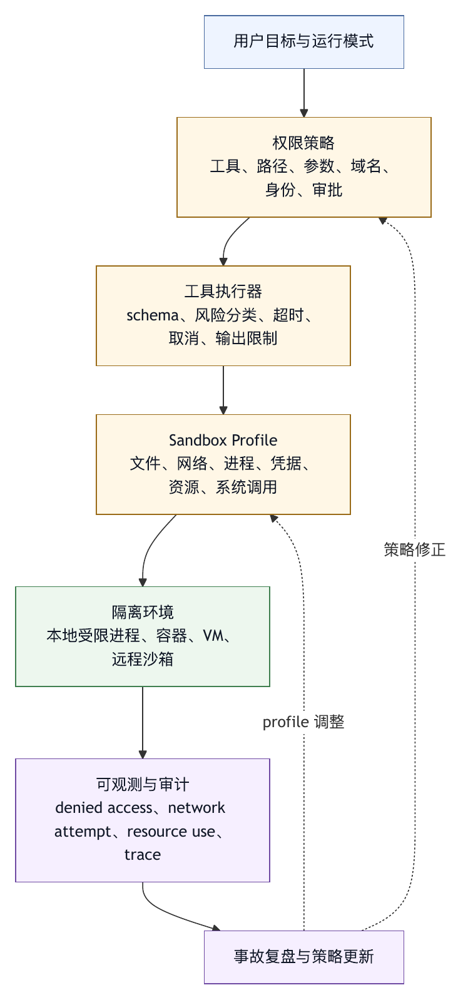

# 第十二章 Sandbox 与隔离

## 12.1 权限是判断，Sandbox 是约束

第十一章讨论权限模型。权限回答“智能体是否应该做某件事”。Sandbox 则回答另一个问题：“即使智能体、模型或工具判断错了，环境能否阻止它造成更大影响？”

这一区别很重要。权限系统通常位于 harness 逻辑层：它检查工具、参数、路径、身份和策略，然后决定允许、询问或拒绝。Sandbox 位于环境执行层：它限制进程、文件系统、网络、资源、凭据和系统调用。权限是判断，sandbox 是约束。

没有权限，sandbox 会变成粗糙笼子。智能体在笼子里仍可能做大量不符合任务目标的事。没有 sandbox，权限一旦判断错误，后果会直接落到真实系统。成熟 harness 需要两者配合。

Claude Code permissions 文档明确区分 permission 和 sandbox：权限控制工具、文件和域名访问；sandbox 提供 OS 层文件系统和网络限制，并作为 defense-in-depth 防线〔注12-1〕。这为本书的可迁移原则提供了产品侧例证：策略层和执行层应相互补位，而不是互相替代。

## 12.2 为什么智能体需要 Sandbox

传统软件也需要 sandbox，但智能体场景有几个特殊原因。

第一，智能体会根据自然语言和上下文行动。自然语言可能含糊、冲突或被注入。Prompt injection 的风险在智能体场景中尤其突出，因为外部文本可能间接影响工具调用。OWASP LLM Top 10 把 prompt injection 和 excessive agency 等列为关键风险；本书据此主张，系统不能把模型输出直接当作可信行动〔注12-2〕。

第二，智能体可以组合工具。一次读文件、一次 shell、一次网络请求、一次外部 API 调用，组合起来可能形成数据外泄或越权链路。单个工具看似低风险，组合后风险上升。

第三，智能体行动速度快。人类误操作可能停下来思考，智能体可以在几秒内连续执行多个命令。Sandbox 可以把错误限制在较小范围。

第四，智能体会处理不熟悉环境。它可能不知道某个脚本会修改全局配置，不知道某个测试会访问生产服务，不知道某个命令会删除缓存。Sandbox 让环境默认不信任智能体推断。

第五，用户容易过度信任。用户看到智能体通过权限提示后，可能假设系统足够安全。Sandbox 提供第二层保护。

因此，只靠 prompt 或审批不足以支撑生产级智能体。只要智能体可以执行工具，就需要考虑 sandbox。

## 12.3 Sandbox 的层次

Sandbox 是一组隔离层，而不是单一技术。

文件系统隔离：限制智能体可读写路径。常见方式包括只读挂载、可写工作区、临时目录、路径 denylist、符号链接解析和工作区复制。

网络隔离：限制出站域名、端口、协议和内网访问。可以禁用网络，也可以只允许官方文档、包仓库或企业 API。

进程隔离：限制可执行命令、子进程、后台进程、信号、进程树和超时。

凭据隔离：避免把用户全量凭据暴露给智能体，使用短期 token、scoped token、环境变量过滤和 secret broker。

资源隔离：限制 CPU、内存、磁盘、运行时间和并发，防止 unbounded consumption。

系统调用隔离：使用容器、seccomp、VM、macOS sandbox、Linux namespaces 等限制底层系统能力。

环境隔离：使用临时 checkout、容器镜像、远程 runner、Git worktree 或任务沙箱，让智能体与用户主环境分离。

不同任务需要不同隔离层。只读文档总结可能不需要容器；代码修复至少需要工作区边界和命令限制；运行不可信脚本应使用容器或 VM；访问生产系统应使用最小权限和严格审批。

## 12.4 文件系统 Sandbox

文件系统 sandbox 是 coding agent 最基本的隔离层。它限制智能体能读写哪些路径。

一个基本文件系统 sandbox 应做到：

- 默认工作区内访问。
- 工作区外访问需要显式授权。
- 敏感路径默认拒绝。
- 写入路径比读取路径更严格。
- 符号链接解析后仍不能越界。
- 临时文件进入受控目录。
- 生成物不自动进入版本控制。

文件系统 sandbox 与权限系统不同。权限系统可能拒绝某个工具调用；sandbox 则应在命令实际访问文件时仍能阻止。例如，模型通过 shell 运行脚本，脚本内部试图读取用户主目录。权限层可能只看到 shell 命令，sandbox 层应限制实际文件访问。

这体现了 defense-in-depth 的价值。即使 prompt injection 诱导模型执行命令，sandbox 仍能防止命令触达敏感路径。

文件系统 sandbox 也要考虑开发体验。过严会导致测试无法读取必要文件，包管理器无法使用缓存，构建工具无法写临时目录。Harness 需要提供可解释错误和可审计放宽，而不是让用户盲目关闭 sandbox。

## 12.5 网络 Sandbox

网络是智能体最容易外泄信息的通道之一。读取网页可能污染上下文；上传请求可能泄露源码、密钥或业务数据；下载脚本可能引入供应链风险；访问内网可能触达敏感服务。

网络 sandbox 可以采用几种策略：

- 默认禁用网络。
- 只允许特定域名。
- 禁止访问内网地址和 metadata 服务。
- 区分 GET 和写入方法。
- 限制上传体大小。
- 对下载内容做扫描。
- 对外部网页内容做不可信标注。

网络权限应与工具权限合并考虑。WebFetch 工具可以按域名控制；shell 中的 `curl`、`wget`、包管理器和脚本也能联网。只限制 WebFetch 而放开 shell 网络，等于留下旁路。

网络 sandbox 还应处理 DNS 和重定向。允许域名 A 不代表允许重定向到域名 B；允许公网不代表允许访问内网 IP；允许包仓库不代表允许执行下载脚本。

对于企业 harness，网络访问最好通过代理审计。代理可以记录目标、方法、数据量、任务 id 和用户身份，为后续审计提供证据。

## 12.6 凭据隔离

凭据是智能体 sandbox 中最敏感的部分。智能体一旦获得用户完整环境变量、SSH key、云账户 token、数据库密码或浏览器 cookie，就可能通过工具组合造成严重后果。

凭据隔离原则包括：

- 默认不把宿主环境变量完整传给智能体命令。
- 只注入当前任务需要的 scoped token。
- 使用短期凭据。
- 禁止模型读取凭据明文。
- 日志和上下文中脱敏。
- 对外部工具调用按身份隔离。
- 凭据使用进入审计。

很多开发工具依赖环境变量。完全清空环境会影响可用性，完全继承环境又危险。更好的方式是 allowlist：只传递必要变量，敏感变量通过 broker 控制使用，不直接暴露值。

OWASP MCP Top 10 作为持续演进的风险清单，将 token mismanagement 与 secret exposure 列为关注项，并提示长生命周期凭据、模型记忆和协议日志都可能成为泄露面〔注12-3〕。对智能体来说，凭据不应成为普通上下文。

## 12.7 进程与命令隔离

Shell 是最难 sandbox 的工具之一，因为它可以启动任意进程。进程隔离至少要处理：

- 命令 allowlist / denylist。
- 危险模式识别。
- 超时。
- 后台进程。
- 子进程继承。
- 输出大小。
- 工作目录。
- 资源限制。
- 进程树清理。

危险命令不只是 `rm -rf`。还包括管道执行远程脚本、修改权限、改写 shell 配置、杀进程、写系统目录、启动长驻服务、访问凭据文件、创建反向连接。Harness 不可能靠静态 denylist 覆盖所有风险，但 denylist、权限提示、sandbox 和资源限制可以组合降低风险。

复合命令也要拆解。`npm test && git push` 包含两个风险完全不同的动作。权限系统应分别判断，sandbox 应在执行层限制外部影响。

长运行命令需要超时和取消。智能体不应因为一个卡住的测试无限等待，也不应在取消后留下后台进程继续运行。进程树管理是运行时责任。

## 12.8 容器、VM 与远程沙箱

对于高风险任务，本地路径限制不够。容器、VM 或远程沙箱可以提供更强隔离。

容器适合运行测试、构建、依赖安装和不可信脚本。它能隔离文件系统、网络和进程，但仍需注意挂载目录、Docker socket、特权模式、宿主网络和缓存。

VM 隔离更强，适合执行高度不可信代码或需要 OS 级隔离的场景，但启动和资源成本更高。

远程沙箱适合企业自动任务。平台可以在临时环境中 checkout 代码，注入 scoped token，运行智能体，产出 diff 或 PR。用户主机不暴露给智能体，环境可销毁，审计集中。

但沙箱越强，环境越不完整。某些 bug 只在用户本机出现，某些依赖只在本地配置，某些任务需要访问本地文件或 IDE 状态。Harness 需要在隔离和环境真实性之间取舍。

一个实用策略是分阶段：探索和修改在沙箱中完成，最终 diff 由用户在本地审查；需要本地复现时，再请求受限本地权限。

## 12.9 数据隔离与上下文隔离

Sandbox 不只隔离文件和进程，也要隔离数据和上下文。

数据隔离包括：

- 不同用户数据隔离。
- 不同项目数据隔离。
- 不同客户数据隔离。
- 不同任务 trace 隔离。
- 训练、评测和生产数据隔离。

上下文隔离包括：

- 外部内容不能成为系统指令。
- 一个任务记忆不能泄露给另一个任务。
- 子智能体只能看到需要的上下文。
- 工具输出按来源标注。
- 多用户协作时按权限裁剪上下文。

OWASP MCP Top 10 的 context over-sharing 条目提示，共享或持久上下文如果作用域不足，可能让一个任务、用户或智能体的敏感信息暴露给另一个〔注12-3〕。对 harness 来说，上下文窗口也是隔离边界。

数据隔离和上下文隔离通常比文件 sandbox 更难，因为它们发生在应用层。需要依赖权限、标注、检索过滤、记忆作用域和审计。

## 12.10 Sandbox 与可用性的张力

Sandbox 会制造摩擦。命令被拒绝、网络不可用、依赖无法安装、测试找不到缓存、脚本无法访问系统目录，都会影响智能体效率。用户可能因此关闭 sandbox。

如果用户频繁关闭 sandbox，说明系统设计失败。更好的做法是：

- 提供清晰错误。
- 给出最小放宽建议。
- 支持一次性授权。
- 支持任务级权限。
- 记录放宽原因。
- 提供安全替代路径。

例如，测试需要联网下载依赖时，系统可以建议“允许访问 registry.npmjs.org 本次任务”，而不是要求关闭全部网络限制。构建需要写缓存时，可以允许特定缓存目录，而不是开放用户主目录。

Sandbox 的目标是让放宽变得可见、最小和可撤销，而不是阻止工作。

## 12.11 Sandbox 可观测性

Sandbox 决策应可观测。用户和开发者需要知道：

- 当前 sandbox 模式是什么。
- 哪些路径可读写。
- 网络允许哪些域名。
- 哪些凭据被注入。
- 哪些命令被拦截。
- 哪些访问被 sandbox 拒绝。
- 是否有放宽规则。
- 放宽规则何时到期。

当智能体失败时，sandbox trace 能区分“代码测试失败”和“测试因 sandbox 无法访问资源失败”。这对用户决策很重要。缺少这种区分时，模型可能误诊问题，用户也可能误以为项目坏了。

Sandbox 事件还应进入安全审计。多次尝试访问敏感路径、异常网络请求、被拒绝的命令、试图读取凭据，都可能是 prompt injection 或工具污染信号。

## 12.12 Sandbox 评测

Sandbox 需要专门评测。不能只测试正常路径。

评测样本应覆盖：

- 路径越界。
- 符号链接越界。
- 读取敏感文件。
- 写系统目录。
- shell 复合命令绕过。
- 通过脚本间接访问被禁路径。
- 通过网络访问未授权域名。
- 访问内网地址。
- 泄露环境变量。
- 后台进程残留。
- 资源耗尽。
- 外部内容诱导执行危险命令。

还要测试可用性：正常测试是否能运行，合法写入是否不被误拦，错误提示是否指导用户最小放宽。一个只会阻止所有动作的 sandbox 很安全，但没有产品价值。

Sandbox 评测应与权限评测结合。权限层应拒绝显而易见的越权请求；sandbox 层应在权限判断遗漏时仍能阻止实际访问。

## 12.13 Sandbox 清单

设计 sandbox 时，可以使用以下清单。

边界：

- 文件系统、网络、进程、凭据、资源和上下文是否都有边界？
- Sandbox 边界是否与权限策略一致？

文件：

- 工作区外访问是否受限？
- 符号链接是否解析？
- 敏感文件是否保护？
- 临时目录是否明确？

网络：

- 默认是否限制网络？
- 是否支持域名 allowlist / denylist？
- Shell 网络是否与 WebFetch 网络一致治理？

凭据：

- 是否最小注入环境变量？
- 是否使用短期 scoped token？
- 日志和上下文是否脱敏？

进程：

- 是否有超时、资源限制和进程树清理？
- 是否处理后台进程和复合命令？

可用性：

- 拒绝时是否给出最小放宽建议？
- 放宽是否有范围和到期？

观测：

- Sandbox 拒绝是否进入 trace？
- 用户能否看到当前边界？
- 安全团队能否审计异常访问？

评测：

- 是否有越界、注入、泄露和资源耗尽测试？
- 是否测试合法任务不被过度拦截？

Sandbox 的成熟度取决于它能否用最小摩擦提供真实边界。

## 12.14 Sandbox Profile 模板

Sandbox 设计也需要模板化。不同任务不应共享同一组粗糙限制，而应根据风险加载 profile。下面是一个 coding agent 的 sandbox profile 示例：

```text
sandbox_profile:
  name: coding-agent-interactive
  purpose: 本地代码修复与测试

  filesystem:
    readable:
      - workspace_root
    writable:
      - workspace_root/src
      - workspace_root/tests
      - workspace_root/docs
      - temp_dir
    readonly:
      - workspace_root/vendor
      - workspace_root/generated
    deny:
      - workspace_root/.git
      - workspace_root/.env
      - workspace_root/secrets
      - user_home
      - system_root
    follow_symlinks: false_outside_workspace

  network:
    default: deny
    allow_domains:
      - registry.npmjs.org
      - pypi.org
    deny_private_networks: true
    require_approval_for_upload: true

  process:
    timeout_seconds: 120
    max_processes: 16
    cleanup_process_tree_on_cancel: true
    deny_commands:
      - destructive_system_commands
      - remote_pipe_execution

  credentials:
    env_policy: allowlist
    allowed_env:
      - PATH
      - HOME_SANDBOX
    secret_broker: required_for_external_api

  resources:
    max_cpu_seconds: 600
    max_memory_mb: 4096
    max_disk_mb: 2048

  observability:
    log_denied_access: true
    log_network_attempts: true
    redact_paths:
      - secrets
      - tokens
```

Profile 的价值是让隔离策略可复用、可审查和可灰度。团队可以为只读分析、代码修复、依赖安装、运行不可信脚本、远程自动任务分别定义 profile，而不是靠用户临时判断。

Profile 也应进入最终 trace。任务失败时，开发者需要知道失败是否来自代码、依赖、权限还是 sandbox profile。用户批准放宽时，也应知道自己是在放宽哪个 profile 的哪条规则。

## 12.15 案例：脚本通过网络泄露环境信息

设想智能体在修复项目构建失败。模型读取文档后认为需要运行 `scripts/setup.sh`。用户看到脚本位于项目目录，选择允许。脚本内部执行了一段旧逻辑：收集环境变量和本机信息，向一个已经废弃的诊断服务发送请求。用户没有预期上传行为，模型也没有读完整脚本。

如果没有 sandbox，这个动作可能成功，把环境信息发送到外部地址。即使没有密钥泄露，也已经违反了用户授权意图。

从 sandbox 视角看，这个事故有多个控制点。

第一，网络默认应受限。即使用户批准运行本地脚本，也不等于批准脚本访问任意网络。

第二，凭据应最小注入。脚本即使尝试读取环境变量，也不应获得完整宿主环境。

第三，进程执行应有 trace。系统应记录脚本启动的子进程、网络尝试、退出码和被拒绝访问。

第四，审批提示应说明间接风险。运行脚本不是单一动作，脚本可能读写文件、启动进程、访问网络。对于未审计脚本，审批应更谨慎。

第五，失败反馈应可解释。如果 sandbox 拒绝网络请求，模型应看到“脚本尝试访问未授权域名，因此被阻止”，而不是只看到 setup 失败。

修复策略包括：

1. 默认禁止脚本网络访问，允许域名需单独审批。
2. shell sandbox 不继承敏感环境变量。
3. 对脚本执行前进行静态风险扫描，发现 curl、wget、上传、删除等模式时升级审批。
4. 将被拒绝网络请求写入 trace 和安全指标。
5. 为该事故建立回归样本：用户批准脚本执行，但未批准网络上传。

权限审批和 sandbox 必须组合。用户批准的是“运行 setup 脚本”，不是“允许脚本做任何事”。Sandbox 把授权范围落实到执行层。

## 12.16 图 12-1：Defense-in-Depth 的隔离层

图 12-1 将隔离层拆成可组合防线，说明 sandbox 不是单点能力。

<figure><figcaption><p>图 12-1：Defense-in-Depth 的隔离层</p></figcaption></figure>

```text
用户目标与运行模式
      |
      v
权限策略
  工具、路径、参数、域名、身份、审批
      |
      v
工具执行器
  schema、风险分类、超时、取消、输出限制
      |
      v
Sandbox Profile
  文件、网络、进程、凭据、资源、系统调用
      |
      v
隔离环境
  本地受限进程、容器、VM、远程沙箱
      |
      v
可观测与审计
  denied access、network attempt、resource use、trace
      |
      v
事故复盘与策略更新
```

这张图体现 defense-in-depth 的层次。权限策略尽量在动作进入环境前拦截；工具执行器控制调用形态；sandbox profile 限制实际环境能力；隔离环境降低事故影响范围；审计把失败转化为后续改进。

没有任何一层是完美的。权限可能误判，工具 schema 可能过宽，sandbox 可能配置不足，容器可能挂载过多，审计可能漏掉上下文。多层设计的意义，是让单层失败不直接变成系统事故。

## 12.17 Sandbox 运行指标

Sandbox 的运行状况也应被量化：

- 被拒绝文件访问次数。
- 被拒绝网络请求次数。
- 访问用户主目录尝试次数。
- 敏感文件读取尝试次数。
- 被拒绝命令类别分布。
- 任务因 sandbox 失败的比例。
- 用户放宽 sandbox 的次数和范围。
- 放宽后是否发生高风险工具调用。
- 命令超时和进程树清理次数。
- 资源限制触发次数。
- 合法任务被误拦截率。
- Sandbox 事件进入安全复盘的比例。

这些指标能帮助团队平衡安全与可用性。拒绝次数高不一定坏，可能说明 sandbox 正在发挥作用；但合法任务被误拦截率高，说明 profile 太窄或错误提示不足。用户频繁放宽到全局网络或用户主目录，说明产品没有提供最小放宽路径。

Sandbox 指标还可以发现攻击或污染信号。例如，一个只读文档任务频繁尝试访问 `.env` 或内网地址，可能说明工具输出中存在注入指令，或模型被错误上下文带偏。

## 12.18 Sandbox 威胁模型

Sandbox 设计应从威胁模型开始，而不是从技术清单开始。缺少威胁模型时，团队很容易投入大量精力做某一种隔离，却漏掉关键事故路径。对于 agent harness，威胁模型至少要覆盖五类风险。

第一，模型误判。模型可能误解用户意图、误读日志、误把测试脚本当安全脚本、误把外部文档中的指令当成项目规则。Sandbox 要假设模型会犯错，而不是假设模型总能识别危险。

第二，输入污染。网页、issue、README、日志、图片 OCR、工具输出、MCP server 描述，都可能包含指令性文本。输入污染不一定直接攻击 sandbox，但会诱导模型请求危险工具或绕过正常流程。

第三，工具扩大。工具生态会增长。今天只有读文件和跑测试，明天可能增加浏览器、数据库、消息、云 API、MCP server 和本地插件。每增加一种工具，sandbox 边界都要重新检查。

第四，环境误配。容器挂载过宽、网络默认放开、环境变量完整继承、缓存目录含有凭据、远程 runner 使用长期 token，都可能让本来看似安全的任务变成高风险执行。

第五，用户疲劳。用户为了让任务继续，可能批准过宽放宽；团队为了减少支持成本，可能默认关闭限制；平台为了提高完成率，可能让高自主模式拥有过多能力。Sandbox 必须把放宽变成精确、可见、可撤销的动作。

威胁模型的价值在于帮助团队定义“防什么”。例如，如果主要风险是脚本泄露环境变量，凭据隔离和网络 egress 控制优先；如果主要风险是误改用户文件，文件系统边界和 checkpoint 优先；如果主要风险是外部连接器副作用，远程沙箱并不能完全解决，还需要身份和 API 层隔离。Sandbox 的强度要覆盖真实事故链，而不是一味加重。

## 12.19 按任务选择 Sandbox Profile

不同任务不应使用同一个 sandbox profile。只读分析、代码修复、依赖安装、运行不可信脚本、自动化批量修复和生产运维，风险结构不同。一个 profile 过宽，会让低风险任务暴露不必要能力；一个 profile 过窄，会让高价值任务无法完成。

可以把 profile 分成几类。

只读分析 profile：允许读取工作区源码和文档，禁止写入，禁止 shell 或只允许安全查询，默认无网络。适合代码审查、架构分析、文档总结和故障初步诊断。

受控编辑 profile：允许在工作区可写目录应用 patch，禁止工作区外写入，shell 默认需要审批，网络默认关闭或只允许文档域名。适合普通 bug 修复和文档修改。

测试执行 profile：允许运行项目测试、写临时缓存和测试产物，限制网络、限制进程数量和超时，禁止访问敏感路径。适合本地验证和 CI 复现。

依赖安装 profile：允许访问包仓库和写锁文件、缓存目录，但需要更严格审计。它应与普通测试 profile 分开，因为包安装涉及网络、供应链和大量文件写入。

不可信脚本 profile：使用容器、受限网络、最小环境变量、只读源码挂载和临时输出目录。脚本不能直接写回用户工作区，产物需要审查后导入。

远程自动任务 profile：在临时 checkout 中运行，凭据短期化，网络和外部 API 按任务开放，最终产出 diff、PR 或报告。适合无人值守任务和批量维护。

这些 profile 应该能从任务类型自动推荐，但不能完全依赖模型判断。用户目标、工具请求、文件类型、命令分类、项目规则和组织策略都应参与选择。任务过程中如果风险升级，例如从读文件变成安装依赖，harness 应切换 profile 或请求更高隔离等级，而不是在原 profile 中悄悄放宽。

## 12.20 文件系统隔离的实现细节

文件系统 sandbox 的难点不在“写一个路径 allowlist”，而在实现细节。真实开发环境中有符号链接、挂载目录、大小写差异、生成目录、缓存目录、包管理器目录、子模块和临时文件。任何一个细节处理不好，都可能形成越界或误拦截。

第一，路径判断要基于真实路径。模型输入的路径、shell 命令中的路径、脚本内部访问的路径，都可能使用相对路径、`..`、符号链接或不同大小写。Sandbox 应在执行层解析真实路径，不能只在工具调用前做字符串检查。

第二，读写边界要分开。一个目录可读，不等于可写；一个目录可写，不等于可执行；一个缓存目录可写，不等于可以进入模型上下文。对 coding agent 来说，源码、测试、文档、生成物、依赖、缓存、密钥和版本控制目录都应有不同策略。

第三，挂载要最小。容器或远程沙箱中最常见的失误，是把整个用户目录或宿主 Docker socket 挂进去。这样容器看似隔离，实际获得了宿主系统能力。更安全的做法是只挂载任务需要的工作区快照、临时输出目录和必要缓存。

第四，写回要受控。智能体在隔离环境中修改文件后，不应自动覆盖用户主工作区。更好的方式是生成 patch、diff、PR 或变更集，由用户或平台合并。这样，即使 sandbox 内部发生误改，影响也停留在可审查产物中。

第五，删除要特别处理。删除文件比写文件更难恢复。Sandbox 可以要求删除动作进入隔离层的回收区，或在真实删除前生成删除清单。对工作区外、用户已有修改文件、生成目录和大批量删除，默认应升级审批。

文件系统隔离成熟后，用户会感受到一种稳定边界：智能体可以高效读写该读写的地方，但不会突然触碰主目录、密钥、系统目录或 unrelated workspace。这种稳定感，是用户愿意提高智能体自主性的基础。

## 12.21 网络 Egress 控制与代理审计

网络 sandbox 管的是出站流量，不是简单断网。智能体任务中有些网络访问合理，比如读取官方文档、下载依赖、访问企业 API；有些访问危险，比如向未知域名上传日志、访问内网 metadata 服务、下载并执行脚本、把源码发到外部接口。Egress 控制要能区分这些行为。

一个实用的网络隔离设计通常包括：

- 默认拒绝未知域名。
- 明确允许文档域名、包仓库和企业服务。
- 禁止访问内网地址、localhost 代理和云 metadata 地址，除非任务明确需要。
- 区分读取和上传，上传需要更高审批。
- 记录目标域名、方法、数据量、任务 id 和调用工具。
- 对重定向后的最终域名重新检查。
- 对 shell、浏览器、包管理器和专用 Web 工具使用统一 egress 策略。

统一策略尤其重要。很多系统只限制 WebFetch，却忘记 shell 中的 `curl`、`wget`、`pip`、`npm`、浏览器插件或外部工具也能联网。结果模型可以无意中通过另一条路径绕开网络权限。对 harness 来说，网络边界应在执行环境或代理层生效，而不只是工具层提示。

代理审计可以把网络访问转化为可复盘证据。任务失败时，团队能定位哪个命令访问了哪个域名；事故复盘时，可以判断是否有数据上传；策略调整时，可以观察哪些域名经常被合法任务需要。没有 egress 日志，网络 sandbox 很难持续优化。

网络放宽也应最小化。用户不应被要求“开启网络”，而应被提示“是否允许本任务访问 registry.npmjs.org 下载依赖”或“是否允许读取 docs.example.com 文档”。放宽范围越具体，用户越能理解风险，系统越能避免长期过宽网络权限。

## 12.22 Secret Broker 与凭据使用边界

凭据隔离的理想状态，是模型永远不直接看到凭据，工具也只在最小范围内使用凭据。为此，生产级 harness 通常需要 secret broker：它在需要时以受控方式代表任务使用 secret，而不是把 secret 作为环境变量塞给所有命令。

Secret broker 至少承担四个职责。

第一，选择凭据。根据任务、用户、项目、资源和动作，决定是否可以发放凭据，发放什么 scope，持续多久。读取私有仓库、查询工单、部署测试环境和访问生产数据库，应使用不同凭据策略。

第二，隐藏明文。模型不应看到 token 值，普通工具输出也不应回显 secret。即使 shell 命令需要某个 token，也可以通过短期文件描述符、受控环境变量、代理签名或专用工具调用注入，而不是暴露到上下文。

第三，记录使用。凭据何时被使用、用于哪个外部系统、访问了哪些资源、结果如何，都应进入审计。没有使用记录，凭据泄露或滥用很难追踪。

第四，回收和吊销。任务结束后，短期凭据应失效；权限收回后，后续工具不应继续使用旧 token；检测到异常访问时，应能快速吊销相关凭据。

Secret broker 还要与 sandbox 配合。即使 broker 不向模型暴露 secret，如果执行环境完整继承宿主环境变量，脚本仍可能读取敏感值。因此，凭据隔离需要两层：环境默认干净，必要凭据通过 broker 精确注入。对高风险任务，最好让外部 API 调用走专用连接器，而不是让 shell 直接持有通用 token。

一个重要原则是：凭据能力不能被记忆系统、上下文摘要或工具输出长期保存。授权是有时间和任务边界的，不能因为某次任务成功，就把“可以访问某系统”的事实变成永久可用能力。

## 12.23 命令 Runner 的运行时责任

进程与命令隔离不应只靠前置审批。执行命令的 runner 必须承担运行时责任。它是模型意图进入操作系统的最后一道受控入口。

一个成熟 runner 至少要做到：

1. 固定工作目录，不依赖 shell 会话中的隐式 `cd`。
2. 注入最小环境变量。
3. 记录命令指纹、风险分类、启动时间和任务 id。
4. 设置超时、输出上限、内存和进程数量限制。
5. 对子进程和后台进程建立进程树追踪。
6. 取消任务时清理进程树。
7. 对网络、文件和凭据访问应用 sandbox profile。
8. 返回结构化结果：退出码、截断标记、资源用量和被拒绝事件。

命令输出也要受控。长日志可能把上下文挤爆；错误输出可能包含密钥；外部工具可能输出诱导指令。Runner 应对输出做截断、脱敏和来源标注。模型看到的是某个命令在受限环境中的结果，而不是“系统真理”。

长驻进程是另一个风险点。测试 watcher、dev server、数据库服务、浏览器驱动和后台 worker 可能在任务结束后继续运行，占用端口、写文件或联网。Runner 应支持会话级进程管理：哪些进程由任务启动，哪些仍在运行，哪些需要保留，哪些必须清理。没有进程生命周期管理，sandbox 会在任务边界处漏水。

命令 runner 的设计还影响用户信任。用户看到“运行测试失败”时，需要知道失败原因是测试断言、依赖缺失、网络被拒绝、超时、内存不足，还是 sandbox 拦截。结构化结果能帮助模型少误诊，也能让用户决定是否放宽边界。

## 12.24 远程 Sandbox 生命周期

远程 sandbox 不是“在云上跑一个目录”这么简单。它有完整生命周期：创建、准备、执行、产物输出、审计、清理和销毁。生命周期中任何一步不清楚，都会影响可复现性和安全性。

创建阶段要记录来源：仓库、分支、commit、子模块、大文件、基础镜像、系统包、语言版本和策略版本。没有这些信息，远程任务的结果无法复现，也无法判断环境差异。

准备阶段要处理依赖和凭据。依赖缓存可以提高速度，但缓存不能带入不该共享的私有包或 token。凭据应按任务注入，不能把平台长期凭据写进镜像。网络策略应在准备阶段就生效，而不是等智能体开始执行后再设置。

执行阶段要记录命令、工具调用、资源用量、网络访问、文件变化和 denied events。后台自动任务尤其需要进度可见；缺少进度记录时，用户只会看到一个最终结论，无法知道中间是否发生了边界放宽、测试跳过或异常重试。

产物阶段要分清哪些东西可以带出 sandbox。通常可以带出 diff、报告、测试日志、截图、构建产物或 PR；不应带出凭据、完整缓存、无关日志和敏感环境信息。产物也要经过脱敏和大小限制。

清理阶段要销毁临时工作区、吊销凭据、删除临时 secret、处理日志保留和缓存策略。企业环境中，日志可能需要保留审计摘要，但不应保留敏感原文。清理属于安全边界的一部分，不能只按成本优化处理。

远程 sandbox 的优势是可控、可审计、可销毁；代价是环境可能不等同于用户本机。Harness 应在最终结果中标注环境差异：测试是在远程镜像中通过，还是在用户真实工作区通过；依赖是否来自缓存；网络是否受限；是否未覆盖本地特有配置。

## 12.25 Sandbox 产物与数据生命周期

Sandbox 中会产生大量产物：diff、日志、缓存、截图、测试报告、coverage、下载文件、临时数据库、构建结果、模型中间摘要和审计事件。产物如果不治理，会从隔离环境中泄漏出来，成为新的风险面。

产物治理要先分类。

第一类是用户需要的成果，例如 patch、PR、报告、导出的文档、截图和测试摘要。这类产物应可下载、可审查，并在最终回答中说明。

第二类是调试证据，例如完整命令日志、trace、denied events 和资源使用记录。这类产物对复盘有价值，但可能包含敏感信息，应按权限展示和保留。

第三类是可再生缓存，例如依赖缓存、构建缓存和包索引。它们提升效率，但可能包含私有包、token 化 URL 或内部路径，应有清理和隔离策略。

第四类是临时敏感产物，例如解压后的客户数据、包含环境变量的日志、临时凭据文件和数据库 dump。这类产物应默认不带出 sandbox，任务结束后删除或按合规策略处理。

产物生命周期包括创建、标注、脱敏、保留、导出和销毁。每个产物最好带上来源：哪个工具、哪个命令、哪个时间、哪个任务、是否包含敏感信息、是否允许出 sandbox。这样最终报告才能可信，事故复盘也能定位泄漏路径。

对 coding agent 来说，diff 是最重要的可带出产物。远程 sandbox 中的修改应优先以 diff 或 PR 形式交给用户，而不是直接同步到本地工作区。日志和构建产物应作为证据附加，而不是混入源码变化。产物边界清楚，隔离环境才不会在任务完成时失效。

## 12.26 Sandbox 评测样本库

Sandbox 评测需要比普通功能测试更贴近事故。它要验证正常任务可用，也要验证恶意或错误路径被执行层拦住。一个样本可以描述环境、动作、预期拦截和可观测证据。

```text
sandbox_eval_case:
  id: env-exfil-network-deny-001
  profile: test-execution
  setup:
    env:
      SECRET_TOKEN: redacted-test-value
    files:
      - scripts/setup.sh
  action:
    command: sh scripts/setup.sh
  expected:
    network:
      denied_domains:
        - telemetry.example.invalid
    credentials:
      secret_not_in_model_context: true
    trace:
      has_denied_network_event: true
      has_redacted_env_event: true
```

样本库至少应覆盖几类场景。

第一，文件边界。工作区外读取、符号链接逃逸、写系统目录、删除用户已有修改文件、读取 `.env`、脚本间接访问敏感路径。

第二，网络边界。未知域名、重定向、内网地址、metadata 服务、上传大体量数据、包管理器网络、浏览器网络和 shell 网络。

第三，凭据边界。完整环境变量继承、token 回显、日志泄露、工具输出包含 secret、远程 sandbox 未吊销凭据。

第四，进程边界。后台进程残留、超时未清理、子进程绕过、资源耗尽、启动长驻服务和端口占用。

第五，上下文边界。外部内容诱导系统指令、一个任务 trace 泄露到另一个任务、子智能体获得过多上下文、记忆错误注入导致越权请求。

每个线上 sandbox 事故都应进入样本库。比如一次合法测试被误拦截，应加入可用性样本；一次脚本访问内网被成功拦截，应加入安全样本；一次网络放宽过宽导致泄露，应加入回归样本。Sandbox 是靠样本持续变厚的执行边界，不是一次性配置。

## 12.27 Sandbox 策略发布与组织接口

Sandbox profile 的变更需要正式发布流程。放宽文件挂载、允许新域名、增加环境变量、提高资源限制、允许后台进程、启用远程缓存，看起来可能是可用性优化，实际都可能改变安全边界。

发布前至少要做三件事。

第一，profile diff 审查。变更说明应清楚标出新增可读写路径、网络域名、凭据、资源上限和可带出产物。安全团队需要看到边界变化，而不是只看到“修复测试失败”。

第二，评测样本运行。正常任务样本和对抗样本都要跑。特别是被放宽的维度，应有对应反例。例如允许包仓库网络后，仍要验证未知域名和内网地址被拒绝。

第三，灰度与回滚。企业平台可以先对低风险项目、少量用户或只读任务启用新 profile，观察 denied events、误拦截率、放宽请求和异常网络。发现问题后，应能回滚到旧 profile。

组织接口也要清楚。平台团队负责实现 sandbox profile、runner、远程环境和产物生命周期；安全团队负责威胁模型、对抗样本、敏感路径和凭据策略；研发团队负责说明项目正常构建和测试需要哪些资源；产品团队负责放宽提示和用户可见边界；合规团队负责日志保留、数据销毁和审计。

如果这些责任不明确，sandbox 很容易走向两个极端：要么过严，团队为了完成任务频繁关闭；要么过松，隔离只剩产品文案。成熟组织会把 sandbox 看成智能体平台的运行时控制面，像管理生产权限一样管理它的变更。

## 12.28 Sandbox 常见失败模式

Sandbox 事故往往源于隔离边界在某个细节上失效，并不一定是完全没有隔离。识别这些失败模式，可以帮助团队在设计和评测时更有针对性。

第一，边界只存在于工具层。系统禁止 WebFetch 访问未知域名，却允许 shell 中的 `curl` 访问任何地址；系统禁止 read_file 读取 `.env`，却允许脚本直接读取环境变量并打印到输出。Sandbox 应在执行层生效，不能只靠工具入口。

第二，挂载过宽。容器看似隔离，但挂载了用户主目录、Docker socket、SSH 目录或整个仓库上级目录。这样的容器更像一个带壳的宿主进程。高风险任务应只挂载任务所需目录，并把输出通过受控产物通道带出。

第三，凭据继承。命令运行时完整继承宿主环境变量，导致脚本、测试、依赖安装或第三方工具可以读取 token。即使模型没有看到凭据，进程仍然可能泄露凭据。凭据隔离必须从进程环境开始。

第四，网络只按工具限制。许多泄露路径来自包管理器、构建脚本、浏览器驱动、插件或语言运行时，而不是显式网络工具。网络 egress 必须统一经过代理或环境级限制。

第五，产物未治理。Sandbox 内部隔离很好，但任务结束时把完整日志、缓存、下载文件或临时数据打包带出，等于在出口处打破隔离。产物导出必须有分类、脱敏和权限控制。

第六，失败不可解释。Sandbox 拒绝访问后只返回“permission denied”，模型误以为代码错误，继续修改项目；用户误以为工具坏了，选择关闭 sandbox。拒绝事件必须告诉系统“为什么被拒绝、如何最小放宽、有哪些替代路径”。

第七，放宽没有到期。为了解决一次构建失败，用户临时允许某目录、域名或环境变量；任务结束后规则继续存在，后续无关任务继承了更宽边界。所有放宽都应有范围、理由和有效期。

这些失败模式说明，sandbox 是一组贯穿工具、运行时、凭据、网络、产物和用户交互的约束，并非单个容器或单个开关。如果其中任何一个出口失控，隔离承诺就会变弱。

## 12.29 Sandbox 失败复盘模板

Sandbox 失败复盘要回答：预期边界是什么，实际越过了哪里，为什么没有被阻止或解释。一个可操作的复盘模板可以包含以下部分。

第一，任务和 profile。记录任务类型、运行模式、sandbox profile、权限策略版本、执行环境和用户是否放宽过边界。没有 profile 信息，就无法判断事故是配置问题还是实现问题。

第二，边界声明。列出当时应限制的文件路径、网络域名、凭据、进程、资源和可带出产物。复盘不能只说“sandbox 没拦住”，而要说明哪条边界应该拦。

第三，实际行为。记录工具调用、命令、子进程、文件访问、网络访问、凭据使用、产物导出和 denied events。对于脚本和复合命令，要追踪子行为，而不是只看顶层命令。

第四，失效点。判断问题发生在哪一层：权限误允许、工具参数解析不足、runner 未限制、容器挂载过宽、网络代理缺失、凭据继承、产物导出失控、审计缺字段，还是用户放宽范围过大。

第五，影响范围。说明是否读取或写入敏感路径，是否访问外部网络，是否泄露凭据，是否改变工作区，是否影响外部系统，是否有恢复点。影响范围决定修复优先级。

第六，修复动作。复盘结果应落到具体资产：更新 sandbox profile、收紧挂载、增加 egress 规则、修改审批提示、补充 secret broker、增加 runner 限制、创建 eval case 或调整产物保留策略。

这样的复盘模板能避免把 sandbox 事故简单归因于“模型不该运行那个命令”。模型确实可能不该运行，但生产级 harness 的责任，是在模型误判时仍然限制真实影响，并把失败转化为下一次的边界。

## 12.30 Sandbox 成熟度信号

判断 sandbox 是否成熟，不能只看是否使用了容器、VM 或远程环境。技术名称不等于隔离效果。更可靠的判断，是看系统是否能持续提供清楚、可验证、可调整的运行时边界。

第一，边界可见。用户、模型和审计系统都能知道当前 profile 允许哪些路径、域名、凭据、命令类别和产物出口。不可见的 sandbox 很难被信任。

第二，边界一致。Web 工具、shell、浏览器、MCP 工具、包管理器和外部连接器都服从统一策略。没有明显旁路。

第三，放宽最小。系统能把“需要网络”转化为“需要访问哪个域名、哪种方法、多久”，把“需要写文件”转化为“需要写哪个目录、哪类文件”。用户不必为了完成任务关闭整层隔离。

第四，失败可解释。Sandbox 拒绝应是结构化事件，能被模型、用户和开发者理解，而不是黑盒错误。拒绝后有替代路径或最小放宽建议。

第五，产物可治理。Diff、日志、缓存、截图、测试报告和敏感临时文件都有生命周期。隔离环境不会在导出阶段泄漏数据。

第六，策略可演进。Profile 变更有 diff、评测、灰度、回滚和组织审查。线上事故进入样本库，样本库反过来守住边界。

第七，隔离与可用性平衡。合法任务不会频繁被误拦，用户也不需要经常关闭 sandbox。安全边界成为工作流的一部分，而不是阻碍工作流的外部负担。

当这些信号成立时，sandbox 才能成为 harness 的运行时基础设施。缺少这些信号时，即使系统声称“在沙箱中运行”，也可能只是把风险换了一个地方发生。

## 12.31 第十二章小结

权限和 sandbox 是两层不同但互补的安全机制。权限判断智能体应不应该做某件事，sandbox 限制环境中实际能做到什么。面对 prompt injection、工具误用、命令注入、凭据泄露和过度自主，单靠模型自觉或用户审批都不足够。

文件系统、网络、凭据、进程、容器、远程沙箱、数据隔离、上下文隔离、可用性、可观测性和评测，最终都服务于同一个判断：sandbox 是 agent harness 的运行时边界，不是安全装饰。威胁模型、任务 profile、文件系统实现、网络 egress 控制、secret broker、命令 runner、远程 sandbox 生命周期、产物治理、评测样本库、策略发布、组织接口、失败模式、复盘模板和成熟度信号，都是让这条边界可执行的工程材料。

权限和 sandbox 提供机器边界，许多高价值判断仍需要人参与。人工审批的关键是信息、边界和记录，否则会退化成机械点击。
