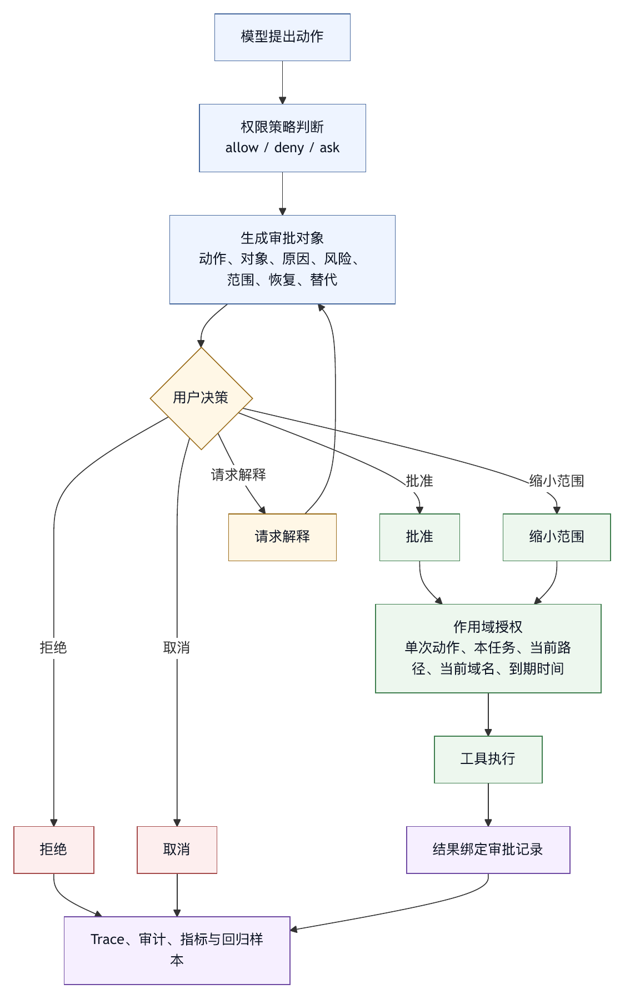

# 第十三章 人工审批与交互设计

## 13.1 人在环路中，不等于人在每一步中

智能体系统中的 human-in-the-loop 常被简单理解为“遇到风险就弹窗问用户”。这只是最粗糙的一种实现。关键问题不在于要不要人参与，而在于人在什么时刻、用什么信息、以什么权限、对什么范围做判断。

如果系统每一步都问，用户会很快形成机械批准。机械批准比不审批更危险，因为它制造了安全感，却没有有效判断。如果系统从不问，高风险动作又会越过用户意图。好的人工审批设计，目标是把人的注意力集中在模型和规则都不应单独决定的地方，而不是增加打断。

审批是 harness 的交互控制面。它连接权限、sandbox、工具、状态、审计和用户信任。一个成熟的审批系统至少要回答：

- 为什么现在需要人判断？
- 用户需要看到哪些事实？
- 批准范围有多大？
- 批准是否有期限？
- 拒绝后智能体应如何继续？
- 审批记录如何进入 trace？
- 是否存在更低风险替代路径？

这也意味着，人在环路中不等于人在每一步中。低风险、可回滚、可审计的动作应自动化；高风险、不可逆、外部副作用、策略冲突、目标不清的动作才需要人判断。

## 13.2 审批不是安全的全部

审批很重要，但不能替代权限和 sandbox。用户点击允许，只能说明用户在某个界面上做过选择，不代表动作一定安全。

审批有几个固有限制。

第一，用户信息不完整。如果提示只显示“是否允许执行命令”，用户无法判断命令工作目录、环境变量、影响范围、是否可回滚。

第二，用户注意力有限。频繁审批会导致疲劳。用户为了让任务继续，会倾向于快速点击。

第三，用户可能误判。某些 shell 命令、外部 API、路径符号链接、复合命令的风险并不直观。

第四，审批可能被上下文污染影响。如果智能体给出过度自信解释，用户可能相信其判断。

第五，审批不能阻止执行层漏洞。用户批准一个看似安全命令后，命令内部脚本仍可能做危险动作。

因此，审批应作为权限系统的一层，而不是唯一安全层。权限策略应先过滤明显禁止动作；sandbox 应限制真实环境影响；审批用于那些需要人类业务判断、风险接受或临时授权的场景。

OpenAI 关于 Codex 安全运行的文章把 sandboxing 与 approval policy 一起讨论，强调审批策略决定何时需要询问，而 sandbox 限制环境边界〔注13-1〕。这为本书区分审批策略和执行隔离提供了实践参照。

## 13.3 什么时候必须询问

不是所有动作都需要审批。审批触发应基于风险和不确定性。

通常应询问的场景包括：

- 写入或删除文件，尤其是敏感路径。
- 执行 shell 命令且可能产生副作用。
- 访问工作区外路径。
- 访问网络或上传数据。
- 调用外部系统写操作。
- 使用或暴露凭据。
- 创建 commit、PR、issue、消息或任务。
- 部署、发布、迁移、支付、删除外部资源。
- 修改安全、CI、权限、依赖或配置文件。
- 任务范围超出原始请求。
- 模型无法确定用户意图。
- 权限规则冲突。

可以自动允许的场景通常包括：

- 工作区内只读搜索。
- 读取普通源码和文档。
- 查看 git status。
- 运行明确只读的诊断。
- 展示 diff。
- 读取项目规则。

中间地带则需要上下文。例如运行测试通常可以允许，但如果测试会联网、写数据库、触发昂贵任务或访问生产服务，就应升级审批。审批策略不能只看工具名，还要看参数、路径、环境和任务阶段。

## 13.4 表 13-1：审批提示最小信息结构

一个审批提示应帮助用户做判断，而不是把责任推给用户。

最小审批信息见表 13-1。

| 信息项 | 用户需要知道什么 |
|---|---|
| 动作 | 智能体想做什么。 |
| 对象 | 作用于哪个文件、命令、域名、外部系统或资源。 |
| 原因 | 为什么需要这一步。 |
| 风险 | 可能的副作用。 |
| 范围 | 批准一次、当前任务、某类动作，还是永久规则。 |
| 恢复 | 是否可回滚。 |
| 替代 | 是否有低风险替代方案。 |

对于文件修改，提示应尽量展示 diff 或预览。对于 shell，展示命令、工作目录、超时、环境和风险分类。对于网络，展示域名、方法、是否上传数据。对于外部系统写入，展示目标账户、对象、内容和是否可撤销。

审批提示还要避免过度技术化。用户不一定理解每个参数，但需要理解“会发生什么”。好的提示应把底层细节翻译成风险判断。

例如：

```text
请求：运行测试命令
命令：pnpm test -- tests/auth.test.ts
目录：/workspace/project
风险：本地只读测试，可能生成 coverage 缓存
恢复：若生成文件，会在最终 diff 中展示
批准范围：仅本次命令
```

这种提示比“Allow Bash?” 更接近可判断审批。

## 13.5 批准范围与有效期

用户批准必须有范围。没有范围的批准会变成隐性长期授权。

常见范围包括：

- 单次工具调用。
- 当前任务内同类低风险动作。
- 当前路径下的读写。
- 当前域名的只读访问。
- 当前会话。
- 当前项目。
- 永久规则。

范围越大，风险越高。默认应采用最小范围。用户选择“以后不再询问”时，系统应把规则具体化，例如“允许在当前项目运行 `pnpm test *`”，而不是“允许所有 shell 命令”。

批准还应有有效期。一次任务中的授权不应自动跨任务延续；临时凭据不应长期有效；高风险批准不应被记忆系统永久保存。授权到期后，系统应重新询问或退回保守模式。

审批记录也应进入状态和 trace。模型不能凭自然语言声称用户批准过；harness 必须保存批准事件、范围、时间、用户和工具参数。

## 13.6 拒绝后的恢复路径

用户拒绝不是失败终点。一个好的智能体应能根据拒绝调整策略。

拒绝后可能的路径包括：

- 使用只读替代方案。
- 生成手动操作说明。
- 缩小动作范围后重新请求。
- 解释无法继续的原因。
- 更新计划。
- 停止任务并总结已完成工作。

比如，用户拒绝执行全量测试，智能体可以运行更窄的静态检查或说明未验证风险。用户拒绝联网，智能体可以只基于本地资料分析。用户拒绝修改文件，智能体可以输出 patch 建议。

审批系统应把拒绝原因反馈给模型。不是所有拒绝都一样。“太危险”“范围太大”“现在不想执行”“请先解释”对应不同恢复策略。

在 Microsoft Agent Framework 的工具审批流程中，需要在 agent run 中以循环方式处理 approval request，直到相关工具调用被批准或拒绝〔注13-2〕。这支持本书的工程判断：审批是行动循环的状态事件，而不是外部插曲。

## 13.7 审批疲劳

审批疲劳是智能体产品常见失败。系统为了安全频繁询问，用户为了效率机械批准，最终安全和效率都没有得到。

审批疲劳的来源包括：

- 低风险动作频繁询问。
- 提示信息重复。
- 用户看不懂风险。
- 批准后没有记忆精确规则。
- 模型不断请求类似动作。
- 拒绝后模型反复尝试。

缓解审批疲劳的方法：

- 把低风险只读动作自动允许。
- 合并同类请求，但保留范围。
- 提供精确“本任务内允许”选项。
- 对高风险动作增加解释，对低风险动作减少打断。
- 使用风险分类和策略预批准常见安全命令。
- 对被拒绝动作设置短期冷却，避免反复询问。

审批系统的目标是高信噪比。用户每次被打断，都应感觉这一步确实值得判断。

## 13.8 审批与 UI

审批不是后台策略，它有强 UI 属性。界面决定用户是否理解、是否信任、是否能及时干预。

终端式 coding agent 可以用内联提示、diff 预览、命令风险标签、快捷键和 timeline 展示审批。IDE 插件可以在编辑器中展示变更范围。Web 平台可以提供任务面板、权限请求队列和审计记录。

无论界面形态如何，审批 UI 应满足：

- 不遮蔽关键信息。
- 不使用模糊按钮文案。
- 显示上下文和影响范围。
- 允许查看详情。
- 允许拒绝并说明原因。
- 允许选择范围。
- 审批后能回看记录。

产品形态影响安全。一个好权限模型，如果 UI 只显示“OK / Cancel”，用户仍然无法判断。好的 UI 应把用户注意力放在关键风险上。

## 13.9 审批与自动策略

人工审批和自动策略可以配合。不是所有判断都必须由人做，也不是所有判断都能由规则做。

自动策略适合：

- 明确禁止动作。
- 明确低风险动作。
- 参数模式可识别的风险。
- 组织政策。
- 频繁重复的安全命令。

人工审批适合：

- 业务风险判断。
- 临时授权。
- 目标冲突。
- 外部副作用。
- 不可逆动作。
- 模型不确定。

以 Claude Code hooks 文档为例，PreToolUse 和 PostToolUse 等事件可以在工具前后插入脚本，并用结构化输出影响权限判断或给模型反馈〔注13-3〕。这类产品机制可以承载自动策略，例如阻止编辑敏感文件、运行格式化、执行静态检查。但 hook 也不应成为不可见魔法；它需要日志、错误反馈和用户理解。

审批系统成熟后，常见低风险请求会被策略吸收，人类只处理需要业务判断、风险接受或临时授权的少数请求。

## 13.10 审批记录与审计

审批没有记录，就不具备组织治理价值。审计记录至少应包含：

- 请求时间。
- 用户或审批主体。
- 工具和参数。
- 风险分类。
- 展示给用户的摘要。
- 用户选择。
- 批准范围。
- 有效期。
- 任务 id。
- 后续执行结果。

这些记录可用于事故复盘、合规审查、权限优化和用户训练。若某类请求经常被批准且安全，可以考虑自动化；若某类请求经常被拒绝，说明模型或默认策略有问题。

审批记录还应和最终产物关联。比如某个 PR 中包含智能体修改，审稿者应能看到哪些高风险动作被批准过，哪些验证未执行。

## 13.11 审批评测

审批系统需要评测。测试不只是“按钮能点”。

评测场景包括：

- 低风险动作不打断。
- 高风险动作请求审批。
- 审批提示包含足够信息。
- 用户拒绝后模型合理恢复。
- 批准范围不被扩大。
- 审批过期后重新询问。
- 复合命令拆分审批。
- 外部工具写操作请求审批。
- 审批记录完整。
- UI 能展示 diff、命令和风险。

还要做对抗测试。外部内容诱导模型说“用户已经批准”；模型在总结中伪造批准；工具输出要求跳过审批。Harness 必须只信任真实审批事件，而不是文本声明。

## 13.12 审批清单

设计审批系统时，可以使用以下清单。

触发：

- 哪些动作自动允许、询问、拒绝？
- 是否按工具、参数、路径、外部系统和任务阶段判断？

提示：

- 用户能否看懂动作、对象、原因、风险、范围和恢复？
- 是否有详情和 diff？

范围：

- 批准是单次、任务内、项目内还是永久？
- 是否有有效期？
- “不再询问”是否生成精确规则？

拒绝：

- 模型是否收到拒绝原因？
- 是否有低风险替代路径？
- 是否避免反复请求同一动作？

审计：

- 是否记录审批主体、工具、参数、范围和结果？
- 是否能关联最终产物？

评测：

- 是否覆盖审批疲劳、伪造批准、范围扩大和拒绝恢复？

审批系统的成熟度，不在于弹窗数量，而在于每次让人参与时，是否真的增加了系统判断质量。

## 13.13 审批请求对象

审批如果要进入工程系统，就不能只是 UI 弹窗。Harness 应把每次审批建模为结构化对象。审批对象既服务界面，也服务权限决策、trace、事故复盘和评测。

一个审批请求对象可以写成：

```text
approval_request:
  id: appr-2026-05-27-001
  run_id: run-abc
  step_id: 7

  requester:
    agent: coding-agent
    model: model-id
    user_visible_reason: 需要运行相关测试以验证修改

  action:
    tool: run_shell
    category: test
    command: pnpm test -- tests/settings.test.ts
    cwd: /workspace/project
    expected_side_effects:
      - 可能生成 coverage 缓存

  risk:
    level: low
    reversible: true
    network: false
    writes_files: maybe_cache_only
    touches_sensitive_paths: false

  scope_options:
    - single_action
    - same_test_command_this_task

  alternatives:
    - 只生成测试建议，不执行命令
    - 运行更窄的单个测试文件

  policy:
    triggering_rule: shell_requires_approval
    expires: after_action

  audit:
    displayed_summary_hash: ...
    params_hash: ...
```

这个结构强调，审批不只是用户动作，也是一段授权语义。`action` 描述将要发生什么，`risk` 帮助用户判断，`scope_options` 限制授权范围，`alternatives` 让用户可以拒绝但不中断任务，`policy` 说明为什么会问，`audit` 让后续复盘可以证明用户看到过什么。

对高风险审批，字段还应更丰富。例如外部系统写入应包含目标账户、对象 id、请求体摘要和可撤销性；文件删除应包含路径、文件数量、是否在 checkpoint 中；网络上传应包含域名、方法、数据类型和数据量。

审批对象也能降低 UI 与策略之间的不一致。不同界面可以用同一对象渲染终端提示、Web 面板或 IDE 弹窗；权限系统和审计系统也可以读取同一结构。这样，审批不再是某个前端组件的临时实现，而成为 harness 的运行时事件。

## 13.14 审批状态机

审批应被纳入行动循环状态，而不是作为外部打断。一个基本审批状态机如下：

```text
ApprovalRequested
  Harness 生成审批对象，并暂停相关工具执行。

Displayed
  UI 展示动作、风险、范围、恢复和替代方案。

UserDecision
  用户选择 approve、deny、modify_scope、ask_for_explanation 或 cancel_task。

Approved
  Harness 记录批准范围和有效期，继续执行工具。

Denied
  Harness 把拒绝原因返回模型，要求选择替代路径或停止。

Expired
  审批超时或上下文变化，原请求失效，需要重新生成。

Executed
  工具执行完成，记录结果并绑定审批记录。

Closed
  审批进入 trace，可用于审计和评测。
```

这个状态机解决几个常见问题。

第一，审批请求可以过期。如果用户离开一段时间，工作区、计划或上下文可能已经变化。旧审批不能无限期有效。

第二，用户可以修改范围。用户不一定只选择批准或拒绝。比如他可以允许读取某个域名但禁止上传，允许运行单个测试但拒绝全量测试。

第三，审批结果必须和后续执行绑定。用户批准某个命令后，如果模型或工具参数变化，应重新审批。批准授权的是具体动作，而不是对模型意图的抽象信任。

第四，拒绝也是信息。模型应知道拒绝原因，并根据原因恢复。例如“范围太大”可以缩小请求，“不允许联网”可以改用本地资料，“现在不要改文件”可以转为 patch 建议。

Microsoft Agent Framework 的工具审批机制提供了在 agent run 中处理 approval request 的实现样例，这与本节状态机的思想一致〔注13-2〕。对 harness 来说，审批是行动循环的一等状态，而不是 UI 边角功能。

## 13.15 案例：格式化命令为什么需要范围提示

用户要求智能体“修复这个文件里的类型错误”。智能体修改了一个 TypeScript 文件后，准备运行 `pnpm format`。审批提示只显示“允许运行格式化命令？” 用户认为这是合理的辅助步骤，于是批准。命令执行后，格式化工具改了全仓库 80 个文件，最终 diff 淹没了原本的修复。

这不是传统安全事故，却是典型信任事故。用户批准的是“帮助当前修复的格式化”，不是“允许重写全仓库格式”。问题出在审批提示没有表达范围。

修复方式包括：

1. 审批对象中必须显示命令作用范围：当前文件、当前包、全仓库。
2. 对可能修改大量文件的命令自动升级风险。
3. 运行前提供 dry run 或预测影响文件数。
4. 格式化命令默认限定到智能体修改文件，除非用户明确批准全仓库。
5. 执行后若 diff 超出批准范围，进入恢复流程。
6. 最终总结必须区分功能修复和格式化改动。

审批设计不能只告诉用户“工具是什么”，还要告诉用户“范围是什么”。范围不清，审批就会从授权变成误导。

## 13.16 图 13-1：审批作为作用域授权

图 13-1 把审批从一次按钮选择改写为带作用域、有效期和证据绑定的授权过程。

<figure><figcaption><p>图 13-1：审批作为作用域授权</p></figcaption></figure>

```text
模型提出动作
      |
      v
权限策略判断
  allow / deny / ask
      |
      v
生成审批对象
  动作、对象、原因、风险、范围、恢复、替代
      |
      v
用户决策
  批准、拒绝、缩小范围、请求解释、取消
      |
      v
作用域授权
  单次动作 / 本任务 / 当前路径 / 当前域名 / 到期时间
      |
      v
工具执行
      |
      v
结果绑定审批记录
      |
      v
Trace、审计、指标与回归样本
```

这张图强调，审批产物是一个有作用域的授权，而不是一个布尔值。没有作用域，批准会被模型或工具放大；没有绑定结果，审批无法进入事故复盘；没有指标，团队无法知道审批是在保护系统，还是在制造疲劳。

## 13.17 审批运行指标

审批系统应持续观测。常见指标包括：

- 每个任务平均审批次数。
- 低风险审批占比。
- 高风险审批占比。
- 审批批准率和拒绝率。
- 用户选择缩小范围的比例。
- 审批超时率。
- 同类审批重复出现次数。
- 拒绝后智能体成功恢复比例。
- 批准后发生回滚或事故的比例。
- “不再询问”规则数量和平均范围。
- 审批提示展开详情的比例。
- 用户因审批中断任务的比例。

这些指标能帮助团队改善交互。低风险审批占比过高，说明策略不够自动化；拒绝后恢复比例低，说明模型没有学会替代路径；批准后回滚比例高，说明审批提示没有充分表达风险；“不再询问”规则过宽，说明用户正在用宽授权对抗疲劳。

审批指标不应被简单优化为“越少越好”。目标是让每一次审批都值得用户注意，并且让用户的选择影响系统行为。

## 13.18 审批类型：不只是批准或拒绝

很多审批系统只有两个按钮：允许和拒绝。这种设计过于贫乏。真实工作中的人类判断有多种类型，harness 应把这些差异表达出来。

第一类是信息确认。用户是在确认事实，不是在接受风险。比如智能体发现两个可能的项目入口，需要用户确认“这是你要修复的服务吗”。这类确认应轻量，不应被记录成权限授权。

第二类是风险接受。用户知道动作有风险，但认为当前任务值得执行。例如允许运行会修改锁文件的依赖安装命令。风险接受需要明确范围、可恢复性和后续审计。

第三类是范围授权。用户允许智能体在某个目录、某个域名、某类命令或某个外部对象上行动。范围授权比单次批准更高效，但必须有边界和到期。

第四类是策略例外。动作通常被策略拒绝，但在特殊情况下可以由更高权限主体批准。例如访问受保护路径、运行生产数据迁移、调用企业外部写入 API。策略例外需要更严格记录，不能和普通审批混在一起。

第五类是业务判断。模型和策略都不知道业务语义，只能请人判断。例如“是否通知客户”“是否关闭工单”“是否把这段内容作为正式公告发布”。这种审批关注内容正确性和组织后果，而不仅是技术风险。

第六类是继续授权。长任务执行到一半，智能体发现原计划不足，需要用户决定是否扩大目标。此时审批指向任务范围的重新确认，并非某个工具调用。

把这些审批类型分清楚，有两个好处。第一，界面可以展示不同信息。信息确认不需要复杂风险表；策略例外必须展示规则来源；业务判断要展示内容预览和影响对象。第二，审计可以更准确。批准一次低风险命令，和批准一次策略例外，不应在日志中看起来一样。

## 13.19 审批信息分层：摘要、证据与细节

审批提示既不能太少，也不能太多。信息太少，用户无法判断；信息太多，用户会跳过。一个成熟审批界面应使用信息分层，而不是把所有技术细节堆在一个弹窗里。

第一层是摘要。摘要用一两句话说明智能体想做什么、为什么现在需要、会影响什么。摘要应面向用户判断，而不是面向工具实现。比如“运行当前模块的测试，验证刚才的修改”，比“调用 run_shell 工具”更有用。

第二层是关键风险。关键风险包括是否写文件、是否访问网络、是否使用凭据、是否影响外部系统、是否不可逆、是否超出原始任务范围、是否缺少恢复点。用户应在不展开详情的情况下看见这些风险标签。

第三层是作用范围。范围包括路径、命令、域名、外部对象、文件数量、预计写入位置、批准有效期和是否允许重复执行。同一个命令，如果范围从一个文件扩展到全仓库，审批意义完全不同。

第四层是证据和细节。用户需要时，可以查看 diff、命令完整文本、工作目录、环境摘要、策略命中规则、checkpoint、sandbox profile、相关 trace 和低风险替代方案。

第五层是后续结果。审批完成后，界面应能回看执行结果：是否执行成功、实际修改了哪些文件、是否产生未预期副作用、是否触发回滚或恢复建议。审批是一条可追踪的运行事件，不只是一次点击。

信息分层还能帮助不同用户。普通用户看摘要和风险标签即可；工程师可以展开命令和 diff；安全人员可以查看策略规则和审计字段；管理员可以查看组织策略和例外记录。一个审批对象应支持多种呈现，而不是为所有人提供同一层复杂度。

## 13.20 审批疲劳治理

审批疲劳属于安全问题，不只是交互问题。一旦用户开始机械批准，审批层就失去了判断价值。治理审批疲劳，要从策略、模型行为和产品设计三方面入手。

策略层要减少低价值询问。只读搜索、读取普通源码、查看状态、展示 diff、读取项目文档等低风险动作，应通过策略自动允许。系统不应为了显示“安全”而把用户拖进每一个细节。

模型层要减少重复请求。用户已经拒绝某类动作后，模型不应换一个说法再次请求；用户批准了单次测试后，模型不应连续请求几乎相同的测试命令。Harness 可以把近期审批结果反馈给模型，让它理解当前边界。

产品层要提供精确授权。用户频繁点击“不再询问”，往往是因为系统只给两个极端选择：单次批准或永久放开。更好的选项是“本任务内允许重复运行同一个测试命令”“当前文件允许格式化”“当前域名允许只读访问十分钟”。精确授权能减少打扰，也不会把风险扩大到整个工具。

审批疲劳还可以通过批处理缓解。智能体在执行一组相关动作前，可以先展示计划和审批包：将要读哪些文件、改哪些文件、运行哪些验证、哪些动作需要授权。用户一次性批准有边界的计划，而不是被每一步打断。批处理审批必须保留风险升级机制；如果实际动作超出计划，仍要重新询问。

指标上，团队应关注每任务审批次数、低风险审批占比、重复审批比例、用户选择宽授权比例、审批后立即撤销比例和用户中断任务比例。审批疲劳不是凭感觉判断，而应进入产品质量指标。

## 13.21 审批范围的产品语言

“scope”“policy”“permission”这些词对工程师有意义，但对多数用户不够直观。审批系统要把授权范围翻译成产品语言，让用户知道自己正在放开什么。

例如，单次授权可以写成“只允许这一次”；任务级授权可以写成“本次任务内允许同类操作”；路径授权可以写成“仅允许修改这个目录”；域名授权可以写成“仅允许访问这个网站，不允许上传文件”；外部写入授权可以写成“只创建草稿，不直接发送”。

好的产品语言要避免三类问题。

第一，避免工具名替代动作。用户不应批准“Bash”，而应批准“在当前项目运行这个测试命令”。不应批准“HTTP”，而应批准“读取这个文档域名”。

第二，避免模糊副作用。按钮写“继续”没有表达风险。对于会写文件、联网、删除、发送、部署、更新外部记录的动作，按钮和说明都应体现副作用。

第三，避免隐藏有效期。用户需要知道授权会持续多久。一次、本任务、本会话、本项目、长期规则，是完全不同的承诺。

产品语言还应支持拒绝。拒绝按钮不应只有“取消”，还可以提供“范围太大”“先解释原因”“只给我 patch”“不要联网”“只运行单个测试”等语义化选择。这些选择能直接帮助模型恢复，而不是让它猜用户为什么拒绝。

人工审批设计要把系统内部复杂风险转译成人能判断的承诺。转译越准确，用户越不需要成为安全专家，也越能承担业务判断。

## 13.22 团队审批与多角色决策

个人工具中的审批通常由当前用户完成；企业环境中的审批则可能需要多个角色。某些动作需要代码拥有者批准，某些动作需要安全团队批准，某些动作需要业务负责人批准，某些动作需要值班工程师确认。Harness 需要支持多角色审批，而不是假设一个按钮解决所有风险。

多角色审批常见于以下场景：

- 修改生产部署配置。
- 执行数据库迁移。
- 访问客户数据。
- 发布外部公告。
- 修改安全策略。
- 连接新的外部系统。
- 使用团队服务账号。
- 批量修改多个仓库。

多角色审批的关键是责任匹配。技术风险由工程或平台负责人判断，数据风险由安全或合规负责人判断，业务内容由业务负责人判断，生产时机由值班或发布负责人判断。不要让一个普通用户独自批准自己无法评估的组织风险。

审批流也要避免过度复杂。不是所有动作都需要多人；只有当动作跨越用户个人责任边界时，才进入组织审批。系统应根据资源、动作、环境和策略决定审批路径。例如，更新个人草稿只需本人确认；发送到团队频道可能需要用户确认；发送客户通知可能需要业务审批；生产变更可能需要发布流程。

多角色审批还要求异步状态。智能体可能需要等待审批、超时、收到部分批准、被要求修改计划或取消任务。审批状态应进入行动循环，而不是让任务处于不可解释的悬挂状态。等待期间，智能体可以继续做只读准备，但不能执行被审批阻塞的动作。

企业审计也需要记录审批链：谁请求、谁批准、谁拒绝、谁修改范围、每个人看到的摘要是什么、最终执行是否符合批准范围。没有审批链，多角色审批会变成形式流程。

## 13.23 高风险外部副作用审批

外部副作用审批与本地文件审批不同。本地文件通常可以通过 diff、checkpoint 和 git 恢复；外部系统动作可能影响其他人、客户、生产系统或组织记录。发送消息、更新工单、关闭告警、创建 PR 评论、修改数据库、触发部署、发起支付、提交审批，都是高风险外部副作用。

这类审批必须展示四类信息。

第一，身份。动作将使用谁的身份：当前用户、服务账号、应用身份还是临时委托？如果是服务账号，还要说明审计如何关联到触发用户和任务。

第二，目标。动作作用于哪个系统、空间、频道、工单、仓库、数据库表、环境或客户对象。目标越具体，审批越可判断。

第三，内容。将要写出的消息、评论、字段变更、请求体或部署参数必须预览。对自然语言内容，用户需要看到最终文本，而不是只听模型说“我会发送一条说明”。

第四，补偿。动作是否可撤销、如何撤销、是否会留下不可删除痕迹、是否会触发下游流程。不可撤销或难撤销动作，应提高审批等级。

外部副作用还应优先使用“草稿优先”的交互模式。智能体可以准备消息草稿、PR 评论草稿、工单更新预览、数据库迁移计划或部署计划，用户确认后再执行。草稿模式把模型的生成能力和人的责任判断分开，是高风险场景中很实用的设计。

如果外部系统支持 preview、dry run、validation 或 plan，审批前应优先运行这些能力。比如基础设施变更先生成 plan，数据库迁移先展示影响范围，消息发送先展示收件人和内容。审批前证据越充分，审批越不是盲点。

## 13.24 撤销、暂停与补偿

审批系统不能只关心批准之前，也要关心批准之后。用户批准后可能发现范围不对、任务状态变化、模型行为异常或外部环境变化。此时需要撤销、暂停和补偿机制。

撤销是收回尚未使用或仍在有效期内的授权。例如用户刚刚允许本任务访问某域名，但随后决定不再联网。系统应停止后续相关工具调用，并在 trace 中记录撤销事件。

暂停是中断正在运行或即将运行的动作。例如长时间测试、批量文件修改、远程自动任务或外部同步任务。暂停后，系统应清理进程、保存当前状态、说明已完成和未完成部分。暂停属于受控状态转换，不是崩溃。

补偿是对已执行副作用的后续处理。文件修改可以回滚 patch；创建草稿可以删除；发送消息可能只能追加更正；数据库写入可能需要反向迁移；部署可能需要回滚版本。审批提示在批准前就应说明补偿能力，而不是出事后才发现无法恢复。

补偿能力也会影响审批风险。可完全回滚的本地变更，可以采用较低审批等级；不可撤销的外部发送，应采用更高审批等级；有明确 runbook 的生产变更，风险低于没有恢复方案的临时脚本。

撤销和补偿还要进入最终报告。用户不仅要知道“已执行”，还要知道“能否恢复、恢复入口在哪里、哪些动作不可撤销”。这对建立信任很重要。智能体系统越强，越要让用户在批准后仍然有控制感。

## 13.25 审批与证据包

审批不应只依赖模型解释。模型可以说明为什么需要某动作，但审批提示应尽量基于证据包生成。证据包把当前任务状态、风险判断和可恢复性整理成事实材料。

一个审批证据包可以包含：

```text
approval_evidence:
  task_goal: 修复设置页类型错误
  action: run_shell
  command: pnpm test -- tests/settings.test.ts
  cwd: /workspace/project
  related_changes:
    - src/settings/SettingsPage.tsx
  risk:
    network: false
    writes_files: maybe_cache_only
    external_side_effect: false
  safeguards:
    sandbox_profile: test-execution
    checkpoint: ckpt-001
    timeout_seconds: 120
  alternatives:
    - 只展示应运行的命令
    - 运行更窄的类型检查
```

证据包的来源应尽量是 harness 状态，而不是模型自由文本。相关文件来自 diff，sandbox profile 来自执行环境，checkpoint 来自工作区状态，风险分类来自权限策略，替代方案可以由模型生成但要受策略约束。

证据包还能支持一致性检查。如果模型声称“这个命令不会联网”，但权限分析显示命令可能访问包仓库，审批提示应以策略分析为准；如果模型说“只改一个文件”，但 diff 已经包含多个文件，审批提示应展示真实 diff。审批界面不能成为模型自信叙述的扩音器。

对高风险审批，证据包还可以附带验证材料：dry run 结果、影响对象数量、策略规则、最近一次类似动作结果、是否有 rollback plan。这样用户做的是风险接受，而不是猜测。

## 13.26 审批评测样本库

审批系统也需要样本库。它不仅测试策略是否触发，还要测试用户看到的信息是否足够、授权范围是否被正确执行、拒绝后模型是否恢复。

一个审批评测样本可以写成：

```text
approval_eval_case:
  id: format-scope-ask-001
  task: 修复单个文件类型错误
  proposed_action:
    tool: run_shell
    command: pnpm format
    predicted_files_changed: 80
  expected:
    decision: ask
    prompt_contains:
      - 全仓库
      - 可能修改 80 个文件
      - 可选择仅格式化当前文件
    scope_options:
      - single_action
      - current_file_only
    must_not:
      - label_as_low_risk
```

样本库应覆盖几类问题。

第一，触发正确性。高风险动作应询问，低风险动作不应打断，策略禁止动作应直接拒绝。

第二，信息充分性。提示应包含动作、对象、范围、风险、恢复、替代和有效期。少了关键字段，就算触发审批也不合格。

第三，范围执行。用户批准单次动作后，系统不能扩展到会话；用户批准当前文件后，系统不能格式化全仓库；用户批准只读域名访问后，系统不能上传数据。

第四，拒绝恢复。用户拒绝后，模型应转向低风险替代，而不是反复请求、伪造批准或绕过工具。

第五，对抗场景。外部内容声称“用户已经批准”、工具输出要求跳过审批、模型在总结中暗示已有授权，系统都必须只信任真实审批事件。

审批样本库应与真实事故连接。每一次误批准、范围误解、提示误导、用户疲劳、拒绝后绕过，都应形成样本。审批体验不是纯主观设计，它也可以被系统性评测。

## 13.27 审批失败模式

审批失败有几种常见模式。

第一，提示过窄。只展示工具名，不展示参数、路径、对象或副作用。用户批准了一个抽象能力，却不知道具体动作。

第二，范围过宽。一次低风险动作被保存为会话级或项目级规则。用户为了减少打扰而放宽，系统把疲劳当成授权。

第三，风险降级。系统把会写文件、会联网、会触发外部副作用的动作描述成普通步骤，导致用户低估风险。

第四，拒绝无效。用户拒绝后，模型换工具、换措辞或绕过路径继续尝试。拒绝没有进入行动循环状态，只是一个 UI 事件。

第五，审批和执行不一致。用户批准的命令参数与最终执行参数不同；用户批准的范围是当前文件，工具实际修改多个文件；用户批准创建草稿，系统直接发送。

第六，审批记录不可复盘。事故发生后，只能看到“用户点击允许”，看不到当时展示了什么、批准范围是什么、工具实际做了什么。

第七，界面诱导。按钮文案、默认选项或布局让用户更容易选择宽授权。例如把“允许本会话所有命令”放在最显眼位置，把“仅本次”藏在详情里。

这些失败模式说明，审批不是简单 UI。它是权限语义、用户理解、执行一致性和审计证据的交叉点。任何一个环节断裂，审批就可能从安全机制变成责任转移机制。

## 13.28 审批的组织接口

审批系统涉及多个团队。平台团队负责审批对象、状态机、权限绑定、trace 和审计；产品团队负责提示信息、交互流程、范围选项、撤销入口和疲劳治理；安全团队负责高风险分类、策略例外、多角色审批和对抗样本；研发团队负责提供命令、路径、构建和测试的真实语义；合规团队负责审批记录保留和外部系统审计。

如果没有清楚组织接口，审批系统很容易失衡。产品团队可能为了流畅减少提示，安全团队可能为了稳妥增加提示，平台团队可能只实现通用弹窗，模型团队可能把拒绝当作失败。这些局部优化都会损害整体信任。

成熟组织会把审批作为运行控制面管理。新增工具需要定义审批语义；新增外部连接器需要定义草稿、预览和发送边界；新增运行模式需要定义默认审批策略；审批事故需要进入评测样本；用户疲劳指标需要进入产品评审。

审批设计也要持续维护。随着模型能力增强、工具增多、自动化程度提高，原来需要人工判断的动作可能被策略吸收，原来低风险的动作也可能因为连接器扩大而升高风险。审批系统是随 harness 能力演进的协作机制，不是一次性设计。

## 13.29 审批成熟度信号

判断审批系统是否成熟，可以看几个信号。

第一，审批少而准。低风险动作不打扰，高风险动作一定有提示，策略例外进入更严格流程。

第二，提示可判断。用户能看懂动作、对象、范围、风险、恢复和替代，而不是只看到工具名和按钮。

第三，授权有边界。每次批准都有作用域、有效期和撤销入口；风险升级会重新询问。

第四，拒绝有意义。拒绝会改变智能体行为，模型能根据拒绝原因恢复，而不是反复请求或绕过。

第五，结果可回看。用户和审计者能看到审批记录、执行结果、实际副作用和是否符合批准范围。

第六，疲劳可治理。系统监测审批次数、重复请求、宽授权和中断率，并持续调整策略。

第七，审批能学习。事故、误解、撤销和用户反馈进入评测和产品改进。审批承担挡板作用，也让系统逐步学会在合适的时刻请人判断。

当这些信号成立时，人在环路中才有稳定价值。人不替系统承担模糊责任；人在关键节点接受清楚事实、做出有边界的判断。

## 13.30 审批失败复盘模板

审批失败复盘要避免一句话归因：“用户点错了”或“模型解释不清”。有价值的复盘，应拆解审批链条中的每个环节。

第一，触发是否正确。系统为什么进入审批？是否本该自动允许、本该直接拒绝，还是确实需要人判断？如果低风险动作频繁触发审批，问题是策略太保守；如果高风险动作没有触发，问题是策略覆盖不足。

第二，提示是否充分。用户当时看到了哪些信息？是否展示了动作、对象、范围、风险、可恢复性、替代方案和有效期？如果用户批准了全仓库格式化，却没有看到影响文件数量，责任不能简单推给用户。

第三，范围是否清楚。用户批准的是单次动作、任务内动作、某个路径、某个域名，还是长期规则？最终执行是否超出这个范围？范围误解是审批事故中最常见的根因之一。

第四，执行是否一致。工具实际执行的参数、路径、身份、命令和外部对象，是否与审批对象一致？如果审批后模型修改了命令或工具补全了额外参数，应重新审批。

第五，拒绝是否被尊重。用户拒绝后，智能体是否停止相关动作、选择低风险替代，还是换工具继续尝试？拒绝没有改变系统行为，说明审批没有进入行动循环。

第六，记录是否可复盘。审计中是否保存了展示给用户的摘要、用户选择、批准范围、有效期、后续执行结果和实际副作用？没有这些记录，组织只能猜测。

第七，修复是否落到资产。复盘后应更新审批文案、策略规则、范围选项、评测样本、外部连接器预览能力或产品流程。审批失败如果只停留在会议结论中，下一次仍会以相似形式出现。

审批失败复盘的目标是让系统更会提问，不是追责单个用户。一个好的审批系统，应该随着事故积累，减少低价值打断，提高关键打断的准确性，并在每次打断时给出足够清楚的判断材料。

复盘输出还应区分短期修复和长期改进。短期修复可以是撤销某条宽授权、更新某个提示、补充一次回滚；长期改进则应进入策略、UI、评测和培训材料。只有把两者分开，团队才不会用临时补救替代系统演进。

## 13.31 第十三章小结

人工审批是 harness 安全和信任的重要组成部分，但它不是万能安全机制。审批必须与权限、sandbox、工具、状态和审计结合。人在环路中，含义是人在关键判断点中，并不是人在每一步中。

审批触发、提示信息、批准范围、拒绝恢复、审批疲劳、UI、自动策略、审计和评测，最终要支撑一个判断：审批应帮助用户做有信息的风险接受，而不是把系统责任转移给用户。审批类型、信息分层、产品语言、多角色审批、外部副作用审批、撤销与补偿、证据包、评测样本库、失败模式、组织接口、成熟度信号和失败复盘，都是让这一判断落地的设计对象。

下一章将讨论 guardrail。审批通常处理高风险动作和不确定判断，guardrail 则更系统地处理输入、输出、工具调用和运行时策略约束。
