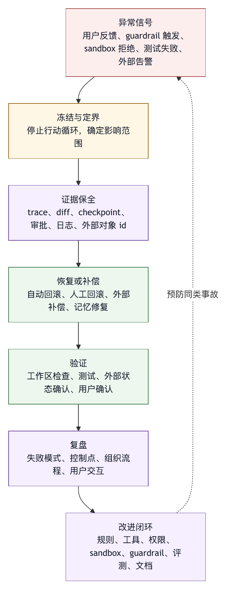

# 第十五章 回滚、恢复与事故处理

## 15.1 成熟 Harness 假设失败一定会发生

安全设计不能只追求不失败。成熟 harness 必须假设失败一定会发生。模型会误解，工具会失败，用户会误点，权限规则会漏判，sandbox 会限制合法操作，外部系统会超时，测试会 flaky，文件会被并发修改，prompt injection 会绕过一层防线。工程问题在于：失败发生后，系统能否限制影响、保留证据、恢复状态、解释原因，并把经验转化为改进。

回滚和恢复是 agent harness 的基础能力。没有恢复能力，用户会不敢授权智能体行动；没有事故处理，团队会在每次失败后靠聊天记录猜测原因；没有失败样本回流，系统会反复犯同类错误。

权限、sandbox、审批和 guardrail 都属于预防性控制，但预防永远不完美。失败之后，系统还需要 checkpoint、回滚、失败隔离、事故分级、证据保留和改进闭环。

## 15.2 回滚不是撤销按钮那么简单

回滚常被理解成“撤销上一步”。在智能体系统中，回滚更复杂，因为智能体的动作可能跨越多个层面：

- 文件修改。
- 生成或删除临时文件。
- 运行命令产生缓存。
- 修改依赖锁文件。
- 创建 commit。
- 调用外部 API。
- 发送消息。
- 创建 issue 或 PR。
- 写数据库。
- 修改长期记忆。
- 更新权限规则。

其中一些动作可逆，一些动作只能补偿，一些动作不可逆。删除本地临时文件可以恢复，发送外部消息通常无法完全撤回，数据库写入可能需要补偿事务，长期记忆错误需要删除和重新索引。

因此，回滚设计要先区分动作类型：

- 可自动回滚。
- 可人工确认后回滚。
- 可补偿。
- 不可回滚，只能记录和处置。

智能体在执行前就应知道某个动作属于哪类。不可回滚动作应触发更高审批等级。

## 15.3 Checkpoint：恢复的锚点

Checkpoint 是恢复的锚点。它在任务开始前或关键步骤前保存状态，让系统能回到一个已知位置。

Checkpoint 可以包含：

- 文件内容快照。
- 文件 hash。
- Git diff。
- 工作区状态。
- 生成物列表。
- 环境变量摘要。
- 工具调用状态。
- 外部对象 id。
- 记忆写入记录。
- 权限变更记录。

不同系统可以选择不同实现。小项目可以直接复制文件；大仓库可以使用增量快照；git 项目可以结合 diff；远程沙箱可以通过环境销毁实现回滚。

一个匿名工程案例把 checkpoint 作为独立于 git 的 side checkpoint，并支持自动运行前 checkpoint 和 restore。这个设计体现了一个重要原则：版本控制不是 harness 回滚的全部。Git 只能覆盖纳入版本控制的文件，无法覆盖未跟踪生成物、外部状态、长期记忆和用户临时上下文。

Checkpoint 的成本不低。频繁快照会消耗时间和磁盘，完整快照大仓库会很慢。因此，checkpoint 策略应按风险分层：低风险只读任务不需要；普通编辑任务可在任务开始前保存；高风险多步任务可在关键步骤前保存；外部副作用动作则需要补偿记录。

## 15.4 Diff 回滚与状态回滚

文件修改通常可以通过 diff 回滚。但 diff 回滚并不总是安全。

如果用户在智能体修改后又手动编辑同一文件，直接反向应用 diff 可能覆盖用户新修改。如果文件被格式化工具改写，diff 上下文可能不匹配。如果生成文件和源码混在一起，回滚可能留下不一致状态。

因此，回滚前应检查：

- 文件是否自 checkpoint 后被非智能体修改。
- 反向 patch 是否可干净应用。
- 是否涉及未跟踪文件。
- 是否有外部状态依赖这些文件变化。
- 是否需要用户确认。

状态回滚比 diff 回滚更广。它包括任务计划、审批记录、记忆写入、工具输出和外部对象。某些状态不应回滚，例如审计记录；某些状态必须回滚，例如错误记忆；某些状态需要标记为已废弃，而不是删除。

回滚不是抹掉历史。审计记录应保留“发生过什么”和“如何恢复”。恢复系统状态与删除证据是两回事。

## 15.5 外部副作用的补偿

外部副作用通常无法完全回滚。发送消息、创建 issue、触发部署、调用支付、修改数据库、发起审批，这些动作一旦发生，就进入外部系统。

对于这类动作，harness 应采用补偿思路：

- 发送更正消息。
- 关闭或更新错误 issue。
- 回滚部署版本。
- 执行反向数据库迁移。
- 撤销审批请求。
- 标记外部对象为废弃。

补偿不是完美回滚。它会留下痕迹，也可能有业务后果。因此，外部副作用动作在执行前应有更严格审批，并明确是否可补偿。

外部工具应返回可追踪对象 id。例如创建 PR 后返回 PR URL，写入任务系统后返回 task id。没有对象 id，事故处理时很难定位。

## 15.6 失败隔离

恢复能力不仅发生在失败后，也体现在失败传播控制。一个工具失败不应让整个系统状态变得混乱。

失败隔离包括：

- 子任务失败不影响无关子任务。
- 工具失败不自动触发高风险替代动作。
- 写入失败不留下半文件。
- 测试失败不被当作系统失败。
- Sandbox 拒绝不被误诊为代码错误。
- 权限拒绝不被重复请求放大。

多智能体系统尤其需要失败隔离。一个子智能体的错误结论不应直接成为主智能体的事实；一个子任务失败应阻止依赖任务，或要求主智能体重新规划。匿名工程案例的多智能体调度包含失败传播和依赖跳过，这正是失败隔离的一种形式。

失败隔离的目标是让系统在局部失败后仍能保持可理解状态。

## 15.7 事故分级

不是所有失败都是事故。一个测试失败、一个工具参数错误、一次网络超时，通常只是普通运行事件。事故是指智能体行为造成或可能造成了超出任务正常范围的负面影响。

可以按影响分级：

- P0：生产系统、客户数据、凭据泄露、不可逆外部副作用。
- P1：重要代码或数据被错误修改，需人工恢复。
- P2：任务失败但可自动回滚，无外部影响。
- P3：模型错误总结、工具误选、无副作用失败。

分级影响处理流程。P3 可以进入普通失败样本；P2 需要记录和回滚；P1 需要人工审查和复盘；P0 需要安全事件响应、通知和组织流程。

NIST AI RMF 提供了识别、度量、管理和治理 AI 风险的框架视角〔注15-2〕。对 harness 来说，事故分级就是把运行失败映射到组织处理流程的桥梁；这一分级是本书的工程化归纳，而不是 NIST 直接给出的事故等级。

## 15.8 事故证据

事故处理最怕证据缺失。智能体系统需要保留足够证据回答：

- 用户原始目标是什么？
- 系统当时的运行模式是什么？
- 模型看到了哪些上下文？
- 调用了哪些工具？
- 参数是什么？
- 权限和审批如何判断？
- Sandbox 是否拒绝过访问？
- 修改了哪些文件？
- 外部系统产生了哪些对象？
- 什么时候开始偏离？
- 是否有 checkpoint？
- 恢复做了什么？

这些证据来自 trace、日志、diff、checkpoint、审批记录、工具结果和外部系统 id。自然语言总结不是证据，只是证据的解释。

证据保留也要注意隐私。事故日志可能包含敏感数据，必须脱敏、访问控制和设置保留周期。

## 15.9 恢复流程

一个基本恢复流程可以分为六步。

第一，停止。发现高风险异常后，停止继续执行，避免扩大影响。

第二，定界。确定影响范围：文件、外部系统、用户、数据、时间窗口。

第三，保全证据。保存 trace、diff、日志、审批记录和 checkpoint。

第四，恢复。自动回滚、人工确认回滚或执行补偿动作。

第五，验证。确认系统回到可接受状态，或外部副作用已被补偿。

第六，复盘。定位失败模式，更新 guardrail、权限、工具、上下文、评测或文档。

这个流程不应只写在事故手册中。Harness 可以把其中一部分产品化。例如，当检测到危险命令被执行后，自动冻结任务、展示影响范围和 checkpoint；当回滚完成后，要求运行验证；当事故关闭后，生成失败样本。

## 15.10 失败样本回流

恢复不是终点。恢复之后，失败应进入改进闭环。

失败样本可以回流到：

- Prompt 修订。
- 工具 schema 改进。
- 权限规则。
- Sandbox 策略。
- Guardrail。
- 项目规则。
- 记忆删除或更新。
- 评测集。
- 用户培训。
- 产品 UI。

关键是正确归因。不要把所有事故都归因于“模型不够强”。如果事故来自权限过宽，就改权限；来自上下文污染，就改上下文装配；来自工具输出不清，就改工具；来自审批提示太弱，就改 UI；来自项目规则缺失，就更新项目规则。

Agentic Harness Engineering 论文提出的研究方向之一，是利用观测和失败样本推动 harness 自动演化〔注15-3〕。但在企业环境中，自动改进也需要审查。安全相关规则不应未经验证自动上线。

## 15.11 回滚与用户信任

回滚能力直接影响用户愿意授权的范围。用户知道智能体行动可撤销，就更愿意允许低风险修改；用户知道系统会展示 diff 和 checkpoint，就更容易理解智能体行为。

但回滚也可能制造虚假安全感。不是所有动作都能回滚，不是所有回滚都无成本，不是所有恢复都能恢复信任。因此，系统应在审批提示中说明可恢复性。

例如：

- “该文件修改可通过 checkpoint 回滚。”
- “该消息发送后不能撤回，只能发送更正。”
- “该数据库迁移需要人工确认回滚脚本。”
- “该命令可能删除未跟踪文件，当前无完整快照。”

用户信任来自真实边界，而不是乐观承诺。

## 15.12 回滚与恢复清单

设计恢复体系时，可以使用以下清单。

Checkpoint：

- 任务开始前是否有恢复点？
- 高风险步骤前是否有额外 checkpoint？
- 非 git 文件和生成物是否覆盖？

动作分类：

- 哪些动作可自动回滚？
- 哪些动作需人工确认？
- 哪些动作只能补偿？
- 哪些动作不可逆？

状态：

- 回滚是否保护用户后续修改？
- 记忆、权限和外部对象是否纳入恢复计划？
- 审计记录是否保留？

事故：

- 是否有事故分级？
- 是否能冻结任务并保全证据？
- 是否能定界影响范围？

验证：

- 回滚后是否运行检查？
- 外部补偿是否确认成功？

闭环：

- 失败是否进入评测和规则改进？
- 是否区分 prompt、工具、权限、上下文和 UI 问题？

恢复能力要让错误不失控，而不是让系统永远不出错。

## 15.13 恢复 Manifest

恢复能力也需要结构化对象。任务开始时，harness 可以创建 recovery manifest，随着工具执行持续更新。一个概念性 manifest 如下：

```text
recovery_manifest:
  run_id: run-abc
  initial_checkpoint: ckpt-001

  workspace:
    branch: feature/fix-settings
    initial_dirty_files:
      - docs/notes.md
    agent_modified_files:
      - src/stores/settingsStore.ts
    agent_created_files: []
    agent_deleted_files: []

  reversible_actions:
    - type: file_patch
      target: src/stores/settingsStore.ts
      checkpoint: ckpt-001
      rollback: reverse_patch

  compensatable_actions:
    - type: external_issue_comment
      object_id: issue-123-comment-456
      compensation: post_correction_comment

  irreversible_actions:
    - type: message_sent
      object_id: chat-message-789
      note: cannot_delete_for_all_recipients

  memory_changes:
    written:
      - mem-project-test-001
    rollback: delete_or_mark_invalid

  approvals:
    high_risk:
      - appr-001

  verification:
    before_recovery: failed
    after_recovery: pending
```

这个 manifest 让恢复不再依赖人脑记忆。系统可以知道哪些文件可反向 patch，哪些外部动作只能补偿，哪些消息不可撤回，哪些记忆需要删除，哪些审批与事故相关。

Manifest 还帮助审批。执行不可逆动作前，系统可以直接告诉用户：“该动作将进入 irreversible_actions，不能自动回滚。” 这比笼统说“有风险”更清楚。

## 15.14 事故处理 Runbook

当智能体行为造成超出任务范围的影响时，团队需要运行手册。一个实用 runbook 可以写成：

```text
1. Freeze
   暂停行动循环，禁止继续工具调用，保留当前状态。

2. Classify
   判断事故等级：P0 / P1 / P2 / P3。

3. Scope
   定界影响：文件、用户、外部系统、凭据、数据、时间窗口。

4. Preserve
   保存 trace、审批、diff、checkpoint、sandbox 事件和外部对象 id。

5. Recover
   自动回滚、人工确认回滚或执行补偿动作。

6. Verify
   检查工作区、测试、外部对象和用户可见状态。

7. Communicate
   向用户说明影响、恢复结果和残余风险。

8. Review
   归因到上下文、工具、权限、sandbox、审批、guardrail 或评测。

9. Improve
   更新规则、工具、项目文档、评测样本和事故知识库。
```

Google SRE 的 postmortem culture 强调无责复盘和从事故中学习〔注15-4〕。agent harness 可以借用这一原则。事故复盘要找出为什么系统让错误动作变得可能、为什么没有更早拦截、恢复措施是否足够及时，而不是寻找谁点错了。

Runbook 的关键是可执行。事故发生时，团队不应临时讨论要不要保存 trace、要不要停下智能体、要不要通知用户。这些动作应预先定义。

## 15.15 案例：错误记忆导致重复事故

一次任务中，智能体误以为某项目使用 `npm test`，并把这个经验写入长期记忆。后来多个任务中，智能体都使用错误命令，导致测试验证失败，却在总结中把失败解释为“环境问题”。用户多次纠正后才发现根因是长期记忆污染。

这个事故涉及文件和外部系统之外的恢复：记忆恢复。

处理步骤应包括：

1. Freeze：暂停当前任务中基于该记忆的验证流程。
2. Scope：查找哪些会话注入过该记忆，哪些最终回答受影响。
3. Preserve：保留记忆写入来源、使用 trace 和用户纠正记录。
4. Recover：删除或降权错误记忆，更新索引和向量缓存。
5. Verify：重新运行项目规则加载，确认 AGENTS.md 或 package 文件中的真实命令优先。
6. Improve：增加记忆写入确认规则和跨项目记忆污染评测。

恢复不只是文件回滚。长期记忆、权限规则、项目规则和工具配置都可能成为事故载体。Harness 的恢复体系必须覆盖这些“软状态”。

## 15.16 图 15-1：事故生命周期

图 15-1 用事故生命周期说明冻结、保全、恢复、验证、复盘和改进的先后关系。

<figure><figcaption><p>图 15-1：事故生命周期</p></figcaption></figure>

```text
异常信号
  用户反馈、guardrail 触发、sandbox 拒绝、测试失败、外部告警
      |
      v
冻结与定界
  停止行动循环，确定影响范围
      |
      v
证据保全
  trace、diff、checkpoint、审批、日志、外部对象 id
      |
      v
恢复或补偿
  自动回滚、人工回滚、外部补偿、记忆修复
      |
      v
验证
  工作区检查、测试、外部状态确认、用户确认
      |
      v
复盘
  失败模式、控制点、组织流程、用户交互
      |
      v
改进闭环
  规则、工具、权限、sandbox、guardrail、评测、文档
```

这张图把事故处理分成两个目标：先恢复，再学习。恢复解决当前影响；学习降低下次相同事故发生概率。只恢复不学习，事故会重复；只复盘不恢复，用户影响没有被处理。

## 15.17 恢复运行指标

恢复体系也应有指标：

- 自动 checkpoint 覆盖率。
- 回滚成功率。
- 回滚失败原因分布。
- 从异常检测到 freeze 的时间。
- 从 freeze 到恢复完成的时间。
- 外部补偿动作数量。
- 不可回滚动作占比。
- 用户手工恢复次数。
- 事故复盘完成率。
- 复盘行动项关闭率。
- 事故样本进入评测集比例。
- 同类事故复发率。

这些指标能衡量 harness 是否从失败中学习。事故数量本身不是唯一指标；还要看影响范围是否缩小、恢复是否更快、同类问题是否减少。

## 15.18 恢复作为运行时能力

恢复不能只存在于事故手册中。对 agent harness 来说，恢复是一种运行时能力：系统在执行任务时持续记录可恢复状态，标注动作可逆性，监测异常信号，并在风险升高时切换到恢复路径。恢复因此不再依赖事故发生后的临时判断。

运行时恢复能力至少包含四层。

第一层是状态捕获。系统需要知道任务开始时工作区是什么状态，用户已有修改是什么，当前模型上下文来自哪里，哪些工具已执行，哪些外部对象已创建，哪些记忆已写入。没有状态捕获，恢复只能靠猜。

第二层是动作分类。每个工具调用都应在执行前被标注为只读、可回滚、需确认回滚、可补偿或不可逆。分类不是静态写在工具说明里的标签，还要结合参数和任务上下文。例如创建本地临时文件通常可回滚，删除用户目录中的未知文件则可能不可恢复；发送草稿可撤销，正式发送邮件只能补偿。

第三层是异常触发。恢复路径不应只由用户手动启动。系统可以在多种信号出现时自动进入保护状态：工具返回危险错误、sandbox 拒绝敏感访问、guardrail 发现输出证据不一致、测试失败但模型准备宣布完成、外部 API 返回部分成功、工作区出现非预期文件变更、成本或重试次数异常增长。

第四层是恢复执行。系统根据 recovery manifest 选择自动回滚、请求人工确认、执行补偿、冻结任务或升级事故。恢复执行也必须写入 trace，因为恢复本身可能失败，也可能带来新的副作用。

把恢复做成运行时能力后，行动循环会多一个重要状态：recovering。它不同于普通失败重试，也不是最终结束；这个状态表示系统承认当前执行路径已不再可靠，需要先控制影响，再决定是否继续。成熟 harness 不应把所有失败都交给模型“想办法继续”，应让恢复成为行动循环的一等状态。

## 15.19 恢复契约

恢复能力需要契约化。没有契约，团队很难判断某个任务到底能不能安全撤回，也很难向用户解释授权边界。恢复契约声明一个运行轨道在失败时提供哪些保证、哪些保证不成立、哪些状态会被保留。

一个概念性的恢复契约可以写成：

```text
recovery_contract:
  id: workspace-edit-standard-v1
  scope:
    - tracked_files
    - untracked_files_created_by_agent
    - tool_trace
    - verification_records

  guarantees:
    checkpoint_before_first_write: true
    preserve_user_dirty_changes: true
    rollback_agent_file_edits: best_effort
    keep_audit_log: always

  exclusions:
    - external_messages
    - remote_issue_comments
    - manually_modified_files_after_checkpoint

  trigger:
    automatic:
      - failed_guardrail_after_write
      - user_requests_revert
      - tool_side_effect_exceeds_scope
    manual:
      - incident_commander_decision

  verification:
    required_after_recovery:
      - workspace_diff_check
      - manifest_consistency_check
```

契约的价值在于把恢复能力从口头承诺变成可审查对象。用户看到“可通过 checkpoint 回滚”时，系统必须能说明覆盖哪些文件、是否包含未跟踪文件、是否保护用户后续修改、是否保留审计记录。团队看到某条运行轨道标注为“外部副作用不可自动回滚”时，就应在审批和 guardrail 中加重控制。

恢复契约也有版本。随着工具、sandbox、工作区实现和外部连接器变化，恢复能力会改变。一个新工具加入后，如果没有恢复语义，就不应默认进入高自治运行轨道。一个旧工具从草稿模式改成直接发送模式，恢复契约也必须更新；未同步更新时，审批提示会误导用户。

契约还应区分保证和努力。文件 patch 反向应用通常是 best effort，因为用户可能在中间修改文件；审计记录保留则应是 always，因为删除证据会破坏事故处理。恢复契约越诚实，用户越能做出真实授权。

## 15.20 Checkpoint 策略工程

Checkpoint 不是越多越好。过密的 checkpoint 会拖慢执行、消耗存储、让恢复点难以选择；过少的 checkpoint 又无法保护关键动作。checkpoint 策略工程要回答三个问题：什么时候保存，保存什么，保存多久。

保存时机可以按风险分层。

只读任务通常不需要工作区 checkpoint，但需要保留上下文和 trace。普通编辑任务应在第一次写入前保存。大规模重构、批量格式化、依赖升级、迁移脚本和多文件生成，应在关键阶段前保存多个恢复点。外部副作用动作之前，checkpoint 不仅要覆盖工作区，还要记录外部对象的预期补偿方式。

保存内容也要分层。最小 checkpoint 可以只保存 diff 基线和文件 hash；中等 checkpoint 保存目标文件快照、未跟踪文件列表和生成物清单；高风险 checkpoint 保存工作区 manifest、依赖锁文件、环境摘要、工具版本、审批记录和记忆状态。对于远程 sandbox，最可靠的 checkpoint 可能是环境快照或可重新创建的 workspace image。

保存周期要和审计、隐私和成本平衡。低风险任务的 checkpoint 可以在会话结束后一段时间清理；事故相关 checkpoint 应进入证据保留策略；包含敏感数据的 checkpoint 必须脱敏、加密或限制访问。Checkpoint 不能变成绕过隐私治理的影子数据湖。

Checkpoint 策略还应考虑选择恢复点。事故发生后，最新 checkpoint 不一定最好。如果错误记忆在中间写入，恢复到错误记忆之后的 checkpoint 无法解决根因。如果用户在智能体修改后做了合法编辑，恢复到任务起点可能会覆盖用户价值。系统需要把 checkpoint 与事件时间线关联，帮助人判断回到哪个点最合理。

工程上，checkpoint 策略应和预算系统协同。高风险任务可以消耗更多时间保存快照，低风险任务则只保留轻量证据。恢复能力也要进入容量规划：如果平台每天运行大量智能体任务，checkpoint 存储、索引、清理和加密都属于平台成本的一部分，不能当作附属问题。

## 15.21 工作区恢复的细节

工作区恢复是最常见的恢复场景，却也是最容易被低估的场景。许多系统以为有 git diff 就足够，但真实工作区往往包含未提交修改、未跟踪文件、生成物、缓存、锁文件、配置文件和用户临时草稿。

恢复前，harness 应先建立变更归属。哪些文件是任务开始前就 dirty，哪些由智能体修改，哪些由用户在任务中修改，哪些由工具自动生成，哪些由格式化器连带修改。没有归属信息，回滚很容易把用户原本的工作当成智能体错误一起撤掉。

文件恢复应优先保护用户后续修改。一个常见策略是三方合并：checkpoint 基线、智能体期望回滚后的内容、当前文件内容。如果当前文件包含用户新增修改，系统应提示冲突，而不是强行覆盖。对小文件可以展示冲突片段；对大文件可以生成恢复分支或临时副本，让用户选择。

未跟踪文件需要单独处理。智能体创建的临时文件可以删除，智能体创建的正式文件可按任务语义撤回，但用户中途新建文件不能删除。系统必须记录创建者和创建时间，不能只按“未跟踪”粗暴清理。

生成物和锁文件需要与源文件一致。一次依赖升级可能修改 `package.json`、锁文件和生成缓存。只回滚源码不回滚锁文件，会留下不可复现状态；只回滚锁文件不回滚源码，也会制造构建错误。恢复系统应理解变更集，而不是逐个文件孤立处理。

工作区恢复还要处理命令副作用。测试可能生成 snapshot，构建可能生成 dist，lint fix 可能改写大量文件，数据库迁移工具可能生成迁移文件。恢复 manifest 应记录命令前后的文件系统变化，并把命令生成物纳入恢复计划。

工作区恢复的验收标准是“工作区回到可解释状态”，而不只是“反向 patch 执行成功”。可解释状态可能不同于任务开始时的状态，它应是用户和系统共同确认的安全状态：用户修改保留，智能体错误撤回，审计证据保留，后续任务可以继续。

## 15.22 外部状态补偿设计

外部状态补偿比文件回滚更依赖业务语义。发送消息、创建 PR 评论、修改工单状态、调用部署 API、写入 CRM、更新知识库、创建日程，这些动作都不能用同一套“撤销”逻辑处理。补偿设计必须贴近外部系统的对象模型。

补偿动作应在工具设计阶段定义，而不是事故后临时寻找 API。每个有外部副作用的工具卡片都应声明：

- 创建了什么外部对象。
- 返回哪个对象 id。
- 是否支持删除、关闭、撤回、编辑或标记废弃。
- 补偿动作是否也需要审批。
- 补偿后用户可见状态是什么。
- 补偿失败时如何升级。

例如，创建 issue 的补偿可能是关闭 issue 并添加说明；发送错误评论的补偿可能是追加更正评论，而不是删除原评论；触发部署的补偿可能是部署前一版本；更新知识库的补偿可能是恢复历史版本并保留变更说明。每种补偿都应有用户可理解的结果。

外部补偿还要避免二次事故。错误消息发送后，智能体自动发送更正消息，看似合理，但如果更正内容也未经用户确认，就可能扩大影响。高影响外部补偿应进入人工审批，尤其涉及客户、生产系统、合规记录和组织公告时。

补偿结果必须可验证。关闭 issue 后要读取 issue 状态；回滚部署后要读取部署版本；恢复文档后要检查版本 id；撤销审批后要确认任务状态。不能只根据工具调用成功就宣布补偿完成。外部系统可能异步执行，也可能部分成功。

外部状态补偿要“把外部世界推进到一个明确、可审计、可沟通的修正状态”，而不是“让事情像没发生过”。成熟 harness 会把这种状态写入事故报告，而不是把补偿包装成无痕回滚。

## 15.23 记忆与规则恢复

长期记忆、项目规则、技能、工具描述和策略配置都是软状态。软状态错误不会像文件 diff 那样显眼，却会在之后反复影响智能体行为。第十五章前面的错误记忆案例只是其中一种。

软状态恢复要先解决可追踪性。每条记忆应记录来源会话、写入原因、作用域、置信度、过期策略和最近使用记录。每条规则应有 owner、版本、评审记录和适用范围。每个工具描述变更应能追溯到 PR、事故或产品需求。没有这些元数据，软状态事故很难定界。

记忆恢复不能只删除错误条目。删除后还要处理索引、缓存、压缩摘要和派生规则。如果错误记忆已经被写进会话摘要，下一次恢复会话仍可能注入错误。如果错误经验被沉淀成团队规则，单条记忆删除也无法解决。恢复系统应沿着派生链查找影响面。

规则恢复也要谨慎。一次事故后，团队容易过度修订规则，把一个具体问题写成过宽禁令。例如某个 `rm` 命令事故后，直接禁止所有删除命令，会破坏合法清理工作。更好的做法是恢复错误规则，补充有边界的 guardrail：要求路径在工作区内、禁止递归删除未知目录、对未跟踪文件删除请求审批。

软状态恢复还需要验证。删除错误记忆后，应重新运行相关检索，确认该记忆不再进入上下文；修改工具描述后，应运行工具选择 eval，确认模型不会继续误选；调整规则后，应运行正反样本，确认合法任务未被误伤。

软状态恢复的组织意义很大。它把事故从“这次运行错了”提升到“平台知识层出了错”。在 agent harness 中，知识层本身会影响未来行为，因此它必须像代码一样有版本、评审、回滚和测试。

## 15.24 事故中的沟通界面

事故处理不仅是后端流程，也是用户界面问题。很多用户对智能体失去信任，原因不在系统出错本身，而在出错后系统含糊其辞、无法说明影响、无法告诉用户下一步怎么办。

事故沟通界面应回答四个问题。

第一，发生了什么。界面要用用户能理解的语言说明异常，而不是只展示工具错误。比如“智能体尝试修改了超出本任务范围的文件，已暂停继续执行”，比“guardrail violation”更清楚。

第二，影响在哪里。用户需要看到受影响文件、外部对象、消息、记忆、权限或数据范围。影响范围应尽量具体：文件路径、PR 链接、任务 id、时间窗口、动作类型。无法确认的部分也要明确标注。

第三，系统做了什么。是否已经冻结、是否有 checkpoint、是否已保全证据、是否可自动回滚、是否需要用户确认、是否存在不可逆副作用。用户需要知道系统不是继续盲动。

第四，用户需要决定什么。恢复界面应给出可选动作：自动回滚智能体修改、保留部分文件、执行外部补偿、导出事故包、继续只读分析、结束任务。每个动作都应说明后果。

沟通界面也要避免制造恐慌。P3 级普通失败不需要展示成严重事故；P0/P1 级影响不能轻描淡写。事故分级应影响界面语气、颜色、阻断程度和通知范围。低级别可以内嵌提示，高级别应进入独立恢复视图并阻止继续执行。

对企业平台来说，事故沟通还包括团队接口。安全、平台、业务 owner 和最终用户看到的信息不完全相同。最终用户需要知道自己的任务如何恢复；平台团队需要 trace 和控制点；安全团队需要影响面和证据链；管理者需要复盘行动项。Harness 应从同一份事故事实生成不同视图，而不是让每个角色各自拼接信息。

## 15.25 恢复演练

没有演练的恢复能力通常是不可靠的。团队如果只在真实事故中第一次使用 checkpoint、补偿脚本和事故 runbook，就会发现权限不够、对象 id 缺失、日志过期、恢复脚本不可运行、负责人不知道自己该做什么。

恢复演练可以从小规模开始。选择一个低风险项目，让智能体执行受控错误修改，然后验证系统能否冻结、展示 diff、回滚文件、保留 trace、生成事故样本。之后逐步加入外部对象、长期记忆、权限拒绝、sandbox 拒绝、多智能体并发和部分成功的外部 API。

演练样本应覆盖不同失败模式：

- 文件 patch 应用到错误位置。
- 智能体删除了本应保留的未跟踪文件。
- 测试失败但最终回答声称通过。
- 外部评论发错对象。
- 长期记忆写入错误项目规则。
- 子智能体修改了主任务未授权文件。
- sandbox 拒绝被误诊为业务代码错误。
- 部署补偿动作部分成功。

每次演练都应记录四类指标：检测是否及时，恢复是否成功，证据是否足够，用户是否理解。只验证“能不能回滚文件”不够；如果用户看不懂影响范围，恢复系统仍然不成熟。

恢复演练也能反向检验前面几章的控制能力。权限是否过宽，sandbox 是否记录拒绝原因，审批是否说明不可逆性，guardrail 是否能触发 freeze，trace 是否足够还原事故，质量门禁是否防止虚假完成。第十五章是第三编治理体系的压力测试，不是孤立能力。

企业平台可以把恢复演练纳入发布流程。新工具上线前，至少证明它的副作用可记录、可补偿或明确不可逆；新运行轨道上线前，至少完成一次端到端恢复演练；高风险连接器上线前，必须验证对象 id、补偿动作和审批链。

## 15.26 事故复盘的工程输出

事故复盘如果只写“以后注意”，对 harness 没有价值。工程化复盘必须产出可执行资产，并进入后续发布门禁。

一个 agent harness 事故复盘可以包含：

- 事故等级和影响范围。
- 用户目标和授权范围。
- 关键时间线。
- 失效链：哪个控制点未能阻止风险。
- 恢复动作和验证结果。
- 根因分类：上下文、工具、权限、sandbox、审批、guardrail、记忆、评测、UI 或组织流程。
- 需要新增或修改的规则。
- 需要新增的评测样本。
- 需要修改的产品界面。
- 需要更新的 runbook。
- 行动项 owner 和关闭证据。

其中先看失效链。不要只问“模型为什么错了”，而要问：为什么上下文让错误判断看起来合理，为什么工具允许这个参数，为什么权限没有要求审批，为什么 sandbox 没有隔离，为什么 guardrail 没有触发，为什么最终输出没有披露失败，为什么用户无法及时发现。失效链越具体，改进越可落地。

复盘输出还应进入资产库。事故样本进入 eval set，错误工具调用进入工具 guardrail 样本，误导性上下文进入 prompt injection 样本，审批误判进入 UI 评测，错误记忆进入记忆写入回归。复盘要把事故转成系统免疫力，不能停在文档归档。

行动项必须有关闭证据。规则已合并、eval 已通过、UI 已发布、工具 schema 已更新、runbook 已演练，这些才是关闭。没有关闭证据的复盘，只是组织情绪释放。

## 15.27 恢复发布门禁

恢复能力本身也需要发布门禁。一个新 harness 版本如果改变工具执行、文件编辑、审批、记忆、连接器或行动循环状态机，就可能改变恢复语义。平台不能只测试功能成功路径，还要测试失败和恢复路径。

恢复发布门禁可以包含以下检查：

- 新增工具是否声明可逆性、补偿动作和对象 id。
- 文件编辑器是否保护用户 dirty 修改。
- checkpoint 是否覆盖新增生成物类型。
- 外部连接器是否记录请求、响应和补偿依据。
- 记忆写入是否可追踪、可删除、可降权。
- 行动循环是否能从异常状态进入 freeze 或 recovering。
- 最终回答是否披露恢复结果和残余风险。
- 事故 runbook 是否随新能力更新。
- 相关恢复演练是否通过。

门禁不要求所有动作都可回滚。现实系统做不到这一点。门禁要求的是：可回滚的动作有可靠机制；不可回滚的动作被明确标注并加强审批；可补偿的动作有补偿方案和验证方式；无法保证的地方不向用户承诺。

恢复门禁也应关注降级路径。如果 checkpoint 服务不可用，智能体是否禁止高风险写入；如果 trace 存储失败，是否停止外部副作用；如果补偿 API 暂时不可用，是否升级人工处理；如果审批记录缺失，是否拒绝继续执行。恢复系统自身也会失败，成熟平台要为恢复能力设计降级。

## 15.28 事故数据与隐私

事故处理需要证据，但证据往往包含敏感信息。Trace 可能包含用户目标、代码片段、密钥路径、客户数据、聊天内容、外部 API 响应和内部策略。Checkpoint 可能保存完整文件内容。事故包如果无限制扩散，会造成二次泄露。

因此，事故数据治理必须和恢复体系同时设计。

第一是最小化。事故包应按分级收集必要证据，而不是默认导出完整上下文。P3 失败可能只需要工具状态和错误摘要；P0/P1 事故才需要更完整证据链。即便是高等级事故，也应区分原始证据和脱敏视图。

第二是访问控制。最终用户、平台工程师、安全团队、法务和外部供应商不应看到同一份原始数据。Harness 应支持按角色生成事故视图。安全团队可能需要完整时间线，业务用户只需要影响范围和恢复结果，模型供应商通常只应看到脱敏样本。

第三是保留周期。普通失败样本可以保留摘要，事故证据按政策保留，包含敏感数据的 checkpoint 应有更短生命周期或加密归档。删除策略也要保留审计：什么时候清理，谁批准，清理了哪些对象。

第四是样本化处理。事故样本进入评测集时，应去除真实用户、路径、客户信息、密钥、内部 URL 和业务敏感文本，同时保留失败结构。好的样本保留能复现控制失效的最小结构，而不是原样保存事故现场。

隐私治理会增加事故处理成本，但这是必要成本。没有证据，无法恢复和学习；证据无治理，又会制造新的风险。成熟 harness 要在两者之间建立可执行的制度。

## 15.29 恢复能力成熟度

恢复能力可以按成熟度观察。

L0 阶段，系统没有明确恢复设计。失败后靠用户手工查看文件、复制聊天记录、猜测工具执行结果。外部副作用几乎无法定位。

L1 阶段，系统提供基础撤销或 git diff，但覆盖范围有限。它能处理部分文件修改，无法处理未跟踪文件、外部对象、记忆、审批和 trace。

L2 阶段，系统有 checkpoint、工具 trace 和恢复 runbook。常见文件事故可以回滚，外部副作用可以定位，事故证据基本齐全。但恢复仍主要由人工发起，软状态恢复和演练不足。

L3 阶段，恢复成为运行时能力。动作可逆性在执行前标注，异常可自动 freeze，recovery manifest 持续更新，文件、外部对象、记忆和审批都有恢复语义。事故样本可以回流到 eval 和 guardrail。

L4 阶段，组织形成持续学习系统。恢复演练进入发布门禁，事故复盘产出工程资产，恢复指标驱动平台投资，同类事故复发率下降。用户界面能清楚展示影响、恢复选项和残余风险。

这个成熟度模型提醒团队：恢复能力是一组贯穿智能体生命周期的工程实践，不是一个按钮。很多平台在功能演示时看起来强大，但只要问三个问题就能看出成熟度：失败后能不能定界，能不能恢复，能不能证明以后更不容易再犯。

## 15.30 自动恢复与人工接管

恢复体系越成熟，越需要明确自动化边界。并不是所有失败都应自动恢复，也不是所有事故都应立刻交给人。成熟 harness 要把自动恢复和人工接管设计成连续谱，而不是两个互斥选项。

适合自动恢复的场景通常具备三个条件：影响范围小，动作可逆，验证信号明确。比如智能体修改了单个文件后触发输出 guardrail，系统可以自动回滚该文件并要求重新规划；命令生成了明确由智能体创建的临时文件，系统可以自动清理；工具调用因为参数格式错误失败，系统可以保留证据并让模型修正参数。

必须人工接管的场景通常也很清楚：涉及生产系统、客户可见对象、凭据和敏感数据、不可逆外部副作用、多方协作影响、合规记录、无法定界的文件变更，或恢复动作本身可能扩大损失。此时系统应停止执行，展示事故包，并把决策权交给有责任的人。

中间地带最难。比如智能体在 PR 中发错评论，评论可以删除或追加更正，但哪种更合适取决于团队文化和上下文；一次依赖升级失败，系统可以回滚，也可以保留部分修改让用户继续；错误记忆已经影响多个会话，删除本身容易，但如何通知受影响用户需要判断。对这类场景，harness 应提供建议方案和证据，而不是假装能完全自动处理。

自动恢复还要防止“恢复循环”。如果系统自动回滚后又让智能体重试，智能体可能再次走入同一错误路径，形成写入、失败、回滚、重试的循环。恢复状态应携带失败原因，并修改后续行动空间：降级为只读、要求重新计划、限制某个工具、请求用户确认，或把任务交给人工。

人工接管也不等于放弃工程支持。系统应把接管时刻的状态打包：当前目标、已执行动作、checkpoint、diff、外部对象 id、失败信号、建议恢复路径和残余风险。接管者不应从聊天记录里重新考古。好的接管界面让人快速判断“是否继续、如何恢复、是否通知、如何复盘”。

自动恢复的目标是把人放在需要判断的位置，而不是把人排除在外。低风险、可验证、可回滚的部分由系统快速处理；高风险、含糊、价值判断和外部沟通交给人。这个边界越清楚，agent harness 越能在效率和责任之间取得平衡。

## 15.31 第三编治理链的闭合

到第十五章，第三编讨论的安全、权限与治理形成一个闭环。

权限模型决定智能体能做什么，sandbox 决定它在哪里做，人工审批决定哪些动作需要人承担授权，guardrail 决定运行中哪些风险要被拦截，回滚与事故处理决定失败后如何止损和学习。这五类能力不能分开设计。

如果权限过宽，恢复会频繁处理本可避免的事故。如果 sandbox 没有隔离，checkpoint 可能无法覆盖真实副作用。如果审批没有说明不可逆性，用户授权就不是真实授权。如果 guardrail 只会 block 不会触发 freeze，事故证据可能丢失。如果恢复不把失败样本回流，前面所有控制都会停留在静态规则。

治理链的最终目标是让系统能在明确边界内大胆执行，而不是让智能体变得胆小。用户愿意给智能体更多权限，依赖的是 harness 能限制影响、保留证据、诚实沟通、恢复状态并持续改进，并不是对模型永远正确的信任。

本章也是从“预防性控制”转向“可验证治理”的桥。下一编进入 trace、日志、评测、成本和质量门禁，将进一步回答一个问题：我们如何证明这些治理能力真的在运行，而不是只写在架构图里。

## 15.32 第十五章小结

第三编前四章讨论预防性控制：权限、sandbox、审批和 guardrail。本章转向失败之后的系统能力。成熟 harness 必须假设失败会发生，并提供 checkpoint、回滚、补偿、失败隔离、事故分级、证据保留和改进闭环。

回滚不是简单撤销按钮。文件、状态、外部副作用、记忆和审计记录都有不同恢复语义。恢复也不是终点，失败样本还要回流到 harness 的持续演化中。

第三编完成安全、权限与治理的主体结构。第四编进入可观测性与评测，先讨论 trace 与日志；没有可观测性，权限、sandbox、审批、guardrail 和恢复都无法被可靠验证。
