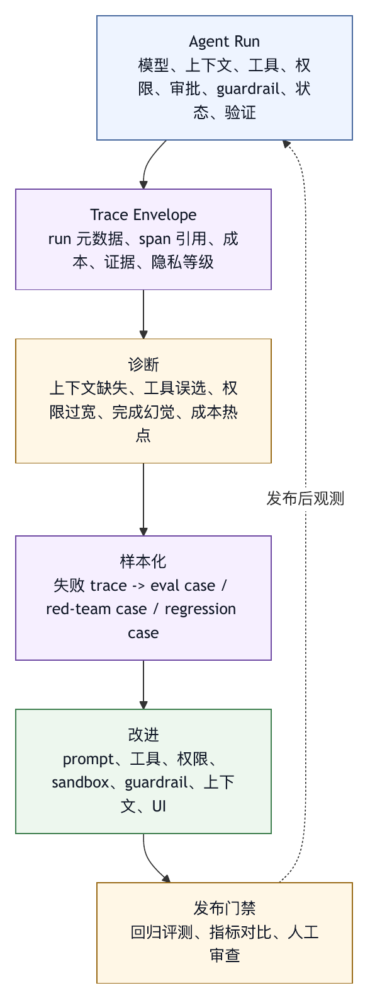

# 第十六章 Trace 与日志

## 16.1 没有 Trace，就没有可靠的智能体工程

智能体系统的失败往往不是一个点。模型可能在错误上下文中做出判断，工具可能返回被截断的输出，权限可能拒绝某个动作，sandbox 可能拦截网络访问，用户可能批准了一个高风险命令，模型最后又把未验证工作总结成完成。没有 trace，团队只能看最终回答，猜测问题发生在哪里。

可观测性是 harness engineering 的第四个核心支柱。前面几编讨论了能力、安全和恢复，本编讨论如何看见这些系统行为。Trace 与日志的目标是让开发者、用户和组织回答关键问题，而不是保存所有文本：

- 智能体看到了什么？
- 它为什么选择这个动作？
- 调用了哪些工具？
- 参数是什么？
- 结果是什么？
- 谁批准了什么？
- 哪些 guardrail 被触发？
- 状态如何变化？
- 成本和延迟在哪里产生？
- 最终结论是否有证据？

如果这些问题无法回答，智能体就不可调试、不可审计、不可评测，也不可持续改进。

## 16.2 Trace、日志和指标的区别

可观测性通常包括三类数据：trace、日志和指标。

Trace 关注一次请求、任务或 agent run 的完整路径。它由多个 span 或事件组成，展示模型调用、工具调用、审批、状态更新、外部 API、错误和耗时之间的关系。

日志关注离散事件。它记录“发生了什么”，例如某个工具开始执行、某个权限被拒绝、某个文件被修改、某个错误出现。

指标关注聚合数值。它回答“整体表现如何”，例如平均延迟、成功率、工具失败率、审批率、token 消耗、成本、回滚次数、guardrail 触发率。

OpenTelemetry 把 traces、metrics 和 logs 作为通用可观测性基础，并通过 spans、collector、exporter 等机制实现跨系统观测。〔注16-1〕 对 agent harness 来说，这些概念可以复用，但还要补充智能体特有语义：模型调用、上下文装配、工具轨迹、记忆注入、审批、handoff、状态迁移和最终验证。

一句话：日志告诉你发生过什么，指标告诉你整体趋势，trace 告诉你一次 agent run 如何走到结果。

## 16.3 智能体 Trace 的基本结构

一个智能体 trace 应以 run 为单位。Run 是一次用户目标从接收到结束的完整执行。

基本结构可以是：

```text
Trace: run_id
  Span: context_assembly
  Span: model_generation
  Span: tool_call.read_file
  Span: tool_call.grep_files
  Span: permission_request
  Span: tool_call.apply_patch
  Span: tool_call.run_tests
  Span: output_guardrail
  Span: final_response
```

每个 span 至少应包含：

- span id。
- parent id。
- 开始和结束时间。
- 类型。
- 输入摘要。
- 输出摘要。
- 状态：成功、失败、取消、拒绝。
- 错误类型。
- 关键属性。
- 敏感数据标记。

OpenAI Agents SDK tracing 文档中，agent run 可以记录 LLM generations、tool calls、handoffs、guardrails 和 custom events。〔注16-2〕 这个 SDK 例子支持本书的判断：智能体 trace 不应只记录模型输入输出，而应覆盖整个运行过程。

对于 harness，trace 首先要保持因果关系。某个最终回答应能追溯到哪些工具结果；某个工具调用应能追溯到哪次模型输出；某次审批应能追溯到哪个工具参数；某次错误应能追溯到哪个上下文和状态。

## 16.4 模型调用 Trace

模型调用是 trace 中最基本的 span，但不能只记录 prompt 和 response。生产系统通常还要记录：

- 模型 id 和版本。
- 输入 token、输出 token。
- 上下文摘要。
- 系统指令版本。
- 工具列表版本。
- 采样参数。
- 输出是否截断。
- 是否流式。
- 是否包含工具调用。
- 成本估算。
- 延迟。
- 错误码。

原始输入输出可能包含敏感信息，不一定适合保存。可以采用分层策略：默认保存摘要和元数据；调试模式保存脱敏内容；高敏任务只保存 hash、长度和来源。

模型调用 trace 的关键作用是解释模型为什么生成了某个动作。如果没有上下文摘要，团队看到模型调用工具，却不知道它当时看到了哪些文件、规则和记忆。

## 16.5 上下文装配 Trace

上下文装配是智能体故障最常见的来源之一，因此必须可观测。

上下文 trace 应记录：

- 注入了哪些系统指令。
- 用户目标摘要。
- 生效项目规则。
- 读取或检索了哪些文件。
- 注入了哪些长期记忆。
- 工具结果是否被压缩。
- 外部内容是否标记为不可信。
- 哪些材料被裁剪。
- token 预算分布。
- 冲突如何处理。

这不意味着保存全部上下文。重点是保存结构和来源。事故复盘时，团队需要知道模型是否缺少关键文件、是否看到过期记忆、是否被外部内容污染、是否丢失用户约束。

没有上下文 trace，很多问题会被误判为模型能力问题。

## 16.6 工具调用 Trace

工具调用是智能体 trace 中最需要细节的部分。每个工具 span 应记录：

- 工具名称。
- 工具版本。
- 参数摘要。
- 风险等级。
- 权限判断。
- 工作目录或目标资源。
- 开始和结束时间。
- 结果状态。
- 输出摘要。
- 输出是否截断。
- 错误分类。
- 环境变化。

对于文件编辑工具，应记录修改路径和 diff 引用。对于 shell，应记录命令、cwd、退出码、超时和输出截断。对于网络工具，应记录域名、方法、状态码和数据量。对于外部写工具，应记录外部对象 id。

工具 trace 是评测和恢复的基础。没有它，系统无法判断工具失败率、误选工具、参数错误、权限拒绝和高成本工具调用。

## 16.7 审批、权限和 Guardrail Trace

安全相关事件必须进入 trace。它们包括：

- 权限允许、拒绝、询问。
- 用户审批请求。
- 用户批准或拒绝。
- 审批范围和有效期。
- Sandbox 拒绝。
- Guardrail 触发。
- 运行模式变化。
- 策略配置版本。

这些事件直接影响事故复盘。系统需要知道某个高风险动作是自动允许、用户批准，还是策略漏判。用户也需要知道自己批准的范围。

审批和 guardrail trace 还可用于改进策略。某类请求经常被批准，可能可以自动化；某类请求经常被拒绝，可能说明模型计划不合理；某类 guardrail 经常误拦，可能需要调整。

## 16.8 状态变化 Trace

agent run 不只是工具调用序列，也是状态变化序列。状态变化 trace 应记录：

- 计划创建和更新。
- 已完成项变化。
- 未完成项变化。
- 失败记录。
- checkpoint 创建。
- 回滚执行。
- 记忆写入或删除。
- 子智能体派发和汇总。
- 最终验证状态。

状态 trace 能回答“智能体何时偏离目标”。例如，用户要求只分析，状态在某轮变成“准备编辑文件”；用户要求修一个测试，计划突然扩展到重构模块。状态变化如果不可见，目标漂移很难定位。

状态 trace 也帮助 UI 展示进度。用户不需要看所有 token，但需要知道当前是在搜索、修改、验证还是等待审批。

## 16.9 成本和延迟 Trace

智能体系统的成本和延迟往往来自多个环节：模型调用、长上下文、工具等待、网络请求、测试运行、重试、审批等待、子智能体并发。没有 trace，只能看到总耗时和总成本。

成本 trace 应记录：

- 每次模型调用 token 和费用。
- 多模态输入成本。
- 外部工具或插件成本。
- 重试成本。
- 子智能体成本。
- Web search 或付费 API 成本。

延迟 trace 应记录：

- 模型等待时间。
- 工具执行时间。
- 队列等待。
- 用户审批等待。
- 网络超时。
- 重试退避。

这些数据可以指导优化。若成本主要来自长上下文，就改上下文装配；若延迟主要来自测试，就改验证策略；若工具失败导致重试成本高，就改工具错误语义。

## 16.10 日志脱敏与隐私

智能体 trace 很有价值，也很敏感。它可能包含源码、用户请求、密钥、客户数据、内部路径、外部系统响应和模型输出。可观测性不能以泄露隐私为代价。

脱敏策略包括：

- API key、token、密码和证书自动 redaction。
- 敏感路径内容不保存原文。
- 外部响应按字段过滤。
- 用户个人信息脱敏。
- 高敏任务只保存元数据。
- Trace 访问控制。
- 保留周期。
- 导出前二次脱敏。

OpenAI Agents SDK tracing 支持配置是否包含敏感数据。〔注16-2〕 这个设计提示我们，trace 设计必须从一开始考虑隐私，而不是事后清理。

脱敏还要避免破坏调试价值。完全删除所有输入输出会让 trace 失去意义。更好的方式是分层存储：默认元数据，受控调试原文，审计可追溯授权。

## 16.11 采样与保留策略

全量 trace 保存昂贵，也可能带来隐私风险。生产系统需要采样和保留策略。

常见策略包括：

- 所有 run 保存元数据。
- 失败 run 保存更详细 trace。
- 高风险 run 保存审批和工具详情。
- 成功低风险 run 采样保存。
- 用户标记问题时提升保留级别。
- 事故 run 冻结保留。
- 超过保留期自动删除或归档。

采样不能破坏事故处理。高风险动作、外部副作用、权限拒绝和 guardrail 触发，应优先保留。低风险重复读操作可以只保留摘要。

保留策略还应与合规、组织政策和用户权利一致。用户删除任务时，trace、记忆、缓存和导出副本都要考虑。

## 16.12 从 Trace 到改进

Trace 的最终价值是改进 harness。团队可以从 trace 中发现：

- 上下文缺失。
- 工具误选。
- 参数错误。
- 目标漂移。
- 权限过宽或过窄。
- 审批疲劳。
- Sandbox 误拦。
- Guardrail 漏拦。
- 成本热点。
- 长尾失败。

这些发现可以进入：

- 项目规则。
- Prompt 修订。
- 工具 schema。
- 权限策略。
- Sandbox 规则。
- 评测集。
- UI 改进。
- 记忆清理。

没有 trace，团队只能从用户抱怨中猜。Trace 让 harness 从“感觉调参”进入“证据驱动演化”。

## 16.13 Trace 清单

设计 trace 与日志系统时，可以使用以下清单。

覆盖：

- 是否记录模型调用、上下文装配、工具调用、审批、guardrail、状态变化和最终验证？
- 是否能关联子智能体和外部系统对象？

结构：

- 是否有 run id、span id、parent id？
- 是否区分日志、指标和 trace？
- 是否记录错误类型和状态变化？

隐私：

- 是否有脱敏策略？
- 是否可配置敏感数据保存？
- 是否有访问控制和保留周期？

成本：

- 是否记录 token、外部工具成本、重试和子智能体成本？
- 是否能定位延迟来源？

使用：

- Trace 是否进入调试、评测和事故处理？
- 是否能从失败 trace 生成回归样本？

可观测性的目标是让系统行为可解释、可恢复、可改进，而不是多存数据。

## 16.14 Trace Envelope：一次 Agent Run 的结构化外壳

为了让 trace 可复用、可导出、可评测，harness 应定义统一的 trace envelope。Envelope 是一次 agent run 的结构化外壳，不保存所有细节，但为所有 span、日志、指标和最终证据提供索引。

一个概念性 trace envelope 可以写成：

```text
trace_envelope:
  run_id: run-2026-05-27-001
  session_id: sess-abc
  user_id_hash: user-...
  task_type: coding_fix
  created_at: 2026-05-27T10:15:00Z
  finished_at: 2026-05-27T10:27:30Z
  status: success

  model:
    primary_model: provider.model-version
    fallback_models: []

  workspace:
    root_hash: ...
    vcs: git
    branch: feature/fix-settings
    initial_dirty: true
    checkpoint_id: ckpt-001

  policy:
    permission_profile: coding-agent-interactive
    sandbox_profile: local-workspace-limited
    guardrail_versions:
      - prevent-false-completion:v3
      - block-secret-read:v2

  spans:
    count: 18
    refs:
      - span-context-assembly-1
      - span-model-step-1
      - span-tool-read-file-1
      - span-tool-run-tests-1

  evidence:
    modified_files:
      - src/stores/settingsStore.ts
    tests:
      - command: pnpm test -- settingsStore
        status: success
    approvals: []
    guardrails_triggered:
      - output_completion_check

  cost:
    input_tokens: 42000
    output_tokens: 6800
    tool_calls: 9
    wall_time_seconds: 750

  privacy:
    raw_prompts_retained: false
    tool_outputs_redacted: true
    retention_class: normal
```

Envelope 的价值在于，它把一次 run 的关键事实放在一个可查询对象中。评测系统可以读取 evidence，成本系统可以读取 cost，安全系统可以读取 policy 和 approvals，事故系统可以读取 checkpoint 和 span refs。详细 span 可以分开保存，按权限访问。

这个结构也适合导出到 OpenTelemetry 生态。OpenTelemetry 的 span 机制提供了跨系统观测基础；OpenTelemetry GenAI semantic conventions 处于发展状态，覆盖生成式 AI 事件、异常、指标、模型 span 和 agent span 等语义方向。〔注16-3〕 Harness 可以借用这些约定，同时扩展工作区、审批、guardrail、checkpoint 和最终证据等智能体特有字段。

## 16.15 Span 设计：哪些内容应该成为一等事件

不是所有日志都应成为 span。Span 应表示具有持续时间、因果关系和工程意义的活动。对于 agent harness，以下活动通常应是一等 span：

```text
context_assembly
model_generation
tool_call
permission_decision
approval_wait
sandbox_execution
guardrail_check
state_update
checkpoint_create
rollback
handoff_or_subagent
final_response
```

每类 span 应有稳定属性。例如 `tool_call` span 应包含工具名、工具版本、参数摘要、权限结果、执行状态、错误类型和输出截断；`model_generation` span 应包含模型 id、输入输出 token、工具列表版本、上下文 manifest 引用和输出类型；`approval_wait` span 应包含审批请求 id、展示摘要、用户决策、等待时长和授权范围。

Span 设计过粗，会失去定位能力。只记录“agent run 运行 5 分钟”无法知道时间花在哪里。Span 设计过细，又会产生海量噪声。一个实践原则是：如果某个事件会影响安全、成本、结果或恢复，它就值得成为 span；如果只是内部调试输出，可以作为日志附着在 span 上。

Span 的 parent-child 关系也很重要。一次工具调用应挂在产生该调用的模型步骤下；一次审批等待应挂在工具调用审查下；一次 sandbox 拒绝应挂在执行器下。这样，事故复盘时可以沿因果链追踪，而不是在时间线中搜索。

## 16.16 案例：没有上下文 Trace 的误诊

某团队发现智能体经常在修复 bug 时改错模块。最初大家认为模型代码能力不足，于是换了更强模型。结果有所改善，但问题仍存在。后来团队补充上下文装配 trace，才发现根因：检索工具把同名旧模块排在前面，而上下文预算又把新模块的项目规则裁掉了。

一次失败 trace 显示：

```text
context_assembly:
  user_goal: 修复新版 settings 页面刷新问题
  injected_rules:
    - root/AGENTS.md
  omitted_rules:
    - apps/new-settings/AGENTS.md  reason: token_budget
  retrieved_files:
    - legacy/settings/SettingsPage.tsx
    - legacy/settings/store.ts
  omitted_candidates:
    - apps/new-settings/SettingsPage.tsx reason: rank_below_cutoff
```

没有这段 trace，团队只能看到模型改了 legacy 目录，于是归因于模型理解差。有了 trace，控制点变清楚：检索排序、项目规则作用域和预算策略需要修改，而不是只换模型。

修复后，团队把以下内容加入回归：

1. 同名新旧模块的检索任务。
2. 子目录项目规则不可被预算裁掉的检查。
3. 最终 diff 不能触及 legacy 目录的断言。
4. 上下文 manifest 必须记录被省略候选文件。

Trace 的价值在于把失败归因到具体工程层，而不是“保存聊天记录”。模型可能仍会犯错，但团队不再盲目调模型。

## 16.17 隐私分层：Trace 不应只有开和关

很多系统把 trace 隐私做成一个开关：要么保存全部，要么几乎不保存。这两种都不理想。更合理的是分层。

```text
Level 0: Metrics Only
  只保存聚合指标，不保存 run 级 trace。

Level 1: Metadata Trace
  保存 run、span、状态、耗时、token、工具名和结果状态。

Level 2: Redacted Trace
  保存脱敏后的上下文摘要、工具输出摘要、diff 引用和错误片段。

Level 3: Debug Trace
  在受控权限下保存更完整输入输出，用于复现复杂问题。

Level 4: Incident Freeze
  事故场景冻结关键证据，访问受严格审计和保留策略控制。
```

不同任务可以使用不同等级。普通低风险任务使用 Level 1 或 2；用户报告问题时提升到 Level 2；内部调试可临时使用 Level 3；安全事故进入 Level 4。关键是等级变化要有记录，用户和组织应知道哪些数据被保存。

这种分层也便于合规。高敏任务可以不保存原文，但仍保留足够元数据用于成本、延迟和策略评估。事故任务可以保存更完整证据，但设置严格访问控制和保留期限。

## 16.18 图 16-1：Trace 到改进的证据链

图 16-1 将 trace、失败归因、评测样本和系统改进连接成可审计证据链。

<figure><figcaption><p>图 16-1：Trace 到改进的证据链</p></figcaption></figure>

```text
Agent Run
  模型、上下文、工具、权限、审批、guardrail、状态、验证
      |
      v
Trace Envelope
  run 元数据、span 引用、成本、证据、隐私等级
      |
      v
诊断
  上下文缺失、工具误选、权限过宽、完成幻觉、成本热点
      |
      v
样本化
  失败 trace -> eval case / red-team case / regression case
      |
      v
改进
  prompt、工具、权限、sandbox、guardrail、上下文、UI
      |
      v
发布门禁
  回归评测、指标对比、人工审查
```

这条证据链解释了为什么 trace 是第四编的起点。没有 trace，评测样本缺少过程；没有过程，改进只能看最终成败；没有可回归样本，发布门禁就无法证明变更没有引入旧问题。

## 16.19 Trace 作为证据契约

Trace 如果只被当作调试日志，就很难支撑生产级 harness。成熟系统应把 trace 设计成证据契约：每一次 agent run 在结束时，都必须留下足以解释结果、评估风险、恢复状态和生成评测样本的证据。契约要求关键事实可追溯、可关联、可验证，并不要求保存所有原文。

证据契约至少回答六个问题。

第一，目标证据。用户原始目标、系统理解的任务类型、范围约束和完成标准是什么。很多失败来自目标漂移，如果 trace 没有记录任务理解，复盘只能看最终回答。

第二，上下文证据。模型看到哪些系统规则、项目规则、文件、检索结果、工具输出和记忆；哪些候选材料被裁剪；哪些外部内容被标记为不可信。上下文是智能体决策的土壤，没有上下文证据，模型行为无法解释。

第三，动作证据。系统调用了哪些工具，参数是什么，权限和审批如何判断，执行结果如何，是否产生副作用。动作证据决定恢复和审计能否进行。

第四，状态证据。计划如何变化，运行模式是否切换，checkpoint 是否创建，是否进入 recovering，是否派发子智能体，是否发生回滚。状态证据解释 run 为什么从一个阶段进入另一个阶段。

第五，结果证据。最终回答中的修改、验证、失败、残余风险和外部动作声明，分别对应哪些 trace 记录。输出 guardrail 可以基于这些证据检查完成幻觉。

第六，治理证据。成本、延迟、策略版本、guardrail 触发、采样等级、脱敏等级和保留策略是什么。这些证据让组织能够比较不同 harness 版本，而不是只凭感觉判断。

一旦把 trace 定义为证据契约，trace 质量就可以被测试。某类高风险任务如果没有审批 span，应被门禁拒绝；最终回答声称测试通过但 trace 中没有成功验证，应触发输出 guardrail；外部副作用没有对象 id，应视为工具契约不完整。Trace 不再是事后查错的附属品，而是运行时质量的一部分。

## 16.20 Trace Schema 与语义版本

Trace 数据必须有 schema。没有 schema，日志字段会随实现者习惯漂移，评测、审计和成本分析都难以长期复用。agent harness 的 trace schema 应同时兼顾通用可观测性标准和智能体特有语义。

通用部分可以借鉴 OpenTelemetry：trace id、span id、parent id、span name、start time、end time、attributes、events、status 和 links。OpenTelemetry GenAI semantic conventions 已经为生成式 AI 调用、检索和工具执行提供了一些语义方向，例如模型调用、retrieval、execute tool、token、provider 和错误类型等。Harness 不应重复发明所有基础字段，而应在标准可表达的地方尽量兼容。

但 agent harness 还需要扩展字段。普通服务调用不关心用户批准了哪个 shell 命令，也不关心模型是否看到了某条项目规则。Harness schema 应补充：

- task_intent：任务类型、风险等级、运行轨道。
- context_manifest_ref：上下文来源、优先级、裁剪记录。
- tool_risk：工具副作用类别、可逆性、审批要求。
- workspace_ref：工作区、分支、dirty 状态、checkpoint。
- policy_ref：权限、sandbox、guardrail 和质量门禁版本。
- evidence_ref：diff、测试、外部对象、事故包。
- privacy_class：脱敏等级、保留周期、访问范围。

Schema 也要版本化。一个 trace envelope 使用 `trace_schema_version`，每类 span 使用 `span_schema_version`。当工具参数摘要规则、隐私字段、成本字段或 guardrail 事件格式改变时，旧 trace 不能被静默误读。评测系统读取历史 trace 时，应知道它来自哪个 schema 版本。

语义版本还帮助迁移。平台可以支持旧版本读取、新版本写入，或者在离线管线中把旧 trace 迁移到新格式。没有版本，trace 数据会在几个月后变成无法解释的历史包袱。

## 16.21 上下文 Trace 与 Context Manifest 的连接

第六章讨论过上下文装配，第十六章要把它观测化。上下文 trace 不应只记录“使用了多少 token”，而应记录上下文包的结构、来源、优先级和缺失。

一个上下文 trace 可以连接到 context manifest：

```text
context_trace:
  context_manifest_id: ctx-2026-05-28-001
  assembly_strategy: project_rule_first
  token_budget:
    total: 60000
    system_policy: 4000
    user_goal: 1200
    project_rules: 5000
    retrieved_files: 32000
    tool_history: 12000
    memory: 3000
  included:
    - source: system_policy
      priority: highest
      ref: policy:v4
    - source: project_rule
      ref: apps/new-settings/AGENTS.md
    - source: retrieved_file
      ref: apps/new-settings/SettingsPage.tsx
  omitted:
    - source: retrieved_file
      ref: legacy/settings/SettingsPage.tsx
      reason: lower_rank
  conflicts:
    - lower_priority_memory_overridden_by_project_rule
```

这个结构使上下文问题可复盘。模型改错目录时，团队可以看它是否看到了正确目录；模型忽略用户限制时，可以看用户限制是否被压缩掉；模型被外部文档误导时，可以看外部内容是否被标注为不可信。

上下文 trace 还应记录摘要来源。很多系统会把长历史压缩成摘要，但摘要本身可能引入错误。Trace 应记录摘要由哪次模型调用生成、输入范围是什么、是否经过验证、是否覆盖了原始证据。缺少摘要来源记录时，后续 run 出错后，团队无法判断问题来自当前模型，还是来自上一次压缩。

Context manifest 与 trace 的关系类似“配置”和“运行记录”。Manifest 描述本次上下文包应如何装配，trace 记录实际装配结果。两者一起，才能证明上下文策略真的生效。

## 16.22 工具 Trace 的副作用语义

工具 trace 最容易做成流水账：工具名、参数、结果。对 harness 来说，这还不够。工具 trace 必须记录副作用语义，因为权限、恢复、评测和最终声明都依赖这些语义。

一个成熟的工具 span 不只包含参数摘要，还应包含：

- action_class：read、write、delete、execute、network、external_write。
- reversibility：automatic_rollback、manual_rollback、compensatable、irreversible。
- target_scope：工作区内文件、工作区外路径、远程仓库、生产系统、外部消息。
- approval_ref：如果需要审批，关联审批事件。
- sandbox_ref：如果在 sandbox 中执行，关联 profile 和拒绝事件。
- side_effects：修改文件、创建外部对象、写入记忆、产生缓存。
- verification_ref：后续如何验证这个动作结果。

例如一次 shell 调用不能只记录命令字符串。它应被拆解为“是否写文件、是否访问网络、是否删除、是否启动长驻进程、是否使用管道和重定向、是否触碰工作区外路径”。同样，一个外部连接器调用应记录它是草稿、发送、更新还是删除，是否返回对象 id，是否可补偿。

副作用语义还要和实际结果对齐。一个工具声明自己只读，但执行后工作区发生变更，这是高风险信号；一个外部写工具没有返回对象 id，会削弱事故恢复能力；一个文件编辑工具没有 diff 引用，会让最终声明无法验证。

因此，工具 trace 也是工具契约的验收面。工具越强，trace 要求越严格。没有副作用 trace 的强工具不应进入高自治运行轨道。

## 16.23 Trace 与 Timeline 界面

Trace 面向机器，timeline 面向人。两者使用同一批事实，但呈现方式不同。许多智能体产品的问题是：后端保存了 trace，用户却只能看到一段最终总结；或者界面展示了聊天流，工程师却无法从中提取结构化证据。

Timeline 应把一次 run 展示成可理解的事件序列：

- 接收目标。
- 装配上下文。
- 生成计划。
- 读取文件。
- 请求审批。
- 执行工具。
- 修改文件。
- 运行验证。
- 触发 guardrail。
- 创建 checkpoint。
- 回滚或补偿。
- 输出最终回答。

每个事件应能展开查看证据，但默认不要淹没用户。用户通常需要知道“系统正在做什么、为什么停住、哪些文件被改、哪些测试失败、是否需要我批准”。工程师和审计者需要更细的 span、参数、错误码和策略版本。好的 timeline 应支持从粗到细的层级。

Timeline 还应区分事实、推断和建议。事实来自工具结果和系统事件；推断来自模型解释；建议来自 harness 或智能体的下一步计划。如果界面把这三类混在一起，用户会误以为模型推断也是已验证事实。

对事故处理来说，timeline 是沟通界面。它可以把复杂 trace 翻译成用户能理解的影响链：在哪一步偏离、系统是否暂停、哪些恢复动作可选、哪些风险仍然存在。Trace 的价值最终要通过 timeline 被人使用。

## 16.24 跨 Run、会话和子智能体的关联

智能体工作很少只是一条线。用户可能暂停后恢复会话，主智能体可能派发子智能体，多个工具调用可能跨外部系统，事故复盘可能需要追踪多个 run。Trace 设计必须支持关联，而不是把每次调用当成孤岛。

最基础的关联是 session id。一次会话可能包含多个 run：计划、执行、恢复、复盘。它们共享用户目标和工作区，但每次 run 有独立 trace。Session id 让团队能看到长期协作过程，而不是只看到单次请求。

第二类关联是 parent-child。主智能体派发子智能体时，子智能体的 trace 应通过 span link 或 parent reference 关联到主任务。子智能体不能只留下黑盒摘要，它的工具调用、成本、失败和修改都应可追踪。缺少这些关联时，多智能体系统会把复杂性藏起来。

第三类关联是外部对象。PR、issue、任务、日程、审批、部署、文档和消息都应返回对象 id，并进入 trace。事故发生时，团队可以从 trace 找到外部系统中的对象，也可以从外部审计日志反查对应 run。

第四类关联是恢复和复盘。回滚 run 应链接到造成事故的 run，评测样本应链接到失败 trace，harness 改进 PR 应链接到复盘行动项。这样，组织能看到一条完整链路：线上失败、事故恢复、样本生成、规则修改、发布验证。

跨关联的关键是稳定 id 和低耦合。不要把所有系统塞进同一个数据库；但必须让对象之间可以互相引用。OpenTelemetry 的 trace id、span link 和 baggage 概念提供了基础思路，agent harness 则需要把这些思路扩展到会话、工作区和外部副作用对象。

## 16.25 错误分类与根因标签

Trace 记录错误还不够，必须对错误分类。没有分类，团队只能统计“失败次数”，无法知道改哪里。

agent harness 中常见错误类型包括：

- context_missing：缺少关键上下文。
- context_pollution：上下文被外部内容、旧记忆或错误摘要污染。
- tool_selection_error：选错工具。
- tool_argument_error：工具参数错误。
- tool_runtime_error：工具执行失败。
- permission_denied_expected：权限按策略拒绝。
- permission_gap：本应拒绝却允许。
- sandbox_denied_expected：sandbox 正常拦截。
- sandbox_misclassified：sandbox 拒绝被误诊为业务错误。
- verification_failed：验证失败。
- false_completion_claim：最终回答夸大完成状态。
- external_side_effect_error：外部副作用错误。
- memory_error：记忆写入、检索或冲突问题。
- budget_exhausted：成本、时间或轮次预算耗尽。

错误分类应区分“运行失败”和“控制成功”。例如 sandbox 拒绝危险访问，表面上是失败，实质上是安全控制生效；测试失败说明代码还没通过，不一定是 harness 失败；权限拒绝可能是用户体验问题，也可能是正确策略。

根因标签应尽量低基数、可聚合。不要把每个自然语言错误都当成一个新标签。可以保留原始错误片段，但聚合分析依赖稳定分类。低基数标签让团队能看到趋势：上下文缺失是否下降，工具参数错误是否集中在某个工具，完成幻觉是否被 guardrail 拦截。

错误分类也要允许多标签。一次事故可能同时包含旧记忆污染、工具参数错误和输出夸大。强行只选一个根因会掩盖失效链。复盘时可以区分直接触发原因、深层根因和未生效控制点。

## 16.26 Trace 完整性门禁

Trace 本身也需要质量门禁。很多系统在正常路径有 trace，一到异常路径就丢字段；低风险工具有记录，高风险工具反而只留下自然语言摘要。这样的 trace 无法支撑事故处理。

Trace 完整性门禁可以按任务风险分层。

低风险只读任务至少要有 run id、用户目标摘要、模型调用元数据、读取工具记录、最终回答。普通编辑任务还应有工作区状态、文件 diff 引用、验证记录和最终声明证据。高风险任务必须有权限、审批、sandbox、guardrail、checkpoint、外部对象 id、恢复语义和隐私等级。

门禁可以在 run 结束前检查：

- 是否所有工具调用都有状态。
- 是否所有写入动作都有目标对象和副作用记录。
- 是否所有外部副作用都有对象 id 或失败说明。
- 是否最终回答中的验证声明能对应验证 trace。
- 是否高风险动作有审批或策略允许证据。
- 是否 checkpoint 和恢复 manifest 已记录。
- 是否 trace privacy class 与任务敏感度一致。

如果 trace 不完整，系统不应轻易宣布任务成功。它可以要求补采证据、重写最终回答、标注残余风险，或把 run 标记为 observability_incomplete。这个状态很重要：一个结果可能功能上完成，但证据不足，不应进入自动发布或组织学习闭环。

Trace 完整性门禁让可观测性从“最好有”变成“必须证明”。在高自治智能体系统中，没有证据的成功不应被当成可靠成功。

## 16.27 采集、处理与导出管线

Trace 不是在应用里拼一个 JSON 文件就结束。生产系统需要采集、处理、导出和存储管线。这个管线决定 trace 是否可靠、可查询、可脱敏、可关联。

采集层负责在智能体运行时、工具 runner、sandbox、审批系统、连接器和 UI 中生成事件。采集应尽量靠近事实发生点。文件修改由文件编辑器记录，权限决策由权限引擎记录，sandbox 拒绝由 sandbox runner 记录，外部对象 id 由连接器记录。不要让模型事后总结这些事实。

处理层负责脱敏、归一化、采样、补充属性和质量检查。比如把错误码映射到统一分类，把路径 hash 化，把外部对象 id 归入目标系统字段，把不同工具的成本字段统一为同一口径。

导出层负责把 trace 送到不同后端：调试面板、指标系统、审计存储、评测数据湖、事故包和长期归档。OpenTelemetry Collector 的思想适合这里：应用产生信号，collector 或处理管线负责转发、过滤、聚合和导出。Harness 可以复用这种模式，避免每个模块直接写多个后端。

存储层要区分热数据和冷数据。近期失败 trace 需要快速查询；长期成功 trace 可能只保留摘要；事故 trace 需要冻结和审计；评测样本需要脱敏后进入数据集。不同数据有不同索引、权限和生命周期。

管线还要考虑失败模式。如果 trace 导出失败，是否阻止高风险任务继续？如果脱敏器异常，是否禁止保存原文？如果指标系统不可用，是否保留本地缓冲？可观测性系统也需要恢复设计。

## 16.28 Trace 回放与影子运行

Trace 不只是事后阅读材料，也可以成为实验材料。通过 trace 回放和影子运行，团队可以在不影响用户的情况下评测新模型、新上下文策略、新工具描述、新 guardrail 和新权限规则。

Trace 回放有多种层次。

最轻量的是静态回放：读取历史 trace，检查最终回答声明是否有证据，或检查某类工具调用是否缺少审批。它不重新调用模型，只验证规则。

中等层次是上下文回放：用历史上下文 manifest 和用户目标重新运行模型，但不执行真实工具，而是使用 recorded tool result。这样可以比较新模型是否会选择更合理的下一步，是否避免旧错误。

更高层次是影子运行：在隔离环境中用新 harness 策略重放任务，工具调用进入 sandbox 或模拟器，结果不影响用户。影子运行可以比较新旧策略的成功率、成本、风险触发和误拦。

回放必须尊重隐私和时效性。历史 trace 可能包含敏感数据，不能随意用于模型训练或供应商调试。某些工具结果会过期，不能当作当前事实。回放环境必须明确使用的是历史证据，而不是实时外部状态。

Trace 回放的最大价值是把线上失败转化为离线改进闭环。没有回放，团队只能在生产中试新策略；有了回放，团队可以先用历史复杂案例验证，再逐步灰度。

## 16.29 审计日志与 Trace 的边界

Trace 和审计日志相互关联，但不能混为一谈。Trace 关注一次 run 的因果链，帮助调试、恢复和评测；审计日志关注可追责事实，帮助合规、安全和组织治理。

审计日志通常要求更稳定、更不可篡改、更低噪声。它记录主体、动作、目标对象、时间、权限决策、审批人、结果和外部对象 id。它不一定保存完整模型上下文，也不应包含大量无关调试输出。

Trace 更丰富，也更敏感。它可能包含模型上下文、工具输出摘要、错误片段、成本细节和内部状态。Trace 可以采样、脱敏和分层；审计日志通常对关键动作要求全量保留。

两者应该通过 id 关联。一次外部发送动作在 trace 中有工具 span，在审计日志中有一条不可篡改事件。事故复盘时，trace 解释为什么发生，审计日志证明谁在什么权限下做了什么。安全调查时，可以从审计日志找到关键动作，再跳转到相关 trace。

边界清楚后，团队就不会把 trace 当成审计的唯一来源，也不会把审计日志塞满模型内部细节。两者各守职责，才能兼顾工程调试和治理合规。

## 16.30 Trace 运营指标

Trace 系统自身也需要指标。没有这些指标，平台团队不知道可观测性是否覆盖关键路径，也不知道数据成本是否失控。

可以关注以下指标：

- trace 覆盖率：多少 run 有完整 trace envelope。
- 高风险 run 证据完整率。
- 写工具副作用记录完整率。
- 外部对象 id 缺失率。
- 最终声明证据匹配率。
- trace 导出失败率。
- 脱敏命中率和脱敏失败率。
- 采样分布。
- trace 查询延迟。
- 事故 trace 冻结成功率。
- 从失败 trace 生成 eval case 的比例。
- trace 存储成本。
- 用户打开 timeline 的比例。

这些指标让可观测性从平台成本变成可管理资产。如果 trace 覆盖率高但 eval 转化率低，说明数据没有进入改进闭环；如果外部对象 id 缺失率高，事故恢复会受阻；如果用户很少打开 timeline，可能是界面噪声太大或信息层级不对。

Trace 运营指标也能帮助决定投资方向。是先补工具副作用字段，还是先做脱敏管线；是先优化存储成本，还是先做事故冻结；是先接入通用 OTel 后端，还是先做智能体 timeline。指标能让这些选择有依据。

## 16.31 组织接口与成熟度

Trace 与日志不是平台团队自娱自乐。不同角色需要不同视角。

模型和智能体工程师需要上下文、模型调用、工具选择和错误分类，用来改 prompt、工具 schema、路由和评测。平台工程师需要延迟、成本、导出失败、采样和存储指标。安全团队需要权限、审批、sandbox、guardrail、外部副作用和审计关联。产品经理需要用户卡点、审批等待、失败恢复和 timeline 可理解性。技术管理者需要趋势：成功率是否上升，事故是否下降，成本是否可控。

因此，trace 产品应支持多视图：开发调试视图、用户 timeline、事故包、审计视图、成本视图和评测样本视图。它们来自同一份事实，但字段、权限和语言不同。不要让所有角色都面对同一个原始 JSON。

可观测性成熟度也可以分层。

L0 阶段，只有最终回答和零散日志，失败靠人工猜测。

L1 阶段，有模型调用和工具调用记录，但上下文、权限、审批和状态变化缺失。

L2 阶段，有统一 trace envelope、基本 span、成本和错误分类，能支持常见调试。

L3 阶段，trace 覆盖上下文、工具副作用、权限、sandbox、guardrail、checkpoint、恢复和最终证据，能进入事故处理和评测样本生成。

L4 阶段，trace 成为组织学习系统的一部分，支持影子运行、发布门禁、趋势分析、跨系统审计和自动化 harness 改进。

这一路径说明，可观测性是 harness 的基础设施，不能等到系统出问题后才补成仪表盘。没有它，后续的评测、成本、质量门禁和组织学习都缺少事实来源。

## 16.32 Trace 反模式与修正

Trace 系统也会失败，而且失败方式常常很隐蔽。它看起来保存了大量数据，却无法回答关键问题。出版级 harness 设计必须识别这些反模式。

第一种反模式是“聊天记录即 trace”。聊天记录只能说明用户和模型说了什么，不能完整说明上下文如何装配、工具如何执行、权限如何判断、文件如何变化。把聊天记录当 trace，会让团队在事故中重新阅读长对话，却无法定位哪条规则生效、哪个工具失败、哪个验证缺失。修正方法是把对话、span、工具、审批、状态和证据分层存储，聊天记录只是 trace 的一个视图。

第二种反模式是“只记录成功路径”。很多系统在工具成功时记录完整输出，在异常时只保存一条错误文本；在普通任务中保存元数据，在高风险任务中因为权限或异常丢失关键字段。异常路径往往最需要 trace。修正方法是把错误、拒绝、取消、超时、回滚和部分成功都设计成一等状态，并在门禁中检查高风险路径的证据完整性。

第三种反模式是“原文全量保存”。为了调试方便，平台把 prompt、工具输出、文件内容、外部响应和用户数据全部保存。短期看调试很方便，长期会变成隐私和合规风险。修正方法是采用隐私分层、字段脱敏、访问审计、保留周期和事故冻结策略，而不是完全关闭 trace。该保存事实结构的地方保存结构，该保留原文的地方必须有明确权限和期限。

第四种反模式是“自然语言摘要替代证据”。模型最终回答说“我运行了测试”“我只修改了两个文件”“问题来自依赖缺失”，但 trace 中没有命令记录、diff 或错误分类。自然语言可以解释证据，不能替代证据。修正方法是建立声明-证据匹配：最终回答中的关键声明必须能指向结构化记录。

第五种反模式是“字段自由生长”。不同工具、团队和版本各自写字段，今天叫 `tool_error`，明天叫 `failure_reason`，后天变成中文描述。几个月后，评测管线、指标看板和事故查询都无法稳定工作。修正方法是定义 trace schema、低基数错误分类、字段版本和迁移策略。局部自由会换来长期不可用。

第六种反模式是“只给工程师看”。Trace 面板充满 span id、JSON、token 和内部字段，用户看不懂自己批准了什么、哪些文件被改、为什么任务停住。可观测性如果不能服务用户信任，就只完成了一半。修正方法是把同一事实生成不同视图：用户 timeline、开发调试、审计日志、事故报告和评测样本。

第七种反模式是“采样破坏事故”。为了省成本，平台随机采样 trace，结果关键外部副作用、权限拒绝和 guardrail 触发被丢掉。事故发生时，最需要的证据不存在。修正方法是风险感知采样：低风险成功路径可以采样，高风险动作、失败、拒绝、外部写入、事故和用户反馈必须优先保留。

第八种反模式是“没有消费方”。平台保存了 trace，却没有人把它用于评测、复盘、成本治理、产品改进或发布门禁。数据越积越多，最后变成昂贵归档。修正方法是从一开始定义消费链路：哪些字段进入质量门禁，哪些失败进入 eval，哪些指标进入运营看板，哪些事故进入复盘行动项。Trace 的价值来自使用，而不只是存储。

这些反模式有一个共同点：把 trace 当作记录结果，而不是工程控制面。成熟 harness 的 trace 设计要反过来思考：未来哪个角色会用这条证据做什么决定。如果没有决策场景，字段就可能是噪声；如果有决策场景，字段就必须稳定、可信、可访问。

## 16.33 从 Trace 进入评测

Trace 是下一章评测体系的原料。传统模型评测通常拿一组输入和期望输出比较结果；agent harness 评测还要比较过程。因为同样的最终答案，可能来自完全不同的执行路径：一个路径读取了正确文件、运行了测试并保留证据；另一个路径靠猜测给出类似答案。只看最终文本，会把这两者混为一谈。

从 trace 进入评测，需要完成三步。

第一步是样本选择。不是所有 trace 都适合进入 eval。优先选择失败 trace、高风险成功 trace、人工纠正 trace、guardrail 触发 trace、成本异常 trace、用户满意或不满意的典型 trace。样本选择要覆盖真实工作分布，不能只选容易展示效果的案例。

第二步是样本化。原始 trace 需要脱敏、裁剪和结构化。保留任务目标、上下文结构、工具序列、关键错误、证据链和期望行为，去掉真实用户、客户数据、密钥、内部路径和无关噪声。样本化后的 trace 应能复现失败模式，而不是复现事故现场的全部敏感细节。

第三步是评价定义。评测不只问“最终答案对不对”，还要问：是否读取了必要上下文，是否避免了不可信外部指令，是否选择了合适工具，是否遵守权限和审批，是否在失败后停止，是否声明了未验证风险，是否把成本控制在合理范围内。Trace 给这些问题提供过程证据。

这构成第四编的逻辑顺序：先有 trace，才能有系统级评测；先能评测过程，才能讨论成本、容量和质量门禁。没有 trace 的评测只能评价模型文本，有 trace 的评测才可能评价整个 harness。

实践中，trace 到评测还需要一个人工审阅环节。平台可以自动提取候选样本，但是否代表重要失败模式、是否适合长期保留、期望行为如何写入评分准则，仍需要工程师、产品和安全角色共同确认。缺少人工审阅时，评测集会被偶然噪声污染，或者只覆盖容易自动抽取的失败。好的评测样本应像小型事故复盘：有目标，有过程，有证据，有期望行为，也有不应过度泛化的边界。样本越清楚，后续门禁越可信，也越容易被团队稳定长期地复用。

## 16.34 第十六章小结

Trace 与日志是 harness 的证据层。没有它们，智能体行为只能靠最终回答解释；有了它们，团队能沿 trace 还原模型调用、上下文、工具、权限、审批、guardrail、状态、成本和验证之间的因果链。

智能体 trace 应超越普通 LLM tracing，覆盖完整运行过程；日志、指标和 trace 各有角色；隐私、采样和保留策略必须从一开始设计。Trace 给出过程证据，评测把这些证据转化为持续改进的标准。
