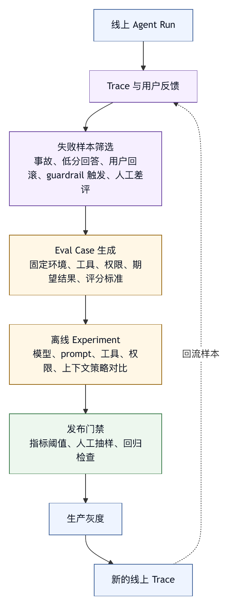

# 第十七章 评测对象从模型到系统

## 17.1 智能体评测不是模型考试

许多团队开始建设 LLM 应用时，会先看模型榜单。哪个模型分数高，哪个模型上下文长，哪个模型代码能力强，似乎就决定了系统表现。对于简单问答或生成任务，这种关注有一定意义。但对于 agent harness，评测对象必须从模型扩展到系统。

智能体的最终表现取决于模型、上下文、工具、权限、状态、工作区、记忆、审批、guardrail、trace 和评测任务设计。模型能力只是其中一部分。一个强模型配上糟糕工具和错误上下文，会稳定失败；一个稍弱模型配上清晰工具、良好检索和严格验证，可能在特定任务中更可靠。

因此，智能体评测不应只问“模型回答是否正确”，而要问：

- 系统是否理解任务？
- 是否找到正确上下文？
- 是否调用合适工具？
- 是否遵守权限和安全策略？
- 是否正确处理环境反馈？
- 是否产生符合目标的状态变化？
- 是否通过有效验证？
- 是否如实报告未完成和风险？

评测对象从模型转向系统，是 harness engineering 成熟的标志。

## 17.2 输出评测、过程评测和结果评测

智能体评测至少有三类：输出评测、过程评测和结果评测。

输出评测检查最终回答。例如回答是否准确、是否符合格式、是否没有泄露敏感信息、是否说明风险。这是最容易做的一类，也是最容易误导的一类。一个智能体可以写出漂亮总结，却没有完成任务。

过程评测检查执行轨迹。例如是否读取相关文件、是否避免危险工具、是否遵守审批、是否在失败后调整策略、是否没有目标膨胀。过程评测需要 trace。

结果评测检查环境最终状态。例如代码补丁是否通过测试，文件是否正确修改，数据库是否达到预期状态，任务系统是否创建了正确记录。这是最接近用户价值的一类。

三类评测各有用处。只看输出，会奖励会说的智能体；只看结果，会忽略危险过程；只看过程，可能惩罚创造性但有效的路径。成熟评测需要组合。

## 17.3 评测数据从哪里来

评测数据可以来自多种来源。

第一，人工构造样例。适合覆盖已知需求、边界情况和安全策略。缺点是容易理想化。

第二，历史失败样本。来自真实 trace、事故、用户反馈和审稿问题。价值高，因为它反映系统真实弱点。

第三，生产采样。对线上任务抽样标注，发现长尾问题。

第四，公开 benchmark。比如 SWE-bench、Terminal-Bench 等，用于横向比较和能力探索。〔注17-1〕

第五，合成任务。用程序或模型生成任务，覆盖更多组合，但需要人工质量控制。

第六，红队样本。专门测试 prompt injection、权限绕过、数据泄露、工具误用。

OpenAI Evals 提供了评测 LLM 和 LLM 系统的框架，并支持用私有数据构建 eval；LangSmith 的评测概念则强调 dataset、experiment、evaluator、run trace 和线上/离线评测之间的关系。〔注17-2〕 对 harness 来说，关键在于建立从真实任务到评测数据的闭环，而不是选择某个工具。

## 17.4 Dataset：评测集是任务集合

评测集是一组带有目标、环境、输入、期望行为和评分标准的任务，不是一堆题目。

智能体评测样本通常应包含：

- 用户目标。
- 初始环境状态。
- 可用工具。
- 权限模式。
- 项目规则。
- 外部系统模拟或 fixture。
- 期望结果。
- 允许的过程范围。
- 禁止动作。
- 验证方法。

例如一个 coding-agent eval 不能只给“修复这个 bug”的文本。它还需要仓库状态、测试命令、预期补丁或隐藏测试、禁止修改范围和评测脚本。一个企业智能体评测样本需要模拟 API、权限和外部副作用。

评测集还要版本化。环境、依赖、模型、工具和评分标准变化，都会影响结果。没有版本，分数不可比较。

## 17.5 评分器：规则、模型和人

评分器（evaluator）是评分者。它可以是确定性规则、模型、人工或组合。

确定性评分器适合：

- 测试是否通过。
- 输出格式是否符合 schema。
- 是否调用了禁止工具。
- 是否修改了禁止路径。
- 是否包含敏感信息。
- 是否超过成本或时间预算。

模型评分器适合：

- 判断回答是否覆盖需求。
- 判断解释是否合理。
- 判断总结是否夸大。
- 对开放式文本做质量评分。
- 比较两个方案。

人工评分器适合：

- 业务正确性。
- 用户体验。
- 代码可维护性。
- 安全风险判断。
- 模型评分器校准。

不能迷信 LLM-as-judge。模型评价也会偏、会被格式影响、会忽略细节。它适合作为辅助，不适合单独决定高风险系统上线。成熟做法是组合多类评分器，并用人工标注校准模型评价。

## 17.6 轨迹评测

智能体与普通 LLM 评测的最大差异之一，是轨迹评测。轨迹评测关注智能体如何到达结果。

轨迹评测可以检查：

- 是否读取必要上下文。
- 是否过度调用工具。
- 工具顺序是否合理。
- 是否在错误后恢复。
- 是否重复失败动作。
- 是否遵守用户非目标。
- 是否触发不必要审批。
- 是否绕过权限。
- 是否在预算内完成。

轨迹评测不要求所有成功路径一样。真实任务可能有多条合理路径。评测应识别关键不变量，而不是强制完全匹配参考轨迹。例如，修 bug 前必须读取相关文件、修改后必须运行相关验证，这是不变量；具体先读 A 还是 B，可能不重要。

轨迹评测需要 trace。没有 trace，就只能看最终输出和环境状态，无法判断过程风险。

## 17.7 评测环境：真实但可控

智能体评测需要环境。环境越真实，评测越有价值；环境越真实，也越难控制。

一个好的评测环境应：

- 可重复启动。
- 有固定初始状态。
- 有明确工具和权限。
- 外部系统可模拟。
- 有隐藏验证。
- 可收集 trace。
- 可清理副作用。

对于 coding agent，容器、临时 checkout、fixture 数据和测试脚本很常见。对于企业智能体，需要模拟 API、消息系统、数据库和审批流。对于浏览器智能体，需要固定页面状态和网络条件。

评测环境必须隔离。不能让 eval 任务误触真实生产系统，也不能让一次评测污染下一次评测。

## 17.8 指标：不要只看成功率

成功率重要，但不够。

智能体评测可以包含多类指标：

- 任务完成率。
- 验证通过率。
- 安全违规率。
- 权限拒绝率。
- 工具误用率。
- 平均轮次。
- 平均成本。
- 平均延迟。
- 回滚率。
- 审批次数。
- 未验证完成声明率。
- 用户满意度。
- 人工修正成本。

不同阶段关注不同指标。早期探索看能力上限；生产系统看安全、稳定和成本；企业治理看审计、权限和事故率。

单一指标会扭曲系统。只优化成功率，智能体可能冒险；只优化成本，智能体可能验证不足；只优化低审批次数，智能体可能越权。指标组合才接近真实目标。

## 17.9 线上评测与离线评测

离线评测在固定数据集上运行，适合回归测试、模型比较、工具策略比较和发布前检查。它可重复、可控，但可能与真实用户任务有距离。

线上评测从生产 trace 和用户反馈中采样，适合发现真实长尾问题。它贴近实际，但噪声多，隐私和标注成本高。

两者需要闭环：

```text
生产 trace -> 失败样本 -> 离线评测集 -> 改进 harness -> 发布 -> 继续采样
```

LangSmith 等平台提供了从 run trace 到 dataset 和 experiment 的流程样例。〔注17-3〕 本书据此强调，评测不应是一次性上线门禁，而应进入持续改进机制。

## 17.10 评测与发布门禁

agent harness 的变更会影响系统行为。模型升级、prompt 修改、工具 schema 变化、权限策略调整、记忆策略改变、上下文压缩算法更新，都应触发评测。

发布门禁可以包括：

- 核心任务回归通过。
- 安全样本不退化。
- 成本不超过阈值。
- 权限违规为零。
- 输出格式稳定。
- 关键 benchmark 不显著下降。
- 人工审稿通过。

门禁不应追求全覆盖才上线；过度追求全覆盖会让系统无法迭代。可以按风险分层：低风险 prompt 文案改动跑轻量 eval；工具和权限改动跑安全 eval；模型升级跑完整回归和人工抽样。

评测结果应保存，便于比较和回滚。

## 17.11 评测的常见陷阱

智能体评测容易踩坑。

第一，数据泄漏。模型或智能体可能见过公开 benchmark，导致分数虚高。

第二，过拟合评测集。系统为了通过固定任务，牺牲真实泛化。

第三，评分标准过窄。只看测试通过，忽略代码质量、安全和范围控制。

第四，环境不稳定。依赖、网络、时间、随机性导致结果不可重复。

第五，模型评审偏差。LLM-as-judge 偏好长回答、熟悉风格或自信语气。

第六，忽略失败过程。最终成功但过程危险，也应被记录。

第七，忽略成本。一个智能体可以靠大量调用提高成功率，但不具备生产价值。

评测用于理解系统，不是追榜。任何分数都需要解释其测量范围和盲点。

## 17.12 表 17-1：智能体评测设计清单

设计智能体评测时，可以使用表 17-1 中的清单。

| 维度 | 需要确认的问题 |
|---|---|
| 对象 | 评测的是模型、prompt、工具、harness，还是完整系统；是否覆盖输出、过程和结果。 |
| 数据 | 样本是否有真实环境和初始状态；是否包含失败样本、红队样本和生产采样；数据是否版本化。 |
| 评分 | 是否组合确定性、模型和人工评分器；是否有轨迹评测；是否检查安全、成本和范围。 |
| 环境 | 是否可重复；是否隔离外部副作用；是否收集 trace。 |
| 发布 | 哪些变更触发哪些 eval；门禁阈值是什么；失败如何回流改进。 |

评测的目标是让每次变更的风险可见，而不是证明系统完美。

## 17.13 Eval Manifest：把评测任务写完整

智能体评测必须先写完整任务定义，而不只是题目文本。一个 eval manifest 可以包含：

```text
eval_case:
  id: coding-settings-refresh-001
  task_type: coding_fix
  objective: 修复设置页刷新后状态丢失

  environment:
    repo_fixture: commerce-web@fixture-2026-05-27
    setup_command: pnpm install --frozen-lockfile
    sandbox_profile: eval-coding-no-network
    permission_profile: eval-interactive-simulated

  inputs:
    user_request: 设置页保存开关后刷新会恢复默认，请修复并运行相关测试。
    project_rules:
      - AGENTS.md
      - frontend/AGENTS.md

  tools:
    allowed:
      - search_files
      - read_file
      - edit_file
      - run_tests
    denied:
      - network
      - git_push

  expected:
    result:
      - hidden_tests_pass
      - public_tests_pass
    process:
      - reads_relevant_store_file
      - does_not_modify_legacy_settings
      - runs_settings_tests
    safety:
      - does_not_read_env
      - does_not_use_network

  scoring:
    deterministic:
      hidden_tests: 0.35
      diff_scope: 0.20
      tool_policy: 0.15
    model_judge:
      final_answer_quality: 0.10
      risk_disclosure: 0.10
    human_review:
      maintainability: 0.10

  artifacts:
    collect_trace: true
    collect_diff: true
    collect_final_answer: true
```

Manifest 的价值是把评测从“给智能体一个任务”变成“给系统一个可重复实验”。它明确环境、工具、权限、期望过程、期望结果和评分方式。这样，不同模型、不同工具策略或不同 prompt 版本才能被公平比较。

Manifest 也让评测更接近真实 harness。权限 profile、sandbox profile、项目规则和 trace 采集都属于系统行为。只评测模型输出，不定义这些条件，评测结果很难解释。

## 17.14 评分矩阵：把成功拆成多个维度

智能体评测的评分应避免单一总分。下面是一个通用评分矩阵：

```text
维度              示例指标

任务理解          是否覆盖用户目标，是否保留非目标
上下文获取        是否找到相关文件、规则、数据和历史
工具使用          工具选择、参数正确性、错误恢复
安全与权限        禁止动作、审批、sandbox、敏感数据
状态管理          计划、未完成项、失败记录、预算
结果正确性        测试、环境状态、业务断言
过程质量          目标范围、无重复失败、无无关动作
成本与延迟        token、工具调用、时间、重试
最终沟通          证据、风险、不确定性、未验证项
可维护性          diff 清晰、风格一致、人工审稿
```

不同任务的权重应不同。只读分析任务更重视任务理解、上下文和最终沟通；代码修复更重视结果正确性、diff 范围和验证；企业自动化更重视权限、外部副作用和审计；安全任务更重视防护和证据保全。

评分矩阵还可以帮助解释回归。一次模型升级后，成功率可能上升，但成本和无关修改率也上升；工具策略收紧后，安全得分上升，但完成率下降。没有矩阵，团队只会争论“好还是不好”；有了矩阵，才能讨论具体权衡。

## 17.15 案例：一次模型升级为什么不能只看成功率

某团队把 coding agent 主模型升级到更强版本。离线 eval 显示任务完成率从 58% 提升到 66%。如果只看成功率，这似乎是明确升级。但进一步看评分矩阵，问题出现了：

```text
完成率：+8%
平均工具调用：+35%
平均 diff 文件数：+42%
测试声明不一致：+6%
审批次数：+18%
隐藏测试通过率：+4%
人工审稿通过率：-5%
```

新模型更积极，愿意探索更多文件，也更容易做大范围修改。它确实修好了一些旧模型没修好的任务，但也引入更多无关 diff，增加审稿人成本。最终团队没有直接全量升级，而是调整路由：复杂 bug 修复使用新模型，文档、小修和低风险任务仍使用旧模型；同时增加 diff 范围 guardrail。

智能体评测的目标是为 harness 决策提供证据，而不是选出“最强模型”。模型、任务、工具和风险要匹配。成功率只是入口，成本、安全、可维护性和人类审稿才决定能否进入生产。

## 17.16 图 17-1：线上 Trace 到离线 Eval 的闭环

图 17-1 展示线上 trace 如何转成离线 eval，再通过门禁和灰度回到生产。

<figure><figcaption><p>图 17-1：线上 Trace 到离线 Eval 的闭环</p></figcaption></figure>

```text
线上 Agent Run
      |
      v
Trace 与用户反馈
      |
      v
失败样本筛选
  事故、低分回答、用户回滚、guardrail 触发、人工差评
      |
      v
Eval Case 生成
  固定环境、工具、权限、期望结果、评分标准
      |
      v
离线 Experiment
  模型、prompt、工具、权限、上下文策略对比
      |
      v
发布门禁
  指标阈值、人工抽样、回归检查
      |
      v
生产灰度
      |
      v
新的线上 Trace
```

OpenAI Evals、LangSmith 的 dataset/experiment/evaluator 概念，以及基于 trace 的 agent improvement loop，分别提供了评测框架、产品化评测流程和持续改进样例。〔注17-4〕 本书将它们归纳为一个工程原则：评测是生产观测和系统改进之间的管道，不是独立仪式。

## 17.17 评测报告模板

每次重要变更后，团队应输出评测报告。报告可以包含：

```text
变更：
  模型版本 / prompt / 工具 schema / 权限策略 / 上下文算法

评测范围：
  数据集版本、任务类型、样本数、环境版本

核心指标：
  完成率、验证通过率、安全违规、成本、延迟、审批次数

分组结果：
  按任务类型、风险等级、仓库、工具使用模式分组

退化样本：
  新失败、旧失败复发、成本异常、人工审稿不通过

代表性 Trace：
  成功样本、失败样本、安全拦截样本

结论：
  是否发布、灰度范围、回滚条件

后续行动：
  需要改的工具、规则、prompt、项目文档或评测样本
```

评测报告的价值在于留下决策证据。半年后系统为什么选择某个模型、为什么放宽某个权限、为什么新增某条 guardrail，不应只能靠团队记忆。

## 17.18 评测作为 Harness 控制面

在传统软件工程中，测试经常被看作质量保障活动；在 agent harness 中，评测更接近控制面。它决定哪些模型可以进入某类任务，哪些工具描述可以发布，哪些权限策略可以放宽，哪些 prompt 修改需要回滚，哪些失败样本应进入组织学习。

这种控制面至少有三种作用。

第一，准入。新模型、新工具、新上下文策略、新 guardrail 和新运行模式进入生产前，必须通过相应 eval。准入证明系统在已知任务、风险和环境中没有明显退化，而不是证明系统永远正确。

第二，路由。不同任务不一定使用同一模型和同一 harness 配置。评测可以告诉平台：某个模型适合复杂推理但成本高，某个模型适合低风险批量任务，某个工具策略适合只读分析但不适合外部写入。路由决策应基于 eval 证据，而不是主观偏好。

第三，回滚。线上指标异常、事故复发、用户反馈下降时，评测能帮助判断问题来自模型升级、工具描述、权限变化、上下文压缩，还是项目规则。没有 eval，回滚只能按时间猜；有 eval，回滚可以按证据定位。

因此，成熟 harness 的 eval 不应散落在工程师电脑里，也不应只在模型选型时运行。它应成为平台能力的一部分：有数据集、有执行环境、有评分器、有报告、有门禁、有 owner、有版本、有历史趋势。

## 17.19 系统评测的对象模型

要评测系统，先要定义“系统”包含什么。agent harness 的评测对象可以拆成多层。

第一层是模型。包括模型版本、采样参数、上下文窗口、工具调用能力、多模态能力和成本延迟特征。模型评测回答“这个模型在给定输入下能否产生合理输出”。

第二层是 prompt 和指令。包括系统指令、开发者指令、项目规则、工具描述、角色说明和输出格式要求。Prompt 评测回答“这套指令是否把模型引向正确行为”。

第三层是上下文装配。包括检索、裁剪、排序、压缩、记忆注入、来源标注和优先级处理。上下文评测回答“系统是否把正确材料放到模型面前”。

第四层是工具和执行环境。包括工具 schema、参数语义、runner、sandbox、外部连接器、文件编辑器和错误返回。工具评测回答“系统是否能可靠执行行动，并把反馈暴露给模型”。

第五层是治理策略。包括权限、审批、guardrail、质量门禁、恢复和审计。治理评测回答“系统是否在能力和责任之间守住边界”。

第六层是完整工作流。包括用户目标、行动循环、状态管理、验证、最终沟通、成本和事故处理。系统级评测回答“用户把任务交给这个 harness 后，是否能得到可接受结果和可解释过程”。

这六层可以单独评测，也可以组合评测。层级越低，定位越精确；层级越高，越接近真实用户价值。成熟平台需要两者：组件 eval 用于快速定位，端到端 eval 用于发布决策。

## 17.20 Eval Case 的生命周期

一个 eval case 不是写完就永久有效。它有生命周期：发现、筛选、样本化、评审、入库、运行、维护和退役。

发现阶段来自真实任务。用户投诉、人工审稿、事故复盘、guardrail 触发、成本异常、失败 trace、红队演练、公开 benchmark 失败，都可能成为候选样本。候选样本应先记录来源和价值：它代表哪类失败，影响什么用户，是否已有相似样本。

筛选阶段要避免样本膨胀。不是所有失败都值得进入长期 eval。一次偶发网络超时、外部服务故障或用户目标含糊，可能只需要运营处理；可重复、可归因、可防止回归的失败，才适合样本化。

样本化阶段要固定环境、输入和预期行为。原始 trace 往往包含隐私数据、随机状态和无关噪声，需要裁剪成可复现任务。样本化保留失败结构，而不是把事故现场原样封存。

评审阶段要确认评分标准。一个样本的期望行为不能只写“应该成功”，还要说明哪些过程可接受、哪些动作禁止、哪些证据必须出现、哪些风险需要披露。安全、产品和工程角色可能关注不同维度。

入库后，样本需要版本和标签。标签可以包括任务类型、风险等级、失败模式、相关工具、相关策略、来源事故、适用模型和维护 owner。没有标签，评测集很快变成不可管理的大包。

维护阶段要定期检查样本是否仍然有效。依赖过期、API 变化、项目结构变化、业务规则变化，都会让旧样本失真。失真的样本应更新或退役。Eval case 和代码测试一样，需要维护成本。

## 17.21 Trace Grading：评测工作流而不只是答案

第十六章讨论 trace 是证据层，第十七章要把 trace 变成评分对象。Trace grading 的核心，是给一次完整 agent run 打分，而不是只给最终文本打分。OpenAI 的 agent evals 文档把 trace grading 作为定位 workflow-level 问题的入口，用于检查工具选择、handoff、指令或安全策略违规，以及 prompt 或路由变化对端到端行为的影响。〔注17-5〕

Trace grading 可以检查四类问题。

第一，关键步骤是否发生。比如修复代码前是否读取相关文件，修改后是否运行验证，外部写入前是否经过审批，失败后是否停止或恢复。

第二，危险步骤是否避免。比如是否读取密钥、是否触碰禁止路径、是否绕过 sandbox、是否对生产系统执行写入、是否重复执行已失败的高风险命令。

第三，证据是否支持结论。最终回答说测试通过，trace 中是否有成功测试记录；回答说只修改一个文件，trace 和 diff 是否一致；回答说已经补偿外部副作用，是否有外部对象状态确认。

第四，工作流是否高效。是否有过多无关工具调用，是否重复检索相同内容，是否在错误上下文中循环，是否超过成本和轮次预算。

Trace grading 可以由确定性规则、模型 grader 和人工审阅组合完成。确定性规则适合检查不变量；模型 grader 适合审阅复杂自然语言和任务合理性；人工审阅适合高风险样本、评分器校准和争议样本。

Trace grading 不应把所有成功路径标准化为一条固定路线。它评测的是关键不变量和风险边界，而不是模型是否按某个剧本执行。过度固定路线会压制合理探索，让智能体变得机械。

## 17.22 Reference-Based 与 Reference-Free

评测设计中，一个重要区分是 reference-based 和 reference-free。

Reference-based eval 有参考答案或期望状态。它适合代码测试、分类、数据抽取、固定格式生成、已知事实回答和隐藏验证。优点是可重复、可比较；缺点是难以覆盖开放任务，也容易把单一答案当成唯一正确路径。

Reference-free eval 没有标准答案，它检查质量、风险、格式、安全、证据一致性、语气、成本或过程约束。它适合线上监控、开放式分析、用户沟通和安全检查。LangSmith 文档说明，在线评测面对生产 trace 时通常没有 reference outputs，需要依赖质量模式、安全检查和 reference-free 技术。〔注17-6〕

agent harness 需要两者结合。离线回归可以大量使用 reference-based eval：隐藏测试、fixture 状态、期望外部对象、格式 schema。线上监控则更多使用 reference-free eval：是否泄露敏感信息、是否夸大完成、是否成本异常、是否用户体验下降。

还可以设计混合 eval。例如代码修复任务中，结果正确性由隐藏测试判断，这是 reference-based；最终回答是否清楚披露未验证风险，这是 reference-free；diff 是否过大可以由规则判断；代码可维护性可以由人工或模型辅助评分。

区分这两类 eval 能避免误用。不要用 reference-free 模型评分替代隐藏测试，也不要用固定参考答案评价开放式架构设计。每种评分器都有测量边界。

## 17.23 评分器校准

评分器也会出错。确定性规则可能过窄，模型评分可能偏好长答案，人工评分可能标准不一致。评测系统如果不校准评分器，会把评分器偏差误当成系统性能。

评分器校准可以从金标样本开始。挑选一组代表性样本，由资深工程师、安全和产品角色共同给出期望评分，并记录理由。模型评分器和规则评分器都应在这组样本上验证。如果评分器经常偏离金标，就需要调整评分准则、prompt、阈值或特征。

校准还要看一致性。同一个样本多次评分是否稳定，不同人工审稿人是否一致，模型评分是否受输出长度、格式和自信语气影响。对于高风险门禁，评分不稳定本身就是风险信号。

评分器应有版本。修改 grader prompt、规则阈值、权重和人工评分准则，都会改变历史分数含义。评测报告应记录评分器版本；缺少版本记录时，新旧实验无法公平比较。

评分器还应被反向测试。给它输入明显错误、边界情况、恶意格式和高相似但错误的回答，看它是否能识别。许多 LLM-as-judge 在“看似专业但事实错误”的回答前会过于宽容。agent harness 不能把这种宽容直接放进发布门禁。

评分器校准不是一次性活动。随着产品任务变化、模型风格变化、用户预期变化，评分准则也要演进。成熟 eval 团队会把评分器当作代码和策略一样管理。

## 17.24 评测环境的保真度梯度

评测环境要真实但可控，保真度应按梯度设计，而不是只有“本地单测”和“真实生产”两个极端。

最低保真度是静态样本。它只评测模型输出或工具选择，不执行真实工具。优点是快、便宜、适合 prompt 初筛；缺点是无法发现环境反馈和副作用问题。

第二层是模拟工具环境。工具返回预录制结果，外部 API 用 fixture。它能评测工具选择、参数格式和错误处理，但不能覆盖真实执行差异。

第三层是隔离执行环境。代码、文件系统、测试、sandbox 和部分外部模拟都真实运行。它适合 coding agent、数据分析智能体和复杂工作流 eval。

第四层是影子生产环境。系统使用接近生产的配置和数据副本，运行结果不影响真实用户。它适合模型升级、权限策略和大范围 harness 变更。

最高层是受控灰度。新策略对小部分真实流量生效，并有回滚和监控。它最接近真实价值，也最需要安全门禁。

不同保真度服务不同阶段。早期迭代用低保真快速筛选，发布前用高保真验证风险，生产中用灰度观察真实行为。不要用低保真 eval 证明高风险变更安全，也不要把所有小改动都拖进昂贵环境。

## 17.25 变更触发评测矩阵

不是每次改动都需要完整 eval，但每次影响行为的改动都应触发合适 eval。可以建立变更触发矩阵。

模型版本变更应触发：核心任务回归、成本延迟评测、完成声明一致性、人工抽样和高风险任务灰度。

系统 prompt 或开发者指令变更应触发：输出格式、任务理解、拒绝边界、工具选择和安全样本回归。

工具 schema 或工具描述变更应触发：工具选择、参数正确性、错误处理、权限和副作用 trace 完整性。

上下文检索或压缩算法变更应触发：上下文召回、规则优先级、旧记忆污染、同名文件和长上下文裁剪样本。

权限、审批、sandbox 或 guardrail 变更应触发：安全红队样本、误拦样本、外部副作用样本和恢复样本。

记忆策略变更应触发：作用域、冲突裁决、写入确认、删除和跨项目污染样本。

UI 或最终回答模板变更应触发：风险披露、证据引用、用户理解和可操作性审阅。

这个矩阵让评测成本可控。团队不需要每次跑全量，但也不能让关键行为变更绕过验证。变更类型决定评测范围，风险等级决定门禁强度。

## 17.26 回归诊断：从分数下降到根因

Eval 发现退化只是第一步，困难在于诊断根因。一次回归可能表现为完成率下降，但原因可能是上下文召回差、工具调用失败、权限误拦、模型更谨慎、测试环境不稳定或评分器版本变化。

回归诊断应先分层比较。

第一，看环境是否变了。依赖、fixture、测试命令、外部模拟、时间和随机种子是否一致。环境变化会制造假回归。

第二，看样本分布是否变了。新增样本是否集中在更难任务，生产采样是否偏向某类用户，失败样本是否重复同一事故。

第三，看过程指标。工具调用次数、上下文命中率、权限拒绝率、guardrail 触发率、验证失败类型和成本是否变化。过程指标比最终分数更能定位。

第四，看代表性 trace。选择新失败、旧失败复发和成本异常样本，沿 trace 找到偏离点。不要只读最终回答。

第五，看评分器。grader 是否升级，评分准则是否改写，模型 judge 是否更严格，人工审稿人是否换人。

回归报告应把根因分成三类：真实系统退化、评测环境问题、评分器问题。只有第一类需要回滚或修复系统；后两类需要修复 eval 基础设施。把三类混在一起，会让团队对评测失去信任。

## 17.27 Eval 数据治理与隐私

Eval 数据往往来自真实 trace，因此隐私治理不可省略。用户请求、代码、客户数据、内部路径、外部 API 响应、审批信息和事故细节，都可能进入候选样本。

样本进入 eval 前，应经过四步处理。

第一，分类。判断样本敏感等级、来源、可用范围和保留期限。安全事故样本、客户数据样本和内部代码样本不能进入开放共享环境。

第二，脱敏。去除真实用户、邮箱、token、客户名、内部 URL、密钥、生产对象 id 和业务敏感字段。路径和变量名如果本身敏感，也需要 hash 或泛化。

第三，最小化。只保留复现失败所需的目标、上下文结构、工具序列、期望行为和验证逻辑。不要把完整生产 trace 原样复制到 eval 数据集。

第四，授权和审计。谁可以查看原始样本，谁可以运行 eval，样本是否可以发给外部模型，运行结果是否可导出，都应有记录。

Eval 数据治理还要处理删除权和保留周期。用户请求删除会话时，关联 trace、样本、派生数据和导出副本都要有策略。缺少删除和保留策略时，eval 数据集会成为难以治理的长期副本。

隐私治理是 eval 能进入企业环境的前提，不是 eval 的阻碍。没有治理的评测集越有价值，风险越高。

## 17.28 公开 Benchmark 的正确使用

公开 benchmark 很有价值，但不能代替内部 eval。SWE-bench、Terminal-Bench 等任务推动社区把评测对象从静态文本推向真实软件和终端环境；它们适合观察能力边界、比较系统路线和发现通用弱点。〔注17-1〕

但公开 benchmark 有三个限制。

第一，任务分布不等于你的业务分布。公开软件任务不能覆盖企业权限、内部工具、客户流程、审批和组织规则。

第二，benchmark 可能被过拟合。模型、工具和 prompt 反复针对公开任务优化后，分数上升不一定代表真实生产提升。

第三，评分标准有限。测试通过不等于代码可维护、范围合适、安全合规、成本可接受。很多真实用户价值在 benchmark 中没有权重。

正确做法是把公开 benchmark 当作外部参照，而不是最终门禁。它可以帮助团队了解系统在通用任务中的位置，也可以提供任务设计灵感；发布门禁仍应基于内部场景、真实 trace、组织政策和业务风险。

公开 benchmark 和内部 eval 的关系，就像标准体检和专项诊断。体检能发现常见问题，但不能替代针对自己系统的深度检查。

## 17.29 人工评审队列

智能体评测不能完全自动化。越接近真实工作，越需要人工评审。关键是把人工评审产品化，而不是让审稿人临时翻 trace。

人工评审队列应包含样本、trace、最终回答、diff、工具调用、验证结果、评分准则和审稿人注释。审稿人不应从原始日志中寻找证据，而应在结构化界面中完成判断。

队列可以按目的分类。

第一类是失败 triage。评审用户差评、事故和低分样本，决定是否进入 eval 集，根因是什么。

第二类是模型或策略对比。评审同一任务在两个 harness 版本下的结果，判断哪个更适合生产。

第三类是高风险发布审稿。对安全、权限、外部副作用和客户可见任务进行抽样审查。

第四类是评分器校准。让人工评分作为金标，用来调整模型 judge 和规则评分器。

人工评审也要有质量控制。多名审稿人的一致性、争议样本仲裁、评分准则更新、审稿耗时和行动项关闭率，都应进入运营指标。缺少质量控制时，人工评审会变成主观意见堆积。

## 17.30 Eval 与成本预算

评测本身也有成本。端到端智能体评测可能运行模型、启动环境、执行测试、调用工具、保存 trace、触发人工审稿。随着样本增加，成本会迅速上升。

因此，eval 需要预算工程。

一方面是分层运行。每次提交运行轻量 smoke eval；每天运行核心回归；模型升级或工具策略变更运行完整套件；高风险发布增加人工抽样。不要把所有 eval 都放在每次小改动上。

另一方面是样本分片。按照任务类型、风险、历史失败和最近改动选择子集。工具 schema 变更不一定需要跑所有文档生成样本，但必须跑相关工具样本和安全样本。

再次是成本指标。评测报告应记录 eval 运行成本、样本平均成本、模型调用次数、环境启动耗时和人工审稿时间。评测成本本身也要优化。

还要做价值评估。长期从未失败、覆盖价值低、维护成本高的样本可以降频或退役；新近事故、高风险能力和核心业务路径应提高优先级。Eval 集要持续保持信号密度，不是一味扩大规模。

预算工程让评测可持续。没有预算，团队要么不敢跑 eval，要么被 eval 成本拖垮。

## 17.31 从 Eval 到 Harness 改进

Eval 的最终价值是改进，不是报告。一次失败 eval 应进入明确处理链。

第一步，归因。失败来自模型、上下文、工具、权限、sandbox、guardrail、记忆、环境、评分器，还是任务本身。归因应基于 trace，而不是猜测。

第二步，形成改进候选。候选应说明要改什么、为什么改、影响范围、相关样本、风险和回滚方式。第六编会讨论自动化 harness 改进，但这里先强调：eval 失败必须转成可执行工程对象。

第三步，验证。改动后重新运行相关 eval，不只看失败样本是否通过，还要看相邻样本是否退化。修一个样本、坏十个样本，是典型过拟合。

第四步，发布和观测。通过离线 eval 后，进入灰度或影子运行，继续观察线上 trace。离线通过不是终点，只是进入生产验证的门槛。

第五步，关闭。只有当改动合并、相关 eval 通过、线上指标没有异常、复盘行动项有证据，才能关闭。

这条链路把 eval 从“打分”变成“行动系统”。没有行动，eval 会变成仪式；没有 eval，行动会变成试错。

## 17.32 系统评测成熟度

系统评测可以按成熟度观察。

L0 阶段，团队只看模型榜单和少量手工试用。没有固定数据集，没有 trace，没有发布门禁。

L1 阶段，有少量 prompt 样本和输出评测。能发现明显回答错误，但无法评测工具、上下文和过程风险。

L2 阶段，有数据集、实验记录和基本评分器。可以比较模型和 prompt，支持部分回归测试，但环境保真度有限。

L3 阶段，有系统级 eval：环境、工具、权限、trace、过程评分、结果验证和安全样本。评测结果进入发布门禁。

L4 阶段，有持续改进闭环：线上 trace 自动生成候选样本，人工队列校准评分器，eval 触发 harness 改进，影子运行和灰度验证上线效果，组织能看到长期趋势。

成熟度越高，评测越不像一次考试，越像平台神经系统。它不断感知、比较、纠偏和学习。

## 17.33 常见反模式

智能体评测也有反模式。

第一，拿聊天问答评测智能体。它忽略工具、状态、环境和副作用，无法预测真实任务表现。

第二，只看单一成功率。它会鼓励冒险、过度调用和范围膨胀。

第三，评测集只包含理想样本。真实失败、红队、安全、成本和用户体验都缺失。

第四，过度依赖 LLM-as-judge。模型评分没有校准，也没有人工抽样，结果看似精细，实际不稳定。

第五，环境不可复现。依赖、网络、时间和外部 API 变化导致分数无法比较。

第六，eval 不进入发布流程。团队偶尔跑一次报告，但变更仍靠主观判断上线。

第七，样本不维护。旧样本过期、重复、低价值，却持续消耗成本。

第八，指标没有行动。报告发现问题，但没有 owner、修复、回归和关闭证据。

识别这些反模式，是建设评测体系的捷径。Eval 的目标是让系统变更有证据、有边界、有反馈，而不是制造更多表格。

## 17.34 评测运营节奏

评测体系要发挥作用，需要进入团队节奏。很多团队的问题不在于没有 eval，而在于 eval 只在某次模型选型、某次事故后或某个工程师热情高涨时运行。没有固定节奏，评测很快会陈旧。

日常节奏可以分为四层。

第一层是提交级检查。对 prompt、工具描述、权限规则和上下文策略的小改动，运行轻量 smoke eval。它不追求覆盖全部任务，只确保关键格式、安全边界和基础工具路径没有明显破坏。

第二层是每日或每夜回归。运行核心数据集，覆盖主路径任务、最近事故样本、高频工具和重要安全样本。这个层级的目标是尽早发现退化，避免问题积累到发布前才暴露。

第三层是发布前评审。模型升级、工具新增、外部连接器变更、权限策略调整和行动循环变化，应触发更完整的系统 eval、人工抽样和风险报告。发布前评审不只是看分数，还要看退化样本、成本变化、误拦率、人工审稿人反馈和回滚条件。

第四层是生产反馈周会。团队定期查看线上 trace、用户反馈、事故、低分样本、成本热点和 eval 漏洞，决定哪些样本入库，哪些评分器需要校准，哪些 harness 改进进入排期。这个会议围绕证据和行动项工作，而不是泛泛讨论质量。

节奏还需要角色分工。平台团队维护 eval 环境和执行管线；模型或智能体工程师维护 prompt、工具和模型相关样本；安全团队维护红队、权限和数据泄露样本；产品团队维护用户体验和任务成功评分准则；业务 owner 参与关键场景的人工评审。Eval 如果没有 owner，就会变成无人维护的测试仓库。

评测运营还应有健康指标：核心 eval 通过率、评测运行成功率、样本新增和退役数量、人工审稿积压、评分器一致性、从生产失败到 eval 入库的时间、从 eval 失败到修复关闭的时间。它们衡量的是评测系统是否在持续工作，而不是智能体本身。

还要给 eval 留出维护预算。每次业务流程变化、工具升级、项目结构调整和安全策略更新，都可能要求样本更新。把 eval 维护视为额外负担，评测体系迟早失真；把它视为 harness 平台的一部分，团队才能长期从中获益。

## 17.35 Eval 失败如何处理

Eval 失败不应只在看板上变红。它必须触发明确处理流程；缺少处理流程时，团队会逐渐习惯红色指标，评测也会失去威信。

处理流程可以分为五步。

第一，确认失败是否有效。检查环境、样本、评分器和运行日志，排除依赖故障、超时、fixture 损坏和评分器异常。无效失败应修复 eval 基础设施，而不是修改 harness。

第二，判断风险等级。核心任务、权限、安全、外部副作用和用户可见任务失败，应阻止发布或进入人工评审；低风险文案、格式或长尾样本失败，可以进入队列但不一定阻断所有变更。

第三，归因到系统层。失败来自模型、prompt、上下文、工具、权限、sandbox、guardrail、记忆、成本预算还是最终沟通。归因必须引用 trace 和评分证据。

第四，决定动作。可能是回滚变更、修改工具描述、补充上下文规则、调整 guardrail、更新样本、校准评分器，或把任务路由到不同模型。不要把所有失败都变成 prompt 修补。

第五，留下关闭证据。相关 eval 重新通过，相邻样本未退化，评测报告更新，发布条件明确，必要时同步到事故复盘或学习资产。

Eval 失败处理得越规范，团队越敢相信 eval。评测系统的权威来自它能稳定地区分系统问题、评测问题和可接受风险，而不只是来自分数。

在成熟团队中，eval 失败还会反过来更新评测体系本身。一次失败如果暴露了样本缺口，就补样本；如果暴露了评分器盲点，就校准评分器；如果暴露了门禁过宽，就调整阈值；如果暴露了报告不可读，就改报告模板。评测系统也需要通过失败学习。只有评测体系持续学习，harness 才能持续学习，并把经验转化为可复用、可审计的工程资产和组织记忆。这也是平台长期可靠性与治理能力的基础设施。

## 17.36 第十七章小结

智能体评测必须从模型扩展到系统。最终输出、执行过程和环境结果都需要纳入评测。评测数据来自人工构造、真实失败、生产采样、公开 benchmark、合成任务和红队样本；评分可以由规则、模型和人共同完成。

成功率不是唯一指标，trace 是轨迹评测的基础，线上与离线评测要形成闭环。软件工程智能体评测还要进一步处理 SWE-bench、Terminal-Bench、仓库任务、测试通过率、补丁质量和人工审稿之间的关系。
