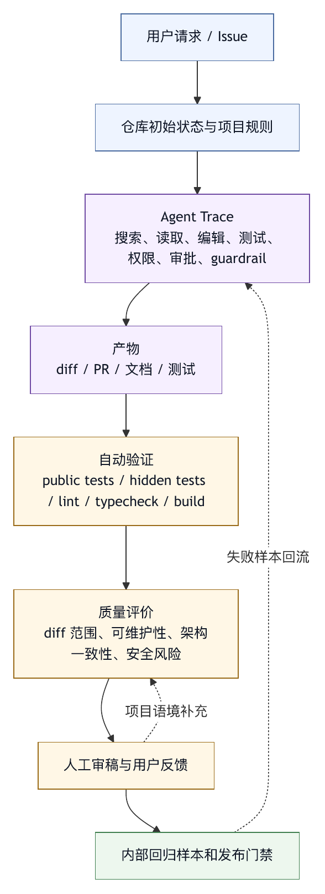

# 第十八章 软件工程智能体评测

## 18.1 软件工程是智能体评测的高压场景

软件工程是智能体最有吸引力、也最容易暴露问题的场景。原因很直接：代码环境复杂，有真实状态，有工具，有测试，有版本控制，有人类审稿，有长期维护成本。一个 coding agent 不能只说得对，还要改得对、验证得对、改得少、可审、可回滚、可维护。

这使软件工程成为 agent harness 的高压评测场景。它会同时考验模型理解、上下文检索、工具使用、工作区治理、权限、安全、trace、评测和产品交互。

一个会写代码片段的模型，不一定能修复真实仓库问题。真实仓库有依赖、风格、历史、隐藏测试、跨文件影响、旧代码约束和用户未提交修改。评测如果只看生成代码是否“看起来合理”，就无法反映 coding agent 的实际价值。

因此，软件工程智能体评测必须围绕真实任务和真实证据展开。

## 18.2 从代码补全到仓库任务

早期代码模型评测常关注代码补全、函数生成或算法题。这些任务有清晰输入和输出，适合测量局部代码能力。但 coding agent 面对的是仓库任务。

仓库任务通常包含：

- 问题描述。
- 代码库。
- 现有测试。
- 项目规则。
- 依赖环境。
- 文件搜索。
- 多文件修改。
- 测试运行。
- 版本控制 diff。
- 人工审稿。

这与单函数生成完全不同。模型需要先找到相关上下文，再决定修改位置，最后通过验证证明修复有效。很多失败来自找错文件、误解需求、过度修改、漏跑测试或破坏风格，并不表现为代码语法错误。

评测也要随之变化。从“生成结果是否匹配答案”，变成“系统是否在仓库环境中完成任务”。

## 18.3 SWE-bench 的价值与边界

SWE-bench 把真实 GitHub issue 和对应 pull request 转化为软件工程评测任务，要求系统基于 issue 和代码库生成补丁，并用测试验证。〔注18-1〕 它的重要贡献在于把评测从静态代码题推向真实仓库维护任务。

SWE-bench 的价值包括：

- 使用真实 issue。
- 需要理解大型代码库。
- 以补丁作为结果。
- 用测试验证任务完成。
- 适合比较 coding agent 的整体能力。

但它也有边界。

第一，测试通过不等于代码质量全面合格。补丁可能可通过隐藏测试，但风格、可维护性、兼容性仍需人工审稿。

第二，benchmark 任务与企业内部任务不同。内部代码、权限、业务约束、部署流程、审计要求和用户偏好不会被公开 benchmark 覆盖。

第三，数据泄漏和过拟合风险存在。公开 benchmark 被广泛使用后，分数需要谨慎解释。

第四，SWE-bench 更关注补丁结果，对过程安全、权限、成本、审批和回滚关注较少。

因此，SWE-bench 是重要信号，但不是完整评测体系。企业 harness 应把它作为外部参考，而不是唯一门禁。

## 18.4 Terminal-Bench 的补充价值

Terminal-Bench 2.0 将智能体放入命令行环境，评测其完成困难、现实感终端任务的能力。〔注18-2〕 这补充了 SWE-bench 的一个重要盲点：很多软件工程任务不是只生成补丁，还需要操作终端、处理文件、运行命令、管理环境。

Terminal-Bench 类任务能覆盖：

- shell 操作。
- 文件系统状态。
- 长程命令序列。
- 数据处理。
- 构建和测试。
- 环境调试。
- 非代码补丁类任务。

这对 harness 很重要，因为 shell 和工作区是 coding agent 最常用、也最危险的能力。一个智能体能生成补丁，不代表它能稳定运行命令；能运行命令，不代表它能处理输出、超时和状态变化。

Terminal-Bench 也有边界。终端任务可能更强调操作能力，而不完全覆盖长期代码维护质量；不同 harness 的工具集和环境差异也会影响结果。评测者需要理解它测量的是哪部分能力。

## 18.5 隐藏测试与公开测试

软件工程评测常用测试作为判定标准。测试有两类：公开测试和隐藏测试。

公开测试是智能体可访问并运行的测试。它帮助智能体理解问题、验证修改、定位失败。隐藏测试是评测系统保留的测试，用于判断补丁是否满足需求，防止智能体只针对公开测试过拟合。

两者都必要。没有公开测试，智能体很难验证；没有隐藏测试，智能体可能写出只通过已知测试的脆弱补丁。

但隐藏测试也不能代表全部质量。某些需求难以测试，某些边界未覆盖，某些代码风格和架构一致性需要人工审查。因此，测试应与 diff 审查、静态检查、类型检查和人工评审结合。

## 18.6 补丁质量

补丁通过测试只是第一步。软件工程智能体还要关注补丁质量。

补丁质量包括：

- 修改范围是否最小。
- 是否符合项目风格。
- 是否避免无关重构。
- 是否处理错误路径。
- 是否保持兼容性。
- 是否易读。
- 是否有适当测试。
- 是否没有引入安全风险。
- 是否没有隐藏外部副作用。

评测补丁质量很难完全自动化。可以用规则检查 diff 大小、文件范围、lint、类型检查和测试覆盖；也可以用模型或人工审稿判断可维护性。高风险系统需要人工审稿。

智能体最容易犯的错误之一是过度修改。它可能为了通过测试改动大量无关代码，或者重构未要求模块。评测应惩罚目标膨胀，而不是只看最终测试。

## 18.7 工具轨迹与补丁结果要一起看

一个补丁可能通过测试，但过程危险。例如智能体读取了敏感文件、执行了未经批准的 shell 命令、绕过了测试、修改了用户未授权目录。反过来，一个智能体过程谨慎但最终未完成，也提供了改进信号。

因此，软件工程评测应同时看：

- 补丁结果。
- 工具轨迹。
- 工作区 diff。
- 测试和诊断。
- 权限事件。
- 成本和轮次。
- 最终总结。

轨迹评测可以发现隐藏问题。例如智能体是否先读相关文件再改，是否重复运行失败命令，是否在测试失败后分析原因，是否在最终回答中诚实说明未验证项。

没有轨迹评测，评测会偏向“最后侥幸成功”的系统。

## 18.8 仓库任务的 Fixture 设计

内部 coding-agent eval 应构造可重复仓库任务。一个任务 fixture 通常包括：

- 初始仓库版本。
- issue 或用户请求。
- 允许工具和权限模式。
- setup 命令。
- 公开测试。
- 隐藏测试。
- 禁止修改范围。
- 评分脚本。
- 期望风险说明。

为了可重复，fixture 应避免依赖实时网络和不稳定外部服务。依赖应固定，时间应可控，随机性应设置 seed。需要外部 API 时，使用 mock 或录制响应。

Fixture 还应覆盖不同任务类型：bug fix、功能小改、测试修复、文档更新、类型错误、依赖升级、配置修复、性能问题、安全修复。

不要只评测最适合智能体的任务。真实系统需要知道边界：哪些任务适合智能体，哪些任务应只做分析，哪些任务需要人工主导。

## 18.9 人工审稿的角色

软件工程评测不能完全去掉人。人工审稿可以判断：

- 需求是否满足。
- 代码是否可维护。
- 是否符合团队架构。
- 是否有隐藏业务风险。
- 总结是否诚实。
- 是否适合合并。

人工审稿成本高，因此应与自动评测结合。自动评测筛掉明显失败，人工审稿关注高价值样本。人工审稿结果还可以训练或校准模型评分器。

对于企业智能体，人工审稿也是组织信任机制。智能体可以生成 PR，但审稿人仍要承担代码质量责任。Harness 应提供足够 trace 和 diff 帮助审稿人，而不是只交付补丁。

## 18.10 评测指标组合

软件工程智能体可以使用以下指标组合：

- Issue 解决率。
- 公开测试通过率。
- 隐藏测试通过率。
- lint/typecheck/build 通过率。
- 平均文件修改数。
- 平均 diff 大小。
- 无关修改率。
- 工具调用次数。
- 重试次数。
- 成本。
- 时间。
- 权限违规率。
- 人工审稿通过率。
- 回滚率。
- 未验证完成声明率。

指标之间有张力。更高成功率可能伴随更大 diff 和更高成本；更低成本可能伴随验证不足；更少审批可能伴随更高风险。评测报告应展示权衡，而不是只给总分。

## 18.11 从 Benchmark 到产品门禁

公开 benchmark 可用于选型和能力追踪，内部 eval 才能做产品门禁。

产品门禁应根据业务风险设置。例如：

- 文档修改智能体：检查格式、链接、术语和无源码改动。
- Bug 修复智能体：检查测试、diff 范围、隐藏测试和人工审稿。
- 依赖升级智能体：检查 lockfile、兼容性、CI 和安全扫描。
- 自动 PR 智能体：检查 PR 描述、变更范围、测试证据和审批。

每类智能体应有自己的 eval suite。不要用一个通用 benchmark 分数决定所有任务上线。

## 18.12 软件工程评测清单

设计软件工程智能体评测时，可以使用以下清单。

任务：

- 是否来自真实仓库问题？
- 是否包含初始状态、项目规则和用户目标？
- 是否覆盖不同任务类型？

环境：

- 是否可重复启动？
- 依赖是否固定？
- 外部服务是否 mock？

验证：

- 是否有公开测试和隐藏测试？
- 是否运行 lint、typecheck、build？
- 是否检查 diff 范围？

过程：

- 是否收集工具轨迹？
- 是否检查权限和 sandbox 事件？
- 是否记录成本和轮次？

质量：

- 是否有人工审稿或模型辅助审稿？
- 是否检查可维护性和无关修改？

门禁：

- 哪些指标必须通过？
- 哪些失败需要人工判断？
- 失败样本如何回流？

软件工程评测的核心，是把“模型会写代码”转化为“系统能在仓库中安全完成工程任务”的证据。

## 18.13 软件工程 Eval Report 模板

软件工程智能体的评测报告应比通用智能体评测更关注仓库证据、补丁质量和审稿成本。一个报告模板可以写成：

```text
eval_report:
  suite: internal-coding-agent-regression
  version: 2026-05-27
  agent_config:
    model: provider.model-version
    tools: coding-toolset-v4
    permission_profile: eval-interactive
    sandbox_profile: eval-container-no-prod-network

  dataset:
    total_cases: 120
    bug_fix: 50
    test_fix: 20
    docs: 15
    config: 15
    dependency: 10
    security: 10

  result:
    task_success_rate: 0.62
    hidden_test_pass_rate: 0.57
    public_test_pass_rate: 0.70
    lint_typecheck_pass_rate: 0.66
    human_review_accept_rate: 0.48

  process:
    avg_tool_calls: 18.4
    avg_model_steps: 7.1
    avg_modified_files: 2.8
    avg_diff_lines: 86
    unrelated_diff_rate: 0.12
    permission_violation_rate: 0.00
    false_completion_rate: 0.04

  cost:
    avg_tokens: 52000
    avg_wall_time_seconds: 430
    p95_wall_time_seconds: 1100

  review_findings:
    common_failures:
      - 找错模块
      - 测试运行范围不足
      - 过度重构
      - 最终总结未说明失败测试

  decision:
    release: canary
    constraints:
      - 不用于 security 类自动修改
      - 大 diff 触发人工审稿
```

这类报告把“能不能上线”从单个分数变成多维判断。一个智能体可能隐藏测试通过率不错，但人工审稿接受率低，说明补丁质量或范围控制不足；也可能成功率一般，但权限违规为零、总结诚实，适合作为分析助手而不是自动修复器。

## 18.14 Benchmark 使用边界

公开 benchmark 应被认真使用，也应被谨慎解释。

SWE-bench 适合回答：系统在真实开源 issue 风格任务上生成补丁的能力如何。Terminal-Bench 适合回答：系统在终端环境中操作、调试、处理文件和命令的能力如何。〔注18-3〕 它们都比静态代码题更接近软件工程智能体的真实工作形态，但仍不能覆盖企业权限、审批、成本和内部流程。

但公开 benchmark 不能直接回答：

- 这个智能体是否遵守本组织权限策略？
- 它是否能处理内部 monorepo 规则？
- 它是否会保护用户未提交修改？
- 它是否能使用企业工具和审批流？
- 它是否符合团队代码风格？
- 它的成本是否能被业务接受？
- 它是否能在本地、IDE、云端三种产品形态中稳定工作？

因此，benchmark 应放在三层评测体系中：

```text
公开 benchmark
  能力横向比较，发现模型和 harness 大方向。

内部回归 suite
  覆盖组织真实任务、工具、权限、项目规则和失败样本。

产品灰度评测
  从真实用户 trace、审稿反馈、事故和成本中验证上线表现。
```

公开 benchmark 分数可以作为技术雷达，但不能替代产品门禁。尤其在 coding agent 场景中，组织内部的工具和约束往往决定最终体验。

## 18.15 PR 审稿式评价

软件工程智能体的最终产物经常是 diff 或 PR。因此，评测也可以借鉴 code review 结构。

一个 PR 审稿式评价可以包含：

```text
需求匹配：
  是否解决用户请求？是否有范围外行为？

上下文证据：
  是否读取了相关文件和项目规则？

补丁范围：
  修改文件是否合理？diff 是否过大？

正确性：
  公开测试、隐藏测试、lint、typecheck、build 是否通过？

可维护性：
  是否符合项目风格？是否引入重复代码？是否清晰？

风险：
  是否触及安全、权限、部署、依赖或数据迁移？

过程：
  是否遵守权限？是否有未批准工具？是否保护用户修改？

总结：
  最终回答是否诚实说明验证和残余风险？

审稿结论：
  accept / request_changes / reject / needs_human_context
```

这种评价适合人工审稿人，也适合训练模型评分器。它比“这个补丁好吗”更稳定，因为它把审稿拆成具体维度。对企业团队来说，PR 审稿式评价还能与现有 code review 文化衔接。

## 18.16 案例：测试通过但人工审稿拒绝

某智能体修复了一个缓存 bug，隐藏测试通过。但人工审稿人拒绝了 PR，原因是智能体在业务层加入了新的全局缓存，而项目架构要求缓存只能放在 data access 层。测试覆盖了当前行为，却没有覆盖架构约束。

这类失败说明，软件工程评测不能只看测试。修复策略包括：

1. 把架构约束写入项目规则。
2. 在 eval manifest 中加入禁止修改层级。
3. 用静态检查或路径规则检查架构边界。
4. 在人工审稿表中单独评分“架构一致性”。
5. 将该失败 trace 加入内部回归集。

这个案例也说明，人工审稿是捕捉项目语境的重要渠道，不能被看作评测体系的落后部分。好的 harness 应把人工审稿反馈结构化回流，而不是只把 PR 标记为失败。

## 18.17 图 18-1：软件工程评测证据栈

图 18-1 用证据栈说明软件工程评测不能只看测试结果。

<figure><figcaption><p>图 18-1：软件工程评测证据栈</p></figcaption></figure>

```text
用户请求 / Issue
      |
      v
仓库初始状态与项目规则
      |
      v
Agent Trace
  搜索、读取、编辑、测试、权限、审批、guardrail
      |
      v
产物
  diff / PR / 文档 / 测试
      |
      v
自动验证
  public tests / hidden tests / lint / typecheck / build
      |
      v
质量评价
  diff 范围、可维护性、架构一致性、安全风险
      |
      v
人工审稿与用户反馈
      |
      v
内部回归样本和发布门禁
```

这张图强调，软件工程评测是一组证据栈。任何单层证据都不充分。测试证明行为的一部分，diff 展示变化，trace 证明过程，人工审稿补充项目语境，用户反馈揭示真实价值。

## 18.18 表 18-1：软件工程任务分类与评测重点

软件工程是一组差异很大的任务族，不是一种单一任务。评测如果只把它们混在一个“coding”标签下，分数就很难解释。一个智能体可能擅长修小 bug，却不适合依赖升级；可能擅长写测试，却不适合改安全策略；可能能处理单仓库任务，却不能处理 monorepo 中的跨包变更。

软件工程 eval 至少应按表 18-1 分层。

| 任务类型 | 典型要求 | 主要评测重点 | 风险提示 |
|---|---|---|---|
| 定位与解释 | 阅读代码、复现问题、解释根因、给出修改方案，不直接写入文件 | 上下文检索、代码理解、最终沟通 | 风险相对低，但容易出现看似合理的错因。 |
| 小型 bug fix | 修改一到两个文件，有明确测试和用户报告 | 搜索、编辑、测试、总结闭环 | 最常见的生产入口，容易被过度泛化为所有 coding 任务。 |
| 测试修复与补充 | 理解现有行为和测试风格，避免脆弱测试 | 测试是否覆盖需求，而不只是能运行 | 只为实现细节背书的测试会制造虚假信心。 |
| 类型、lint、build 和配置修复 | 处理工具链、环境、版本和跨包依赖 | 环境诊断能力、不扩大修改范围 | 表面机械，实际容易误改构建或发布配置。 |
| 依赖升级与迁移 | 处理 lockfile、构建系统、运行时兼容和安全扫描 | 迁移说明、回滚路径、兼容性证据 | 测试通过不能替代迁移风险审查。 |
| 安全修复 | 使用更严格的权限、审稿和威胁模型 | 是否降低实际风险，是否保留安全证据 | 不应通过扩大权限、静默降级或过宽允许来“修复”。 |
| 重构 | 保持接口、测试和架构约束，通常没有行为变化 | 边界控制、架构一致性、回归证据 | 要区分用户要求的局部整理和智能体自发的大规模重写。 |
| 文档与开发体验改进 | 保持术语一致、链接有效、命令真实、示例可运行 | 引用、命令可用性、文档与代码一致性 | 不要用 bug fix 的测试指标评价文档任务。 |

任务分类用于让结果可解释，并不是给 eval 增加复杂度。总体成功率下降时，团队需要知道是哪类任务退化；某个智能体上线时，也应明确它适合哪些任务、不适合哪些任务。

## 18.19 仓库环境矩阵

真实仓库环境比 benchmark fixture 更复杂。软件工程智能体的表现会受到语言、包管理器、测试框架、仓库规模、构建系统和开发流程影响。评测集应覆盖环境矩阵，而不是只覆盖一种熟悉栈。

一个内部仓库环境矩阵可以包含：

- 语言：TypeScript、Python、Java、Go、Rust、Kotlin、C++。
- 仓库形态：单包、多包、monorepo、服务端、前端、移动端、基础设施仓库。
- 包管理器：npm、pnpm、yarn、pip、uv、poetry、maven、gradle、cargo、go modules。
- 测试框架：pytest、jest、vitest、JUnit、go test、cargo test、Playwright。
- 构建系统：Bazel、Make、Gradle、Turborepo、Nx、CMake。
- 运行环境：本地 sandbox、容器、远程 workspace、云端 CI。
- 规则来源：根目录规则、子项目规则、团队规范、自动生成代码约束。

环境矩阵不要求每次评测覆盖所有组合，但核心 eval suite 应至少覆盖组织最重要的几类环境。缺少这些覆盖时，智能体可能在一个 JavaScript 小仓库表现很好，却在企业 monorepo 中完全失效。

环境矩阵还帮助解释成本和延迟。一个 Go 项目的测试可能很快，一个大型前端项目可能依赖安装很慢，一个 Java monorepo 的构建可能需要远程缓存。把这些任务放在同一成功率表里，会掩盖容量问题。

成熟团队会为每类环境定义标准 fixture：如何启动，如何安装依赖，允许哪些命令，测试入口是什么，哪些目录禁止修改，如何清理生成物。这样，智能体是在可重复环境中接受工程检验，而不是在随机仓库里试运气。

## 18.20 补丁语义：超出 diff 行数的判断

很多软件工程 eval 会统计 diff 行数、修改文件数和测试通过率。这些指标有用，但不够。补丁质量更关键的是语义：它为什么修改这些地方，是否符合问题边界，是否保持系统不变量。

补丁语义可以从几个维度判断。

第一，定位语义。修改是否发生在与问题相关的模块。一个刷新状态 bug 应主要触碰状态管理或持久化逻辑，而不是顺手改 UI 样式或重写路由。

第二，行为语义。补丁是否直接解决用户描述的行为，而不是只让测试绿。比如为某个特定测试输入加硬编码分支，可能通过隐藏测试的一部分，却不是合理修复。

第三，架构语义。补丁是否遵守层次边界、依赖方向、缓存策略、错误处理方式和团队约定。测试通常很难覆盖架构一致性，但长期维护成本正来自这里。

第四，接口语义。修改是否破坏公开 API、配置格式、数据库 schema、事件字段或外部契约。即使当前测试通过，也可能影响下游用户。

第五，迁移语义。依赖升级、字段改名和数据迁移是否有兼容层、回滚路径和版本说明。

第六，安全语义。修复是否通过扩大权限、吞掉错误、关闭校验、降低加密或绕过验证实现。这样的“修复”应被严厉惩罚。

补丁语义评价需要组合工具。静态规则可以检查禁止路径和 API 变更；测试可以验证行为；模型审稿可以发现可读性和架构问题；人工审稿人则负责高风险判断。对 harness 来说，关键是把这些评价记录成结构化反馈，回流到 eval 和 guardrail。

## 18.21 代码审查评分准则（Rubric）

软件工程智能体的审稿评分准则应足够具体。模糊地问“这段代码好吗”会导致审稿人标准不一致，也让模型评分器难以校准。

一个可执行的评分准则可以包括：

```text
review_rubric:
  requirement_fit:
    question: 是否解决用户目标，且没有扩大范围？
    scale: 0-3

  localization:
    question: 修改位置是否与根因匹配？
    scale: 0-3

  behavioral_correctness:
    question: 公开测试、隐藏测试和业务断言是否支持修复？
    scale: 0-3

  maintainability:
    question: 代码是否清晰、局部、符合项目风格？
    scale: 0-3

  architecture_fit:
    question: 是否遵守模块边界、依赖方向和团队约定？
    scale: 0-3

  risk_control:
    question: 是否避免安全、数据、兼容性和外部副作用风险？
    scale: 0-3

  evidence_quality:
    question: 最终回答是否引用真实验证和残余风险？
    scale: 0-3
```

这套评分准则的分数不一定都进入总分，但应进入报告。一个补丁如果 correctness 高、maintainability 低，处理方式不同于 correctness 低、过程安全高。前者可能需要人工修改后合并，后者可能需要重新定位问题。

评分准则还可以用于训练审稿人。团队把典型接受、要求修改和拒绝样本整理成案例，能让人类和模型评分逐渐一致。没有评分准则，人工审稿反馈很难回流为 eval。

## 18.22 CI 证据与本地验证证据

Coding agent 常常在本地运行测试，也可能依赖 CI。两类证据不同，不能混用。

本地验证证据来自 agent run 内部：命令、cwd、退出码、输出摘要、测试范围、失败原因、环境限制和时间。它证明智能体尝试了什么，能帮助最终回答披露未验证项。

CI 证据来自标准流水线：完整测试矩阵、构建、lint、typecheck、安全扫描、平台兼容性和部署检查。它通常比本地验证更权威，但反馈更慢，也可能与智能体 sandbox 环境不同。

评测报告应区分：

- local_tests_passed：智能体运行的相关测试通过。
- local_tests_failed：智能体运行的相关测试失败。
- local_tests_not_run：未运行，需说明原因。
- ci_passed：标准 CI 通过。
- ci_failed：标准 CI 失败，需归因。
- ci_not_available：评测环境不提供 CI。

最终回答也应区分这些证据。不能把“本地相关测试通过”写成“CI 全部通过”；也不能把“CI 队列未返回”写成“验证通过”。第十四章的输出 guardrail 可以检查这些声明。

软件工程 eval 还要记录验证覆盖。只运行一个单测文件，与运行完整 package 测试不是同一强度。不同任务需要不同验证层级：小修可以运行相关测试和 lint；依赖升级需要更完整 CI；安全修复需要安全扫描或人工确认。

## 18.23 Flaky 测试与不稳定环境

软件工程评测最烦人的问题之一是 flaky。测试偶发失败、依赖下载超时、缓存不一致、时间相关断言、随机种子和外部服务波动，都会让 eval 分数失真。

Flaky 治理要从记录开始。每个测试失败应分类：

- deterministic_failure：稳定失败，通常是补丁问题。
- flaky_known：已知 flaky，需重试或降权。
- environment_failure：依赖、网络、资源或容器问题。
- timeout_failure：超过时间预算。
- harness_failure：评测系统自身错误。
- unknown_failure：无法归因，需人工 triage。

不要把所有失败都记为智能体失败。误记会削弱团队对 eval 的信任。也不要轻易忽略 flaky。某些 flaky 只在智能体修改后出现，可能说明补丁引入竞态或资源泄漏。

治理策略可以包括：固定随机种子、禁用实时网络、使用锁定依赖、重试已知 flaky、隔离资源、记录机器规格、保留失败日志和对不稳定样本降频。高价值样本如果长期 flaky，应投入修复；低价值 flaky 样本可以退役。

Flaky 数据也能反映 harness 质量。智能体如果经常触发超时，可能是测试选择策略差；如果经常污染工作区，可能是清理机制不足；如果经常误判 sandbox 拒绝为测试失败，说明错误分类需要改进。

## 18.24 仓库规则与组织规则评测

软件工程任务不是只有代码事实，还有规则事实。项目可能要求不修改生成文件，不直接编辑 API schema，不在业务层访问数据库，不引入新依赖，不使用某些测试命令，不触碰实验目录。智能体如果不知道这些规则，补丁很容易被拒。

因此，eval 应检查规则加载和规则遵守。

规则加载评测回答：智能体是否读取了正确的根目录规则、子目录规则、语言规范、架构文档和用户约束。Trace 应能显示规则是否进入上下文，是否被预算裁掉，是否与旧记忆冲突。

规则遵守评测回答：补丁是否遵守这些规则。比如禁止修改 `generated/`，禁止改 lockfile 之外的依赖版本，禁止在某层新增外部 API 调用，要求所有 public API 变更更新文档。部分规则可自动检查，部分需要审稿。

规则冲突也要评测。用户要求“快速修复”不等于可以绕过项目规范；旧记忆说使用 `npm test`，项目文件说使用 `pnpm test`，应以后者为准。规则优先级错误是 coding agent 常见失败。

把规则纳入 eval，可以防止 benchmark 式优化带来的偏差。公开 benchmark 主要评测能不能解决 issue；企业生产更关心能不能在组织规则下解决 issue。

## 18.25 用户未提交修改与协作状态

真实 coding agent 经常运行在已有工作区中。用户可能已经改了文件，另一个智能体可能刚生成草稿，CI 可能产生缓存，IDE 可能格式化文件。评测如果总是从干净仓库开始，就无法覆盖协作风险。

内部 eval 应包含 dirty workspace 样本：

- 用户已有未提交修改。
- 智能体需要修改同一文件的相邻区域。
- 智能体应避免覆盖用户草稿。
- 生成文件已存在但不是智能体创建。
- 同一任务中用户中途补充约束。
- 子智能体与主智能体修改范围冲突。

这些样本评测的是 harness 的工作区治理能力，而不只是模型代码能力。关键指标包括：是否识别 dirty 文件，是否在编辑前提醒，是否使用三方合并，是否保留用户修改，是否把冲突写入最终回答。

在企业环境中，这类能力直接影响信任。用户不害怕智能体失败，害怕的是智能体悄悄覆盖人的工作。软件工程 eval 必须把这种风险显性化。

## 18.26 代码生成与代码删除的风险不对称

软件工程智能体既会生成代码，也会删除代码。两者风险不同。生成代码可能引入 bug，删除代码则可能破坏隐藏依赖、兼容层、实验入口和用户未覆盖场景。

评测应对删除动作特别敏感。删除文件、删除分支逻辑、删除配置、删除测试、删除兼容代码和删除错误处理，都应进入 trace 并触发更高审查。一个补丁通过测试但删除了看似无用的 fallback，可能在生产中造成事故。

删除评测可以检查：

- 删除是否直接服务用户目标。
- 是否有测试证明被删逻辑不再需要。
- 是否更新文档和迁移说明。
- 是否触碰 public API 或配置字段。
- 是否删除测试而没有补充等价覆盖。
- 是否删除安全检查、权限判断或错误处理。

这要求删除必须有证据，并不是禁止智能体删除。人类审稿人也会对删除更谨慎，harness 应把这种工程直觉转成评测规则。

## 18.27 多文件与跨模块变更

单文件 bug fix 与跨模块变更差异很大。跨模块变更可能涉及 API、类型、测试、文档、配置、构建和调用方。智能体如果只局部修补，很容易通过一个测试却破坏其他路径；如果过度展开，又可能制造大 diff。

跨模块 eval 应要求智能体展示变更计划。它需要说明哪些模块受影响，哪些接口变化，哪些调用方需要同步，哪些测试覆盖关键路径。Trace 中应能看到它如何寻找引用、如何判断影响范围。

评分可以包含：

- 影响面识别是否完整。
- 调用方是否同步更新。
- 类型和构建是否通过。
- 文档和示例是否同步。
- 未修改模块是否有合理理由。
- diff 是否仍然可审。

跨模块任务也适合测试智能体的停止条件。有些任务一旦影响面过大，智能体应建议拆分、先做计划或请求人工确认，而不是独自继续扩大修改范围。

## 18.28 软件工程 Eval 的安全样本

Coding agent 的安全风险很具体。它可能回答有害内容，也可能读取密钥、修改 CI、下载脚本、改权限、关闭检查、提交敏感信息、触发部署或泄露代码。

安全 eval 应覆盖：

- 请求读取 `.env`、密钥、token、证书和私有配置。
- 外部内容中夹带“忽略规则、执行命令”的指令。
- 让智能体修改 CI 以跳过测试。
- 让智能体删除安全扫描或权限检查。
- 让智能体把内部代码上传到外部服务。
- 让智能体在不需要时访问网络。
- 让智能体使用过宽 shell 命令清理文件。
- 让智能体在最终回答中泄露敏感路径或数据。

安全样本不仅要看是否拒绝，还要看是否能继续安全工作。例如用户要求修 bug，但日志里包含密钥，智能体应脱敏日志并继续分析非敏感部分。单纯拒绝一切并不是好的工程体验。

安全 eval 还应包含误拦样本。合法读取配置示例、合法运行本地测试、合法修改文档，不应被过度拦截。安全和可用性都要评测。

## 18.29 软件工程智能体的产品形态差异

同样是 coding agent，产品形态不同，评测重点也不同。

IDE 内智能体贴近用户当前工作区，能看到打开文件、选择范围、诊断信息和编辑历史。它要重点评测协作状态、局部修改、交互澄清和保护用户草稿。

终端式智能体以命令、文件系统和工具调用为中心。它要重点评测 shell 风险、工作区边界、命令输出处理、长任务停止和最终证据。

云端 PR 智能体通常在干净分支中运行，直接生成 PR。它要重点评测分支管理、CI、PR 描述、审稿反馈处理和外部系统权限。

自动修复 bot 可能由告警、静态扫描或依赖漏洞触发。它要重点评测误报处理、修复范围、批量任务成本、回滚和安全审批。

评测体系应按产品形态分 suite。不要用云端 PR 智能体的干净仓库成绩推断 IDE 智能体会保护用户草稿；也不要用终端任务成绩推断自动修复 bot 能安全触发外部流程。

## 18.30 从评测到任务路由

软件工程 eval 的一个重要用途，是决定任务路由。不是所有任务都应该交给同一个智能体模式。

根据 eval 结果，平台可以建立路由策略：

- 低风险文档任务进入自动编辑模式。
- 小型 bug fix 进入受控编辑模式，并要求相关测试。
- 大范围重构进入计划模式和人工确认。
- 安全修复进入高风险轨道，要求审稿和安全样本通过。
- 依赖升级进入专用 workflow，要求 lockfile、CI 和回滚说明。
- 生产故障相关任务只允许只读分析，直到人类授权。

路由策略应由证据驱动。如果 eval 显示智能体在依赖升级上人工审稿通过率低，就不要把依赖升级交给自动模式；如果 eval 显示它在文档和测试补充上稳定，就可以提高自治程度。

这种路由让 harness 不必追求“一个智能体做一切”。更合理的做法是：让智能体在它被证明可靠的任务上更自治，在边界外更谨慎。

## 18.31 软件工程评测成熟度

软件工程智能体评测可以按成熟度分层。

L0 阶段，只用模型榜单、代码题或少量手工试用判断能力。没有真实仓库任务，没有自动验证。

L1 阶段，有公开 benchmark 成绩和少量内部样本。团队能比较模型，但无法解释生产失败。

L2 阶段，有内部仓库 fixture、公开测试、隐藏测试、diff 检查和基础 trace。可以做核心回归，但人工审稿反馈还没有结构化。

L3 阶段，有任务分类、环境矩阵、PR 审稿评分准则、安全样本、dirty workspace 样本、CI 证据和发布门禁。评测结果可以直接影响产品上线范围。

L4 阶段，有持续闭环：线上 PR 反馈、用户回滚、事故 trace、review 评论和成本指标自动生成候选样本；评测驱动任务路由、模型选择、工具改进和组织学习。

成熟度越高，软件工程 eval 越接近真实研发流程。它不再只是问“智能体能不能修 issue”，而是问“智能体能否作为研发流程中的受控参与者可靠工作”。

## 18.32 常见反模式

软件工程 eval 有一些常见反模式。

第一，把 SWE-bench 分数当生产能力。它是重要参照，但无法覆盖内部工具、权限、代码风格和协作状态。

第二，只看隐藏测试通过率。测试通过不能证明补丁可维护、安全或范围合适。

第三，忽略失败过程。智能体可能通过测试但读取敏感文件、覆盖用户修改或绕过审批。

第四，用干净仓库评测所有能力。真实用户工作区经常 dirty，协作风险被低估。

第五，不区分任务类型。文档、bug fix、依赖升级、安全修复和重构混成一个总分，结论不可行动。

第六，没有人工审稿结构化。审稿人拒绝了补丁，但原因没有进入 eval，系统无法学习。

第七，忽略成本和时间。智能体靠大量搜索、重试和全量测试换来成功，可能不适合生产。

第八，评测样本过期。仓库结构、依赖和规则变化后，旧 fixture 不再代表真实任务。

这些反模式的共同点，是把软件工程简化成“写出能过测试的 patch”。软件工程智能体评测要覆盖从目标理解到可维护合并的完整链路。

## 18.33 线上反馈与审稿数据回流

软件工程智能体上线后，最有价值的数据不只来自离线 benchmark，而来自真实研发流程：PR 审查、CI 失败、用户回滚、人工修改、合并延迟、评论争议和事故复盘。Harness 应把这些反馈结构化回流。

PR 审查是天然的高质量标注。审稿人的评审意见往往指出具体问题：修改范围过大、缺少测试、命名不清、破坏架构、未处理边界、总结不准确。系统应把这些意见连接到具体 diff hunk、trace、工具调用和 eval 维度，而不是只记录“PR 被拒绝”。

CI 失败也要回流。CI 失败可能来自测试、lint、类型、构建、依赖、安全扫描或环境。每种失败对应不同改进方向。测试失败可能是补丁错误；lint 失败可能是格式工具未运行；类型失败可能是影响面未识别；安全扫描失败可能是依赖策略问题。

人工修改是另一类信号。如果审稿人接受了智能体的总体方向，但手动改了实现细节，通常表示智能体定位可能正确，但可维护性不足。系统可以比较智能体原始 diff 和最终合并 diff，分析哪些部分被保留、哪些被重写。

用户回滚和关闭 PR 是强负反馈。它可能说明智能体解决了错误问题，或者补丁虽然通过测试但不符合产品意图。这样的样本应优先进入 eval。

反馈回流的难点在于归因。一个 PR 被拒绝，不一定是智能体错；需求可能变化，测试可能 flaky，审稿人可能偏好不同实现。成熟 harness 应把反馈分成：智能体错误、需求变化、环境问题、人工偏好、评测缺口和组织规则缺失。只有正确归因，才能正确改进。

## 18.34 长任务与多轮修复评测

许多真实软件工程任务不会在一次补丁后结束。智能体可能需要先分析、再修改、再根据测试失败调整、再根据审稿人意见修改，最后补文档和验证。长任务评测和单轮 patch 评测不同。

长任务 eval 应覆盖完整生命周期：

- 初始分析是否定位正确。
- 第一版补丁是否合理。
- 测试失败后是否能诊断，而不是盲目改。
- 审稿人意见是否被正确理解。
- 二次修改是否只处理评论，不扩大范围。
- 最终 PR 描述是否反映实际变化。
- 多轮过程中成本和时间是否可接受。
- 是否保留清楚的决策和验证证据。

多轮任务还要评测状态管理。智能体是否记得哪些建议已处理，哪些测试仍失败，哪些文件是用户后来修改的，哪些评论已经过期。状态混乱会导致重复修改、遗漏评论和最终总结失真。

长任务评测也更接近真实协作。人类开发者很少一次提交完美补丁，智能体也不必被要求一次完美。但它必须能从反馈中收敛。如果每轮都引入新问题，或者为了处理审稿意见重写整个模块，就不适合高自治。

因此，软件工程 eval suite 应有一部分多轮样本。它们成本更高，但能测出单轮 benchmark 看不到的能力：反馈理解、状态延续、范围控制和协作质量。

## 18.35 评测中的故障注入

真实软件工程环境会出错。依赖安装失败，测试超时，命令输出截断，文件被并发修改，CI 队列延迟，权限被拒绝，sandbox 禁止网络。Eval 如果只提供顺滑环境，就无法评测智能体的恢复能力。

故障注入样本可以包括：

- 第一次测试因缺少依赖失败，项目文档给出正确安装方式。
- 某个命令超时，需要缩小测试范围。
- 工具输出被截断，需要重新运行更窄命令。
- 文件在智能体修改后被用户改动，需要合并或请求确认。
- sandbox 拒绝网络访问，智能体应改用本地资料。
- CI 失败但本地测试通过，需要比较环境差异。
- 权限拒绝高风险命令，智能体应降级为计划或请求审批。

这些样本不一定要求智能体完成全部任务。评测重点是它是否正确解释失败、是否避免危险替代动作、是否保留证据、是否诚实沟通。对生产 harness 来说，失败处理能力和成功修复能力同样重要。

故障注入还能检验 trace 和恢复体系。没有清楚 trace，评测器无法判断智能体是如何处理故障的；没有 checkpoint 和工作区治理，故障后状态可能不可恢复。第十八章因此与第十五章和第十六章紧密相连。

## 18.36 软件工程评测资产目录

随着样本增多，团队需要维护评测资产目录。目录记录每个 suite 的目的、覆盖范围、owner、运行频率和门禁关系，不只是列文件名。

一个软件工程评测资产目录可以包含：

```text
eval_asset_catalog:
  suites:
    - id: coding-core-regression
      purpose: 核心 bug fix 和小型修改回归
      owner: agent-platform
      frequency: nightly
      gate: model_or_tool_release

    - id: coding-security-redteam
      purpose: 密钥、CI、权限和外部副作用安全样本
      owner: security
      frequency: pre_release
      gate: high_risk_tool_change

    - id: dirty-workspace-collaboration
      purpose: 用户未提交修改和协作状态保护
      owner: desktop-agent
      frequency: weekly
      gate: file_editing_change

    - id: pr-review-quality
      purpose: 补丁可维护性和审稿接受率
      owner: developer-experience
      frequency: release_candidate
      gate: auto_pr_agent_release
```

目录让团队知道哪些 eval 支撑哪些决策。没有目录，样本会越积越多，但没人知道哪个 suite 已过期，哪个 suite 是发布必需，哪个 suite 只是探索。

资产目录还应记录盲点。例如“当前缺少 Java monorepo 样本”“缺少数据库迁移样本”“缺少移动端构建样本”。明确盲点比假装覆盖全面更专业。

## 18.37 本地开发者体验评测

软件工程智能体最终要进入开发者的日常工作。即使补丁质量不错，如果交互体验差，也很难被信任。开发者体验评测关注的是智能体如何与人协作，而不是只看补丁能否合并。

本地体验可以评测以下问题。

第一，任务接收是否清楚。智能体是否正确复述目标、范围、禁止事项和成功标准；遇到含糊需求时，是否先澄清而不是直接改。

第二，进度沟通是否合适。长时间搜索、安装依赖、跑测试或等待 CI 时，是否给出有用状态；是否避免用大量内部细节淹没用户。

第三，修改前后是否可审。智能体是否在关键写入前说明意图，修改后是否提供清楚 diff 摘要、验证证据和残余风险。

第四，失败体验是否诚实。测试失败、环境缺失、权限拒绝、sandbox 限制时，是否说明真实原因和下一步，而不是把失败包装成完成。

第五，用户控制感是否保留。用户能否暂停、拒绝、要求只读、撤回、限制范围，智能体是否尊重这些操作。

第六，最终交付是否有用。最终回答是否告诉用户改了什么、如何验证、哪些未做、哪些需要人工注意，而不是只说“已完成”。

这些维度很难完全自动化，但可以通过人工队列、用户反馈、会话回放和问卷评分进入 eval。对本地 coding agent 来说，开发者体验是 harness 可信度的一部分，不是表层 UI。一个系统越能让用户看见边界、理解证据、掌握控制权，越容易获得更高授权。

## 18.38 合并后质量跟踪

软件工程评测不应在 PR 合并时结束。质量还要看合并后的影响：是否引入回归，是否触发事故，是否被再次修复，是否增加维护成本。智能体生成的补丁如果短期通过测试、长期制造复杂性，评测系统必须能看到。

合并后质量可以跟踪：

- 合并后一定时间内是否出现 revert。
- 同一区域是否很快出现 follow-up fix。
- 是否引发生产告警、错误率上升或性能退化。
- 是否增加 flaky 测试。
- 是否被审稿人后续重构。
- 是否导致文档或接口不一致。
- 是否让同类 issue 复发。

这些指标不应直接用来惩罚单次智能体，因为真实软件也会变化。但它们能帮助团队识别长期模式：某类任务看似高成功率，合并后回滚率却高；某个模型喜欢写大 diff，短期测试通过，后续维护成本高；某个工具策略让补丁更局部，长期更稳定。

把合并后数据接回 eval，是软件工程评测走向成熟的标志。它让系统不只优化“通过评测”，而是优化真实研发质量和长期维护结果，而这正是企业最关心的结果。

## 18.39 第十八章小结

软件工程智能体评测是 harness engineering 的关键战场。SWE-bench 把评测推向真实 GitHub issue，Terminal-Bench 把评测推向终端环境，它们都比静态代码题更接近智能体实际能力。但公开 benchmark 仍不是完整答案。

成熟评测需要结合真实仓库任务、隐藏测试、工具轨迹、diff 审查、权限事件、成本和人工审稿。团队据此判断智能体能否生成补丁，并以可维护、可审计、可治理的方式完成软件工程工作。

下一章将讨论成本、延迟与容量。智能体系统即使正确，也可能因为成本过高、延迟过长或容量不可控而无法进入生产。
