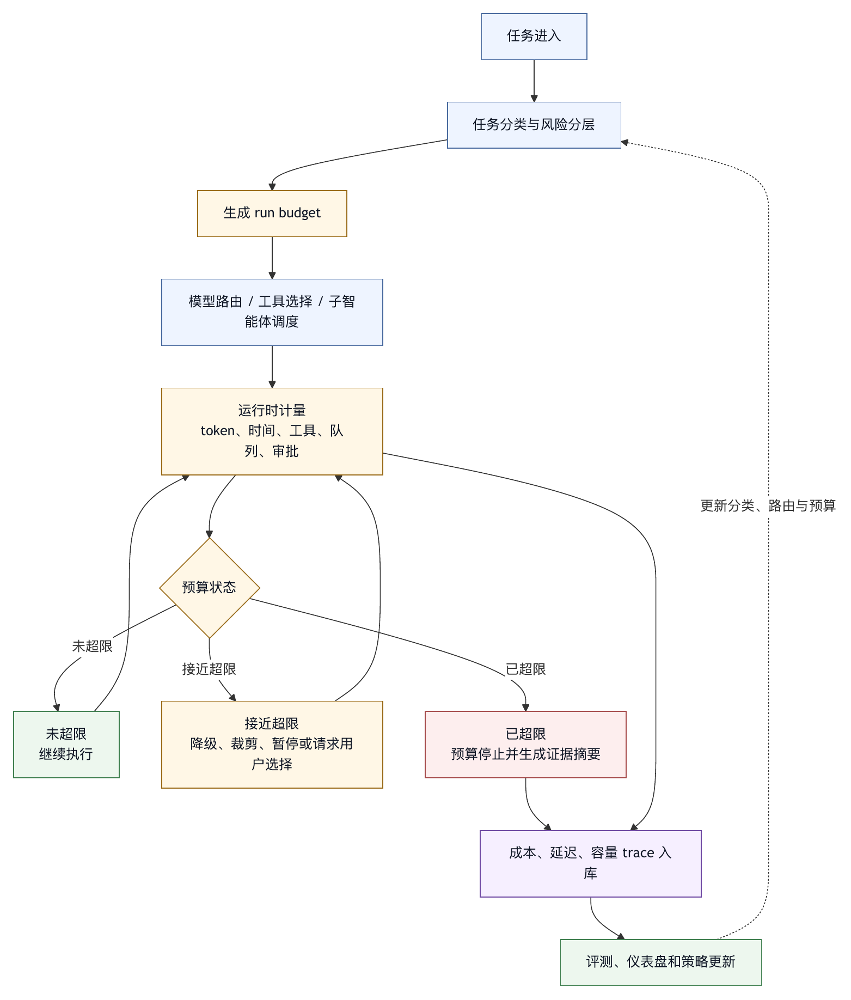

# 第十九章 成本、延迟与容量

## 19.1 正确但太贵，也不具备生产可用性

智能体系统的质量不能只看能不能完成任务。一个系统如果每次任务都消耗过多 token、等待太久、频繁重试、占用大量并发资源，即使最终结果正确，也难以进入生产。成本、延迟和容量，是 harness engineering 中与可靠性同等重要的约束。

很多 demo 忽略这些问题，因为 demo 只有少量任务、少量用户、宽松预算和人工等待。生产环境不同。用户希望智能体响应可预期，团队需要成本可控，平台需要容量规划，组织需要知道哪些场景值得自动化，哪些场景不值得。

智能体的成本和延迟来自多个层面：

- 模型输入和输出 token。
- 长上下文。
- 多模态输入。
- 工具调用。
- 外部 API。
- 测试和构建。
- 重试。
- 子智能体。
- 审批等待。
- trace 和日志。

Harness 必须让这些成本可见、可预算、可优化。

## 19.2 Token 预算

Token 是智能体系统最直接的成本单位之一。上下文装配、模型调用、工具结果、历史压缩和最终回答都会消耗 token。

Token 预算至少包含：

- 单次模型调用输入上限。
- 单次模型调用输出上限。
- 单个 run 总 token 上限。
- 上下文各类材料预算。
- 工具输出预算。
- 子智能体预算。
- 重试预算。

如果没有预算，智能体会自然膨胀：读更多文件、保留更多历史、生成更长解释、派发更多子任务。长上下文能力会放大这种倾向。

Token 预算不是简单截断。关键约束、用户目标、权限状态和验证证据不应被普通日志挤掉。预算策略应与第六章上下文装配结合。

## 19.3 成本归因

成本优化的第一步是归因。总账单不能告诉团队该改哪里。

成本 trace 应能回答：

- 哪些任务类型最贵？
- 哪些模型调用最贵？
- 长上下文占多少成本？
- 工具重试占多少成本？
- 子智能体是否带来净收益？
- 多模态预处理是否值得？
- 哪些失败任务消耗异常？

成本归因可以改变产品策略。例如，复杂代码修复任务高成本但价值高，可以接受；简单文档问答若成本过高，就需要改检索和模型路由。某个工具输出过长导致 token 暴涨，就应改输出裁剪。

成本不是单纯财务问题，它反映 harness 结构是否有效。

## 19.4 延迟预算

用户体验对延迟很敏感。智能体任务可以比普通问答慢，但必须可解释、可预期、可中断。

延迟预算可以分为：

- 首 token 时间。
- 单轮模型调用时间。
- 工具执行时间。
- 总任务时间。
- 审批等待时间。
- 排队时间。
- 重试退避时间。

不同任务容忍度不同。交互式终端任务需要快速反馈；后台代码修复可以运行几分钟；企业报表生成可以更久，但需要进度和通知。

Harness 应提供流式反馈和状态展示。用户等待时，应知道系统是在搜索、编辑、运行测试，还是等待审批。无反馈的等待会显著降低信任。

## 19.5 模型路由与成本分层

不是所有步骤都需要最强模型。Harness 可以用模型路由控制成本和延迟。

常见分层：

- 轻量模型：分类、路由、简单摘要、格式检查。
- 主力模型：任务规划、代码分析、工具选择。
- 强推理模型：复杂调试、高风险决策、最终审稿。
- 多模态模型：图片、音频、视频预处理。

路由需要评测支持。不能因为模型便宜就随意降级，也不能因为模型强就用于所有步骤。每个任务阶段应有能力要求和失败成本。

模型路由还要考虑切换成本。多个模型之间的上下文格式、工具调用行为和输出风格不同，harness 需要适配。

## 19.6 工具成本与环境成本

工具也有成本。运行测试消耗时间和 CPU；构建消耗缓存和存储；Web search 可能付费；外部 API 有配额；数据库查询可能影响系统负载。

工具成本应进入预算。智能体不能无限运行全量测试，也不能频繁调用昂贵 API。工具定义中可以包含成本等级，行动循环根据任务阶段决定是否调用。

对于 coding agent，测试策略尤其重要。每次修改后运行全量测试最安全，但成本高；只运行相关测试成本低，但覆盖不足。Harness 可以采用分层验证：先运行相关测试，再在发布门禁运行更全面检查。

## 19.7 重试成本

重试是隐藏成本大户。模型调用失败重试、工具参数错误重试、测试失败反复尝试、网络超时退避，都会消耗资源。

重试策略应区分错误类型：

- 暂时性错误可重试。
- 权限拒绝不应重试。
- 参数错误应调整后重试。
- 测试失败应分析后修改，而不是重复运行。
- 安全拒绝应停止。

重试还应有上限和退避。连续失败应触发总结或请求用户，而不是继续消耗预算。

## 19.8 并发与容量

平台级 harness 需要容量规划。多个用户、多个任务、多个子智能体同时运行，会争用模型额度、CPU、内存、网络、外部 API 和队列。

容量管理包括：

- 最大并发 run。
- 每用户并发限制。
- 每项目并发限制。
- 子智能体 fan-out 限制。
- 工具并发限制。
- 外部 API rate limit。
- 队列优先级。
- 任务取消。

多智能体尤其容易造成容量爆炸。一个主任务派发十个子智能体，每个子智能体再调用工具和模型，成本呈倍数增长。Harness 必须有 fan-out 上限和用量汇总。

容量策略还要考虑公平性。一个大任务不应阻塞所有小任务；低优先级后台任务不应挤占交互式任务。

## 19.9 预算停止与用户沟通

预算耗尽时，系统必须诚实。不能把预算停止包装成成功。

预算停止的最终回答应说明：

- 已完成什么。
- 未完成什么。
- 已消耗多少。
- 停止原因。
- 继续需要什么预算或权限。
- 当前风险。

例如：“已定位两个候选文件并完成一个小修改，但未运行全量测试，因为任务时间预算已耗尽。” 这比“已完成修改”更可靠。

预算停止也可以触发用户选择：继续、扩大预算、缩小范围、只输出当前分析、转为人工处理。

## 19.10 成本优化不应牺牲证据

成本优化有一个危险方向：减少验证、减少 trace、减少审批、减少上下文。这样表面成本下降，风险上升。

正确的优化顺序通常是：

1. 删除无关上下文。
2. 改进工具输出裁剪。
3. 使用更合适模型。
4. 减少无效重试。
5. 优化测试选择。
6. 缓存稳定结果。
7. 分阶段验证。

不应优先删除安全日志、隐藏失败、跳过关键测试或放宽权限。成本优化必须保留完成证据。

## 19.11 成本、延迟与容量清单

设计生产 harness 时，可以使用以下清单。

预算：

- 是否有 token、成本、时间、轮次和工具调用预算？
- 子智能体是否有独立预算？

归因：

- 是否能按任务、模型、工具和失败类型归因成本？
- 是否能定位延迟瓶颈？

路由：

- 是否按任务阶段选择模型？
- 路由策略是否有评测支持？

工具：

- 昂贵工具是否有成本等级？
- 测试策略是否分层？

容量：

- 是否有限制并发、fan-out 和外部 API rate？
- 是否有队列、取消和优先级？

沟通：

- 预算停止是否诚实说明？
- 用户是否能选择继续或缩小范围？

成本、延迟和容量管理的核心，是让智能体的自主性在可承担的资源边界内运行。

## 19.12 Run Budget：把预算变成运行对象

预算如果只写在文档里，难以形成运行时约束。生产 harness 应把预算设计成运行时对象，在每一次 agent run 创建时绑定到状态中，并在模型调用、工具调用、子智能体调度、审批等待和最终回答前持续检查。

一个可执行的 run budget 至少应包含以下字段：

```yaml
run_budget:
  scope:
    tenant: enterprise-a
    project: payment-service
    task_type: bugfix
    risk_tier: medium
  model:
    max_model_calls: 24
    max_input_tokens: 180000
    max_output_tokens: 24000
    preferred_models:
      planning: small-reasoning
      implementation: coding-main
      review: strong-reasoning
  tools:
    max_tool_calls: 80
    max_shell_calls: 20
    max_search_calls: 30
    max_external_api_calls: 5
  time:
    max_wall_clock_seconds: 1800
    max_idle_seconds: 180
    max_approval_wait_seconds: 86400
  concurrency:
    max_subagents: 3
    max_parallel_tools: 4
  stop_policy:
    on_budget_exhausted: summarize_and_ask
    on_approval_timeout: pause
    on_repeated_failure: escalate
```

这个对象有两个作用。第一，它把“便宜一点”“快一点”“不要跑太久”转化为执行器可以检查的约束。第二，它让最终回答可以准确说明任务是在成功、失败、等待审批还是预算停止。第七章已经讨论过停止条件；在这里，预算对象是停止条件的资源层实现。

预算对象还应支持继承。组织可以设置默认上限，项目可以覆盖工具预算，任务类型可以定义不同模型路由，用户可以在一次任务中临时提高预算。继承规则必须可解释；缺少解释时，用户看到“预算不足”也不知道到底是组织限额、项目策略、当前任务风险，还是个人额度导致停止。

预算让智能体能力变得可运营，而不是单纯限制能力。没有预算对象，系统只能在账单或事故发生后回头解释；有了预算对象，harness 可以在运行中主动调整策略。

## 19.13 延迟分级：慢也要分类

延迟管理不能只看平均值。智能体任务的延迟感知取决于交互形态、任务风险和反馈密度。同样是三分钟，交互式终端中没有任何反馈会显得不可接受；后台代码迁移任务如果每一步都有进度、可取消并能通知完成，三分钟可能完全合理。

可以把智能体任务分成四类延迟等级：

1. 交互即时型：用户正在等待下一句回答或下一次命令建议。目标是快速首 token、短轮次、少工具调用。典型任务包括解释错误、生成命令、回答代码片段问题。
2. 交互工作型：用户愿意等待智能体搜索、修改、运行局部验证，但需要持续反馈。典型任务包括小型 bug 修复、文档改写、配置调整。
3. 后台任务型：用户发起后可以离开，系统完成后通知。典型任务包括大规模重构、依赖升级、批量文档整理、数据分析报告。
4. 审批流程型：任务本身包含人类等待、外部系统和发布窗口。典型任务包括生产变更、合并发布、安全修复上线。

每一类任务应有不同的首响目标、总时长上限、进度展示方式和取消策略。交互即时型任务应优先减少上下文和工具调用；后台任务型任务可以使用更完整的验证和更强模型；审批流程型任务的关键不在模型速度，而在状态持久化和恢复。

OpenTelemetry 的 traces、metrics 和 logs 可以作为通用可观测性基础，GenAI semantic conventions 也开始覆盖生成式 AI 和智能体相关 span。〔注19-1〕 但 agent harness 还需要把延迟拆到智能体特有阶段：上下文装配、模型调用、工具执行、审批等待、子智能体 fan-in、验证和最终回答。只有看到这些阶段，团队才能判断慢在哪里。平均响应时间不能解释“为什么用户觉得系统卡住了”。

## 19.14 容量规划：从单次任务到平台负载

单次任务预算解决的是“一个 run 会不会失控”，容量规划解决的是“许多 run 一起运行时平台会不会失控”。两者相关但不同。一个 run 在预算内，仍可能因为同时运行太多而耗尽模型额度、队列、CPU、内存、缓存、外部 API 配额和人工审批注意力。

容量规划需要先确定资源维度：

- 模型侧：每分钟请求数、token 吞吐、并发连接、供应商限流、模型冷启动或排队。
- 工具侧：shell 并发、测试环境、浏览器实例、容器池、文件索引、数据库连接。
- 外部侧：Git 平台 API、issue 系统、搜索服务、云服务、内部审批系统。
- 人类侧：审批人可用时间、审稿队列、值班响应、业务验收窗口。
- 观测侧：trace 写入、日志存储、指标基数、采样和保留成本。

平台容量不能只按“用户数”估算。智能体的负载由任务类型决定。一个用户发起十个文档改写任务，可能比一个用户发起一次跨仓库重构更轻；一个主智能体派出多个子智能体，实际负载可能远高于界面上显示的一次任务。

因此，harness 应为队列中的任务维护资源预估。预估不一定完美，但要能支持调度决策：哪些任务可以立即运行，哪些任务需要排队，哪些任务应降级模型，哪些任务必须等待审批人，哪些任务因为外部 API 限流而暂停。

## 19.15 案例：并行子智能体如何放大成本

设想一个团队把“调查线上错误率上升”交给多智能体系统。主智能体认为任务复杂，于是派出五个子智能体：一个看日志，一个看最近提交，一个看监控，一个看 issue，一个查文档。这个设计看起来合理，因为任务可以并行。

问题出现在边界上。每个子智能体都独立装配上下文、调用强模型、搜索仓库、运行命令，并把大量原始结果返回给主智能体。主智能体为了综合结果，又把五份长报告全部塞进上下文。最终系统花费大量 token 和工具调用，只得到一个普通结论：某个最近配置变更增加了重试次数。

复盘发现，需要并行的只有两个方向：最近提交和监控异常。日志、issue 和文档可以作为后续验证，而不是一开始就派出独立子智能体。更好的 harness 策略是：

1. 主智能体先做低成本诊断，确定候选方向。
2. 只有当候选方向互相独立且需要不同工具时，才派发子智能体。
3. 每个子智能体有独立预算、最大上下文、允许工具和返回格式。
4. fan-in 阶段只返回证据摘要、关键链接和未验证项，不返回完整日志。
5. 成本 trace 汇总到主任务，显示每个子智能体的净贡献。

Claude Code 和 Codex 相关材料把子智能体、命令、权限、工作区和使用量展示纳入产品化控制面；工程经验也显示，多智能体需要并发上限、超时、trace 和用量汇总。〔注19-2〕 这些材料共同支持本书的判断：子智能体是需要预算和调度的资源消费者，不能被当作免费并行能力。

## 19.16 成本仪表盘：不要只看总账单

如果团队只在月底看供应商账单，成本治理已经太晚。Harness 应提供面向工程决策的成本仪表盘。仪表盘回答“哪些系统结构正在制造不必要成本”，而不是只复述财务报表。

一个有效的成本仪表盘可以包含：

- 按任务类型的平均成本、P90 成本和失败成本。
- 按模型阶段的 token 分布：规划、实现、审稿、总结。
- 按工具类型的调用次数、耗时、失败率和重试率。
- 按上下文来源的 token 占比：项目规则、检索文件、历史、工具结果、用户输入。
- 按子智能体的成本贡献和结果贡献。
- 按门禁结果的成本：通过、失败、等待审批、预算停止。
- 按用户或团队的资源使用趋势。

特别要关注失败成本。成功任务昂贵不一定是坏事，可能因为任务价值高；失败任务昂贵则说明系统在错误方向上消耗资源。比如一个智能体因权限不足反复尝试外部写入，成本不只来自模型 token，还来自用户等待、审批噪声和事故风险。

成本仪表盘还应支持下钻到 trace。用户看到某类任务成本异常时，应能进入具体 run，看到是上下文过长、工具输出未裁剪、模型路由过强、重试过多，还是子智能体 fan-out 过大。OpenAI Agents SDK tracing 中对模型调用、工具调用、handoff、guardrail 和自定义事件的记录方式，可以作为这类下钻能力的实现参照。〔注19-4〕

## 19.17 图 19-1：资源治理闭环

图 19-1 把预算、计量、降级和策略更新组织成资源治理闭环。

<figure><figcaption><p>图 19-1：资源治理闭环</p></figcaption></figure>

```text
任务进入
  |
  v
任务分类与风险分层
  |
  v
生成 run budget
  |
  v
模型路由 / 工具选择 / 子智能体调度
  |
  v
运行时计量：token、时间、工具、队列、审批
  |
  +--> 未超限：继续执行
  |
  +--> 接近超限：降级、裁剪、暂停或请求用户选择
  |
  +--> 已超限：预算停止并生成证据摘要
  |
  v
成本、延迟、容量 trace 入库
  |
  v
评测、仪表盘和策略更新
```

这个闭环强调两个原则。第一，预算必须早于行动，而不是行动之后再解释。第二，优化必须回到策略，而不是只责怪模型“太啰嗦”或用户“任务太大”。当系统持续记录成本、延迟和容量信号时，团队可以逐步形成任务分类、模型路由、上下文裁剪、工具输出和并发调度的工程经验。

## 19.18 成本模型：把一次 run 拆成可计算单元

成本治理不能只依赖“这次任务花了多少钱”的事后数字。Harness 要能在运行前估算、运行中校正、运行后归因，就必须把一次 run 拆成可计算单元。拆分的粒度太粗，无法优化；粒度太细，又会让工程团队陷入维护成本。因此，成本模型应围绕控制决策设计，而不是围绕账单字段设计。

一次 agent run 的成本至少可以拆成以下几类：

- 装配成本：检索、读取、压缩、排序和选择上下文所消耗的时间、token 和外部服务调用。
- 推理成本：模型输入、模型输出、推理深度、工具调用前后的额外轮次。
- 工具成本：命令、测试、构建、数据库查询、搜索、浏览器、MCP server 和企业系统 API。
- 协作成本：审批等待、人工审稿、用户确认、跨团队通知和失败沟通。
- 观测成本：trace、日志、指标、采样、存储、导出和回放。
- 机会成本：队列占用、并发槽位、限流额度和高优先级任务被延迟。

这些成本不一定都能精确折算成同一种货币单位，但都应以结构化方式进入 run record。比如模型 token 可以折算账单，工具执行可以折算时长和机器资源，审批等待可以折算为业务延迟，外部 API 可以折算为配额消耗。对 harness 而言，首要问题是回答：哪个阶段失控，哪个策略导致失控，下一次应在哪里收缩。

一个成本分解对象可以这样表达：

```yaml
run_cost_breakdown:
  run_id: run_2026_05_28_0017
  task_type: repository_bugfix
  model:
    planning:
      calls: 3
      input_tokens: 28000
      output_tokens: 4200
    implementation:
      calls: 8
      input_tokens: 96000
      output_tokens: 11800
    review:
      calls: 2
      input_tokens: 22000
      output_tokens: 2600
  context:
    project_rules_tokens: 8400
    retrieved_files_tokens: 62000
    tool_results_tokens: 31000
    compressed_history_tokens: 14000
  tools:
    search_calls: 19
    shell_calls: 7
    test_seconds: 420
    external_api_calls: 2
  orchestration:
    subagents: 2
    retries: 3
    approval_wait_seconds: 0
  observability:
    trace_spans: 86
    log_bytes: 940000
```

这个对象用于支持决策，不是展示复杂度。例如，若 `retrieved_files_tokens` 长期过高，就应回到检索和上下文装配；若 `tool_results_tokens` 过高，就应治理工具输出；若 `retries` 高而成功率低，就应审查错误分类和停止条件；若 `test_seconds` 高但缺陷捕获率低，就应调整验证策略。OpenTelemetry 对 span、metrics、logs 和 exporter 的抽象可以承载这些信号，GenAI semantic conventions 也提供了生成式 AI 语义约定；agent harness 仍需要在业务语义层把它们映射为任务、模型阶段、工具、审批、子智能体和门禁结果。〔注19-1〕

成本模型还要区分“必要高成本”和“浪费”。复杂安全修复使用强模型、完整上下文和多层验证，可能是必要高成本；简单格式化任务反复读全仓库、调用强模型、跑全量测试，则是浪费。两者在总额上可能相近，但治理含义完全不同。一个成熟的成本模型必须保留任务价值、风险等级和完成证据，避免把团队带向错误节省。

## 19.19 预算继承与策略优先级

第 19.12 节已经把预算设计为运行时对象。实际平台中，预算不会只来自一个地方。组织有全局限制，事业部有配额，项目有工具策略，任务类型有默认值，用户有个人额度，管理员可能临时开例外。若没有清晰的继承和优先级，预算系统会变成新的不透明黑箱。

预算继承通常可以分为五层：

- 组织层：最高风险边界，例如禁止某些外部写入、限制默认模型、约束总并发。
- 租户或部门层：成本中心、团队额度、审批人配置和高峰期策略。
- 项目层：仓库大小、测试成本、常用工具、数据敏感度和发布窗口。
- 任务类型层：问答、修复、重构、数据分析、报告生成等默认预算。
- 单次 run 层：用户在本次任务中选择的范围、时长、模型强度和验证深度。

优先级不应简单理解为“越上层越强”。安全边界和合规边界通常不可被下层放宽；成本额度可以在审批后临时提高；验证深度可以因风险等级提高而覆盖用户的低成本偏好；交互式任务可以为了体验压缩总时长，但不能跳过关键证据。预算引擎需要支持不同字段的不同合并规则。

例如，组织层可以规定任何外部写入必须审批；项目层可以规定修改数据库迁移文件必须运行特定检查；用户层可以选择“快速草案模式”。当一次任务同时满足这些条件时，快速草案模式只能影响模型强度和输出长度，不能取消外部写入审批，也不能跳过迁移检查。

可以把策略合并结果作为 run 启动前的可解释对象：

```yaml
effective_budget:
  inherited_from:
    organization_policy: org_default_v4
    department_quota: platform_team_q2
    project_policy: payment_service_harness
    task_profile: medium_risk_bugfix
    user_override: fast_feedback
  resolved_limits:
    max_wall_clock_seconds: 1200
    max_model_calls: 18
    max_subagents: 2
    require_human_approval_for_external_write: true
    required_validation_profile: related_tests
  overridden_fields:
    output_tokens:
      from: task_profile
      to: user_override
      reason: fast feedback preference
  locked_fields:
    external_write_approval:
      source: organization_policy
      reason: compliance boundary
```

这个对象解决两个问题。第一，用户知道系统为什么限制他。第二，工程团队可以审计策略是否按预期生效。若用户抱怨“为什么这个任务不能派出五个子智能体”，平台可以指向风险等级、项目并发限制和部门配额，而不是让一线支持人员猜测。

预算继承还要有版本。策略更新后，历史 run 仍应保留当时生效的预算版本。缺少版本记录时，团队复盘成本异常容易用今天的策略解释昨天的行为，造成误判。第十六章讨论 trace schema 版本时已经强调了运行证据的时间性；预算策略也是 trace 证据的一部分。

## 19.20 上下文成本治理

上下文是智能体质量的来源，也是成本膨胀的主要来源。长上下文能力容易让团队形成一种错觉：既然窗口足够大，就把规则、历史、检索结果、工具输出和聊天记录都塞进去。短期看，系统似乎更“知道背景”；长期看，成本上升、延迟增加、注意力稀释、隐私暴露面扩大，错误归因也更困难。

上下文成本治理应“按价值放”，而不是一味“少放”。第六章已经讨论 Context Manifest；在成本视角下，每一类上下文都应有预算、优先级和压缩策略。

常见上下文类别可以这样管理：

- 不可压缩上下文：用户目标、当前约束、权限状态、安全规则、必须遵守的项目指令。
- 高价值可裁剪上下文：相关源码、错误栈、测试失败、设计文档中的关键段落。
- 中价值可摘要上下文：历史讨论、长日志、重复配置、相似案例。
- 低价值或危险上下文：无关搜索结果、过期文档、未验证网页、大段工具噪声。
- 隔离上下文：可能包含恶意指令或敏感数据的外部内容，只能以数据形式进入特定分析步骤。

一个成熟的 harness 不应把上下文长度作为单一指标，而应观察上下文的结构比例。比如项目规则占比长期过高，说明规则需要模块化；检索文件占比过高，说明检索召回太宽；工具结果占比过高，说明工具输出缺少摘要层；历史上下文占比过高，说明会话压缩策略不成熟。

上下文成本治理还要关注“重复携带”。许多智能体系统在多轮任务中反复携带同一份规则、同一段错误日志、同一组文件内容。若没有上下文去重和摘要复用，成本会随轮次线性甚至超线性增长。更好的做法是把稳定事实转化为短摘要和引用，把可重新读取的材料留在文件系统或检索系统中，只在需要时重新装配。

压缩也有成本和风险。压缩摘要可能丢失关键否定条件，例如“不要修改数据库迁移文件”“用户尚未提交的改动不能覆盖”。因此，压缩策略必须区分事实、约束、证据和推论。事实可以摘要，证据应保留可追溯引用，约束应优先保真，推论应标明不确定性。成本治理不能把第六章的上下文质量要求压扁成“越短越好”。

## 19.21 工具输出成本治理

工具输出是第二个常见成本放大器。许多工具原本面向人类终端或日志系统设计，会输出大量重复信息、进度条、颜色控制字符、依赖树、无关 warning 和长列表。智能体若把这些原始输出全部送回模型，token 成本会迅速上升，模型也更容易被噪声误导。

工具输出治理应发生在工具边界，而不是完全依赖模型“自己看重点”。工具定义中应明确输出形态：

- 原始输出是否保留。
- 给模型的摘要字段是什么。
- 哪些行属于错误、警告、统计、证据和噪声。
- 最大输出长度是多少。
- 超限时如何截断。
- 截断后如何提供原始产物路径或引用。
- 是否需要对敏感信息脱敏。

例如测试工具不应只返回一整段终端日志，而应返回结构化摘要：测试命令、退出码、失败测试名、失败断言、相关文件、首个错误栈、完整日志位置。搜索工具不应返回上百行匹配，而应返回按文件聚合的命中、上下文片段、置信度和后续读取建议。Web 工具不应把整页内容无条件送入上下文，而应先提取标题、发布时间、来源、关键段落和不确定性。

工具输出成本治理可以采用三层输出：

```yaml
tool_output_policy:
  for_model:
    max_tokens: 2500
    format: structured_summary
    include:
      - status
      - primary_evidence
      - error_snippet
      - artifact_reference
  for_trace:
    max_bytes: 200000
    redaction: secret_and_personal_data
    retention_days: 30
  for_human:
    display_mode: expandable
    default_view: summary
```

应把“给模型看的内容”“给 trace 保存的内容”和“给人类展开看的内容”分开。模型不需要每次都读取完整日志，trace 需要保留足够证据，人类需要在必要时查看完整上下文。若三者混在一起，系统要么过度昂贵，要么证据不足。

工具输出治理还可以减少误修。长日志中常包含多个历史错误、缓存 warning 或无关失败。没有结构化摘要时，模型可能追逐第一个看起来严重的错误，而忽略导致当前失败的断言。成本治理在这里也是质量治理：减少噪声，就是减少错误方向的推理。

## 19.22 缓存与复用

缓存是降低成本和延迟的常见手段，但在 agent harness 中，缓存比传统 Web 服务更危险。因为智能体的输入不仅是请求参数，还包括项目状态、用户目标、权限、时间、工具版本、模型版本和上下文装配策略。缓存命中如果忽略这些维度，可能把过期结论、错误权限或旧文件状态带入新任务。

可以缓存的对象包括：

- 依赖索引、文件摘要、符号表和代码结构。
- 稳定文档的解析结果。
- 长日志的结构化摘要。
- 已完成工具调用的无副作用结果。
- 模型对低风险分类任务的结果。
- 评测样本和历史失败归因。
- 常用环境的构建缓存和测试缓存。

不适合直接缓存的对象包括：

- 带有当前权限语义的审批结论。
- 依赖工作区未提交状态的代码判断。
- 与外部时间强相关的市场、政策、版本和价格信息。
- 包含敏感信息且缺少保留策略的上下文。
- 高风险决策的最终结论。

缓存键必须表达状态。对于 coding agent，文件摘要缓存至少应包含文件路径、内容 hash、相关配置版本和解析器版本；测试结果缓存至少应包含测试命令、依赖锁文件、环境变量、代码版本和测试框架版本；文档检索缓存至少应包含来源版本和抓取时间。只用“用户问题文本”作为缓存键，几乎一定会出错。

缓存也要进入 trace。一次任务使用了哪些缓存、是否命中、命中对象的版本是什么、是否因为状态变化而失效，都应可见。缺少缓存记录时，团队在智能体给出过期建议后无法判断是模型幻觉、检索错误还是缓存污染。

复用不只发生在机器层，也发生在组织层。高价值的成本优化经验应沉淀为策略、工具摘要器、上下文模板和评测样本，而不是依赖某个工程师记住“这个仓库不要全量读取”。第二十八章讨论经验沉淀时会继续展开这一点。资源治理成熟的团队，会把重复昂贵的人工经验转化为可执行 harness 资产。

## 19.23 队列与优先级调度

当平台开始服务多个用户和团队后，队列比单次执行更重要。没有队列的系统只能在资源不足时失败；有队列但没有优先级的系统会让低价值长任务阻塞高价值短任务；有优先级但不可解释的系统又会让用户觉得平台任意偏袒。

智能体任务调度至少要考虑四类信号：

- 业务优先级：生产事故、安全修复、发布阻塞、普通开发、后台整理。
- 交互形态：用户正在等待、用户已离开、定时任务、批处理。
- 资源画像：模型强度、预计 token、工具时长、外部 API、审批需求。
- 公平性：租户额度、用户并发、项目配额、历史占用。

一个调度策略可以这样表达：

```yaml
capacity_policy:
  queues:
    interactive:
      max_wait_seconds: 20
      max_parallel_runs_per_user: 2
    production_incident:
      preemptible: false
      reserved_capacity_percent: 20
    background:
      preemptible: true
      allowed_hours: off_peak
  resources:
    model_tokens_per_minute:
      reserve_for_interactive: 35
    test_workers:
      max_per_project: 3
    external_api:
      retry_after_policy: honor_provider_limit
  fairness:
    tenant_burst_limit: 10
    user_daily_soft_budget: enabled
```

队列还需要支持取消、暂停、恢复和抢占。后台任务在高峰期可以暂停，交互任务超时后可以询问用户是否转后台，生产事故任务可以占用保留容量。抢占不应破坏工作区状态，所以它必须依赖第十五章讨论的 checkpoint、恢复和状态持久化。

调度策略应尽量透明。用户看到任务排队时，应知道大致原因：模型配额紧张、测试环境繁忙、外部 API 限流、正在等待审批人，还是自己已经达到并发上限。透明的目标是让用户能采取行动：缩小范围、降低验证深度、转为后台、等待、取消或申请更高优先级，而不是展示所有内部指标。

## 19.24 Rate Limit 与供应商配额

模型供应商、搜索服务、代码托管平台、企业系统和内部 API 都可能有 rate limit。对普通应用而言，限流通常是请求层问题；对 agent harness 而言，限流会改变任务策略。一次代码修复任务若在关键时刻耗尽模型额度，可能需要切换模型、暂停等待、转后台或请求用户选择；一次企业集成任务若触发 API 限流，盲目重试会同时增加成本和风险。

Rate limit 治理要区分三类限制：

- 硬限制：超过后请求必定失败，必须排队、降级或停止。
- 软限制：短期可突发，但长期超出会影响成本、质量或供应商稳定性。
- 语义限制：接口虽然允许调用，但过频调用会影响外部系统、触发安全告警或污染审计。

行动循环中的重试策略必须读取限流信号。若外部 API 返回明确的等待时间，harness 应尊重等待时间并把 run 状态标记为等待，而不是继续消耗模型轮次解释失败。若模型服务达到吞吐限制，harness 可以把低风险总结任务切换到轻量模型，把后台任务排队，把交互任务保留在可用容量中。

限流信息也应进入成本归因。某些任务看起来慢，实际是在排队等待配额，并非模型推理慢；某些任务看起来失败率高，实际原因可能是并发策略过于激进，并非工具不可靠。没有配额维度的 trace，团队会把平台容量问题误诊为模型能力问题。

供应商配额还有一个组织层含义：它决定平台能够承诺什么服务等级。若团队没有稳定容量储备，就不应承诺“所有代码修复任务都在十分钟内完成”。Harness 的产品承诺必须与真实配额、队列和降级策略一致；承诺超出容量时，用户信任会被慢慢消耗。

## 19.25 人类等待也是容量

许多团队在容量规划时只计算机器资源，却忽略人类容量。智能体系统越进入生产，人类等待越成为关键资源：审批人、代码审稿人、安全值班、产品验收、数据 owner、法务或合规联系人，都会成为链路的一部分。

人类等待有三个特点。第一，它不可无限扩容。一个安全负责人一天只能处理有限数量的高风险审批。第二，它有时间窗口。发布审批、生产变更和跨时区协作都受工作时间影响。第三，它有注意力质量。审批提示过多、信息不清或风险分级失真，会让人类从认真判断变成机械点击。

因此，审批等待不应只是 run 的暂停状态，而应进入容量模型：

- 当前审批队列长度。
- 按风险等级的审批耗时。
- 审批拒绝率和补充信息请求率。
- 同一审批人的负载。
- 超时后自动暂停、转交或降级策略。
- 审批提示是否包含足够证据。

第十三章讨论过审批交互设计；在成本和容量视角下，审批设计还影响平台吞吐。一个需要人类判断的系统，如果每次请求都让审批人阅读长日志、猜测变更风险、手动找上下文，审批队列会迅速堵塞。更好的设计是把审批请求做成证据包：变更摘要、风险来源、受影响对象、可回滚性、已完成验证、剩余不确定性和推荐动作。

人类等待也会影响延迟体验。若任务需要审批，用户界面应明确显示“等待谁”“等待什么”“超时后会怎样”。把审批等待隐藏成“智能体还在思考”，会让用户误解系统性能，并在等待中重复发起任务，进一步放大容量压力。

## 19.26 多租户成本隔离

企业级 harness 往往服务多个团队、项目和业务线。没有多租户成本隔离，平台会遇到两个问题：一个团队的高成本任务拖慢其他团队；另一个团队的资源使用无法归因，财务和治理难以落地。

多租户隔离同时属于账单归因和运行时控制。每个租户至少需要：

- 成本中心和资源预算。
- 默认模型和可用模型范围。
- 最大并发 run 和子智能体 fan-out。
- 工具和连接器访问边界。
- 数据保留和 trace 可见性策略。
- 高风险任务审批链。
- 异常用量告警。

隔离策略要兼顾共享效率和边界清晰。完全隔离会导致资源利用率低、维护成本高；完全共享会导致噪声、风险和责任混在一起。常见做法是共享底层模型连接、观测管线和工具运行池，在策略、队列、凭据、数据和预算上按租户隔离。

多租户环境中还要避免“成本转嫁”。例如，一个平台团队为了节省自身预算，把复杂验证转移给下游发布系统；一个业务团队把大规模文档生成包装成低风险问答，占用交互队列；一个项目在公共连接器上发起大量查询，影响其他项目。Harness 应通过任务分类、资源标签和门禁结果识别这些行为。

成本隔离也服务于产品决策。某些团队使用智能体后明显降低人工返工，即使模型成本较高，也可能值得继续投入；某些场景看似热门，但失败率高、审稿负担重、节省时间有限，就应收缩或重新设计。没有租户级归因，平台只能讨论总成本，无法讨论价值。

## 19.27 成本异常检测

成本异常不应等到账单日才被发现。智能体系统的异常往往发生在运行中：循环重试、工具输出爆炸、检索召回异常、子智能体过度 fan-out、外部 API 限流后反复等待、某个模型版本输出显著变长。Harness 需要在 run 内和平台层同时检测异常。

常见异常信号包括：

- 单次 run 的 token 消耗超过同类任务 P95。
- 某类工具输出长度突然增加。
- 重试次数升高但成功率没有提高。
- 子智能体平均贡献下降但成本上升。
- 某模型阶段输出长度漂移。
- 排队时间超过服务等级目标。
- 预算停止比例上升。
- 失败任务成本占比上升。

异常检测要避免只看绝对值。大任务高成本正常，小任务高成本才异常；高风险任务验证时间长正常，低风险任务反复全量验证才异常；新项目冷启动时索引成本高正常，稳定项目持续高索引成本则需要治理。基线应按任务类型、项目、风险等级和交互形态分组。

当异常出现时，harness 应尽量给出可行动解释。例如“本次任务成本异常，主要来自工具输出，测试日志返回 180000 字符，已按策略截断并保存完整日志引用”；或者“本周文档问答任务平均成本上升，原因是检索召回文档数量从 8 个增加到 31 个”。这种解释能直接引导工程改进。

异常检测还应连接 guardrail。若 run 在短时间内重复调用同一昂贵工具且没有新证据，系统可以触发停止；若上下文增长接近上限但关键约束被挤出风险上升，系统可以要求压缩或人工选择；若某个租户接近日预算，系统可以把后台任务降级或排队。成本异常是运行时控制信号，不能只作为财务报表上的红点。

## 19.28 延迟体验设计

延迟优化不仅是让系统更快，也是让等待更可理解。智能体任务经常包含搜索、读取、编辑、运行、等待审批和总结。用户并不要求所有任务即时完成，但会强烈反感无反馈、不可取消、结果不确定的等待。

良好的延迟体验有四个层次：

- 首响：尽快确认系统理解了任务，并展示下一步动作。
- 过程：持续显示当前阶段、关键证据和可取消状态。
- 预期：说明大致需要多久、哪些步骤可能慢、是否可转后台。
- 收尾：明确成功、失败、暂停、预算停止或等待审批。

流式输出不等于良好反馈。若系统只是不断输出空泛文字，用户仍然不知道真实进度。更好的方式是把行动循环的状态映射为界面事件：正在装配上下文、正在读取文件、正在运行测试、正在等待权限、正在合并子智能体结果、正在生成最终证据包。OpenAI Agents SDK tracing 对 tool calls、handoffs、guardrails 和 custom events 的记录方式，可以作为界面 timeline 的数据来源之一。〔注19-4〕

延迟体验还要避免“虚假忙碌”。系统如果已经没有可行动路径，只是在预算内继续尝试，就应停止并说明原因。用户宁愿看到清楚的失败和下一步选择，也不愿看见长时间旋转的进度提示。第七章关于停止条件的讨论，在这里转化为体验原则：当继续运行的边际收益低于等待成本时，停止也是一种产品质量。

对于后台任务，延迟体验的重点是恢复和通知。用户应该能离开界面，稍后看到任务状态、关键阶段、失败原因和继续入口。若后台任务失败，只给一句“失败了”没有意义；它应说明失败发生在哪个阶段、已完成哪些证据、是否可以重试、是否需要更高预算或人工输入。

## 19.29 降级策略

资源不足时，系统不能只有“继续原计划”和“直接失败”两个选项。成熟 harness 应设计降级策略，让任务在成本、延迟和质量之间做可解释取舍。降级是在边界内保持最大价值，不是偷工减料。

常见降级方式包括：

- 模型降级：将低风险分类、摘要和格式任务切换到轻量模型。
- 上下文降级：减少低价值检索结果，保留约束、证据和关键文件。
- 验证降级：从全量验证降到相关验证，但在最终回答中声明未覆盖范围。
- 并发降级：减少子智能体数量，改为顺序诊断或只保留最高价值方向。
- 交付降级：从完整实现改为分析报告、补丁草案或人工操作步骤。
- 时效降级：交互任务转后台，后台任务转低峰期运行。
- 观测降级：提高采样率选择性，而不是删除关键审计事件。

可以把降级策略写入任务 profile：

```yaml
degrade_policy:
  when:
    remaining_time_seconds_below: 180
    or_remaining_model_budget_below_percent: 15
  options:
    - name: shrink_context
      preserve:
        - user_goal
        - safety_constraints
        - changed_files
        - failing_tests
    - name: switch_to_summary_delivery
      allowed_for:
        - investigation
        - documentation
      forbidden_for:
        - external_write
        - production_change
    - name: related_tests_only
      disclosure_required: true
```

降级策略必须有禁区。安全审批不能因为预算不足而跳过；外部写入不能因为用户着急而无证据执行；高风险代码修改不能在没有验证的情况下包装成完成。降级的结果也必须在最终回答中披露，例如“已完成相关测试，未运行全量测试”“已生成修复方案，未直接修改文件”“因模型预算不足，未派发子智能体”。

降级策略的质量需要评测。团队可以收集预算接近耗尽的历史 run，比较不同降级路径的成功率、用户满意度、后续返工和事故风险。没有评测的降级容易变成随意省钱；有评测的降级才能成为可靠的运行策略。

## 19.30 容量演练与压力测试

资源治理不能只在真实高峰中验证。平台上线前和重大策略变更前，应进行容量演练和压力测试。普通服务的压力测试关注请求吞吐和错误率；agent harness 的压力测试还要关注模型配额、上下文装配、工具池、审批队列、trace 写入、恢复能力和用户沟通。

容量演练可以设计几类场景：

- 交互高峰：大量用户同时发起短任务，观察首响、排队和模型路由。
- 后台堆积：批量重构、文档生成或数据分析同时运行，观察队列和资源隔离。
- 外部限流：模拟代码平台、搜索服务或企业 API 限流，观察退避、暂停和降级。
- 工具池耗尽：测试环境、浏览器实例或容器池不足，观察任务排队和取消。
- 审批堵塞：审批人不可用或审批队列过长，观察超时、转交和状态展示。
- 成本异常：模拟工具输出爆炸、子智能体 fan-out 或重试循环，观察 guardrail 是否触发。
- 观测压力：trace 写入量上升，观察采样、存储和查询是否影响主链路。

压力测试用于验证策略是否按预期生效，而不是把系统压到崩溃后记录数字。比如当外部 API 限流时，系统是否停止盲目重试；当交互队列拥堵时，后台任务是否让出容量；当子智能体成本异常时，主智能体是否能收敛并说明未完成项。

演练结果应产出 runbook 和策略修订，而不是只保存报告。若演练发现审批队列容易堵塞，就应优化审批证据包、增加转交策略或调整风险分级；若发现 trace 写入成本过高，就应调整采样和保留策略；若发现某类后台任务影响交互体验，就应修改队列和配额。容量演练是组织学习的一部分。

## 19.31 资源治理组织接口

成本、延迟和容量横跨工程、产品、财务、安全和运维。若没有组织接口，资源治理会变成平台团队单方面“限额”，业务团队则把限制理解为阻碍。成熟 harness 需要把资源策略做成可讨论、可审计、可改进的组织契约。

常见角色和责任可以这样划分：

- 平台团队：维护预算对象、队列、模型路由、工具池、trace 和仪表盘。
- 产品团队：定义不同任务的体验目标、交付形态和可接受等待。
- 安全与合规团队：定义不可降级边界、审批规则和审计保留要求。
- 财务或运营团队：关注成本中心、预算周期、异常用量和投入产出。
- 业务团队：反馈任务价值、失败成本、人工替代成本和实际收益。
- 一线支持团队：处理预算停止、排队、权限和用户沟通问题。

这些角色不需要每天开会，但需要共享指标和决策节奏。周度可以看异常成本、失败成本和预算停止；月度可以看模型路由、租户成本和容量趋势；季度可以看场景投入产出、平台配额和路线图。资源治理若只由财务在月末追账单，已经错过了工程改进窗口。

组织接口还应规定例外流程。生产事故、安全修复和重大客户交付可能需要临时扩大预算或保留容量。例外必须有时间范围、责任人、风险说明和事后复盘。缺少这些边界时，例外会慢慢变成常态，预算系统失去可信度。

资源治理的沟通语言应避免把问题简化成“模型太贵”。问题可能出在上下文装配粗糙、工具输出未治理、任务分类错误、验证策略过宽、子智能体调度激进、队列缺少优先级或产品承诺超出容量。专业的 harness 团队会把成本讨论转化为系统设计讨论。

## 19.32 常见反模式

成本、延迟和容量治理中最常见的错误，是把资源问题当作账单问题，而不是工程问题。以下反模式在早期平台中特别容易出现。

第一，只看总成本，不看失败成本。总成本上升可能是使用量增长，也可能是失败任务越来越贵。若不区分成功、失败、预算停止和等待审批，团队会削减正确任务的预算，却放任错误循环继续消耗。

第二，用统一 token 上限管理所有任务。简单问答、代码修复、安全审查、数据分析和后台迁移需要不同预算。统一上限要么让小任务浪费，要么让大任务频繁失败。预算应绑定任务类型和风险，而不是绑定平台口号。

第三，为了省钱删除 trace。没有 trace，短期账单可能下降，长期故障定位、评测回放和审计能力都会下降。更好的做法是采样、脱敏、分层保留和控制指标基数，而不是关掉观测。

第四，把降级隐藏成成功。系统只运行了相关测试，却声称验证完成；只生成了分析，却声称修复完成；因预算不足未读取关键文件，却给出确定结论。这种做法会快速损害用户信任。

第五，把并行当作免费性能优化。子智能体、并行工具和后台任务都消耗模型、工具、队列和 fan-in 成本。没有预算和贡献评估的并行，只是更快地花掉资源。

第六，把限流当作临时故障。限流往往是容量契约的一部分。盲目重试会放大延迟和成本，还可能触发供应商或企业系统的保护机制。正确做法是排队、退避、降级和清晰沟通。

第七，忽略人类容量。审批人和审稿人也是系统资源。若平台把大量低价值请求推给人类，最终会得到审批疲劳、机械通过和风险上升。

第八，没有把资源治理接入评测。成本优化如果不看质量、返工和事故风险，就会把系统推向低成本低可信。每一次资源策略调整，都应观察对成功率、用户满意度、验证覆盖和失败成本的影响。

这些反模式的共同根源，是没有把智能体看成一个受资源边界约束的生产系统。Harness engineering 的任务，是让模型能力、工具能力和组织能力在可承担的边界内组合起来。成本、延迟和容量是系统能否长期运行的基本条件，不是附属指标。

## 19.33 第十九章小结

智能体系统正确但太贵、太慢或不可扩展，也不能称为生产可用。Harness 必须管理 token、成本、延迟、工具资源、重试、并发和容量。成本优化应从归因开始，不能以牺牲安全和验证证据为代价。

下一章将讨论质量门禁。成本和容量告诉我们系统能否承载，质量门禁则回答：什么时候可以把智能体的结果交付给用户、合并到代码库或进入发布流程。
