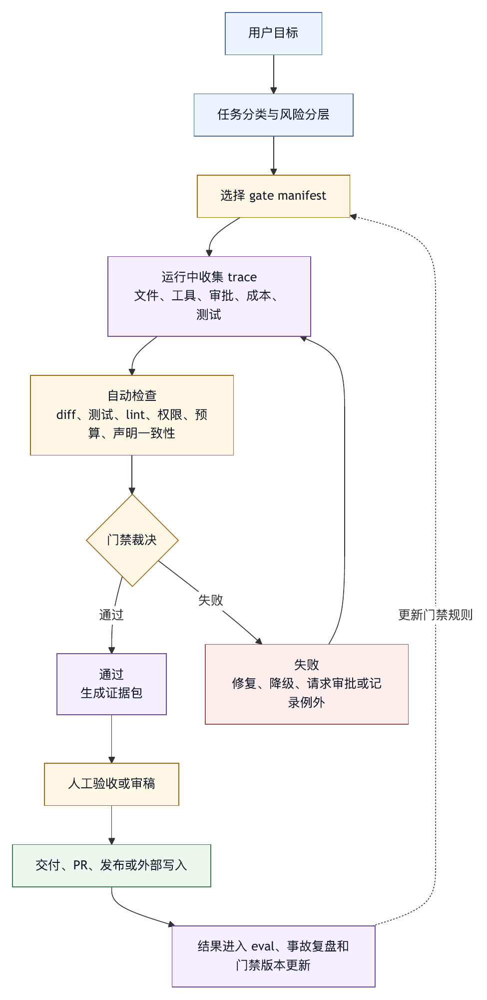

# 第二十章 质量门禁

## 20.1 智能体说完成，还不等于可以交付

智能体最容易制造的一种风险，是过早宣布完成。它可能完成了部分工作，可能只通过了窄测试，可能没有运行验证，可能忽略了用户约束，可能在总结中把推断写成事实。对于生产级 harness，最终要判断的是系统是否有足够证据允许交付；智能体自认为完成只能作为输入，不能作为结论。

质量门禁就是回答这个问题的机制。它把测试、类型检查、lint、构建、diff 审查、权限事件、成本、trace、人工审批和业务验收组合成可执行标准。只有满足门禁，智能体结果才可以进入下一阶段：回复用户、提交 PR、合并代码、发布文档、触发部署或写入外部系统。

质量门禁不是单一测试命令。它是任务类型、风险等级和交付目标共同决定的一组检查。

## 20.2 门禁的位置

质量门禁可以出现在多个位置。

任务开始前：检查目标是否清楚、权限是否足够、环境是否可用。

修改前：检查是否已读取相关文件、是否有计划、是否需要用户批准。

修改后：检查 diff、格式、测试和无关修改。

最终回答前：检查是否有验证证据、是否如实说明风险。

发布前：检查 CI、审稿、审批、版本、回滚计划。

事故后：检查恢复是否完成、失败是否进入回归集。

门禁越靠前，越能减少浪费；门禁越靠后，越能保证交付质量。成熟 harness 会在关键节点设置轻重不同的门禁，不能只靠末尾一次检查。

## 20.3 按任务类型定义门禁

不同任务需要不同门禁。

文档任务：

- 链接是否有效。
- 术语是否一致。
- 是否未改源码。
- 是否符合格式。
- 是否没有泄露内部信息。

代码修复任务：

- diff 是否集中。
- 相关测试是否通过。
- 类型检查或 lint 是否通过。
- 是否无无关重构。
- 是否说明未运行检查。

依赖升级任务：

- lockfile 是否一致。
- 构建是否通过。
- 安全扫描是否通过。
- 兼容性风险是否说明。

外部系统写入任务：

- 目标对象是否正确。
- 内容是否预览并审批。
- 外部对象 id 是否记录。
- 是否可撤销或补偿。

发布任务：

- CI 是否通过。
- 审批是否完成。
- changelog 是否更新。
- 回滚计划是否存在。
- 监控和告警是否准备。

门禁应与任务意图匹配。用代码修复门禁检查文档任务，会浪费；用文档门禁检查部署任务，会危险。

## 20.4 自动检查与人工验收

质量门禁应组合自动检查和人工验收。

自动检查适合：

- 测试、lint、typecheck、build。
- 输出格式。
- diff 范围。
- 禁止路径。
- 安全扫描。
- 链接检查。
- 成本和延迟阈值。

人工验收适合：

- 需求是否满足。
- 文案是否适合读者。
- 代码设计是否符合架构。
- 风险是否可接受。
- 外部副作用是否符合业务预期。

智能体可以辅助人工验收，比如生成 diff 摘要、列出风险、解释测试覆盖范围。但不能把人工判断伪装成模型自评。

## 20.5 证据包

门禁通过后，应形成证据包。证据包是交付时必须可见的事实集合，不是复杂文档。

对于 coding agent，证据包可以包括：

- 修改文件列表。
- 关键 diff。
- 运行过的测试。
- 测试结果。
- 未运行检查及原因。
- 权限审批记录。
- 生成或删除文件。
- 残余风险。

对于非代码智能体，证据包可以包括输入来源、处理步骤、外部对象 id、审批记录、输出文件和未验证项。

证据包让用户和审稿人能快速判断结果是否可信。没有证据包，最终回答只是模型陈述。

## 20.6 门禁失败如何处理

门禁失败不应简单变成“任务失败”。系统应根据失败类型处理。

- 测试失败：分析原因，决定修复或报告。
- Lint 失败：可自动修复或请求确认。
- 权限失败：请求授权或降级。
- 成本超限：暂停并说明。
- Diff 超范围：请求用户确认或回滚。
- 外部验证不可用：说明未验证风险。
- 人工验收不通过：记录反馈并进入下一轮。

门禁失败也不应被隐藏。最终回答必须说明哪些门禁未通过。把门禁失败包装成完成，是严重信任问题。

## 20.7 门禁与 CI

对于软件工程，CI 是重要门禁，但不是唯一门禁。

CI 擅长运行自动测试、构建、静态检查和安全扫描。它能提供客观信号，并与团队现有流程集成。智能体应尽量使用项目已有 CI 规则，而不是创造独立验证标准。

但 CI 也有边界：

- CI 可能慢。
- CI 可能 flaky。
- CI 可能覆盖不足。
- CI 不一定检查需求是否满足。
- CI 不一定知道智能体是否越权。

Harness 应把 CI 结果与本地测试、diff 审查、权限事件和人工审稿结合。CI 失败需要分类：是代码问题、环境问题、测试不稳定，还是权限缺失。

## 20.8 门禁与发布

当智能体结果进入发布流程，门禁必须更严格。发布不仅是代码正确，还涉及用户影响、回滚、监控和沟通。

发布门禁可以包括：

- 版本和 changelog。
- 测试和 CI。
- 安全扫描。
- 兼容性检查。
- 数据迁移审查。
- 审批记录。
- 回滚方案。
- 监控指标。
- 发布后验证。

智能体可以准备发布材料，但不应默认自行发布，除非组织明确授权并有强 sandbox、审批和回滚机制。

## 20.9 门禁的版本化

门禁本身也会演化。项目测试脚本变化，安全规则变化，发布流程变化，质量标准变化。门禁应版本化。

版本化门禁的好处：

- 评测结果可比较。
- 事故复盘能知道当时标准。
- 团队可以审查规则变化。
- 智能体不会使用过期流程。

门禁可以存放在项目规则、CI 配置、harness 配置或组织策略中。关键是来源清楚、优先级清楚、变更可追踪。

## 20.10 门禁清单

设计质量门禁时，可以使用以下清单。

范围：

- 是否按任务类型定义门禁？
- 是否区分分析、修改、发布和外部写入？

证据：

- 是否要求修改文件、测试结果、未验证项和风险说明？
- 证据是否来自 trace，而不是模型自述？

自动化：

- 是否运行项目已有测试、lint、typecheck、build？
- 是否检查 diff 范围和禁止路径？

人工：

- 哪些任务需要人工验收？
- 人工反馈是否进入后续改进？

失败：

- 门禁失败是否分类？
- 是否防止失败被包装成成功？

发布：

- 发布前是否有审批、回滚、监控和发布后验证？

版本：

- 门禁规则是否可追踪？
- 变更是否触发回归评测？

质量门禁的核心，是把“完成”变成可验证状态。

## 20.11 Gate Manifest：把门禁写成可执行标准

质量门禁如果只存在于团队习惯中，智能体很难稳定遵守。生产 harness 应把门禁写成结构化 manifest，由任务类型、风险等级和交付目标共同决定。Manifest 不一定要暴露给用户，但执行器、审稿器、trace 和最终回答都应能引用它。

一个 coding agent 的 gate manifest 可以这样表达：

```yaml
quality_gate:
  task_type: code_fix
  risk_tier: medium
  deliverable: pull_request
  required_evidence:
    - goal_restated
    - files_read
    - diff_summary
    - tests_run
    - test_results
    - residual_risks
  automatic_checks:
    diff_scope:
      max_files_changed: 5
      forbidden_paths:
        - infra/prod/**
        - secrets/**
    commands:
      required:
        - related_tests
      optional:
        - lint
        - typecheck
    trace_consistency:
      final_claims_must_match_tool_results: true
  human_review:
    required_when:
      - touches_auth
      - changes_database_schema
      - modifies_ci
      - external_side_effect
  failure_policy:
    missing_test_result: report_unverified
    diff_scope_exceeded: pause_for_review
    human_review_rejected: reopen_task
```

这份 manifest 的意义不在格式，而在把“完成”拆成证据、检查、人工判断和失败策略。第十四章讨论过输出 guardrail 应检查最终声明是否被 trace 支持；质量门禁则把这种检查扩展到交付流程。OpenAI Agents SDK 的 guardrail、OpenAI Evals 和 LangSmith 的评测概念分别提供了运行检查、评测框架和数据集/实验/评分器的实践参照。〔注20-1〕 本书据此归纳：系统级可靠性需要把运行过程、输出结果和评价标准连接起来。

## 20.12 表 20-1：风险分层门禁模型

门禁不是越重越好。过重的门禁会让简单任务变慢，诱导用户绕过系统；过轻的门禁会让高风险任务进入交付。成熟 harness 应根据风险分层选择门禁强度。

可以使用表 20-1 中的四层模型。

| 层级 | 适用场景 | 门禁要求 |
|---|---|---|
| 低风险轻门禁 | 文案修改、只读分析、局部格式调整。 | diff 可见、无敏感路径、最终声明与 trace 一致，通常不需要人工审批。 |
| 中风险标准门禁 | 普通 bug 修复、配置调整、文档生成后写入知识库。 | 相关测试、diff 审查、成本和权限记录、未验证项说明。 |
| 高风险强化门禁 | 认证、支付、数据迁移、CI/CD、外部系统写入。 | 人工审批、回滚方案、更多测试、发布后验证和审计记录。 |
| 冻结门禁 | 生产事故、发布冻结期、安全事件、合规敏感任务。 | 默认禁止自动交付，只允许生成分析、补丁建议或待审批计划。 |

风险分层应由多种信号决定：任务意图、修改路径、工具类型、外部副作用、数据敏感性、用户权限、历史事故和当前系统状态。只根据用户一句“这是小改动”来降低门禁是不够的。很多严重事故在语言上都像小改动。

门禁分层也应可解释。系统拒绝或升级审批时，应说明触发因素，例如“修改了认证模块”“写入外部系统”“触及发布配置”“测试结果缺失”。解释本身会降低审批摩擦，因为用户知道系统不是任性阻拦。

## 20.13 证据包 Manifest：交付时必须带上什么

证据包是质量门禁的输出物。它把“我做了什么”变成“哪些事实支持交付”。对于专业团队，证据包应尽量短，但必须完整。太长会没人看，太短会失去证明力。

一个实用的证据包可以采用以下结构：

```yaml
delivery_evidence:
  goal:
    user_request: 修复保存设置后刷新丢失的问题
    interpreted_scope: 最小代码修改，运行相关测试
  changes:
    files_changed:
      - src/settings/storage.ts
      - tests/settings/storage.test.ts
    diff_summary:
      - 修正 storage key 不一致
      - 增加刷新后读取测试
  verification:
    commands_run:
      - npm test -- storage.test.ts
    results:
      - passed: 12
      - failed: 0
    not_run:
      - full test suite: 超出本次任务时间预算
  governance:
    approvals:
      - none_required
    guardrails:
      - diff_scope_passed
      - final_claims_matched_trace
    budget:
      - within_token_budget
      - within_time_budget
  residual_risk:
    - 未运行全量测试，可能存在跨模块回归
```

证据包与最终回答不是同一件事。最终回答面向用户阅读，应简洁；证据包面向审查和追溯，应结构化。Harness 可以把证据包存入 trace，把摘要放在最终回答中。对于 PR、发布、外部写入等高风险任务，证据包应成为审稿材料的一部分。

GitHub Apps、审计日志和 CI/CD 身份治理等资料说明，企业代码平台本身已经提供应用身份、权限、组织审计日志和短期凭据等治理能力。〔注20-2〕 agent harness 不应绕过这些既有机制，而应把自己的 trace、审批、diff 和测试结果接入其中。

## 20.14 案例：窄测试通过，但门禁拒绝交付

一个智能体收到任务：“修复导出 CSV 时中文乱码。” 它搜索到导出函数，发现编码头缺失，添加 UTF-8 BOM，并运行一个新增的单元测试。测试通过后，智能体准备回答“已修复”。

质量门禁拦截了这次交付，原因有三点。

第一，diff 涉及通用导出模块，而不是单一业务页面。这个模块被多个下载场景复用，风险高于用户描述。第二，测试只覆盖了中文列名，没有覆盖大文件流式导出、Excel 打开行为和旧接口兼容。第三，trace 显示智能体没有读取导出模块的调用方，也没有查看历史编码处理逻辑。

门禁没有直接判定代码错误，而是把状态改为“证据不足”。系统要求智能体补充三项工作：

1. 读取导出模块的主要调用方，确认是否影响其他格式。
2. 增加或运行覆盖大文件和旧接口的相关测试。
3. 在最终回答中说明 Excel 兼容性验证范围。

补充验证后，智能体发现旧接口已经在另一个分支手动添加 BOM，新的修改会导致重复 BOM。最终补丁被调整为在统一出口判断是否已有编码标记。门禁的价值在于阻止“窄证据推导宽完成”，而不是替代开发者判断。

## 20.15 例外机制：允许放行，但必须留下债务

现实系统中，门禁不可能永远全部通过。CI 可能因为外部服务失败而不可用，某个测试可能长期 flaky，紧急安全修复可能需要在部分检查缺失时发布。成熟 harness 需要例外机制，但例外不能变成后门。

一个合格的门禁例外应记录：

- 哪个门禁未通过。
- 为什么允许例外。
- 谁批准例外。
- 例外影响范围。
- 补偿措施是什么。
- 何时回补验证。
- 是否创建后续任务或事故记录。

例外机制最危险的反模式，是把“用户确认继续”当成万能豁免。用户确认可以改变风险接受者，但不能改变事实。测试没跑就是没跑，审批缺失就是缺失，回滚方案没有就是没有。最终回答必须保留这些事实。

例外还应进入评测和组织学习。若某类任务频繁需要例外，说明门禁设计、测试稳定性、工具环境或任务分类存在系统问题。Google SRE 的无责复盘文化强调从失败中学习；本书将这一原则迁移到 agent harness，主张门禁例外也应成为改进输入，而不是被当作一次性麻烦处理。〔注20-3〕

## 20.16 发布门禁：从 PR 通过到用户安全

代码任务的“完成”不等于发布任务的“完成”。PR 检查通过只能说明候选变更满足一部分工程标准；发布还涉及版本、迁移、灰度、监控、告警、回滚和用户沟通。智能体如果参与发布流程，门禁必须把交付对象从代码扩展到运行系统。

发布门禁应至少回答：

- 这次发布包含哪些变更，是否与用户请求一致？
- 是否有数据库、配置、权限、依赖或外部 API 变化？
- 是否存在向后兼容风险？
- 是否准备了回滚或补偿动作？
- 发布后看哪些指标？
- 谁拥有发布窗口和最终批准？
- 如果智能体生成了发布说明，是否由负责人确认？

这类门禁与 DORA 指标等软件交付指标也有关。DORA 指标经历过从 throughput / stability 到 failed deployment recovery time、deployment rework rate 等口径演进。〔注20-4〕 对智能体平台来说，部署频率和变更前置时间可以衡量交付速度，但不能只优化速度，还要关注变更失败率、恢复时间、审稿质量和风险学习。如果智能体让发布变快却让失败率上升，harness 并没有提升实际工程能力。

## 20.17 图 20-1：质量门禁流水线

图 20-1 展示质量门禁如何把用户目标、trace、自动检查和交付裁决连接起来。

<figure><figcaption><p>图 20-1：质量门禁流水线</p></figcaption></figure>

```text
用户目标
  |
  v
任务分类与风险分层
  |
  v
选择 gate manifest
  |
  v
运行中收集 trace：文件、工具、审批、成本、测试
  |
  v
自动检查：diff、测试、lint、权限、预算、声明一致性
  |
  +--> 通过：生成证据包
  |
  +--> 失败：修复、降级、请求审批或记录例外
  |
  v
人工验收或审稿
  |
  v
交付、PR、发布或外部写入
  |
  v
结果进入 eval、事故复盘和门禁版本更新
```

这条流水线把第十六章到第二十章连接起来。Trace 提供事实，eval 提供标准，软件工程评测提供任务环境，成本容量提供资源边界，质量门禁提供交付裁决。智能体的最终回答只是流水线的最后一层表达，不应替代前面的证据。

OpenAI Cookbook 中的 agent improvement loop 把 trace、eval、prompt 优化和 coding agent 辅助连接为持续改进流程。〔注20-5〕 对质量门禁而言，它提供的是改进闭环样例；本书进一步要求，每一次失败、例外、人工拒绝和发布事故，都应反向更新门禁规则、评测集和运行策略。

## 20.18 门禁状态机：不要只有通过和失败

质量门禁如果只有 `pass` 和 `fail` 两种状态，会迫使系统把复杂情况压扁。智能体任务经常出现部分完成、证据不足、等待审批、外部系统不可用、预算停止、需要人工验收等状态。把这些状态全部归为失败，会让用户难以理解；把它们归为成功，则会制造交付风险。

生产 harness 应把门禁设计成状态机。一个可操作的状态集合可以包括：

- `passed`：所有必需证据齐全，自动检查通过，人工验收已满足或不需要。
- `failed`：发现明确错误，当前交付物不能进入下一阶段。
- `blocked`：缺少权限、环境、外部服务或用户输入，系统无法继续验证。
- `insufficient_evidence`：未发现明确错误，但证据不足以证明完成。
- `pending_review`：自动检查完成，等待人工审稿、业务验收或安全审批。
- `exception_granted`：门禁未完全通过，但经授权带着债务放行。
- `degraded_delivery`：完整交付不可行，改为交付分析、草案、补丁建议或部分结果。
- `observability_incomplete`：结果可能正确，但 trace、审计或证据包不完整，不能进入高风险交付。

这些状态的价值，在于让系统保持诚实。例如，测试环境不可用不等于代码错误，应该是 `blocked` 或 `insufficient_evidence`；用户批准在未跑全量测试时继续发布，应该是 `exception_granted`，而不是 `passed`；智能体只完成了问题定位而没有修改，应是 `degraded_delivery`，而不是失败或成功。

状态机还应规定允许的迁移。`insufficient_evidence` 可以通过补充测试转为 `passed`，也可以通过用户接受风险转为 `exception_granted`；`pending_review` 可以被人工拒绝转为 `failed`，也可以通过审稿转为 `passed`；`observability_incomplete` 可以通过补采 trace 或人工复核恢复，但高风险任务不应直接跳到 `passed`。

门禁状态要进入最终回答和 trace。最终回答可以使用自然语言解释，trace 则保存结构化状态、触发规则、证据引用和审批记录。第十六章讨论过 trace 完整性门禁；在第二十章中，这个思想扩展为所有交付门禁的状态管理。没有状态机，系统只会在“乐观成功”和“笼统失败”之间摇摆。

## 20.19 完成声明与证据匹配

智能体最容易出问题的地方，不一定是没有做事，而是把做过的一部分说成完成了全部。质量门禁必须检查最终声明与证据是否匹配。这个检查听起来简单，实际需要把自然语言回答拆成可验证命题。

常见最终声明包括：

- “已修复问题。”
- “相关测试已通过。”
- “没有修改其他文件。”
- “已经完成发布准备。”
- “风险较低。”
- “已根据文档更新配置。”

每一句都需要对应证据。“已修复问题”需要问题复现、修改和验证证据；“相关测试已通过”需要测试命令、范围、退出码和输出摘要；“没有修改其他文件”需要 diff 或工作区变更记录；“发布准备完成”需要 changelog、版本、审批、回滚和监控证据；“风险较低”需要风险分层依据，而不是模型语气。

可以把最终回答中的关键声明转化为声明-证据表：

```yaml
claim_evidence_check:
  claims:
    - text: 已运行相关测试，全部通过
      required_evidence:
        - command_record
        - exit_code_zero
        - test_scope
      matched: true
    - text: 未运行全量测试
      required_evidence:
        - not_run_reason
      matched: true
    - text: 修复已完成
      required_evidence:
        - diff_summary
        - validation_result
        - residual_risk_reviewed
      matched: partial
      gate_action: rewrite_as_verified_scope
```

最后一项很重要。如果证据只支持“局部修复已完成并通过相关测试”，系统就不应允许回答写成“修复已完成”。门禁可以要求智能体改写为：“已完成一个局部修复，并通过相关测试；未运行全量测试，仍有跨模块回归风险。” 这种改写是在对齐证据。

声明-证据匹配可以由规则、模型评分器和人工审查共同完成。规则适合检查测试声明、文件变更、审批和预算；模型评分器适合判断自然语言是否夸大；人工适合高风险交付和业务含义。OpenAI Agents SDK tracing、guardrail 和 eval 相关资料分别提供运行记录、运行时检查和评分机制的产品参照。〔注20-6〕 在 harness 中，这些机制应服务于同一个目标：把运行过程、评价标准和最终输出连接起来，不能只审查最终文本。

## 20.20 门禁判据工程

门禁不是把所有可检查项堆在一起。一个可维护的门禁系统，需要判据工程。判据工程的任务，是把“什么叫可以交付”拆成稳定、可解释、可测试、可版本化的规则。

好的门禁判据通常有五个特征。

第一，可观察。判据所需证据必须能从 trace、工具结果、CI、审批或审稿中获得。若规则要求“确认代码质量良好”，却没有评分准则和证据来源，就无法执行。

第二，可归因。门禁失败时，应能说明具体失败项，而不是只给“质量不达标”。例如“修改文件数超过项目策略”“未记录测试命令”“最终回答声称 CI 通过但没有 CI 记录”。

第三，可分层。低风险任务不需要完整发布门禁，高风险任务不能只做格式检查。判据应按任务类型、风险等级和交付目标组合。

第四，可回归。门禁规则变化后，应有历史样本或合成样本验证是否误拦、漏放。第十七章的 eval 思路在这里变成门禁自身的回归测试。

第五，可解释给人。门禁最终服务于组织协作。如果开发者、审稿人和业务负责人看不懂规则，就会绕过规则或机械批准。

可以把判据组织为多层：

```yaml
gate_criteria:
  factual:
    - required_trace_fields_present
    - file_changes_recorded
    - tool_results_have_exit_status
  behavioral:
    - relevant_tests_passed
    - no_forbidden_path_touched
    - external_write_has_approval
  semantic:
    - diff_matches_user_intent
    - no_unrelated_refactor
    - residual_risks_disclosed
  operational:
    - within_budget
    - queue_policy_satisfied
    - rollback_plan_present_for_release
```

事实层判据最适合自动化；行为层判据可以由工具和规则执行；语义层判据需要模型审稿或人工；运营层判据连接第十九章的资源治理。门禁系统成熟的标志，是让每类判断找到合适的证据和责任人，而不是追求所有判断自动化。

## 20.21 门禁输入：trace、eval、CI、审批和成本

质量门禁不是单独的数据源。它需要把多个系统的信号汇总起来，并明确每种信号的权威边界。

Trace 提供运行事实：模型调用、上下文装配、文件读取、工具调用、权限决策、审批、diff、测试和最终回答。它回答“智能体实际做了什么”。没有 trace，门禁只能相信智能体自述。

Eval 提供标准和历史比较：同类任务过去怎么判，哪些失败模式需要拦截，模型或策略变更是否退化。它回答“这个结果是否符合已知质量标准”。没有 eval，门禁会变成临时规则集合。

CI 提供工程自动验证：测试、构建、lint、typecheck、安全扫描、平台矩阵。它回答“候选变更是否通过项目已有自动检查”。没有 CI，软件工程门禁很容易只停留在本地验证。

审批提供风险接受：谁允许外部副作用、谁接受例外、谁批准发布、谁对业务影响负责。它回答“组织是否接受这个动作”。没有审批，高风险任务会把责任错误地交给模型。

成本和容量提供资源边界：预算是否超限、是否过度重试、是否占用高优先级容量、是否触发降级。它回答“这个交付是否在可承担的资源范围内完成”。没有成本输入，系统可能用不可持续方式制造看似高质量结果。

门禁的难点是处理信号冲突。例如本地测试通过但 CI 失败，应该以 CI 为更强证据，除非能证明 CI 是环境问题；模型审稿认为风险低但人工审稿人拒绝，应以人工高风险判断为准；预算耗尽但用户要求继续，应进入例外或扩容流程，而不是把预算停止隐藏起来。信号冲突规则应写入 manifest，而不是靠智能体临场解释。

## 20.22 门禁输出：通过、拒绝、暂停、例外和降级

门禁输出应直接驱动下一步动作。只告诉用户“门禁未通过”还不够，系统要说明可以如何继续。好的门禁输出包括状态、原因、证据、建议动作和责任人。

可以把输出分为五类。

通过：交付物可进入下一阶段。系统生成证据包，并在最终回答中摘要说明验证范围。

拒绝：发现明确问题，需要修复。系统应指向失败项，例如测试失败、禁止路径、审批拒绝、声明夸大或 diff 超范围。

暂停：缺少外部条件。系统等待权限、审批、CI 队列、外部系统恢复或用户确认。暂停状态应可恢复，并保留上下文。

例外：门禁未完全满足，但组织接受风险。系统记录批准人、原因、补偿措施和回补期限。

降级：完整交付不可行，改为更窄交付。例如从自动修复降级为问题定位，从发布降级为发布计划，从外部写入降级为待审批草稿。

输出对象可以这样设计：

```yaml
gate_result:
  status: insufficient_evidence
  blocking_items:
    - id: validation_scope_missing
      message: 未记录相关测试范围
      evidence_needed:
        - command
        - cwd
        - exit_code
        - output_summary
  allowed_next_actions:
    - run_related_tests
    - disclose_unverified_and_deliver_analysis_only
    - request_exception
  forbidden_next_actions:
    - claim_fully_verified
    - publish_release
```

这种输出让行动循环、用户界面和人工审稿人都能理解下一步。门禁是运行流程的一部分，不是静态检查器。它既要保护质量，也要给出可继续的路径。

## 20.23 门禁与用户界面

质量门禁如果只存在于后台日志里，用户很难建立信任。门禁结果需要进入用户界面，但不能把用户淹没在内部字段中。界面的任务，是把复杂证据转化为可判断、可行动的信息。

一个好的门禁界面应展示：

- 当前状态：通过、等待、证据不足、失败、例外或降级。
- 关键证据：运行过什么检查，结果是什么。
- 未验证项：哪些检查没有运行，为什么。
- 风险来源：哪些路径、动作或外部系统提高了风险。
- 下一步：继续验证、请求审批、接受例外、缩小范围、取消或转人工。
- 可追溯入口：展开查看 trace、diff、测试日志、审批记录或 CI 链接。

界面语言要避免两种极端。一种是过度乐观，只显示绿色“完成”，隐藏未验证项；另一种是过度技术化，把所有 trace 字段直接扔给用户。专业的表达应像审稿摘要：清楚、短、证据充分，并能展开细节。

门禁 UI 还会影响行为。若用户每次看到的都是难以理解的阻断提示，他会寻找绕过方式；若提示能说明触发原因和继续路径，用户更愿意配合。第十三章讨论审批疲劳时已经指出，交互设计决定人类是否能有效参与治理。质量门禁也是如此。

对于 coding agent，最终回答也是一种门禁界面。回答中应避免“全部完成”这种没有证据边界的表述，改为明确说明：改了什么、验证了什么、没验证什么、还有什么风险。这个习惯看似细节，实际上是生产可信度的基础。

## 20.24 多智能体门禁

多智能体系统让质量门禁更复杂。一个主智能体可能派发多个子智能体，每个子智能体读取不同文件、运行不同工具、给出不同结论。最终交付由主智能体汇总，但质量责任不能只落在主智能体的最终总结上。

多智能体门禁至少要解决四个问题。

第一，子任务边界是否清楚。每个子智能体应有任务目标、允许工具、预算、输出格式和停止条件。若子智能体自由探索，最终 fan-in 会混入大量不受控证据。

第二，子智能体证据是否可追踪。主智能体不能只收到自然语言摘要，还应能引用子智能体的关键 trace、工具结果、修改文件和不确定性。工程经验也指出，多智能体需要 DAG、并发上限、失败传播、超时、重试、trace 和 fan-in 摘要。

第三，冲突结论如何处理。两个子智能体可能给出不同根因、不同修复建议或不同风险判断。门禁应要求主智能体显式处理冲突，而不是选择更顺耳的一方。

第四，子智能体失败是否影响整体交付。若一个子智能体负责安全审查但失败，主任务不能照常发布；若一个低价值探索子任务失败，可以降级交付，但必须披露覆盖缺口。

多智能体门禁可以为每个子任务生成局部门禁结果，再在主任务中做合并：

```yaml
multi_agent_gate:
  child_results:
    - agent: log_analysis
      status: passed
      evidence: trace_ref_log_12
    - agent: code_change_review
      status: insufficient_evidence
      missing: call_site_coverage
    - agent: security_review
      status: failed
      reason: touched_secret_handling
  fan_in_policy:
    any_security_failure_blocks_delivery: true
    missing_review_requires_disclosure: true
```

这类结构避免把多智能体汇总变成“多数票”。质量门禁关注的是关键风险是否被覆盖，而不是有几个子智能体表示同意。

## 20.25 非代码任务的质量门禁

本章大量例子来自软件工程，但质量门禁同样适用于文档、知识库、数据分析、客服、运营和企业流程。区别在于证据类型不同。

文档任务的门禁关注来源、引用、术语、格式、敏感信息和写回范围。一个知识库智能体修改 runbook 时，不能只看文字是否通顺，还要确认来源是否最新、是否删除了安全警告、是否保留旧版本链接、是否需要 owner 审批。

数据分析任务的门禁关注口径、数据来源、查询语句、时间范围、权限、抽样、异常值和可复现性。一个分析智能体生成结论时，应带上查询版本、过滤条件、指标定义和未验证假设。若它只给图表和结论，而没有口径证据，就不应进入业务决策。

客服或运营任务的门禁关注用户身份、政策适用、语气、隐私、外部动作和升级路径。智能体可以草拟回复，但涉及退款、账户、合同、合规和投诉时，应有人工验收或策略审批。

企业流程任务的门禁关注对象 id、审批链、可撤销性、审计日志和通知。比如创建工单、更新 CRM、发送邮件、修改日程、写入表格，都会造成外部状态变化，不是纯文本输出。门禁必须确认目标对象正确、内容预览过、权限匹配、外部 id 已记录。

非代码门禁的关键，是不要用“没有测试”作为放弃门禁的理由。测试只是证据的一种。文档有引用证据，数据有查询证据，流程有审批证据，客服有政策证据，外部写入有审计证据。Harness engineering 的普遍原则，是每类交付都必须找到自己的可验证事实。

## 20.26 外部副作用门禁

智能体一旦能写入外部系统，质量门禁必须升级。外部副作用包括发消息、提交 PR 评论、创建 issue、更新表格、发送邮件、修改日历、调用生产 API、触发部署、改权限、创建云资源等。这些动作的共同特点是：它们离开了当前工作区，会影响他人或真实系统。

外部副作用门禁应至少检查：

- 目标对象是否唯一且正确。
- 写入内容是否预览并可理解。
- 用户或组织是否授权该类型动作。
- 是否需要人工审批。
- 是否可撤销或有补偿路径。
- 外部系统返回的对象 id 是否记录。
- 审计日志是否包含主体、动作、目标、时间和结果。
- 最终回答是否说明外部动作已经发生，还是只是准备好草稿。

一个危险反模式，是智能体在最终回答中模糊写道“我已经处理好了”，用户无法判断它是生成了草稿、提交了评论、还是触发了实际变更。外部副作用门禁要求系统使用明确动词：已创建、已发送、已更新、已准备待审批、未执行。每个动词都应有外部对象 id 或审批证据支撑。

外部副作用还要求幂等性。若智能体因网络超时不确定邮件是否发送成功，不能简单重试造成重复发送；若创建工单失败但实际对象已生成，重试可能产生重复记录。门禁应要求连接器返回可查询 idempotency key、请求 id 或外部对象 id，并在不确定时进入暂停或人工确认。

第二十五章会讨论企业集成，但质量门禁在这里已经给出原则：越是能改变真实世界的智能体，越不能只靠模型自述来证明完成。

## 20.27 门禁指标与运营

门禁上线后，需要运营指标。缺少指标时，团队不知道门禁是在提高质量，还是只是在增加摩擦。指标不应只看通过率。过高通过率可能说明门禁太松，过低通过率可能说明门禁太重或任务分类错误。

有价值的指标包括：

- 门禁通过率、失败率、证据不足率、例外率和降级率。
- 按任务类型、风险等级、项目和租户分组的门禁结果。
- 失败原因分布：测试失败、diff 超范围、审批拒绝、trace 不完整、声明夸大、成本超限。
- 平均修复轮次：门禁失败后需要几轮才能通过。
- 人工审稿接受率和拒绝原因。
- 例外回补完成率。
- 门禁误拦率和漏放率。
- 门禁耗时和用户等待时间。
- 发布后事故与门禁信号的关联。

这些指标应与质量结果一起看。若门禁失败率下降，但发布事故上升，可能是规则被放松或绕过；若例外率上升，可能是测试环境不稳定、规则过时或业务压力超过流程能力；若 trace 不完整导致大量阻断，说明可观测性基础设施需要改进，而不是让门禁闭眼通过。

门禁指标也能指导产品投资。比如大量任务因为“不知道该运行哪些测试”而证据不足，说明需要测试选择器；大量外部写入等待审批，说明需要更好的预览和审批证据包；大量最终声明夸大，说明需要输出 guardrail 和回答模板。门禁不是终点，它揭示 harness 下一步该补哪里。

## 20.28 门禁回放与影子验证

门禁规则会不断演化。新规则如果直接上线，可能拦截大量正常任务；旧规则如果长期不变，可能放过新的失败模式。回放和影子验证是降低规则变更风险的方法。

门禁回放，是把历史 trace、证据包和交付结果拿来重新运行新门禁规则。它可以回答：如果新规则当时存在，会拦下哪些任务？这些任务后来是否真的出现问题？会不会误拦高价值正常任务？

影子验证，是在生产运行中让新门禁规则只观察、不阻断。它记录新规则会做出的判断，与现有门禁结果、人工审稿和后续反馈对比。经过一段时间后，团队再决定是否让它变成强制规则。

回放和影子验证需要高质量历史数据。若 trace 缺字段、证据包不结构化、人工反馈没有分类，门禁演化就只能靠猜。第十六章关于 trace 采集和第十七章关于 eval 数据治理的要求，在这里变成门禁演化的基础设施。

门禁回放还可以用于模型和策略升级。更换模型、调整上下文装配、启用新的子智能体策略后，团队可以用历史高风险任务检查门禁是否仍能识别声明夸大、缺失测试、越权路径和外部副作用风险。这样，质量门禁就不只是发布结果的检查器，也成为 harness 改动的安全网。

## 20.29 误拦、漏放与门禁调优

任何门禁都会有误拦和漏放。误拦是本来可以交付的结果被阻止；漏放是不该交付的结果被放行。成熟团队不会假设门禁完美，而会把误拦和漏放作为运营对象。

误拦的成本包括用户等待、开发效率下降、绕过意愿上升和审批疲劳。常见原因是规则过宽、风险分层粗糙、证据采集缺失、工具结果格式不稳定，或把低风险任务套用高风险门禁。

漏放的成本更严重，可能包括错误代码合并、错误数据写入、外部消息误发、安全边界突破、发布事故和用户信任下降。常见原因是规则只看自动测试、不看语义；只看最终文本、不看 trace；只看用户意图、不看实际修改路径；只看成功路径、不看未验证项。

调优门禁时，要避免单向优化。为了减少误拦而放宽规则，可能增加漏放；为了减少漏放而加重门禁，可能让用户绕过系统。正确做法是按任务类型调优：低风险任务简化门禁，高风险任务强化证据，频繁误拦的规则进入回放验证，发生漏放的事故进入回归样本。

误拦和漏放都应有复盘样本。样本包括任务目标、门禁版本、证据、判定、人工反馈、后续结果和修订建议。这样，门禁团队可以像维护测试集一样维护门禁样本库。没有样本库，门禁调优会变成争论；有样本库，调优才能变成工程。

## 20.30 质量门禁的组织接口

质量门禁不是平台团队单独能定义的。它涉及产品承诺、工程标准、安全边界、发布流程和业务责任。不同角色对“可以交付”的理解不同，门禁系统需要把这些理解协调成可执行规则。

平台团队负责门禁引擎、manifest、trace 接入、状态机、UI 和指标。工程团队负责测试、CI、代码审查、架构约束和项目规则。安全团队负责高风险动作、权限、外部副作用、数据敏感和审计。产品和业务团队负责用户验收、体验标准和任务价值。运维或 SRE 团队负责发布、监控、回滚和事故学习。

组织接口至少应回答：

- 谁可以修改门禁规则？
- 哪些规则是组织强制，哪些是项目自定义？
- 规则变更是否需要回放或评审？
- 门禁例外由谁批准？
- 例外债务由谁跟踪？
- 人工拒绝如何进入 eval 或规则修订？
- 发布事故如何反向更新门禁？

门禁的权威来源也要清楚。项目 README、CI 配置、组织安全策略、harness manifest、用户临时指令和人工审批，可能同时给出要求。冲突时，安全和合规边界通常优先，项目规则优先于用户随口要求，人工审批可以接受风险但不能改变事实。把优先级写清楚，是减少争议的关键。

质量门禁的组织目标，是让“可以交付”的判断更快、更一致、更有证据，而不是让平台成为“说不”的部门。好的门禁会减少低价值争论，让高风险讨论集中在需要人类判断的地方。

## 20.31 质量门禁成熟度

可以用成熟度模型评估一个团队的质量门禁。

L0 阶段，没有明确门禁。智能体完成后直接回答，是否可信取决于模型表述和用户经验。

L1 阶段，有人工习惯。团队要求智能体运行测试、说明修改，但规则不结构化，结果不可追踪。

L2 阶段，有基础自动门禁。系统检查测试、lint、diff 范围和最终回答中的未验证项，能生成简单证据包。

L3 阶段，有风险分层门禁。不同任务类型和风险等级对应不同 gate manifest，trace、CI、审批、成本和人工审稿能够进入同一个门禁结果。

L4 阶段，有运营和回放。门禁结果进入指标看板，规则变更经过历史回放或影子验证，误拦、漏放和例外都有样本库。

L5 阶段，门禁成为组织学习系统。发布事故、人工拒绝、用户反馈、成本异常和评测退化都会反向更新门禁、eval 和 harness 策略。门禁承担阻断职责，也成为持续改进的控制面。

成熟度提升应循序渐进。一个团队不应一开始就追求复杂门禁平台，而应先让最终回答诚实、证据包清楚、测试声明可追溯。等 trace 和 eval 体系稳定后，再扩展风险分层、回放、影子验证和组织级治理。

成熟度还要看门禁是否能适应新型任务。早期门禁可能只服务代码修复；随着智能体进入文档、数据、客服、运维和企业流程，团队需要把同一套证据原则迁移到不同交付物。成熟的质量门禁不以规则数量取胜，而是在每次面对新场景时，都能快速回答三个问题：交付物是什么，风险由谁承担，哪些证据足以支持下一步动作。

## 20.32 常见反模式

质量门禁中最常见的反模式，是把门禁当作“最后一道测试”。测试当然重要，但智能体交付质量还包括过程、范围、权限、证据、语义、成本和人类风险接受。

第一种反模式，是“CI 绿灯即完成”。CI 通过只能证明某些自动检查通过，不能证明用户需求完全满足、diff 范围合理、外部副作用安全、最终声明诚实。CI 是门禁输入，不是全部门禁。

第二种反模式，是“模型自评即验收”。让智能体自己判断“我是否完成得很好”，容易得到流畅但不可验证的结论。模型可以辅助审稿，但必须依赖 trace、diff、测试和评分准则。

第三种反模式，是“失败被重新包装”。测试没跑写成“验证完成”，审批缺失写成“已确认”，预算停止写成“任务完成”。这种做法短期让回答好看，长期破坏信任。

第四种反模式，是“所有任务同一门禁”。这会同时造成低风险任务过慢、高风险任务过松。门禁必须按任务、风险和交付目标分层。

第五种反模式，是“例外无债务”。允许例外是现实需要，但如果没有批准人、期限、补偿和回补验证，例外会变成制度化绕过。

第六种反模式，是“只阻断不给路径”。门禁告诉用户不能交付，却不说明原因和下一步，会让用户把门禁视为障碍。好的门禁应该给出修复、审批、降级或例外路径。

第七种反模式，是“门禁不被门禁”。门禁规则变化没有评审、没有回放、没有版本、没有指标。这样的门禁本身会成为新的不稳定来源。

第八种反模式，是“把质量责任交给用户确认”。用户可以选择是否继续，但系统必须先说明事实：哪些证据存在，哪些证据缺失，风险是什么。未经解释的“是否继续”不是治理，只是转移责任。

这些反模式都指向同一个原则：质量门禁的对象是交付事实，而不是模型语气。只有当事实、标准、责任和状态都清楚时，智能体的完成才有工程意义。

## 20.33 第二十章小结

智能体说完成，不等于结果可以交付。质量门禁把测试、检查、diff、审批、trace、人工验收和发布流程连接起来，使“完成”从自然语言声明变成证据状态。

第四编完成可观测性与评测的主体结构：trace 记录过程，评测定义标准，软件工程 eval 处理真实仓库，成本容量控制资源边界，质量门禁决定交付条件。

第五编转向产品化 Agent OS，讨论 harness core 如何发展为具备 session、命令、插件、profile、任务队列、远程运行和 UI 的平台。
