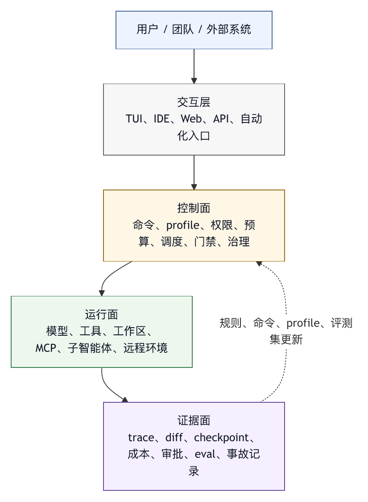

# 第二十一章 从 Harness Core 到 Agent OS

## 21.1 产品化的分水岭

前四编讨论的是 harness 的基本工程结构：模型契约、上下文装配、工具系统、工作区、记忆、权限、沙箱、审批、回滚、trace、评测、成本和质量门禁。一个系统如果把这些要素做完整，已经不再是简单的 API 包装层。它具备了让模型在真实环境中行动的运行基底。

但这仍然不等于一个可以长期使用、可以交付给团队、可以被组织治理的产品。

Harness core 解决的是“智能体怎么运行”。Agent OS 解决的是“智能体如何成为一种日常工作环境”。两者的差异不在模型调用次数，也不在界面是否漂亮，而在系统是否具备持久会话、可复用命令、可配置角色、可安装扩展、可审计权限、可回放轨迹、可恢复工作区、可迁移配置、可管理运行时和可演化生态。

一个成熟的 coding-agent 系统会经历三个阶段。

第一阶段是工具化。系统能把用户目标转成模型调用和工具调用，完成一次任务。

第二阶段是平台化。系统能管理上下文、权限、工作区、trace、回滚和评测，让任务运行可靠。

第三阶段是操作系统化。系统不再只是执行任务，而是成为用户进入工作区、组织流程、加载能力、管理风险和复用经验的入口。

本书把第三阶段称为 Agent OS。

## 21.2 Agent OS 的定义

Agent OS 并非传统意义上的操作系统。它不负责调度 CPU、管理内存页或驱动硬件。本书使用这个概念，是为了强调它在智能体世界中的角色：它是模型、工具、工作区、用户、组织策略和外部系统之间的长期运行环境。

一个 Agent OS 至少包含以下能力：

- 会话系统：保存、恢复、分叉、归档和审计 agent run。
- 命令系统：把可复用流程包装成用户可调用的工作流入口。
- 配置系统：管理模型、工具、权限、记忆、上下文和 UI 偏好。
- Profile 系统：定义主智能体、子智能体、角色、工具集和权限边界。
- 插件系统：把命令、工具、profile、hook、MCP server、主题和领域知识打包分发。
- 运行时系统：支持前台、后台、远程、定时和非交互任务。
- UI 系统：提供对话、工具调用、审批、diff、trace、成本和状态的可理解界面。
- 治理系统：让组织能定义安全策略、审计记录、版本规则和发布门禁。
- 评测系统：把真实运行样本转成回归集，持续改进 harness。

这些能力看起来分散，其实共同回答一个问题：当智能体不再是一次性助手，而成为团队工作基础设施时，系统需要怎样的稳定接口？

API 层面对模型说话。Harness core 面对一次 agent run。Agent OS 面对长期用户、长期项目和长期组织。

## 21.3 从能力清单到运行契约

产品化智能体平台最容易犯的错误，是把能力清单当成架构。系统支持 MCP、支持插件、支持命令、支持子智能体、支持远程运行、支持 git、支持诊断、支持 TUI，看起来很完整，但如果这些能力没有共同契约，用户体验会碎裂，安全模型也会碎裂。

Agent OS 要让大量能力受同一套运行契约约束。

这套运行契约至少包括：

- 权限契约：任何能力最终都要落到 allow、ask、deny 或组织策略。
- 上下文契约：任何扩展注入的内容都必须有来源、作用域、优先级和过期方式。
- 工具契约：任何工具都必须有 schema、风险分类、输出限制和错误语义。
- 会话契约：任何动作都必须能挂接到某个 run、turn、trace 或 checkpoint。
- UI 契约：任何高风险动作都必须能被用户理解、审批、取消或追溯。
- 版本契约：任何配置、插件、命令或 profile 都应有可审查的版本。

没有契约的扩展能力，会把 harness core 拉回混乱状态。一个插件如果能绕开权限系统，插件系统就是安全漏洞。一个命令如果能绕开 trace，命令系统就是审计盲区。一个子智能体如果能继承无限上下文和全部工具，子智能体系统就会放大风险而不是分解任务。

因此，从 harness core 走向 Agent OS 的第一步，是把每个功能接入同一组底层控制面，而不是继续堆功能。

## 21.4 会话是最小持久单元

对用户来说，智能体的工作是一段持续协作，不是一条 API 响应。一次复杂任务可能跨越多个小时、多个工具、多个文件、多个审批、多个测试和多个上下文压缩。系统如果不能保存这段过程，就无法成为日常工作环境。

会话是 Agent OS 的最小持久单元。它记录目标、消息、工具调用、审批、修改、checkpoint、成本、模型参数、上下文压缩、错误和最终结果。会话让用户可以暂停、恢复、分叉、回放和审计。

会话系统要解决四个问题。

第一，连续性。用户离开后回来，系统应知道任务走到哪里，哪些文件被改过，哪些检查已运行，哪些风险尚未处理。

第二，可解释性。用户不应只看到最终回答，还应能查看重要工具调用、修改证据、审批记录和失败恢复路径。

第三，可恢复性。任务出错时，用户应能回到某个 checkpoint，或者至少知道哪些状态已经改变。

第四，可迁移性。团队成员接手一个任务时，不应只能阅读聊天记录，而应看到结构化的执行历史和当前状态。

会话不能无限保存所有文本。成熟系统会把会话分成多个层次：用户可读 transcript、机器可读 trace、可恢复 checkpoint、用于模型的压缩摘要、用于审计的事件记录，以及用于评测的样本抽取。每一层服务不同目的，保留策略也不同。

## 21.5 命令是可复用工作流

当用户反复让智能体做同一类事，系统就需要命令。命令把经验沉淀为可调用工作流，不能只被看作快捷键。

典型命令包括：

- 初始化项目上下文。
- 生成或更新项目规则。
- 运行代码审查。
- 总结长会话。
- 切换模型或推理强度。
- 调整权限模式。
- 执行发布前检查。
- 创建测试计划。
- 生成 PR 描述。
- 触发某类领域流程。

命令的价值在于稳定入口。自然语言足够灵活，但也足够不稳定。用户每次重新描述“帮我按团队规范做一次发布前检查”，模型可能理解不同。命令把这个流程固定下来，让用户、团队和智能体对同一个动作有共同预期。

命令设计有三条原则。

第一，命令应表达意图，而不是泄露实现。`/review` 表达审查意图，具体读哪些文件、运行哪些检查、输出什么结构，应由命令定义和 harness 配置决定。

第二，命令应可发现。命令面板、帮助页、补全、描述和参数提示，是命令系统的一部分。不可发现的命令会变成少数熟练用户的私有技巧。

第三，命令应受治理。命令可能触发工具、读写文件、请求权限、调用外部系统。它不能绕开普通 agent run 的权限、trace 和门禁。

一个匿名 Agent OS 建设案例把 file-defined slash commands 作为第一层产品化能力，这是合理的顺序。因为命令连接了用户工作流和 harness core：它既能让用户更快启动常见流程，也能让团队把已验证流程写成可执行入口。

## 21.6 Profile 与角色化运行时

一个通用智能体很难同时适合所有任务。代码审查、测试修复、文档整理、安全审计、数据分析和发布操作，对模型、工具、权限、上下文和输出格式的要求不同。Agent OS 因此需要 profile 系统。

Profile 可以定义：

- 智能体名称和用途。
- 系统提示和工作风格。
- 默认模型或推理强度。
- 可用工具集。
- 权限策略。
- 最大回合数或成本预算。
- 记忆作用域。
- 允许读取的项目规则。
- 输出格式和质量门禁。

Profile 的工程意义，是把任务类型和运行配置绑定。用户选择“代码审查智能体”，系统就应自动收紧写权限、强调 diff 审阅、启用测试证据要求，并限制外部副作用。用户选择“修复测试智能体”，系统可以开放编辑和诊断工具，但仍要求 diff 和测试证据。用户选择“文档整理智能体”，系统可能主要开放文件读取、文档写入和资料检索，而不需要 shell。

Profile 还为子智能体提供边界。多智能体系统让不同角色在不同工具集、不同上下文窗口和不同目标下工作，并不是把同一个智能体复制多份。研究智能体可以大量读取资料；执行智能体可以修改文件；审查智能体可以只读 diff；发布智能体可以准备材料但需要审批才能触发外部动作。

Profile 的风险在于“角色幻觉”。如果 profile 只是一段自我介绍，而没有工具、权限、上下文和门禁的实质变化，它只是提示词包装。有效的 profile 应改变运行时。

## 21.7 插件是能力分发机制

当命令、profile、工具、MCP server、hook、主题和规则都可以被配置后，系统会自然需要插件。插件用于解决能力分发和版本治理，不是为了让产品看起来开放。

团队希望把一套安全审查流程发给所有仓库。平台组希望把内部 issue、CI、文档和审批系统接入智能体。领域专家希望把数据分析流程、日志检索工具和常用诊断命令打包。开源社区希望分享某个语言栈的 LSP、测试命令和常用实践。插件是这些能力的容器。

一个可用的插件系统至少要回答：

- 插件包含什么能力？
- 插件由谁发布？
- 插件需要哪些权限？
- 插件安装到用户级、项目级还是组织级？
- 插件版本如何升级和回滚？
- 插件是否能运行代码？
- 插件是否能注入上下文？
- 插件是否能注册工具或 MCP server？
- 插件数据存放在哪里？
- 插件卸载后是否清理状态？

插件系统的安全边界比普通配置更复杂。因为插件通常来自用户、团队、组织或社区。它可能包含可执行代码，也可能包含 prompt、hook、MCP 配置和默认权限。如果插件缺少信任模型，Agent OS 会把供应链风险引入行动循环。

因此插件需要 manifest、命名空间、签名或来源标识、权限声明、版本锁定、缓存隔离和审计记录。插件能力越强，安装和启用时越需要清晰展示风险。

插件不能成为绕开 harness 的特权通道。插件系统越成熟，越应把插件能力纳入统一权限、trace、上下文和评测体系。

## 21.8 任务队列、后台运行与远程运行

Agent OS 一旦进入真实工作流，就会遇到时间问题。并非所有任务都适合在前台对话中等待完成。代码迁移、长测试、资料整理、批量审查、依赖升级、文档生成、问题扫库和周期性检查，可能需要后台运行或远程运行。

后台运行要求系统具备任务队列。任务不再只是当前终端里的一段输出，而是有 id、状态、日志、取消、恢复、结果、失败原因和通知策略。用户应能查看正在运行的任务，暂停或取消任务，并在任务完成后接收摘要。

远程运行进一步引入环境管理。系统需要知道任务在哪个工作区、哪个容器、哪个分支、哪个权限配置、哪个凭据范围和哪个网络边界中执行。远程智能体的危险不比本地智能体小，只是风险形态不同。远程环境如果默认联网、默认有仓库写权限、默认能访问组织凭据，那么它需要比本地更强的审批和审计。

任务队列还会影响上下文。前台对话中的用户即时反馈，在后台任务中不一定存在。系统必须提前定义遇到不确定性时的行为：自动降级、暂停等待、选择保守路径，还是失败并报告。无人值守任务尤其不能把所有“需要问用户”的情况变成擅自决定。

成熟 Agent OS 会同时支持交互式任务、非交互任务、后台任务和远程任务，但它们共享同一组运行证据：目标、环境、权限、trace、成本、产物、门禁和最终状态。

## 21.9 UI 是控制面，不只是显示层

Agent OS 的 UI 不能被理解成“把模型输出显示给用户”。它是控制面。

用户通过 UI 理解系统状态：智能体正在做什么，为什么需要权限，修改了哪些文件，成本是多少，是否快到上下文上限，当前模式是否只读，哪些子任务仍在运行，哪些测试失败，哪些门禁未过。

用户也通过 UI 介入系统：批准或拒绝工具调用，切换模型，暂停任务，分叉会话，恢复 checkpoint，打开 diff，查看 trace，调整权限，运行命令，安装插件，选择 profile。

因此 UI 设计是 harness 安全和可靠性的一部分，不只是表层体验。一个权限系统如果 UI 表达不清，用户就无法做出有效审批。一个 trace 系统如果 UI 不能浏览，审计价值会下降。一个回滚系统如果 UI 找不到入口，事故恢复会变慢。一个命令系统如果 UI 不可发现，团队实践无法规模化。

一个匿名 Agent OS 建设案例把 terminal-first TUI、timeline、inspector、command palette、approval、composer 和 statusline 放入产品化矩阵，说明它已经把 UI 当作运行基底的一部分，而非事后装饰。这是 Agent OS 与脚本式 CLI 的重要差异。

## 21.10 治理配置：个人、项目与组织

Agent OS 必须处理多层配置。

个人配置包括用户偏好、默认模型、编辑习惯、常用命令、主题、快捷键和个人记忆。

项目配置包括仓库规则、测试命令、代码风格、目录边界、默认权限、项目命令、项目 profile、项目插件和本地 MCP server。

组织配置包括安全策略、允许模型、允许插件、网络边界、审计要求、凭据规则、审批策略、数据保留、合规要求和发布门禁。

这些配置经常冲突。用户希望放宽权限，组织策略可能禁止。项目希望使用某个插件，组织可能要求先审查。个人记忆可能与项目规则矛盾。Agent OS 需要明确优先级，并在 UI 和 trace 中展示实际生效的配置。

配置还应可迁移。一个项目的智能体能力不应只存在某个用户电脑上的隐式状态中。可共享的命令、profile、规则和插件应进入项目或组织配置；个人偏好则留在用户层。边界越清楚，团队协作越稳定。

## 21.11 建设顺序

从 harness core 演进到 Agent OS，不宜从最炫的功能开始。合理顺序应围绕控制面展开。

第一，稳住权限与命令。权限决定安全底座，命令决定用户如何复用流程。

第二，建立 profile 与扩展结构。让不同任务类型拥有不同运行配置，让能力能够以文件和包的形式分发。

第三，强化 UI。把 transcript、timeline、审批、diff、状态、命令面板和 inspector 做成用户每天愿意使用的工作面。

第四，补齐工程工作流。包括 git、诊断、LSP、PR、测试、checkpoint、回滚和质量门禁。

第五，产品化运行时。包括后台任务、事件流、远程运行、打包分发、升级、遥测、发布门禁和组织治理。

这个顺序背后的原则是：先让能力可控，再让能力可扩展，然后让能力可见，再让能力规模化。跳过前面的控制面直接做市场、插件和远程任务，往往会把风险放大。

## 21.12 典型失败模式

从 harness core 走向 Agent OS 时，常见失败模式包括以下几类。

第一，把插件当成文件夹约定。没有 manifest、权限声明、版本和信任模型，插件系统会变成无法治理的脚本集合。

第二，把命令当成 prompt 模板。命令如果不接入权限、trace、参数校验和门禁，就只是更短的自然语言。

第三，把 profile 当成角色扮演。Profile 如果不改变工具集、权限、预算和上下文，就不能降低实际风险或提高质量。

第四，把会话当成聊天记录。聊天记录不能替代结构化 trace、checkpoint、成本、审批和工作区状态。

第五，把 TUI 当成输出容器。成熟 TUI 要支持状态理解、命令发现、审批、diff、回滚和任务控制。

第六，把远程运行当成本地运行的搬家。远程环境涉及凭据、网络、分支、并发、资源、数据留存和组织审计，不能只把命令丢到云端。

第七，把组织治理后置。等插件、命令、远程任务和后台任务都上线后再补治理，代价通常很高。

这些失败模式的共同根源，是把 Agent OS 看成“更多功能”，没有把它当作长期运行环境。

## 21.13 Agent OS 检查表

评估一个 harness core 是否已经接近 Agent OS，可以使用以下检查表。

会话：

- 是否支持保存、恢复、分叉和归档？
- 是否有结构化 trace，而不只是聊天文本？
- 是否能关联工具调用、审批、diff、checkpoint 和成本？

命令：

- 是否支持用户级、项目级和组织级命令？
- 命令是否可发现、可描述、可参数化？
- 命令是否进入同一权限和 trace 系统？

Profile：

- 是否能定义不同智能体角色？
- Profile 是否实际改变模型、工具、权限、预算和上下文？
- 子智能体是否有独立上下文和清晰返回协议？

插件：

- 是否有 manifest、命名空间、版本和来源？
- 插件权限是否可见、可审批、可撤销？
- 插件是否能被组织允许、禁止或固定版本？

运行时：

- 是否支持前台、后台、非交互和远程任务？
- 任务是否有状态、取消、日志、产物和失败语义？
- 无人值守任务遇到不确定性时是否有保守策略？

UI：

- 用户是否能看到当前模式、权限、成本、上下文、任务状态和风险？
- 审批是否展示足够信息？
- Diff、trace、工具输出和回滚入口是否可用？

治理：

- 个人、项目和组织配置是否分层？
- 策略冲突是否有明确优先级？
- 配置和插件变化是否可审计？

演化：

- 真实运行样本是否能进入评测和回归集？
- 失败是否能沉淀为命令、规则、profile、工具校验或测试？
- 发布前是否有质量门禁？

能通过这张检查表的系统，才有资格被称为 Agent OS。

## 21.14 图 21-1：Agent OS 参考架构

为了避免“功能堆叠式产品化”，图 21-1 将 harness core、Agent OS、插件和企业控制面放入同一个参考架构。

<figure><figcaption><p>图 21-1：Agent OS 参考架构</p></figcaption></figure>

交互层负责用户入口。它包括终端 TUI、IDE 插件、Web 面板、API、自动化任务和外部系统回调。交互层不直接决定安全策略，而是把用户意图、审批动作、命令选择和验收反馈转化为结构化事件。

控制面负责决策。它包括命令解析、profile 选择、权限策略、上下文策略、插件解析、任务调度、预算分配、门禁选择和组织治理。控制面决定“允许做什么、用什么能力做、在哪里做、做到什么标准为止”。

运行面负责行动。它包括模型调用、工具执行、文件编辑、shell、浏览器、MCP server、代码索引、远程环境、后台队列和子智能体执行器。运行面只执行已经被控制面审查过的动作。

证据面负责记录和学习。它包括 transcript、trace、metrics、logs、checkpoint、diff、审批记录、成本记录、eval dataset、事故记录和规则版本。证据面让系统可调试、可审计、可恢复、可评测。

这四层并不是部署边界。一个本地 CLI 可以同时包含四层，一个企业平台也可以把它们拆成多个服务。职责边界必须清楚。交互层不能绕开控制面直接触发高风险工具；插件不能绕开证据面隐藏动作；运行面不能根据模型文本自行扩大权限；证据面不能只依赖最终自然语言回答。

可以用下面的责任图理解这四层：

```text
用户 / 团队 / 外部系统
        |
        v
交互层：TUI、IDE、Web、API、自动化入口
        |
        v
控制面：命令、profile、权限、预算、调度、门禁、治理
        |
        v
运行面：模型、工具、工作区、MCP、子智能体、远程环境
        |
        v
证据面：trace、diff、checkpoint、成本、审批、eval、事故记录
        |
        +------> 反馈到控制面：规则、命令、profile、评测集更新
```

作者整理的匿名工程案例可作为分层结构的案例：一个 coding-agent harness 一旦同时具备工具注册、权限模式、上下文压缩、多智能体调度、会话、checkpoint、diagnostics 和终端 TUI，就已经在向 Agent OS 的分层形态靠近。 第五编的任务，是把这种结构进一步产品化。

## 21.15 Agent OS Manifest：把平台能力写成合约

Agent OS 需要一个能被人和系统共同理解的 manifest。它既是单个配置文件的格式标准，也是一种设计方法：把会话、命令、profile、插件、运行时和治理能力写成可审查合约。

一个简化的 Agent OS manifest 可以这样表达：

```yaml
agent_os:
  identity:
    name: engineering-agent-os
    version: 0.8.0
    scope: organization
  interfaces:
    terminal_tui: true
    ide_panel: true
    web_tasks: false
    api: limited
  session:
    resume: true
    fork: true
    checkpoint: file_and_diff
    retention_days: 90
  commands:
    sources:
      - builtin
      - project
      - organization
    require_trace: true
    require_parameter_schema: true
  profiles:
    default: coding-interactive
    allowed:
      - readonly-review
      - coding-interactive
      - release-prep
  plugins:
    install_scope:
      user: allowed
      project: review_required
      organization: admin_only
    require_manifest: true
    require_permission_declaration: true
  runtime:
    local_workspace: allowed
    remote_workspace: approval_required
    background_tasks: allowed
    scheduled_tasks: restricted
  governance:
    approval_policy: risk_based
    audit: required
    allowed_models: organization_policy
    quality_gate: task_type_based
```

Manifest 的价值是把平台边界显性化。用户知道系统支持哪些入口；项目维护者知道命令从哪里来；安全团队知道插件如何安装；平台工程师知道远程运行是否可用；审稿人知道证据保留多长时间。

没有 manifest 的 Agent OS 很容易依赖隐式约定。某个团队以为项目命令可以覆盖组织命令，另一个团队以为组织命令不可覆盖；某个插件默认启用网络工具，另一个项目默认禁止网络；某个远程任务保留 trace，另一个只保留最终文本。这些差异会在事故中集中暴露。

## 21.16 案例：插件绕过控制面带来的治理断裂

设想一个团队为内部代码库安装了“发布助手”插件。插件提供 `/release-check` 命令，能读取 changelog、检查版本、生成发布说明，并调用内部发布 API 预创建发布单。最初这个插件很受欢迎，因为它把繁琐流程变成一个命令。

事故发生在一次紧急修复中。用户在只读审查 profile 下运行 `/release-check`，以为系统只会检查发布材料。插件内部却直接调用了外部 API 创建草稿发布单，并且没有走主 harness 的审批对象。由于插件动作没有进入统一 trace，最终会话只显示“发布检查完成”，审计系统却记录了一个外部对象被创建。

复盘发现问题不在插件功能本身，而在 Agent OS 没有要求插件接入统一控制面。插件命令有自己的权限判断、自己的日志和自己的外部 API 客户端；主系统只把它当成一段本地脚本执行。

修复方案包括：

1. 插件 manifest 必须声明外部副作用和所需权限。
2. 插件注册的命令必须提供参数 schema 和风险等级。
3. 插件工具调用必须通过统一工具执行器，而不是直接访问外部系统。
4. 插件产生的外部对象 id 必须进入 trace 和证据包。
5. 只读 profile 下禁止执行有外部副作用的插件动作。
6. 组织可固定插件版本，并要求高风险插件经过审查。

Agent OS 的难点在于让插件成为受治理的能力分发机制，而不只是支持插件。Claude Code 插件资料可支撑 manifest、技能、智能体、hook、MCP server、缓存与路径变量等能力项；本书进一步要求，这些能力一旦进入组织场景，就必须纳入权限、trace 和版本治理。〔注21-2〕

## 21.17 Session Lifecycle：会话生命周期设计

会话系统不仅要保存聊天记录，还要管理生命周期。一个 Agent OS 中的会话通常会经历以下状态：

```text
created
  |
  v
context_loaded
  |
  v
running
  |
  +--> waiting_for_approval
  |
  +--> paused_by_user
  |
  +--> background_running
  |
  +--> budget_stopped
  |
  +--> failed
  |
  +--> completed
  |
  v
archived / forked / resumed / converted_to_eval
```

每个状态都应有清楚语义。`paused_by_user` 表示用户主动暂停，保留恢复入口；`waiting_for_approval` 表示系统需要外部决定，不能继续行动；`budget_stopped` 表示任务停止但不等于失败或完成；`completed` 必须绑定质量门禁证据；`converted_to_eval` 表示某个真实运行样本被提取为后续评测用例。

会话生命周期还要处理分叉。用户可能希望从某个中间计划重新尝试，或让另一个模型用同一上下文继续。分叉不应覆盖原会话，也不应混淆 trace。每个分支应有自己的 run id、预算、权限和最终状态，同时保留与父会话的关系。

长期看，会话是组织学习的入口。一次失败会话可以转成事故记录，一次成功会话可以转成命令模板，一次复杂审稿可以转成评测样本，一次高质量修复可以转成项目规则。Agent OS 的“OS”感，正来自这些工作痕迹可以被保存、复用和治理。

## 21.18 Agent OS 与平台团队

Agent OS 最终会改变平台团队的工作方式。过去，平台团队主要提供 CI、代码托管、权限系统、内部工具、文档平台和发布流程。Agent OS 出现后，这些能力会被智能体以工具、命令、profile 和插件形式调用。平台团队不再只是给人提供按钮，也是在给智能体提供可治理接口。

这要求平台团队重新设计内部能力：

- API 要有面向智能体的 schema、错误语义和幂等性。
- 工具要有权限等级、审计事件和撤销路径。
- 文档要能被检索、引用和版本化。
- 发布流程要能区分准备材料、创建草稿、提交审批和实际发布。
- CI 和测试结果要能进入 trace，而不是只出现在网页。
- 组织策略要能被 Agent OS 读取并解释给用户。

如果平台能力没有结构化，智能体只能像人一样操作网页、复制文本、猜测错误含义。这种方式短期可行，长期脆弱。Agent OS 的成熟会推动企业内部平台从“人类界面优先”走向“人类界面和智能体接口并重”。

OpenAI Codex CLI、云端任务和企业治理资料显示，终端 coding agent、本地工作区、云端任务、组织可观测性和权限治理已经被放进同一类产品叙事中讨论。〔注21-3〕 本书据此判断，Agent OS 不会停留在个人工具层面，它会逐步进入平台工程和组织治理边界。

## 21.19 Agent OS 的对象模型

Agent OS 要把长期工作环境中的对象关系稳定下来，而不是把许多功能放在同一个界面里。对象模型越清楚，系统越容易扩展；对象模型越模糊，命令、插件、profile、会话、任务和权限就会互相覆盖，最终只能靠经验排查问题。

一个实用的 Agent OS 至少应包含以下核心对象：

- `User`：操作者、审批人、审稿人和任务拥有者。
- `Workspace`：代码库、文档集、数据项目或远程运行环境。
- `Session`：长期协作上下文，包含消息、run、checkpoint、trace 和产物。
- `Run`：一次具体执行，绑定模型、预算、工具、权限和门禁。
- `Command`：可复用工作流入口，带参数、风险等级和输出契约。
- `Profile`：角色化运行配置，定义模型、工具、权限、上下文和质量标准。
- `Plugin`：能力包，分发命令、工具、profile、hook、MCP server 或规则。
- `Policy`：组织、项目或用户层的约束。
- `Artifact`：diff、报告、测试结果、发布材料、外部对象引用和证据包。
- `EvaluationSample`：从真实运行中抽取的评测或回归样本。

这些对象提供工程语言，不是数据库表设计。团队讨论一个问题时，必须知道它发生在哪个对象上。比如“这个命令为什么能写外部系统”，应检查 command 的风险等级、profile 的权限、plugin 的 manifest、policy 的优先级和 run 的审批 trace。若对象边界不清，问题会被模糊地归结为“智能体做错了”。

对象模型还决定 UI。用户不应只看到一串对话，而应能看到当前 workspace、session、run、profile、命令、任务状态和证据包。平台团队不应只保存日志，而应能按这些对象查询事故：某个插件版本导致多少次门禁失败，某个 profile 下的测试修复成功率是否下降，某个 workspace 的审批等待是否异常。

## 21.20 事件总线与状态同步

Agent OS 中的所有能力都应通过事件连接。模型输出、工具调用、审批、文件修改、任务暂停、队列调度、插件安装、配置变更、门禁结果和用户反馈，都应成为结构化事件。事件用于让 UI、trace、恢复、审计和评测看到同一套事实，不是为了追求架构时髦。

一个典型事件可以包含：

```yaml
agent_os_event:
  id: evt_00192
  type: tool.call.completed
  session_id: sess_48
  run_id: run_13
  workspace_id: repo_payment
  actor:
    kind: agent
    profile: coding-interactive
  payload:
    tool_name: run_tests
    exit_code: 0
    output_summary_ref: artifact_test_summary_7
  policy:
    permission_decision: allowed
    risk_tier: medium
  timestamp: 2026-05-28T10:12:43Z
```

事件总线解决三个问题。

第一，UI 与运行时同步。终端、IDE、Web 面板和后台任务列表看到的状态应来自同一事件流，而不是各自解析文本输出。若各界面自行解析文本，一个界面可能显示“运行中”，另一个界面却显示“已完成”，用户会失去信任。

第二，恢复和回放。会话恢复需要重建关键状态，而不是把聊天文本重新喂给模型：哪些文件变了，哪些检查通过，哪些审批等待，哪些门禁失败。事件流越完整，恢复越可靠。

第三，审计与评测。审计需要稳定事件，评测需要从事件中抽取行为样本。若工具调用只存在于终端输出中，后续无法形成评测集和事故包。

事件总线不要求所有数据都实时写入一个中心服务。本地 Agent OS 可以把事件写入本地日志和 trace 文件；企业平台可以写入流式管线。事件 schema 需要稳定，来源要清楚，隐私分层要明确，高风险事件也不能被随机采样丢弃。

## 21.21 命令系统的工程化

第二十一章前面已经说明命令是可复用工作流。进一步看，命令系统本身需要工程化。缺少工程化约束时，slash command 会退化为一批提示词片段，既不可测试，也不可治理。

一个成熟命令应包含：

- 名称、描述和适用场景。
- 参数 schema 与默认值。
- 允许的 profile 和权限要求。
- 需要读取的上下文来源。
- 可能调用的工具类别。
- 输出格式。
- 质量门禁。
- 失败和暂停策略。
- 示例和反例。
- 版本与变更记录。

例如 `/review` 不应只是“请审查代码”。它可以定义为只读 profile、默认读取 diff 和相关规则、禁止修改文件、输出按严重度排序的问题、要求引用文件和证据、禁止把风格偏好写成缺陷。`/release-prep` 则可以要求版本、changelog、CI 状态、风险清单、回滚方案和审批状态。

命令还需要测试。团队可以准备典型输入和期望输出，检查命令是否调用了正确 profile、是否越权、是否生成证据包、是否在缺证据时停止。命令一旦成为组织流程入口，就不应完全依赖人工记忆。

Claude Code 和 Codex CLI 的命令资料可作为命令系统产品化的两个例子：它们都把 slash command 作为会话控制、权限调整、上下文管理或工作流入口的一部分。〔注21-4〕 但书中的重点是抽象出工程要求，而不是复制某个产品命令：命令必须接入权限、trace、参数校验、用户界面和质量门禁。

## 21.22 Profile Registry 与角色边界

Profile 不应散落在个人配置里。Agent OS 需要 profile registry，让团队知道有哪些角色、谁维护、适用什么场景、风险等级是什么、默认工具有哪些、能否作为子智能体使用。

Profile registry 可以记录：

```yaml
profile:
  id: readonly-review
  owner: platform-quality
  purpose: 审查 diff 和证据，不修改文件
  model_tier: reasoning
  tools:
    allow:
      - read_file
      - search
      - inspect_diff
    deny:
      - edit_file
      - shell_write
      - external_write
  context_policy:
    include_project_rules: true
    include_user_memory: false
  gates:
    required:
      - final_claims_have_evidence
  can_run_as_subagent: true
```

Profile registry 的价值，是把角色边界从提示词中拉出来。用户选择只读审查 profile，系统就应在工具层拒绝编辑；选择发布准备 profile，系统可以生成材料，但需要审批才能写入外部系统。角色边界应由运行时保证，不能只依赖模型承诺。

Registry 还支持版本治理。一个安全审查 profile 修改了工具集，可能影响大量任务；一个测试修复 profile 调整了默认模型，可能改变成本和成功率。这些变化应有版本、评测和回滚。子智能体也应引用明确 profile 版本，避免主智能体调用“当前默认审查员”时行为悄悄变化。

Claude Code 子智能体资料显示，子智能体可以拥有独立的系统提示、上下文窗口、工具集合、权限模式、MCP server 作用域和技能预加载配置。〔注21-5〕 Profile registry 正是把这些边界产品化的地方。它让子智能体不再是自由生成的角色，而是受控运行实体。

## 21.23 插件生命周期

插件系统不能只考虑安装。一个插件从发现、审查、安装、启用、运行、升级、禁用到卸载，都有治理问题。

插件生命周期可以分为七步。

第一，发现。用户或项目看到一个插件，系统应展示来源、作者、版本、能力和权限需求。

第二，审查。组织或项目维护者检查插件 manifest、可执行代码、MCP server、hook、默认设置、外部连接器和数据保留。

第三，安装。插件进入用户、项目或组织作用域，并写入版本锁定和来源记录。

第四，启用。插件的命令、工具、profile 或 hook 被注册到 Agent OS，但仍受统一权限和策略约束。

第五，运行。插件动作进入 trace，外部副作用进入审计，工具输出进入统一裁剪和脱敏管线。

第六，升级。插件升级需要变更摘要、权限差异、兼容性检查和必要的回滚入口。

第七，禁用或卸载。系统应停止注册能力，清理缓存或保留必要审计，并说明历史 run 仍引用旧插件版本。

插件最难的是“默认能力”。一个插件可能默认注入上下文、注册 hook、启动后台监控、添加 MCP server 或改变项目设置。用户安装时如果只看到“安装成功”，没有看到这些默认动作，Agent OS 就把风险藏起来了。Claude Code 插件资料列出了 manifest、技能、智能体、hook、MCP server、LSP server、监控、主题、路径变量和持久数据目录等能力项；这些能力越丰富，生命周期治理越重要。〔注21-2〕

成熟 Agent OS 应支持插件权限差异审查。升级前后若新增网络、外部写入、后台任务、敏感路径读取或组织配置修改，系统必须提示并可能要求重新审批。插件生态的信任，不来自“大家都能装”，而来自“能力变化可见、可控、可回滚”。

## 21.24 运行时底座：本地、远程、后台与定时

Agent OS 的运行时包含一组环境形态。本地交互、远程工作区、后台任务和定时任务各有边界。

本地交互适合高反馈任务。用户能看到工具调用、审批请求、diff 和测试结果，能及时干预。但本地环境可能受个人机器状态影响：依赖不完整、缓存污染、未提交修改、网络不同、凭据混杂。

远程工作区适合可复现和长任务。平台可以提供稳定镜像、隔离网络、统一凭据和可审计运行。但远程环境离用户更远，必须明确分支、文件同步、产物回传、权限边界和成本归属。

后台任务适合长时间运行。它要求队列、状态、取消、恢复、通知和失败语义。后台任务不能假设用户随时在线，遇到不确定性时应暂停或按预设降级。

定时任务适合周期性检查，如依赖风险扫描、文档过期检测、测试失败 triage、知识库健康检查。定时任务风险在于“无人值守”。它应有更严格的外部副作用限制、更低权限默认值和更强告警。

OpenAI Codex 的云端任务、审批安全和企业治理资料提供了一个产品侧参照：本地工作、云端环境、审批策略、审计和组织级可观测性正在共同构成 coding agent 的运行边界。〔注21-6〕 本书据此归纳，Agent OS 的运行时边界正在从单机 CLI 扩展到平台级环境。工程设计上，不同运行时应共享同一套对象模型、权限语义、trace 和门禁，避免每种环境各自实现一套规则。

## 21.25 工作区生命周期与产物治理

Agent OS 必须管理工作区生命周期。工作区是智能体能行动的状态容器，不只是目录路径。它包含源码、配置、依赖、生成物、缓存、索引、临时文件、checkpoint、分支、外部对象引用和运行产物。

一个工作区生命周期通常包括：

- 创建：选择来源、分支、权限、镜像和初始配置。
- 准备：安装依赖、建立索引、加载项目规则、生成上下文摘要。
- 运行：文件读取、编辑、测试、构建、诊断和外部工具调用。
- 暂停：保存当前状态、未完成任务、打开审批和预算信息。
- 恢复：重建环境、校验文件变化、恢复索引和上下文。
- 归档：保存证据、产物、diff、trace 和必要日志。
- 清理：删除临时文件、释放资源、撤销短期凭据。

产物治理尤其容易被忽略。智能体可能生成报告、补丁、截图、日志摘要、测试结果、发布说明、数据表和外部对象草稿。哪些产物应进入最终交付，哪些只用于中间推理，哪些包含敏感信息，哪些需要长期保留，都应有策略。

工作区生命周期还要处理用户未提交修改。Agent OS 不能把工作区当成干净沙箱。用户可能有未保存想法、另一个工具生成的文件、IDE 自动格式化、CI 缓存和临时调试脚本。工作区 manifest、checkpoint 和 diff 审查是保护协作状态的基础。匿名工程案例已经把工作区路径限制、会话、checkpoint 和 TUI 作为完整 harness 的组成部分；这些能力在 Agent OS 层必须产品化。

## 21.26 配置优先级与冲突解释

Agent OS 中最棘手的日常问题之一，是配置冲突。个人偏好、项目规则、组织策略、插件默认值、命令参数、profile 设置和一次性用户指令，经常同时作用于同一个 run。

成熟系统不应只给出最终配置，还应能解释配置如何合并。可以采用以下优先级原则：

- 安全、合规和组织强制策略优先于所有下层设置。
- 项目规则优先于个人偏好，因为工作区属于团队协作对象。
- Profile 决定任务角色边界，用户指令不能绕开角色禁止项。
- 命令参数可以调整执行细节，但不能放宽权限和门禁。
- 插件默认值只能在其声明作用域内生效，不能覆盖组织策略。
- 临时用户指令可以收紧范围，也可以请求例外，但例外需要记录。

冲突解释应进入 UI 和 trace。例如：“用户请求自动发布，但当前 profile 只允许发布准备；组织策略要求外部发布必须审批，因此本次只生成发布材料。” 这样的解释比简单拒绝更有价值，因为它告诉用户系统遵守的是哪条边界。

配置合并也需要版本。一个 run 使用了哪个组织策略版本、哪个项目规则版本、哪个 profile 版本、哪个插件版本，应能在 trace 中查询。事故发生时，团队不能用今天的策略解释昨天的行为。第二十九章将讨论版本管理与迁移；这里先强调，Agent OS 的每一次行动都应绑定可追溯配置。

## 21.27 Agent OS 安全模型

Agent OS 的安全模型不能只依赖权限弹窗。它需要分层：身份、策略、运行环境、工具边界、数据边界、外部副作用、审计和恢复。

身份层回答“谁在操作”。用户、智能体、插件、子智能体、后台任务和远程运行环境都应有可区分主体。不要把所有动作都记成某个通用服务账号。

策略层回答“允许做什么”。策略包括组织规则、项目规则、profile 权限、插件权限、命令风险等级和用户审批。策略应能表达只读、编辑、外部写入、网络访问、敏感路径、发布和定时任务。

运行环境层回答“在哪里做”。本地、sandbox、容器、远程 workspace 和生产连接器应有不同网络、文件系统和凭据边界。

工具边界回答“通过什么接口做”。所有工具调用应有 schema、风险等级、输出治理和错误语义；插件不应直接绕开工具执行器。

数据边界回答“看到了什么”。上下文注入、记忆、检索、文件读取、日志保存和 trace 导出都应有隐私分层。

外部副作用回答“改变了什么”。PR、issue、邮件、日程、表格、发布单、云资源和生产 API 都应记录外部对象 id、审批和补偿路径。

审计和恢复回答“出了问题怎么办”。系统需要不可篡改的关键事件、可冻结事故包、可回滚 checkpoint 和清晰的责任链。

MCP Authorization 规范支撑远程 server、授权服务器、受保护资源元数据、客户端注册与 OAuth 相关关系的连接授权问题；OWASP MCP 风险清单强调 shadow server、tool poisoning、scope creep、上下文过度共享和审计缺失等风险；Codex 安全运行资料则提供 sandbox、approval policy、网络边界和遥测等产品控制点。〔注21-7〕 本书据此归纳：开放工具生态必须与授权、最小权限、审计和隔离一起设计。Agent OS 安全模型的挑战，是把这些原则统一到日常可用的产品体验中。

## 21.28 Agent OS 的运营指标

Agent OS 一旦成为团队基础设施，就需要运营指标。只看日活、调用次数或 token 消耗，不足以判断平台是否健康。

可以观察以下指标：

- 会话完成率、恢复率、分叉率和归档率。
- 命令使用分布、命令失败率和命令回归问题。
- Profile 使用分布、越权拦截率和任务匹配度。
- 插件安装、升级、禁用、权限变更和事故关联。
- 前台、后台、远程和定时任务的成功率、等待时间和取消率。
- 权限审批通过率、拒绝率、超时率和误批复盘。
- 工作区恢复成功率、checkpoint 使用率和回滚耗时。
- Trace 完整率、证据包生成率和门禁通过率。
- 用户对最终回答可信度、等待体验和可控性的反馈。
- 从真实运行转化为 eval、命令、规则或插件改进的比例。

这些指标要按任务类型和风险等级分组。一个只读问答任务与发布准备任务不能放在同一成功率里比较。平台团队应特别关注失败后的恢复体验：用户能否理解失败原因，能否继续，能否把失败转成改进资产。

Agent OS 的运营指标也应连接组织学习。若某个命令频繁失败，可能需要改命令定义或上下文策略；若某个 profile 容易触发审批拒绝，可能角色边界设计不清；若某类插件导致成本异常，可能需要插件输出治理；若远程任务经常等待用户，可能无人值守策略不成熟。

## 21.29 兼容性、迁移与废弃

平台越成功，越需要面对兼容性。命令会改名，profile 会调整工具集，插件 manifest 会升级，trace schema 会演进，远程运行环境会换镜像，组织策略会变严。没有迁移设计的 Agent OS 会很快被历史配置拖住。

兼容性治理至少包括：

- 命令版本：旧命令是否仍可运行，参数变化如何提示。
- Profile 版本：角色权限变化是否触发评测或审批。
- 插件 API：manifest 字段、hook 语义、MCP server 配置和缓存位置如何迁移。
- Trace schema：历史 run 如何查询，新旧字段如何映射。
- 工作区状态：旧 checkpoint 是否能恢复，旧索引是否失效。
- 组织策略：新策略是否追溯影响旧会话，例外如何处理。

废弃比新增更难。一个低质量命令可能仍被少数团队依赖，一个高风险插件可能仍在某个项目中使用，一个旧 profile 可能出现在历史任务模板里。Agent OS 应支持废弃公告、使用者统计、迁移建议、自动替换、兼容窗口和强制禁用。

MCP SEP-2577 关于 Roots、Sampling 和 Logging 的废弃提案，是协议能力会演化的一个直接案例。〔注21-8〕 Agent OS 不应把某个协议版本的具体能力写死成长期架构前提。更稳妥的做法，是在内部对象模型中保留抽象：文件边界、模型代调用、日志采集、授权和审计都应由 Agent OS 自己治理，具体协议只是实现方式之一。

## 21.30 从个人工具到组织平台

Agent OS 的采用路径通常从个人工具开始。一个工程师在终端里使用智能体修 bug、写测试、总结文档；随后团队沉淀项目命令和规则；再往后，组织开始要求权限、审计、插件审查、成本治理和发布门禁。

不同阶段的重点不同。

个人阶段，重点是流畅性：会话恢复、命令可发现、diff 清楚、审批不烦、上下文好用。

团队阶段，重点是一致性：项目规则、共享命令、profile、测试策略、审稿评分准则、工作区保护。

组织阶段，重点是治理：允许模型、插件审查、外部连接器、远程环境、审计、成本、数据保留和合规。

平台阶段，重点是生态：插件市场、统一事件、指标、评测、迁移、培训、支持和路线图。

如果组织在个人阶段就强行引入完整治理，用户可能觉得平台笨重；如果组织到了平台阶段仍把 Agent OS 当个人工具，风险会迅速放大。建设节奏必须匹配采用阶段。一个匿名 Agent OS 建设路径可作为案例：它把能力矩阵和实施顺序放在一起，体现的正是这种路径问题，即先建立可控入口，再扩展生态和远程能力。

## 21.31 Agent OS 的产品边界

Agent OS 不需要替代所有开发工具、项目管理工具、CI 平台、文档平台和安全平台。它的产品边界是“让智能体在这些系统之间可靠工作”。如果边界过宽，Agent OS 会变成另一个庞大平台；边界过窄，它又只能是聊天壳。

可以用三个问题判断边界：

第一，这个能力是否直接影响智能体行动？如果影响，例如权限、工具、上下文、trace、命令和 profile，就应进入 Agent OS 控制面。

第二，这个能力是否已有成熟系统承载？如果已有，例如 Git 托管、CI、云资源、文档库和工单系统，Agent OS 更适合接入和治理，而不是重建。

第三，这个能力是否需要跨任务复用？如果只是一次性输出，可以留在会话；如果会被团队反复使用，就应沉淀为命令、profile、插件、规则或评测。

产品边界清楚后，团队就不会把 Agent OS 做成万能入口，也不会让它退化成模型对话窗口。它应像一个工作环境的控制层：理解用户目标，调动外部系统，保持证据，执行策略，并把经验沉淀为可复用资产。

## 21.32 常见反模式

从 harness core 走向 Agent OS 时，还会出现一些更隐蔽的反模式。

第一，先做插件市场，后做权限模型。这样会把供应链、外部副作用和上下文污染问题放大。

第二，先做远程任务，后做工作区生命周期。远程任务若没有 checkpoint、分支、产物和凭据治理，会让失败难以恢复。

第三，先做漂亮 UI，后做事件模型。界面看起来丰富，但状态来自文本解析，长期必然不一致。

第四，把组织配置写成静态文档。Agent OS 需要机器可读策略；只靠文档提醒，无法稳定约束工具和插件。

第五，把所有能力都放进默认 profile。默认 profile 越强，越难解释风险，也越容易诱发越权。

第六，把历史会话当作无限记忆。会话应被分层、压缩、归档和抽样，不应把所有历史原文长期塞进模型上下文。

第七，忽略迁移成本。命令、profile、插件和 trace schema 一旦被团队依赖，修改就需要版本和兼容策略。

第八，把 Agent OS 只看成产品包装。Agent OS 是对象模型、运行契约、证据链和组织治理的组合。没有这些，功能越多，系统越难信任。

## 21.33 第二十一章小结

Harness core 让模型能够在真实环境中行动。Agent OS 让这种行动成为长期、可扩展、可治理、可恢复、可审计的工作环境。

从 harness core 到 Agent OS，需要让会话、命令、profile、插件、任务队列、UI、权限、trace 和治理共享同一套运行契约，而不是增加功能数量。这样，智能体才能从一次性助手变成组织级生产力基础设施。
