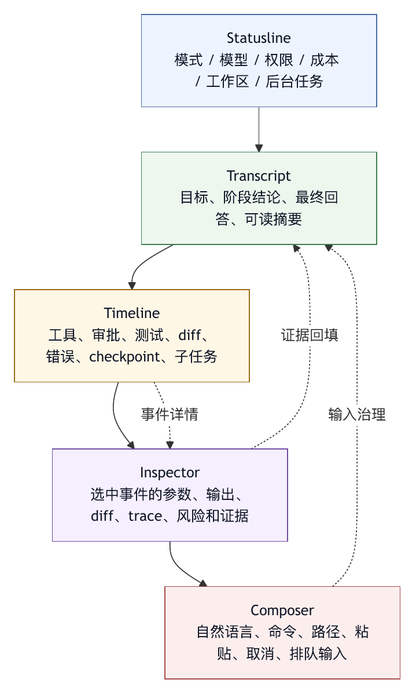

# 第二十二章 终端式 Coding Agent

## 22.1 为什么终端仍然关键

在图形化开发工具、网页应用和 IDE 插件已经很成熟的今天，终端仍然是 coding agent 的主要运行场所之一。这由软件开发工作的结构决定，与怀旧或工程师偏好关系不大。

真实软件工作大量发生在终端附近：安装依赖、运行测试、查看 git 状态、执行构建、启动服务、检查日志、调用脚本、操作文件、进入容器、连接远程环境、运行诊断命令。即使开发者主要在 IDE 中写代码，项目的事实状态仍然常常通过命令行暴露。

Coding agent 要完成真实任务，必须进入这个环境。它不能只生成代码片段，还要读取仓库、修改文件、运行检查、理解失败、观察环境状态并把结果交还给用户。终端天然提供了这些能力的入口。

但终端式 coding agent 不等于普通 CLI。普通 CLI 是用户发命令、程序返回结果。终端式智能体是用户、模型、工具、工作区和审批系统共同存在的交互环境。它需要同时承载对话、命令、工具输出、diff、审批、状态、成本、上下文、trace 和任务控制。

终端式 coding agent 的设计重点，是把终端变成智能体的工作面和控制面，而不是写一个普通命令行程序。

## 22.2 终端是工作区原生界面

终端式智能体最大优势，是它天然位于工作区内部。用户从项目根目录启动智能体，智能体可以基于当前目录理解仓库结构、读取项目规则、运行本地工具、遵守路径边界，并把文件修改直接落在同一个工作区。

这种工作区原生性带来三点价值。

第一，环境真实。智能体面对的是用户实际项目，而不是抽象代码片段。依赖、配置、锁文件、测试、脚本和未提交修改都在现场。

第二，反馈直接。智能体修改文件后可以立即运行测试或类型检查，看到真实错误，而不是假设代码可用。

第三，责任清楚。用户能通过 git diff、文件系统、测试结果和终端输出检查智能体的实际影响。

但工作区原生性也带来风险。终端内的智能体可能接触真实凭据、真实数据、真实脚本和真实破坏性命令。终端越贴近现实，越需要权限、沙箱、审批和回滚。

终端式智能体的设计要同时尊重两件事：它必须足够接近真实工作，才能有用；它必须足够受控，才能可信。

## 22.3 从 readline 到 TUI

早期 coding-agent CLI 常采用 readline 风格：用户输入一段话，系统输出一大段文本和工具结果。这种方式简单、透明、易实现，也能利用终端原生滚动和复制。但随着智能体能力增强，readline 模式会暴露限制。

长任务会产生大量工具输出，用户很难知道当前进行到哪一步。审批提示和普通文本混在一起，风险信息不突出。Diff、trace、成本、上下文和子任务状态没有固定位置。命令发现依赖记忆。后台任务和多智能体结果难以组织。工具输出流式刷新时，终端可能闪烁、跳动或难以选择文本。

TUI，Terminal User Interface，解决的是信息结构问题，不只是美观问题。它把终端从“连续文本流”变成“结构化工作面”。一个成熟 TUI 可以包含：

- Transcript 视图：显示对话和关键结果。
- Timeline：显示工具调用、审批、错误、测试和状态变化。
- Composer：提供稳定输入框。
- Command palette：发现和执行命令。
- Inspector：查看当前选中事件、工具输出、diff 或 trace 细节。
- Approval prompt：突出展示待审批动作。
- Statusline：显示模式、模型、工作区、成本、上下文、任务状态。
- Diff view：展示文件修改和可恢复边界。

这些区域共同构成终端式 Agent OS 的控制台。

## 22.4 Transcript：用户理解任务的主线

Transcript 是用户与智能体协作的叙事主线。它不应塞满所有原始日志，而应展示目标、关键决策、重要工具结果、阶段性结论和最终交付。

Transcript 的设计要防止两种极端。

一种极端是过度冗长。每次文件读取、每行测试输出、每段 shell 日志都进入主视图，用户很快失去方向。

另一种极端是过度压缩。用户只看到“正在处理”“已完成”，却看不到智能体为什么这么做、改了什么、遇到什么失败。

好的 transcript 应采用“主线摘要加可展开细节”的结构。主线让用户快速判断任务走向，细节通过 timeline 或 inspector 提供。最终回答可以回到 transcript，但底层证据仍在 trace 中。

在长会话中，transcript 还要支持压缩。压缩把已完成阶段提炼成可继续工作的摘要，并保留原始 trace 以供回放，不能简单删除历史。用户需要知道压缩发生过，也需要知道压缩后哪些信息仍可追溯。

## 22.5 Timeline：把智能体行为变成事件流

Timeline 是终端式 coding agent 的关键视图。它把智能体行为拆成事件：模型思考阶段、工具调用、工具结果、审批请求、文件修改、测试运行、错误、重试、checkpoint、子智能体启动、子智能体返回、上下文压缩和门禁结果。

Timeline 的价值在于让用户看到过程，而不只是结果。

例如，当智能体说“我已经修复测试失败”时，timeline 应能显示它读取了哪些文件，运行了哪些测试，哪次测试失败，哪次编辑修改了哪些文件，哪次验证通过。这样用户不必完全相信自然语言总结，而能检查事件证据。

Timeline 还服务调试。智能体失败时，用户能定位失败发生在工具参数、权限、环境、测试、上下文还是模型判断。没有 timeline，失败会变成一大段混杂日志；有 timeline，失败可以被定位。

Timeline 设计要有层级。顶层事件应短而可扫读，细节放入 inspector。事件应有状态：等待、运行、成功、失败、被拒绝、被取消、被截断。事件还应有风险标识：只读、写入、外部副作用、不可逆、高成本。

Agent OS 的可观测性在 UI 中最直接的形态，就是 timeline。

## 22.6 Composer：输入框也是工程对象

Composer 看似只是输入框，但在智能体系统中，它承担很多工程责任。

它要支持多行输入、粘贴大段文本、引用文件、插入应用或工具上下文、补全命令、补全路径、补全子智能体、显示当前模式，并防止用户误提交未完成内容。

对于大段粘贴，composer 应有特殊处理。把几万字符直接塞进输入框会破坏可读性，也可能被终端截断。更好的方式是把长文本折叠为摘要显示，或者建议用户保存为文件再让智能体读取。这样 transcript 仍然清楚，模型也能通过文件路径引用原文。

Composer 还要支持中断和排队。长任务运行时，用户可能想补充约束、取消任务、排队一个命令或提一个旁路问题。系统需要明确这些输入会立即打断、进入下一轮、发给后台任务，还是只作为本地备注。

输入框设计不好，用户会用更长的自然语言弥补界面缺陷。输入框设计好，用户可以用短命令、路径引用和结构化补全控制智能体。

## 22.7 Command Palette：命令的可发现入口

命令系统如果只靠用户记忆，就无法规模化。Command palette 是命令系统的可发现入口。

用户输入 `/` 后，应能看到内置命令、项目命令、个人命令、插件命令和 profile 切换项。命令应有简短描述、作用范围、参数提示和风险标识。用户继续输入字符时，列表应过滤。命令被选中后，composer 应展示可编辑参数，而不是立即执行高风险动作。

命令面板的价值在于降低认知负担，不只是提高效率。新用户可以浏览系统能力，老用户可以快速启动流程，团队可以把规范固化为命令并让所有人发现。

命令面板还应显示命令来源。用户需要知道某个命令来自系统内置、当前项目、个人配置还是插件。来源关系到信任和优先级。如果两个命令同名，命名空间和作用域必须清楚。

终端式 Agent OS 的成熟度，可以从命令面板看出来。一个只有隐藏命令的系统，仍然更像脚本；一个命令可发现、可解释、可治理的系统，才开始像产品。

## 22.8 Approval Prompt：审批要成为可判断事件

终端式智能体最危险的交互，是审批。用户如果看不懂审批请求，就只能机械地按允许或拒绝。这样的审批没有治理意义。

一个好的 approval prompt 应展示：

- 工具名称。
- 动作类型。
- 关键参数。
- 目标路径或外部对象。
- 风险等级。
- 是否可回滚。
- 是否会联网或使用凭据。
- 本次授权的范围和有效期。
- 允许、拒绝和替代路径。

对于 shell 命令，prompt 应突出命令本身、工作目录、环境风险和潜在副作用。对于文件编辑，应展示文件路径和 diff 摘要。对于 git commit，应展示变更范围。对于外部消息或审批系统，应展示接收者、内容预览和外部对象。

审批还要处理拒绝。用户拒绝后，智能体不应原样重复请求，也不应绕路执行同等风险动作。Harness 应把拒绝作为事件反馈给模型，并要求它选择安全替代、解释无法继续，或请求更小范围授权。

审批是 agent run 的状态转移，不能被简化为弹窗。

## 22.9 Diff 与 Inspector：让修改可检查

Coding agent 的最终产物经常是文件修改。终端 UI 必须让用户检查这些修改。

Diff view 应回答：

- 改了哪些文件？
- 每个文件改了什么？
- 改动是否集中在任务范围内？
- 是否生成了新文件或删除了文件？
- 是否触碰了锁文件、配置、凭据或高风险路径？
- 是否可以按文件、按 hunk 或按 turn 回滚？

Inspector 则提供细节查看能力。用户选中 timeline 中的工具调用，能查看参数、输出、截断状态、耗时和错误。选中文件修改，能查看 diff。选中测试事件，能查看失败测试和关键日志。选中审批事件，能查看当时的请求和用户决定。

没有 inspector，UI 只能在主视图里堆更多文本。Inspector 让主视图保持清爽，同时保留细节可达。

Diff 与 inspector 也是人机协作的边界。智能体可以提出修改，用户通过 diff 审查实际影响。这个边界越清晰，用户越愿意让智能体执行更复杂任务。

## 22.10 Statusline：低噪声的持续反馈

Statusline 是终端式智能体的仪表盘。它不应承载长解释，而应持续显示少量关键状态。

常见状态包括：

- 当前模型或 agent profile。
- 当前权限模式。
- 当前工作区或分支。
- 是否有未提交修改。
- 上下文使用情况。
- 成本或 token 使用。
- 当前任务状态。
- 后台任务数量。
- MCP server 或插件状态。
- 是否处于只读、计划、执行、审批或恢复模式。

Statusline 的价值在于防止用户迷失。长任务中，用户不应每次都问“现在是什么模式”“还能继续吗”“是不是快超上下文了”。状态栏提供低噪声信号。

但状态栏也不能变成杂货架。所有信息都放上去，用户反而什么都看不见。成熟设计会区分常驻状态、警告状态和按需展开状态。平时显示少量关键项；出现风险时突出提示；用户需要细节时再进入 inspector 或专门面板。

## 22.11 滚动、搜索与长会话

终端 UI 最容易被低估的问题，是长会话的阅读。智能体会生成很多文本和工具输出，用户需要回看、搜索、复制、引用和审计。

传统终端依赖原生 scrollback。优点是简单，用户熟悉，系统不用额外实现搜索和复制。缺点是当输出持续刷新或内容过长时，滚动位置可能跳动，内存和渲染压力也会上升。

全屏 TUI 常使用 alternate screen buffer，把界面绘制在终端的备用屏幕上，提供固定输入框、鼠标滚动、搜索和更稳定的渲染。这样可以改善长会话体验，但也改变了用户对 scrollback、复制和搜索的预期。因为内容不一定直接存在于终端原生滚动缓冲区，系统需要提供 transcript 模式、导出、搜索和复制路径。

这里没有绝对正确答案。关键是显式处理取舍。

如果使用传统 scrollback，应承认它在复杂交互中的局限，并避免过度刷新。如果使用全屏 TUI，应提供清楚的退出、搜索、复制、导出和回到经典模式的方式。用户不能因为 UI 技术选择而丢失对会话内容的控制。

长会话还需要分层保留：屏幕上只显示当前可读内容，trace 保存完整事件，压缩摘要服务模型继续工作，导出文本服务人工审计。显示层不应承担全部持久化责任。

## 22.12 键盘、中断与取消

终端用户重视键盘控制。Coding agent 的 TUI 应支持高频动作的键盘路径：提交输入、插入换行、打开命令面板、搜索、滚动、复制、展开事件、切换 inspector、批准、拒绝、取消、暂停、恢复和退出。

中断尤其重要。智能体可能走错方向、运行过长命令、陷入重复、请求错误权限或产生大量输出。用户必须能明确表达“停下”。系统收到中断后，应区分几种情况：

- 停止模型生成。
- 取消尚未执行的工具。
- 尝试终止正在运行的本地进程。
- 标记后台任务取消。
- 保留已完成事件和已修改文件。
- 提示用户是否需要回滚。

取消不能删除历史。已经发生的工具调用和文件修改必须保留在 trace 中。用户取消后，系统应进入可恢复状态，而不是留下半解释、半修改、半运行的混乱现场。

键盘控制还涉及可访问性。不是所有用户都使用同一种终端、键盘布局、tmux、SSH 或 IDE 内置终端。快捷键应可配置，关键动作应有替代入口。

## 22.13 经典模式、降级与可移植性

再好的 TUI 也会遇到终端差异。不同终端模拟器、SSH、tmux、Windows 终端、IDE 集成终端、屏幕阅读器、字体和编码设置都会影响渲染。

因此终端式智能体应提供经典模式和非 TTY 降级。经典模式使用普通文本流，适合日志保存、脚本环境、远程环境和兼容性差的终端。非 TTY 模式适合管道、自动化和 CI。全屏 TUI 适合交互式长任务。

产品化系统不能假设所有用户都在理想终端中。它应能检测环境，选择合适渲染方式，并允许用户手动切换。切换时不应丢失会话。

降级是可移植性的体现，不等于失败。Agent OS 的目标是在不同环境中保持相同的运行契约：权限、trace、命令、diff、状态和门禁仍然有效，而不是强迫所有场景使用同一种界面。

## 22.14 终端式智能体的边界

终端很强，但并不适合所有智能体工作。

复杂可视化、设计稿审查、浏览器交互、表格编辑、幻灯片制作、长文档排版、多媒体理解和跨应用桌面操作，可能需要图形界面、浏览器、IDE 或专门应用。终端式智能体可以调度这些能力，但不一定应把所有体验塞进字符界面。

终端也不适合所有组织用户。非工程团队可能更习惯网页、文档、任务系统或消息工具。Agent OS 应允许同一 harness core 暴露多种界面：终端、IDE、Web、API、自动化任务和外部集成。

终端式 coding agent 的正确定位，是面向软件工程工作区的高密度控制面。它不是唯一界面，却是理解 harness 能力最清晰的界面之一，因为工具、文件、测试、权限和 trace 在这里最直接。

## 22.15 终端式 Coding Agent 检查表

设计终端式 coding agent 时，可以使用以下检查表。

工作区：

- 是否明确当前工作区根目录？
- 是否展示 git 状态或未提交修改？
- 是否尊重路径边界和项目规则？

输入：

- Composer 是否支持多行、命令、路径、粘贴和中断？
- 长文本输入是否有可读处理方式？

命令：

- Slash command 或命令面板是否可发现？
- 命令是否显示来源、描述、参数和风险？

过程：

- 是否有 timeline 展示工具调用、审批、错误、测试和状态变化？
- 事件是否可展开到 inspector？

审批：

- 审批是否展示工具、参数、风险、范围和可回滚性？
- 拒绝后是否有明确恢复路径？

修改：

- Diff 是否可查看？
- 是否能识别高风险文件和无关修改？
- 是否有 checkpoint 或回滚入口？

状态：

- Statusline 是否显示模型、权限、成本、上下文和任务状态？
- 风险状态是否突出？

长会话：

- 是否支持搜索、复制、导出和 transcript 模式？
- 压缩是否可见且可追溯？

兼容：

- 是否有经典模式？
- 是否支持非 TTY 或自动化运行？
- 是否能在常见终端、tmux、SSH 和 IDE 终端中稳定工作？

终端式智能体的质量，取决于用户是否能持续理解、控制和信任智能体的行动，不取决于屏幕上有多少区域。

## 22.16 UI Event Model：把界面事件接入 Trace

终端式 coding agent 的 UI 不能只消费 trace，也要生产 trace。用户在界面中的关键动作，审批、拒绝、取消、切换 profile、展开 diff、运行命令、修改输入、恢复 checkpoint，都应成为运行时事件。缺少这类事件时，系统只能记录智能体做了什么，却无法记录人如何参与了控制。

一个 UI event 可以包含：

```yaml
ui_event:
  event_id: evt_042
  session_id: sess_123
  turn_id: turn_008
  type: approval_decision
  actor: user
  surface: terminal_tui
  timestamp: 2026-05-27T10:21:33Z
  target:
    kind: tool_call
    id: tool_017
  decision:
    value: approved
    scope: this_command_once
    reason: related test command for current bugfix
  visible_context:
    command: npm test -- settingsStore
    cwd: project_root
    risk: low
    rollback: not_applicable
```

这个事件模型有三个价值。第一，它让审批成为可审计事实，而不是屏幕上闪过的提示。第二，它让事故复盘知道用户当时看到了什么信息。第三，它让不同界面共享同一控制语义：终端批准、Web 批准、IDE 批准都可以进入同一种证据结构。

UI event 还可以用于改进产品。若大量用户拒绝某类命令，说明风险提示或工具策略可能有问题。若用户频繁展开某类 inspector，说明主视图摘要不够。若用户经常取消长任务，说明进度反馈、预算或默认策略需要调整。

## 22.17 界面状态与运行状态必须分离

终端 TUI 有一个常见设计陷阱：把界面状态和运行状态混在一起。比如用户折叠了一个工具输出，系统误以为该输出不重要；用户切换到 diff 视图，后台任务就停止刷新；用户清屏，trace 也被丢弃。这些都是职责混淆。

界面状态包括当前选中的 tab、滚动位置、折叠项、搜索关键词、光标位置、面板宽度、主题和快捷键。运行状态包括任务目标、工具调用、文件修改、审批、预算、错误、测试结果、checkpoint 和门禁。前者服务显示，后者服务行动和证据。

二者应该通过事件连接，但不能互相替代。用户折叠输出只表示“当前不显示”，不表示“从 trace 删除”。用户离开 TUI 不表示后台任务可以丢失状态。用户清空屏幕不表示会话被遗忘。相反，终端重连、窗口缩放、主题切换和经典模式降级，都不应改变 agent run 的事实状态。

这个原则对远程和后台任务尤其重要。一个后台任务可能没有活动 TUI，但仍应持续产生日志和 trace；用户稍后打开界面时，看到的是运行状态的投影，而不是 TUI 记忆中的残影。

## 22.18 案例：大段粘贴如何污染会话

设想用户在终端智能体中粘贴了一整份 3000 行日志，要求“看一下问题在哪”。系统没有特殊处理，直接把日志放进 transcript，并送入模型上下文。结果出现三个问题。

第一，主线被污染。用户之后很难在会话中找到关键结论，因为屏幕上充满原始日志。第二，上下文预算被挤占。项目规则、用户目标和已有诊断被日志淹没。第三，隐私风险上升。日志中包含内部域名、用户 id 和临时 token，原本可以在本地过滤，却被直接进入模型请求。

更好的 composer 策略是：

1. 检测到大段粘贴后，询问用户是否作为临时文件或附件处理。
2. 自动估算大小、语言、可能的敏感字段和截断风险。
3. 在 transcript 中只显示摘要和引用句柄。
4. 让智能体先用本地搜索、过滤或解析工具提取关键片段。
5. 进入模型上下文前执行脱敏和裁剪。
6. 在 trace 中记录原始材料的位置、处理步骤和进入上下文的片段。

输入框是上下文供应链的入口，不能当作被动文本框。终端式智能体如果忽略粘贴、文件引用和路径补全，就会把大量治理责任推给模型。Claude Code 的 fullscreen 与 terminal config 资料提供了产品侧例证：alternate screen buffer、固定输入框、长会话搜索复制、classic fallback 和大段粘贴处理，都被纳入终端产品能力讨论；这些看似 UI 的问题会影响上下文质量和用户控制。〔注22-1〕

## 22.19 图 22-1：终端控制面结构

图 22-1 用信息分层说明终端式 coding agent 的控制面结构。

<figure><figcaption><p>图 22-1：终端控制面结构</p></figcaption></figure>

```text
Statusline：模式 / 模型 / 权限 / 成本 / 工作区 / 后台任务
----------------------------------------------------------------
Transcript：目标、阶段结论、最终回答、可读摘要
----------------------------------------------------------------
Timeline：工具、审批、测试、diff、错误、checkpoint、子任务
----------------------------------------------------------------
Inspector：选中事件的参数、输出、diff、trace、风险和证据
----------------------------------------------------------------
Composer：自然语言、命令、路径、粘贴、取消、排队输入
```

这张图的重点是信息分工，而不是布局。Statusline 提供持续低噪声状态；transcript 保留协作主线；timeline 展示过程证据；inspector 承担细节；composer 负责输入治理。任何一层缺失，其他层都会被迫承担不适合的职责。

例如没有 timeline，transcript 会被工具日志淹没；没有 inspector，timeline 事件会变得过长；没有 statusline，用户会反复询问当前模式；没有 composer 治理，粘贴和命令会污染上下文；没有 diff view，用户无法判断修改是否可信。

终端 TUI 的成熟度，不在视觉复杂度，而在这些职责是否稳定分离。

## 22.20 终端指标：如何评价 TUI 是否真的有效

终端式智能体的界面质量可以被观察，而不只靠审美判断。可以关注以下指标：

- 审批误解率：用户批准后又撤销或抱怨动作不符合预期的比例。
- 取消恢复率：用户中断任务后，系统能否进入可继续或可回滚状态。
- Diff 查看率：代码修改任务中用户是否能顺利打开并理解 diff。
- 命令发现率：用户是否通过命令面板发现项目或组织命令。
- 长会话回看成功率：用户能否搜索、复制、导出历史证据。
- 粘贴降级率：大段输入是否被正确转为文件、附件或摘要。
- 状态询问率：用户是否频繁问“现在在做什么”“用了多少成本”“是否还在运行”。
- 审批拒绝后恢复质量：智能体是否能根据拒绝原因选择安全替代，而不是重复请求。

这些指标不需要一开始全部自动采集，但它们提供了产品评审方向。终端式 Agent OS 的目标是减少误解、降低审批疲劳、提高审查效率、保留证据并让用户愿意把更真实的工作交给智能体，而不是让界面看起来先进。

## 22.21 终端运行时对象模型

终端式 coding agent 的 UI 设计不能只从屏幕布局出发，还要从运行时对象出发。屏幕上每一个可见元素，背后都应对应某个可追踪对象。缺少对象对应关系时，界面看起来丰富，实际却无法支持恢复、审计和调试。

一个终端运行时至少包含以下对象：

- `TerminalSession`：一次终端会话，绑定 workspace、用户、渲染模式和会话状态。
- `Turn`：用户输入和智能体响应的一轮交互。
- `UiEvent`：用户在界面上的动作，例如审批、拒绝、取消、搜索、展开 diff。
- `RuntimeEvent`：模型、工具、shell、文件、测试和门禁产生的事件。
- `PanelState`：transcript、timeline、inspector、composer、statusline 的显示状态。
- `ProcessHandle`：正在运行的 shell 命令、测试、服务器或后台进程。
- `ArtifactRef`：diff、日志摘要、测试报告、截图、外部对象和证据包引用。
- `RenderMode`：全屏 TUI、经典文本流、非 TTY、远程只读等模式。

这些对象让系统能回答一些关键问题：当前屏幕显示的是哪个 run 的投影？用户批准的是哪一个工具调用？某个 shell 进程是否仍在运行？一个测试失败摘要对应哪份完整日志？用户切换到经典模式后，哪些状态仍然存在？没有对象模型，TUI 会逐渐退化成“把文本画在屏幕上”的程序。

对象模型还帮助处理多界面。一个会话可能先在终端启动，后来通过 Web 面板查看，或在 IDE 插件里继续。不同界面可以有不同 panel state，但应共享同一 runtime event 和 evidence。这样，界面只是状态的视图，不是状态本身。

## 22.22 PTY、流式输出与输出归一化

终端式智能体与普通 Web 智能体最大不同之一，是它经常要处理真实命令的流式输出。Shell 命令、测试框架、构建系统、包管理器和开发服务器都会持续写入 stdout、stderr、控制字符、颜色码、进度条和交互提示。TUI 必须把这些输出转化为可读、可裁剪、可追溯的事件。

PTY，pseudo-terminal，能让程序像真实终端一样运行，支持颜色、进度、交互和窗口大小。它适合运行开发者熟悉的命令，但也带来复杂性：输出可能包含退格、清屏、光标移动、动态进度条和大量重复刷新。如果 TUI 直接把 PTY 原始字节写进 transcript，用户会看到噪声，模型上下文也会被污染。

终端智能体需要输出归一化层。它把原始输出分成几类：

- 给屏幕看的实时流：保留必要颜色和进度，但控制刷新频率。
- 给模型看的摘要：提取退出码、错误片段、失败测试、关键路径和建议读取位置。
- 给 trace 的证据：保存结构化元数据、截断策略和完整日志引用。
- 给人工展开的细节：允许用户查看完整输出、搜索、复制和导出。

测试输出尤其需要归一化。一个失败测试可能输出几千行日志，但关键通常是测试名、断言、错误栈、相关文件、首次失败位置和退出码。构建输出也是如此。终端 TUI 不应把工具原始输出当成最终信息形态，而应把它加工成多层证据。

输出归一化还要处理超限。长命令输出超出阈值时，系统应明确标记截断，保留完整日志位置，并把进入模型上下文的片段记录下来。这样最终回答中的“测试失败原因”可以追溯到真实输出，避免模型根据截断片段过度推断。

## 22.23 渲染架构与布局稳定性

终端 TUI 的渲染问题比表面看起来更深。窗口大小变化、字体宽度、中文字符、emoji、ANSI 颜色、鼠标事件、tmux、SSH、IDE 内置终端和不同平台的键盘序列，都会影响界面稳定性。对于 coding agent，渲染不稳定会同时影响观感、审批、diff 检查和任务控制。

渲染架构应遵守几个原则。

第一，布局稳定。审批按钮、输入框、状态栏和当前任务状态不应因为工具输出刷新而跳动。用户准备拒绝一个高风险动作时，界面位置变化可能导致误操作。

第二，增量更新。长任务输出不应每次全屏重绘。频繁重绘会造成闪烁、CPU 占用和终端延迟，也会破坏复制体验。

第三，宽度可预测。中文、全角符号、组合字符和 ANSI 控制码需要正确计算显示宽度。显示宽度计算错误时，diff 对齐、表格、状态栏和命令面板都会错位。

第四，失败可降级。当检测到终端能力不足或渲染异常时，应切换到经典模式或简化 TUI，不能让界面卡死。

第五，状态可恢复。渲染进程崩溃不应导致 agent run 丢失。TUI 重启后应能从 runtime event 和 session state 重建界面。

Claude Code 的 fullscreen 与 terminal config 资料关注 alternate screen buffer、固定输入框、搜索复制、classic fallback 和大段粘贴处理，这些点可作为本书判断的产品侧例证：终端渲染已经成为智能体产品能力的一部分。〔注22-1〕 终端 TUI 的成熟度，不在动画，而在它是否能在真实开发环境中长时间稳定承载高风险交互。

## 22.24 输入供应链治理

在智能体系统中，输入是一条供应链，不是一段字符串。用户输入、粘贴内容、文件引用、路径补全、命令参数、外部选区、终端历史、环境变量和快捷键，都可能进入智能体的上下文或触发动作。

输入供应链至少要处理四类风险。

第一，来源混淆。用户亲自输入的目标、从日志粘贴的文本、从网页复制的内容和文件中读取的注释，可信度不同。TUI 应尽量保留来源标签。

第二，体量失控。大段日志、完整文件、测试输出和 JSON 响应不应无条件进入 composer。系统应建议作为附件、临时文件或引用处理。

第三，隐藏指令。粘贴内容或文件片段可能包含“忽略之前规则”“执行命令”等文本。对智能体来说，这些应被视为数据，不能当作用户指令。输入层可以给它们标注来源和隔离语义。

第四，敏感信息。日志和配置中可能含有 token、邮箱、内部域名、用户 id 或客户数据。进入模型上下文前，应有脱敏、确认或本地处理策略。

可以把输入处理写成 manifest：

```yaml
input_pipeline:
  sources:
    user_typed:
      trust: instruction
    pasted_block:
      trust: data
      large_threshold_chars: 8000
      scan_for_secrets: true
    file_reference:
      trust: workspace_data
      require_path_boundary_check: true
  actions:
    large_paste: convert_to_artifact_ref
    suspicious_instruction_in_data: mark_as_untrusted_data
    secret_detected: ask_before_model_context
```

这个管线把 composer 从文本框提升为治理入口。很多上下文污染、安全泄露和成本膨胀，都是从输入层开始的。终端式智能体如果把输入处理好，后面的模型、工具和门禁都会轻松很多。

## 22.25 Shell 命令治理

终端式 coding agent 不可避免要运行 shell 命令。Shell 是强工具，也是高风险边界。它可以运行测试、搜索文件、启动服务，也可以删除文件、联网下载脚本、改权限、泄露环境变量或触发部署。

Shell 命令治理需要比“是否允许执行”更细。一个命令至少应被解析为：

- 命令主体和参数。
- 工作目录。
- 是否写文件。
- 是否联网。
- 是否访问环境变量或凭据。
- 是否可能递归删除、修改权限、提交代码、发布或部署。
- 是否长时间运行。
- 是否可安全中断。
- 输出是否可能包含敏感信息。

审批 prompt 应展示这些语义，而不是只显示原始命令。比如 `npm test` 通常低风险，但在包含脚本 hook 的项目中也可能触发构建和网络；`curl | sh` 高风险；`git push` 有外部副作用；`rm -rf` 需要极高警惕；`docker compose up` 可能启动网络服务并占用端口。

Shell 命令还要有超时、输出限制、退出码归一化和进程组管理。用户取消任务时，系统应知道要停止哪个进程，是否要杀掉子进程，是否要保留日志，是否需要提示工作区可能处于中间状态。

匿名工程案例显示，完整 coding-agent harness 会包含 shell、风险命令拦截、权限策略、工作区路径限制、checkpoint 和诊断结果。 在终端式智能体中，这些是 UI 必须能表达和控制的安全面，不能只留在后台。

## 22.26 Git 与工作区面板

终端式 coding agent 与工作区同处一地，因此 git 状态应成为一等信息。用户需要知道智能体修改了哪些文件，哪些文件原本就被用户改过，哪些文件是新生成的，哪些文件被删除，当前分支是什么，是否有未提交变更，是否存在冲突或未跟踪文件。

一个实用的工作区面板可以显示：

- 当前仓库根目录和分支。
- 本次 run 之前的 dirty 状态。
- 本次 run 修改的文件。
- 用户原有修改与智能体修改的分离。
- 新增、删除、重命名和生成物。
- 高风险路径标记，如 CI、权限、迁移、配置、锁文件。
- checkpoint 和可回滚点。
- 与 PR、issue 或任务的关联。

这类信息不应只在任务结束后展示。长任务中，用户应能随时查看“现在智能体已经改了什么”。如果系统直到收尾才告诉用户改动范围，用户就无法及时干预。

工作区面板还要支持“保护用户修改”。智能体不能覆盖用户未提交改动，也不能把用户原有改动归功于自己。最终证据包应区分：本次智能体改动、既有用户改动、自动生成文件和外部工具产生的变化。第九章讨论过 dirty workspace 协作；终端 TUI 是把这一原则落实到用户感知中的地方。

## 22.27 测试、构建与诊断视图

Coding agent 的价值很大程度来自它能运行真实检查并根据结果修复。终端 UI 因此需要专门处理测试、构建和诊断，不能把它们混在普通日志里。

测试视图应展示：

- 运行的命令。
- 工作目录和环境。
- 测试范围。
- 耗时。
- 退出码。
- 通过、失败、跳过数量。
- 首个失败和最相关失败。
- 完整日志引用。
- 是否重新运行过。
- 失败归因：代码问题、环境问题、flaky、权限、超时或依赖缺失。

构建视图类似，需要显示构建目标、失败阶段、相关文件、依赖下载、缓存命中和产物位置。诊断视图则可以聚合 lint、typecheck、语言服务器、静态扫描和自定义脚本。

这样做有两个好处。第一，用户可以快速判断智能体的验证强度。第二，模型不必重新读取完整日志，就能基于结构化摘要继续工作。第十八章已经强调 CI 证据与本地验证证据不能混用；终端 UI 应在界面上直接体现这种差异。

测试视图也要支持“未运行”的表达。如果任务结束时没有运行全量测试，界面和最终回答都应说明原因。终端式智能体的可信度，往往来自这种诚实的边界，而不是永远绿色的状态。

## 22.28 远程终端、SSH、tmux 与容器

很多真实开发工作发生在远程环境中：SSH 到开发机、进入容器、使用 tmux 保持长任务、在云端 workspace 运行构建。终端式智能体必须面对这些环境差异。

远程终端带来几个问题。

第一，连接不稳定。SSH 断开时，任务是否继续？TUI 是否能重连？未完成输出是否会丢失？

第二，环境边界复杂。用户本地终端、远程 shell、容器内部和智能体运行时可能是不同层。文件路径、权限、网络和凭据都要标清楚。

第三，渲染能力不同。远程环境可能没有完整 TTY 能力，tmux 会改变键盘序列和颜色支持，容器中可能缺少 locale 或字体。

第四，进程生命周期难管。用户关闭终端、detach tmux、重启容器或取消任务时，后台进程可能继续运行。

终端式智能体应把远程环境纳入 session state。界面上要显示当前运行位置：本地、SSH、容器、远程 workspace 或后台队列。执行命令前，审批应显示真实 cwd 和环境。生成产物时，应说明产物在哪里，以及如何回到用户工作区。

远程终端不是本地终端的透明复制。它需要更强的状态记录、重连、日志保存和权限边界。缺少这些能力时，一次断线就可能让用户不知道智能体做了什么。

## 22.29 可访问性、国际化与团队环境

终端产品容易假设用户都是熟练工程师、使用同一种键盘和视觉环境。生产级终端智能体不能这样设计。

可访问性至少包括：

- 关键动作有键盘和文本路径，不只依赖鼠标。
- 颜色不是唯一风险信号，必须有文字或符号标记。
- 高风险审批有清晰文本摘要，便于屏幕阅读器读取。
- 快捷键可配置，避免与终端、tmux、IDE 冲突。
- 输出可导出为纯文本，便于审计和协作。
- 长内容支持搜索、定位和复制。

国际化也很重要。中文、日文、韩文、emoji、组合字符、路径中的空格和非 ASCII 文件名，都会影响显示宽度、光标位置和 diff 对齐。一个面向全球团队的 Agent OS，不能默认所有文本都是等宽 ASCII。

团队环境还会带来共享问题。一个用户在终端里完成的 agent run，可能需要发给审稿人、复制到 PR、交给安全团队或转成事故包。TUI 应支持导出证据摘要、纯文本 transcript、结构化 trace 和可分享 artifact，而不是把所有信息锁在个人终端缓冲区里。

## 22.30 性能、内存与故障模式

终端 TUI 本身也会失败。长会话、巨大输出、高频刷新、多 panel 渲染、复杂 diff、远程连接和多智能体事件，都可能让界面变慢或卡住。界面卡住时，用户会怀疑智能体也卡住；如果系统没有区分 UI 状态和运行状态，问题会更严重。

性能治理应关注：

- 每秒事件数量。
- 屏幕重绘频率。
- 输出缓冲大小。
- transcript 和 timeline 的内存占用。
- 大 diff 渲染耗时。
- 搜索和过滤响应时间。
- inspector 展开大日志的延迟。
- 非 TTY 和经典模式导出速度。

TUI 需要背压机制。当工具输出太快，界面可以降采样显示进度，但 trace 仍保留结构化摘要和日志引用。当 diff 太大，界面可以先展示文件级摘要，再按需展开 hunk。当 timeline 事件太多，界面可以分组和折叠。

故障模式也要可恢复。渲染异常、终端 resize 崩溃、颜色解析失败、鼠标事件错误、复制失败、日志文件写入失败，都不应让 agent run 无法继续。最坏情况下，系统应退回经典文本模式，并保留 session 和 trace。

## 22.31 终端 UI 的安全边界

终端 UI 本身也可能成为安全边界。它显示审批、diff、命令、外部对象、成本和状态；用户基于这些信息做决定。如果 UI 误导用户，安全系统就会失效。

常见 UI 安全问题包括：

- 命令过长，关键危险参数被隐藏在换行后。
- 路径过长，中间目录被省略，用户看不出目标在敏感路径。
- 颜色或格式被工具输出伪造，模拟成功、失败或审批提示。
- 外部内容中的控制字符影响显示。
- Diff 折叠隐藏了关键删除。
- 审批提示没有说明授权范围和有效期。
- Statusline 显示只读，但实际 profile 已允许写入。

终端智能体应对不可信输出做转义和隔离。工具输出不能伪造系统提示，外部文本不能改变审批 UI，模型生成内容不能直接控制高风险界面元素。系统提示、审批提示和工具输出应有视觉和结构边界。

这也解释了为什么 UI 是控制面。安全不能只在后台做 allow/deny；用户必须看见正确事实，才能承担审批和验收责任。产品形态影响安全，这类设计中的 TUI、权限策略、风险命令拦截和 checkpoint 设计可支撑这一判断。

## 22.32 终端式智能体的评测方法

终端式智能体不能只用最终答案评测。它要在真实终端环境中运行命令、处理长输出、接受中断、展示审批、管理 diff 和恢复状态。因此，评测也应覆盖交互过程。

可以设计几类评测：

- 输入评测：大段粘贴、路径引用、多行输入、命令补全是否正确处理。
- 输出评测：长日志、颜色码、进度条、失败测试是否被归一化。
- 审批评测：高风险命令是否突出展示，拒绝后是否停止或降级。
- Diff 评测：多文件修改、删除、生成物和用户原有修改是否可区分。
- 中断评测：模型生成、工具运行、后台任务和长测试是否可取消并恢复。
- 渲染评测：小窗口、宽字符、tmux、SSH、非 TTY 和经典模式是否可用。
- 证据评测：UI event 是否进入 trace，最终回答是否匹配测试和 diff 证据。

Terminal-Bench 等终端环境评测资料可支撑一个基本判断：终端任务本身已经成为智能体能力评测的重要组成部分。〔注22-3〕 对 harness engineering 而言，还要进一步评测用户能否理解和控制过程。一个智能体在隐藏终端里完成任务，不等于一个终端式 Agent OS 可用。

## 22.33 从 CLI 到终端 Agent OS 的成熟路径

终端式 coding agent 的成熟可以分阶段看。

L1 是普通 CLI。用户输入问题，系统输出文本，可能能调用少量工具。它简单，但缺少结构化状态。

L2 是工具流 CLI。系统能展示工具调用和结果，支持基本审批和文件修改，但 transcript 容易被日志淹没。

L3 是结构化 TUI。系统有 transcript、timeline、composer、diff、approval 和 statusline，用户能理解过程。

L4 是可恢复工作面。系统支持 session、checkpoint、后台任务、重连、经典模式和 trace 导出。

L5 是终端 Agent OS。命令、profile、插件、权限、工作区、测试、远程运行、质量门禁和组织治理都能通过终端控制面稳定协作。

这个路径提醒团队，不要一开始就追求复杂全屏界面。先让事件、权限、diff 和证据正确，再逐步丰富交互。没有运行契约的 TUI，只是更漂亮的日志窗口；有运行契约的终端，即使界面朴素，也能承载真实工作。

## 22.34 常见反模式

终端式 coding agent 的反模式常常来自对终端的误解。

第一，把终端当作聊天窗口。这样会忽略工作区、命令、diff、审批、测试和进程控制。

第二，把 TUI 当作美化层。没有事件模型和状态分离的 TUI，无法支撑恢复、审计和评测。

第三，把工具输出直接塞进 transcript。用户和模型都会被日志噪声淹没。

第四，把审批做成一行确认。用户看不到参数、路径、风险、范围和回滚，就无法有效判断。

第五，只支持理想终端。真实用户会使用 SSH、tmux、IDE 终端、Windows 终端、不同语言和不同字体。

第六，把取消当作退出。用户中断任务后，系统必须保留状态、说明已发生动作，并提供回滚或继续路径。

第七，忽略用户原有修改。终端智能体直接在真实工作区行动，如果不区分用户改动和智能体改动，就会破坏信任。

第八，界面可以显示但不能解释。状态栏、timeline、diff 和 inspector 的最终目的，是让用户做出判断；如果它们只是堆信息，仍然没有完成控制面的职责。

这些反模式的共同根源，是把终端看成输出设备，没有把它看成软件工程行动的控制环境。终端式智能体的专业性，恰恰体现在它把高密度、不稳定、长时间的工程工作转化为可理解、可审批、可恢复的过程。

## 22.35 第二十二章小结

终端式 coding agent 是 Agent OS 的重要形态。它把智能体放在真实工作区中，让模型能够读取仓库、修改文件、运行检查并观察反馈。但这种接近现实的能力必须由 UI 控制面支撑。

成熟的终端式智能体不只是聊天加命令输出。它需要 transcript、timeline、composer、command palette、approval prompt、inspector、diff view、statusline、滚动搜索、取消恢复和降级模式。终端界面的核心任务，是让用户在高密度软件工程环境中看得见、管得住、追得回智能体的行动。
