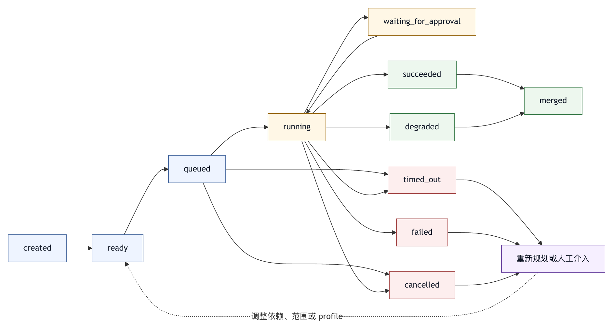

# 第二十三章 多智能体调度

## 23.1 多智能体需要调度纪律

多智能体系统常被描述得很轻松：一个智能体负责规划，一个智能体负责编码，一个智能体负责测试，一个智能体负责审查，它们合作完成任务。这个想象有吸引力，但工程问题远比角色命名复杂。

如果只是让多个智能体同时对同一个目标说话，系统很快会变得混乱。它们可能重复读取同一批文件，给出互相冲突的建议，修改同一段代码，消耗大量 token，反复请求权限，或者把失败原因推给彼此。多智能体不会自动带来更高质量。没有调度、边界和汇总协议时，多智能体只是把一个智能体的不确定性并行放大。

多智能体调度要把一个复杂任务拆成多个可独立执行、可追踪、可汇总、可失败恢复的子任务，并确保每个子智能体在合适上下文、合适工具、合适权限和合适预算下工作。

Multi-agent harness 的问题在于设计可调度、可追踪、可汇总、可恢复的协作结构；让智能体互相聊天远远不够。

## 23.2 什么时候需要多智能体

并非所有任务都适合多智能体。很多任务由单一智能体顺序完成更稳定。多智能体只有在任务具有明确并行性、角色差异或验证需求时才有价值。

适合多智能体的场景包括：

- 大仓库探索：多个只读智能体分别分析不同模块。
- 多方案比较：不同智能体独立提出方案，再由主智能体汇总。
- 并行资料研究：多个智能体查阅不同来源或主题。
- 代码审查：一个智能体实现，另一个只读审查。
- 测试定位：多个智能体分别追踪不同失败测试。
- 迁移影响审查：不同智能体检查 API、配置、依赖和文档影响。
- 红队审查：执行智能体完成任务，安全智能体寻找越权或注入风险。
- 长任务分段：主智能体把任务拆成阶段，由子智能体生成中间证据。

不适合多智能体的场景包括：

- 目标很小。
- 需要连续编辑同一文件。
- 依赖状态高度串行。
- 验证成本很高。
- 用户约束尚不清楚。
- 权限风险无法拆分。
- 子任务之间需要频繁同步。

多智能体的第一条工程判断是：先证明并行能减少风险或提高质量，再引入并行。缺少这种证明时，单智能体加更好的工具、上下文和门禁往往更可靠。

## 23.3 主智能体与子智能体的职责边界

多智能体系统通常需要一个主智能体。主智能体负责理解用户目标、拆分任务、选择子智能体、分配上下文、设置权限、接收结果、整合证据、决定下一步，并向用户交付最终答案。

子智能体负责完成被明确限定的子任务。它不应重新定义用户目标，不应擅自扩大范围，不应直接向外部系统写入高风险结果，除非调度协议明确允许。

主智能体的职责包括：

- 判断是否需要多智能体。
- 生成子任务描述。
- 为每个子任务设置输入和输出格式。
- 决定子智能体可见的上下文。
- 决定子智能体可用工具和权限。
- 设置预算、超时和停止条件。
- 处理子智能体失败。
- 汇总并去重结果。
- 对最终结论承担责任。

子智能体的职责包括：

- 在给定边界内执行。
- 明确列出证据。
- 标注不确定性。
- 不越权读取或修改。
- 不把推测伪装成事实。
- 按指定格式返回结果。

如果每个子智能体都能自由解释任务、自由使用工具、自由修改文件，主智能体就失去了调度意义。multi-agent harness 的第一层安全，就是主从边界。

## 23.4 子任务描述是一种接口

调度子智能体时，子任务描述是一种接口，不能当作普通 prompt。它必须足够具体，让子智能体能独立工作；也必须足够受限，防止子智能体扩大任务。

一个好的子任务描述应包含：

- 子任务目标。
- 输入材料。
- 允许查看的路径或资料。
- 允许使用的工具。
- 禁止动作。
- 输出格式。
- 成功标准。
- 不确定性处理方式。
- 预算或时间限制。
- 与其他子任务的关系。

例如，主智能体不应只写“检查安全风险”。更好的描述是：“只读审查 `src/auth` 和 `src/api` 中本次 diff 涉及的文件，找出认证绕过、权限扩大、敏感信息泄露和危险外部请求。不要修改文件，不要运行网络命令。返回按严重程度排序的发现，每条包含文件、证据、影响和建议。”

这样的子任务描述让子智能体的输出更容易汇总，也让 trace 更容易审计。

子任务描述还应避免隐藏依赖。若 B 依赖 A 的输出，调度器应显式建模，不能希望模型自然理解。依赖关系一旦隐式，失败传播就难以控制。

## 23.5 DAG：用依赖图管理复杂任务

多智能体调度可以用 DAG，Directed Acyclic Graph，有向无环图，表示任务依赖。每个节点是一个子任务，每条边表示输入依赖。没有依赖的节点可以并行运行，有依赖的节点必须等待上游结果。

例如，一个代码迁移任务可以拆成：

1. 只读分析 API 变更。
2. 只读分析受影响模块。
3. 只读分析测试覆盖。
4. 汇总迁移计划。
5. 执行代码修改。
6. 运行诊断。
7. 只读审查 diff。
8. 生成最终说明。

前三个节点可以并行。第四个节点依赖前三个。第五个节点依赖计划。第六个依赖修改。第七个依赖 diff。第八个依赖诊断和审查。

DAG 的价值在于显式化顺序。它让系统知道哪些任务可以并行，哪些任务必须等待，哪个失败会阻断下游，哪个失败可以降级。

多智能体调度不一定要在 UI 中展示完整图，但 trace 中应能恢复依赖关系。缺少依赖记录时，用户只能看到多个子智能体输出，却不知道谁依赖谁、谁影响了最终结论。

## 23.6 Fan-out 与 Fan-in

多智能体调度最常见的模式是 fan-out 和 fan-in。

Fan-out 是把一个任务拆成多个并行子任务。Fan-in 是把多个子任务结果汇总为一个结论。

Fan-out 依赖清晰的拆分维度。可以按文件、模块、资料来源、假设、风险类型、测试失败、技术方案或角色拆分。拆分维度越清楚，子智能体重复工作越少。

Fan-in 依赖汇总协议。主智能体不能简单把所有子智能体输出拼接起来。它需要去重、冲突处理、证据排序、可信度判断和下一步决策。

一个好的 fan-in 汇总应回答：

- 哪些发现被多个子智能体支持？
- 哪些发现互相冲突？
- 哪些发现缺少证据？
- 哪些发现需要立即处理？
- 哪些只是背景信息？
- 哪些子任务失败或未完成？
- 最终建议依赖哪些假设？

没有 fan-in，fan-out 只会制造更多文本。多智能体系统的质量，很大程度取决于汇总质量。

## 23.7 上下文隔离

多智能体的一个重要价值，是上下文隔离。不同子智能体不必共享完整历史。研究子智能体不需要看到用户全部偏好；安全审查子智能体不需要看到编辑智能体的完整思考；测试定位子智能体只需要失败日志、相关文件和测试命令。

上下文隔离有三点好处。

第一，降低成本。子智能体只处理自己的材料，减少上下文长度。

第二，降低污染。某个子智能体的错误假设不会自动进入其他子智能体。

第三，降低风险。敏感信息、凭据、组织策略或用户私人记忆可以按需暴露，而不是全局共享。

但隔离也会造成信息不足。子智能体如果缺少关键约束，可能做出错误判断。因此主智能体分发上下文时必须认真选择：目标、约束、相关文件、必要历史、允许工具、输出格式和停止条件。

上下文隔离不能把子智能体关进黑箱。子智能体的输入、输出和关键工具调用仍应进入 trace。隔离的是工作材料和权限，不是审计记录。

## 23.8 工具与权限隔离

子智能体不应默认继承主智能体的全部工具和权限。多智能体系统会放大权限风险，因为并行执行意味着更多工具调用、更难监督的动作和更复杂的状态变化。

工具隔离应按任务配置。

只读研究智能体可以使用搜索、读文件、grep 和文档读取工具，但不需要编辑工具。

实现智能体可以使用编辑、patch、诊断和 git status，但不一定需要外部消息或网络工具。

审查智能体应主要只读，可以读取 diff 和运行静态检查，但不应直接改代码。

发布智能体可以准备 changelog 和发布说明，但执行发布动作需要更高审批。

权限隔离还应覆盖路径。一个子智能体分析 `docs/`，就不应读取 `.env`。一个子智能体审查前端文件，就不应修改后端配置。路径边界越明确，风险越可控。

当子智能体请求越权工具时，调度器可以选择拒绝、升级给主智能体、请求用户审批，或终止子任务。关键是越权不能悄悄成功。

## 23.9 并发上限与资源治理

多智能体容易失控的另一个维度，是资源。并行越多，token、模型调用、工具调用、测试进程、文件读取和外部 API 请求都会增加。

系统需要设置并发上限。并发上限可以按用户、项目、组织、模型、工具、风险等级和运行环境定义。例如，只读分析可以允许较高并发，编辑任务并发应更低，shell 工具和外部 API 应更严格。

资源治理还包括：

- 每个子智能体的 token 预算。
- 每个子智能体的最大回合数。
- 每个工具的超时。
- 每类工具的并行数。
- 整个 DAG 的总成本上限。
- 后台任务的排队策略。
- 失败重试次数。
- 日志和输出截断策略。

没有资源治理，多智能体很容易用更高成本换来更低确定性。用户不应在任务结束后才发现系统启动了十几个子智能体、跑了几十次测试、花费大量预算但没有实质产出。

成本和并发状态应在 UI 中可见。多智能体系统越复杂，越需要让用户知道系统正在消耗什么资源。

## 23.10 失败传播与降级

多智能体系统中，失败不是局部事件。一个子智能体失败，可能阻断下游，也可能只是降低置信度。

调度器需要为每个节点定义失败语义：

- 必须成功：失败后整个 DAG 暂停或终止。
- 可选成功：失败后继续，但在汇总中标注缺口。
- 可重试：失败后按规则重试。
- 可替代：失败后使用另一个智能体、工具或简化方法。
- 需人工介入：失败后请求用户判断。

失败也需要分类。权限拒绝、工具错误、环境缺失、测试失败、输出不合格、预算耗尽、超时和模型误解，不应被同样处理。

例如，资料研究子智能体超时，可以降级为只使用已有资料；实现智能体修改失败，应停止下游诊断并回到计划；审查智能体找不到证据，可以继续但标注审查不完整；发布智能体权限不足，必须请求审批或终止。

成熟调度器不会把子智能体的失败吞掉。它会把失败带入 fan-in，让最终结论包含未完成项和残余风险。

## 23.11 输出协议与证据格式

子智能体输出必须结构化；缺少结构化协议时，主智能体汇总会变成文本理解任务，可靠性下降。

常见输出协议包括：

- 摘要。
- 关键发现。
- 证据路径。
- 风险等级。
- 建议动作。
- 未验证项。
- 使用过的工具。
- 失败或限制。

对于代码审查，输出应包含文件、位置、问题、影响和建议。对于研究任务，输出应包含来源、结论、证据和不确定性。对于测试定位，输出应包含失败命令、失败测试、可疑文件、假设和下一步。

输出协议不应过度复杂。太复杂会增加子智能体出错概率。最好的协议是足够结构化，能被主智能体、UI 和 trace 使用；同时足够自然，模型能稳定遵守。

输出协议还应要求子智能体承认不知道。多智能体汇总中最危险的往往是没有证据的确定语气，而不是空结果。

## 23.12 冲突处理

多个子智能体给出冲突结论很常见。一个说某文件无风险，另一个说有风险；一个建议重构，另一个建议最小修改；一个认为测试失败来自依赖，另一个认为来自业务逻辑。

主智能体不能直接选择最自信的答案。它应根据证据处理冲突。

冲突处理可以采用以下顺序：

1. 比较证据来源。
2. 检查是否讨论同一对象。
3. 检查是否使用同一版本或同一上下文。
4. 判断是否能通过工具验证。
5. 若能验证，执行最小验证。
6. 若不能验证，标注不确定性并给出保守建议。

多智能体的好处之一，是暴露分歧。分歧本身不是坏事，危险的是把分歧压扁成一个看似确定的总结。

在高风险任务中，主智能体可以要求独立审查智能体不看实现智能体的解释，只看 diff 和测试结果。这样可以减少锚定偏差。但最终汇总仍要面对冲突，而不是忽略冲突。

## 23.13 多智能体与 UI

多智能体系统需要 UI 支持。没有 UI 支持，用户会被多个输出流淹没。

UI 应展示：

- 当前 DAG 或子任务列表。
- 每个子智能体的角色。
- 每个子任务状态。
- 每个子任务的成本和耗时。
- 当前阻塞点。
- 失败和重试。
- 子智能体的关键输出。
- Fan-in 汇总。

Timeline 可以把子智能体作为事件分组。Statusline 可以显示正在运行的子任务数量。Inspector 可以查看某个子智能体的输入、输出、工具调用和错误。命令面板可以提供“停止全部子任务”“只停止某个子任务”“展开失败任务”“汇总当前结果”等操作。

用户不一定要看到完整内部细节，但必须能理解系统为什么还在运行、哪个子任务卡住、是否正在花费大量成本、是否需要审批。

多智能体不能把用户从控制面中排除。并行越多，越需要更清晰的可视化和干预入口。

## 23.14 评测 multi-agent harness

评测多智能体系统不能只看最终答案。因为最终答案可能正确，但过程成本过高、权限过宽、重复工作严重或汇总丢失关键风险。

多智能体评测应覆盖：

- 任务拆分是否合理。
- 子任务描述是否明确。
- 并发是否降低总时长。
- 成本是否可接受。
- 子智能体是否越权。
- 子智能体输出是否有证据。
- Fan-in 是否处理冲突。
- 失败是否可恢复。
- 最终答案是否保留不确定性。
- Trace 是否能解释过程。

对于软件工程任务，还应评测文件修改冲突。多个智能体同时修改同一文件，通常应被禁止或通过锁、合并协议、patch 队列管理。缺少这些机制时，多智能体会制造并发编辑事故。

评测还应关注反事实：如果只用单智能体，结果是否更好或成本更低？多智能体系统必须证明自己的工程价值。

## 23.15 多智能体调度检查表

设计 multi-agent harness 时，可以使用以下检查表。

适用性：

- 任务是否真的需要多智能体？
- 是否存在明确并行性、角色差异或独立验证价值？

拆分：

- 子任务是否边界清楚？
- 每个子任务是否有输入、输出、工具、权限和成功标准？

依赖：

- 是否用 DAG 或等价结构表示依赖？
- 哪些节点可并行，哪些必须串行？

上下文：

- 子智能体是否只看到必要材料？
- 敏感信息和用户记忆是否按需暴露？

权限：

- 子智能体是否有独立工具集和权限？
- 越权请求如何处理？

资源：

- 是否有并发上限、预算、超时和重试规则？
- 成本和任务状态是否对用户可见？

汇总：

- Fan-in 是否去重、处理冲突、标注不确定性？
- 子智能体失败是否进入最终报告？

验证：

- 是否有只读审查或独立验证角色？
- 多智能体是否真的提高质量或缩短时间？

多智能体的成熟度取决于调度纪律，而不是智能体数量。

## 23.16 Multi-智能体 Task Manifest

多智能体调度需要 manifest。它把主智能体的拆分决策转化为可执行、可审计、可评测的任务图。没有 manifest，子智能体调度就会散落在自然语言消息中，难以复盘和改进。

一个简化的 multi-agent task manifest 可以这样写：

```yaml
multi_agent_task:
  task_id: ma_2026_0527_001
  user_goal: 调查支付服务错误率上升并提出修复建议
  strategy: bounded_parallel_diagnosis
  global_budget:
    max_subagents: 4
    max_wall_clock_seconds: 1800
    max_total_tokens: 200000
  nodes:
    - id: recent_changes
      profile: readonly-researcher
      goal: 分析最近 24 小时相关代码和配置变更
      allowed_tools: [search, read_file, git_log]
      allowed_paths: [services/payment/**, config/payment/**]
      forbidden_actions: [edit_file, external_write]
      output_schema: evidence_findings
      required: true
    - id: metrics_logs
      profile: diagnostics-reader
      goal: 分析错误率、延迟和关键日志片段
      allowed_tools: [metrics_query, log_search]
      output_schema: evidence_findings
      required: true
    - id: docs_context
      profile: readonly-researcher
      goal: 查找近期发布说明和运行手册中的相关约束
      allowed_tools: [doc_search, read_file]
      output_schema: context_summary
      required: false
  edges:
    - from: recent_changes
      to: synthesis
    - from: metrics_logs
      to: synthesis
    - from: docs_context
      to: synthesis
  fan_in:
    node: synthesis
    profile: lead-agent
    conflict_policy: verify_or_mark_uncertain
    output:
      - root_cause_hypotheses
      - evidence_table
      - recommended_next_actions
      - residual_risks
```

这个 manifest 让调度器知道哪些节点可并行，哪些节点必须成功，哪些节点可选，哪些工具可用，输出如何汇总。它也让 UI 能展示任务图，让预算系统能估算成本，让评测系统能判断拆分是否合理。

OpenAI Agents SDK 的 multi-agent orchestration 资料把 handoff、agents-as-tools、由 LLM 决策的编排和由代码决定的编排列为常见模式。〔注23-1〕 本书关注的是这些模式进入生产 harness 后的共同要求：无论采用哪种编排风格，都需要类似 manifest 的结构来承载边界、依赖、预算和证据。

## 23.17 并发编辑：多智能体最危险的写入场景

多智能体系统最危险的场景之一，是多个子智能体同时修改同一个工作区。只读并行相对容易治理，写入并行则涉及锁、冲突、顺序和责任归属。

常见风险包括：

- 两个子智能体修改同一文件，后写入覆盖先写入。
- 一个子智能体根据旧版本文件生成 patch，另一个已经改变上下文。
- 测试智能体在实现智能体尚未完成时运行测试，产生误导结果。
- 审查智能体读取了中间 diff，却被主智能体当成最终审查。
- 子智能体各自格式化文件，造成无关 diff 扩散。

解决并发编辑有几种策略。

第一，单写者原则。同一时间只有一个智能体拥有写权限，其他智能体只读。最简单，也最适合大多数 coding 任务。

第二，文件锁。调度器按路径授予写锁。一个子智能体持有某文件锁时，其他子智能体不得修改同一文件。锁应有超时和释放记录。

第三，patch 队列。子智能体不直接写工作区，而是提交 patch proposal。主智能体或合并器按顺序应用，并在冲突时请求调整。

第四，隔离分支。每个子智能体在独立 worktree 或临时环境中修改，再由主智能体合并。适合大任务，但成本和复杂度较高。

第五，阶段化写入。先并行只读分析，再串行实现，再并行审查和验证。很多任务不需要实际并行写入。

生产 harness 应默认采用保守策略：多智能体可以并行读，但写入需要明确协调。并发写入若没有锁和合并协议，会把智能体不确定性转化为工作区事故。

## 23.18 案例：两个子智能体同时“修复”同一测试

设想主智能体面对一个失败测试，派出两个子智能体：一个检查业务逻辑，一个检查测试夹具。两个子智能体都有编辑权限。业务逻辑智能体修改了实现，让返回值符合测试；测试夹具智能体认为测试期望过时，修改了测试。两者单独看都能让局部测试通过，但合并后实际改变了产品行为，同时降低了测试覆盖。

事故复盘发现，主智能体犯了三个调度错误。

第一，拆分目标不清。两个子智能体的目标都包含“修复测试”，而不是一个只读诊断、一个执行修改。第二，写权限过宽。两个子智能体都能编辑实现和测试。第三，fan-in 没有审查语义。主智能体只看到“测试通过”，没有比较两个修改的意图冲突。

改进后的调度如下：

1. 第一阶段并行只读：一个智能体分析实现，一个智能体分析测试，一个智能体查看最近变更。
2. Fan-in 生成根因假设，并选择单一修复方向。
3. 第二阶段只有实现智能体获得写权限。
4. 审查智能体只读检查 diff 是否改变测试语义。
5. 测试智能体运行相关测试并报告覆盖范围。

多智能体不会因为多给几个角色就更可靠。可靠性来自调度纪律：谁能读，谁能写，谁能判断，谁能验证，以及冲突如何进入最终决策。

## 23.19 多智能体 Trace：调试调度本身

多智能体 trace 不应只记录每个子智能体的内部动作，还应记录调度动作。缺少调度 trace 时，团队只能调试某个子智能体，却无法调试“为什么派出它、为什么给它这些上下文、为什么让它并行、为什么接受它的输出”。

多智能体 trace 至少应记录：

- 主智能体的拆分理由。
- 任务 manifest。
- 每个子智能体的 profile、模型、工具、权限和预算。
- 每个子智能体的输入上下文摘要。
- DAG 依赖和实际启动时间。
- 子智能体的关键工具调用和输出摘要。
- 失败、超时、重试和降级。
- Fan-in 的冲突处理和证据选择。
- 最终结论引用了哪些子任务结果。
- 成本、耗时和资源使用。

Trace 还要支持“调度 replay”。当一次多智能体任务失败时，团队应能重新查看任务图，判断是拆分错误、上下文不足、工具权限错误、某个子智能体输出差，还是 fan-in 汇总丢失了关键证据。

一个匿名工程案例中，多智能体调度包含 DAG、并发上限、失败传播、超时、重试、trace 和 fan-in 摘要，可作为本书调度结构论证的案例。 这些元素说明，多智能体 trace 要记录调度结构，而不是记录更多文本。

## 23.20 多智能体指标

多智能体是否值得引入，需要指标判断。可以从以下维度评估：

- 拆分有效率：子任务是否减少了主智能体的上下文负担。
- 重复工作率：多个子智能体是否读取同样材料、产生同样结论。
- 冲突发现率：多智能体是否发现了单智能体容易遗漏的分歧。
- 冲突解决率：fan-in 是否能通过证据解决冲突。
- 成本放大倍数：相对于单智能体，token、工具和时间增加多少。
- 延迟收益：并行是否真的缩短关键路径。
- 权限越界率：子智能体是否请求超出任务边界的工具。
- 失败隔离率：一个子智能体失败是否被限制在局部。
- 审查价值：只读审查智能体是否发现真实问题。
- 用户理解度：UI 是否让用户看懂多智能体当前状态。

这些指标可以进入第二十六章和第二十七章讨论的观测驱动演化。若多智能体在某类任务中持续成本高、收益低，系统应默认回退到单智能体。若只读审查智能体在安全敏感任务中稳定发现问题，系统可以把它提升为高风险任务的默认门禁。

多智能体是一种能力，不是信仰。Agent OS 应根据数据决定何时启用、如何启用、启用多少。

## 23.21 图 23-1：调度器状态机

多智能体调度不能只靠主智能体的自然语言计划。图 23-1 展示子任务从创建、排队、运行到合并或异常处理的状态机，把并行执行变成可控的运行过程，而不是“多个模型同时跑”。

<figure><figcaption><p>图 23-1：调度器状态机</p></figcaption></figure>

一个子任务节点可以有以下状态：

- `created`：节点已生成，但尚未进入队列。
- `ready`：依赖已满足，可以调度。
- `queued`：等待模型、工具、权限或资源。
- `running`：子智能体正在执行。
- `waiting_for_approval`：子智能体需要权限或用户判断。
- `succeeded`：子任务按输出协议完成。
- `failed`：发生不可自动恢复的失败。
- `timed_out`：超过时间或轮次预算。
- `cancelled`：被用户、主智能体或调度器取消。
- `degraded`：未完整完成，但产生可用的部分证据。
- `merged`：结果已被 fan-in 节点消费。

可以用下面的状态图表示调度器的主路径和异常路径：

```text
created
   |
   v
ready -> queued -> running -> succeeded -> merged
             |         |          |
             |         |          v
             |         |      degraded
             |         |
             |         +----> waiting_for_approval
             |                    |
             |                    v
             |                 running
             |
             +----> timed_out / failed / cancelled

fan-in 节点只消费 succeeded 或 degraded 的证据，
failed、timed_out 和 cancelled 必须进入主智能体的重新规划或人工介入。
```

状态机还应区分“运行失败”和“输出不合格”。一个子智能体可能顺利运行，但返回的结果没有证据、格式不对或越过范围。这属于输出协议失败，不是工具失败。调度器可以要求重试、让主智能体修正子任务描述，或把该节点标记为 `degraded`。

调度器状态应在 UI 和 trace 中可见。用户看到一个多智能体任务卡住时，应知道是等待审批、等待资源、某个依赖失败，还是 fan-in 汇总正在处理冲突。没有状态机，多智能体 UI 只能显示一堆输出流；有状态机，用户能理解任务图的真实进展。

## 23.22 任务路由：谁来做，为什么

多智能体的调度质量，很大程度取决于任务路由。主智能体不应随意把任务交给任意子智能体，而应根据任务类型、风险、上下文、工具需求和质量目标选择合适 profile。

任务路由可以考虑以下信号：

- 任务意图：研究、实现、审查、测试、迁移、发布准备、安全检查。
- 风险等级：只读、编辑、外部副作用、高敏感路径。
- 输入形态：代码、日志、文档、指标、网页、PR、issue。
- 工具需求：文件搜索、shell、测试、浏览器、数据库、企业 API。
- 上下文范围：单文件、模块、仓库、跨系统。
- 验证要求：是否需要独立审查、是否需要复现、是否需要人工验收。
- 资源约束：预算、时限、并发槽位和模型可用性。

例如，错误日志分析可以路由给 diagnostics-reader；安全敏感 diff 可以路由给 readonly-security-reviewer；执行修复应路由给 coding-implementer；最终汇总应由 lead-agent 完成。不同 profile 的差别应体现在工具、权限、输出协议和门禁上，而不只是提示词。

可以把路由规则写成策略：

```yaml
routing_policy:
  when:
    task_contains:
      - auth
      - permission
      - token
    changed_paths:
      - src/auth/**
  route:
    required_subagents:
      - readonly-security-reviewer
    forbid_parallel_writers: true
    require_fan_in_review: true
```

任务路由也要有保守默认值。当系统不确定是否需要多智能体时，应先使用单智能体或只读分析，避免自动 fan-out。多智能体的启动本身是一项资源和风险决策。

## 23.23 表 23-1：子智能体 Envelope 字段

为了让子智能体可审计，调度器应为每个子任务生成 envelope。Envelope 是子智能体的运行边界，包含它能看到什么、能做什么、必须返回什么、出了问题如何处理。

表 23-1 给出 envelope 的核心字段。

| 字段组 | 作用 | 审计与调度价值 |
|---|---|---|
| `node_id` | 标识子任务节点 | 让调度图、trace 和 fan-in 结果能对应到同一节点。 |
| `profile` | 指定子智能体角色和默认能力 | 避免子任务临时拼接权限，便于复用和评测。 |
| `objective` | 写明本节点目标 | 限制子智能体只解决被分配的问题。 |
| `input` | 绑定 diff、文件范围和上下文引用 | 说明子智能体依据哪些材料判断，也暴露缺失上下文。 |
| `tools` | 声明允许和禁止的工具 | 把能力边界变成可执行策略，而不是提示词建议。 |
| `budget` | 限制模型调用次数和运行时间 | 控制并发成本，避免局部任务无限探索。 |
| `output_schema` | 规定返回结构 | 让 fan-in 能解析结果，并比较不同子智能体输出。 |
| `failure_policy` | 约定缺上下文、工具被拒和不确定时的处理 | 防止子智能体在边界外自行扩权或假装确定。 |

落到配置时，一个 envelope 可以写成：

```yaml
subagent_envelope:
  node_id: security_review
  profile: readonly-security-reviewer
  objective: 审查本次 diff 是否引入认证或权限风险
  input:
    diff_ref: diff_042
    files_allowed:
      - src/auth/**
      - src/api/**
    context_refs:
      - project_security_policy_v3
  tools:
    allow:
      - read_file
      - search
      - inspect_diff
    deny:
      - edit_file
      - shell_network
      - external_write
  budget:
    max_model_calls: 5
    max_wall_clock_seconds: 300
  output_schema: security_findings_v1
  failure_policy:
    on_missing_context: ask_parent
    on_tool_denied: report_blocked
    on_uncertainty: mark_uncertain
```

Envelope 有三个好处。第一，它让子智能体的权限边界可执行，而不只是写在提示词里。第二，它让 fan-in 能判断结果是否可信，因为它知道结果是在什么输入和工具边界下产生的。第三，它让评测可以比较不同 envelope 策略的效果。

Envelope 还可以防止责任漂移。子智能体若发现任务边界之外的问题，应报告给主智能体，而不是擅自扩大范围。主智能体可以创建新节点、请求用户确认或忽略该发现，但扩展边界必须成为调度事件。

## 23.24 计划、执行、审查的三阶段调度

许多软件工程任务适合三阶段调度：并行计划、受控执行、独立审查。

第一阶段是并行只读计划。多个子智能体分别分析模块、日志、测试、文档或风险，但都没有写权限。目标是扩大观察面，而不是立即修改。

第二阶段是受控执行。主智能体根据第一阶段证据选择一个执行路径，通常只给一个智能体写权限，或使用 patch 队列管理多个候选补丁。目标是让修改集中、可解释、可回滚。

第三阶段是独立审查。审查智能体不看执行智能体的完整解释，只看 diff、测试结果、项目规则和证据包，寻找遗漏、越界、测试不足和风险。目标是降低实现智能体的自我确认偏差。

这三阶段比“多个角色同时工作”慢一些，但安全得多。它允许并行用于观察和验证，而把写入限制在可控阶段。对于企业 coding agent，这通常是多智能体的默认成熟形态。

三阶段调度还支持降级。如果计划阶段发现任务并不复杂，可以不进入多智能体执行；如果执行阶段失败，可以回到计划；如果审查阶段发现风险，可以创建修复节点或人工审批。调度器会在阶段之间根据证据调整路线，不只是一次性派发任务。

## 23.25 锁、租约与 Patch 队列

并发编辑需要更细的机制。单写者原则简单可靠，但有些任务确实需要多个候选补丁或多个模块同时修改。这时可以使用锁、租约和 patch 队列。

锁用于保护资源。资源可以是文件、目录、配置、测试夹具、外部对象或工作区状态。子智能体获得锁后才能修改相应资源。锁应记录持有者、范围、开始时间、超时、释放原因和关联 run。

租约是带时间限制的锁。智能体可能崩溃、超时或被取消，租约可以防止资源永久被占用。租约过期后，调度器应检查工作区状态，再决定是否回滚、重新分配或请求人工处理。

Patch 队列则避免子智能体直接写工作区。每个子智能体提交 patch proposal，包含改动、理由、证据和验证建议。主智能体或合并器按顺序应用，并在冲突时拒绝或要求重写。Patch 队列适合多方案比较、跨模块修改和高风险变更。

一个 patch proposal 可以包含：

```yaml
patch_proposal:
  proposer: migration-agent-a
  target_files:
    - src/api/client.ts
  intent: 替换旧 API 调用
  diff_ref: patch_17
  evidence:
    - api_change_doc_ref
    - compile_error_ref
  validation_suggestion:
    - run typecheck
    - run api client tests
  conflicts_with:
    - patch_12
```

锁和 patch 队列用于让写入责任清楚，不是为了让多智能体写入变复杂。没有这些机制，多个子智能体修改同一工作区时，最终 diff 会变成无法归因的混合产物。

## 23.26 Handoff 与 Agent-as-Tool

多智能体编排常见两种模式：handoff 和 agent-as-tool。二者都能实现协作，但风险和控制方式不同。

Handoff 是控制权转移。一个智能体把任务交给另一个智能体，后者继续与用户或系统交互。它适合角色切换，例如从客服智能体转给技术支持智能体，从规划智能体转给执行智能体。Handoff 的风险是上下文和责任容易断裂：接手智能体是否知道原始目标，是否继承权限，是否能看到前序证据，是否能回到原智能体？

Agent-as-tool 是主智能体调用子智能体作为工具。子智能体执行限定任务并返回结果，控制权仍在主智能体。它适合多智能体调度中的只读分析、审查、诊断和候选方案生成。风险相对可控，因为主智能体负责 fan-in 和最终交付。

集中式调度通常偏向 agent-as-tool；去中心化协作可能更多使用 handoff。OpenAI Agents SDK 的 multi-agent orchestration 资料提供了 handoff、agents-as-tools、由 LLM 编排和由代码编排之间的实践分类。〔注23-1〕 在 harness engineering 中，关键在于明确控制权、权限、上下文和责任在哪里，而不是选择一个名词。

对于 coding agent，默认应保守：子智能体多数作为工具被调用，外部写入和最终交付由主智能体或质量门禁控制。只有当组织流程需要明确移交责任时，才使用 handoff，并记录 handoff 事件和接手条件。

## 23.27 多智能体的上下文同步

上下文隔离并不意味着完全不共享。多智能体任务中，某些事实需要在子任务之间同步：用户目标、不可违反约束、已确认的根因、已完成的修改、已失败的路径、当前工作区状态和主智能体的最新决策。

同步要有选择。若把所有子智能体输出实时广播给所有人，会造成噪声和锚定偏差；若完全不同步，子智能体会基于过期假设继续工作。

可以采用三种同步层级。

第一，全局不变量。用户目标、安全边界、禁止路径、预算、质量门禁等必须发给所有子智能体。

第二，阶段摘要。每个阶段 fan-in 后，由主智能体生成短摘要，供下阶段使用。摘要应区分事实、假设、决策和未验证项。

第三，按需引用。子智能体需要其他节点结果时，通过 trace 或 artifact ref 读取，而不是把完整输出塞入上下文。

上下文同步还要防止锚定。独立审查智能体可以故意不看实现智能体的解释，只看 diff 和证据。安全红队智能体可以不看主智能体的乐观结论。同步策略应服务任务目标，而不是机械共享。

## 23.28 多智能体与记忆

多智能体系统不应让所有子智能体共享同一长期记忆。记忆会影响判断，也会引入隐私和偏见。研究智能体、实现智能体、安全审查智能体和发布智能体对记忆的需求不同。

常见策略包括：

- 主智能体可以读取用户和项目层记忆，用于理解长期偏好。
- 子智能体默认只读取任务相关项目规则，不读取个人记忆。
- 安全审查智能体读取安全规则和历史事故样本，但不读取用户私人偏好。
- 执行智能体可以读取编码规范和测试习惯，但不读取不相关历史会话。
- Fan-in 汇总可以把本次任务的重要经验提交为候选记忆，但不能由子智能体直接写入长期记忆。

记忆写入尤其要谨慎。一个子智能体的局部判断可能是错的，不能直接沉淀为全局规则。多智能体任务结束后，主智能体应根据证据、门禁结果和人工反馈，决定是否把经验沉淀为规则、命令、profile 或评测样本。

这样设计可以避免记忆污染。多智能体的输出越多，越需要清晰的记忆门禁。缺少门禁时，系统会把并行产生的假设和冲突都沉淀为“经验”，后续任务会越来越混乱。

## 23.29 人在环路的调度介入

多智能体调度不应把人排除在外。相反，系统应在关键节点给用户或审稿人介入入口。

人类介入可以发生在：

- 是否启用多智能体。
- 子任务拆分是否合理。
- 是否允许并行写入。
- 高成本 fan-out 是否继续。
- 子智能体越权请求是否批准。
- 冲突结论如何处理。
- 是否接受降级交付。
- 是否把失败样本沉淀为 eval。

UI 应让介入足够轻。用户不需要阅读完整 DAG manifest，但应能看到“系统准备启动 3 个只读子智能体，预计读取这些范围，预算约束如下”。对于高风险动作，用户应看到具体子智能体、目标、工具和权限。

人在环路还可以改善调度学习。用户经常取消某类 fan-out，说明拆分策略过度；用户经常批准某个审查智能体，说明它价值高；用户经常拒绝某类子智能体的越权请求，说明 profile 边界或任务描述需要调整。

## 23.30 多智能体 UI 的信息架构

第二十二章讨论了终端控制面。多智能体场景需要更强的信息架构，因为用户面对的是多个并行分支，不是一条线性事件流。

多智能体 UI 可以采用三层结构。

第一层是任务图概览。显示节点、状态、依赖、阻塞、成本和关键路径。用户可以快速看到哪些任务运行中、哪些失败、哪些等待。

第二层是节点摘要。每个子智能体显示目标、profile、工具边界、当前状态、关键发现和未验证项。

第三层是证据展开。用户进入某个节点后，可以查看输入 envelope、工具调用、输出协议、错误、日志和 artifact。

Statusline 可以显示运行中的子智能体数量、总预算使用和等待审批数。Timeline 可以按子智能体分组。Inspector 可以对比两个冲突输出。Command palette 可以提供停止节点、暂停全部、汇总当前结果、重试失败节点等操作。

多智能体 UI 的目标是让用户在必要时能定位和干预，而不是让用户管理所有细节。系统如果只显示“多智能体正在工作”，用户实际上失去了控制。

## 23.31 调度策略的评测样本

多智能体调度需要专门评测样本。普通输入输出样本无法覆盖拆分、并发、失败和汇总。

一个调度评测样本可以包含：

- 用户目标。
- 初始工作区状态。
- 可用 profile 和工具。
- 预算和权限限制。
- 期望任务图或可接受任务图。
- 必须并行或必须串行的节点。
- 应禁止的子任务。
- 模拟子智能体输出。
- 冲突输出和期望处理方式。
- 失败节点和期望降级路径。
- 最终交付标准。

例如，一个样本可以要求系统调查三个模块的回归，但禁止并行写入；另一个样本可以模拟安全审查智能体发现高风险问题，检查主智能体是否阻止发布；还有一个样本可以让两个子智能体给出冲突根因，检查 fan-in 是否执行验证而不是随意选择。

调度评测可以先静态执行，不必真实调用多个模型。评测器检查 manifest、状态迁移、权限分配、fan-in 输出和最终声明。等策略成熟后，再用真实模型做端到端评测。这样能降低评测成本，也能更快发现调度逻辑缺陷。

## 23.32 组织级多智能体治理

多智能体进入企业后，治理对象会从一次任务扩展为组织能力。平台团队需要决定哪些 profile 可作为子智能体，哪些项目允许并行写入，哪些工具只能由主智能体调用，哪些任务默认要求独立审查。

组织治理可以包括：

- 子智能体 registry：列出可用角色、维护者、工具边界和风险等级。
- 调度策略库：按任务类型定义默认拆分和并发限制。
- 写入策略：哪些场景允许并发写，哪些必须单写者。
- 审查策略：高风险任务必须调用哪些只读审查智能体。
- 成本策略：每个租户、项目和任务类型的 fan-out 上限。
- 审计策略：高风险子任务 trace 保留和访问权限。
- 发布策略：多智能体任务是否可直接进入发布门禁。

组织级治理还能防止“子智能体泛滥”。如果每个团队随意创建角色，系统会出现大量功能重叠、权限不清、质量不明的子智能体。Registry 和评测可以让高质量子智能体复用，让低质量角色被淘汰。

多智能体的组织问题是能力分发问题。它和插件、profile、命令、权限、评测都连在一起。Agent OS 越成熟，越需要把多智能体视为平台治理对象，不能把它当作单次 prompt 技巧。

## 23.33 多智能体调度成熟度

可以用成熟度模型判断 multi-agent harness。

L0 阶段，没有多智能体。所有任务由单一智能体顺序完成。

L1 阶段，有手工并行。用户或主智能体启动多个独立会话，但没有统一 trace、预算和 fan-in。

L2 阶段，有受限子智能体。主智能体可以调用只读子智能体，子任务有基本描述和输出格式。

L3 阶段，有任务图和调度器。系统支持 DAG、并发上限、预算、失败传播、子智能体 envelope 和结构化 fan-in。

L4 阶段，有写入治理和评测。系统支持锁、patch 队列、独立审查、调度评测样本和多智能体 trace replay。

L5 阶段，有组织级治理。子智能体 registry、调度策略库、租户成本、审计、质量门禁和持续改进形成闭环。

成熟度提升的关键，是逐步把隐式协作转化为显式调度资产，而不是增加智能体数量。多智能体的价值通常在 L3 之后才开始稳定出现。

## 23.34 常见反模式

多智能体调度中有一些反模式很常见。

第一，用角色名代替边界。给智能体起名为“研究员”“工程师”“审稿人”，但它们拥有相同工具和上下文，风险并没有降低。

第二，默认 fan-out。任务一复杂就派出多个子智能体，结果重复读取、重复推理、成本上升。

第三，隐藏失败。子智能体失败后主智能体不披露，最终回答仍写成完整完成。

第四，文本拼接式 fan-in。主智能体把所有子智能体输出合并成一段总结，不处理冲突、不去重、不标注证据。

第五，并行写入无锁。多个子智能体修改同一工作区，最终 diff 无法归因。

第六，子智能体继承全部权限。主智能体有什么工具，子智能体就有什么工具，导致风险倍增。

第七，没有成本归因。用户只看到总成本，不知道哪个子智能体消耗最多、贡献最少。

第八，把多智能体成功归因给模型能力，却不评测调度策略。很多失败来自拆分错误、上下文不足、输出协议差和 fan-in 漏证据，不能简单归因于某个模型“不聪明”。

这些反模式的共同根源，是把多智能体当作智能增强，没有把它看成分布式工程系统。Harness engineering 的任务，是给这种分布式系统加上边界、调度、证据和责任。

## 23.35 资源调度与公平性

多智能体调度器不仅要调度任务依赖，还要调度资源。一个大型 fan-out 可能占用模型并发、测试环境、日志查询额度、文件索引、审批注意力和 UI 空间。如果调度器只追求当前任务最快完成，就可能让其他用户的小任务长时间排队，或者让后台探索任务挤占高风险修复任务。

资源调度应至少考虑三类公平性。

第一，用户公平性。一个用户启动的多智能体任务不应无限占用组织资源。系统可以限制每个用户的并发子智能体、后台任务和每日软预算。

第二，项目公平性。大仓库任务可能天然更重，但不能因此拖慢同一平台上的所有项目。项目级配额、队列和优先级可以避免“一个 monorepo 拖住全平台”。

第三，任务公平性。生产事故、安全修复和交互式任务应有保留容量；低优先级批处理和资料探索可以等待低峰期。

调度器还应支持抢占和降级。后台研究智能体可以暂停，等待高优先级任务结束后继续；低价值子任务可以被取消，保留已有证据进入 fan-in；高成本 fan-out 可以在中途要求用户确认是否继续。资源公平性是产品可信度问题，不只是财务问题。用户看到一个多智能体任务运行时，应相信系统没有为了“显得聪明”而浪费共享资源。

## 23.36 调度器透明度

多智能体系统容易变成黑箱。用户只看到“多个智能体正在协作”，却不知道为什么启动这些智能体、它们读了什么、谁有写权限、哪个结论被采纳、哪个失败被忽略。黑箱调度会削弱信任，也会让事故复盘困难。

调度器透明度不意味着暴露所有内部消息，而是提供可解释摘要：

- 为什么启用多智能体，而不是使用单智能体。
- 为什么选择这些子智能体的 profile。
- 哪些任务并行，哪些任务串行。
- 哪些子任务拥有写权限。
- 哪些子任务失败、降级或被取消。
- Fan-in 采纳了哪些证据，拒绝了哪些结论。
- 当前成本和剩余预算是多少。

透明度还要体现在最终回答中。多智能体任务完成后，最终摘要不应只写“已综合多个子智能体结果”，而应说明关键证据来自哪些子任务、哪些子任务未完成、是否存在冲突、最终结论的置信边界是什么。这样用户可以把多智能体结果当作审稿材料，而不是把它当作一个更长的模型回答。

调度器透明度也是改进基础。只有知道系统为什么拆分、为什么失败、为什么汇总，团队才能优化路由规则、profile、权限和 fan-in 策略。没有透明度，多智能体的成功不可复用，失败不可学习。

透明的调度器让用户理解协作，也让组织能够治理协作。

## 23.37 第二十三章小结

多智能体调度是 Agent OS 的重要能力，但它不是把多个智能体放在一起聊天。它需要主从边界、子任务接口、DAG、fan-out、fan-in、上下文隔离、工具权限隔离、并发上限、失败语义、输出协议、冲突处理、UI 支持和系统评测。

多智能体的目标是在复杂任务中提高可验证性、并行效率和审查质量，不是制造热闹。没有调度纪律，多智能体会放大成本和混乱；有了调度纪律，它才可能成为生产级 harness 的能力乘数。
