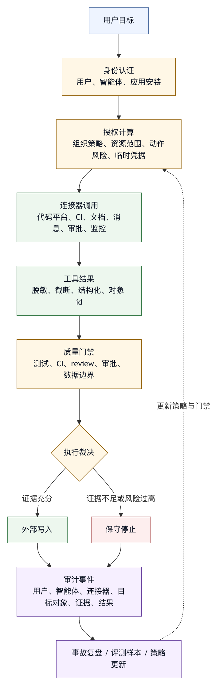

# 第二十五章 企业集成

## 25.1 Agent OS 进入企业后的问题变化

个人开发者使用 coding agent，最常见的问题是：它能不能理解项目、改对代码、跑过测试、节省时间。企业使用 Agent OS，问题会扩大很多：它是谁在用，代表谁行动，能访问哪些仓库，能不能看到敏感代码，能不能触发 CI，能不能创建 issue，能不能给客户发消息，能不能接触生产凭据，出了问题谁负责，审计记录在哪里，如何撤销权限，如何复盘事故。

企业集成不能理解为接入更多 API。它是把智能体放进组织的身份、权限、代码、任务、文档、消息、审批、合规和审计体系中。

企业环境中的智能体有三个特点。

第一，它通常代表某个真实身份行动。这个身份可能是用户、服务账号、应用安装、机器人账号或临时凭据。

第二，它会接触组织资产。代码、设计文档、客户数据、运营指标、内部决策、工单和安全策略都可能进入上下文。

第三，它会影响多人流程。一次自动修改可能触发 CI，一条评论可能影响审稿人，一个错误消息可能发到群里，一个错误审批可能启动生产变更。

因此，企业集成要把每一次连接变成可授权、可解释、可审计、可回滚或可补偿的组织行为，而不是“连接更多系统”。

## 25.2 身份：智能体不能没有主体

Agent OS 在企业中需要先建立身份模型。没有身份，审计、权限和责任都无法成立。

常见身份模式包括：

- 用户委托模式：智能体代表当前用户行动。
- 应用安装模式：智能体以某个安装在组织中的应用身份行动。
- 服务账号模式：智能体使用受限服务账号执行自动化任务。
- 临时凭据模式：智能体为单次任务获取短期 token。
- 双主体模式：同时记录用户身份和智能体应用身份。

每种模式都有取舍。

用户委托模式符合人的授权直觉。用户能做的事，智能体在用户授权下做。但它也容易过宽，因为用户权限可能远超当前任务需要。

应用安装模式更适合组织治理。组织可以给应用分配仓库、API scope 和审批策略。但它可能弱化个人责任，需要额外记录触发用户。

服务账号模式适合无人值守任务，但风险在于服务账号长期存在、权限难以收缩、凭据容易被误用。

临时凭据模式最符合最小权限。系统为某次任务、某个资源、某段时间发放有限权限。缺点是实现复杂，需要身份平台和外部系统支持。

成熟企业 Agent OS 通常采用组合模式：用户发起任务，智能体使用组织批准的应用身份访问资源，关键外部副作用需要用户或审批人确认，trace 同时记录用户、智能体、应用安装和临时凭据范围。

## 25.3 认证与授权：登录之后还要授权

企业系统常把认证和授权混在一起。对 Agent OS 来说，这会造成严重风险。

认证回答“你是谁”。授权回答“你能做什么”。用户完成登录，只说明系统知道用户身份；它不说明智能体可以读取所有仓库、修改所有 issue、运行所有 CI 或发送所有消息。

Agent OS 需要把授权做成分层模型：

- 组织授权：组织是否允许使用某类智能体能力。
- 应用授权：某个 app 或 connector 是否被批准。
- 资源授权：哪些仓库、项目、文档、群组或数据集可访问。
- 动作授权：读取、评论、创建、修改、删除、发布是否允许。
- 任务授权：当前任务是否需要这项能力。
- 临时授权：授权是否有时间、次数和上下文限制。

外部系统往往提供 OAuth、GitHub App、OIDC、API token 或 webhook 等机制。Agent OS 不应把这些机制简单暴露给模型，而应把它们包装成受治理的工具。模型不需要知道 token，模型只需要请求“读取这个 issue”“创建这条评论”“运行这个测试工作流”。Harness 决定是否有凭据、凭据范围是否足够、是否需要审批，以及如何记录。

凭据绝不能进入模型上下文。凭据应由工具执行层使用，并在输出中脱敏。模型看到的应该是动作结果，不能是 secret 本身。

## 25.4 代码平台集成

代码平台是 coding agent 最核心的企业集成对象。它通常包括仓库、分支、commit、pull request、代码审查、issue、release、CI 状态和权限。

Agent OS 与代码平台集成时，应区分本地工作区动作和远程平台动作。

本地动作包括读取文件、修改文件、运行测试、查看 diff、提交本地 commit。远程动作包括打开 PR、评论、请求 review、修改 issue、触发 CI、合并 PR、发布 release。

本地动作不一定低风险，远程动作也不一定高风险，但远程动作通常有更大协作影响。因此远程动作应更强调身份、审批和审计。

代码平台工具应避免只提供通用 API 调用。更好的工具是领域化动作：

- 查看 issue。
- 读取 PR diff。
- 总结审稿意见。
- 创建 PR 草稿。
- 添加 PR 评论。
- 请求指定审稿人。
- 查询 CI 状态。
- 下载失败 job 日志。
- 生成 release note。

这些工具比“调用任意 REST API”更容易治理。它们有清晰参数、风险等级和输出格式。对于高风险动作，如合并 PR、推送 protected branch、删除分支、发布 release，应默认要求人工审批或组织策略授权。

代码平台集成还要保护未提交修改。智能体在本地工作区生成 diff，不应在没有用户确认时推到远端。远端 PR 内容也应来自可审查 diff，不能只来自模型口头描述。

## 25.5 Issue 与项目管理系统

Issue、任务和项目管理系统是智能体理解工作意图的重要来源。用户常常希望智能体根据 issue 描述修复 bug、实现需求、更新状态、拆分子任务或生成验收清单。

这类集成有三类风险。

第一，issue 内容可能不完整。它可能缺少上下文、包含错误假设、引用过期设计、或者被评论串污染。智能体不应把 issue 当作绝对真相，而应把它作为需求输入之一。

第二，issue 评论是外部输入，可能包含 prompt injection。任何来自 issue、PR、评论、文档或聊天系统的文本，都应标注来源，并在工具调用和权限判断中视为不可信内容。

第三，写回项目系统是协作行为。修改状态、指派人员、关闭 issue、添加标签、发评论，都会影响团队流程。智能体可以准备建议，但关键写入应根据组织规则审批。

良好的 issue 工具应保留对象 id、链接、状态、作者、更新时间和写入结果。最终回答中不应只说“我更新了 issue”，而应说明更新了哪个对象、写入了什么、是否成功、是否可撤销。

## 25.6 CI 与诊断系统

CI 是企业软件工程中的重要证据来源。Agent OS 应能读取 CI 状态、失败 job、日志、构建产物和测试报告，并把它们纳入质量门禁。

但 CI 集成不能简单等同于“让智能体触发工作流”。触发 CI 可能消耗资源、占用 runner、访问 secret、部署临时环境，甚至触发发布链路。Agent OS 应区分：

- 读取 CI 状态。
- 读取失败日志。
- 重新运行失败 job。
- 触发普通测试工作流。
- 触发部署工作流。
- 修改 CI 配置。

读取状态通常低风险。重新运行测试有成本风险。触发部署工作流则是高风险动作。修改 CI 配置可能改变组织安全边界，应进入严格审查。

CI 日志也需要治理。日志可能包含 secret、内部路径、客户数据或攻击性输出。工具层应做脱敏、截断和关键片段提取。模型不需要看到完整十万行日志，通常只需要失败测试名、错误摘要、关键堆栈、环境信息和完整日志引用。

对于智能体产出的代码修改，CI 是重要门禁，但不能成为唯一门禁。Agent OS 应把本地验证、CI、diff 审查、权限事件和人工审稿人结合。

## 25.7 文档与知识库

企业知识大量存在于文档、wiki、设计稿、会议纪要、规范和知识库中。Agent OS 需要读取这些材料，才能理解背景。但文档集成是上下文污染和权限泄露的高发区域。

一方面，文档权限必须保留。用户能访问某文档，不等于当前任务需要读取它；某智能体能读取项目 wiki，不等于可以读取 HR、财务或安全事件文档。

另一方面，文档内容应带来源。模型在回答中引用设计决策时，应能追溯到文档、章节、更新时间和作者。过期文档应被标注，不应与最新代码事实混为一谈。

再次，文档写入需要格式和审稿。智能体可以草拟 ADR、变更说明、Runbook、FAQ 和用户文档，但发布到知识库、覆盖规范或修改政策文档通常需要人工审查。

知识库工具应支持检索、读取、引用、生成草稿、创建评论和提出修改建议。直接覆盖正式文档应视为高风险动作。

## 25.8 消息系统与通知

消息系统是企业智能体最容易被滥用的集成。发送消息看似无害，实际可能影响多人、泄露信息、制造噪声或冒充用户。

Agent OS 处理消息系统时，应区分：

- 本地生成消息草稿。
- 发送给当前用户。
- 发送到工作群。
- 回复已有线程。
- @ 指定人员。
- 发送外部客户消息。
- 发送包含敏感数据的消息。

不同动作风险完全不同。给用户自己生成草稿几乎无风险；在公司大群中代表用户发结论风险很高；给客户发消息可能涉及法律和商务责任。

消息工具应默认要求预览。用户应看到接收者、线程、内容、附件、提及对象和敏感信息提示。智能体不应在没有明确授权时群发或跨组织发送。

通知也是成本。过多自动通知会导致团队忽略智能体。成熟系统应支持通知策略：只通知阻塞、失败、需要审批、完成摘要或高风险事件。后台任务尤其需要清晰通知边界。

## 25.9 审批系统

企业已有审批系统时，Agent OS 不应重新发明所有审批流程。它应能接入组织审批：代码所有者审批、变更审批、安全审批、数据访问审批、发布审批和预算审批。

但接入审批系统并不等于把所有问题都丢给审批。Harness 仍然要先做风险分类、证据整理和范围收敛。一个好的审批请求应包含：

- 任务目标。
- 请求动作。
- 目标资源。
- 风险等级。
- 相关 diff 或内容预览。
- 已通过检查。
- 未验证项。
- 回滚或补偿方案。
- 有效期。

审批结果应进入 trace。批准、拒绝、超时、撤回和部分批准都要被模型和用户看到。拒绝后，智能体应停止相关动作或选择低风险替代，不能重复请求。

审批系统还应支持最小授权。例如，审批人可以批准“只对这个 PR 添加评论”，而不是批准“允许智能体写入所有代码平台资源”。

## 25.10 审计日志与证据链

企业集成后的每个外部动作都应留下证据。审计日志是事故调查、责任界定和系统改进的基础，不是事后合规表演。

审计记录应包括：

- 发起用户。
- 智能体或应用身份。
- 会话 id 和 run id。
- 工具名称。
- 外部系统。
- 目标对象。
- 动作类型。
- 参数摘要。
- 权限决策。
- 审批记录。
- 执行结果。
- 时间戳。
- 相关 trace。

审计日志应避免保存敏感原文。参数摘要和脱敏策略很重要。对于外部系统写入，记录对象 id 和链接通常比记录完整内容更可控；对于高风险内容，可能需要加密或限制访问。

审计还要支持关联。一次智能体任务可能读取 issue、修改文件、创建 PR、触发 CI、发送通知。审计系统应能把这些动作串成一条证据链，不能让它们分散在各系统日志中。

## 25.11 数据边界与合规

企业环境中的智能体会处理不同敏感等级的数据。代码、客户数据、日志、财务信息、个人信息、安全漏洞和商业计划，不能用同一套默认策略。

Agent OS 需要数据分类和边界控制：

- 哪些数据可进入模型上下文。
- 哪些数据只能在本地工具中处理。
- 哪些数据必须脱敏。
- 哪些数据禁止出境。
- 哪些数据不能进入长期记忆。
- 哪些 trace 需要加密或短期保留。
- 哪些输出需要人工审查。

合规要求因行业和地区不同而变化。本书不把具体法规展开为法律建议，但工程上必须预留策略层。不要把数据保护写死在 prompt 中。数据边界应由工具层、上下文装配层、凭据层、日志层和组织策略共同执行。

## 25.12 企业集成架构模式

企业 Agent OS 常见架构可以分为三层。

第一层是连接器层。它负责接入代码平台、CI、文档、消息、审批、身份和监控系统。连接器隐藏凭据，提供领域化工具。

第二层是治理层。它负责权限、审批、审计、脱敏、数据分类、策略冲突、版本和组织配置。

第三层是智能体运行层。它负责上下文装配、模型调用、工具选择、trace、回滚、质量门禁和最终交付。

三层不能倒置。模型不应直接拿凭据调用外部 API；连接器不应绕过治理层；治理层不应依赖模型自觉遵守；UI 不应只显示最终结果而隐藏外部动作。

企业集成最稳妥的做法，是把所有外部系统动作都设计成工具系统的一部分。工具有 schema、权限、输出、错误、审计和回滚语义。这样外部系统不会成为 harness 之外的暗门。

## 25.13 常见失败模式

企业集成中的常见失败模式包括：

第一，把用户登录当成全局授权。用户登录后，智能体获得用户所有权限。

第二，把 API token 放进上下文。模型看到 secret，是严重边界失败。

第三，用通用 API 工具替代领域工具。模型可以调用任意 endpoint，权限难以治理。

第四，不区分读取和写入。读取 issue 与关闭 issue 不是同一风险。

第五，不审查外部输入。Issue、PR 评论、文档和聊天消息中的 prompt injection 进入行动循环。

第六，通知滥用。智能体自动向群组或外部用户发送未经确认的信息。

第七，审批缺少证据。审批人只看到“是否允许智能体执行操作”，看不到 diff、对象和风险。

第八，审计碎片化。每个系统都有日志，但无法串起一次智能体任务。

第九，长期凭据过宽。服务账号常年拥有高权限，且缺少轮换和最小权限。

第十，合规策略写在 prompt 里。模型可能忘记或误解，系统没有硬边界。

这些问题的共同根源，是把企业集成当作 API 集成，没有把它看成组织行为集成。

## 25.14 企业集成检查表

设计企业级 Agent OS 时，可以使用以下检查表。

身份：

- 每次动作是否有用户身份、智能体身份和应用身份？
- 是否使用最小权限和短期凭据？
- 凭据是否从不进入模型上下文？

授权：

- 组织、应用、资源、动作、任务和临时授权是否分层？
- 读取、写入、删除、发布是否分开治理？

代码平台：

- PR、issue、CI、review 和 release 是否使用领域工具？
- 高风险远程动作是否需要审批？

文档与知识库：

- 文档权限和来源是否保留？
- 过期文档是否标注？
- 正式文档写入是否有审稿？

消息：

- 发送前是否预览接收者、内容、提及和附件？
- 是否限制群发、外部发送和敏感信息发送？

审批：

- 审批请求是否包含证据、风险、范围和有效期？
- 审批结果是否进入 trace？

审计：

- 外部动作是否有对象 id、工具、参数摘要、权限决策和结果？
- 是否能串起一次智能体任务的完整证据链？

数据：

- 是否有数据分类、脱敏、保留和出境策略？
- Trace、记忆和评测样本是否遵守数据边界？

企业集成的目标，是让智能体进入组织工作流，同时不破坏组织的信任边界。

## 25.15 Enterprise Connector Manifest

企业连接器需要 manifest。它与插件 manifest 类似，但更强调身份、数据边界、外部对象和审计。连接器通常接触组织核心系统，因此不能只声明“提供哪些工具”，还要声明“代表谁行动、访问什么资源、产生什么证据”。

一个企业连接器 manifest 可以这样表达：

```yaml
enterprise_connector:
  name: code-platform-connector
  version: 2.3.0
  owner: developer-platform
  systems:
    - github_enterprise
    - ci_platform
  identity:
    mode: app_installation
    records_triggering_user: true
    supports_short_lived_tokens: true
  resources:
    repositories:
      scope: selected_repositories
      selection_source: organization_policy
    pull_requests:
      read: true
      comment: approval_required
      merge: denied
  tools:
    - name: pr.read_diff
      risk: low
      audit: required
    - name: pr.create_comment
      risk: medium
      approval: preview_required
    - name: ci.rerun_failed_job
      risk: medium
      approval: conditional
    - name: release.publish
      risk: high
      approval: organization_change_approval
  data_policy:
    secrets_to_model: denied
    log_retention_days: 30
    pii_redaction: required
  audit:
    event_stream: organization_audit_log
    include_run_id: true
    include_external_object_id: true
```

Manifest 的意义，是让企业集成从“接上 API”变成“声明组织契约”。平台团队可以审查工具风险，安全团队可以审查数据边界，项目团队可以知道哪些仓库被授权，用户可以在审批提示中看到连接器来源。

GitHub Apps、组织审计日志和 Actions OIDC 资料提供了企业平台身份与审计结构的产品例证：应用安装、组织审计事件、CI/CD 中的 OIDC 身份联合和云端短期 token，都在把“谁可以做什么”从静态 token 推向更可治理的模型。〔注25-1〕 Agent OS 应借鉴这种方向，避免让模型持有长期密钥。

## 25.16 短期凭据与委托链

企业智能体最危险的设计之一，是把长期高权限 token 交给运行时。长期 token 一旦泄露，影响范围大；一旦进入模型上下文，边界已经破裂；即使没有泄露，也很难按任务最小授权。

更稳妥的做法是使用委托链和短期凭据：

1. 用户发起任务，并通过企业身份系统认证。
2. Agent OS 根据任务、资源和动作计算所需权限。
3. 治理层检查组织策略、项目策略和用户权限。
4. 若需要，生成审批请求。
5. 审批通过后，凭据代理为特定连接器发放短期凭据。
6. 工具执行层使用凭据调用外部系统。
7. 凭据不进入模型上下文，执行结果经过脱敏后返回。
8. 审计日志记录用户、智能体、连接器、凭据范围、目标对象和结果。

这个流程把模型排除在凭据处理之外。模型只表达意图和解释结果；凭据代理、连接器和治理层处理实际授权。GitHub Actions OIDC 文档可支撑这一安全方向：工作流可以通过身份联合从云服务获得短期 token，避免长期保存云凭据。〔注25-2〕 对 Agent OS 来说，同样的思想可以推广到代码平台、CI、内部 API 和云资源。

短期凭据不是银弹。它仍需严格限制 audience、scope、过期时间、目标资源和可调用动作；也需要审计凭据发放和使用。但它比“把一个万能 API token 塞进工具环境”更接近企业治理要求。

## 25.17 案例：错误的 PR 评论为什么是企业事故

设想一个智能体在修复支付模块 bug 后，准备在 PR 中评论：“相关测试已通过，可以合并。” 它读取了本地测试结果，但没有读取远端 CI。由于连接器工具设计过宽，智能体直接调用代码平台 API 在 PR 中发布了评论。实际情况是远端 CI 仍有一个集成测试失败，且失败与支付配置有关。审稿人看到智能体评论后降低警惕，最终合并导致回滚。

这类问题已经超出“智能体总结不准确”，属于企业集成事故。原因包括：

第一，评论是协作动作，不是本地文本。它会影响审稿人判断。第二，智能体的声明没有绑定远端 CI 证据。第三，连接器允许直接写评论，没有预览和门禁。第四，审计日志没有把评论与本地测试、远端 CI 和质量门禁关联起来。

修复方案应包括：

1. PR 评论工具默认进入预览，除非是低风险草稿。
2. 声称“可合并”必须检查远端 CI、review 状态和质量门禁。
3. 评论证据包应包含本地验证、远端 CI、未验证项和残余风险。
4. 高影响评论可以要求用户确认或使用“建议评论”而非直接发布。
5. 审计日志记录外部评论 id、触发用户、agent run、证据来源和审批结果。

企业集成中的写入动作要按组织影响评估，不能按 API 难度评估。发布一条 PR 评论可能比修改一个本地文件更能影响团队流程。

## 25.18 表 25-1：Enterprise Audit Event 字段

企业审计不应只记录“调用了哪个 API”。它应能回答一次智能体动作的完整证据链。表 25-1 把企业审计事件拆成可核查字段。

| 字段组 | 记录对象 | 用于回答的问题 |
|---|---|---|
| 事件元数据 | `event_id`、时间戳、组织 | 这次审计事件何时发生，属于哪个组织和哪条记录。 |
| 用户 | 用户 id、角色 | 谁触发或批准了本次动作。 |
| 智能体 | session、run、profile、模型类别 | 哪一次智能体运行提出或执行了动作。 |
| 连接器 | 连接器名称、版本、身份模式 | 通过哪个外部系统接口行动，使用什么身份模式。 |
| 动作 | 类型、风险、目标对象、参数摘要 | 智能体想对哪个外部对象做什么，风险有多高。 |
| 授权 | 策略结果、审批要求、批准人、授权范围 | 动作是否被允许，允许范围是否精确。 |
| 证据 | 本地测试、远端 CI、质量门禁 | 行动前的证据是否支持该动作。 |
| 结果 | 是否执行、失败或拦截原因 | 外部写入是否实际发生，若未发生，是哪个门禁拦截。 |

下面是一个外部写入动作的审计事件模板：

```yaml
enterprise_audit_event:
  event_id: audit_789
  timestamp: 2026-05-27T11:42:10Z
  organization: acme
  user:
    id: user_123
    role: developer
  agent:
    session_id: sess_456
    run_id: run_456_09
    profile: coding-interactive
    model_class: coding-agent
  connector:
    name: code-platform-connector
    version: 2.3.0
    identity_mode: app_installation
  action:
    type: pr.create_comment
    risk: medium
    target:
      system: github_enterprise
      repository: payment-service
      object_type: pull_request
      object_id: 842
    parameter_summary:
      comment_length: 438
      mentions: []
      includes_test_claim: true
  authorization:
    policy_result: allowed_with_preview
    approval:
      required: true
      approved_by: user_123
      scope: this_comment_once
  evidence:
    local_tests:
      status: passed
      command_ref: trace_tool_32
    remote_ci:
      status: failed
      checked_at: 2026-05-27T11:41:02Z
    quality_gate:
      status: failed
      reason: remote_ci_failed
  result:
    executed: false
    reason: gate_failed_before_write
```

这个模板有意把“未执行”也记录下来。很多企业审计只关注成功写入，但对智能体系统来说，被门禁拦截的高风险动作同样重要。它能证明系统正在工作，也能为后续规则调整提供样本。

审计事件还应支持关联。一次任务可能产生多个 audit event：读取 issue、下载 CI 日志、创建 PR 草稿、请求审批、发送通知。它们都应通过 session id、run id 和外部对象 id 串起来。没有关联，审计日志只是碎片；有关联，审计才成为证据链。

## 25.19 图 25-1：企业集成证据链

图 25-1 展示企业集成中身份、授权、连接器、门禁和审计之间的证据链。

<figure><figcaption><p>图 25-1：企业集成证据链</p></figcaption></figure>

```text
用户目标
  |
  v
身份认证：用户 / 智能体 / 应用安装
  |
  v
授权计算：组织策略 / 资源范围 / 动作风险 / 临时凭据
  |
  v
连接器调用：代码平台 / CI / 文档 / 消息 / 审批 / 监控
  |
  v
工具结果：脱敏、截断、结构化、对象 id
  |
  v
质量门禁：测试、CI、review、审批、数据边界
  |
  v
外部写入或保守停止
  |
  v
审计事件：用户、智能体、连接器、目标对象、证据、结果
  |
  v
事故复盘 / 评测样本 / 策略更新
```

这条链的关键，是模型从未直接持有凭据，也不单独决定外部动作是否执行。模型提出计划、解释证据和生成草稿；harness 负责授权、工具执行、门禁和审计；用户和组织保留最终控制。

OpenAI 关于 Codex 安全运行的资料强调 sandbox、approval policy、网络边界、身份凭据和 agent-native telemetry 等控制点；Codex 企业治理资料则提供 analytics dashboard、Analytics API 和 Compliance API 等组织可观测与审计能力。〔注25-3〕 本书据此归纳同一个工程原则：企业智能体的价值不只在能写代码，更在能把行动放入可治理证据链。

## 25.20 企业资源图谱

企业集成不能只维护一组连接器配置。随着智能体能力扩大，组织需要知道某次任务可能接触哪些资源、这些资源属于谁、彼此如何关联，以及哪些动作会造成跨系统影响。这需要企业资源图谱。

资源图谱中的节点至少包括用户、团队、智能体应用、profile、连接器、仓库、分支、PR、issue、CI workflow、部署环境、文档空间、消息群组、审批流、数据集、云资源、secret、成本中心和审计主题。边则描述拥有、授权、依赖、触发、写入、订阅、审批、通知和成本归属关系。

例如，一个“修复支付服务 bug”的任务可能看似只涉及一个仓库，实际资源链可能是：用户属于支付团队；agent profile 允许访问 payment-service 仓库；仓库触发 CI；CI 访问测试数据库；PR 通知支付值班群；发布流程需要变更审批；相关设计文档在受限知识库中；审计事件归属研发平台成本中心。如果资源图谱缺失，权限决策只能看到单点对象，看不到链式影响。

资源图谱用于让 harness 计算风险，不是为了让模型获得更多上下文。它可以回答：这个动作是否跨团队？是否触达生产环境？是否读取敏感文档？是否会通知客户支持群？是否会消耗受限 runner？是否需要代码拥有者审批？当智能体计划调用外部工具时，治理层应先在资源图谱中展开影响半径，再决定是否允许、降级、请求审批或要求人工接管。

资源图谱还支持事故复盘。一次错误 PR 评论如果最终导致发布回滚，复盘不应只查看评论文本，还要查看它影响了哪些审稿人、哪些 CI 信号被忽略、哪些审批没有触发、哪些通知让团队产生错误信心。企业智能体的审计只有与资源图谱结合，才能从“动作流水账”提升为“组织影响分析”。

## 25.21 身份域、租户与离职回收

企业身份不是一个全局用户表。大型组织通常存在多身份域：员工目录、代码平台账号、云平台账号、工单账号、知识库账号、外包人员身份、机器人账号和临时访客身份。Agent OS 如果只记录一个 user id，就无法正确处理跨系统委托。

企业集成层应维护身份映射。它需要知道某个自然人在不同系统中的账号、角色、团队、雇佣状态、外部协作者状态和审批资格；也需要知道某个智能体应用使用的是应用安装身份、服务账号还是代表用户的 delegated identity。身份映射不应由模型推断，而应来自组织身份源和连接器的明确返回。

租户边界同样重要。在单一公司内部，事业部、区域、项目、客户和数据域都可能形成逻辑租户。一个智能体在 A 租户中获得的文档访问权，不能自动用于 B 租户；一个 profile 在研发场景中可用的代码连接器，不能自动进入客户支持场景；一个临时授权的有效范围，必须绑定租户、资源和任务。

离职和转岗是身份治理的压力测试。用户离职后，智能体是否还保留其长期记忆？是否仍能使用他创建的连接器授权？后台任务是否继续以他的身份运行？他批准过的策略例外是否仍有效？转岗后，他是否还能访问旧团队的仓库、文档和审计记录？如果这些问题没有答案，智能体平台会把组织身份变化变成隐蔽的权限残留。

成熟系统需要离职回收流程。用户身份状态变化时，应暂停或撤销其个人授权、停止代表该用户运行的后台任务、重新归属共享智能体应用、清理个人凭据、保留必要审计记录，并标记受影响的记忆、规则和任务模板。对企业智能体来说，身份生命周期是 harness 运行边界的一部分，不只是 IT 后台事务。

## 25.22 凭据代理与密钥污点

凭据不能进入模型上下文。企业 Agent OS 还需要把凭据视为带污点的数据对象。密钥污点意味着：一旦某段数据可能包含 secret，就必须在存储、传输、日志、工具输出、trace、评测样本和最终回答中执行特殊处理。

凭据代理是处理这类风险的核心组件。它不把 secret 交给模型，也不把 secret 交给普通工具参数，而是在受控执行层完成凭据交换、注入、使用和销毁。模型请求的是领域动作，连接器请求的是短期能力，凭据代理根据策略决定是否发放、发放给谁、持续多久、能访问哪个资源。

凭据代理至少应支持五类能力。

第一，凭据解析。把组织授权、应用安装、用户委托、服务账号和临时 token 转成统一的能力对象。

第二，最小范围。按外部系统、资源、动作、时间、运行环境和任务 id 限定凭据。

第三，使用证明。记录凭据何时被发放、哪个连接器使用、调用了什么外部对象、返回什么结果。

第四，输出净化。外部系统错误消息、调试日志和响应体中可能带出 token、URL 签名、cookie 或内部 endpoint，工具层必须识别并脱敏。

第五，吊销和轮换。凭据泄露、任务取消、用户离职、连接器退役或策略变更时，系统要能撤销凭据并追踪受影响 run。

密钥污点还影响评测。真实 trace 很适合沉淀为 eval case，但含有 secret 的 trace 不能直接进入样本库。系统应在样本化前运行脱敏、替换和字段裁剪；对高敏案例，只保留结构和风险模式，不保留原文。没有这个过程，组织很容易在“用事故改进系统”的过程中制造新的数据泄露。

## 25.23 策略决策点与策略执行点

企业集成要避免一个常见错误：把策略写在连接器内部。这样做短期简单，长期会形成多个互不一致的安全边界。代码平台连接器有一套审批规则，消息连接器有另一套，文档连接器又有一套。模型可以通过替代工具绕过限制，审计系统也难以解释为什么同类动作得到不同结果。

更稳妥的模式，是区分策略决策点和策略执行点。策略决策点负责读取组织策略、资源图谱、身份、任务、风险等级、审批状态和数据分类，给出允许、拒绝、降级、请求审批或要求人工接管的结论。策略执行点分布在工具 runner、连接器、凭据代理、上下文装配、输出防火墙和 UI 中，负责把结论落实为真实边界。

这种分离有三个好处。

第一，策略可解释。一次外部写入被拒绝时，系统可以说明命中了哪条组织规则、缺少哪个审批、目标资源属于哪个租户，避免只返回“403”。

第二，策略可测试。平台可以把策略输入抽成样本：某用户、某 profile、某连接器、某资源、某动作、某审批状态。策略变更前后运行样本库，就能发现误放行和误拒绝。

第三，策略可演进。新增连接器时，不必把所有规则重新实现一遍；连接器声明资源和动作语义，决策点统一判断风险，执行点统一审计。

策略执行点不能只依赖模型。模型可能误解策略，也可能被外部输入诱导。执行点应在工具调用前、凭据发放前、外部写入前和输出发布前。企业集成的安全性来自这些位置的硬边界，而不是来自模型承诺“我会小心”。

## 25.24 数据驻留、保留与跨境边界

企业集成常常会碰到数据驻留问题。某些代码、日志、客户记录、合同、工单或安全事件数据，只能在特定区域、特定环境或特定供应商边界内处理。Agent OS 如果把这些数据拼进上下文并发送到不合适的模型、存入长期记忆或写入集中日志，就可能违反组织政策。

工程上，数据驻留应进入上下文装配和模型路由。每个资源应带数据域、敏感等级、可用模型集合、可出境策略、保留周期和可进入记忆的规则。上下文装配层在选取文档、日志和代码片段时，应同时检查任务相关性和数据策略；模型路由层在选择供应商、区域和部署形态时，应检查该上下文是否允许发送。

保留策略也不能事后处理。企业智能体会产生 transcript、trace、工具输出、审批记录、草稿、diff、评测样本和事故复盘材料。不同材料应有不同保留周期。审批记录和审计事件可能需要长期保存；原始日志和含敏感数据的上下文包应短期保存；模型中间推理、临时检索结果和被拒绝的敏感输出可能不应持久化。

跨境边界还影响协作。一个智能体在全球团队中处理同一任务时，可能需要把摘要发送给另一区域同事。摘要也可能包含敏感信息。成熟系统应支持“可共享摘要”生成：先根据数据策略裁剪内容，再保留证据引用，再由用户确认。不能把“总结一下发给某群”视为低风险动作。

本书不提供法律意见，但工程原则很明确：数据策略不能停留在合规文档中。它必须变成资源标签、上下文选择、模型路由、日志保留、输出发布和审计检索的运行时约束。

## 25.25 连接器版本漂移

企业连接器接入的外部系统会不断变化。API 字段会新增或废弃，权限模型会调整，webhook payload 会变化，错误码语义会改变，速率限制会收紧，审计日志格式会升级。对普通应用来说，这些变化通常表现为集成故障；对智能体来说，它还可能表现为行为漂移。

例如，代码平台的 PR review 状态字段发生语义调整，连接器仍然把旧字段映射为“可合并”。模型基于错误状态写出“已满足 review 要求”的评论。此时事故表面上像模型幻觉，根因却是连接器版本漂移。再如，消息系统新增外部成员标识，但连接器没有暴露给审批 UI，用户以为消息发给内部群，实际包含外部顾问。

连接器版本管理应包含四个层面。

第一，外部 API 版本。记录连接器依赖的外部 API、schema、权限和 webhook 版本。

第二，领域语义版本。记录连接器如何把外部字段映射为 harness 内部动作、状态和风险等级。

第三，工具 schema 版本。记录模型可见工具参数、返回结构和错误类型。

第四，策略版本。记录哪些组织策略基于该连接器的语义判断。

版本漂移的治理不能只靠线上报错。连接器应有契约测试和影子验证：定期用真实或仿真对象调用只读接口，检查字段、权限、错误码和审计事件是否符合预期；在外部系统升级前，运行连接器回归样本；在发现漂移后，标记受影响 run 和评测样本。企业智能体的连接器是长期维护的产品接口，不是一次性适配器。

## 25.26 外部副作用的补偿设计

本地文件修改可以通过 git diff、checkpoint 或工作区快照恢复。企业外部系统动作不一定能回滚。发送到群里的消息、发给客户的邮件、关闭的告警、触发的部署、写入的数据、审批流中的记录，可能不能简单删除。即使技术上可删除，组织影响也已经发生。

因此，企业集成要为外部副作用设计补偿。补偿是在真实世界中减轻影响、恢复状态或明确纠正，不是假装事故没有发生。

不同动作需要不同补偿策略。PR 评论可以追加更正评论并标记原评论已失效；issue 状态可以重新打开并记录原因；消息可以在线程中发送撤回说明；错误指派可以重新指派并通知受影响人员；误触发 CI 可以取消 job 并释放资源；误启动部署可能需要进入变更回滚流程；错误读取敏感数据则需要安全事件处理，不能简单“忘记上下文”。

工具 schema 应声明补偿能力。每个外部写入工具都应说明：是否可撤销、如何撤销、撤销是否完整、撤销是否需要审批、撤销后是否保留审计、是否需要通知受影响方。审批 UI 也应展示补偿语义。一个“可删除草稿”的动作和一个“不可撤销发送客户邮件”的动作，不应使用同一审批样式。

补偿设计还会影响智能体行为。对于不可补偿动作，智能体应更多使用草稿、预览、dry run、建议模式和人工接管；对于可补偿但有协作影响的动作，智能体应在执行后保留快速纠正入口；对于已执行的高风险动作，系统应自动创建复盘线索。企业集成的成熟度，体现在错误发生后组织能否有序恢复。

## 25.27 连接器观测与运营指标

企业集成上线后，需要像生产系统一样运营。只看智能体成功率不够，因为许多问题发生在连接器层：外部 API 限流、授权过期、schema 漂移、审批超时、输出脱敏失败、通知噪声、审计写入延迟、数据策略误拒绝等。

连接器运营指标可以分为六类。

第一，健康指标。包括可用性、延迟、错误率、超时率、重试率、外部 API 限流和授权失败率。

第二，风险指标。包括高风险动作数量、审批请求数量、审批拒绝率、策略例外数量、外部写入失败率和补偿触发数量。

第三，数据指标。包括脱敏命中、敏感数据拦截、上下文裁剪、禁止出境拦截、日志保留删除和评测样本净化数量。

第四，协作指标。包括 PR 评论、issue 更新、消息发送、通知打开、人工接管、用户撤销和更正动作。

第五，质量指标。包括外部证据缺失导致的门禁失败、错误状态映射、连接器回归样本失败和用户报告的集成误导。

第六，成本指标。包括 API 调用量、CI rerun 成本、文档检索成本、消息通知量、后台任务占用和人工审批等待时间。

这些指标应能 drill down 到 run、connector、profile、team、resource 和 policy。缺少下钻能力时，平台只能知道“最近外部调用失败变多”，却不知道是某个连接器版本、某个团队配置、某类 API 限流还是某条策略变更造成的。企业集成的运营目标，是让连接器问题早于用户抱怨被发现，早于事故扩大被隔离。

## 25.28 企业集成评测

企业集成也需要评测样本库。很多团队只评测模型能否完成任务，不评测连接器是否正确治理外部系统。结果是离线 demo 表现很好，进入企业环境后却在权限、审批、审计和数据边界上不断出事故。

企业集成评测应覆盖至少八类样本。

第一，身份样本。不同用户、团队、服务账号、应用安装和临时委托下，同一动作是否得到正确授权。

第二，资源样本。同一工具作用于不同仓库、文档空间、租户、环境和数据集时，策略是否正确区分。

第三，动作样本。读取、草稿、评论、发送、删除、部署、审批和发布是否有不同风险处理。

第四，外部输入样本。Issue、PR 评论、文档和聊天中含有误导指令、过期信息或 prompt injection 时，智能体是否仍按来源和权限处理。

第五，数据样本。含 secret、个人信息、客户数据、安全漏洞和区域限制的数据是否被正确裁剪、脱敏和保留。

第六，审计样本。成功执行、被拒绝、审批超时、门禁失败、补偿执行和连接器异常是否都生成可关联审计事件。

第七，漂移样本。外部 API 字段变化、权限变化、错误码变化和 webhook 延迟是否被检测。

第八，协作样本。错误 PR 评论、误发群消息、错误 issue 状态、重复通知和人工接管是否能触发恰当恢复。

这类评测应在连接器上线、策略变更、外部 API 升级、模型升级和 profile 发布前运行。企业集成评测的价值，是证明系统能在组织边界内正确行动，而不只是证明它能连接外部 API。

## 25.29 企业集成成熟度

企业集成可以用成熟度模型评估。

L0 阶段，没有企业集成。智能体只在本地或个人账号中运行。

L1 阶段，有简单 API token。智能体可以访问外部系统，但身份、权限和审计粗糙。

L2 阶段，有连接器。系统把代码平台、CI、文档、消息等封装成工具，但策略主要分散在各连接器内部。

L3 阶段，有统一身份、短期凭据、资源范围、动作风险、审批和审计事件。外部动作进入 trace。

L4 阶段，有企业资源图谱、策略决策点、数据驻留、连接器版本管理、补偿设计、运营指标和集成评测。

L5 阶段，企业集成成为组织控制面。连接器生命周期、策略发布、事故复盘、评测样本、成本治理、合规审查和平台运营形成闭环。

成熟度提升的关键，是让每个系统接入后都遵守同一套组织行为契约，而不是接入更多系统。企业智能体最终要承担的是能否在复杂组织中可信地完成工作，而不只是能不能调用 API。

## 25.30 常见反模式补充

除了前文列出的失败模式，企业集成还有几类更隐蔽的反模式。

第一，只治理写入，不治理读取。错误读取敏感文档、客户数据或安全日志，同样可能造成泄露和污染。

第二，只看用户权限，不看任务必要性。用户有权访问某资源，不代表当前任务应该把它放进上下文。

第三，把服务账号当作平台捷径。服务账号能快速打通系统，也最容易掩盖真实责任主体。

第四，把审批当作责任转移。审批人如果看不到证据、范围和补偿方式，批准没有治理意义。

第五，把审计当作日志备份。审计保存的是可复盘的主体、对象、决策和结果，不是更多文本。

第六，忽略连接器退役。外部系统替换后，旧 webhook、token、后台任务和工具别名仍可能继续运行。

第七，让模型解释权限。权限解释可以由模型润色，但权限判断必须来自可执行策略和当前证据。

第八，把企业集成做成产品特例。每接一个系统都单独设计，会让组织策略无法统一、事故无法复用、用户体验无法稳定。

这些反模式的共同点，是把企业集成看成“接通能力”，没有把它看成“定义组织行动边界”。企业集成应让能力更强，也让边界更清楚。

## 25.31 第二十五章小结

企业集成不是把 Agent OS 接上更多 API。它要求智能体进入身份、授权、代码平台、issue、CI、文档、消息、审批、审计和合规体系。每一次外部动作都应有主体、权限、证据、风险、结果和追溯路径。

成熟的企业 Agent OS 会把连接器、治理层和智能体运行层分开：模型请求动作，harness 做授权和审计，工具层使用凭据，用户和组织保留控制权。企业可信基础设施来自这组分工，而不只是来自更多连接器。
