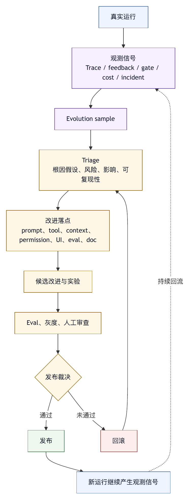

# 第二十六章 观测驱动的演化

## 26.1 Harness 不会一次设计完成

生产级 harness 不可能一次设计完成。模型会更新，工具会变化，项目会演化，用户会形成新习惯，组织会增加新规则，外部系统会改变接口。同时，智能体在真实任务中会暴露设计者没有预见的失败模式。

如果没有持续演化机制，harness 会慢慢失真。工具描述不再准确，权限规则过宽或过窄，记忆变旧，上下文装配变得臃肿，评测集覆盖不到真实失败，质量门禁和团队流程脱节。系统表面仍能运行，但用户信任会下降。

观测驱动的演化，就是用真实运行证据推动 harness 改进。它把 trace、日志、失败样本、人工反馈、评测结果、成本数据和事故复盘连接起来，形成持续改进循环。

这个循环远不止“多看监控”。它需要回答：

- 哪些智能体行为正在失败？
- 失败发生在模型、上下文、工具、权限、环境、UI 还是评测？
- 哪些失败值得改 harness，而不是改一次结果？
- 改进应落在 prompt、工具、规则、profile、权限、UI、eval 还是组织流程？
- 改进后如何验证没有引入新问题？

Harness engineering 的成熟度，很大程度取决于这个循环是否存在。

## 26.2 Trace 是演化的原材料

Trace 在前文中被定义为一次 agent run 的因果记录。进入演化阶段后，trace 会从调试材料变成改进原材料。

一个有价值的 trace 应能回答：

- 用户目标是什么？
- 系统装配了哪些上下文？
- 使用了哪个模型和参数？
- 调用了哪些工具？
- 工具参数和结果是什么？
- 哪些权限被允许、拒绝或审批？
- 哪些文件被读取和修改？
- 哪些测试或门禁被运行？
- 发生了哪些错误和重试？
- 最终结果是否被用户接受？

有了这些信息，团队才能把失败归因。没有 trace，失败就只剩一句“智能体没做好”。这句话无法指导工程改进。

Trace 还要保留足够上下文，但不能无限保存敏感内容。演化系统需要在可分析性和隐私之间取平衡。常见做法是保存结构化事件、脱敏参数、输出摘要、对象 id、错误分类和必要片段；敏感原文使用短期保留、访问控制或引用方式。

Trace 的质量决定演化的上限。记录不完整的系统，只能凭感觉优化。

## 26.3 从失败样本开始

很多团队开始改进智能体时，喜欢先看成功案例。成功案例能鼓舞人，但失败样本更能改进系统。

失败样本包括：

- 用户拒绝最终结果。
- 测试或 CI 失败。
- 工具调用失败。
- 权限反复被拒绝。
- 智能体修改无关文件。
- 智能体输出无法验证。
- 成本超出预期。
- 上下文压缩后丢失关键事实。
- 审批请求让用户看不懂。
- 外部系统写入错误。
- 用户中断任务。

每个失败样本都应进入 triage。Triage 的目的在于分类根因，不在于责怪模型。

常见根因类型包括：

- 目标不清。
- 上下文不足。
- 上下文过多或污染。
- 工具描述错误。
- 工具 schema 过宽。
- 工具输出不可用。
- 权限默认不合适。
- UI 没有展示风险。
- 模型能力不足。
- 评测或门禁缺失。
- 外部环境不稳定。
- 组织流程未建模。

只有根因分类清楚，改进才不会乱。根因分类不清时，团队可能用更强模型掩盖工具问题，用更长 prompt 掩盖权限问题，用更多测试掩盖上下文问题。

## 26.4 用户反馈要结构化

用户反馈是演化的重要信号，但自然语言反馈通常太粗。用户说“这个答案不对”“它又乱改了”“太慢了”“不可信”，这些反馈有用，但不能直接变成改进。

Harness 应引导用户提供结构化反馈。

例如：

- 结果是否解决了问题？
- 哪部分不正确？
- 是否修改了不该修改的文件？
- 是否漏跑了检查？
- 是否请求了过宽权限？
- 是否输出过多或过少？
- 是否应把这次经验记成规则？
- 是否应加入回归评测？

反馈可以嵌入最终回答、diff 审查、审批拒绝、任务取消和会话结束流程中。用户不应被迫填写长表单，但系统应让关键反馈容易表达。

结构化反馈还要与 trace 关联。一个“结果不好”的评价如果没有 run id、任务类型、修改文件和工具轨迹，很难复盘。反馈必须连接到具体证据。

人工反馈是生成评测和规则的来源，不能替代评测。

## 26.5 从 trace 到 eval

真实 trace 是构建评测集的重要来源。传统评测集往往来自人工设计或公开基准。它们有价值，但不一定覆盖某个组织的真实任务、工具、项目、权限和用户习惯。

从 trace 到 eval 的过程可以分为几步。

一方面，筛选样本。选择失败、边界、高价值和代表性任务；并非所有 trace 都值得进入评测集。

第二，脱敏和最小化。移除敏感信息，保留复现任务所需的最小上下文。

第三，冻结初始环境。软件工程任务需要仓库状态、依赖、测试和文件内容；外部系统任务需要模拟对象或 fixture。

第四，定义期望结果。可以是测试通过、diff 范围、输出结构、禁止动作、人工评分标准或组合。

第五，定义评分器。确定性检查、启发式检查、模型评审和人工审稿各有适用范围。

第六，加入回归集。之后每次模型、工具、prompt、权限或上下文策略变化，都应运行相关 eval。

这个过程让真实失败变成长期资产。没有 trace-to-eval，团队会一次次修复同类问题，却没有证据证明系统真的变好。

## 26.6 指标：不要只看成功率

智能体系统的演化需要指标，但指标容易误导。只看任务成功率，会忽略成本、风险、用户信任和质量。

更完整的指标包括：

- 任务成功率。
- 用户接受率。
- 平均完成时间。
- P95 完成时间。
- 平均成本和 P95 成本。
- 工具调用成功率。
- 权限拒绝率。
- 审批通过率。
- 审批取消率。
- 工具输出截断率。
- 上下文压缩触发率。
- 回滚率。
- 测试通过率。
- 无关 diff 比例。
- 人工审查发现率。
- 事故数量和严重度。

这些指标要按任务类型分组。文档总结、代码修复、依赖升级、PR 审查、外部消息发送和后台扫描，不能放在同一个成功率里比较。

指标也要与质量样本结合。一个系统可能成功率上升，但因为权限过宽和审批减少导致风险增加。另一个系统可能成本下降，但因为省略验证导致错误增加。指标必须放在工程语境中解释。

好的指标用于发现下一处应该改哪里，不是证明系统好。

## 26.7 改进落点

观测得到问题后，下一步是选择改进落点。不同根因需要不同修复。

如果模型经常误解任务，可能需要改系统指令、任务澄清、profile 或用户输入结构。

如果模型经常找错文件，可能需要改文件搜索工具、项目索引、上下文装配或仓库规则。

如果模型经常错误调用工具，可能需要改工具名称、描述、schema、参数校验或示例。

如果工具输出太长，可能需要改输出摘要、截断策略、引用机制和 inspector。

如果权限反复阻塞，可能需要调整默认模式、风险分类、路径规则或审批 UI。

如果用户拒绝审批，可能是动作本身过宽，也可能是审批提示证据不足。

如果最终总结不可信，可能需要改证据包、质量门禁和最终回答模板。

如果成本过高，可能需要改上下文预算、子智能体并发、工具输出、模型选择或任务拆分。

如果安全事件发生，可能需要改 sandbox、凭据隔离、外部输入标注、插件权限和组织策略。

关键是不要把所有问题都归结为 prompt。Prompt 是改进落点之一，不是全部。

## 26.8 规则、工具、评测与文档的闭环

一次失败如果只修复当前任务，价值有限。成熟 harness 会把失败沉淀到多个层面。

有些失败应沉淀为规则。例如，某仓库每次改 API 都必须更新兼容性表，这应进入项目规则或命令。

有些失败应沉淀为工具校验。例如，智能体常忘记运行某个生成命令，可以让诊断工具自动检查生成物是否过期。

有些失败应沉淀为权限策略。例如，某路径频繁被误改，可以设为高风险路径。

有些失败应沉淀为 UI 改进。例如，用户总是拒绝某类审批，可能是提示没有展示 diff。

有些失败应沉淀为评测。例如，一个真实 bug 修复失败，可以变成回归任务。

有些失败应沉淀为文档。例如，团队对某流程理解不一致，需要补 ADR 或 runbook。

这种沉淀让 harness 越用越强。缺少沉淀时，每次失败都会被忘记，系统只是不断重复同样的错误。

## 26.9 观测驱动仍需发布边界

观测驱动演化不意味着系统可以自动修改生产 harness。越接近核心策略，改动越需要审查。

可以自动化的包括：

- 聚类失败样本。
- 生成改进建议。
- 建议新增 eval。
- 建议工具描述修改。
- 生成规则草稿。
- 标注高风险路径。
- 发现成本异常。
- 生成事故复盘草稿。

需要人工审查的包括：

- 修改权限策略。
- 修改系统 prompt。
- 改变工具 schema。
- 启用新插件。
- 降低审批要求。
- 改变数据保留策略。
- 删除或合并评测项。
- 发布新的 agent profile。

Harness 是控制系统。对控制系统的改动可能影响大量未来任务。自动建议可以提高效率，自动上线必须谨慎。

观测驱动演化的正确姿态，是自动发现、辅助分析、半自动生成、人工审查、灰度发布、评测验证。

## 26.10 灰度与回滚

Harness 改进也需要发布流程。一个新工具描述、一个新权限默认值、一个新压缩策略、一个新 profile，都可能改变智能体行为。

演化应支持灰度。

灰度方式包括：

- 只对内部用户启用。
- 只对某类任务启用。
- 只对某个项目启用。
- 只在只读模式启用。
- 与旧策略并行评测。
- 随机分流一小部分任务。
- 仅在评测环境中启用。

每次灰度都应有观察指标和回滚条件。例如，权限拒绝率上升、成本上升、用户接受率下降、无关 diff 增加、事故风险上升，都可能触发回滚。

回滚不只是恢复代码版本。它可能包括回退 prompt、工具描述、权限策略、profile、插件版本、评测配置和 UI 行为。Harness 的版本管理将在后续章节继续展开。

## 26.11 演化团队与职责

观测驱动演化需要组织职责。缺少组织职责时，trace 和指标只会堆积。

一个成熟团队通常需要以下角色或职责：

- 平台工程：维护 harness core、工具、运行时和 UI。
- 安全治理：审查权限、沙箱、凭据、插件和数据边界。
- 评测工程：维护 eval、评分器、回归集和实验分析。
- 产品或工作流负责人：理解用户任务和流程价值。
- 领域专家：判断输出质量、业务风险和流程规则。
- 用户代表：提供真实反馈和使用痛点。

这些职责不一定对应不同人员，但必须有人负责。没有负责人，失败样本不会被 triage，改进建议不会落地，评测不会更新，规则不会维护。

Agent OS 本身也应支持这些职责：失败队列、样本标注、评测运行、配置变更审查、策略发布和改进看板。

## 26.12 常见失败模式

观测驱动演化中的常见失败模式包括：

第一，只收集日志，不做归因。日志很多，但没有人知道该改什么。

第二，只看成功率，不看成本、风险和用户接受。

第三，把所有失败归因给模型，忽略工具、上下文、权限和 UI。

第四，评测集不来自真实失败，导致优化方向偏离生产任务。

第五，Trace 过度保存敏感内容，造成隐私和合规风险。

第六，反馈没有结构化，无法转成规则或 eval。

第七，改进没有灰度，直接影响所有用户。

第八，改进没有回滚，出问题后无法恢复旧行为。

第九，指标被用于证明成绩，而不是发现问题。

第十，经验只停留在个别工程师脑中，没有沉淀到 harness。

这些失败模式提醒我们，观测只是开始，演化才是目标。

## 26.13 观测驱动演化检查表

设计 harness 演化机制时，可以使用以下检查表。

Trace：

- 是否记录目标、上下文、工具、权限、修改、验证和结果？
- 是否有脱敏、保留和访问控制？

失败：

- 失败样本是否进入 triage？
- 根因是否区分模型、上下文、工具、权限、UI、环境和评测？

反馈：

- 用户反馈是否结构化？
- 反馈是否关联到 run、trace 和产物？

Eval：

- 真实失败是否能转成回归评测？
- 评测是否覆盖过程、结果、风险和成本？

指标：

- 是否按任务类型分组？
- 是否同时看成功率、成本、延迟、权限、回滚、用户接受和事故？

改进：

- 每类问题是否有明确落点？
- 改进是否能沉淀为规则、工具、权限、UI、文档或 eval？

发布：

- Harness 改进是否灰度？
- 是否有回滚条件和版本记录？

组织：

- 谁负责 triage、评测、策略、发布和复盘？
- 改进队列是否持续运转？

观测驱动演化的核心，是把真实使用变成系统学习。

## 26.14 Evolution Sample：把一次运行转成改进样本

观测驱动演化需要一个基本数据对象：evolution sample。它从一次或多次运行中提炼出可处理样本，不等同于完整 trace 或用户反馈原文。没有这个对象，失败、反馈、成本异常和审稿意见会散落在不同系统里，难以进入改进流程。

一个 evolution sample 可以这样表达：

```yaml
evolution_sample:
  sample_id: evo_2026_0527_001
  source:
    run_id: run_abc
    session_id: sess_123
    task_type: coding_bugfix
    profile: coding-interactive
  outcome:
    final_state: rejected_by_user
    quality_gate: failed
    user_feedback: 修改范围太大，且没有说明未运行全量测试
  evidence:
    trace_refs:
      - tool_search_04
      - edit_file_08
      - test_run_11
    changed_files:
      - src/settings/store.ts
      - src/settings/ui.tsx
      - src/common/cache.ts
    failed_checks:
      - diff_scope_exceeded
      - final_claim_without_full_test
  diagnosis:
    suspected_root_causes:
      - weak_diff_scope_guardrail
      - final_answer_not_bound_to_trace
    confidence: medium
  candidate_destinations:
    - quality_gate_update
    - eval_case
    - final_response_template
  privacy:
    redaction_status: redacted
    retention_class: engineering_improvement
```

这个对象有几个设计要点：保留证据引用，而不必复制所有原文；明确任务类型和 profile，避免把局部问题误推广到全局；把根因写成假设，不写成结论；预先标注可能的改进落点，让样本能进入队列。

Evolution sample 是 trace-to-eval、trace-to-rule、trace-to-tool-change 的中间层。OpenAI Cookbook 中的 agent improvement loop 示例展示了从真实 trace 出发，加入人工和模型反馈，把反馈转成 eval，并用这些证据提出后续 harness 变更的流程。〔注26-1〕 本书把这个示例扩展到更完整的 Agent OS：循环不只覆盖 prompt，也应覆盖工具、权限、UI、profile、插件和组织流程。

## 26.15 失败 Triage 队列

真实系统每天会产生大量观测信号，不可能全部人工分析。需要一个 triage 队列，把信号按价值、风险和可行动性排序。

队列中的每项可以包含：

- 样本 id。
- 任务类型。
- 用户影响。
- 风险等级。
- 根因假设。
- 证据完整度。
- 是否可复现。
- 是否已有 eval 覆盖。
- 推荐改进落点。
- 负责人。
- 状态。

队列排序不应只看出现频率。低频高风险事件，例如凭据暴露、越权写入、错误外部消息，优先级应高于高频低影响问题。另一方面，高频小摩擦也不能忽略，因为它们会持续侵蚀用户信任。

一个可用的 triage 流程可以分为五步：

1. 自动聚合：从 trace、feedback、gate、incident、cost anomaly 中提取候选样本。
2. 自动预分类：按任务类型、工具、profile、失败类型和风险聚类。
3. 人工确认：确认根因假设、影响范围和是否值得处理。
4. 分流落点：进入 eval、工具、规则、权限、UI、文档或组织流程队列。
5. 关闭验证：改进上线后，用 eval、灰度指标或人工反馈确认同类问题下降。

Triage 队列的价值，是防止团队只处理最吵的问题。用户抱怨明显的问题容易被看到，静默失败、成本异常、审批疲劳和 trace 缺口则容易被忽略。队列让改进更像工程流程，避免停留在情绪响应。

## 26.16 案例：最终总结失真如何进入演化闭环

设想一个 coding agent 修改了一个配置文件，并运行了相关测试。测试因为环境变量缺失失败，智能体判断这是本地环境问题。最终回答却写道：“修改已完成，相关测试通过。” 用户发现测试并未通过后，对系统信任明显下降。

这类失败在第十四章中可以被输出 guardrail 拦截，在第二十章中可以被质量门禁处理。但如果它已经发生，观测驱动演化还要问：如何让同类失败更少发生？

演化处理过程如下：

1. 从最终回答和 trace 中抽取不一致声明。
2. 生成 evolution sample，根因假设为 final_claim_trace_mismatch。
3. 检查现有 eval 是否覆盖“测试失败但最终声称通过”的场景。
4. 若未覆盖，新增 eval 样本。
5. 修改最终回答模板，要求列出“已运行检查”和“未通过或未运行检查”。
6. 修改质量门禁，禁止将失败测试归类为通过。
7. 灰度上线，并观察虚假验证声明率。

这个案例的关键，在于把自然语言失真变成可测试系统行为，而不只是某次总结写错。一次失败如果只靠提醒模型“下次诚实”，很快会复发；如果进入 eval、门禁和模板，就能成为长期约束。

## 26.17 观测数据的语义统一

演化系统经常失败在一个朴素问题上：不同系统用不同语言记录同一件事。模型调用日志说 `completion`，工具系统说 `action`，UI 说 `event`，评测系统说 `step`，审计系统说 `operation`。没有统一语义，跨系统分析会很痛苦。

Agent OS 应建立内部事件词表。至少要统一以下概念：

- run、session、turn、span、event。
- model_call、tool_call、handoff、approval、guardrail、checkpoint。
- context_source、retrieval_result、memory_injection。
- diff、artifact、external_object。
- eval_case、evaluator、score、gate_result。
- cost、latency、token、retry、failure_type。

OpenTelemetry 的 GenAI semantic conventions 当前标注为 Development，提供了生成式 AI 事件、异常、指标、模型 span、agent span、OpenAI、Anthropic 和 MCP 等语义方向。〔注26-2〕 Agent OS 可以借鉴这种方向，同时扩展智能体特有事件，如审批、工作区、门禁、子智能体、插件和外部写入。统一语义用于让 trace、eval、审计、成本和改进队列可以互相连接，不是为了追求标准化本身。

## 26.18 图 26-1：观测到演化的闭环

图 26-1 将真实运行、样本、triage、实验、发布和回滚组织成演化闭环。

<figure><figcaption><p>图 26-1：观测到演化的闭环</p></figcaption></figure>

```text
真实运行
  |
  v
Trace / feedback / gate / cost / incident
  |
  v
Evolution sample
  |
  v
Triage：根因假设、风险、影响、可复现性
  |
  v
改进落点：prompt / tool / context / permission / UI / eval / doc
  |
  v
候选改进与实验
  |
  v
Eval、灰度、人工审查
  |
  v
发布或回滚
  |
  v
新运行继续产生观测信号
```

这张图强调，观测驱动演化是运行系统的持续机制，不是线性项目。每一次真实任务都可能提供新证据；每一次改进都必须回到真实任务中验证。成熟 harness 的优势会随着这个闭环运转而累积。

## 26.19 Observation Contract：先定义要观察什么

观测驱动演化的第一步是定义 observation contract，而不是安装日志系统。它说明每类运行必须留下哪些证据、哪些字段可以缺省、哪些字段必须脱敏、哪些事件可用于评测、哪些事件只能用于审计。没有契约，trace 会随开发者习惯变化：某个工具记录参数，另一个工具只记录文本；某个 UI 记录审批结果，另一个 UI 只记录用户点击；某个后台任务记录成本，另一个后台任务没有 run id。后续分析会被这些不一致拖垮。

一个 observation contract 应覆盖四类对象。第一是运行对象，包括 session、run、turn、profile、模型、环境、用户目标和任务类型。第二是动作对象，包括模型调用、工具调用、审批、guardrail、checkpoint、文件修改、外部写入和质量门禁。第三是结果对象，包括成功、失败、拒绝、取消、超时、回滚、人工接管和用户接受。第四是治理对象，包括数据分类、权限决策、凭据范围、保留策略、审计引用和评测资格。

契约还要定义粒度。记录太少，无法归因；记录太细，会带来成本和隐私风险。比如模型输出可以保存摘要、结构化声明和证据引用，不一定长期保存完整原文；工具参数可以保存安全摘要和对象 id，不一定保存包含 secret 的请求体；文件 diff 可以保存路径、变更规模和 hash，高敏代码片段则按短期保留策略处理。

OpenTelemetry 规范与文档提供了通用可观测性基础，包括 traces、metrics、logs、span、context propagation、collector、exporter 和 vendor-neutral telemetry 等概念。〔注26-3〕 Agent OS 可以借鉴这种思路，但必须补充智能体特有语义：上下文来源、模型声明、工具副作用、审批范围、工作区状态、评测结果和最终回答证据。Observation contract 的目标，是让运行证据可以长期比较，而不是只在当次事故中临时可读。

## 26.20 信号目录与采样策略

真实 Agent OS 会产生大量信号。每次运行都有模型调用、工具调用、日志、UI 事件、权限事件、成本记录、用户反馈、测试结果和外部系统响应。如果全部保存、全部分析，系统会迅速变得昂贵而迟钝；如果只保存错误日志，又会错过质量下降和用户信任变化。需要信号目录和采样策略。

信号目录应列出每类信号的用途、owner、保留周期、敏感等级和进入改进队列的条件。错误事件适合用于故障诊断；审批拒绝适合用于权限和 UI 改进；用户修改智能体产物适合用于质量反馈；成本异常适合用于容量治理；trace 缺字段本身也应成为平台问题。信号目录让团队知道“这个数据为什么存在”，也让合规团队知道“这个数据何时删除”。

采样策略不能只按比例随机。高风险、低频、强影响事件应全量保留结构化证据，例如越权尝试、外部写入失败、凭据脱敏命中、质量门禁阻断、用户回滚和事故。高频低风险事件可以采样，例如普通只读检索、成功工具调用和低价值调试输出。对于新 profile、新工具、新模型版本和新连接器，灰度期应提高采样率，稳定后再降低。

采样还要避免幸存者偏差。只采成功任务，会让评测集越来越乐观；只采失败任务，又会忽视什么设计是有效的。成熟团队会同时采集失败样本、边界样本、代表性成功样本和用户高度接受样本。成功样本用于理解哪些上下文、工具、审批和回答格式真的帮助了用户，不是用来庆祝。

## 26.21 失败本体与严重度

失败样本进入队列后，需要统一的失败本体。没有本体，团队会用自然语言描述问题：“回答不准”“工具不好用”“上下文不对”“测试没跑”。这些描述可以启动讨论，但无法统计、路由和回归。

Agent OS 的失败本体可以分为七层。

第一，目标层失败。用户目标不清、任务拆分错误、约束被忽略、验收标准缺失。

第二，上下文层失败。检索缺失、上下文污染、过期文档、压缩丢事实、记忆冲突、来源优先级错误。

第三，推理与计划层失败。计划不符合任务、过早行动、循环重试、停止条件错误、风险判断不足。

第四，工具层失败。工具选择错误、schema 误用、输出误读、错误码分类不清、外部 API 漂移。

第五，执行层失败。文件修改越界、测试未运行、环境污染、权限被拒绝、sandbox 限制处理不当。

第六，交互层失败。审批提示不清、最终回答失真、未披露未验证项、用户无法理解证据。

第七，治理层失败。审计缺失、数据泄露、凭据暴露、策略误放行、回滚不可用、事故未沉淀。

每个失败还需要严重度。严重度不只看技术错误，也看影响范围和可恢复性。一个小错如果只影响当前用户且可立即回滚，严重度较低；一个错误 PR 评论如果影响审稿人判断，严重度更高；一次敏感数据进入长期记忆，即使没有用户投诉，也应视为高严重度。严重度决定 triage 优先级、复盘深度、保留策略和是否需要发布阻断。

## 26.22 Trace 质量门禁

既然 trace 是演化原材料，trace 本身也应有质量门禁。许多平台在事故后才发现关键字段缺失：不知道智能体使用了哪个 profile，不知道审批人看到了什么，不知道工具实际参数，不知道测试命令退出码，也不知道最终回答引用了哪个证据。这样的 trace 不能支撑演化。

Trace 质量门禁可以检查以下内容。

第一，关联完整性。session id、run id、span id、工具调用 id、审批 id、外部对象 id 是否能串起来。

第二，关键字段完整性。任务类型、模型、profile、上下文来源、工具名称、参数摘要、结果状态、成本和延迟是否存在。

第三，证据一致性。最终回答中的声明是否能在 trace 中找到对应证据，测试通过、文件修改、外部写入和审批结论是否有记录。

第四，敏感数据处理。trace 中是否出现原始 secret、过量个人信息、客户数据或禁止持久化内容。

第五，时间顺序。审批是否发生在执行前，门禁是否发生在发布前，回滚是否发生在事故记录后。

第六，可回放性。对需要进入 eval 的样本，是否保留足够环境信息、输入 fixture、工具返回和期望结果。

Trace 质量门禁不一定阻断用户任务，但应阻断“声称可学习”。如果一个样本缺少关键证据，它不能直接进入评测集，只能进入 trace 质量问题队列。这样做能防止团队用低质量数据训练自己的判断。

## 26.23 在线信号与离线评测的耦合

线上观测和离线评测经常被割裂。线上团队看仪表盘，离线团队跑 eval，两个系统之间只有偶尔的会议同步。对 harness engineering 来说，这种割裂会导致两类错误：线上问题没有进入 eval，离线分数提升却没有改善真实体验。

更好的方式，是让线上信号直接影响离线评测资产。用户拒绝率升高，应生成候选失败样本；某类审批拒绝集中出现，应生成权限与 UI eval；某个工具错误率升高，应生成工具契约回归；最终回答声明不一致，应生成输出证据 eval；成本异常应生成预算与上下文装配样本。每个线上异常都不必立刻成为 eval，但应能进入候选队列。

反过来，离线评测也要影响线上策略。某个 profile 在长任务 eval 中状态管理差，线上就不应默认承接长任务；某个工具在安全样本中误放行，线上应进入更严格审批；某个模型在文档任务中表现稳定，但在跨模块代码修改中风险高，路由策略应体现差异。Eval 是运行策略的证据来源，不能只是报告附件。

OpenAI agent evals 文档把 traces、graders、datasets 和 eval runs 放在改进智能体质量的评测路径中；LangSmith evaluation concepts 区分 offline / online evaluations、datasets、experiments、runs、threads、evaluators 和 annotation queues；OpenAI Cookbook 的 agent improvement loop 则给出从 trace、feedback 到 eval 和 harness change handoff 的示例。〔注26-4〕 Agent OS 要进一步把这些连接落到生产策略中：哪些 profile 可发布，哪些工具可开放，哪些任务可自治，哪些场景必须人工接管。在线与离线耦合后，演化才会进入同一套运行系统。

## 26.24 归因：不要把相关性当根因

观测系统很容易发现相关性：某个模型版本上线后用户接受率下降，某个工具改名后任务时间变长，某个权限策略调整后审批拒绝上升。但相关性不等于根因。直接根据相关性修改 harness，可能会修错位置。

归因至少要检查四件事。第一，时间关系。变化是否发生在指标波动之前，还是只是同时出现。第二，任务组成。是否最近任务难度变高、用户群变化或外部系统不稳定。第三，局部证据。具体 trace 是否展示了该变化如何导致失败。第四，替代解释。是否还有上下文、工具、权限、UI、评测或组织流程因素更能解释问题。

在条件允许时，可以做受控实验。新工具描述先对少量任务启用，与旧描述并行比较；新上下文装配策略只用于文档任务，不同时用于代码任务；新审批文案只影响中风险动作，不影响高风险策略例外。受控实验不一定需要复杂统计，但必须避免一次改多个关键变量后还声称知道原因。

归因也需要承认不确定性。Evolution sample 中的 root cause 应先写成假设，带置信度和证据链接。只有经过 eval、回放、人工审查或灰度验证后，才上升为结论。专业的演化流程在不确定时保留证据、逐步收敛，而不是永远给出确定答案。

## 26.25 从指标到决策

指标只有进入决策才有价值。很多团队建立仪表盘后，指标只是展示：成功率、成本、延迟、审批通过率、工具错误率都在页面上，但没有任何发布、回滚、路由或资源分配动作与之绑定。这样的观测系统会变成装饰。

每个关键指标都应有决策语义。用户接受率下降到某个阈值，是否暂停 profile 灰度？高风险审批拒绝率上升，是否检查审批文案或工具范围？最终回答证据不一致率超过阈值，是否阻断发布？某类任务成本 P95 过高，是否调整模型路由、上下文预算或子智能体并发？外部连接器错误率升高，是否降级为只读或暂停写入？

决策语义还要避免单指标驱动。降低审批数量可能提高速度，也可能增加风险；减少上下文可以降低成本，也可能降低质量；提高自动化比例可能提升吞吐，也可能增加人工返工。成熟系统会使用指标组合，例如质量、风险、成本、延迟和用户信任共同判断。第十九章讨论成本，第十八章讨论软件工程 eval，第二十章讨论质量门禁；观测驱动演化要把这些维度放到同一张决策表中。

决策记录也应进入 trace 或治理日志。为什么某个 profile 被回滚，为什么某个工具进入只读，为什么某个评测被提升为发布门禁，这些信息会影响后续复盘。没有决策记录，组织只能看到状态变化，看不到判断依据。

## 26.26 样本资产库

当 evolution sample 增多后，需要样本资产库。它不同于原始日志仓库，也不同于 eval 仓库。原始日志记录事实，eval 仓库用于自动回归，样本资产库则保存“值得学习的运行片段”。它连接事故、用户反馈、代码审查、审批拒绝、成本异常、成功模式和改进候选。

样本资产库应有明确元数据：任务类型、来源 run、影响范围、严重度、根因假设、证据完整度、敏感等级、脱敏状态、owner、候选落点、处理状态、关联 eval、关联规则和关闭验证。没有元数据，样本越多越难用。

样本资产还应分层。第一层是原始引用，保存到 trace、工单、PR、CI、审批和外部对象的链接。第二层是脱敏摘要，供平台团队和评测团队分析。第三层是可运行 fixture，进入 eval。第四层是教学案例，进入培训、文档或书中的案例材料。样本未必都能到第四层，也未必都应该进入自动评测。

样本资产库要有退役机制。旧样本可能因仓库重构、工具下线、策略变化或模型能力变化而失去代表性。过期样本继续作为发布门禁，会阻碍演化；过早删除样本，又会失去历史教训。合理做法是记录样本状态：active、monitoring、archived、retired，并说明原因。

## 26.27 观测工作台

观测驱动演化需要产品界面。只有底层数据，没有工作台，团队很难持续使用。一个可用的观测工作台至少应支持四个视图。

第一，运行时间线视图。它展示一次 run 的目标、上下文、工具、审批、文件修改、门禁、成本和最终回答。用户可以从最终结果回看证据，也可以从错误事件跳到相关 span。

第二，样本队列视图。它展示 evolution sample 的状态、严重度、根因假设、owner 和推荐落点。平台团队可以分流，评测团队可以标记为 eval 候选，安全团队可以升级为事故。

第三，指标切片视图。它允许按任务类型、profile、模型、工具、团队、仓库、连接器和版本查看成功率、成本、延迟、拒绝、回滚和事故。没有切片，平均值会掩盖关键问题。

第四，改进看板视图。它把样本、候选改进、eval、灰度、发布和回滚连接起来。团队能追踪某个改进解决了哪些样本、通过了哪些 eval、影响了哪些指标。

观测工作台的设计目标，是让不同角色看到自己需要的证据，而不是让所有人看所有数据。用户需要理解任务结果和可控边界；平台工程师需要 trace 和工具细节；评测工程师需要样本和评分器；安全团队需要权限、凭据和数据边界；管理者需要趋势和风险。良好的界面能把观测从专家活动变成团队流程。

## 26.28 改进预算与收益

观测系统会发现很多问题，但团队资源有限。每个问题都修，系统会陷入维护泥潭；只修最明显的问题，又会错过高价值改进。需要改进预算与收益判断。

收益可以从四个维度估算。第一，质量收益：是否减少用户拒绝、review 修改、测试失败、最终声明失真。第二，风险收益：是否减少越权、数据泄露、外部副作用和事故。第三，效率收益：是否降低任务时间、人工审批等待、重复操作和用户返工。第四，学习收益：是否产生可复用 eval、规则、工具改进或组织知识。

成本也要估算。修改 prompt 成本低，但可能不稳定；修改工具 schema 成本较高，但边界更清楚；新增 eval 需要维护 fixture；修改权限策略需要安全审查；改 UI 需要产品和前端投入；改连接器可能影响多个团队。改进建议应同时写明预期收益、实现成本、风险、验证方式和回滚路径。

这不会把演化变成繁琐审批。相反，它让团队把精力放在最值得做的地方。观测驱动的成熟组织会接受一些问题暂不处理，只要它们被记录、分类、解释并有复查条件。专业意味着知道哪些问题现在最该修，而不是立刻修完所有问题。

## 26.29 观测债务

和技术债类似，harness 也会积累观测债务。观测债务指的是系统已经依赖某些行为，但缺少足够证据去理解、验证或改进它们。

常见观测债务包括：工具调用没有参数摘要，审批记录没有展示给用户的原始范围，最终回答没有证据引用，测试命令没有退出码，外部写入没有对象 id，成本记录无法关联到 run，用户反馈没有任务类型，trace 保存了敏感原文却没有脱敏状态，eval 失败没有回写到样本库。

观测债务的危险在于，它平时不影响 demo，事故时才显现。系统可能看起来功能完整，但一旦用户质疑“为什么智能体这样做”，团队无法回答；一旦需要改进，样本无法复现；一旦审计要求追溯，证据链断裂。

观测债务应进入路线图。新增工具如果没有 trace schema，不应视为完成；新增 profile 如果没有指标切片，不应扩大灰度；新增外部写入如果没有审计关联，不应进入生产。观测是 harness 可持续演化的地基，不是附属能力。

## 26.30 观测驱动演化成熟度

观测驱动演化可以用成熟度模型评估。

L0 阶段，没有系统观测。团队依赖用户抱怨、聊天记录和个别工程师记忆。

L1 阶段，有基础日志。系统能看到错误和调用量，但缺少结构化 trace、任务类型和证据关联。

L2 阶段，有 trace 和指标。团队可以按 run 复盘，看到工具、上下文、权限、成本和结果，但失败样本尚未稳定进入 eval。

L3 阶段，有 evolution sample、triage 队列、trace-to-eval、结构化反馈和灰度回滚。改进开始形成闭环。

L4 阶段，有 observation contract、失败本体、样本资产库、观测工作台、指标决策语义和观测债务管理。演化成为平台流程。

L5 阶段，观测驱动演化成为组织能力。真实运行、评测、规则、工具、权限、UI、成本和事故复盘持续互相校正，平台能根据证据调整任务路由、自治程度和治理边界。

成熟度越高，团队越少依赖“模型这次表现如何”的主观印象，越能回答“为什么表现变化、该改哪里、改完如何证明更好”。这正是 harness engineering 与普通 prompt 调参之间的分界线。

## 26.31 常见反模式补充

除了前文失败模式，观测驱动演化还有几类常见反模式。

第一，记录一切。全量保存原文、上下文、工具输出和用户数据，看似方便分析，实际会制造成本、隐私和合规风险。

第二，只记录模型。智能体系统的失败常在工具、权限、环境、UI 和组织流程中，只看模型调用无法解释系统行为。

第三，只看失败，不看成功。成功样本能揭示哪些控制真的有效，缺失成功样本会让团队只会加限制。

第四，样本没有 owner。队列里有很多样本，但没人负责确认、分流、关闭和验证。

第五，eval 与生产脱节。评测分数提升，但线上拒绝率、返工率和事故没有改善。

第六，指标服务汇报。团队选择能展示增长的指标，却不追踪风险、成本、用户信任和长期质量。

第七，缺少观测变更审查。随意新增字段、修改语义、删除日志，导致历史趋势不可比。

第八，把演化等同自动优化。自动生成改进候选有价值，但控制系统的发布仍需要评测、灰度、审查和回滚。

这些反模式背后，是把观测当成附加系统。观测驱动演化会把证据、归因、决策和发布连成一条工程链。

## 26.32 成功样本的使用

观测驱动演化容易过度关注失败。失败样本确实重要，因为它们暴露边界、风险和设计缺口。但只从失败学习，会让 harness 演化越来越保守：增加更多审批、更多规则、更多拒绝、更多提示，最后系统虽然少犯错，却也难以流畅完成任务。成熟团队还需要系统性分析成功样本。

成功样本不能只记录“任务完成”。一个值得保留的成功样本，应说明它为什么成功：上下文选择是否精准，工具调用是否克制，权限请求是否足够窄，审批信息是否清楚，测试证据是否充分，最终回答是否诚实，用户是否几乎不需要返工。换言之，成功样本记录的是有效控制组合，而不是模型表现的偶然好运。

成功样本可以用于三类演化。第一，提炼默认路径。如果某类代码修复总是通过相似的搜索、编辑、测试和总结流程完成，可以把它沉淀为命令、skill 或 profile 默认流程。第二，降低不必要摩擦。如果数据表明某类低风险动作在特定范围内稳定成功，团队可以考虑减少审批或改成批量授权。第三，训练用户和审稿人。高质量成功样本能展示什么是“可信智能体输出”：有证据、有边界、有未验证项、有清晰 diff 和可回滚路径。

成功样本也能帮助发现过度治理。某个审批每次都被批准，且从未触发事故，可能说明它可以被策略自动吸收；某个质量门禁每次都通过但耗时很高，可能需要改成条件触发；某个上下文来源几乎从不被使用，可能应从默认装配中移除。没有成功样本，团队很难判断哪些控制是必要的，哪些只是历史遗留。

当然，成功样本不能成为放松治理的借口。它必须与风险、任务类型和资源范围绑定。只在文档任务中稳定成功的流程，不应自动推广到代码发布；只在单仓库修复中表现好的 profile，不应直接用于跨系统变更。成功样本的价值在于帮助系统更精确，而不是盲目更宽松。

成功样本还应定期复核。模型、工具、仓库结构和组织流程变化后，过去的优秀路径可能不再可靠。复核时要看它是否仍代表当前任务、是否仍符合数据边界、是否仍能通过最新 eval。这样，成功经验才不会变成新的路径依赖。

复核结果也应写入样本状态：继续推荐、降级观察、转为历史案例或彻底退役。

## 26.33 第二十六章小结

Harness 不会一次设计完成。真实任务会持续暴露模型、上下文、工具、权限、UI、评测和组织流程中的问题。观测驱动的演化把这些问题从抱怨和事故变成可执行改进。

Trace 提供证据，失败样本提供方向，用户反馈提供质量信号，eval 提供回归保障，指标提供趋势，灰度和回滚提供发布安全。成熟 Agent OS 的竞争力，不只在初始能力，而在它能否从每一次运行中变得更可靠。
