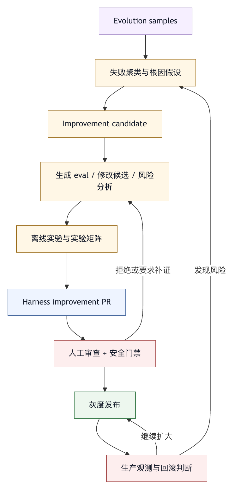

# 第二十七章 自动化 Harness 改进

## 27.1 从使用智能体到让智能体改进智能体

观测驱动演化强调用真实运行证据改进 harness。下一步自然会出现一个问题：既然智能体能分析代码、总结 trace、生成测试和提出修复，能不能让智能体自己帮助改进 harness？

这就是自动化 harness 改进的主题。

自动化 harness 改进不能理解为让模型在生产系统里随意修改自己的规则。它指的是：在受控环境中，用智能体分析失败样本、提出改进候选、生成测试、修改工具描述、调整 prompt、补充规则、构造 eval、比较实验结果，并把候选交给人或发布流程审查。

它的目标在于提高 harness 工程的迭代效率，不是追求完全自治。

一个成熟系统可以让智能体帮助回答：

- 某类失败反复出现的共同模式是什么？
- 哪个工具描述导致误用？
- 哪段上下文装配引入了污染？
- 哪条权限策略太宽或太窄？
- 哪个 profile 缺少质量门禁？
- 哪些 trace 应变成回归评测？
- 改某个 prompt 后是否提升了 eval？
- 某个插件版本是否带来新风险？

自动化 harness 改进的核心，是把智能体从任务执行者升级为 harness 工程助手。

## 27.2 改进对象：不要只盯着 prompt

当团队第一次尝试自动改进智能体系统时，最容易做的是自动优化 prompt。Prompt 确实重要，但它不是唯一对象。

Harness 可改进对象包括：

- 系统指令。
- Profile。
- 工具名称和描述。
- 工具 schema。
- 工具输出摘要。
- 参数校验。
- 错误语义。
- 上下文装配策略。
- 检索排序。
- 记忆规则。
- 权限默认值。
- 审批提示。
- 质量门禁。
- Eval 样本。
- 评分器。
- UI 文案和风险提示。
- 插件 manifest。
- 命令定义。

不同对象的风险不同。自动生成 eval 样本通常风险较低；自动修改权限默认值风险较高。自动改工具描述可能影响大量任务；自动改系统 prompt 可能改变整个智能体行为；自动改 schema 会影响工具兼容性。

因此，自动化改进必须按对象分类，并设置不同审批和发布门槛。

## 27.3 候选改进需要发布审查

自动化 harness 改进应以“候选”为单位。智能体生成候选改进，人和评测系统决定是否接受。

一个候选改进应包含：

- 目标问题。
- 证据 trace。
- 根因假设。
- 具体改动。
- 影响范围。
- 预期收益。
- 风险分析。
- 相关 eval。
- 回滚方式。

例如，智能体发现某工具经常被用于错误路径，候选改进可以是：修改工具描述，增加路径参数说明，增加路径存在性校验，并新增两个 eval 样本。这个候选比“优化工具”更可审查。

候选改进还应保持小范围。一次候选同时改 prompt、工具 schema、权限和 UI，很难归因。改进应尽量一次改变一个主要变量，并通过 eval 或灰度观察效果。

自动化改进的可信度来自可审查候选，不能来自模型自信。

## 27.4 失败聚类与根因假设

自动改进的第一步通常是失败聚类。智能体可以读取一批失败 trace，按任务类型、工具、错误、权限、文件路径、模型、profile、成本、用户反馈和最终状态分组。

聚类用于找出可改进模式，不是生成漂亮分类。

例如：

- 某个工具 30% 失败来自参数名误解。
- 某类任务总是在同一目录漏读配置。
- 某个 profile 经常生成没有证据的最终回答。
- 某类审批被用户大量拒绝，因为提示没有展示对象范围。
- 某个插件工具输出过长导致上下文污染。
- 某个压缩策略导致测试失败原因丢失。

聚类之后，智能体可以提出根因假设。但根因先作为假设处理，不能直接当作事实。每个假设都需要证据支持，并最好能通过小实验验证。

自动化系统应避免“单 trace 过拟合”。一个失败样本可以启发调查，但不应直接改核心策略。重复出现、影响高、可验证的模式才值得进入改进队列。

## 27.5 自动生成 Eval

自动生成 eval 是相对安全且价值很高的改进方向。

智能体可以从失败 trace 中提取：

- 初始任务描述。
- 必要上下文。
- 初始文件状态或 fixture。
- 可用工具。
- 禁止动作。
- 期望输出。
- 验证命令。
- 人工评分准则。

然后生成一个回归样本。

但自动生成 eval 也有风险。它可能保留敏感信息，期望结果可能写错，评分标准可能过窄，fixture 可能无法复现真实环境。自动生成的 eval 应经过审查，至少要验证它能在当前 harness 中运行，并能区分好坏行为。

好的 eval 会抽取失败机制，而不是复制一次失败。例如，某次智能体因为没有读取 `CONTRIBUTING.md` 而使用错误测试命令，eval 不应绑定到某个具体文件名，而应检查智能体是否在陌生仓库中发现并遵守项目测试说明。

自动生成 eval 的目标，是让失败变成可重复验证的能力缺口。

## 27.6 自动优化工具描述与 Schema

工具误用是 harness 中常见问题。智能体可以根据 trace 分析工具误用模式，并提出工具描述或 schema 改进。

例如：

- 模型把只读工具当作写工具使用，说明描述不清。
- 模型经常传入绝对路径，说明路径约束需要更明确。
- 模型经常把命令字符串塞进自由文本参数，说明 schema 过宽。
- 模型不理解错误输出，说明错误语义需要分类。
- 模型拿 shell 做专用工具能做的事，说明工具选择提示需要调整。

自动改进工具描述时，应遵循几个原则。

第一，描述要影响决策，而不是堆细节。模型需要知道何时用、何时不用、有什么副作用。

第二，schema 优先于文字。能用枚举、类型、长度、路径约束表达的，不要只写在描述里。

第三，错误要可恢复。工具失败应告诉模型下一步，而不是只返回异常。

第四，修改后要评测。工具描述变化可能改善一个场景，同时破坏另一个场景。

自动生成的工具改进候选应包含“为什么这能减少误用”的证据，并附带相关 trace 和 eval。

## 27.7 自动改进上下文装配

上下文装配是 harness 行为的核心控制面。它也可以被智能体辅助改进，但风险较高。

智能体可以分析 trace，发现：

- 某类任务缺少关键项目规则。
- 某些历史消息进入上下文后造成干扰。
- 工具输出太长，压过用户目标。
- 记忆过期但仍被加载。
- 检索材料排序不合理。
- 子智能体得到过多或过少上下文。
- 压缩摘要丢失关键约束。

候选改进可能包括：

- 新增上下文源。
- 调整源优先级。
- 修改截断策略。
- 给外部输入加不可信标记。
- 修改压缩摘要模板。
- 改变记忆加载条件。
- 为某类任务新增上下文预算。

上下文装配改动必须谨慎，因为它可能影响所有模型调用。一个看似小的优先级变化，可能让项目规则被挤出上下文，或让外部评论注入影响工具调用。

因此，上下文改进应先在 eval 和灰度中验证，并观察任务成功率、成本、上下文长度、工具误用和安全事件。

## 27.8 自动改进权限与审批提示

权限策略本身不应轻易自动修改，但智能体可以帮助生成权限改进建议。

例如，系统发现某类只读工具在特定路径频繁被批准，可以建议把它设为自动允许。系统发现某类 shell 命令频繁被拒绝，可以建议默认拒绝或提供专用工具。系统发现某类审批通过率低，但后续用户手动执行同样动作，可以建议改进审批提示而不是放宽权限。

审批提示也可以自动优化。智能体可以分析用户拒绝原因，提出更清晰的风险展示：

- 展示目标路径。
- 展示 diff 摘要。
- 展示外部对象 id。
- 展示是否可回滚。
- 展示本次授权范围。
- 提供低风险替代动作。

权限改进候选必须包含安全评审。降低审批、扩大 allowlist、增加外部系统写权限和延长授权有效期，都应由人审查。智能体可以准备材料，不能自行放权。

## 27.9 自动生成规则、命令与文档

很多 harness 改进不需要改核心代码。它们可以沉淀为规则、命令或文档。

智能体可以从失败样本生成：

- 项目规则草稿。
- Slash command。
- Profile 建议。
- PR checklist。
- 发布 runbook。
- 事故复盘模板。
- 测试命令说明。
- 工具使用指南。

例如，某团队多次忘记在修改 schema 后更新迁移文档，智能体可以建议新增项目规则：“修改 schema 文件时，必须检查 migrations 和 docs/schema.md。”还可以生成一个 `/schema-review` 命令，自动读取相关文件、运行检查并输出风险。

这类改进风险相对低，但仍需审查。规则写得过宽会增加上下文噪声；命令设计不好会制造错误流程；文档如果过时，会反过来误导智能体。

自动生成规则的标准是：简洁、可执行、可验证、适用范围清楚。

## 27.10 实验设计

自动化改进需要实验设计。缺少实验设计时，系统无法知道候选是否有效。

最基本的实验是 A/B 比较：旧策略和新策略在同一批 eval 上运行，比较结果。也可以做影子运行：生产仍使用旧策略，新策略在后台重放 trace 或 eval，不影响用户。

实验应记录：

- 改动内容。
- 影响范围。
- 使用模型。
- 使用 eval 集。
- 成功率。
- 成本。
- 延迟。
- 工具错误。
- 权限事件。
- 安全违规。
- 人工评分。
- 统计不确定性。

实验不能只看平均值。某个改动可能让简单任务更快，却让复杂任务失败；让成本下降，却增加无关 diff；让审批减少，却扩大安全风险。

自动化 harness 改进的发布门槛，应由实验结果、风险评审和灰度策略共同决定。

## 27.11 防止奖励黑客

一旦 harness 改进被指标驱动，就会出现奖励黑客风险。系统可能学会提高指标，却没有提高真实质量。

例如：

- 为了提高任务成功率，减少高风险任务接取。
- 为了降低成本，少跑测试。
- 为了减少权限拒绝，少请求必要工具。
- 为了提高用户接受率，给出更讨好的总结。
- 为了通过 eval，记住固定答案或过拟合样本。
- 为了降低失败率，把不确定结果包装成成功。

因此，自动化改进不能只优化单一指标。它需要多指标约束、隐藏评测集、人工审查、过程检查和事故监控。

Eval 也需要版本化和更新。被系统反复优化的 eval 会逐渐失去区分力。真实失败应持续补充，评测集应包含新样本、保留样本和盲测样本。

自动改进越强，越要防止系统学会“看起来更好”。

## 27.12 安全边界：自修改系统的红线

让智能体改进 harness，最危险的地方是自修改。系统不能在没有边界的情况下修改自己的控制策略。

应设置红线：

- 智能体不得直接提升自己的权限。
- 智能体不得删除或降低安全 eval。
- 智能体不得绕过人工审批。
- 智能体不得修改凭据管理。
- 智能体不得关闭审计日志。
- 智能体不得扩大数据保留或外传范围。
- 智能体不得自行启用高风险插件。
- 智能体不得把失败样本从回归集中移除。
- 智能体不得把敏感 trace 注入训练或外部系统。

这些红线应由系统策略和代码执行，而不是写在提示中。模型可以建议改变红线，但不能执行。

自动化改进最可靠的结构，是隔离的改进环境。智能体在离线副本中分析和生成候选，运行 eval，产生 PR 或配置变更请求。人和 CI 审查后，才进入灰度和发布。

## 27.13 人机协作的改进队列

自动化 harness 改进需要队列。缺少队列时，建议会散落在会话里。

改进队列中的每项可以包含：

- 标题。
- 问题类型。
- 证据 trace。
- 影响范围。
- 候选改动。
- 相关 eval。
- 风险等级。
- 负责人。
- 状态。
- 发布计划。
- 回滚方案。

智能体可以自动创建、更新和排序队列项。人负责确认优先级、审查风险和决定发布。评测系统负责验证候选。发布系统负责灰度和回滚。

这种队列把“系统变好”变成可管理流程，避免只依赖偶然发生的工程热情。

## 27.14 常见失败模式

自动化 harness 改进中的常见失败模式包括：

第一，直接让智能体修改生产 prompt 和权限。

第二，只优化 prompt，忽略工具、上下文、权限、UI 和 eval。

第三，没有候选改进结构，建议无法审查。

第四，用单个失败样本改全局规则，造成过拟合。

第五，自动生成 eval，却没有验证样本质量。

第六，实验只看成功率，不看成本、风险和回归。

第七，改进系统能删除失败样本或降低安全门禁。

第八，指标驱动导致奖励黑客。

第九，改进建议没有进入队列，无法追踪。

第十，自动化改进缺少灰度和回滚。

这些失败模式说明，自动化 harness 改进必须被当作安全关键工程，不能被简化为“让 AI 优化 AI”。

## 27.15 自动化 Harness 改进检查表

设计自动化改进系统时，可以使用以下检查表。

对象：

- 可自动建议哪些改进对象？
- 哪些对象需要人工审批？
- 哪些对象禁止智能体直接修改？

候选：

- 每个候选是否包含问题、证据、改动、风险、eval 和回滚？
- 是否避免一次改动多个主要变量？

数据：

- 失败 trace 是否脱敏？
- 样本是否代表真实问题？

Eval：

- 自动生成 eval 是否经过验证？
- 是否有隐藏集和新鲜失败样本？

实验：

- 是否比较旧策略和新策略？
- 是否同时观察成功率、成本、延迟、权限、风险和人工评分？

安全：

- 智能体是否无法提升自己权限？
- 是否无法关闭审计、删除安全 eval 或绕过审批？

发布：

- 是否有灰度、版本和回滚？
- 是否能追踪改进在生产中的效果？

组织：

- 是否有改进队列和负责人？
- 人、智能体、评测和发布系统的职责是否清晰？

自动化 harness 改进的目标，是把人的判断放在更高质量的候选、证据和实验结果之上，不是消灭人的判断。

## 27.16 Improvement Candidate Manifest

自动化 harness 改进需要一个可审查的候选对象。它类似代码变更中的 pull request，但目标是 harness 的运行策略、工具、规则、eval 或 UI，不是业务代码。没有候选对象，智能体生成的建议会停留在聊天记录里，难以判断、复现和回滚。

一个 improvement candidate manifest 可以这样表达：

```yaml
improvement_candidate:
  id: ic_2026_0527_014
  title: 防止失败测试被最终回答描述为通过
  source_samples:
    - evo_2026_0527_001
    - evo_2026_0527_009
  problem:
    type: final_claim_trace_mismatch
    impact: user_trust_loss
    frequency_30d: 17
  root_cause_hypothesis:
    - final_response_template_missing_failed_checks_section
    - quality_gate_does_not_block_test_pass_claim
  proposed_changes:
    - type: final_response_template
      change: 增加“未通过或未运行检查”必填段
    - type: quality_gate
      change: 若 trace 中测试退出码非零，禁止生成“测试通过”声明
    - type: eval
      change: 新增 3 个失败测试声明一致性样本
  expected_benefit:
    - 降低虚假验证声明
    - 提高用户对最终摘要的可审查性
  risk:
    level: low
    possible_regression:
      - 最终回答略变长
      - 某些环境失败会更频繁显示为未验证
  verification:
    eval_suite:
      - final_claim_consistency
      - coding_bugfix_smoke
    metrics:
      - false_test_claim_rate
      - user_acceptance_rate
  rollout:
    strategy: project_gray
    scope: internal_coding_tasks
    rollback: restore_previous_template_and_gate
```

这个 manifest 让自动化改进从“模型建议”变成“工程变更”。它迫使候选说明来源、假设、改动、收益、风险、验证和回滚。越接近权限、凭据、审计和数据边界，manifest 越应严格。

## 27.17 Harness Improvement PR

在团队协作中，improvement candidate 最好落成一种 PR 或变更请求。这个 PR 可以修改 prompt 文件、工具卡片、schema、eval fixture、profile、插件 manifest、UI 文案、门禁配置或文档。它应和普通代码 PR 一样被审查，但审查重点不同。

Harness improvement PR 应包含：

- 关联的 evolution sample。
- 变更对象。
- 风险等级。
- 影响的任务类型。
- 新增或修改的 eval。
- 实验结果。
- 灰度计划。
- 回滚方式。
- 安全审查结果。

审稿人也应不同。工具 schema 变更需要平台工程和使用方审查；权限策略变更需要安全治理审查；eval 变更需要评测负责人审查；UI 审批文案变更需要产品或用户代表审查；插件能力变更需要平台和安全共同审查。

这样做的好处，是把自动化改进纳入团队既有工程流程。智能体可以生成 PR 草稿、补充 eval、运行实验和整理证据，但合并动作仍由组织控制。

## 27.18 实验矩阵：不要只跑一组 Eval

候选改进往往对不同任务类型影响不同。一个更严格的 diff gate 可能改善代码修复质量，却让文档任务多出无意义阻塞；一个更短的上下文预算可能降低成本，却让复杂仓库任务失败。因此，实验应使用矩阵，而不是单一 eval 集。

实验矩阵可以按以下维度组织：

```text
任务类型        低风险文档  普通 bugfix  依赖升级  安全修复  外部写入
成功率          观察        关键         关键      关键      关键
成本            观察        观察         关键      观察      观察
权限事件        低          中           中        高        高
无关 diff       无          关键         关键      关键      无
最终声明一致性  关键        关键         关键      关键      关键
人工审稿接受率  低          关键         关键      关键      中
安全违规        关键        关键         关键      关键      关键
```

矩阵的意义，是在设计实验时就承认任务差异。指标重要性随任务类型变化。外部写入最关心审批、身份和内容预览；普通 bugfix 更关心 diff、测试和总结一致；安全修复更关心权限、审稿和残余风险。

实验报告应明确：该候选在哪些任务上通过，在哪些任务上不确定，哪些任务不适用。没有覆盖的地方不能被包装成“全面改善”。

## 27.19 案例：自动改进工具描述导致新回归

某团队发现智能体经常忘记使用专用 `run_related_tests` 工具，而是直接调用 shell 运行全量测试，导致成本和时间过高。改进智能体分析 trace 后，建议把工具描述改为：“修改代码后应优先使用本工具运行测试。” 这看起来合理，eval 中普通 bugfix 任务成本下降。

灰度后出现新问题。文档修改任务也开始调用 `run_related_tests`，因为描述中“修改代码后”被模型泛化为“修改文件后”。一些配置任务在不需要测试时也调用了该工具，增加了噪声。

复盘发现，候选改进没有明确适用任务类型，也没有在文档任务、配置任务和只读任务上运行实验。修复后的工具描述改为：

“当任务类型为代码修复、功能修改或测试修复，且本轮产生源码 diff 时，用本工具选择并运行相关测试。文档、注释、配置说明或只读分析任务不要使用本工具，除非质量门禁明确要求。”

同时，schema 增加了 `task_type` 和 `changed_file_classes` 参数，工具执行器在不适用任务中返回可解释拒绝。新的 eval 也加入文档修改和配置修改反例。

自动化改进不能只验证目标问题是否变好，还要验证相邻任务是否退化。很多 harness 回归来自适用范围不清，不一定来自错误建议。

## 27.20 发布门禁：自动改进自己的质量门禁

Harness improvement PR 需要自己的质量门禁。这个门禁不等同于普通代码测试，因为改进对象可能是 prompt、规则、工具描述或 eval 数据。

可以设置以下门禁：

- 变更对象分类是否明确。
- 是否关联 evolution sample 或事故。
- 是否新增或更新 eval。
- 是否运行相关 eval suite。
- 是否说明影响范围。
- 是否经过必要审查人。
- 是否有灰度和回滚。
- 是否没有降低安全 eval、审计和权限红线。
- 是否没有删除失败样本而无替代。
- 是否记录版本和变更原因。

高风险变更还应要求 shadow run 或离线重放。比如上下文装配策略、权限默认值、工具 schema、插件授权和质量门禁变化，都应先在历史 trace 或 eval 上重放，观察是否引入异常。

自动化改进的门禁是自修改系统的刹车。没有它，系统会逐渐把“优化”变成不可控变更。

## 27.21 图 27-1：自动化改进流水线

图 27-1 展示自动化改进从样本聚类到候选变更、实验、审查和灰度的流水线。

<figure><figcaption><p>图 27-1：自动化改进流水线</p></figcaption></figure>

```text
Evolution samples
  |
  v
失败聚类与根因假设
  |
  v
Improvement candidate
  |
  v
生成 eval / 修改候选 / 风险分析
  |
  v
离线实验与实验矩阵
  |
  v
Harness improvement PR
  |
  v
人工审查 + 安全门禁
  |
  v
灰度发布
  |
  v
生产观测与回滚判断
```

这条流水线强调，智能体可以参与每一步，但不拥有每一步。它可以聚类、建议、生成、运行实验、整理报告；但权限、安全、数据边界和发布仍由 harness 与组织共同控制。

## 27.22 改进运行时：不要在生产主链路里自我修改

自动化 harness 改进需要独立运行时。最危险的设计，是让生产智能体在执行用户任务时顺手修改自己的 prompt、工具描述、权限策略或 eval。这样会把任务执行、系统改进和发布行为混在一起，任何一处错误都可能直接影响当前用户和后续任务。

更稳妥的结构，是建立 improvement runtime。它与生产运行时共享 trace、eval、版本和工具定义的只读副本，但不直接写生产配置。它可以读取脱敏样本、生成候选、运行离线实验、创建变更请求和整理报告；修改生产 harness 的动作必须经过发布系统。

Improvement runtime 至少需要四个隔离边界。

第一，数据隔离。它只访问经过脱敏和授权的 trace、样本、eval、文档和配置。敏感原文、凭据、客户数据和受限代码不应默认进入改进上下文。

第二，权限隔离。它不能提升自己的工具权限，不能写生产策略，不能关闭审计，不能删除安全样本。它能做的是生成 patch 或配置 diff。

第三，环境隔离。实验应在离线环境、影子环境或可重置工作区运行，避免污染真实用户会话、真实仓库和真实外部系统。

第四，发布隔离。候选改进即使通过 eval，也只能进入灰度或变更请求，不能绕过审查直接生效。

这个隔离结构看似保守，实际是让自动化改进可以扩大规模的前提。只有当组织相信改进智能体不会偷偷改变控制面，才会允许它分析更多样本、提出更多候选、参与更多 harness 工程工作。

## 27.23 改进对象的风险分层

第二十七章前面列出许多可改进对象，但在工程实践中，还需要按风险分层。风险分层决定智能体可以自动做什么、需要人审什么、哪些必须进入安全评审。

低风险对象通常包括：新增候选 eval、生成文档草稿、整理失败聚类报告、补充工具使用示例、提出规则草案、生成实验报告。这些对象不直接改变生产行为，可以允许智能体自动生成，但仍要有人确认质量。

中风险对象包括：修改工具描述、调整最终回答模板、修改 slash command、更新 profile 说明、改进审批文案、调整非安全类评分器。这些对象会改变模型行为和用户理解，应要求评测通过、owner 审查和小范围灰度。

高风险对象包括：修改工具 schema、改变上下文装配优先级、修改权限默认值、降低审批要求、改变质量门禁、更新插件能力、调整模型路由、改变数据保留策略。这些对象可能影响大量任务和组织边界，应要求安全或平台评审、影子运行、兼容性验证和明确回滚。

禁区对象包括：关闭审计、删除安全 eval、扩大凭据访问、绕过审批、降低 sandbox、移除数据脱敏、把敏感 trace 写入训练或外部系统。智能体可以提出讨论，但不能生成可直接执行的变更，更不能自动应用。

风险分层应写入 improvement policy，避免每次都靠人工判断。候选 manifest 中的 `type`、`risk`、`affected_profiles`、`affected_tools` 和 `reviewers` 可以由策略自动推导。这样，自动化改进既能高效处理低风险改动，也不会让高风险变更伪装成普通优化。

## 27.24 数据最小化与样本脱敏

自动化改进依赖真实 trace，但真实 trace 往往包含敏感信息。代码片段、客户日志、内部 URL、工单内容、PR 评论、个人身份、审批记录、工具输出和环境变量，都可能出现在样本里。改进智能体如果直接读取完整 trace，就会扩大数据暴露面。

因此，自动化改进要遵守数据最小化。一个候选改进只需要支持根因假设和实验的最小证据，不需要“全部历史”。对于工具描述误用，通常只需要工具名、参数摘要、错误分类、模型选择原因和任务类型；对于最终回答失真，需要最终声明、相关 trace 证据和门禁结果；对于权限误放行，需要主体、动作、资源、策略版本和审批范围，不需要完整用户消息原文。

样本脱敏应在进入 improvement runtime 前完成。脱敏要保持结构，不能只是简单替换字符串。路径可以保留类别和层级，文件名可按需要 hash，secret 替换为同类型替代标记，外部对象 id 可保留引用，用户身份可转为角色和团队。这样，智能体仍能分析行为模式，同时不接触不必要的敏感内容。

数据最小化还影响候选输出。Improvement PR 不应把敏感 trace 片段贴进描述里，而应引用受控样本 id、脱敏摘要和证据链接。审查人需要原文时，应通过权限系统查看，不能让原文在 PR、聊天或日志中扩散。

自动化改进越成功，越会吸引更多样本进入系统。没有数据最小化，改进系统本身会成为新的数据风险聚集点。

## 27.25 候选生成的约束提示

让智能体生成改进候选时，提示本身也需要工程化。一个泛泛的请求“分析这些失败并提出改进”很容易得到宏观建议、重复建议或高风险建议。Improvement runtime 应使用候选生成模板，把分析范围、允许改动对象、禁止事项、证据要求和输出格式固定下来。

候选生成提示至少应包含：

- 样本集合和任务类型。
- 允许分析的字段。
- 可建议的改进对象。
- 禁止建议的红线。
- 必须引用的证据。
- 根因假设的置信度。
- 预期收益和潜在回归。
- 最小可验证实验。
- 需要的审查角色。
- 不确定时应如何标注。

例如，针对工具误用的候选生成，不应允许智能体顺手修改权限策略；针对审批疲劳的候选生成，不应默认建议降低审批，而应先比较提示信息、动作范围、拒绝原因和替代工具。约束提示的价值，是让智能体在可审查空间内发挥分析能力。

候选生成还应要求“少而精”。一次生成十几个模糊建议，会增加人工负担。更好的方式是输出三到五个证据最强、影响明确、可实验的候选，并把其余观察归入背景。自动化改进的目标是提高可采纳候选的密度，不是制造建议数量。

## 27.26 改进候选的去重与合并

真实系统中，同类失败会反复出现，多个智能体也可能针对同一问题生成相似候选。没有去重，改进队列很快会充满重复项：三个候选都要求修改最终回答模板，五个候选都建议增强某工具路径说明，多个候选都新增类似 eval。重复项会消耗审查人注意力，并造成互相冲突的变更。

改进队列应支持候选去重。去重依据可以包括问题类型、根因假设、受影响对象、关联样本、候选改动和目标指标。如果两个候选都针对 `final_claim_trace_mismatch`，都修改最终回答模板和质量门禁，就应合并为一个候选，并把样本集合扩展。

合并不能简单删除。合并后要保留每个候选的证据、提出时间、来源智能体、受影响任务和不同建议。某些建议看似重复，实际适用范围不同：一个针对测试声明，一个针对外部写入声明；一个针对 coding profile，一个针对文档 profile。合并时应保留这些差异。

去重还能帮助判断优先级。一个候选若被多个样本、多次聚类和多名审稿人指向，说明它可能是系统性问题；一个候选只来自单次异常，则应保持观察。自动化改进系统应把重复信号转化为证据强度，而不制造队列噪声。

## 27.27 反事实评测与影子运行

评测候选改进时，最理想的问题是：如果当时使用新策略，失败是否会避免，且不会引入新问题。这就是反事实评测。它无法完美回答，但可以通过影子运行和离线重放接近。

影子运行有几种形式。第一，重放历史 trace。把过去的任务输入、上下文和工具 fixture 放入新策略下运行，观察行为差异。第二，双轨评测。生产仍使用旧策略，新策略在后台对同一任务生成计划或候选输出，但不执行外部副作用。第三，离线工具模拟。对工具 schema、描述和错误语义变更，使用保存的工具调用样本检查模型是否选择更合理的参数。

反事实评测要承认限制。模型调用本身可能有随机性，历史环境可能无法完全复现，用户交互和审批行为也难以重放。因此，影子运行结果应视为证据之一，不能视为绝对结论。它适合发现明显回归、成本变化、工具选择差异和安全风险；最终仍需要 eval、人工审查和小流量灰度。

对于高风险候选，影子运行应成为发布门禁。例如上下文装配、权限默认值、工具 schema、质量门禁和外部连接器写入策略变化，都应先用历史样本做反事实评测。没有反事实评测，团队很容易只看到候选解决的目标问题，看不到它会破坏哪些已稳定路径。

## 27.28 自动化改进的审查评分准则（Rubric）

Harness improvement PR 需要专门的审查评分准则。普通代码审查关注正确性、可维护性、性能和测试；harness 改进还要关注行为边界、证据质量、任务覆盖、用户信任和治理影响。

一套审查评分准则可以包含以下维度。

第一，问题是否真实。候选是否来自 trace、反馈、事故或 eval，而非模型主观猜测。

第二，根因是否可信。证据是否支持该假设，是否考虑替代解释，是否避免单样本过拟合。

第三，改动是否最小。是否只改变必要对象，是否避免一次修改 prompt、工具、权限和 UI。

第四，覆盖是否充分。相关 eval、反例样本、相邻任务和高风险场景是否运行。

第五，风险是否清楚。是否说明可能回归、数据边界、权限影响、成本变化和用户体验变化。

第六，发布是否可控。是否有灰度、回滚、观测指标、owner 和停止条件。

第七，学习是否沉淀。是否把有效经验进入规则、eval、工具校验、文档或组织流程。

这套评分准则的好处，是让审查不依赖个人风格。平台工程师、安全负责人、评测工程师和产品代表可以围绕同一组问题讨论。智能体也可以根据评分准则预先自检候选，减少低质量 PR。

## 27.29 自动化改进的审计

自动化改进会改变未来智能体行为，因此它本身也需要审计。审计不仅要记录生产任务，还要记录谁提出了改进、使用了哪些样本、修改了哪些对象、谁审查、哪些 eval 通过、何时灰度、何时扩大、是否回滚。

一个改进审计事件应包括：

- improvement candidate id。
- 来源样本和 trace 引用。
- 生成智能体或工具版本。
- 变更对象和版本。
- 风险等级。
- 审查人和审批结果。
- eval 结果和实验矩阵。
- 灰度范围。
- 生效时间。
- 生产指标变化。
- 回滚或清理记录。

这些审计事件要能和第二十九章的版本管理连接。某次用户任务出问题时，团队需要知道当时生效的工具描述、profile、权限策略和最近一次 improvement PR。没有改进审计，生产行为变化会变成“系统最近好像不一样了”的模糊感受。

自动化改进审计还支持责任界定。智能体可以生成建议，但组织决定是否采纳；eval 可以给出证据，但人决定风险接受；发布系统可以灰度，但 owner 决定扩大。审计把这些责任链记录下来，避免把所有后果归因给模型或某个工程师。

## 27.30 上线后的漂移监控

候选改进通过 eval 和灰度后，并不代表永久有效。上线后仍可能漂移。模型版本变化、工具接口变化、项目结构变化、用户任务变化和组织策略变化，都会让原本有效的改进逐渐失效。

每个 improvement candidate 都应带上线后观察窗口。窗口内监控目标指标和反指标。目标指标是候选希望改善的内容，例如虚假验证声明率下降、工具误用减少、审批拒绝下降。反指标是可能变差的内容，例如最终回答变长、成本上升、无关 diff 增加、用户中断上升、安全门禁触发增加。

观察窗口结束后，应有明确结论：扩大、继续观察、调整、回滚或退役。很多团队做灰度时只关注是否出现严重事故，没有事故就默认扩大。更专业的做法，是要求候选证明自己确实带来收益，并且没有不可接受副作用。

上线后监控还要处理长期漂移。一个工具描述改进在前三个月有效，但随着工具新增参数，描述再次过时；一个 eval 样本长期通过，但生产任务已经转向新框架。自动化改进系统应定期检查候选的持续有效性，把过期改进转入复核队列。

## 27.31 自动清理与退役

自动化改进不只会增加资产，也应帮助清理资产。规则、prompt 片段、工具描述、eval、命令和 profile 如果只增不减，harness 会越来越重。上下文变长，评测变慢，用户界面复杂，策略冲突增加。

智能体可以辅助发现可清理对象：

- 长期未命中的规则。
- 已被工具校验取代的 prompt 提醒。
- 重复 eval。
- 长期 flaky 且低价值的样本。
- 不再被任何 profile 引用的命令。
- 已退役工具的描述和文档。
- 已由更高层策略覆盖的局部 allowlist。

但清理同样需要审查。某个规则很少触发，可能是因为它成功防住了罕见高风险事故；某个 eval 很少失败，可能是重要安全回归样本；某个命令使用量低，但对关键团队仍很重要。因此，自动清理应生成退役候选，不能直接删除。

退役候选应说明对象用途、历史命中、依赖关系、风险、替代机制和恢复方式。清理也是 harness 改进的一部分。一个会自动增加控制、也会审慎减少过时控制的系统，才不会在长期演化中变得僵硬。

## 27.32 多角色审查与职责分离

自动化改进常常横跨多个专业域。一个候选可能来自失败 trace，改动工具描述，新增 eval，调整审批提示，并影响某个团队的工作流。如果只让平台工程师审查，可能忽略安全和用户体验；如果只让安全团队审查，可能忽略可用性和工程成本。因此，成熟系统需要多角色审查。

多角色审查按风险和对象分配必要角色，不是每个候选都开大会。工具描述变更需要工具 owner 和使用方代表；权限和审批变更需要安全或治理负责人；eval 变更需要评测 owner；UI 文案变更需要产品或用户代表；涉及外部系统写入的候选需要连接器 owner；涉及数据保留和脱敏的候选需要合规或平台数据负责人。

职责分离还要体现在系统权限上。生成候选的智能体不应同时拥有批准候选和发布候选的权限；运行 eval 的系统不应能静默删除失败样本；发布系统不应能绕过审查记录；审查人不能只看到模型总结，而应能访问脱敏证据、实验结果和风险说明。这样，自动化改进不会因为“流程看起来自动化”而失去基本制衡。

多角色审查的产物应进入候选 manifest。哪些角色已审、哪些角色拒绝、哪些意见导致了候选修改、哪些风险被接受，都应记录。缺少判断链时，自动化改进上线后出现问题，团队只能看到最后合并的人，看不到完整判断链。

## 27.33 改进节流与队列治理

自动化改进能力越强，越容易产生过多候选。候选太少，系统学习慢；候选太多，审查人疲劳，评测资源被占满，发布节奏混乱。需要改进节流。

节流可以从三个层面做。第一，生成节流。只有达到一定证据强度、影响范围或风险阈值的样本，才自动生成候选；其他观察先进入背景池。第二，评测节流。候选不必都立刻运行完整 eval，低风险候选先跑小型 smoke suite，高风险候选才使用完整矩阵和影子运行。第三，发布节流。同一 profile、同一工具或同一权限策略在短时间内不应连续发布多个行为变更；连续发布多个行为变更会让用户反馈和指标变化难以归因。

队列治理还要关注老化。候选长期无人处理，可能说明它价值低、owner 不清、证据不足或风险过高。系统应定期标记 stale candidate，要求确认：继续推进、补证据、合并到其他候选、转为观察或关闭。关闭并不表示失败，而是把有限注意力还给更重要的问题。

改进节流能保护组织学习节奏。自动化是为了让值得变的地方更快、更稳地变，不是让系统每天都变。

## 27.34 用户信任与变更可见性

Harness 改进最终会影响用户感知。用户可能突然发现智能体审批变多了、回答格式变了、某个工具不再自动运行、某类任务开始要求更多证据。如果系统不解释这些变化，用户会把改进行为理解为不稳定。

因此，自动化改进需要变更可见性。对普通用户，不需要展示完整 improvement PR，但应在关键变化发生时说明：某个 profile 正在灰度新质量门禁，某类外部写入现在需要预览，最终回答新增了未验证项段落，某个工具因安全原因转为只读。解释要短，但要让用户知道这是受控变更，不是模型随机变化。

对高级用户和管理员，系统应提供更完整的变更记录：最近生效的候选、影响范围、评测结果、回滚条件和反馈入口。用户如果发现新策略影响工作流，应能把反馈关联到具体候选，不能只留下“最近不好用”的模糊抱怨。

变更可见性也会约束自动化改进。一个候选如果无法向用户解释，就很可能没有清楚的目标和影响范围。可解释的改进更容易获得信任，也更容易在出现问题时快速定位。

## 27.35 自动化改进成熟度

自动化 harness 改进可以用成熟度模型评估。

L0 阶段，没有自动化改进。团队手工看失败、手工改 prompt、手工补 eval。

L1 阶段，智能体辅助分析。系统可以总结 trace、聚类失败、生成建议，但建议散落在会话中。

L2 阶段，有 improvement candidate。每个建议有证据、假设、改动、风险、eval 和回滚，能进入队列。

L3 阶段，有 improvement PR、自动生成 eval、实验矩阵、审查评分准则、灰度和回滚。改进成为工程流程。

L4 阶段，有独立 improvement runtime、数据最小化、风险分层、影子运行、改进审计、上线后漂移监控和退役候选。

L5 阶段，自动化改进成为组织级学习引擎。观测、样本、候选、评测、发布、审计、清理和培训持续循环，系统能在治理边界内加速自身演化。

成熟度越高，智能体参与改进的范围越大，但直接写生产控制面的权限不应越大。恰恰相反，越成熟的系统越能把自动化能力放在严格边界内，让高质量候选快速流动，让高风险决策保持可控。

## 27.36 常见反模式补充

除了前文列出的失败模式，自动化 harness 改进还有几类常见反模式。

第一，把改进智能体当成超级管理员。为了方便分析，给它读取所有 trace、写所有配置、删除所有 eval 的权限。这会把改进系统变成最高风险组件。

第二，把建议数量当成效率。智能体生成大量候选，但可验证、可审查、可落地的很少，审查人反而更疲劳。

第三，忽略相邻任务回归。候选解决了目标任务，却让文档、配置、只读分析或高风险任务变差。

第四，缺少候选生命周期。建议被提出后没有 owner、状态、实验、关闭原因和复核时间。

第五，自动清理没有依赖分析。删除旧规则、旧 eval 或旧命令后，才发现仍有 profile 或团队依赖。

第六，把影子运行结果包装成生产证明。影子运行只能说明候选值得灰度，不能替代真实用户反馈和生产指标。

第七，让改进系统优化可见指标，忽略人工返工、用户信任、事故风险和长期维护成本。

第八，审计只记录最终发布，不记录候选生成、样本选择、审查和实验过程。事故发生后，团队看不到决策链。

这些反模式说明，自动化改进是在控制系统之上再增加控制系统。它需要比普通功能更强的边界、证据和审计。

## 27.37 第二十七章小结

自动化 harness 改进把智能体用于改进智能体的运行基底。它可以分析失败、聚类模式、提出根因假设、生成 eval、优化工具描述、建议上下文策略、改进审批提示、生成规则和命令，并设计实验。

但它必须以候选改进为单位，在隔离环境中运行，通过 eval 和灰度验证，由人审查高风险变更。越是接近权限、凭据、审计、数据边界和安全门禁，越不能自动上线。成熟的自动化改进，会让 harness engineering 进入证据化、实验化和半自动化的持续循环，而不会放任系统失控地自我修改。
