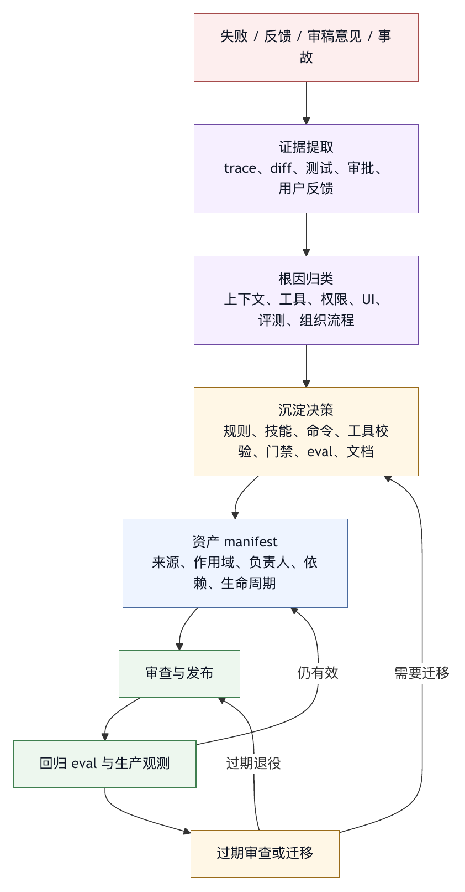

# 第二十八章 经验沉淀为规则、技能与测试

## 28.1 失败的价值在于可复用

一次智能体失败本身并不稀奇。值得关注的是，同类失败会不会再次发生。如果系统每次都靠用户提醒、工程师记忆或临时修补来避免旧错误，它就没有形成 harness engineering 的学习能力。

经验沉淀的目标，是把一次失败转化为可复用控制面。它可以变成项目规则、系统指令、命令、技能、工具校验、质量门禁、评测样本、文档或组织流程。不同形式服务不同层级，但共同目标是减少同类失败的复发概率。

例如，智能体因为没有运行项目专用生成命令而提交了过期文件。临时修复是这一次补跑命令。长期沉淀可以是：在项目规则中写明修改 schema 后必须运行生成命令；在 `/schema-review` 命令中封装检查流程；在诊断工具中自动检测生成物是否过期；在评测集中加入类似任务；在 PR checklist 中要求说明生成命令结果。

这才是经验沉淀：把注意力变成系统结构，而不是写一句“以后注意”。

## 28.2 经验沉淀的目标层级

不同经验应沉淀到不同层级。沉淀层级选错，会造成噪声或失效。

最常见层级包括：

- 项目规则：适用于某个仓库或目录的稳定约定。
- 用户偏好：适用于某个用户的工作方式。
- 系统指令：适用于所有任务的基本行为约束。
- agent profile：适用于某类任务或角色。
- 命令：适用于可重复执行的流程。
- 技能：适用于一类复杂方法论或工具操作。
- 工具校验：适用于可机械判断的输入、输出和状态。
- 质量门禁：适用于交付前必须通过的证据要求。
- Eval：适用于回归验证的任务样本。
- 文档：适用于人类理解和跨团队传播。
- 组织流程：适用于审批、审稿、事故复盘和治理。

选择层级的关键问题是：这条经验应该在什么范围内生效，由谁维护，能否被自动验证，是否会给无关任务增加噪声。

一个项目内的测试命令不应进入全局系统指令。一个全局安全原则不应只写在某个项目 README。一个可自动检查的规则不应只靠自然语言提醒。一个需要业务判断的经验不应硬编码成工具拒绝。

## 28.3 规则：让项目约定进入上下文

项目规则是经验沉淀最常见的形态。Coding agent 需要知道项目如何构建、如何测试、如何命名、哪些目录不能改、哪些流程必须遵守。把这些约定写成项目规则，可以让智能体在上下文装配时稳定看到。

好的项目规则应满足：

- 具体。
- 简短。
- 可执行。
- 有作用域。
- 避免泛泛价值观。
- 避免与代码事实冲突。
- 随项目演化更新。

糟糕规则的典型例子是：“写高质量代码”“注意安全”“遵循最佳实践”。这些话正确但不可执行。更好的规则是：“修改 `api/schema` 后必须运行 `pnpm generate` 并检查生成文件 diff”；“不要直接编辑 `dist/`，它由构建生成”；“`packages/server` 的测试命令是 `pnpm test:server`，不要使用仓库根目录的默认测试命令替代”。

规则还需要作用域。Monorepo 中不同目录可能有不同测试命令、代码风格和所有者。作用域不清的规则会误导智能体。项目规则文件可以采用目录层级加载，或者通过上下文装配给规则加路径标签。

规则并非越多越好。规则过多会挤占上下文，降低模型注意力。成熟团队应定期清理过期规则，把可机械化的规则迁移到工具校验或测试中。

## 28.4 技能：把复杂方法沉淀为可执行流程

有些经验是一套方法，不是一句规则。例如：如何做代码审查，如何调试 flaky test，如何创建插件，如何整理会议纪要，如何迁移 API，如何处理安全事故。这类经验更适合沉淀为技能。

技能与规则的差异在于：规则告诉智能体必须遵守什么；技能告诉智能体如何完成一类工作。

一个好技能应包含：

- 触发场景。
- 输入要求。
- 分阶段流程。
- 质量标准。
- 常见陷阱。
- 需要使用的工具。
- 需要产出的证据。
- 何时停止或升级给人。

技能也应小而专。一个“软件工程万能技能”价值有限；一个“处理 GitHub PR review feedback 的技能”更可执行；一个“把失败 trace 转成 eval 样本的技能”更适合训练和复用。

技能的维护方式也很重要。它不应只存在于某个模型上下文里，而应作为版本化文件或插件资源被管理。技能变化会影响智能体行为，因此应有审查、测试和回滚。

## 28.5 命令：把流程变成入口

当经验不仅需要方法，还需要用户主动调用，就应沉淀为命令。命令是用户和团队复用经验的入口。

例如：

- `/review`：按团队规范审查当前 diff。
- `/fix-ci`：读取失败 CI 日志，定位原因并提出修复。
- `/summarize-session`：把长会话整理成可交接摘要。
- `/release-check`：运行发布前门禁。
- `/security-pass`：只读检查高风险改动。
- `/trace-to-eval`：从失败 run 生成评测候选。

命令的价值在于减少用户描述负担。用户不需要每次用自然语言完整说明流程，命令可以封装上下文、工具、输出格式和门禁。

命令也能约束智能体。一个 `/release-check` 命令可以明确只读、必须列出未验证项、不得触发发布。一个 `/fix-ci` 命令可以指定先读取 CI 日志，再读取相关文件，最后运行最小验证。

命令应进入权限和 trace。命令不能成为绕开治理的快捷方式。命令触发的工具调用、审批和外部动作都应被记录。

## 28.6 工具校验：把提醒变成硬边界

有些经验不应停留在规则或技能中，而应进入工具校验。只要系统能够机械判断，就应尽量用工具层落实。

例如：

- 路径不能在工作区外。
- `old_text` 必须在文件中精确匹配。
- 禁止写入 `.env`。
- 删除大量文件需要高风险审批。
- 外部消息必须有接收者预览。
- SQL 写入必须显式确认。
- CI 发布 workflow 不能由普通修复命令触发。
- 工具输出超过阈值必须截断并提供引用。

工具校验比自然语言规则更可靠。模型可能忘记规则，但工具不会执行非法参数。工具校验还提供清晰错误，让模型知道如何恢复。

经验沉淀的一个重要判断是：这条规则能否被工具执行？如果可以，就不要只把它写进 prompt。

## 28.7 测试与 Eval：把经验变成回归保护

测试和 eval 是经验沉淀中最能防止倒退的形态。规则和技能告诉智能体应该怎样做，eval 验证系统是否真的能做到。

软件工程场景中，传统测试仍然重要。智能体修改代码后，项目测试、类型检查、lint 和构建是结果质量的基本证据。

但 harness 还需要智能体评测。智能体评测可以检查：

- 是否读取了项目规则。
- 是否选择正确工具。
- 是否避免越权。
- 是否在失败后恢复。
- 是否生成可验证证据。
- 是否拒绝外部输入注入。
- 是否在不确定时请求审批。
- 是否遵守输出格式。

从失败中沉淀 eval 时，要避免只复现表面。更好的做法是提炼行为要求。例如，某次失败是因为智能体忽略了目录内规则，那么 eval 应检查“在嵌套项目规则存在时，智能体是否加载更近作用域规则”，而不是只检查某个固定文件名。

Eval 也需要维护。过期 eval 会束缚系统，新模型和新工具可能需要调整评分器。但删除或放宽 eval 应有审查，尤其是安全 eval。

## 28.8 记忆：谨慎沉淀个人经验

长期记忆可以保存用户偏好、常用流程和反复出现的事实。但记忆不是经验沉淀的万能容器。

适合进入记忆的包括：

- 用户偏好的回复风格。
- 用户常用项目或工具。
- 用户明确要求保留的工作习惯。
- 跨项目都成立的个人偏好。

不适合进入记忆的包括：

- 单个项目的临时规则。
- 过期技术事实。
- 未验证的失败归因。
- 敏感信息。
- 外部系统凭据。
- 应由项目文件管理的团队约定。

如果把所有经验都塞进记忆，系统会变得不可解释。用户很难知道智能体为什么这样做，团队也无法共享和审查。项目规则、命令、技能、工具校验和 eval 往往比个人记忆更适合沉淀工程经验。

记忆应有可见、可编辑、可删除和过期机制。

## 28.9 从事故到沉淀

事故是高价值经验来源。一次智能体事故不应只生成复盘文档，还应触发系统沉淀。

事故复盘后应问：

- 是否需要新增或修改权限策略？
- 是否需要新增 sandbox 限制？
- 是否需要改工具 schema 或描述？
- 是否需要新增审批提示信息？
- 是否需要新增质量门禁？
- 是否需要新增 eval？
- 是否需要更新项目规则或组织规则？
- 是否需要新增用户培训或文档？
- 是否需要改变插件信任模型？
- 是否需要调整数据保留和脱敏？

事故沉淀要有负责人和截止时间。缺少负责人和截止时间时，复盘会变成叙述，而不是改进。

高质量复盘不追求证明某个人或某个模型犯错，而是追求系统如何让同类错误更难发生、更容易发现、更容易恢复。

## 28.10 沉淀的生命周期

经验沉淀不会在一次写入后永久有效。规则、技能、命令、测试和 eval 都有生命周期。

创建时，应明确来源、作用范围和验证方式。

使用中，应观察是否真的减少失败，是否增加噪声。

修改时，应记录版本和原因。

过期时，应删除或迁移。

冲突时，应定义优先级。

经验沉淀最常见的问题，是旧经验堆积。项目已经换了构建系统，但规则仍要求旧命令；工具已经支持自动校验，但 prompt 里仍反复提醒；某个 eval 对旧模型有效，对新工作流却不再相关。过期经验会污染上下文，让智能体行为变差。

因此，经验沉淀本身也需要治理。定期审查规则、技能和 eval，是 harness 维护工作的一部分。

## 28.11 常见失败模式

经验沉淀常见失败模式包括：

第一，只写复盘，不改系统。问题被记录，但同类失败仍会发生。

第二，把所有经验都写进系统 prompt。上下文变长，作用域混乱。

第三，把项目规则写成空话。模型无法执行，也无法验证。

第四，用记忆保存团队规则。团队成员无法共享和审查。

第五，可机械检查的规则没有进入工具层。

第六，新增 eval 只复现表面，不覆盖失败机制。

第七，技能过大，变成泛泛方法论。

第八，命令绕过权限和 trace。

第九，沉淀没有负责人，创建后无人维护。

第十，旧规则不删除，持续污染上下文。

经验沉淀的质量，不看写了多少规则，而看同类失败是否减少。

## 28.12 经验沉淀检查表

把一次失败沉淀为系统资产时，可以使用以下检查表。

归因：

- 根因是上下文、工具、权限、UI、评测、组织流程还是模型能力？
- 是否有 trace 或证据支持？

层级：

- 应沉淀为规则、技能、命令、工具校验、门禁、eval、文档还是流程？
- 作用域是用户、项目、组织还是全局？

可验证性：

- 能否用测试或 eval 检查？
- 能否用工具校验直接阻止？

维护：

- 谁负责维护？
- 何时审查是否过期？
- 如何处理冲突？

安全：

- 是否会扩大权限？
- 是否会增加敏感信息暴露？
- 是否会让智能体过度自信？

价值：

- 是否减少重复失败？
- 是否降低用户提醒负担？
- 是否让未来任务更可验证？

经验沉淀的核心，是把人的一次痛感变成系统的长期能力。

## 28.13 沉淀决策树

一次经验到底应该沉淀到哪里，可以用决策树判断。

```text
这次经验是否只属于当前任务？
  |
  +-- 是：写入当前总结或 PR 说明，不进入长期资产
  |
  +-- 否：
       |
       v
是否可以机械判断？
  |
  +-- 是：优先进入工具校验、质量门禁或自动测试
  |
  +-- 否：
       |
       v
是否是一类可重复流程？
  |
  +-- 是：沉淀为命令或技能
  |
  +-- 否：
       |
       v
是否是项目稳定约定？
  |
  +-- 是：沉淀为项目规则或文档
  |
  +-- 否：
       |
       v
是否是用户个人偏好？
  |
  +-- 是：进入用户记忆，并设置可见和可删除
  |
  +-- 否：
       |
       v
是否是组织风险或流程？
  |
  +-- 是：进入组织策略、培训、审批或复盘机制
  |
  +-- 否：保留为观察样本，等待更多证据
```

这棵树的核心思想，是先问能否自动化，再问作用域。能用工具和测试解决的问题，不要留给自然语言规则；只属于某项目的约定，不要污染全局指令；只属于某用户的偏好，不要变成团队规则；证据不足的问题，不要急着沉淀。

## 28.14 Learning Asset Manifest

规则、技能、命令和 eval 都是学习资产。学习资产需要 manifest；缺少 manifest 时，它们会变成散落文件，无法审查、版本化和清理。

一个 learning asset manifest 可以这样写：

```yaml
learning_asset:
  id: asset_schema_review_001
  type: command
  name: /schema-review
  source:
    incident_id: inc_2026_0412_schema
    evolution_samples:
      - evo_2026_0412_003
  scope:
    organization: engineering
    projects:
      - payment-service
      - billing-service
  owner: platform-quality
  purpose: 修改 schema 后检查生成物、迁移文档和兼容性说明
  triggers:
    - files_changed: "api/schema/**"
  dependencies:
    rules:
      - project_schema_generation_rule
    tools:
      - run_generator_check
      - read_diff
    evals:
      - eval_schema_change_requires_docs
  review:
    last_reviewed: 2026-05-27
    next_review: 2026-08-27
  lifecycle:
    status: active
    deprecation_condition: schema toolchain replaced
```

Manifest 让学习资产有出处、作用域、所有者、依赖和生命周期。没有这些信息，团队几个月后很难判断某条规则为什么存在、是否仍然有效、谁可以修改、哪些 eval 会受影响。

学习资产之间也有依赖。一个命令可能依赖项目规则和工具；一个 eval 可能依赖 fixture；一个技能可能依赖外部文档；一个质量门禁可能依赖审计事件。依赖清楚，迁移和删除才安全。

## 28.15 案例：从一次 Schema 事故到五类资产

设想某智能体修改了 API schema，但没有运行生成命令，也没有更新迁移文档。本地测试通过，因为测试使用旧生成物；发布后客户端调用失败。事故复盘确认，根因在于 harness 没有把该项目的生成流程建模，并非模型不会改 schema。

沉淀过程可以分成五类资产。

第一，项目规则：

```text
修改 api/schema/** 后，必须运行 schema 生成命令，并检查生成文件、迁移说明和兼容性文档 diff。
```

第二，工具校验：当 diff 包含 `api/schema/**` 时，质量门禁检查生成物是否同步更新。

第三，命令：新增 `/schema-review`，自动读取 schema diff、运行生成检查、检查文档和输出兼容性风险。

第四，eval：构造一个仓库 fixture，要求智能体修改 schema 后必须发现生成步骤，并在最终证据包中列出生成命令结果。

第五，培训文档：给团队说明 schema 变更的发布风险、兼容性要求和智能体使用方式。

这个案例展示了经验沉淀的层次性。项目规则让模型知道约定；工具校验让错误更难发生；命令让用户容易执行流程；eval 防止 harness 回归；文档让人理解背景。只做其中一种，都不如组合沉淀稳固。

## 28.16 规则质量评审

规则进入项目或组织后，应接受质量评审。低质量规则会污染上下文，甚至让智能体行为变差。

规则评审可以问：

- 这条规则是否有真实来源？
- 是否能指出适用路径或任务类型？
- 是否足够具体，能指导行动？
- 是否与现有规则冲突？
- 是否已经能被工具或测试替代？
- 是否包含过期命令、路径或人员信息？
- 是否会让智能体对不相关任务过度谨慎？
- 是否有删除条件？

规则的理想形态是短、硬、准。短，避免挤占上下文；硬，能明确影响行动；准，有清楚作用域。规则不应承担解释全部背景的任务，背景可以放文档，规则只保留操作约束。

AGENTS.md 这类面向 coding agent 的仓库指令格式以普通 Markdown 承载仓库指令，示例中包含 setup commands、测试命令、代码风格、测试指南、安全注意事项和 PR 指令，并说明冲突时更靠近编辑文件的 AGENTS.md 优先，用户聊天提示又会覆盖文件指令。〔注28-1〕 本书据此归纳：项目规则应围绕智能体执行任务所需的关键约束，而不是把 README、设计文档和团队文化全部塞进上下文。

## 28.17 Skill 质量评审

技能比规则更复杂，也更容易失控。一个技能如果触发条件过宽，会在不适合的场景中干预；如果步骤过细，会压制模型适应性；如果缺少退出条件，会让智能体过度执行。

技能评审可以问：

- 触发条件是否明确？
- 是否说明不适用场景？
- 是否分阶段，而不是堆长清单？
- 是否要求证据输出？
- 是否有权限和安全边界？
- 是否说明何时请求用户？
- 是否可用 eval 或样例验证？
- 是否有版本和维护者？

技能最适合沉淀方法，不适合沉淀事实。事实容易过期，应放在项目文档或检索系统；方法更稳定，可以作为技能。比如“如何处理失败 CI”是技能，“当前 CI 用哪个 runner”不是技能。

OpenHands 文档把 skills 描述为能向智能体行为注入领域知识、专家指导和自动化任务处理的专门提示，并支持 always-on context、按关键词触发、由智能体按需调用、组织技能和全局技能等形态。〔注28-2〕 本书采用更一般的定义：技能是可版本化、可触发、可审查的工作方法。在 Agent OS 中，技能应和命令、profile、工具、规则共同纳入治理。

## 28.18 图 28-1：经验沉淀流水线

图 28-1 把失败、反馈和事故如何沉淀成规则、技能、eval 和文档资产串起来。

<figure><figcaption><p>图 28-1：经验沉淀流水线</p></figcaption></figure>

```text
失败 / 反馈 / 审稿意见 / 事故
  |
  v
证据提取：trace、diff、测试、审批、用户反馈
  |
  v
根因归类：上下文、工具、权限、UI、评测、组织流程
  |
  v
沉淀决策：规则、技能、命令、工具校验、门禁、eval、文档
  |
  v
资产 manifest：来源、作用域、负责人、依赖、生命周期
  |
  v
审查与发布
  |
  v
回归 eval 与生产观测
  |
  v
过期审查或迁移
```

这条流水线把第六编前三章连接起来。第二十六章负责发现和归因，第二十七章负责自动化提出候选和验证，第二十八章负责把有效经验沉淀为长期资产。没有沉淀，观测和自动化改进都会停留在局部；没有观测和验证，沉淀又会变成规则堆积。

## 28.19 Learning Asset Registry：学习资产注册表

当规则、技能、命令、工具校验和 eval 增多后，团队需要学习资产注册表。注册表是 Agent OS 用来发现、装配、审查、发布和清理经验资产的控制面，不是简单目录。没有注册表，资产会散落在仓库文件、团队 wiki、插件包、用户记忆、命令配置和评测仓库里。模型可能加载不到关键规则，也可能加载过期规则；平台团队不知道哪些命令依赖哪些工具；安全团队不知道哪些技能会触发外部写入。

注册表至少要记录七类信息。

第一，资产身份。包括 id、名称、类型、版本、owner、维护团队和状态。

第二，作用域。包括组织、团队、项目、目录、任务类型、profile、运行模式和风险等级。

第三，触发条件。包括文件路径、用户命令、任务分类、工具事件、失败类型和人工选择。

第四，依赖关系。包括依赖的工具、模型能力、权限策略、上下文源、eval、外部系统和文档。

第五，装配策略。说明资产何时进入模型上下文、何时只用于工具校验、何时只用于门禁或审计。

第六，验证方式。包括相关 eval、smoke test、人工 review、生产指标和过期检查。

第七，生命周期。包括创建来源、最近使用、最近评审、过期条件、退役计划和替代资产。

注册表的价值，是让经验沉淀从“写进某个地方”变成“可被系统管理”。当某个项目规则被修改时，系统可以知道哪些技能、命令和 eval 受影响；当某个工具退役时，系统可以找到依赖它的学习资产；当某个 agent profile 行为异常时，平台可以查看本次 run 装配了哪些规则和技能版本。

## 28.20 作用域解析与优先级

学习资产最难的地方在于判断何时生效，而不是创建。一个组织级安全规则、一个项目级测试命令、一个目录级构建约定、一个用户偏好、一个本轮用户请求，可能同时出现。Agent OS 需要作用域解析和优先级。

作用域解析应回答四个问题。第一，这条资产适用于当前任务吗？第二，它适用于当前资源吗？第三，它是否被更高优先级规则覆盖？第四，它是否应该进入模型上下文，还是只作为工具或门禁约束存在？

优先级通常可以按安全和事实边界排序。系统安全政策高于用户偏好；组织合规规则高于项目便利规则；本轮用户目标高于长期个人偏好；更近目录的项目规则高于仓库根目录规则；工具观察事实高于过期文档；质量门禁结果高于模型自我声明。这个排序不必在所有组织中完全一致，但必须明确。

冲突不能只靠模型理解。若用户说“直接跳过测试”，而项目规则要求修改核心代码后必须运行相关测试，harness 应把冲突显式呈现：用户请求与项目规则不一致，可选择低风险替代、请求确认或保守停止。若两个规则给出不同测试命令，系统应根据目录作用域、版本和最近评审时间选择，必要时生成规则冲突样本。

作用域解析还影响上下文预算。并非所有适用资产都要塞进 prompt。高优先级、当前任务必需、不可机械执行的规则适合进入上下文；可由工具校验执行的规则可以留在工具层；只用于审计和评测的资产不需要模型每次看到。成熟系统会把“资产生效”和“资产进入模型上下文”分开。

## 28.21 规则压缩与上下文预算

规则过多是经验沉淀的常见副作用。一个使用多年的仓库可能积累几十条规则：测试命令、目录边界、生成步骤、命名约定、审稿要求、部署说明、兼容性约束。全部注入上下文，会挤压用户目标、文件证据和工具结果；不注入，又可能遗漏关键约定。

因此，规则需要压缩和分级。第一层是硬约束，必须完整保留，例如禁止修改某目录、必须保护用户未提交修改、不得发布外部消息。第二层是任务相关规则，按任务类型和文件路径选择，例如修改 schema 才加载 schema 生成规则。第三层是背景说明，可以压缩为摘要或只提供引用。第四层是低频或过期风险规则，只在触发条件满足时加载。

规则压缩不能把约束改写成模糊建议。比如“修改 `api/schema/**` 后必须运行生成命令”不能压缩成“注意 schema 生成”。前者可执行，后者会回到空话。压缩时应保留动作、对象、条件和证据要求。

规则压缩也需要 trace。一次 run 中哪些规则被完整注入、哪些被摘要、哪些被排除、为什么排除，应进入 context manifest。缺少 trace 时，当智能体忽略某约定，团队无法判断是模型没遵守，还是规则根本没有进入上下文。

## 28.22 从规则到工具校验的迁移

经验沉淀的理想方向，是能机械执行的规则逐步迁移到工具校验和质量门禁。自然语言规则适合描述意图和流程，但它不应长期承担可以自动判断的边界。

迁移可以按三个阶段进行。第一阶段，规则提醒。团队先把经验写成项目规则，让智能体和用户看到。第二阶段，工具辅助。系统提供命令或检查工具，帮助用户和智能体执行规则，例如 `/schema-review`。第三阶段，硬边界。规则进入工具参数校验、diff 检查、门禁或审批策略，违反时自动阻断或要求解释。

例如，“不要直接编辑生成目录”最初可以写入规则；随后工具在 diff 中检测 `dist/` 文件并提示；最后质量门禁可以要求生成目录变更必须来自生成命令并带有对应 trace。这样，经验从提醒变成证据链。

迁移也要小心。并非所有规则都适合硬化。某些业务判断需要人理解上下文，过早硬编码会造成误拦。工具校验应优先处理路径、格式、状态、权限、证据和外部副作用等可判断对象。对主观质量、设计取舍和业务判断，则更适合技能、审稿评分准则和人工审查。

## 28.23 命令与技能的组合

命令和技能经常成对出现。命令提供入口，技能提供方法。一个 `/fix-ci` 命令可以触发“CI 失败诊断”技能；一个 `/release-check` 命令可以触发“发布前证据包”技能；一个 `/trace-to-eval` 命令可以触发“失败样本转 eval”技能。

组合设计要避免两个极端。第一个极端是命令太薄，只是把用户一句话换成另一句提示。这样的命令无法稳定复用流程。第二个极端是命令太硬，把复杂流程写成不可调整的脚本，导致智能体在异常情况下无法判断。更好的方式是：命令定义输入、边界、工具集合和输出格式；技能定义分阶段方法、判断点和升级条件。

命令与技能组合后，应进入 trace。Trace 不只记录“用户调用了 `/fix-ci`”，还要记录该命令加载了哪个技能版本、启用了哪些工具、产生了哪些证据、是否触发审批、哪些步骤被跳过。这样，当命令效果变差时，团队能定位是命令入口问题、技能流程问题、工具问题还是项目规则问题。

组合还需要版本兼容。命令引用的技能升级后，命令行为可能改变；技能引用的工具 schema 变化后，技能步骤可能失效。学习资产注册表应记录这些依赖，并在升级时要求相关 eval 通过。

## 28.24 Eval 之后还要回到控制面

很多团队把“新增 eval”视为经验沉淀的完成点。实际上，eval 只是学习资产的一种形态。它能防止回归，但不能替代规则、工具、命令和文档。

Eval 的价值在于验证行为。它告诉团队：系统在某类条件下是否能做对。但用户和智能体仍需要知道如何做对。若某个失败来自项目规则缺失，只新增 eval 可以让发布前发现问题，却不能让生产任务更容易成功；若某个失败来自工具 schema 过宽，只新增 eval 可以发现误用，却不能阻止误用发生。

因此，从失败到 eval 后，还要问：是否需要更新规则，让智能体知道约定？是否需要修改工具，让错误更难发生？是否需要新增命令，让用户更容易触发正确流程？是否需要补文档，让人理解风险？是否需要改门禁，让交付前自动检查？Eval 是回归保护，不是全部改进。

Eval 本身也需要沉淀质量。一个 eval 应说明覆盖的失败模式、适用任务、评分方式、依赖 fixture、维护者和退役条件。没有这些信息，eval 会变成神秘门禁：它失败时没人知道该修系统还是修样本，它通过时也没人知道覆盖了什么。

## 28.25 学习资产的发布门禁

学习资产改变智能体行为，因此也需要发布门禁。规则、技能、命令和 eval 看起来不像代码，但它们会影响上下文、工具选择、审批、最终回答和质量判断。错误资产可能比代码 bug 更隐蔽，因为它改变的是未来许多任务的行为。

学习资产发布门禁可以检查：

- 是否有来源样本、事故、用户反馈或明确需求。
- 作用域是否清楚。
- 是否有 owner。
- 是否与现有资产冲突。
- 是否会扩大权限或数据暴露。
- 是否有验证方式。
- 是否有回滚或退役条件。
- 是否更新了相关文档或训练材料。
- 是否记录版本。

不同资产门禁不同。项目规则可以要求 owner 审查和上下文 lint；技能可以要求样例运行和触发条件测试；命令可以要求权限与 trace 检查；eval 可以要求 fixture 可复现和评分器校准；工具校验可以要求误拦样本。把所有资产用同一门禁处理，会让低风险资产过重、高风险资产过轻。

发布门禁还要支持灰度。一个新规则可以先只在某个项目 profile 生效；一个新技能可以先作为推荐入口而非默认触发；一个新命令可以先给内部团队使用；一个新 eval 可以先记录但不阻断发布。学习资产的灰度能减少噪声，也能让团队观察资产是否真的改善任务。

## 28.26 学习资产的指标

学习资产是否有效，需要指标。缺少指标时，团队只知道资产越来越多，不知道它们是否减少失败。

规则指标包括：命中次数、被注入上下文次数、被排除次数、相关失败率、冲突次数、过期提醒、用户投诉和规则长度。若某条规则长期注入但没有任何任务使用，可能应降级或删除；若某条规则频繁冲突，说明作用域或优先级需要调整。

技能指标包括：触发次数、完成率、人工接管率、平均步骤数、证据缺失率、用户接受率和相关 eval 通过率。若技能经常触发但用户中断，可能流程过重；若技能很少触发但解决高风险问题，仍可能值得保留。

命令指标包括：调用次数、任务成功率、权限请求次数、失败原因、平均成本、用户重复调用和回滚率。命令应减少用户描述负担，而不是制造新的复杂入口。

Eval 指标包括：失败捕获率、误报率、flaky 率、运行成本、最近失败时间、关联事故和退役候选数。一个从不失败、运行昂贵、无人知道覆盖什么的 eval，不一定是好资产；一个偶尔失败但能拦住严重事故的 eval，价值很高。

这些指标不能机械决定删除或保留，但能让资产审查有证据。学习资产的健康度，应成为 Agent OS 运营仪表盘的一部分。

## 28.27 资产冲突与裁决

学习资产越多，冲突越常见。项目规则要求最小改动，安全技能要求扩展扫描；用户偏好要求简短回答，组织策略要求列出完整证据；命令要求只读分析，技能建议生成 patch；eval 期望某种输出格式，团队新模板采用另一种格式。没有冲突裁决，智能体会在相互矛盾的指令中摇摆。

冲突裁决应遵循可解释原则。系统应能说明：哪些资产冲突，采用哪条，为什么采用，是否需要人工确认。裁决结果也应进入 trace。若冲突经常出现，应生成 learning asset issue，要求 owner 修改作用域或合并规则。

裁决不一定总是选择更高优先级资产。有些冲突可以通过阶段化解决：分析阶段遵循只读命令，修改阶段再启用修复技能；本轮用户要求简短最终回答，但质量门禁要求记录未验证项，系统可以给出简短摘要并附证据列表；安全技能要求扫描全部路径，但任务预算有限，系统可以请求用户扩大范围或保守停止。

冲突裁决也是出版级 harness engineering 必须面对的问题。真实组织不会只有一条规则，关键是让规则之间可治理。

## 28.28 人类文档与机器资产的关系

经验沉淀常常在文档和机器资产之间摇摆。人类文档便于解释背景，机器资产便于执行和验证。两者不是替代关系。

人类文档适合保存为什么：业务背景、设计取舍、历史事故、流程责任、术语定义和培训材料。机器资产适合保存怎么做：触发条件、工具步骤、路径规则、门禁、eval 和输出格式。把“为什么”写进 prompt，会让上下文膨胀；把“怎么做”只写进 wiki，又会让智能体运行时看不到或无法执行。

一个好的沉淀结果通常同时有两层。文档解释规则来源和业务意义，规则文件提供可注入约束，命令封装可重复流程，工具校验执行硬边界，eval 防止回归。人理解背景，系统执行边界。

文档和机器资产要互相引用。规则应链接到背景文档，文档应列出对应命令和 eval。这样，当文档更新时，资产 owner 能检查规则是否需要修改；当规则退役时，文档不会继续宣传旧流程。

## 28.29 学习资产与组织权限

并非所有人都应能修改所有学习资产。项目规则、组织技能、安全 eval、命令和门禁都可能影响未来任务。学习资产需要权限模型。

权限可以按资产类型和作用域分层。用户可以编辑个人偏好和个人命令；项目维护者可以修改项目规则和项目命令；平台团队维护全局技能、工具校验和 profile；安全团队维护安全规则、审批策略和安全 eval；评测团队维护核心 eval suite；组织管理员管理跨团队资产和退役策略。

修改权限还应区分草稿、审查、发布和紧急回滚。一个开发者可以提出规则草稿，不代表可以直接让它进入所有智能体上下文；一个评测工程师可以新增 eval，不代表可以删除安全 eval；一个项目 owner 可以调整本项目命令，不代表可以修改全局命令行为。

学习资产权限应进入审计。谁创建了规则，谁修改了技能，谁删除了 eval，谁批准了命令发布，为什么这样做，都应可追踪。缺少审计时，智能体行为变化后，团队会难以解释来源。

## 28.30 学习资产的安全风险

学习资产本身也可能成为攻击面。项目规则、技能、命令和文档都包含自然语言，模型会读取并遵守。若攻击者能向仓库规则、外部文档或插件技能写入恶意指令，就可能影响智能体行为。

常见风险包括：在项目规则中要求关闭测试；在技能中隐藏外部发送步骤；在命令中绕过审批；在文档中诱导模型读取敏感文件；在 eval 中写入过窄答案导致过拟合；在用户记忆中保存错误偏好；在插件资源中注入高权限工具说明。

因此，学习资产需要信任层级。组织发布的安全规则、项目 owner 审查的规则、个人草稿、外部文档、工具输出中的说明，不能拥有同等优先级。外部来源的文本即使像规则，也不应自动成为规则。第二十四章讨论插件与协议时强调了工具描述和提示内容也可能成为风险面；学习资产治理同样要承认这一点。

安全治理还要检查资产内容。规则和技能中不应要求用户提供凭据，不应要求绕过审批，不应要求隐藏失败，不应要求删除审计记录。命令不应默认执行外部写入；eval 不应包含真实 secret；文档不应让智能体把敏感数据复制到低信任系统。

## 28.31 学习资产测试套件

学习资产本身也需要测试。很多团队只测试业务代码，却不测试规则、技能、命令和 eval。结果是规则写错了路径，技能触发条件过宽，命令漏掉权限检查，eval fixture 已经过期，系统直到生产任务失败才发现。

学习资产测试套件可以分为四类。

第一，语法和结构测试。检查 manifest 字段是否完整，作用域是否合法，owner 是否存在，依赖的工具、命令、eval 和文档是否可解析。没有结构测试，资产注册表会逐渐变成不可信目录。

第二，触发测试。给定任务类型、文件路径、profile 和运行模式，检查哪些规则、技能和命令应被选中，哪些不应被选中。触发测试能发现作用域过宽和过窄的问题。

第三，行为测试。运行小型 eval 或模拟任务，检查资产是否产生预期行为。例如 schema 规则是否让智能体查找生成命令，发布技能是否要求证据包，安全命令是否保持只读。

第四，冲突测试。构造规则冲突、用户请求冲突、组织策略冲突和命令边界冲突，检查裁决是否可解释，是否进入 trace，是否在必要时请求用户。

学习资产测试套件不必每次都跑完整矩阵。低风险规则可以跑结构和触发测试，高风险技能和命令应跑行为测试，组织级安全资产应跑冲突和误拦样本。关键是承认学习资产会出错，并用工程方法验证它们。

## 28.32 案例：测试命令迁移后的资产更新

设想一个前端仓库从 `npm test` 迁移到 `pnpm vitest`。代码迁移完成后，项目 README 更新了，但智能体相关资产没有同步。旧项目规则仍写着使用 `npm test`，`/fix-ci` 命令仍调用旧测试命令，eval fixture 仍以旧日志格式判断结果。几周后，智能体在修复 bug 时反复运行错误命令，最终总结写成“测试命令不可用”，用户误以为环境坏了。

这属于学习资产迁移失败，不只是单个规则过期。正确处理应包括六步。

第一，识别依赖。通过学习资产注册表查找引用旧测试命令的规则、技能、命令、eval、文档和培训材料。

第二，生成迁移计划。说明哪些资产需要修改，哪些需要退役，哪些需要保留兼容期。

第三，更新资产。项目规则改为新命令，`/fix-ci` 命令更新调用路径，技能补充新日志格式，eval fixture 更新期望输出。

第四，运行资产测试。检查触发、行为和冲突测试，确认新命令在不同目录和任务类型中正确生效。

第五，灰度观察。先在该仓库少量任务中启用新资产，观察测试命令失败率、用户接受率和最终回答证据一致性。

第六，清理旧路径。兼容期结束后删除旧命令引用，并把迁移记录写入 asset changelog。

学习资产和代码一样需要迁移。项目工具链变化后，如果只改业务代码，不改智能体学习资产，harness 会继续把旧经验当成当前事实。

## 28.33 资产变更说明与用户沟通

学习资产变化会直接影响用户工作方式。新增规则可能让智能体更频繁地提醒测试；新技能可能改变审稿流程；命令升级可能让输出结构不同；安全 eval 进入门禁后，某些任务会被阻断。若用户不知道原因，就会把这些变化理解为智能体不稳定。

因此，重要学习资产变更应有变更说明。说明不需要冗长，但应回答：什么变了，为什么变，影响哪些任务，用户需要怎样调整，如何反馈问题，何时可能回滚。对于项目规则，说明可以进入 PR；对于组织技能，说明可以进入平台公告；对于命令变化，说明可以在命令首次运行时展示；对于安全门禁，说明应进入审批或失败提示。

变更说明还应区分读者。普通用户关心工作流变化，项目 owner 关心维护责任，平台团队关心依赖和监控，安全团队关心风险边界。把所有细节塞给所有人，会降低沟通效果。学习资产越像生产系统配置，越需要像生产系统一样发布和沟通。

## 28.34 学习资产成熟度

经验沉淀可以用成熟度模型评估。

L0 阶段，没有沉淀。经验停留在个人记忆和聊天记录中。

L1 阶段，有文档和规则。团队把常见约定写进 README、AGENTS.md 或项目规则，但缺少作用域、owner 和验证。

L2 阶段，有命令、技能和 eval。部分经验能被复用和回归验证，但资产之间依赖不清，过期清理依赖人工记忆。

L3 阶段，有 learning asset manifest、注册表、发布门禁、质量评审和生命周期。资产可以审查、版本化和退役。

L4 阶段，有作用域解析、冲突裁决、资产指标、灰度发布、权限治理和安全检查。资产进入 Agent OS 控制面。

L5 阶段，经验沉淀成为组织学习系统。失败、成功、审稿、事故和训练材料持续转化为可执行、可验证、可维护的资产；资产健康度影响任务路由、培训、平台路线图和治理策略。

成熟度提升的关键，在于让每条经验有正确形态、正确作用域、正确 owner、正确验证和正确退出机制，而不是写更多规则。

## 28.35 常见反模式补充

除了前文列出的失败模式，经验沉淀还有几类常见反模式。

第一，把规则当作垃圾桶。所有不顺手的地方都写成规则，导致上下文越来越重。

第二，把技能写成百科。技能应该指导流程，不应收纳所有背景知识。

第三，把命令做成暗门。命令绕过权限、trace 或审批，会破坏 harness 控制面。

第四，把 eval 当作惩罚。团队为了避免失败，不再报告真实问题，eval 失去学习价值。

第五，资产没有退役。旧规则、旧命令、旧技能和旧 eval 长期存在，形成行为惯性。

第六，外部文档自动升格为规则。检索到的文本不等于可信指令。

第七，个人偏好污染团队规则。某个用户喜欢的工作方式，不应自动成为组织默认。

第八，资产更新没有审计。智能体行为变化后，团队不知道哪条规则或技能改变了它。

这些反模式说明，经验沉淀远不止“写下来”。它是把组织经验转成可运行控制面的工程过程。

## 28.36 第二十八章小结

Harness 的学习能力体现在经验沉淀上。一次失败可以变成项目规则、技能、命令、工具校验、质量门禁、eval、文档或组织流程。关键是选择正确层级，让经验可执行、可验证、可维护。

成熟团队不会只对智能体说“下次注意”。它会把“注意”变成上下文、工具、权限、测试和流程。这样，系统才会随着使用持续变强。
