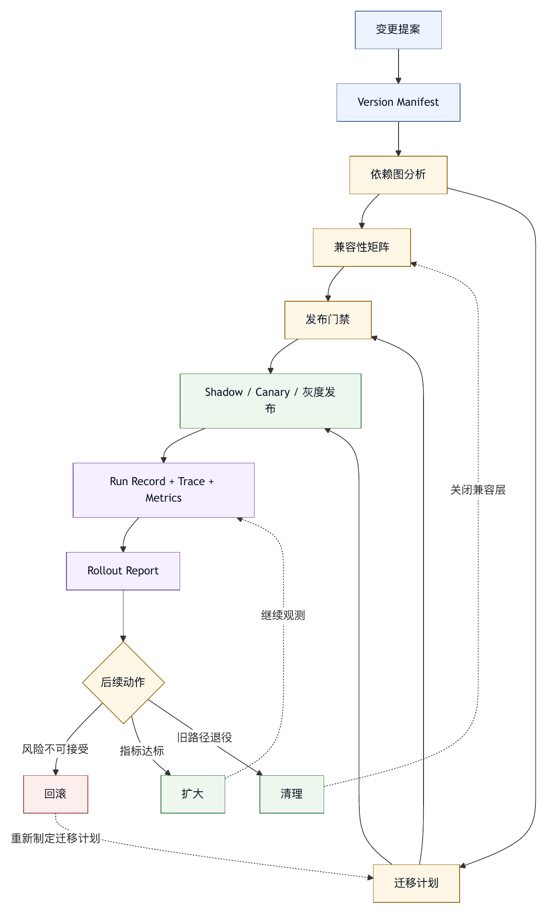

# 第二十九章 版本管理与迁移

## 29.1 Harness 也有版本

软件工程团队熟悉代码版本，却常常低估 harness 版本。harness 中几乎所有关键控制面都需要版本管理：系统指令、工具 schema、工具描述、上下文装配策略、profile、命令、插件、权限策略、记忆、评测集、评分器、模型契约、UI 行为和组织配置。

这些内容一旦变化，智能体行为就会变化。一次工具描述修改可能改变模型选择工具的概率；一次权限默认值调整可能改变用户审批频率；一次上下文压缩策略升级可能让长任务更稳定，也可能丢失关键事实；一次评测集变化可能让成功率不可比较。

没有版本管理，团队会遇到几个问题：

- 无法解释行为变化。
- 无法复现实验结果。
- 无法比较新旧策略。
- 无法回滚事故。
- 无法审查权限变化。
- 无法迁移旧会话或旧插件。
- 无法判断评测结果是否可比。

Harness 是运行基底。运行基底的版本，比普通业务代码更需要清晰。

## 29.2 表 29-1：Harness 版本对象清单

表 29-1 汇总了一个完整 Agent OS 至少应管理的版本对象。

| 版本对象 | 包含内容 | 迁移关注点 |
|---|---|---|
| 系统指令 | 全局行为原则、安全边界、回答格式、工具使用原则 | 修改后是否触发安全、权限和输出格式回归。 |
| Profile | 角色、模型、工具、权限、预算、记忆、输出要求 | 是否改变可用能力、成本、审批和完成门禁。 |
| 工具 | 工具名称、schema、描述、执行逻辑、错误语义、输出格式 | schema 和描述变化是否影响模型选择及历史会话。 |
| 上下文策略 | 规则加载、检索排序、摘要压缩、上下文预算、外部输入标注 | 是否改变模型可见事实、优先级和风险标记。 |
| 权限策略 | 工具 allow/ask/deny、路径规则、风险分类、组织策略、审批有效期 | 是否改变默认自动化程度、用户审批和组织风险。 |
| 命令 | 命令参数、流程、输出格式、调用工具 | 旧命令、脚本和团队习惯是否仍可运行。 |
| 插件 | manifest、能力、依赖、缓存、hook、MCP server、默认配置 | 是否新增权限、后台行为、外部依赖或供应链风险。 |
| Eval | 样本、fixture、评分器、期望结果、任务环境 | 新旧结果是否可比，评分标准是否已变。 |
| 记忆 | 记忆 schema、存储位置、作用域、更新规则、过期策略 | 旧记忆是否仍适用，敏感内容是否被带入新系统。 |
| 模型契约 | 模型名称、能力、上下文窗口、成本、工具调用支持、供应商特定行为 | 能力变化是否已被路由、评测和成本策略吸收。 |

这些对象互相依赖。一个 profile 引用工具版本，一个命令引用 profile，一个 eval 固定上下文策略，一个插件注册工具。版本管理必须能表达依赖关系；依赖关系不可见时，迁移会失控。

## 29.3 语义化版本与行为化版本

传统软件常使用语义化版本：major、minor、patch。Harness 也可以借鉴，但需要补充行为化视角。

对 harness 来说，兼容性不只看 API 是否破坏，还要看智能体行为是否显著变化。

例如，工具 schema 没变，只改了描述，从 API 角度是 patch；但如果新描述让模型大量改变工具选择，从行为角度可能是 major。权限策略只改了默认模式，从配置角度很小，但如果影响所有用户审批，就是重大变化。评测集新增样本，从接口角度无破坏，但成功率不能再和旧版本直接比较。

因此，harness 版本应同时记录：

- 接口兼容性。
- 行为影响范围。
- 安全影响。
- 成本影响。
- 评测可比性。
- 是否需要迁移。

这比普通包版本更复杂，但也更真实。智能体系统的风险往往来自行为变化，并非类型错误。

## 29.4 Prompt 与指令版本

系统指令和 prompt 是最容易被随手修改、也最需要版本化的对象。

Prompt 版本应记录：

- 修改原因。
- 适用范围。
- 变更内容。
- 关联 trace 或失败样本。
- 关联 eval。
- 预期行为变化。
- 风险评估。

不要把 prompt 当成不可审查的文本。它是控制逻辑的一部分。修改 prompt 应像修改代码一样进入 review，至少对核心系统指令如此。

Prompt 还需要分层。全局系统指令、项目规则、用户偏好、profile 指令、命令指令和临时任务指令不应混在一个文本块中。分层后，每一层可以独立版本化和审查。

当 prompt 变化后，应运行相关 eval。特别是安全、权限、外部输入和工具选择相关指令，不能只靠人工阅读判断。

## 29.5 工具 Schema 迁移

工具 schema 变化会影响模型、工具执行器、trace、eval、插件和历史会话。迁移必须谨慎。

常见 schema 变化包括：

- 新增可选参数。
- 新增必填参数。
- 修改参数名称。
- 修改枚举值。
- 修改返回结构。
- 拆分工具。
- 合并工具。
- 改变错误格式。

新增可选参数通常风险较低。新增必填参数会破坏旧命令、旧 profile 和旧 eval。修改返回结构可能破坏主智能体的解析和最终证据包。拆分工具可以提高治理，但会影响模型选择。

工具迁移应提供兼容层。旧 schema 可以在一段时间内继续接受，并给出 deprecation 警告。Trace 应记录实际使用的工具版本。Eval 应固定工具版本或声明兼容范围。

工具迁移还要处理模型可见描述。新旧工具同时存在时，模型可能混淆。描述中应明确推荐使用哪一个，旧工具应逐步从默认工具集中移除。

## 29.6 Profile 与命令迁移

Profile 和命令是用户直接感知的运行配置。修改它们会改变日常工作流。

Profile 迁移可能涉及模型、工具、权限、预算、输出格式和门禁。一个“代码审查”profile 如果从只读改为可写，风险巨大；如果改用更强模型，成本可能上升；如果新增安全检查，延迟可能增加。

命令迁移可能涉及参数、流程和输出。用户习惯了 `/review` 只读审查，如果新版本默认运行修改工具，就会破坏信任。命令变化应在帮助、命令面板和 changelog 中可见。

Profile 和命令迁移应支持：

- 版本固定。
- 明确 changelog。
- 新旧并行。
- 项目级覆盖。
- 回滚。
- 兼容提示。

对于组织级命令，变更还应经过审查。命令是团队流程入口，不能当作个人快捷键。

## 29.7 Eval 版本与可比性

Eval 版本管理尤其重要，因为它决定“系统是否变好”的证据是否可信。

Eval 变化包括：

- 新增样本。
- 删除样本。
- 修改 fixture。
- 修改评分器。
- 修改期望结果。
- 修改任务环境。
- 修改允许工具。
- 修改模型评价准则。

这些变化都会影响分数。新增困难样本后，成功率下降不一定是系统退步；删除失败样本后，成功率上升也不一定是系统进步。

因此，报告评测结果时必须记录 eval 版本。最好同时维护基准集、回归集、近期失败集和隐藏集。基准集保持稳定，用于长期趋势；近期失败集持续更新，用于改进；隐藏集用于防止过拟合。

删除或放宽安全 eval 应有特别审查。安全 eval 失败可能表示风险仍存在，不能为了提高数字而移除。

## 29.8 记忆与状态迁移

长期记忆和会话状态也需要迁移。随着 Agent OS 演化，记忆 schema、存储位置、作用域和加载策略都会变化。

记忆迁移的风险在于：旧记忆可能不再适用，但仍影响模型；新策略可能不加载旧偏好，用户体验下降；迁移过程可能暴露敏感内容；删除记忆可能影响可解释性。

记忆迁移应遵循：

- 保留来源和时间。
- 标注作用域。
- 支持过期。
- 支持用户查看和删除。
- 不把敏感信息迁入新系统。
- 迁移后记录变更。

会话状态迁移也很重要。旧会话可能引用旧工具、旧 profile、旧 trace 格式。系统不一定要让所有旧会话继续可执行，但至少应能阅读和审计。若旧会话恢复执行，系统应说明哪些配置已升级，哪些行为可能不同。

## 29.9 插件版本与供应链

插件是版本管理中风险最高的对象之一。插件可能包含命令、profile、工具、hook、MCP server、主题、规则和默认配置。插件升级可能改变智能体能力和安全边界。

插件版本管理应包括：

- 版本锁定。
- 来源记录。
- 完整性校验。
- 权限变化提示。
- 兼容性声明。
- Changelog。
- 组织 allowlist。
- 回滚。
- 漏洞或风险通告。

插件升级时，系统应比较新旧 manifest。新增工具、后台任务、hook、网络访问、文件 roots 或权限请求，都应突出展示。组织可以要求高风险插件升级先经过审查。

插件依赖也需要治理。一个插件依赖另一个插件或外部 MCP server，会形成供应链。Agent OS 应能展示依赖图，并在某个依赖被禁用、升级或撤回时处理影响。

## 29.10 迁移策略：双写、兼容、灰度

Harness 迁移常用策略包括双写、兼容和灰度。

双写适用于状态迁移。例如，新旧 trace 格式并行写一段时间，验证新格式完整后再切换。

兼容适用于工具 schema 和配置。系统接受旧格式，内部转换为新格式，并给出弃用提示。

灰度适用于行为变化。新 prompt、新权限策略、新上下文装配或新 profile 先对小范围任务启用，观察指标和用户反馈。

迁移前应定义回滚。回滚不仅是恢复代码，还包括恢复配置、插件版本、prompt、eval、权限和状态读写路径。

迁移后应做清理。长期保留多套兼容逻辑会增加复杂度。弃用周期结束后，应移除旧路径，但删除前要确认没有活跃依赖。

## 29.11 版本记录与可复现性

一次 agent run 应记录关键版本：

- Harness core 版本。
- 系统指令版本。
- Profile 版本。
- 模型契约版本。
- 工具版本。
- 插件版本。
- 上下文策略版本。
- 权限策略版本。
- Eval 或门禁版本。

这些记录让团队能复现行为。若用户报告某次智能体乱改文件，工程师需要知道当时使用的工具描述、权限策略和模型版本。若评测结果突然下降，团队需要知道是模型变了、eval 变了，还是上下文策略变了。

可复现性是生产运维要求，不只是学术要求。

## 29.12 常见失败模式

版本管理与迁移的常见失败模式包括：

第一，直接修改系统 prompt，没有版本和评测。

第二，工具 schema 改动破坏旧命令和插件。

第三，评测集变化后继续比较旧成功率。

第四，插件自动升级引入新权限。

第五，记忆迁移把过期或敏感信息带入新系统。

第六，旧会话无法审计，因为 trace 格式不可读。

第七，灰度没有指标和回滚条件。

第八，组织配置和项目配置冲突，但系统没有记录实际生效版本。

第九，模型版本变化未进入 run 记录。

第十，迁移兼容层长期不清理，系统越来越复杂。

这些问题会让 harness 难以信任。版本不清，行为就不可解释。

## 29.13 版本管理检查表

管理 harness 版本时，可以使用以下检查表。

对象：

- 哪些 prompt、工具、profile、命令、插件、eval、权限和上下文策略被版本化？
- 依赖关系是否记录？

变更：

- 每次变更是否有原因、影响范围、风险和关联 eval？
- 行为影响是否被标注？

兼容：

- 是否有旧版本兼容路径？
- 是否有弃用周期和迁移提示？

评测：

- Eval 版本是否记录？
- 结果是否只在可比版本之间比较？

运行：

- agent run 是否记录关键版本？
- 事故复盘能否还原当时配置？

发布：

- 是否支持灰度、双写、回滚和清理？
- 插件和权限变化是否经过审查？

治理：

- 谁可以修改全局 prompt、权限、插件和 eval？
- 高风险变更是否需要审批？

版本管理的目标，是让 harness 的演化可解释、可比较、可回滚。

## 29.14 Harness Version Manifest

版本管理不能只停留在“每个对象都有一个版本号”。如果版本信息散落在代码注释、配置文件名、插件目录和团队约定里，事故发生时仍然无法回答最关键的问题：这次运行到底用了什么？哪些对象发生过变化？这些变化是否经过评测、审批和灰度？

因此，成熟的 Agent OS 应维护 harness version manifest。它是一次发布、一次 profile 更新、一次插件升级或一次组织策略变更的版本事实表。manifest 不一定是单一文件，也可以是数据库记录或发布系统中的结构化对象，但它必须能被 trace、eval、审计和回滚系统引用。

一个基本的 harness version manifest 可以包含以下字段。

```yaml
harness_version_manifest:
  id: hv-2026-05-27-codereview-profile-17
  scope:
    organization: engineering
    workspace: payments-platform
    profile: code-review
    rollout_group: canary-10-percent
  changed_objects:
    - type: system_instruction
      name: global-coding-agent-policy
      from: 4.2.1
      to: 4.3.0
      behavior_impact: medium
      security_impact: high
    - type: tool
      name: repo_diff_reader
      from: 2.8.0
      to: 2.9.0
      behavior_impact: low
      security_impact: low
    - type: permission_policy
      name: default-write-policy
      from: 1.6.4
      to: 1.7.0
      behavior_impact: high
      security_impact: high
  dependencies:
    requires:
      - eval_suite: code-review-regression@12.1.0
      - trace_schema: agent-run-trace@3.4.0
      - plugin_set: organization-approved-tools@8.0.0
  evidence:
    eval_runs:
      - erun-84217
      - erun-84218
    sampled_traces:
      - trace-20260527-0018
      - trace-20260527-0041
    approval:
      ticket: gov-approval-391
      approvers:
        - platform-owner
        - security-owner
  rollout:
    strategy: canary
    start_time: "2026-05-27T09:00:00+08:00"
    rollback_condition:
      - safety_gate_failure_rate > 0.5%
      - approval_denial_rate doubles for 2 hours
      - unresolved critical incident
  deprecation:
    old_versions_supported_until: "2026-06-30"
```

这个 manifest 的价值，是把版本、范围、风险、证据、依赖、灰度和回滚条件放在一个对象中。没有这个对象，团队只能说“我们昨天改过一些配置”；有了这个对象，团队可以说“这批用户在这个时间窗口内使用了哪些策略，为什么发布，跑过哪些评测，触发哪些回滚条件”。

Manifest 还应区分三个版本层次。

第一是声明版本。对象自己声明的版本，例如工具 schema 版本、profile 版本、插件版本。

第二是组合版本。一个实际运行环境由多个对象组合而成。单个工具没变，但 profile、权限和上下文策略组合变化后，行为仍然可能变化。组合版本描述的是“这套运行基底”的版本。

第三是生效版本。用户实际运行时可能受到组织策略、项目覆盖、用户偏好、实验开关和临时审批影响。生效版本记录的是 run 当时实际使用的配置，而不是理论默认值。

很多版本事故就发生在这三个层次被混淆时。平台团队认为工具版本没有变化，业务团队看到智能体行为变化，治理团队查不到权限修改。复盘发现变化并不来自工具本身升级，而来自组织 profile 的默认工具集变化，项目级覆盖又把旧工具重新启用。只有同时记录声明版本、组合版本和生效版本，才能把这类问题解释清楚。

## 29.15 依赖图与兼容性矩阵

Harness 对象之间存在大量隐式依赖。如果版本系统只记录对象列表，而不记录依赖关系，迁移计划仍然脆弱。

一个工具 schema 依赖执行器版本、模型可见描述、trace 序列化格式、eval fixture 和文档示例。一个 profile 依赖模型契约、工具集合、权限策略、输出格式和质量门禁。一个插件依赖 MCP server、外部身份、网络策略、文件 roots、缓存目录和组织 allowlist。一个 eval 依赖任务环境、工具版本、评分器版本和 fixture 版本。

依赖图至少应回答四类问题。

一方面，谁引用我。若要删除一个旧工具，系统必须知道哪些 profile、命令、插件、eval 和历史 run 仍在引用它。

第二，我引用谁。若某个 profile 的行为变化，系统需要知道它依赖的 prompt、工具、权限和模型契约是否刚刚升级。

第三，哪些组合被测试过。一个工具在单独 eval 中通过，不代表它和某个 profile、某个权限策略、某个模型版本组合后仍然安全。

第四，哪些组合被禁止。某些插件不能与某些外部写入工具同时启用，某些 profile 不能在包含敏感仓库的 workspace 中使用，某些命令不能在 remote execution 环境中运行。

兼容性矩阵是依赖图的运行化表达。它不要求把所有组合穷尽测试，但必须标注关键对象之间的兼容范围。

```text
对象组合                         兼容状态        说明
code-review profile 5.x
  + repo_write_tool 3.x           allowed         需要 ask-on-write 权限
  + repo_write_tool 4.x           canary          返回结构变化，证据包仍在验证
  + shell_tool unrestricted       denied          违反组织默认策略

agent-run-trace schema 3.x
  + eval_suite 12.x               allowed         支持工具调用与审批 span
  + eval_suite 10.x               deprecated      缺少审批字段，结果不可长期比较

plugin_set 8.x
  + external-ticket-writer 2.x    review_required 新增外部写入能力
```

兼容性矩阵可以直接进入发布门禁。若某次发布引入未声明组合，门禁应要求补充评测或审查；若组合处于 denied 状态，系统应拒绝发布。这样，版本管理会从记录事实的文书工作，变成防止错误组合进入生产的控制面。

依赖图还应服务清理工作。长期兼容层会让 Agent OS 变重。每个 deprecated 对象都应能追踪剩余引用数、最后使用时间、迁移负责人和删除日期。缺少这些数据时，“临时兼容”容易变成永久复杂度。

## 29.16 Migration Plan 与 Rollout Report

迁移是版本管理中最容易被低估的环节。许多团队会认真写 changelog，却没有迁移计划；会设计新 schema，却没有旧数据处理策略；会宣布灰度，却没有清晰的观察指标和回滚阈值。

Harness migration plan 应覆盖六个部分。

第一，迁移目标。说明为什么要迁移，是为了降低错误率、统一 trace、减少成本、增强权限控制，还是为新能力铺路。没有目标的迁移容易变成技术洁癖。

第二，影响范围。列出受影响的 profile、命令、工具、插件、eval、历史会话、文档、培训材料和组织策略。影响范围不能只写“平台内部”。

第三，兼容策略。说明旧版本能否继续运行，兼容层如何转换，何时发出弃用提示，何时停止支持。

第四，数据和状态处理。说明历史 trace、记忆、会话状态、评测结果和审计记录如何读写。对于敏感数据迁移，还要说明过滤、脱敏和访问控制。

第五，验证计划。包括离线 eval、线上 shadow run、小流量灰度、人工审查抽样、指标看板和失败 triage。

第六，回滚和清理。说明哪些对象可回滚，哪些对象不可逆，回滚后如何处理双写数据，兼容层何时删除。

迁移完成后，还需要 rollout report。它记录真实发生的过程，不能只记录发布前的计划。

```yaml
rollout_report:
  migration: tool-schema-v4-return-evidence-package
  plan_id: mig-2026-05-29-001
  started_at: "2026-05-29T10:00:00+08:00"
  completed_at: "2026-05-31T18:30:00+08:00"
  rollout_steps:
    - stage: shadow
      traffic: 0%
      result: passed
      notes: "新旧返回结构双写，字段覆盖率 99.7%"
    - stage: canary
      traffic: 5%
      result: partial
      notes: "两个命令仍读取旧字段，已修复"
    - stage: expanded
      traffic: 50%
      result: passed
    - stage: general
      traffic: 100%
      result: passed
  incidents:
    - id: inc-784
      severity: low
      cause: stale command parser
      action: added compatibility adapter and regression eval
  cleanup:
    old_schema_read_path_removed: false
    removal_target: "2026-06-15"
```

Rollout report 是组织记忆的一部分。下一次团队做类似迁移时，不应重新摸索。它还可以反向校准迁移计划：哪些风险被高估，哪些风险被低估，哪些指标有实际用处，哪些审批太晚才介入。

## 29.17 案例：工具返回结构升级造成证据链断裂

某企业团队曾把代码审查智能体的 diff 工具从 v2 升级到 v3。v2 返回的是纯文本 diff，v3 返回结构化对象，包含 file、hunk、risk、suggestion、evidence 等字段。升级目标是好的：让最终报告更结构化，让审稿者更快定位风险。

平台团队认为这是兼容升级，因为工具名称、输入参数和核心语义没有变化。v3 仍然“读取 diff”，只是返回更丰富。发布前，他们跑了工具级单元测试和少量人工样例，结果正常。

问题出现在三个隐式依赖上。

第一，旧的最终总结模板仍假设工具输出是纯文本。模型看到结构化字段后，会抽取 risk 和 suggestion，但忽略 evidence 字段。于是最终报告中出现了“高风险修改”结论，却没有对应证据片段。

第二，一个组织级质量门禁只检查报告中是否包含“已查看 diff”和“建议修改”两类文本，不检查 evidence package 是否完整。新报告更像结构化审查，但证据反而变弱。

第三，历史 eval 的评分器基于关键词匹配。v3 输出改变后，评分器认为报告变短、命中词减少，于是分数下降。团队一度误以为新工具退步，实际是评分器与新输出格式不兼容。

这次事故没有造成代码写入错误，但破坏了审稿信任。用户看到更漂亮的报告，却无法追溯结论依据。最终修复需要补齐迁移链条，而不是简单回滚工具：

- 在 run 记录中显式记录 diff tool v3。
- 为最终总结模板增加 evidence 字段消费规则。
- 修改质量门禁，要求高风险结论必须引用具体 evidence。
- 为旧评分器增加适配层，同时建立 v3 专用 eval。
- 在两个星期内保留 v2 读取路径，支持历史 trace 审计。
- 更新 changelog，提醒团队不要直接比较 v2 与 v3 评分。

Harness 迁移的破坏面往往不在显式接口，而在解释链和证据链。工具输入没变，不代表系统行为兼容；输出更结构化，不代表用户更能信任。版本管理必须顺着智能体的真实工作流检查：工具输出如何进入上下文，模型如何引用，最终报告如何呈现，门禁如何验证，审稿者如何追溯。

## 29.18 Run Record 与 Version Diff

一次 agent run 是版本管理的最终落点。发布系统记录了什么不够，运行记录必须说明实际生效了什么。

Run record 中的版本字段应覆盖关键控制面：

```yaml
run_versions:
  harness_core: 6.4.2
  agent_loop: 3.1.0
  system_instruction: global-coding-agent-policy@4.3.0
  project_rules: payments-platform-agents@2.2.1
  profile: code-review@5.8.0
  model_contract: reasoning-model-large@2026-05-20
  context_strategy: repo-aware-context@7.0.3
  permission_policy: default-write-policy@1.7.0
  sandbox_profile: workspace-write@2.5.0
  tool_set:
    repo_diff_reader: 2.9.0
    test_runner: 4.1.2
    issue_commenter: 1.4.0
  plugin_set: organization-approved-tools@8.0.0
  trace_schema: agent-run-trace@3.4.0
  quality_gate: review-evidence-gate@2.0.1
```

这些字段要能和 trace 事件关联。OpenTelemetry 的 GenAI semantic conventions 当前仍处于 Development 状态，但已经提供了生成式 AI 调用、模型、token、响应、工具调用、agent span 和相关系统语义的方向；Agent OS 可以在此基础上扩展 harness 版本字段，让模型调用、工具调用、审批、门禁和外部写入都能带上可比较的版本语义。〔注29-1〕

Version diff 则用于解释两个 run 为什么不同。用户更常问“为什么今天的智能体和昨天不一样”，而不是“当前版本是什么”。版本系统应能生成面向工程师和审查者的差异报告。

一个有用的 version diff 不应只列出版本号变化，还应说明行为影响：

```text
Run A: 2026-05-26 / trace-7319
Run B: 2026-05-27 / trace-7442

Changed:
- profile code-review: 5.7.2 -> 5.8.0
  impact: output format now requires explicit risk classification
- permission_policy default-write-policy: 1.6.4 -> 1.7.0
  impact: package-lock writes changed from allow to ask
- repo_diff_reader: 2.8.0 -> 2.9.0
  impact: diff output includes structured hunk metadata

Unchanged:
- model_contract reasoning-model-large@2026-05-20
- context_strategy repo-aware-context@7.0.3
- quality_gate review-evidence-gate@2.0.1

Likely explanation:
- Additional approval prompt came from permission policy change.
- More explicit risk labels came from profile change.
- Longer evidence section came from diff reader output change.
```

这种 diff 能显著降低排障成本。没有它，团队会在模型、prompt、工具、上下文和用户输入之间猜测；有了它，排查可以从真实差异开始。

## 29.19 图 29-1：Harness 版本发布流水线

图 29-1 展示 harness 版本从提案、manifest、依赖分析到灰度和清理的发布路径。

<figure><figcaption><p>图 29-1：Harness 版本发布流水线</p></figcaption></figure>

```text
变更提案
   |
   v
Version Manifest
   |
   v
依赖图分析 -----> 兼容性矩阵
   |                    |
   v                    v
迁移计划 --------> 发布门禁
   |                    |
   v                    v
Shadow / Canary / 灰度发布
   |
   v
Run Record + Trace + Metrics
   |
   v
Rollout Report
   |
   v
回滚 / 扩大 / 清理
```

这条流水线的重点是把“版本号”转化为“可治理的行为变化”。每个变化都应说明为什么变、影响谁、如何验证、何时回滚、何时删除旧路径。版本管理让演化可以被组织吸收，不是阻碍演化。

## 29.20 Versioned Control Plane：版本化控制面

当 harness 进入企业生产环境后，版本不应只存在于仓库标签、配置文件注释或发布公告中，而应进入控制面。所谓版本化控制面，是指 Agent OS 在每次 run 开始前，能够解析并固化本次运行所采用的模型契约、profile、prompt bundle、工具集合、权限策略、上下文策略、质量门禁和观测 schema，并把这些解析结果作为运行事实写入 trace。

这件事看似只是记录字段，实际改变了系统性质。没有版本化控制面时，智能体的行为由多个散落来源共同决定：全局配置、项目规则、用户临时指令、插件默认值、服务端灰度、客户端缓存、环境变量和后台策略。事故发生后，团队只能问“是不是最近改了什么”。有版本化控制面后，团队可以回答三个更具体的问题：本次 run 解析到了哪些对象；这些对象来自哪个层级；解析顺序和覆盖结果是什么。

版本化控制面应提供四类能力。

第一类是有效版本解析。平台不能只保存“组织默认版本”，还要保存“实际生效版本”。一个项目可能固定在旧 profile，一个用户可能处于新权限策略灰度，一个插件可能由项目规则禁用。run record 应记录最终解析结果，而不是让审计者事后重新推导。

第二是变更来源归因。每个版本字段都应能追溯到变更入口：代码发布、配置发布、策略发布、用户选择、项目覆盖、实验分组或紧急回滚。没有来源归因，版本记录只是静态快照；有来源归因，版本系统才能解释行为变化。

第三是运行期冻结。一次 run 开始后，关键控制面对象原则上不应在中途漂移。长任务可以跨越多个小时，后台配置可能在期间发布。平台应在 run 启动时冻结本次使用的版本集合，或者在确需中途切换时写入显式事件，说明切换原因、切换点和影响范围。

第四是跨系统传播。版本字段不能只留在 orchestrator 内部，还应进入工具调用事件、外部写入事件、审批请求、质量门禁和最终报告。这样，当一个 PR 评论、工单回复、数据库查询或文档写回引发争议时，组织可以从外部副作用反查当时的 harness 版本。

版本化控制面的基本原则是：凡是能改变智能体决策、权限、证据、输出或外部副作用的对象，都应有版本；凡是有版本的对象，都应能在 run 中看到实际生效值；凡是实际生效的对象，都应能解释它为什么生效。

## 29.21 版本变更分类

版本治理不能把所有变更都当作同一种发布。修正文案、修改工具 schema、扩大写权限、替换模型、重建评测评分器、迁移记忆格式，它们都可能改变版本号，但风险性质完全不同。成熟团队会先对变更分类，再决定评测、审批和灰度强度。

第一类是展示性变更。它主要改变用户界面文案、报告排版、错误提示和帮助信息。展示性变更通常风险较低，但也不能完全忽略，因为智能体产品中的文案往往承担控制面职责。审批按钮上的动词、权限请求的范围描述、质量门禁的拒绝理由，都会影响用户判断。

第二类是语义性变更。它改变 prompt、profile、命令说明、工具描述或评分准则的含义。此类变更可能没有代码 diff，却会改变模型对任务的理解。语义性变更至少需要回放关键样本、检查输出风格、检查拒绝与升级策略，并由业务 owner 确认目标行为。

第三类是契约性变更。它改变输入输出 schema、错误码、事件结构、trace 字段或 manifest 格式。契约性变更的风险在于破坏上下游依赖。它需要兼容性矩阵、适配层、历史数据读取策略和消费者清单。

第四类是权限与安全变更。它改变智能体能做什么、向哪里写、是否需要审批、凭据如何委托、sandbox 如何隔离。此类变更必须进入安全评审和事故演练。即使用户体验上只是少弹出一次确认框，也可能意味着风险边界变宽。

第五类是状态迁移变更。它改变记忆、长期上下文、任务状态、缓存、索引或外部资源映射。状态迁移的难点不在发布当天，而在长尾数据。旧状态可能长期存在，错误迁移可能在数周后才显现。它需要可重跑、可校验、可回滚或可补偿的迁移计划。

第六类是运行时与容量变更。它改变调度、并发、预算、超时、重试、降级或供应商路由。此类变更容易制造隐性行为变化：更短的预算让智能体少做验证，更激进的重试放大外部调用，更高并发暴露锁冲突。它应与成本、延迟和可靠性指标一起评审。

一个版本发布可以同时包含多类变更。治理上应按最高风险类别处理，不能按改动行数处理。特别是在 harness 中，“小配置”经常比“大代码”更危险，因为它直接站在模型决策路径上。

## 29.22 兼容层的退出机制

迁移计划常常强调如何兼容旧版本，却忽视如何退出兼容层。结果是 adapter、旧字段、双写逻辑、旧评分器和旧工具别名长期留在系统里，成为新的复杂度来源。兼容层如果没有退出机制，就会从迁移工具变成永久债务。

每个兼容层都应在创建时绑定四个信息：服务对象、退出条件、负责人和最晚清理窗口。服务对象说明它保护哪些消费者，例如旧 trace 读取器、旧 profile、历史 eval 报告或特定项目。退出条件说明什么时候可以删除，例如连续三十天没有旧版本流量、所有项目完成迁移、历史读取器已具备 schema adapter、审计保留期结束。负责人说明谁对清理负责。清理窗口说明兼容层不能无限延长。

兼容层还需要可观测性。平台应统计旧字段读取次数、旧工具名调用次数、旧 profile run 数、旧 schema 解析失败数和适配器命中率。没有这些指标，团队会因为“不确定还有没有人在用”而不敢删除。指标应进入 rollout report，不能只在日志里沉没。

退出兼容层时，不能只删除代码。需要先停止新流量进入旧路径，再观察旧流量下降，再给受影响项目发送迁移提醒，再把旧路径改为显式告警，再删除。对高风险对象，可以先把旧路径改为只读，或要求项目显式声明继续使用原因。

兼容层的产品界面也很重要。项目管理员应能看到自己是否依赖旧版本、依赖原因、最后一次命中时间和迁移建议。缺少产品界面时，清理工作会变成平台团队逐个追问项目团队，成本高且容易漏。

成熟版本治理的标志，是清楚知道哪些兼容是必要的、哪些兼容已经完成使命、哪些兼容正在伤害系统可理解性，而不是永远兼容。

## 29.23 历史 Trace 与历史 Eval 的读取策略

Harness 的历史数据本身也会被版本变化影响。trace schema 会升级，eval case 会改写，评分器会调整，模型契约会替换。如果没有历史读取策略，团队会在两类错误之间摇摆：一类是用新解释强行读取旧数据，导致历史结论失真；另一类是把旧数据封存不用，导致组织无法从过去学习。

历史 trace 的第一原则是按写入时 schema 解释。每条 trace 应记录 schema version、采集器版本和关键语义约定版本。读取器可以升级，但升级后的读取器必须知道如何解释旧字段。对于删除字段，不应让历史 UI 直接空白；应提供字段映射、退化展示或说明该字段在当时不存在。

历史 trace 的第二原则是保留原始事件。为了查询效率，平台可以建立派生索引、摘要和聚合指标，但原始事件应在保留期内可读取。迁移派生表失败时，团队还能回到原始事件重建证据。对智能体事故而言，原始事件不仅是技术日志，也是责任和成熟度复盘。

Eval 的历史读取更敏感。一次历史 eval 分数代表在某个时间点、某套样本、某个评分器和某个运行环境下的结果。评分器升级后，不应直接覆盖旧分数。正确做法是保留旧结果，并在需要时生成新的评测线：同一批样本用新评分器重新评分，标注为再评分结果。这样，团队既能看历史趋势，也能理解评分口径变化。

Eval case 本身也需要版本。一个案例如果修改了输入、参考答案、评分规则或环境准备方式，就已经不再是同一个可比样本。可以保留 case id 的族群关系，但具体运行应指向精确版本。混在一起后，模型升级、profile 修改和样本修改会互相掩盖，团队无法判断质量变化来自哪里。

历史读取策略的目标是让不可比性显式化，而不是让所有数据永远完全可比。只要报告能够说明“本段趋势可比较”“这次断点来自评分器升级”“这些旧 trace 缺少工具风险字段”，用户就能正确使用历史数据。

## 29.24 多租户与项目覆盖迁移

企业 Agent OS 往往是多租户系统。组织有默认策略，部门有补充规则，项目有本地 profile，用户有个人偏好，实验系统还有灰度分组。版本迁移若只按全局发布思考，会低估覆盖关系带来的复杂度。

多租户迁移要先建立版本继承图。平台应说明一个 run 的配置来自哪些层级：组织基线、业务线模板、项目覆盖、仓库规则、用户选择和临时会话参数。每个层级都应有可覆盖字段和不可覆盖字段。安全策略、审计字段和数据驻留规则通常不允许项目覆盖；输出格式、默认命令和上下文偏好可以允许项目选择。

项目固定版本是必要能力。对于关键业务项目，平台不应强制所有人同时升级到新 profile 或新工具 schema。项目可以在审查后固定到某个稳定版本，并获得迁移窗口。固定版本不等于永久停留；它应有到期提醒、风险提示和升级路径。

迁移期间要避免“半升级”状态。一个项目如果升级了 profile，却仍使用旧工具输出；升级了评测评分准则，却仍使用旧样本；升级了权限策略，却没有更新审批文案，就会产生难以解释的行为。版本系统应检查关键对象组合是否处于支持矩阵内。

多租户灰度还要处理相互依赖。一个团队的智能体可能会调用另一个团队维护的内部工具；一个组织级插件可能在多个项目中使用；一个共享评测集可能被多个业务线引用。迁移计划需要列出跨租户依赖，避免平台只通知直接使用者而漏掉间接受影响方。

在产品上，平台应提供项目级迁移面板：当前版本、推荐版本、阻塞项、兼容风险、最近失败样本、可执行的升级动作和回滚入口。迁移需要项目 owner 能看懂、能评估、能选择时机，不是平台团队单方面发布。

## 29.25 模型版本与供应商迁移

模型版本是 harness 版本治理中最容易被误解的一层。很多团队把模型升级当作供应商参数变化：从某个 model id 切到另一个 model id，或把路由权重调高。对 Agent OS 来说，模型版本更像行为契约变化。它可能改变工具调用倾向、推理长度、拒绝边界、语言风格、结构化输出稳定性、对系统指令的服从方式以及对长上下文的注意分布。

模型迁移的第一步是更新 model contract，而不是替换 id。契约应说明新模型被允许承担哪些任务，不适合哪些任务，对上下文长度、工具调用、结构化输出、代码修改、视觉输入和安全拒绝有什么已知边界。没有契约，路由系统只能按成本和表面质量选择模型。

供应商迁移还需要防腐层。不同供应商对 tool calling、JSON schema、系统消息、token 统计、错误类型、速率限制和内容安全过滤的语义不完全相同。Agent OS 不应让业务 profile 直接依赖供应商私有细节，而应通过统一的模型调用接口和能力描述层转换。迁移时，变化集中在防腐层和 model contract，而不是散落到每个业务智能体。

模型迁移应采用影子运行和差异审查。对于高价值任务，可以让旧模型产生正式输出，新模型并行产生候选输出，只把候选用于评测和人工审查。差异审查关注证据完整性、工具调用顺序、权限判断、拒绝策略、最终声明和修复可验证性，而不是哪一个回答“更像人”。

供应商迁移还要考虑失败模式变化。一个模型可能更少幻觉但更保守，另一个模型可能更会调用工具但更容易过度行动。迁移报告应写出这些行为差异，不能只写平均分提升。对 harness 来说，平均质量提高但高风险边界变宽，仍可能是不合格迁移。

此外，模型版本必须和其他控制面版本一起记录。单独说“模型升级导致行为变化”通常是不够的，因为模型升级常常伴随 prompt 适配、上下文策略调整和评分器修改。run record 应帮助团队把模型变化从其他变化中分离出来。

## 29.26 版本漂移监控

版本漂移是指系统实际运行版本偏离预期版本，或者不同层级对“当前版本”的理解不一致。它可能来自缓存未刷新、客户端过旧、插件自动更新、配置发布失败、灰度系统误分组、环境变量覆盖、回滚不完整或手工修复未登记。版本漂移比普通 bug 更危险，因为团队常常以为自己正在运行已验证组合。

漂移监控应从三组信号入手。

第一组是期望与实际差异。平台发布系统认为某项目应运行 profile 5.8.0，但 run record 显示仍有 5.7.2；版本清单声明工具 schema 3.0 已全量，trace 中仍出现 2.x 输出；权限策略已回滚，但审批事件仍带新策略字段。这类差异应直接告警。

第二组是组合合法性。单个对象版本都可能合法，但组合不合法。例如新评分器配旧样本，新 profile 配旧工具描述，新 trace schema 配旧导出器，新插件配旧权限策略。兼容性矩阵应被机器读取，并在 run 启动时或发布前检查。

第三组是行为突变。即使版本字段看似正确，输出长度、工具调用次数、审批率、门禁拒绝率、回滚率、用户打断率或任务完成时间突然变化，也可能提示隐含版本漂移。行为突变不一定证明版本错误，但应触发版本 diff 与发布事件对照。

漂移监控需要一个“期望状态”来源。组织可以把 Version Manifest、项目固定版本和灰度规则合成期望状态，再用 run record 反向核对实际状态。核对结果应进入运营仪表盘，让平台团队看到哪些项目仍在旧路径、哪些租户版本分布异常、哪些发布没有达到预期覆盖。

版本漂移的处理也应分级。低风险展示性漂移可以在下一次发布修复；权限、安全、外部写入和证据链相关漂移需要快速冻结或回滚；影响历史数据解释的漂移需要标注数据区间，防止后续分析误用。

## 29.27 版本发布审查评分准则（Rubric）

版本发布审查的目的在于让变更在进入生产前回答足够具体的问题，不是制造流程负担。一套实用评分准则可以按七个维度评审。

第一，变更意图是否清楚。发布说明要解释为什么需要这次版本变化，目标行为是什么，不应只写“优化 prompt”“升级工具”“改进体验”。如果目标行为无法描述，评测也无法设计。

第二，影响对象是否完整。审查者要看到哪些 profile、工具、项目、租户、评测、trace、审批、门禁和外部连接器会受到影响。只列直接修改文件是不够的，harness 的风险经常在消费者侧。

第三，兼容策略是否可执行。对于契约性和状态性变更，评分准则应要求说明是否向后兼容、是否需要 adapter、旧版本如何读取、新旧路径并行多久、退出条件是什么。

第四，验证证据是否匹配风险。低风险文案变更可以人工检查；语义性变更需要回放样本；权限变更需要安全用例；模型迁移需要影子运行；状态迁移需要抽样校验和失败重试。证据强度应随风险上升。

第五，回滚与补偿是否明确。并非所有变更都能简单回滚。外部评论已经发出，记忆已经写入，状态已经迁移，评分报告已经展示给业务方。审查应要求说明哪些副作用可撤销，哪些只能补偿，哪些需要沟通。

第六，观测计划是否足够。发布后看什么指标，多久看一次，谁负责判断扩大或停止，异常阈值是什么。没有观测计划的灰度只是慢速全量。

第七，用户沟通是否匹配可见影响。对最终用户有感知的变更，需要 release note、界面提示或项目管理员通知。对审计和合规有影响的变更，需要记录审批材料。

评分准则应成为发布系统的一部分，而不是散落在评审者脑中。对于高风险类别，系统可以要求必须填写相应字段；对于低风险类别，系统可以简化路径。成熟的版本治理会让风险轻重分明，而不是让所有发布都变重。

## 29.28 迁移期间的用户体验

迁移不能当作纯后台工程。智能体行为变化会直接影响用户信任，尤其是 coding agent、文档写作智能体、数据分析智能体和企业操作智能体。用户不一定关心版本号，但会立刻感知“它今天为什么不一样了”。

迁移期间的用户体验应遵循三个原则。

第一，解释变化而不转嫁复杂度。界面不需要展示完整 Version Manifest，但应在关键处说明行为变化。例如“此项目已启用新版代码审查 profile，报告将增加风险等级与证据引用”；“写入外部系统前将新增审批，因为权限策略已升级”。用户知道变化原因，就更容易接受短期摩擦。

第二，保留可选择的稳定路径。对于高频工作流，迁移初期可以允许项目回到上一稳定版本，或在新旧输出格式之间短期切换。稳定路径应有时间边界和风险提示，但它能让用户在关键交付期避免被平台变化打断。

第三，把失败恢复做成用户可理解的动作。迁移失败时，不要只显示内部错误码。界面应告诉用户当前 run 是否安全停止、哪些外部副作用已经发生、是否可以重试、是否建议回滚到旧版本、是否需要联系项目管理员。

用户体验还包括文档和培训。版本迁移说明应按角色组织：普通用户需要知道行为差异和操作变化；项目管理员需要知道升级步骤和回滚入口；安全与合规人员需要知道权限和审计影响；平台工程师需要知道兼容层和清理计划。

好的迁移体验会降低组织对 harness 演化的抵触。用户不怕系统变强，用户怕系统无声变化、行为难懂、失败时没人能解释。

## 29.29 配置冻结与紧急回滚

版本管理必须同时支持计划内演化和计划外止血。配置冻结与紧急回滚是这两类能力的交界。

配置冻结适用于关键业务窗口：大型发布、财务结算、安全演练、客户交付、审计期间或高风险迁移前后。冻结并非停止所有开发，而是禁止影响指定项目、租户或工作流的关键控制面变化。冻结范围应包括 profile、权限策略、工具 schema、模型路由、质量门禁和外部连接器配置。冻结期间允许的例外必须有审批和记录。

冻结要细粒度。全平台冻结成本很高，容易被绕过。更好的方式是按租户、项目、工作流或风险对象冻结。某个支付项目可以冻结写权限和审计 schema，但不影响另一个文档项目升级报告模板。

紧急回滚则要求系统能快速恢复到已知稳定组合。回滚对象不应只是一段代码发布，还应包括 Version Manifest 中的关键对象集合。平台应保留上一稳定组合，并能在回滚后让新 run 使用该组合。对于已经开始的长任务，系统需要选择继续使用冻结版本、提示用户重启，或在安全点切换。

回滚后还要做数据标注。事故期间产生的 trace、eval、外部写入和用户反馈，应标注受影响版本区间。缺少数据标注时，后续评测和运营分析会把事故数据当成正常样本，引导错误改进。

紧急回滚不能替代根因修复。回滚只是恢复服务和信任，之后仍需要 version diff、影响面分析、兼容层检查、发布流程修正和样本资产化。缺少根因修复时，同类事故会在下一次迁移中重演。

## 29.30 版本治理组织接口

版本治理横跨平台、产品、安全、业务项目和数据团队。若没有组织接口，版本管理会退化成平台团队内部的发布记录，无法约束真实行为。

平台团队负责版本系统能力：manifest、兼容性矩阵、run record、发布门禁、灰度、回滚、漂移监控和历史读取器。它还负责定义哪些对象必须版本化，以及如何把版本字段写入 trace。

业务项目 owner 负责判断迁移时机和业务可接受性。平台团队可以推荐升级，但项目 owner 要确认关键工作流、交付窗口、用户培训和回滚偏好。对于项目固定版本，owner 也要承担过期风险的确认责任。

安全与合规团队负责权限、安全策略、审计字段、数据驻留和外部副作用相关版本。它们不应只在事故后介入，而应参与高风险版本变更评分准则的设计。

数据与评测团队负责 eval 版本、评分器版本、样本集版本和指标断点解释。它们需要和平台团队共同维护评测可比性，避免发布后分数变化无法归因。

产品与用户体验团队负责迁移可见性。版本变化如果影响用户工作流，就需要界面提示、release note、帮助文档和项目管理员面板。没有产品层承接，工程上成功的迁移也可能在用户侧被视为不稳定。

组织接口的核心产物可以很简单：版本发布评审会、迁移日历、风险分类、项目升级状态表和月度漂移报告。关键是让版本从“某个团队的技术细节”变成“组织共同管理的行为契约”。

## 29.31 版本成熟度模型

Harness 版本能力可以分为五个成熟度层级。

L0 是无版本状态。prompt、工具描述、profile 和策略散落在代码、文档和配置里，修改后没有统一记录。事故复盘只能依赖人的记忆。

L1 是对象有版本。主要对象开始有版本号和 changelog，但版本之间缺少依赖关系，run record 也不一定记录实际生效值。团队能知道“改过什么”，但很难知道“某次运行用了什么”。

L2 是运行可复现。run record 记录关键版本，trace 能关联版本字段，项目可以固定版本。团队可以复现大部分历史行为，并解释同一任务在不同时间的差异。

L3 是迁移可治理。系统具备兼容性矩阵、灰度、影子运行、回滚、兼容层退出、历史读取策略和发布审查评分准则。版本发布不再靠个人经验，而是有稳定流程和证据。

L4 是演化可优化。版本数据、trace、eval 和用户反馈形成闭环。平台能识别漂移、推荐迁移路径、发现长期兼容债务，并把版本变化对质量、成本、延迟和风险的影响量化。版本治理从防事故进一步变成改进引擎。

多数团队不需要一开始追求 L4。更现实的路径是先把关键控制面对象纳入版本，再把 run record 补齐，再建立高风险变更的迁移门禁。版本成熟度的价值在于帮助团队知道下一步该补哪块能力，不是给组织贴标签。

## 29.32 常见反模式补充

第一种反模式是只版本化代码，不版本化行为。代码仓库有 tag，容器镜像有 digest，但 prompt、profile、工具描述和权限策略没有精确版本。结果是软件发布看似规范，智能体行为仍不可复现。

第二种反模式是把版本号当作沟通。发布说明只写“v3 已上线”，却不说明行为影响、迁移动作、回滚方式和用户可见变化。版本号不能替代解释。

第三种反模式是兼容层无限期存在。为了避免短期破坏，团队不断保留旧路径，却没有指标和清理计划。几年后，任何新变更都要考虑大量历史分支，系统演化速度下降。

第四种反模式是评测和版本脱节。团队修改评分器、样本和运行环境后，仍把新旧分数画在同一条趋势线上。这样得到的是口径混合，不是质量趋势。

第五种反模式是灰度没有退出条件。系统把百分之五流量切到新版本后长期停留，既没有扩大，也没有回滚，也没有清理。灰度变成永久分裂，用户体验和排障都被复杂化。

第六种反模式是紧急修复绕过版本系统。线上事故时，工程师直接改配置止血，却没有形成版本记录、审批记录和影响区间。短期问题解决了，长期证据断了。

第七种反模式是忽视用户感知。平台认为某次迁移只是内部 schema 升级，但用户看到输出格式变了、审批更多了、报告更长了。只要用户工作流受影响，就不是纯内部变更。

这些反模式有共同根源：把 harness 版本看成工程资产的编号，而不是智能体行为契约的治理。版本管理要能让组织回答：什么变了，为什么变，影响谁，怎么验证，出了问题如何恢复，旧路径何时删除。

## 29.33 第二十九章小结

Harness 的行为由大量非代码对象共同决定：prompt、工具描述、schema、profile、命令、插件、权限、上下文策略、记忆和 eval。它们都需要版本管理。

成熟 Agent OS 会把这些对象当作生产配置和控制逻辑来管理。它记录版本、依赖、变更原因、评测结果和运行时生效配置；它支持兼容、灰度、迁移和回滚。这样，harness 的持续演化才不会变成不可解释的漂移。
