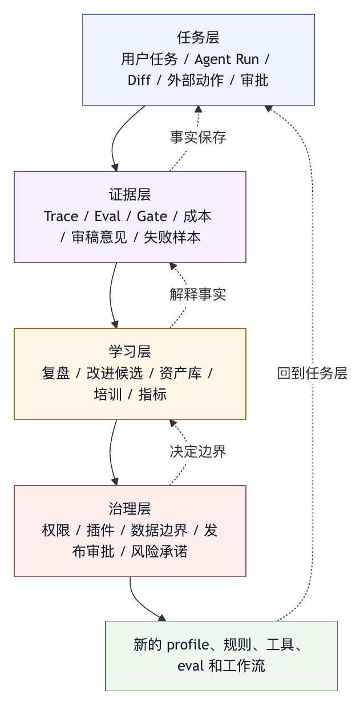

# 第三十章 组织学习

## 30.1 Harness Engineering 最终是组织能力

前面的章节讨论了模型、工具、权限、trace、评测、Agent OS、插件、企业集成和持续演化。这些能力很难由单个工程师或单个模型团队长期独立完成，harness engineering 最终会变成组织能力。

智能体进入真实工作流后，影响范围覆盖代码生成效率、安全边界、知识管理、审批流程、团队协作、质量标准、事故处理、成本治理和用户信任。任何一个维度都需要跨职能协作。

组织学习的目标，是让团队从一次次智能体使用、失败、成功、事故、审查和改进中形成共同能力。它要求组织持续建设、治理和演化 Agent OS，而不只是某个专家知道如何使用智能体。

没有组织学习，harness 会停留在少数人的技巧中；有了组织学习，harness 才能成为生产力基础设施。

## 30.2 组织需要共同语言

组织学习的第一步，是建立共同语言。没有共同语言，团队会用同一个词表达不同问题。

有人说“模型不行”，可能其实是上下文缺失。有人说“智能体越权”，可能是权限策略过宽。有人说“结果不可用”，可能是质量门禁没跑。有人说“太贵”，可能是工具输出过长。有人说“无法信任”，可能是 trace 和证据包不足。

本书前面建立的术语体系，就是共同语言的基础：

- Harness。
- Context assembly。
- Tool system。
- Permission。
- Sandbox。
- Trace。
- Eval。
- Quality gate。
- Agent OS。
- Plugin。
- Profile。
- Trace-to-eval。
- Improvement candidate。

这些术语应进入团队设计文档、复盘、评测报告、审查清单和产品讨论，而不只是停留在书面概念。共同语言能让问题被准确定位，而不是被笼统归因给“AI 不稳定”。

## 30.3 平台团队、业务团队与治理团队

企业中的 Agent OS 通常涉及三类团队。

平台团队负责 harness core、工具、运行时、UI、trace、eval、插件系统和发布。

业务或工程团队负责具体工作流：代码审查、研发效能、数据分析、文档整理、客户支持、运维诊断等。

治理团队负责安全、合规、权限、数据边界、审计、风险和组织策略。

三者缺一不可。平台团队不了解具体工作流，会做出通用但浅的工具。业务团队没有平台支持，会把智能体使用变成个人技巧。治理团队如果只事后审核，会被视为阻力；如果参与设计，就能把安全变成默认边界。

组织学习的关键，是让三类团队形成反馈回路。业务团队提供真实任务和失败样本，平台团队把它们变成工具、规则和 eval，治理团队定义可接受风险和审批边界，再由业务团队验证效果。

## 30.4 审稿文化

智能体产出的代码、文档、决策建议和外部动作都需要审稿文化。审稿承认智能体是生产系统的一部分，并不等于不信任智能体。

好的审稿文化关注证据：

- 智能体是否说明修改范围？
- 是否运行了必要检查？
- 是否有 diff？
- 是否说明未验证项？
- 是否遵守项目规则？
- 是否触碰高风险路径？
- 是否有权限和审批记录？
- 是否有回滚方案？

审稿也应避免两个极端。

一个极端是盲目信任。因为智能体看起来专业，就跳过审查。

另一个极端是全面否定。因为智能体可能出错，就拒绝任何自动化。

成熟文化会把智能体输出当作需要证据支撑的工作成果。证据充分时可以快速通过，证据不足时要求补充，风险高时升级审批。

## 30.5 事故复盘文化

智能体事故不可避免。事故发生后的复盘方式决定学习质量。

好的事故复盘应关注系统改进，不把重点放在寻找替罪者。它应回答：

- 任务目标是什么？
- 智能体实际做了什么？
- 哪个边界失效？
- 为什么现有 trace、权限、UI、eval 或门禁没有防住？
- 用户或审查者看到什么信息？
- 哪个工具或外部系统参与？
- 是否有数据泄露或外部副作用？
- 如何恢复？
- 哪些改进候选要进入队列？

复盘产物不应只是文档。它应产生具体变更：新增 eval、修改权限、改工具 schema、改审批提示、更新项目规则、补充 runbook、调整培训或改变组织策略。

Google SRE 所强调的从失败中学习的复盘文化，对 Agent OS 同样适用。只是这里的系统不仅包含服务和运维，也包含模型、上下文、工具和人机协作界面。

## 30.6 培训：教人使用控制面

很多组织把智能体培训做成提示词技巧培训。这不够。有效培训应教用户理解控制面。

用户需要知道：

- 什么时候用智能体，什么时候不用。
- 如何描述目标和约束。
- 如何阅读 diff 和证据包。
- 如何判断审批请求。
- 如何处理智能体走错方向。
- 如何报告失败样本。
- 如何把经验沉淀为规则或命令。
- 如何保护敏感信息。
- 如何区分模型建议和已验证事实。

管理员需要知道：

- 如何配置权限。
- 如何审查插件。
- 如何查看 trace。
- 如何管理 eval。
- 如何处理事故。
- 如何发布 profile 和命令。

培训目标是让每个人能安全、有效地参与智能体工作流，不是让每个人变成 prompt 专家。

## 30.7 治理委员会与变更审查

当 Agent OS 影响范围扩大，组织需要治理机制。治理不一定是庞大委员会，但必须有人负责关键变更。

需要审查的变更包括：

- 全局系统指令。
- 权限默认值。
- 组织级插件。
- 外部系统写入工具。
- 数据保留策略。
- 安全 eval。
- 生产发布命令。
- 高风险 profile。
- 远程运行环境。

审查应看证据，而不是只看意图。每个高风险变更应有背景、影响范围、评测结果、灰度计划和回滚方案。

治理机制也要保持轻量。所有变更都要求委员会批准，会让团队绕过平台。合理做法是按风险分级：低风险配置可自助，高风险变更需审查，安全边界变更需正式批准。

## 30.8 学习资产库

组织学习需要资产库。缺少资产库时，经验会散落在聊天记录、PR 评论、事故文档和个人笔记里。

学习资产可以包括：

- 规则库。
- 技能库。
- 命令库。
- Profile 库。
- Eval 库。
- 失败样本库。
- 事故复盘库。
- 审批案例库。
- 插件审查记录。
- 经验文档。

这些资产应可搜索、可版本化、可审查、可引用。Agent OS 可以把它们接入上下文装配和命令面板，但不能无脑全部加载。资产库的价值在于让经验可发现、可复用，避免增加上下文噪声。

学习资产还应有生命周期。过期规则、旧事故和废弃命令需要归档或删除。缺少生命周期管理时，组织记忆会变成组织负担。

## 30.9 指标与激励

组织如何度量智能体使用，会影响团队行为。

如果只看使用次数，团队会追求更多调用，而不是更高质量。如果只看节省时间，团队可能忽略安全和审稿成本。如果只看成功率，团队可能回避复杂任务。如果只看成本下降，团队可能减少验证。

更健康的指标组合包括：

- 有证据交付的任务比例。
- 用户接受率。
- 质量门禁通过率。
- 人工审查发现率。
- 回滚率。
- 事故数量和严重度。
- 失败样本进入 eval 的比例。
- 规则和命令复用率。
- 审批拒绝原因分布。
- 成本与价值比。

指标应服务学习，不用于惩罚个体。若团队因报告失败而受罚，失败样本就会被隐藏。若团队因增加 eval 导致成功率下降而受罚，评测就会被美化。组织要奖励发现问题、沉淀经验和降低复发。

## 30.10 从试点到规模化

Agent OS 的组织推广应分阶段。

第一阶段，试点。选择风险可控、价值明确的场景，例如代码审查辅助、文档总结、测试失败分析。重点是收集 trace 和反馈。

第二阶段，标准化。把试点中有效流程沉淀为命令、profile、规则和 eval。

第三阶段，治理化。建立权限、插件审查、审计、数据边界和事故复盘机制。

第四阶段，平台化。提供统一入口、连接器、组织配置、学习资产库和评测体系。

第五阶段，规模化。让更多团队在共同治理下扩展场景，并持续维护演化循环。

跳过中间阶段会带来风险。直接规模化会让错误扩散；只停留在试点会让经验无法复用；只做治理不做平台会让用户觉得繁琐。

## 30.11 组织学习中的反模式

常见反模式包括：

第一，把智能体使用当作个人效率技巧，没有把它看成组织能力。

第二，只培训 prompt，不培训权限、trace、diff、审批和失败报告。

第三，平台团队闭门造工具，不看真实失败样本。

第四，治理团队只禁止，不参与设计可用边界。

第五，事故复盘只写文档，不生成 eval 或规则。

第六，用使用量考核成功，忽略质量和风险。

第七，学习资产无人维护，最终变成过期知识库。

第八，把所有团队纳入同一套默认策略，忽略场景差异。

第九，奖励“没有失败”，导致失败被隐藏。

第十，忽略人工审稿者的负担。

组织学习的目标是让组织形成安全有效使用智能体的能力，不是把智能体推给所有人。

## 30.12 组织学习检查表

建设组织级 harness engineering 能力时，可以使用以下检查表。

语言：

- 团队是否共享 harness、trace、eval、permission、quality gate 等术语？
- 问题是否能被准确归因？

职责：

- 平台、业务和治理职责是否清楚？
- 谁负责失败样本、eval、权限、插件和事故复盘？

审稿：

- 智能体结果是否有证据包？
- 审稿人是否知道如何审查智能体输出的 diff 和 trace？

复盘：

- 事故是否生成改进候选？
- 改进是否进入规则、工具、eval 或流程？

培训：

- 用户是否理解审批、权限、敏感信息和失败报告？
- 管理员是否理解配置、插件、trace 和 eval？

资产：

- 是否有规则、技能、命令、profile、eval 和复盘资产库？
- 资产是否版本化和维护？

指标：

- 是否同时看质量、风险、成本、用户接受和学习产出？
- 是否避免惩罚失败报告？

推广：

- 是否从试点、标准化、治理化、平台化到规模化逐步推进？
- 是否有停止和回滚机制？

组织学习的目标，是让智能体能力在组织中越用越可靠，避免越用越不可控。

## 30.13 组织学习闭环

组织学习不是一次培训，也不是几份经验文档。它应是一条持续运转的闭环：真实使用产生证据，证据进入复盘和评测，复盘生成改进候选，改进候选沉淀为规则、工具、技能、命令、profile、eval 或治理策略，新的资产再进入下一轮使用。

这条闭环可以写成一个明确的操作模型。

```text
真实任务运行
   |
   v
Trace / Diff / 审批 / Gate / 用户反馈
   |
   v
失败样本与成功样本筛选
   |
   v
复盘与风险归因
   |
   v
改进候选队列
   |
   v
规则 / 工具 / 技能 / Eval / 培训 / 治理策略
   |
   v
发布与灰度
   |
   v
新的真实任务运行
```

这条闭环与第二十六章的观测驱动演化相呼应，但它的主体是组织，而非单个系统。系统负责记录和执行，组织负责判断、取舍、优先级和责任分配。

闭环中最容易断裂的是“复盘到资产”这一步。很多团队会召开复盘会，写出漂亮文档，然后没有任何规则、eval、工具、培训或流程变化。这样，事故只被解释了一次，没有降低复发概率。组织学习必须把复盘结果转化为可执行对象。

例如，某次智能体把测试结果误读为通过。复盘如果只写“今后要更仔细”，价值很低。更好的输出是：

- 新增一个 eval，覆盖测试命令退出码和日志冲突的场景。
- 修改最终总结规则，要求明确区分“已运行”“通过”“失败”“未验证”。
- 更新质量门禁，阻止无证据的“测试通过”陈述。
- 在培训中加入“如何阅读智能体证据包”的案例。
- 在审稿清单中增加验证声明检查项。

这样，组织知道了一个错误，也让系统和人都更不容易重复这个错误。

## 30.14 治理节奏：周、月、季度

组织能力需要节奏。没有固定节奏，学习会依赖个别负责人的热情；节奏过重，又会让治理变成流程负担。Agent OS 的组织学习可以分成周、月、季度三个层次。

每周节奏关注运行事实。平台团队、业务代表和治理代表应查看近期失败样本、审批拒绝原因、质量门禁失败、成本异常、用户反馈和高频问题。每周会议不需要讨论所有战略问题，重点是识别需要进入改进队列的具体样本。

每月节奏关注资产质量。团队应审查规则库、技能库、命令库、eval 库、profile 库和事故复盘库。要问：哪些资产被频繁使用？哪些规则造成困惑？哪些 eval 已经过时？哪些命令需要合并或废弃？哪些高价值经验还停留在文档里，没有进入系统？

每季度节奏关注治理方向。组织应评估 Agent OS 的风险暴露、场景扩展、成本收益、平台稳定性、合规要求和团队能力。季度评审用于决定哪些场景适合扩大、哪些能力需要收缩、哪些边界必须加强，不是追求更多智能体使用。

这种节奏可以避免两个问题。

第一个问题是“只有事故后才学习”。如果组织只在严重事故后复盘，小问题会长期积累。周/月节奏能让小信号进入系统。

第二个问题是“只做局部优化”。如果团队只盯着某个命令的成功率，可能忽略安全、成本和审稿负担。季度节奏能把局部改进放回组织目标中。

治理节奏还应有退出机制。某个流程如果连续几个月没有产生有效决策，就应被简化或取消。组织学习的目标是增加判断力，不是增加会议。

## 30.15 角色矩阵与责任边界

组织学习需要明确角色。很多 Agent OS 项目失败，常见原因是每个人都认为“这应该由别人负责”，而不是技术不可行。

可以把角色分为六类。

平台 owner 负责 harness core、运行时、工具系统、trace、eval 基础设施、profile 发布、插件机制和版本治理。

场景 owner 负责具体业务工作流，例如代码审查、测试修复、数据分析或文档生成。场景 owner 应定义成功标准、提供真实样本、审查智能体输出，并决定哪些能力值得规模化。

治理 owner 负责权限、合规、数据边界、审计、风险评估和高风险变更审批。治理 owner 应参与设计可用边界，不能只在最后否决。

审稿人负责审查智能体产出的代码、文档、配置、外部写入和证据包。审稿人的负担必须被纳入指标；缺少指标时，团队会把验证成本转嫁给人。

用户代表负责反馈使用体验、误解点、培训需求和实际工作流差异。很多平台设计看似合理，但用户在真实任务中会遇到完全不同的摩擦。

学习资产维护者负责规则、技能、命令、profile、eval 和复盘资产的生命周期。这个角色可以由平台团队承担，也可以分布在各场景团队中，但不能缺位。

角色矩阵可以用 RACI 方式表达。

```text
事项                          负责        参与                  批准
全局权限默认值                 治理 owner  平台 owner / 场景 owner 治理负责人
代码审查 profile 发布          平台 owner  场景 owner / 审稿人       平台负责人
失败样本进入 eval              场景 owner  平台 owner             场景负责人
高风险插件启用                 平台 owner  治理 owner             治理负责人
事故复盘改进项关闭             场景 owner  平台 / 治理 / 审稿人     复盘负责人
学习资产归档                   资产维护者  场景 owner             平台负责人
```

责任边界要足够清楚，才能避免两种常见失衡：平台团队替业务团队定义价值，治理团队替平台团队设计工具。前者会做出“技术上漂亮、工作流上无用”的系统，后者会做出“安全上严密、实际没人用”的流程。

## 30.16 案例：从插件审批争议到组织规则

某公司内部有一个团队希望启用新的 issue 管理插件，让智能体可以读取项目需求、更新任务状态，并在必要时自动创建缺陷单。业务团队认为这能减少文档搬运；平台团队认为插件接口清晰；治理团队则担心外部写入、权限扩散和错误通知。

如果组织学习能力薄弱，这类争议很容易变成简单二选一：要么批准，冒着风险上线；要么禁止，业务团队绕过平台用个人脚本解决。

成熟做法是把争议转成学习资产。

第一步，定义插件能力分级。读取 issue、评论 issue、修改状态、创建 issue、批量修改字段是不同风险等级，不能用一个“是否允许插件”概括。

第二步，设计审批策略。读取可默认允许，评论需要用户确认，修改状态需要场景 profile 授权，批量操作需要人工审批和变更摘要。

第三步，建立 eval 和演练。构造样本：错误识别需求状态、重复创建缺陷单、在错误项目中评论、把内部分析写入外部可见字段。插件上线前必须通过这些场景。

第四步，更新插件审查模板。新增字段包括外部副作用、身份委托、可见范围、回滚方式、审计事件和 rate limit。

第五步，沉淀培训案例。用户需要知道智能体请求“更新任务状态”时应看哪些信息：目标项目、任务编号、状态变更、理由、可见范围和撤销方式。

这个插件最后推动组织形成了一套外部写入插件规则，不只是被批准或拒绝。下一次类似插件进入时，团队可以复用能力分级、审批策略、eval、审查模板和培训案例。

组织学习的价值在于把分歧转化为更清晰的控制面。治理、平台、业务三方都不能停留在单点立场上；三者需要共同把风险和价值变成可执行设计。

## 30.17 培训课程应围绕工作流

智能体培训不能只讲概念。成年人在组织中学习新工具，最有效的方式通常是围绕真实工作流：一次代码审查、一次测试修复、一次数据分析、一次事故复盘、一次插件审批。

一个面向工程团队的 harness engineering 培训可以分为五个模块。

第一，基本心智模型。解释模型、harness、工具、上下文、权限、trace、eval 和质量门禁之间的关系。目标是让用户知道智能体错误不一定是“模型笨”，也可能是上下文、工具、权限或门禁问题。

第二，日常使用工作流。让用户实际完成一个低风险任务：发起 agent run、阅读计划、审批工具调用、查看 diff、判断验证结果、要求补充证据、结束任务。

第三，审稿与证据。训练用户识别哪些陈述有证据，哪些只是模型推断。尤其要练习“测试未运行但总结声称通过”“引用文件不存在”“修改范围超出目标”等场景。

第四，失败报告。教用户如何提交高质量失败样本：任务目标、期望行为、实际行为、trace、diff、审批记录、影响范围、是否可复现。失败报告越结构化，越容易进入 eval 和改进队列。

第五，安全与治理。说明敏感信息、外部写入、权限审批、插件安装、数据保留和事故升级路径。安全培训不应只列禁令，而要解释为什么这些边界保护用户和组织。

管理员培训则需要更深入：profile 发布、权限策略、插件审查、eval 管理、trace 查询、成本治理、版本回滚和事故处理。审稿人培训要强调证据包和风险归因。高管培训则应关注组织指标、风险承诺和投资节奏。

培训之后还要有实践机制。可以要求新用户先在低风险 workspace 中完成几类标准任务；审稿人先审查若干样例 diff；管理员先通过演练处理一次模拟事故。没有练习的培训容易停留在“听懂了”，无法转化为行为。

## 30.18 风险管理与学习指标

组织学习必须和风险管理相连。NIST AI RMF Playbook 围绕 Govern、Map、Measure、Manage 四类功能提供建议动作，同时明确它不是必须完整照做的 checklist，建议本身也是自愿采用。〔注30-1〕 对 Agent OS 来说，可借用的是这种持续风险管理节奏：组织要不断识别风险场景，建立度量，采取改进，并回到真实运行中验证。

风险指标不能只看事故数量。事故数量下降可能表示系统更安全，也可能表示用户不再报告。更可靠的指标应结合领先指标和滞后指标。

领先指标包括：失败样本进入 eval 的比例、高风险审批被拒绝的原因分布、未验证声明被门禁拦截的次数、插件审查发现的问题数、学习资产更新周期、培训完成后的审稿质量变化。

滞后指标包括：严重事故数量、回滚率、外部副作用事件、数据边界违规、用户信任下降、人工审稿发现率、生产错误复发率。

这些指标要和组织激励一致。如果团队因为报告失败而被惩罚，就不会有真实失败样本。如果平台团队只因调用量增长被奖励，就会倾向扩大使用而不是提高质量。如果治理团队只因“零事故”被奖励，就可能过度禁止，导致业务绕路。

更健康的激励应奖励三类行为。

第一，发现并报告真实问题。一次高质量失败报告可能比十次成功调用更有长期价值。

第二，把经验转化为资产。新增 eval、规则、工具改进、审批模板或培训案例，才是组织学习的可复用产物。

第三，减少复发。事故不可避免，但同类事故反复发生，说明学习闭环没有闭合。

Google SRE 的 postmortem culture 章节把无责复盘作为从事故中学习、降低复发的重要实践，并强调事故记录应包含影响、缓解动作、根因和后续防复发行动。〔注30-2〕 Agent OS 更需要这种文化，因为智能体事故通常是模型、上下文、工具、权限、UI、组织流程和人工审查共同作用的结果。把责任简单归给某个使用者，既不准确，也不能改进系统。

## 30.19 图 30-1：组织级 Harness 学习系统

图 30-1 用四层结构说明组织级 harness 学习系统如何从任务事实走向治理边界。

<figure><figcaption><p>图 30-1：组织级 Harness 学习系统</p></figcaption></figure>

```text
任务层
  用户任务 / Agent Run / Diff / 外部动作 / 审批
        |
        v
证据层
  Trace / Eval / Gate / 成本 / 审稿意见 / 失败样本
        |
        v
学习层
  复盘 / 改进候选 / 资产库 / 培训 / 指标
        |
        v
治理层
  权限 / 插件 / 数据边界 / 发布审批 / 风险承诺
        |
        v
回到任务层：新的 profile、规则、工具、eval 和工作流
```

任务层产生事实，证据层保存事实，学习层解释事实，治理层决定边界。四层缺一不可。只有任务层，会变成个人经验；只有证据层，会变成日志仓库；只有学习层，会变成文档活动；只有治理层，会变成审批流程。四层连接起来，组织才会越用越清楚、越用越稳。

## 30.20 Learning Operating Model：把学习变成运营系统

组织学习如果只依赖会议、口号和少数专家，很快会失效。Agent OS 需要的是 learning operating model，也就是把学习活动拆成稳定的输入、处理、输出和责任链。它把 trace、eval、事故复盘、用户反馈、资产维护、培训和版本发布放到同一套运营节奏中，不是另起一个管理体系。

这个 operating model 至少包含六个队列。

第一是信号队列。它收集真实运行中的异常和机会：失败 run、用户中断、审批拒绝、质量门禁失败、人工审稿退回、成本异常、成功样式、重复提问和高价值自动化请求。信号队列需要可分类、可追溯、可分派，不能只追求数量。

第二是样本队列。不是所有信号都值得进入样本库。样本队列负责把信号转成可学习材料：保留来源 run，补充任务目标、实际行为、影响范围、证据完整度、敏感等级和候选根因。样本是组织学习的最小事实单元。

第三是候选队列。样本经过 triage 后，可能生成改进候选：改 profile、改工具描述、改权限策略、改审批文案、加 eval、改培训、写规则、退役插件或调整路由。候选要有 owner、预期收益、风险等级和验证方式。

第四是发布队列。组织学习产生的资产仍然是变更。它们需要版本、评审、灰度、回滚和观测。规则和培训材料看似低风险，但也可能改变用户行为；权限和工具变更更必须经过正式门禁。

第五是验证队列。每个改进都应在上线后验证：相关失败是否下降，人工返工是否减少，成本是否恶化，用户是否理解，是否产生新风险。验证结果决定候选关闭、扩大、回滚或重新设计。

第六是清理队列。旧规则、旧课程、旧 eval、旧命令、旧 profile 和旧事故案例如果长期无人维护，会稀释组织记忆。清理队列负责归档、合并、退役和标注过期资产。

这六个队列使组织学习从“有人想起来就改”变成“每个信号都有去处”。它也能防止学习活动变成无边界的知识收集。Agent OS 的学习系统不需要收集所有知识，它需要把会改变安全、质量、成本和用户信任的经验转成可执行资产。

## 30.21 组织学习资产的产品形态

学习资产库不能只是一组文档目录。若资产无法被发现、无法进入运行时、无法被审查、无法被退役，它就不能支撑组织规模化使用智能体。成熟 Agent OS 应把学习资产做成产品，不能让它只是仓库附属品。

资产产品至少有四种视图。

第一是用户视图。普通用户需要看到与自己工作流相关的命令、规则、示例、失败报告入口和培训材料。用户不应面对完整的组织资产海洋，而应看到“我做代码审查时应该使用什么 profile”“我遇到错误时如何上报”“这个审批请求为什么出现”。

第二是维护者视图。资产 owner 需要看到命中次数、关联失败、最近修改、冲突、过期提醒、引用关系和待处理反馈。没有维护者视图，资产健康度只能靠人工记忆。

第三是运行时视图。Agent OS 需要知道哪些规则、技能、命令、profile、eval 和治理策略可在某类任务中使用，哪些因权限、租户、项目或版本限制不能使用。运行时视图应机器可读，并进入上下文装配、命令面板、质量门禁和评测管线。

第四是治理视图。安全、合规和平台负责人需要看到高风险资产、外部写入资产、含敏感流程的课程、策略例外、未关闭事故改进项和跨团队复用情况。治理视图用于识别组织风险集中点，不是为了审批所有内容。

每个学习资产都应有基本元数据：名称、类型、适用场景、owner、版本、来源样本、验证方式、敏感等级、依赖对象、最近审查时间、退役条件和用户反馈入口。元数据越完整，资产越能被自动化系统正确使用；元数据缺失，资产就只能靠人解释。

资产产品还要支持“从运行回到资产”。当用户在某次 agent run 中发现问题，界面应允许把该 run 提交为样本；当审稿人退回一个由智能体生成的 PR，退回原因应能关联到规则或 eval；当审批被拒绝，拒绝原因应进入插件或权限治理分析。组织学习要把运行中的证据顺手接入学习系统，而不是在运行之外另写知识。

## 30.22 组织记忆、隐私与保留

组织学习依赖记忆，但并非所有记忆都应永久保存。Agent OS 的组织记忆包括 trace、对话、工具输出、diff、审批记录、事故复盘、失败样本、教学案例、评测数据和策略决策记录。这些材料价值很高，也可能包含源代码、客户信息、内部决策、凭据片段、个人数据和安全漏洞。

组织记忆必须同时满足三类要求：可学习、可保护、可遗忘。

可学习意味着材料要有结构。一次失败样本如果只有聊天截图，很难进入 eval；一次事故复盘如果没有 run id、版本、工具调用和权限记录，也无法复现。组织记忆应尽量保留可引用证据，而不是只保留结论。

可保护意味着材料要分级。原始 trace 可能只允许平台和安全团队查看；脱敏摘要可以给场景 owner 分析；可运行 eval fixture 需要移除敏感数据；培训案例应进一步抽象，避免暴露真实客户、仓库和人员。不同层级材料应有不同访问控制和保留周期。

可遗忘意味着组织要能删除或退役材料。某些原始上下文在短期排障后应删除；某些事故案例在培训中可以保留抽象版本，但原始证据应按保留策略清理；某些 eval 因业务变化不再适用，应退役而不是长期阻塞发布。

组织记忆还需要避免“过度个体化”。智能体事故通常是系统、人和流程共同作用，复盘材料不应把某个使用者的错误暴露成永久标签。无责复盘文化在这里不仅是道德选择，也是工程选择：如果用户担心报告失败会留下个人污点，就不会提供真实样本，组织学习会失去输入。

隐私和学习并非对立关系。设计良好的组织记忆系统能用最小必要材料支持改进，用脱敏和分层访问保护人员与业务，用保留策略避免历史材料无限膨胀。这样的系统让组织既能学习，也能克制。

## 30.23 平台支持体系与现场反馈

当 Agent OS 从试点进入规模化，平台团队会从“开发者”变成“运营者”。用户不会只提交功能请求，还会带来模糊的问题：智能体为什么今天变了，为什么某个审批弹出，为什么报告看似正确却不能合并，为什么另一个团队用得很好而自己团队效果差。

这时需要平台支持体系。它至少包括四个入口。

第一是一线支持入口，处理使用问题、权限疑问、插件安装、运行失败、配置错误和常见误解。它的目标是快速恢复用户工作流。

第二是工程诊断入口，处理可复现缺陷、工具错误、trace 缺失、版本漂移、质量门禁误拦和成本异常。它需要能访问 run record、version diff、trace 和评测结果。

第三是场景咨询入口，帮助业务团队把工作流转成 profile、命令、规则、eval 和培训材料。很多团队想用智能体，但不知道如何把自己的任务放进 Agent OS 的控制面。

第四是治理升级入口，处理高风险插件、外部写入、数据边界、权限例外、事故报告和合规审查。它应和安全、法务、合规和业务负责人协作。

支持体系的输出不能只停留在工单关闭。高频问题应进入文档和培训，重复故障应进入产品改进，权限疑问应进入审批文案修订，场景咨询应沉淀成可复用模板。支持团队是组织学习的重要传感器，因为他们最先看到用户如何误解系统、绕过系统或被系统阻塞。

平台支持还需要服务等级。高风险生产阻断、数据边界问题、外部副作用错误和普通使用疑问不能排在同一个队列。服务等级应与风险和业务影响绑定，不能和提出问题的人声音大小绑定。

## 30.24 场景社区与内部专家网络

组织学习不能完全中心化。平台团队不可能理解每个业务线的细节，治理团队也不可能替每个团队设计最佳工作流。规模化以后，需要场景社区和内部专家网络。

场景社区围绕工作类型组织，例如代码审查智能体社区、测试修复社区、数据分析智能体社区、知识库维护社区、客户支持社区和安全推演社区。每个社区维护自己的场景样本、profile、规则、评测、培训材料和常见问题，并与平台团队共享可通用能力。

内部专家网络则连接那些对智能体工作流有深入经验的人。他们不一定都在平台团队，可能是资深审稿人、数据分析负责人、安全工程师、技术文档 owner 或运维专家。组织应让这些人参与 profile 评审、样本筛选、培训设计和事故复盘，不能只让他们在日常工作中默默兜底。

场景社区有两个价值。

第一，它减少平台泛化错误。平台团队容易把某个场景中的成功经验推广到所有场景。社区可以指出：代码修复需要 diff 和测试证据，数据分析需要口径和可复算，文档场景需要引用和冲突处理，安全场景需要攻击链和升级路径。不同场景的 harness 厚度不同。

第二，它提高经验传播速度。一个团队解决了“智能体误读 CI 日志”的问题，相关 eval、审稿清单和培训案例可以被其他研发团队复用；一个团队设计了高质量外部写入审批模板，其他有类似风险的团队不必从零开始。

社区也需要治理。没有维护边界，社区会变成讨论群；没有平台接口，社区经验进不了系统；没有激励，专家贡献会被消耗。组织应承认社区维护是一种正式工作，不能当作业余热情。

## 30.25 培训、认证与上岗门槛

Agent OS 的培训不应止于一次入门课程。不同角色承担不同风险，所需能力也不同。组织可以建立轻量的认证和上岗门槛，用来保护高风险工作流。

普通用户认证可以覆盖基本操作：如何发起任务，如何写清目标，如何阅读计划，如何识别未验证声明，如何处理审批，如何提交失败报告，如何避免敏感信息泄露。通过方式可以是短课程加模拟任务。

审稿人认证应更严格。审稿人需要审查智能体输出的 diff、trace、测试证据、质量门禁结果和风险说明。他们要知道什么时候可以接受，什么时候要求补充验证，什么时候必须人工重做。审稿人认证可以使用真实匿名样本，让学员判断智能体输出是否足够可信。

管理员认证关注配置和治理：profile 发布、权限策略、插件审查、eval 维护、版本回滚、事故升级和资产退役。管理员错误可能影响整个团队，因此需要演练，不能只阅读文档。

高风险操作认证适用于生产发布、外部系统写入、数据导出、安全响应、批量修改和长期后台任务。此类工作流可以要求用户或项目具备相应权限与培训记录，未满足条件时只能运行只读模式或需要额外审批。

认证不应变成形式主义。它的作用是确保人知道自己在控制什么，不是制造门槛。认证材料也必须随系统版本更新。权限策略变了，审批界面变了，插件能力变了，培训和认证都要跟着迁移；过期认证会训练人使用已经不存在的系统。

## 30.26 决策记录与风险承诺

组织学习不仅记录“发生了什么”，还要记录“为什么当时这样决定”。Agent OS 中很多设计都是权衡：允许自动评论 PR 能提高效率，但可能误导审稿人；允许智能体修改 issue 状态能减少搬运，但可能改变项目事实；放宽 sandbox 能解决构建问题，但扩大攻击面；缩短上下文能降低成本，但可能丢失关键约束。

这些权衡应进入决策记录。决策记录不需要冗长，但要回答：背景是什么，选项有哪些，选择了哪一个，接受了哪些风险，设置了哪些控制，如何验证，何时复审，谁批准。这样，当未来出现事故或争议时，组织可以审查当时假设是否仍成立，而不用重新争论所有问题。

风险承诺是决策记录的一部分。治理团队、平台团队和业务团队应明确哪些风险被接受，哪些风险被缓解，哪些风险不可接受。没有风险承诺，平台团队会把安全要求理解为绝对禁止，业务团队会把治理理解为事后阻碍，治理团队也无法判断何时升级。

决策记录还服务版本迁移。第二十九章讨论的 Version Manifest 和 rollout report 说明了系统如何变，决策记录说明了为什么要变。两者结合，组织才能在半年后理解某个权限默认值、某个插件策略或某个 profile 风格的来源。

很多组织有数据，却忘记了当时的取舍。Agent OS 的行为是持续演化的，决策记录就是演化过程中的组织记忆骨架。

## 30.27 跨团队传播与参考实现

当一个智能体场景在某个团队成功后，组织常犯的错误是直接复制结果：复制 prompt、复制命令、复制权限配置、复制工具列表。这样做表面高效，实际容易失败，因为不同团队的仓库结构、审稿文化、数据边界、工具链和风险偏好并不相同。

更好的传播方式是提供参考实现。参考实现提供一套可解释的起点：场景边界、适用条件、profile、上下文策略、工具集合、权限策略、eval、质量门禁、培训材料、指标看板和迁移步骤，不是要求所有团队照搬。

参考实现要写清楚哪些部分是核心不变量，哪些部分可本地化。比如代码审查智能体的核心不变量可能是“高风险结论必须引用 diff 证据”“未运行测试不能声明通过”“修改建议必须区分阻断与建议”。本地化部分可能是语言风格、测试命令、仓库结构、审批人和风险路径。

跨团队传播还需要 adoption review。新团队采用某个参考实现前，应检查数据权限、工具可用性、工作流差异、审稿容量、培训状态和回滚计划。采用后应在一段时间内观察指标，确认它在本地环境中有效。

参考实现能够让组织复用经验，同时尊重场景差异。它避免了两个极端：每个团队从零摸索，或者所有团队被迫套用同一模板。

## 30.28 组织债务

Agent OS 的组织债务，是指那些不会立即导致系统失败，但会持续降低学习能力、治理能力和用户信任的积累。它不同于技术债，但常常和技术债相互放大。

常见组织债务包括：没有 owner 的规则、长期未复审的 profile、无人维护的培训材料、关闭后未验证的改进候选、缺少决策记录的权限例外、只在某个聊天群里流传的操作经验、无法解释的指标口径、过期但仍在使用的 eval、无人阅读的复盘文档、不断延期的兼容层清理。

组织债务的危险在于，它让系统看似在学习，实际在堆积噪声。资产越来越多，用户越难找到正确入口；流程越来越多，责任越不清楚；指标越来越多，决策越少；复盘越来越多，同类事故仍然复发。

治理组织债务需要三个动作。

第一，定期盘点。月度资产审查和季度治理评审应列出过期资产、无人负责资产、低价值流程、重复规则和长期未关闭候选。

第二，明确删除权。很多组织会增加规则，却没人敢删除规则。资产 owner 应有权在证据支持下合并、归档或退役资产。删除也要有记录，但不应被视为失败。

第三，把债务进入路线图。若组织债务长期不处理，平台新功能会建立在混乱资产之上。路线图应给清理、培训更新、指标口径修正和复盘闭环留出容量。

组织债务一旦被命名，就可以被管理。缺少命名时，它会被误认为“大家不够会用 AI”，实际问题可能是组织没有给学习系统维护空间。

## 30.29 组织学习成熟度模型

组织学习能力也可以分层观察。

L0 是个人技巧阶段。少数人会用智能体，经验散落在个人 prompt、聊天记录和口头传授中。成功不可复制，失败难复盘。

L1 是团队实践阶段。部分团队有规则、模板和培训，但资产不统一，trace、eval 和复盘没有稳定连接。团队内部能学习，跨团队复用困难。

L2 是平台化学习阶段。Agent OS 提供 trace、失败样本、规则库、命令库、profile 和 eval 管理。复盘开始生成可执行资产，平台能观察学习资产的使用情况。

L3 是治理化学习阶段。高风险变更有审查，权限和插件有组织规则，学习资产有 owner 和生命周期，培训按角色区分，指标能同时覆盖质量、风险、成本和用户信任。

L4 是自适应学习阶段。真实运行、评测、用户反馈、事故复盘和资产维护形成闭环。系统能发现版本漂移、资产过期、指标异常和高价值改进候选，并把它们推送给合适的 owner。

L5 是组织内化阶段。Harness engineering 成为组织建设软件、数据、文档和运营流程的默认能力。人们讨论智能体问题时自然使用共同语言，设计新工作流时自然考虑 trace、eval、权限、门禁、培训和复盘。此时智能体已经成为组织工程能力的一部分，不再是单独项目。

成熟度模型不能当作评奖工具。它用于帮助组织识别下一步：是先建立共同语言，还是先补 trace；是先整理资产 owner，还是先治理插件；是先培训审稿人，还是先修指标激励。

## 30.30 领导者应问的问题

组织领导者不需要亲自设计每个 prompt 或工具 schema，但必须问对问题。错误的问题会把 Agent OS 推向错误方向。例如只问“调用量增长了吗”，会鼓励过度使用；只问“节省了多少人力”，会低估审稿和风险成本；只问“有没有事故”，会让团队隐藏小问题。

更有价值的问题包括：

- 哪些真实工作流已经形成可复用 harness，而不只是个人技巧？
- 失败样本是否进入 eval、规则、工具或培训，而不是停留在复盘文档？
- 审稿人的负担是否被度量，还是被平台收益叙事掩盖？
- 高风险外部动作是否有审批、审计、回滚或补偿路径？
- 哪些资产无人维护，哪些规则正在制造噪声？
- 用户为什么信任或不信任智能体输出？
- 我们是否因为指标压力而奖励了错误行为？
- 哪些场景应该扩大，哪些场景应该收缩或暂停？
- 版本迁移是否让用户理解行为变化？
- 同类事故是否正在减少，还是只是报告变少？

这些问题能把管理注意力从“AI 采用率”拉回“组织是否真的变得更可靠”。Agent OS 的投资回报不能只看短期效率，还要看长期质量、安全、学习速度和组织可控性。

## 30.31 常见反模式补充

第一种反模式是把组织学习外包给平台团队。平台团队能提供工具和基础设施，但不能替每个业务团队定义价值、风险和审稿标准。

第二种反模式是把治理做成一次性准入。插件、profile、权限和模型迁移在上线后仍会漂移，必须持续观察和复审。

第三种反模式是只收集成功故事。成功故事适合传播信心，但失败样本才更能揭示控制面缺口。只讲成功会让组织无法学习真实边界。

第四种反模式是培训与系统脱节。课程讲旧界面、旧权限、旧插件和旧流程，用户学完后进入真实系统反而更困惑。

第五种反模式是把专家当作无限资源。资深审稿人和内部专家长期替智能体兜底，却没有时间沉淀规则、eval 和培训，组织能力不会增长。

第六种反模式是复盘改进项没有关闭验证。改进项被标记完成，但没有证据表明同类失败下降。这样的完成只是流程完成，不代表学习完成。

第七种反模式是组织层只追求规模化。并非所有场景都适合更高自治程度。有些场景应停留在辅助，有些应只读，有些必须保持人工主导。成熟组织会根据证据选择自治厚度。

第八种反模式是忘记清理。组织不断增加规则、课程、命令、样本和审批，最终用户面对的是越来越重的系统。学习也需要删除、合并和简化。

组织学习的难点，在于让组织能够准确判断智能体在哪里有价值、在哪里有风险、如何改进、何时停止、如何把一次经验变成下一次的基础，而不是让所有人都相信智能体。

## 30.32 第三十章小结

Harness engineering 最终会落到组织能力上。模型和工具只是基础，长期成败取决于共同语言、职责分工、审稿文化、事故复盘、培训、治理机制、学习资产库、指标和推广节奏。

成熟组织不会把智能体当作无需治理的外包能力，也不会把它限制成玩具。它会把智能体放进可观察、可评测、可审查、可复盘和可演化的工作体系中。Agent OS 能否从局部效率工具成长为可信基础设施，取决于这套组织体系是否成立。
