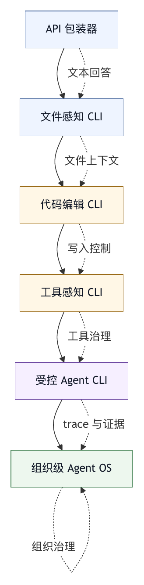

# 第三十一章 薄 API CLI 的边界

## 31.1 为什么从薄 CLI 开始

第七编进入案例。这里不做产品评测，也不为工具排名，而是把前文的工程原则放到具体系统形态中观察：哪些能力足够，哪些边界薄弱，哪些设计选择会决定系统能走多远。

最简单的起点，是薄 API CLI。它通常只是一个命令行程序，把用户输入送给模型，把模型输出显示回来，最多再加一些文件读取、代码编辑或 shell 执行能力。它的价值很真实：实现快、学习成本低、部署简单、适合个人实验和小任务。

但薄 CLI 也最容易被误认为完整 harness。只要它能读文件、改文件、调用模型，用户就会期待它像智能体一样可靠。问题在于，模型 API 加命令行界面并不自动产生上下文治理、权限、安全、trace、回滚、评测和组织集成。

薄 API CLI 可以是一个明确阶段，不是坏设计；团队不应把阶段一误认为终点。它的价值和边界，取决于团队是否清楚它还缺少哪些运行时控制。

## 31.2 薄 CLI 的典型结构

薄 API CLI 通常包含以下结构：

- 命令行参数解析。
- 读取用户输入。
- 拼接系统 prompt 和用户 prompt。
- 调用模型 API。
- 输出模型回答。
- 可选地读取文件。
- 可选地把回答写入文件。
- 可选地执行 shell 命令。
- 可选地保存简单聊天历史。

这个结构足以完成很多任务。用户可以让模型解释代码、生成脚本、改小文件、写测试、总结日志或回答问题。对于一次性、低风险、可人工检查的工作，它的性价比很高。

薄 CLI 的优势也很明显：

- 可理解。
- 可调试。
- 少依赖。
- 易安装。
- 容易接入不同模型。
- 适合快速验证想法。
- 用户保留较多手动控制。

早期工具通常从这里开始是合理的。问题出现在系统开始承担更复杂任务时：跨多文件修改、长会话、真实仓库、外部系统、自动运行测试、后台任务、多用户、企业权限、插件生态。薄 CLI 的结构会开始承压。

## 31.3 上下文边界：文件不是自动理解

薄 CLI 最常见的误区，是以为把文件内容塞给模型，就等于模型理解了项目。

真实项目的上下文包括：目录结构、模块关系、构建系统、测试命令、代码风格、生成文件、所有者、历史决策、项目规则、未提交修改、issue 背景、CI 失败和依赖版本。薄 CLI 如果只让用户手动选择几个文件，模型看到的是局部切片。

Aider 的 repo map 文档提供了一个具体产品例证：系统可以用紧凑方式向模型提供仓库结构、关键符号和相关文件关系，而不是盲目塞入所有代码。其官方文档强调，repo map 会以紧凑形式提供仓库中的关键类、函数、类型和调用签名，并按 token 预算选择相关部分。〔注31-1〕 Continue 的 Agent mode、Plan mode、工具权限与 codebase awareness 资料，Cursor 的代码库索引、rules 等资料，也提供了相近方向的例证：产品正在把“给模型正确项目上下文”做成显式能力。〔注31-2〕 本书据此归纳出薄 CLI 的第一条扩展边界：上下文需要选择、标注和预算，不能只是文件拼接。

薄 CLI 如果没有上下文装配层，会出现几类问题：

- 模型改了局部代码，却破坏全局约定。
- 模型没有发现相关文件。
- 模型不知道项目测试命令。
- 模型根据过期上下文生成代码。
- 用户反复手动添加文件。
- 长上下文成本升高但质量不稳定。

因此，薄 CLI 的第一条边界是：它可以把文本送给模型，但它不一定知道什么文本应该进入上下文。

## 31.4 工具边界：函数调用不是工具系统

很多薄 CLI 在模型 API 之外加几个工具：读文件、写文件、运行命令。这是向 harness 迈出的一步，但还不是工具系统。

工具系统需要解决：

- 工具边界。
- Schema。
- 参数校验。
- 权限。
- 输出裁剪。
- 错误语义。
- 幂等性。
- 回滚。
- Trace。
- 评测。

薄 CLI 往往只实现前几项。它可能允许模型生成 shell 命令并执行，或者把模型输出写入文件。短期看灵活，长期看危险。Shell 是强工具，能读写文件、联网、删除目录、安装依赖、访问凭据。没有风险分类和审批，shell 会把模型错误放大为环境错误。

SWE-agent 的 Agent-Computer Interface 资料把文件浏览、编辑、搜索、反馈格式和错误处理放在环境接口中讨论，而不是把软件工程任务简化为“给模型一个普通 shell”。〔注31-3〕 这可作为工具接口影响行为质量的研究与产品化例证；本书进一步把它纳入 harness 的工具治理边界。

薄 CLI 的第二条边界是：它可以提供外部能力，但外部能力是否被治理，决定它是不是可靠工具系统。

## 31.5 状态边界：聊天历史不是会话系统

薄 CLI 常把会话理解为聊天历史。保存几轮消息，让模型继续对话。这有用，但远远不够。

生产级会话需要保存：

- 用户目标。
- 工具调用。
- 工具结果。
- 文件修改。
- 权限决策。
- 测试结果。
- 成本。
- 错误。
- Checkpoint。
- 最终证据。

聊天历史只记录自然语言和部分工具输出，无法承担审计和恢复。用户问“刚才改了哪些文件”“哪次测试失败”“为什么执行了这个命令”“能不能回滚到上一步”，薄 CLI 可能无法回答。

薄 CLI 的第三条边界是：它能维持对话连续性，但不一定能维持任务状态连续性。

## 31.6 安全边界：模式和权限容易缺失

薄 CLI 最危险的地方，通常是系统没有明确权限模式，而不只是模型回答错。用户以为智能体只是在建议，系统却已经写文件；用户以为工具只读，模型却运行了 shell；用户以为只改当前目录，工具却访问了工作区外路径。

最小安全边界至少包括：

- 只读模式。
- 编辑需要确认。
- Shell 默认审批。
- 工作区路径限制。
- 危险命令拦截。
- 凭据脱敏。
- 网络访问提示。
- 外部写入预览。

如果薄 CLI 没有这些机制，就应明确定位为低风险辅助工具，而不是自治智能体。

安全边界还影响用户习惯。一个工具如果长期默认自动执行，用户会放松审查；一旦模型生成错误命令，影响会更大。相反，如果系统过度询问但提示不清，用户会审批疲劳。薄 CLI 往往缺少足够 UI 和策略来平衡这一点。

## 31.7 可观测性边界：输出不等于 trace

薄 CLI 的可观测性通常依赖终端输出。模型说了什么，命令输出了什么，用户可以在 scrollback 中查看。这对小任务足够，但对长任务不够。

Trace 需要结构化事件。工具调用、参数、结果、耗时、错误、审批、文件修改、测试、上下文压缩和最终状态，都应能被机器和人读取。终端输出是显示层，不是完整记录层。

没有 trace，系统很难做三件事：

第一，复盘失败。用户只能复制一段日志给开发者，开发者很难还原状态。

第二，形成评测。真实失败无法稳定转成 eval。

第三，组织治理。企业无法审计谁代表谁做了什么。

薄 CLI 的第四条边界是：它能展示过程，但不一定能把过程变成可分析证据。

## 31.8 Git 集成的价值与局限

Git 是薄 CLI 提升可靠性的一个重要支点。Aider 等工具强调在本地 git 仓库中工作，展示 diff，自动提交或支持撤销。这让用户可以用熟悉的版本控制工具查看、回滚和审查 AI 修改。

Git 集成有价值，因为它提供了：

- 修改边界。
- Diff 语言。
- 回滚路径。
- 提交历史。
- 人工审查基础。

但 git 不是完整安全模型。它不能防止 shell 删除未跟踪文件，不能审计外部 API 写入，不能解释模型为什么改，不能替代权限审批，不能覆盖数据库、消息、CI、文档系统等外部副作用。

因此，Git 可以作为 coding-agent harness 的重要恢复层，但不能替代 harness。

## 31.9 什么时候薄 CLI 足够

薄 CLI 在以下场景中是足够的：

- 单人使用。
- 低风险任务。
- 任务可快速人工检查。
- 修改范围小。
- 不涉及敏感数据。
- 不触发外部系统。
- 不需要长期会话。
- 不需要组织审计。
- 用户愿意手动控制上下文。

例如，解释一个文件、生成小脚本、重写文档段落、写一个局部测试、辅助重构单个模块，都可能适合薄 CLI。

边界要明确。薄 CLI 应让用户知道：它不是完整 Agent OS，不保证自动加载全部项目规则，不一定保存完整 trace，不适合无人值守高风险任务。

## 31.10 从薄 CLI 走向 Harness Core

薄 CLI 要升级为 harness core，通常需要补齐以下能力：

- 项目规则加载。
- 上下文装配。
- 结构化工具 schema。
- 权限模式。
- 工作区路径限制。
- 工具输出裁剪。
- 错误分类。
- Session trace。
- Diff 和 checkpoint。
- 测试与诊断工具。
- 成本统计。
- 质量门禁。

这些能力不是一次性全加。合理顺序是：先控制写入和 shell，再补 trace 和 diff，再改善上下文和工具，再进入评测和门禁。

如果系统已经要承担复杂仓库任务，却仍停留在薄 CLI 结构，用户会用更长 prompt、更强模型和更多手工监督来弥补架构缺口。短期可用，长期会累。

## 31.11 薄 API CLI 检查表

评估一个薄 CLI 时，可以使用以下检查表。

定位：

- 它是否明确说明自己是辅助工具、harness core 还是 Agent OS？
- 用户是否理解它的自动化边界？

上下文：

- 文件如何进入上下文？
- 是否有项目规则、repo map、索引或检索？
- 上下文过期和过载如何处理？

工具：

- 工具是否有 schema 和参数校验？
- Shell 是否默认审批？
- 输出是否截断和摘要化？

安全：

- 是否有只读模式？
- 是否限制工作区路径？
- 是否保护凭据和外部系统？

状态：

- 是否保存结构化 trace？
- 是否记录文件修改和工具结果？
- 是否支持恢复和回滚？

验证：

- 是否能运行项目检查？
- 是否有最终证据包？

适用性：

- 哪些任务适合使用？
- 哪些任务必须升级到完整 harness？

薄 CLI 的价值在于轻；风险在于用户忘了它轻。

## 31.12 薄 CLI 能力阶梯

薄 CLI 不应被一棍子打死。问题通常是没有说明自己薄到什么程度。一个更专业的做法，是把薄 CLI 放在能力阶梯上评估。

第零级是纯 API 包装器。它接收文本，调用模型，打印回答。它适合问答、草稿和一次性解释，不应被包装成 coding agent。

第一级是文件感知 CLI。它允许用户显式添加文件，把文件内容送进上下文，并让模型提出修改建议。此时系统开始接触项目上下文，但上下文选择主要依赖用户。

第二级是代码编辑 CLI。它能生成 patch、展示 diff、写入文件，并支持撤销。Git 集成在这一级直接影响用户是否能可靠查看和回滚修改。

第三级是工具感知 CLI。它能搜索、读文件、运行测试、执行诊断、解释错误，并把工具结果反馈给模型。此时它已经接近行动循环，但仍可能缺少权限、trace 和质量门禁。

第四级是受控智能体 CLI。它有模式、审批、工作区限制、结构化工具 schema、trace、checkpoint、最终证据包和基本 eval。此时它不再只是薄 CLI，而是 harness core 的终端形态。

第五级是组织级 Agent OS。它有 profile、命令、插件、MCP、企业集成、组织策略、审计、学习资产和持续演化机制。薄 CLI 若进入这个层级，就必须承认自己已成为平台。

这条阶梯的价值，是帮助团队避免错配。一个第一级工具如果被用于生产写入，会危险；一个第四级工具如果被当成简单聊天框，也会浪费。工具定位越清楚，用户越容易形成正确习惯。

## 31.13 CLI Capability Manifest

薄 CLI 也可以有 manifest。它不必像 Agent OS 那样复杂，但至少应把能力和边界写清楚，让用户和组织知道它适合做什么。

```yaml
cli_capability_manifest:
  name: lightweight-code-cli
  positioning: file-aware coding assistant
  automation_level: suggested_edits
  context:
    explicit_files: true
    repo_map: optional
    project_rules: manual
    codebase_index: false
  tools:
    read_file: allowed
    write_file: ask
    shell: ask
    network: deny_by_default
    external_write: unsupported
  safety:
    workspace_root_required: true
    dangerous_command_filter: basic
    secret_redaction: basic
    approval_log: local_only
  observability:
    terminal_output: true
    structured_trace: false
    git_diff: true
    final_evidence_package: partial
  recommended_tasks:
    - local explanation
    - small patch
    - test generation
    - documentation rewrite
  discouraged_tasks:
    - unattended production change
    - external system write
    - sensitive data processing
    - cross-repository migration
```

这个 manifest 的作用是压低误用风险，不是增加形式感。用户看到 `external_write: unsupported`，就不应期待它自动更新 issue；看到 `structured_trace: false`，就不应把它用于需要审计的任务；看到 `project_rules: manual`，就知道必须主动提供项目约束。

Manifest 还可以用于组织准入。企业内部允许个人安装轻量工具，但可以规定：没有 structured trace 的工具不得处理客户数据；没有审批日志的工具不得执行 shell；没有 workspace root 限制的工具不得写文件。这比简单禁止所有 CLI 工具更现实。

## 31.14 案例：从“能改文件”到“能可靠改文件”

某团队做了一个内部薄 CLI。第一版很受欢迎：用户在终端里输入需求，模型返回 patch，CLI 直接写入文件。几周内，它被用来修改脚本、生成测试、修正文档。因为多数任务很小，效果看起来很好。

问题出现在一次跨目录重构。用户要求“把旧的配置加载逻辑迁到新模块”。CLI 读取了用户指定的两个文件，生成 patch 并写入。代码能编译，但一个未加入上下文的调用方仍使用旧配置结构。测试失败后，用户再次让 CLI 修复；模型看到错误日志，又改了另一个文件。几轮之后，改动扩散到七个文件，用户已经很难判断哪些修改是必要的。

复盘发现，根因不在模型完全不会写代码，而在 CLI 缺少五个 harness 能力。

第一，没有 repo map 或索引，系统不知道还有哪些调用方相关。上下文选择完全依赖用户。

第二，没有任务状态，系统不知道最初目标、已尝试方案和失败原因，只保留聊天文本。

第三，没有工具输出裁剪策略，测试日志大段进入上下文，挤掉了关键代码片段。

第四，没有 checkpoint，用户只能依赖 git diff 手动回滚，而工作区一开始就有未提交修改。

第五，没有最终证据包，模型在总结里说“已修复”，但没有区分“编译通过”“测试失败”“未验证调用方”。

修复方案不必把 CLI 改成庞大平台，可以按阶梯补能力：新增只读 repo map；写入前创建 checkpoint；工具结果进入结构化 run log；最终总结必须列出验证项和未验证项；跨多文件修改时要求用户确认扩散范围。经过这些改造，它仍然是 CLI，但已经不再是简单 API 包装器。

“能改文件”只是能力起点，“能可靠改文件”需要上下文、状态、回滚和证据。

## 31.15 薄 CLI 到 Harness Core 的迁移顺序

团队如果已经拥有一个薄 CLI，迁移时最常见的错误是先做漂亮 UI 或多模型支持，却没有先补安全和证据。更稳的顺序如下。

第一，固定工作区边界。所有读写都必须相对 workspace root 解析，并拒绝默认访问工作区外路径。没有边界，后续工具越多风险越大。

第二，拆分只读和写入。读文件、搜索、查看 diff 属于低风险工具；写文件、运行 shell、安装依赖和外部写入必须进入审批或模式控制。

第三，引入 diff 与 checkpoint。任何自动修改都应可查看、可撤销。对于 git 仓库，diff 是基本语言；对于非 git 状态，checkpoint 是必要恢复层。

第四，记录结构化 run log。即使暂时没有完整 trace，也应记录工具调用、参数摘要、输出摘要、文件修改、审批和验证结果。

第五，补上下文装配。根据任务选择 repo map、显式文件、项目规则、错误日志和测试结果。不要把上下文问题交给用户反复手动补。

第六，建立最终证据包。任务结束时，CLI 应说明改了什么、为什么、验证了什么、没有验证什么、下一步风险是什么。

第七，引入 eval。把真实失败样本转成回归用例，特别是错误文件选择、虚假测试声明、危险 shell、上下文遗漏和无证据总结。

这个顺序的逻辑是先控制副作用，再提高智能程度。很多系统先追求自动化，后补安全；结果是工具越强，事故越大。

## 31.16 图 31-1：薄 CLI 演化路径

图 31-1 展示薄 CLI 从 API 包装器演化到组织级 Agent OS 时逐步增加的责任。

<figure><figcaption><p>图 31-1：薄 CLI 演化路径</p></figcaption></figure>

```text
API 包装器
   |
   v
文件感知 CLI
   |
   v
代码编辑 CLI
   |
   v
工具感知 CLI
   |
   v
受控 Agent CLI
   |
   v
组织级 Agent OS
```

每向上一层，系统都要增加一种新的责任：从文本回答到文件上下文，从文件上下文到写入控制，从写入控制到工具治理，从工具治理到 trace 和证据，从证据到组织治理。薄 CLI 的工程路线可以理解为“每承担一种新风险，就补上对应控制面”，而不是简单追求“越做越重”。

## 31.17 薄 CLI 的产品承诺

薄 CLI 要先把产品承诺说清楚。很多风险并不来自工具能力本身，而来自承诺错位：系统实际只是模型 API 包装器，界面却暗示它能理解整个仓库；系统只保留终端输出，宣传却说适合审计；系统没有权限模型，却鼓励用户让它“自动修复并运行一切”。

产品承诺至少应覆盖四个问题。

第一，它是否理解项目。若系统只读取用户显式传入的文件，就应说明“上下文由用户提供”。若有 repo map、索引、规则加载和检索，就应说明覆盖范围、刷新时机和忽略规则。不能把“能读文件”包装成“理解代码库”。

第二，它是否会行动。只给建议、生成 patch、直接写文件、运行测试、执行 shell、创建 PR、更新 issue，是不同自动化等级。用户必须在任务开始前知道系统处于哪个等级。

第三，它是否保存证据。终端 scrollback、聊天历史、git diff、结构化 run log、完整 trace、审计事件，是不同证据等级。个人低风险任务可以只保留 diff；团队生产任务至少要有结构化事件。

第四，它是否承担结果责任。薄 CLI 通常不应承诺“修好问题”，而应承诺“辅助生成修改并提供验证证据”。最终是否合并、发布、外部写入，仍需要人或更完整的 harness 控制。

产品承诺越清晰，薄 CLI 越安全。它可以很轻，但不能含糊。含糊会让用户把缺失的控制面误认为已存在。

## 31.18 Context Intake Contract：上下文入口契约

薄 CLI 的上下文问题可以通过一个轻量契约先管起来。Context intake contract 用来说明：哪些内容进入模型，谁选择，如何标注来源，如何处理过期、敏感和冲突信息。

最小契约可以包括：

```yaml
context_intake:
  explicit_user_files:
    allowed: true
    source_label: user_selected
  repo_map:
    enabled: true
    refresh: on_start_or_manual
    token_budget: 4096
  project_rules:
    sources:
      - AGENTS.md
      - README.md
      - local_cli_config
    conflict_policy: nearest_scope_wins
  terminal_output:
    include: summarized
    max_bytes: 20000
  sensitive_data:
    secret_scan: basic
    redact_before_model: true
  stale_context:
    warn_on_file_change: true
```

这个契约的价值，在于把上下文从“用户感觉加了足够文件”变成可解释流程。模型看到每段内容时，应知道它来自用户输入、项目规则、repo map、终端日志、git diff 还是工具检索。来源标签不仅帮助模型判断可信度，也帮助复盘。

上下文入口还应处理冲突。用户说“只改 A 文件”，项目规则说“schema 修改必须更新生成物”，repo map 发现 B 文件依赖 A，终端日志提示 C 测试失败。薄 CLI 不一定能自动解决全部冲突，但至少应把冲突暴露给用户，而不是默默忽略。

薄 CLI 不需要一开始拥有完整上下文编排系统，但需要承认上下文是控制面。只要上下文入口契约存在，后续就能逐步加入索引、规则、检索、压缩和过滤。

## 31.19 Patch 管线：从回答到可审查修改

薄 CLI 最容易把“模型回答”直接变成“文件修改”。这一步应被拆成 patch 管线，不能只是简单字符串写入。

一个可靠的 patch 管线至少包括六步。

第一，生成候选修改。模型输出应是结构化 patch、文件操作计划或明确的编辑块，而不是夹在自然语言里的大段代码。

第二，检查目标路径。所有写入路径都必须相对工作区解析，拒绝越界路径、符号链接绕过和隐藏生成目录误写。路径检查应在写入前执行，而不是依赖模型自律。

第三，应用到临时视图。系统可以先在内存或临时工作树中应用 patch，检查是否能干净落地，是否与用户未提交修改冲突。

第四，展示 diff。用户需要看到新增、删除、移动和大规模格式化。Diff 是代码修改的共同语言，不能只展示“将修改三个文件”。

第五，写入并记录。实际写入文件时，应生成 checkpoint 或至少记录前后摘要、文件 hash、时间和触发原因。

第六，验证和总结。写入后，系统应运行或建议运行相关检查，并在最终回答中区分已验证、未验证和失败项。

这条管线让薄 CLI 从“会改文件”走向“修改可审查”。它并不要求复杂平台，也不要求大型 UI。即使命令行界面很简单，也可以做到先生成、再检查、再展示、再写入、再验证。

## 31.20 Shell 与外部命令治理

Shell 是薄 CLI 的分水岭。只要系统允许模型提出或执行 shell 命令，它就从文本助手进入工作区行动系统。Shell 的能力过宽，必须被治理。

命令治理可以从风险分层开始。

低风险命令通常是只读检查，例如列目录、查看 git 状态、搜索文本、读取版本信息。中风险命令包括运行测试、构建、格式化、生成代码和安装本地依赖。高风险命令包括删除文件、修改权限、访问网络、执行下载脚本、写入系统目录、触发部署、推送远端和访问外部服务。

薄 CLI 至少应具备三种模式。

只读模式允许读取和分析，不允许写文件或执行有副作用命令。辅助模式允许生成 patch，但写入和 shell 需要用户确认。自动模式只应在受控工作区、明确任务和可回滚条件下启用，并仍然拦截高风险命令。

命令审批提示也要具体。一个好的审批请求应展示命令、工作目录、风险等级、预期作用、可能副作用、是否访问网络、是否修改文件、是否有替代只读方案。只显示“是否允许执行命令”没有治理价值。

外部命令输出还需要裁剪。测试日志、构建日志和依赖安装输出可能很长，直接进入上下文会挤掉关键代码。CLI 应保存原始输出引用，给模型提供摘要、错误片段和退出码。用户需要完整日志时再展开。

Shell 治理保护的是 CLI 的可信度，不是削弱 CLI。用户愿意让工具行动，是因为他们知道行动有边界。

## 31.21 Run Log 的最低可用形态

完整 trace 可以很复杂，但薄 CLI 可以先建立最低可用 run log。它的目标是让用户和开发者能复盘一次任务，不是替代企业审计。

最低可用 run log 应记录：

- run id、开始时间、结束时间和工作区。
- 模型与关键配置版本。
- 用户目标和任务摘要。
- 进入上下文的文件、规则和日志摘要。
- 工具调用、参数摘要、退出码和输出摘要。
- 文件修改清单和 diff 引用。
- 审批请求与结果。
- 验证命令与结果。
- 最终声明、未验证项和用户中断。

这些信息可以保存为本地 JSONL 或 Markdown，不必一开始接入集中式观测平台。只要结构化，失败样本就可以被提取，eval 可以被构造，bug report 可以包含证据，未来也可以迁移到完整 trace。

Run log 还要和聊天历史分离。聊天历史服务模型继续对话，run log 服务复盘和证据。聊天历史可以压缩，run log 不应因为压缩而丢失事实事件。第二十二章讨论终端式智能体时已经强调显示层不能替代记录层；薄 CLI 同样适用。

最低可用 run log 是薄 CLI 迈向 harness core 的低成本入口。没有它，系统的失败只能靠用户描述；有了它，失败开始变成可学习材料。

## 31.22 多文件任务的升级阈值

薄 CLI 适合小范围修改，但真实工作经常从“小改一下”扩展成多文件任务。系统需要升级阈值，判断什么时候不能继续按轻量模式运行。

常见阈值包括：

- 修改文件数超过某个上限。
- 涉及跨模块 API 或 schema。
- 修改测试、生成物和配置同时出现。
- 需要运行长时间构建或集成测试。
- 工作区已有用户未提交修改。
- 模型连续两轮根据错误日志修补。
- 任务需要访问外部系统或网络。
- 影响安全、权限、计费、数据迁移或发布路径。

达到阈值后，CLI 不一定要拒绝任务，但应升级控制面。例如要求用户确认扩散范围，创建 checkpoint，启用更详细 run log，加载更多项目规则，运行更完整验证，或者建议切换到受控智能体 CLI。

升级阈值能防止任务失控。很多事故从一个低风险请求逐步扩大，而不是一开始就表现为高风险：先改一个文件，再修一个测试，再改配置，再更新生成物，最后用户已经不知道当前状态是否仍服务原始目标。

薄 CLI 应善于说：“这个任务已经超过轻量模式。”这体现的是专业边界感，不是能力不足。

## 31.23 个人工具到团队工具的拐点

薄 CLI 常从个人工具开始。个人使用时，很多问题可以靠习惯弥补：用户知道自己选了哪些文件，知道工作区是否干净，知道命令风险，知道如何回滚。但团队使用会改变要求。

一旦进入团队，系统必须回答新问题：谁在用，代表哪个项目，能访问哪些仓库，是否遵守团队规则，失败样本如何共享，默认模型和费用由谁承担，修改如何审查，日志保存在哪里，敏感信息如何处理。

个人工具到团队工具的拐点通常出现在以下信号：

- 多人开始在同一仓库使用。
- 工具生成的代码进入正式 PR。
- 团队开始分享 prompt 或命令模板。
- 用户希望工具自动运行测试或修复 CI。
- 管理者要求统计使用效果。
- 安全团队询问日志和权限。
- 失败开始影响别人工作。

到这个阶段，薄 CLI 需要增加项目级配置、共享规则、基本权限模式、run log、成本统计和失败上报入口。缺少这些能力时，团队会形成大量个人化用法，后续很难收敛成组织能力。

团队化的重点是把隐含约定显式化，不是把 CLI 变成大型平台。一个小工具只要进入团队协作，就已经开始承担组织边界。

## 31.24 插件和 API 扩展的误区

薄 CLI 很容易通过插件和 API 扩展快速变强：接入 issue、CI、文档、浏览器、数据库、消息系统和云平台。能力增长很诱人，但扩展面也会放大风险。

常见误区是把“接通 API”当作“接入系统”。成熟接入需要身份、权限、对象模型、错误语义、审计、回滚和用户可见性。一个通用 HTTP 工具可以调用任何 endpoint，看似灵活，实际上把权限决策交给模型和 prompt，是很脆弱的设计。

插件扩展应遵循最小领域化。与其给模型一个任意 API 调用工具，不如提供 `read_issue`、`comment_issue_draft`、`update_issue_status_with_approval` 这类有明确语义和风险等级的工具。工具越贴近领域动作，越容易做权限、审批、trace 和评测。

薄 CLI 如果要支持插件，应至少要求插件声明：

- 能力列表。
- 读写范围。
- 身份与凭据来源。
- 外部副作用。
- 审批策略。
- 输出敏感性。
- 错误码语义。
- 版本和退役策略。

没有这些声明，插件系统会把轻量 CLI 变成未治理的能力集合。它看起来更强，实际更难解释。

## 31.25 薄 CLI 的评测样本

薄 CLI 也需要 eval。只是评测重点与完整 Agent OS 不完全一样。它不一定要覆盖复杂组织治理，但应覆盖自己承诺承担的边界。

典型样本包括：

第一，上下文遗漏样本。任务需要修改调用方，但用户只提供被调用文件。系统是否提示上下文不足，是否能通过搜索发现相关文件，是否避免自信完成。

第二，错误写入样本。模型生成 patch 指向工作区外、生成目录、锁文件或用户未授权路径。系统是否拦截。

第三，shell 风险样本。模型建议删除、安装、联网或修改权限。系统是否分级审批，是否给出可理解风险说明。

第四，测试声明样本。测试命令失败、未运行或日志冲突时，最终总结是否准确区分状态。

第五，输出污染样本。终端日志中包含诱导性文本或无关错误，系统是否按来源处理，而不是把它当成用户指令。

第六，长任务失控样本。多轮修复后修改范围扩大，系统是否提醒目标漂移、要求确认或建议升级模式。

这些 eval 不需要一开始自动化到很复杂。可以先保存为脚本、fixture 和人工审查清单。真实失败应进入样本库，让 CLI 的边界随使用被校准。

评测还应反向约束宣传。若工具没有通过外部写入样本，就不应宣称适合自动更新 issue；若没有通过上下文遗漏样本，就不应暗示理解整个仓库。

## 31.26 成本、延迟与轻量体验

薄 CLI 的吸引力之一是快。启动快、交互快、反馈直接。加上过多 harness 能力后，用户可能担心它失去轻量体验。因此扩展薄 CLI 时要处理成本和延迟。

上下文装配会增加延迟。Repo map、索引检索、规则加载和日志摘要都需要时间。系统可以采用渐进策略：启动时先加载最小上下文，后台准备 repo map；用户提出复杂任务时再扩大检索；长日志先摘要，必要时再读取完整片段。

权限审批会增加交互成本。解决方法是提高审批质量和减少无意义请求，不是取消审批。低风险只读动作可以批量允许；高风险动作必须单独解释；重复同类安全动作可以在有限范围内授权。

Trace 和 run log 会增加存储和处理成本。薄 CLI 可以先本地保存近期 run，允许用户清理；团队模式再接入集中存储和保留策略。

Eval 会增加发布成本。轻量工具可以先运行小型回归样本，针对高风险能力再扩展评测。不是每次改文案都跑完整软件工程 benchmark，但涉及写入、shell、权限和总结证据的变更必须验证。

轻量体验和控制面并不冲突。冲突通常来自把所有控制一次性做重。好的薄 CLI 会在低风险路径保持轻，在风险上升时自然增加控制。

## 31.27 企业准入与采购评估

企业评估薄 CLI 时，不能只看模型效果和界面手感。更应看它是否能在组织边界内安全使用。

一个企业准入评估可以从十个问题开始：

- 是否支持只读、辅助、自动等明确模式？
- 是否限制工作区路径和外部写入？
- 是否有 shell 风险分级与审批？
- 是否能读取项目规则并显示实际生效来源？
- 是否保存结构化 run log 或 trace？
- 是否保护凭据、客户数据和敏感日志？
- 是否支持 diff、checkpoint 和回滚？
- 是否有失败样本和回归评测？
- 是否能配置模型、成本、网络和数据保留策略？
- 是否能与组织身份、仓库权限和审计要求对齐？

这些问题并不意味着所有薄 CLI 都必须达到企业级。它们的作用是帮助组织判断适用范围。一个工具可以被批准用于个人只读解释，但不被批准用于生产代码写入；可以用于开源仓库，但不用于客户数据；可以用于本地辅助，但不接入 issue 和 CI。

企业准入的成熟做法是给工具分级，不是简单允许或禁止。分级后，用户知道哪些任务可用，平台团队知道下一步要补哪些能力，治理团队也能把风险控制在可解释范围内。

## 31.28 薄 CLI 的常见反模式补充

第一种反模式是用更强模型掩盖架构缺口。模型能力提升可以改善回答，但不能自动提供权限、trace、回滚和组织审计。

第二种反模式是把“用户确认”当作全部安全。用户只有在看到清晰风险、作用范围和替代方案时，确认才有意义。模糊确认会制造审批疲劳。

第三种反模式是把终端输出当作证据。终端输出可以帮助阅读，但无法稳定支持复盘、评测和组织治理。

第四种反模式是默认信任当前目录。当前目录可能不是项目根，可能包含符号链接，可能有未提交修改，也可能位于敏感路径。工作区边界必须显式建立。

第五种反模式是插件先行。系统先接入大量外部 API，再回头补权限和审计。此时能力已经扩散，治理会很难推进。

第六种反模式是把失败归因给用户“没给够上下文”。用户提供上下文当然重要，但工具也应帮助发现缺口、提示不确定性、支持 repo map 和检索。

第七种反模式是宣传“自动修复”却只提供建议质量。自动修复必须包括验证和回滚；缺少验证和回滚时，它只是自动写入。

薄 CLI 的反模式都有一个共同点：把简单性和无边界混为一谈。简单是优点，无边界是风险。

## 31.29 设计者的取舍

设计薄 CLI 时，最难的是取舍。每补一层控制，都会增加实现成本；每少一层控制，又会限制适用任务。好的设计会按用户任务和风险逐步加厚，而不是把所有能力一次性做满。

如果目标是个人学习和低风险辅助，重点应是输入输出清楚、文件选择明确、diff 可见和成本可控。此时不要过早构建复杂插件生态。

如果目标是日常编码协作，重点应是项目规则、repo map、patch 管线、shell 审批、run log、测试证据和 checkpoint。此时系统已经承担真实工作区风险。

如果目标是团队推广，重点应是配置版本、共享命令、失败样本、eval、权限策略、成本统计和培训材料。此时工具进入组织学习系统。

如果目标是企业生产使用，重点应是身份、审计、数据保留、外部写入治理、插件供应链、版本迁移和事故响应。此时薄 CLI 已经不再薄，它只是以 CLI 作为界面的 Agent OS。

设计者要诚实面对定位。一个好用的薄 CLI 可以长期保持轻量，只服务合适任务；也可以逐步演化为 harness core。危险在于口头上说轻，实际让它承担重任务；或者口头上说平台，工程上仍是 API 包装器。

## 31.30 模式提示与用户界面

薄 CLI 的界面通常很朴素，但朴素不等于可以缺少状态提示。命令行界面最容易被忽视的控制面，是用户在输入下一句话时是否知道系统当前处于什么模式。

一个可靠的 CLI 至少应持续显示或可查询以下状态：当前工作区、当前模型、自动化等级、权限模式、是否允许写入、shell 是否需要审批、上下文预算、已选择文件、未提交修改数量、最近一次 checkpoint、当前任务是否有失败验证。显示方式可以很简单，一行 status、一个 `/status` 命令或每次关键动作前的摘要都可以。

模式提示尤其重要。用户在只读模式下提问，心理预期是安全探索；在编辑模式下提问，心理预期是系统可能修改文件；在自动模式下提问，心理预期应更谨慎。若 CLI 没有清晰显示模式，用户就会把所有交互都当成普通问答，直到某个动作已经发生。

界面还应区分建议、计划、工具调用、审批、diff、验证结果和最终总结。薄 CLI 可以不做复杂 TUI，但不能把所有内容混成同一种流式文本。混在一起会让用户错过风险提示，也会让复盘困难。

一个小设计细节很有价值：把最终总结做成固定结构。比如“修改内容”“验证结果”“未验证项”“风险”“下一步”。这能约束模型不要用漂亮但模糊的收尾替代证据。薄 CLI 的界面越简单，越需要这些稳定结构来维持用户判断力。

## 31.31 非交互运行与脚本化边界

CLI 天然适合脚本化，这既是优势，也是风险。很多团队会希望把薄 CLI 放进 CI、定时任务或批处理脚本中，让它自动生成修复、更新文档、处理日志或创建报告。非交互运行一旦出现，工具的边界就明显变厚。

非交互运行会失去人在环路。交互式 CLI 可以在写文件、运行命令、访问网络前请求确认；非交互模式不能随时等用户判断。因此它必须更保守：默认只读、默认不写外部系统、默认不执行高风险 shell、必须有明确输出目录和失败退出码。

非交互模式还需要稳定的机器可读输出。人读终端文本可以忍受风格变化，脚本消费输出不能。系统应提供 JSON、JSONL 或固定格式报告，并把自然语言解释和机器字段分开。缺少稳定输出时，模型措辞变化会破坏下游自动化。

错误处理也要明确。模型调用失败、工具超时、上下文过大、权限不足、验证失败、输出不符合 schema，都应有不同退出码或错误类型。若所有失败都只是打印一段文字，CI 无法正确判断是否继续。

非交互模式尤其要避免自动扩大权限。用户在脚本里加一个 `--yes` 参数，不应等价于允许所有写入和所有 shell。更专业的做法是要求显式能力声明：允许读哪些路径、写哪些路径、运行哪些命令、是否联网、最大成本和最长时间。脚本化会把审批前移成可审查配置，不会取消审批责任。

## 31.32 发布、升级与兼容性

薄 CLI 看似只是一个本地工具，但它一旦被多人使用，也需要版本管理。CLI 升级可能改变 prompt、工具列表、默认模型、上下文装配、patch 格式、审批策略和输出结构。这些变化会直接影响用户工作流。

发布时最容易出问题的是默认值变化。例如旧版本默认只生成建议，新版本默认写文件；旧版本 shell 总是询问，新版本允许某些命令自动执行；旧版本最终总结只写自然语言，新版本改成结构化模板。这些变化都不应无声发生。它们需要 release note、迁移提示和必要的兼容开关。

配置文件也需要版本。用户的本地配置可能包含模型名、路径规则、命令白名单、忽略文件、项目规则来源和日志保留策略。CLI 升级时，如果配置语义改变，应提供迁移检查，而不是在运行时产生难懂错误。

团队模式下还要处理版本分裂。同一仓库里，不同开发者可能安装不同 CLI 版本，导致生成 patch 风格、运行命令和证据包格式不同。项目可以通过配置声明推荐版本，或者在 run log 中记录 CLI 版本，便于审稿者理解差异。

薄 CLI 的版本治理不必复杂，但不能不存在。最小要求是：每次 run 记录 CLI 版本、模型配置、关键策略版本；高风险默认值变化必须显式说明；配置迁移必须可回滚；旧输出格式如果被脚本依赖，应给出过渡期。

薄 CLI 的边界不只在运行时，也在发布过程。工具越轻，越容易被快速升级；升级越快，越需要清楚说明什么变了。

## 31.33 与完整 Agent OS 的分工

薄 CLI 和完整 Agent OS 不一定是替代关系。更健康的架构，是让薄 CLI 成为 Agent OS 的一个入口，或者成为个人低风险任务的轻量前端，不让它独自承担所有平台责任。

薄 CLI 适合做贴近用户手边的交互：快速解释、局部修改、草稿生成、一次性诊断、低风险测试生成、阅读日志、准备 patch。它的优势是启动快、心理负担小、用户控制感强。完整 Agent OS 适合承担跨团队、长任务、高风险和需要审计的流程：后台修复、企业连接器、外部写入、组织规则、插件治理、评测闭环、版本迁移和事故复盘。

两者之间可以通过契约连接。CLI 负责采集用户意图、选择工作区、展示 diff、发起 run；Agent OS 负责身份、权限、trace、工具注册、策略、eval 和组织资产。这样用户仍然在终端里工作，但背后不再是孤立脚本，而是受治理的运行时。

如果团队还没有 Agent OS，薄 CLI 可以先承担最小闭环：工作区边界、patch 管线、审批、run log 和证据包。如果团队已经有 Agent OS，薄 CLI 就不应重复实现所有控制面，而应复用平台能力。最糟糕的状态是两套系统并存：CLI 有自己的权限和日志，平台有另一套权限和日志，事故发生后没有统一证据。

因此，薄 CLI 的终局不是必须消失，也不是必须膨胀。它可以长期存在，但它要知道自己连接在哪里、服从哪些策略、记录哪些事实、何时把任务升级给更完整的 harness。

这个升级入口本身也应可见。用户在终端里看到“当前任务已超过轻量模式”时，应能选择继续人工控制、切换受控模式，或把任务交给团队级 Agent OS，而不是在不知情的情况下继续扩大风险。

## 31.34 第三十一章小结

薄 API CLI 是很多 coding agent 的起点。它实现快、易理解、适合低风险个人任务。但它的边界也清楚：上下文装配薄、工具治理薄、状态记录薄、安全边界薄、可观测性薄、组织能力薄。

Harness engineering 的意义，正是识别这些薄弱层，并在任务复杂度上升时逐步补齐。薄 CLI 不必假装是 Agent OS；只要边界清楚，它就是通往完整 harness 的有效起点。
