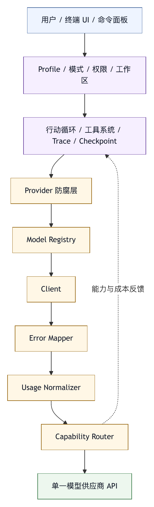

# 第三十二章 单供应商 Coding-Agent Harness

## 32.1 为什么选择单供应商

很多智能体平台追求多模型、多供应商、统一抽象。这在平台战略上有吸引力，但并不总是最好的工程起点。对于一个 coding-agent harness，有时选择单供应商反而更稳。

单供应商 harness 的目标，是把某个模型供应商的契约做深，而不是少做能力。它可以精确处理该供应商的模型列表、上下文窗口、工具调用格式、推理内容、错误码、计费方式、多模态能力、区域要求和安全建议。它不需要把所有模型都压进一个过于抽象的通用接口。

匿名工程案例 提供了一个单供应商 coding-agent harness 的案例。这个案例有一个明确选择：只支持某单一模型供应商的模型服务，不做通用 provider abstraction。这个选择让系统能把某单一模型供应商的模型契约、额度计划、长上下文、`reasoning_content`、原生 web search、多模态路由和错误处理作为一等公民。

单供应商不是低级阶段。它可以是有意识的架构策略。

## 32.2 单供应商的核心优势

单供应商 harness 有几个优势。

第一，模型契约更准确。系统可以维护精确的模型 allowlist、上下文窗口、输出预算、工具能力、多模态能力和默认参数，而不是用最低共同分母描述所有模型。

第二，错误语义更清晰。供应商特定错误码可以被转化为用户可行动建议，例如认证类型错误、区域错误、额度错误、模型不支持某能力。

第三，请求构造更可靠。不同供应商对消息、工具、流式输出、推理内容、图片、音频和搜索插件的格式可能不同。单供应商系统可以避免抽象泄漏。

第四，成本治理更具体。付费 API、额度计划、区域价格、插件计费和模型倍率都可以进入预算和 UI。

第五，能力路由更明确。系统知道哪个模型能处理媒体，哪个模型是文本模型，什么时候需要预处理。

这些优势的代价，是迁移成本和供应商锁定。单供应商 harness 必须承认这一点。它是深度适配平台，不是通用平台。

## 32.3 模型契约作为根

在单供应商 harness 中，模型契约是根。它决定后续一切：上下文预算、工具调用、媒体输入、推理内容、成本、错误处理和 UI 状态。

匿名工程案例的模型层维护某单一模型供应商的文本模型 allowlist、上下文和输出限制、额度计划 credit multiplier、超参数校验和长上下文后缀处理。这样的设计把“模型能做什么”从 prompt 里移到代码和配置里。

这很关键。很多系统把模型能力写在工具描述或文档中，运行时却没有硬校验。结果是用户选择了不支持媒体的模型，系统仍把图片发进去；模型不支持某参数，API 报错；工具调用需要保留推理内容，系统却丢失了供应商要求的字段。

模型契约应回答：

- 哪些模型可用？
- 每个模型支持哪些输入模态？
- 是否支持工具调用？
- 是否支持长上下文？
- 输出预算如何设置？
- 推理参数如何映射？
- 计费如何估算？
- 错误如何解释？

单供应商 harness 能把这些问题做得很细。

## 32.4 配置解析与凭据边界

供应商适配的第二个关键点是配置解析。用户可能通过环境变量、配置文件、命令行 flag、工作区设置和组织策略提供配置。系统需要明确优先级，并拒绝明显错误组合。

匿名工程案例区分付费 API key 和额度计划 key，解析不同 base URL 和区域设置，并拒绝 credential class 与 mode 的不匹配。这类校验看似细节，其实是安全和可用性的基础。

凭据边界尤其重要。模型 API key 不应进入模型上下文，也不应被工具输出泄露。配置解析层应负责读取和验证凭据，client 层负责使用凭据，trace 层负责脱敏。

单供应商 harness 的好处，是可以把供应商特定凭据规则做成强约束。通用 harness 若把凭据都抽象成 `api_key`，很容易丢失这些差异。

## 32.5 行动循环与工具系统

单供应商不意味着薄工具。一个 coding-agent harness 的核心仍然是行动循环和工具系统。

匿名工程案例的运行流包括：配置解析、记忆和技能加载、会话和 hook 加载、媒体输入构造、模型调用、行动循环、工具注册、多智能体调度、MCP runtime、文件系统和 shell、session store、checkpoint 和成本 telemetry。

这个结构说明：供应商适配只是底座，harness 的复杂度仍然在工具、权限、状态和观测中。

工具系统应包括：

- 文件读取、搜索、编辑和 patch。
- Shell 执行。
- Git status、diff、log、commit。
- Diagnostics。
- URL fetch。
- MCP 工具。
- Multi-agent dispatch。

每个工具都应接入权限、路径限制、输出截断、错误语义和 trace。单供应商 harness 如果只做模型 API 适配，没有工具治理，就仍然停留在薄 CLI。

## 32.6 权限模式与安全策略

Coding agent 的供应商选择不决定安全性。安全性来自 harness。

匿名工程案例设计了 Plan、Agent、Accept-edits 和 YOLO 等模式，并在模式之上增加细粒度工具权限。Plan mode 阻止 mutating tools；Agent mode 要求确认；Accept-edits 自动允许文件编辑但对 shell 保持谨慎；YOLO 自动批准多数变更但仍拦截危险 shell 模式。

细粒度策略还可以按 exact tool、risk class 和全局 `*` 解析。路径限制、危险命令检测、凭据脱敏、工具输出上限和默认网络审批共同构成安全边界。

权限不是模型供应商功能。即使模型很强，harness 仍要决定哪些动作允许执行。单供应商 harness 不能因为供应商可信，就放弃本地安全模型。

## 32.7 工作区、Git 与 Checkpoint

Coding agent 的工作对象是工作区。匿名工程案例把路径解析限制在 selected workspace 内，默认忽略 `node_modules`、`.git`、`dist` 和 session 数据等目录，并提供文件读写、grep、patch 和 git 工具。

Git 工具是 coding-agent harness 的核心证据面。`git_status`、`git_diff`、`git_log` 和 approval-gated `git_commit` 让智能体能说明当前状态，也让用户能审查实际变化。

Checkpoint 则是 git 之外的恢复层。并非所有工作区都有干净 git 状态，也并非所有生成物都适合提交。自动 checkpoint 可以在 agent run 前保存状态，失败后恢复。

这类工作区能力与供应商无关，但在单供应商 harness 中同样必须一等公民。缺少这些能力时，系统只会成为“能调用某单一模型供应商的聊天程序”，难以成为 coding-agent harness。

## 32.8 多模态路由是供应商深适配

单供应商 harness 的一个典型优势，是能做能力路由。匿名工程案例中，媒体输入构造和某单一模型供应商的 capability router 会检查模型是否支持媒体。如果用户选择文本主模型但请求包含图片、音频或视频，系统先调用多模态模型生成事实摘要，再把用户回合改写为文本，让文本主模型继续。

这不是简单格式转换。它体现了几个原则：

- 模型能力边界必须由系统检查。
- 原始媒体不应送给不支持的模型。
- 预处理摘要应标注来源。
- 预处理结果应进入 trace。
- 多模态成本和延迟应可见。

通用 harness 也可以做类似路由，但单供应商 harness 更容易根据具体模型能力做精确判断。

## 32.9 MCP 与多智能体的扩展边界

单供应商并不等于封闭系统。匿名工程案例支持 MCP server 配置、stdio transport、工具映射、运行时 loading 和 MCP-specific permission gates。它还提供 multi-agent scheduler，支持 DAG、并发、retry、timeout、trace metadata 和 usage aggregation。

供应商边界和生态边界可以分离。模型供应商可以单一，工具生态可以开放。关键是开放工具仍受 harness 权限和 trace 控制。

多智能体也是如此。子智能体仍使用同一供应商模型，但可以通过 profile、任务、工具集和权限形成不同角色。单供应商 harness 也能实现复杂 Agent OS 能力。

## 32.10 终端 UI 与产品化

单供应商 harness 要成为产品，需要 UI。匿名工程案例从 classic chat 发展到 full-screen Ink TUI，提供 header、timeline、inspector、command palette、approval prompt、composer 和 statusline。这个变化说明，产品化的关键在于建立更清晰的控制面，继续堆工具并不能自然带来产品能力。

对于 coding agent，UI 至少要展示：

- 当前模型。
- 当前模式。
- 工作区。
- 工具进度。
- 审批请求。
- 文件修改。
- 成本。
- 失败。
- 最终证据。

如果用户看不见系统状态，就无法建立信任。单供应商 harness 即使 API 适配再好，也需要人机协作界面承载安全和可观测性。

## 32.11 单供应商的风险

单供应商 harness 也有风险。

第一，供应商锁定。迁移到其他模型成本高。

第二，能力单点。供应商模型能力、价格、区域、服务稳定性变化会直接影响系统。

第三，抽象不足。若未来需要多模型，过深适配可能变成迁移障碍。

第四，生态限制。用户可能希望使用其他模型或本地模型。

第五，评测偏差。系统只围绕某供应商优化，可能难以判断通用能力。

这些风险可以管理。做法包括：把供应商特定逻辑集中在模型契约和 client 层；保持工具系统、权限系统、trace、eval 和 UI 相对独立；在文档中明确不支持多供应商；为未来迁移保留边界，但不提前抽象过度。

## 32.12 单供应商 Harness 检查表

评估单供应商 coding-agent harness 时，可以使用以下检查表。

模型契约：

- 是否有明确模型 allowlist？
- 是否记录上下文、输出、工具、多模态和成本能力？

请求构造：

- 是否正确处理供应商特定字段？
- 是否保留必要推理内容？
- 是否验证不支持的参数和模态？

凭据：

- 是否区分凭据类型？
- 是否脱敏 trace 和工具输出？

工具：

- 是否有结构化工具系统？
- 是否有权限、输出裁剪和错误语义？

工作区：

- 是否限制路径？
- 是否支持 diff、git、diagnostics 和 checkpoint？

安全：

- 是否有模式、风险分类和审批？
- 是否默认保护 shell、网络和外部副作用？

扩展：

- 是否支持 MCP、profile、命令或多智能体？
- 扩展能力是否受同一治理体系控制？

产品化：

- UI 是否展示模型、模式、成本、工具、审批和证据？
- Session 是否可恢复和审计？

单供应商不是问题，隐藏供应商差异才是问题。

## 32.13 Provider Contract Manifest

单供应商 harness 的关键资产，是 provider contract manifest。它把供应商差异显式化，避免这些差异散落在调用代码、错误处理、UI 文案和文档中。

```yaml
provider_contract_manifest:
  provider: provider-a
  supported_modes:
    - paid_api
    - quota_plan
  endpoints:
    chat_completions:
      protocol: openai-compatible
      streaming: true
      retry_policy: exponential_backoff
  credential_classes:
    paid_api_key:
      allowed_modes: [paid_api]
      redaction: full
    quota_plan_key:
      allowed_modes: [quota_plan]
      redaction: full
  models:
    - id: provider-a-text-large
      input_modalities: [text]
      tool_calling: true
      long_context: true
      reasoning_content: true
      max_context_tokens: provider_defined
      max_output_tokens: provider_defined
    - id: provider-a-vision
      input_modalities: [text, image]
      tool_calling: false
      preflight_only: true
  request_rules:
    preserve_reasoning_content_when_required: true
    validate_unsupported_parameters: true
    append_long_context_suffix: model_specific
  billing:
    credit_multiplier: model_specific
    estimate_before_call: true
    emit_usage_telemetry: true
  error_mapping:
    credential_mode_mismatch: actionable
    unsupported_model: actionable
    region_or_base_url_error: actionable
    quota_error: actionable
```

Manifest 的目的，是把供应商契约变成可审查对象，不是把供应商写死。团队可以清楚看到：哪些模型支持工具，哪些模型只用于多模态预处理，哪些凭据只能用于某种模式，哪些字段必须保留，哪些错误要转成用户可行动建议。

如果没有 manifest，供应商逻辑会被自然地复制到各处。某个命令自己判断模型是否支持图片，另一个 UI 自己判断是否展示成本，第三个工具自己处理错误码。几个月后，系统中会出现多套不一致的供应商知识。单供应商 harness 反而会因为“只有一个供应商”而低估契约治理。

Provider contract manifest 也可以作为未来迁移的边界。若团队后来要支持第二个供应商，不必立刻抽象所有接口，而是先建立第二份 contract manifest，再比较两者差异：模型能力、工具调用、流式语义、成本、错误、媒体输入和合规要求。这样迁移以事实开始，而不是以过早抽象开始。

## 32.14 供应商防腐层

单供应商 harness 要避免两个极端。

第一个极端是把供应商能力埋进全系统。工具层知道模型名字，UI 层知道错误码，权限层知道计费模式，trace 层直接保存供应商原始响应。这样短期开发快，长期修改难。

第二个极端是过早做通用抽象。所有模型都被压成 `chat(messages)`，所有工具调用都变成同一格式，所有错误都叫 `ProviderError`。这样看似干净，却丢失了供应商关键的不变量。

更好的做法是建立供应商防腐层。它把差异集中在明确边界内，不是隐藏所有差异。

防腐层至少包括：

- Provider client：负责请求构造、认证、重试、取消和流式解析。
- Model registry：负责模型 allowlist、能力、上下文、输出、成本和模态。
- Error mapper：把供应商错误转成 harness 错误语义。
- Usage normalizer：把 token、credit、成本和延迟转成统一 telemetry。
- Capability router：根据模型能力决定是否直接调用、预处理或拒绝。
- Response normalizer：把供应商特定字段转成行动循环可消费的事件，同时保留必要原始引用。

防腐层之后，行动循环不应直接关心供应商细节。它关心的是：模型是否可用，是否支持工具，返回了哪些消息事件，工具调用是否有效，成本是多少，错误是否可恢复。这样，系统既能深适配供应商，又不会让供应商逻辑污染工具、权限、trace 和 UI。

防腐层还有一个重要功能：解释不可移植性。某些能力本来就不可移植，例如供应商特定的 reasoning 字段、额度计划计费方式、模型后缀策略或原生搜索能力。系统应明确记录这些能力，而不是把它们伪装成通用能力。用户和开发者知道“这里是供应商专属”，反而更容易做正确决策。

## 32.15 案例：凭据模式混用导致隐性失败

单供应商 harness 的常见事故，往往出在配置组合错误上，而不是复杂模型推理上。

设想一个内部 coding agent 支持两种访问方式：付费 API key 和额度计划 key。两者看起来都像“密钥”，但 base URL、配额、计费、可用模型和组织策略不同。早期版本把它们都读入 `API_KEY`，再根据用户选择的模型调用默认 endpoint。

在个人场景中，这通常能用；在团队场景中，问题开始出现。某些用户用额度计划 key 调用了只在付费 API 中可用的模型，系统返回供应商错误。CLI 只显示“请求失败”，模型层没有解释。用户以为是网络问题，反复重试。另一些用户把付费 API key 配到额度计划模式，trace 中虽然脱敏了 key 值，但保留了错误响应中的部分 endpoint 信息，暴露了内部配置路径。

这类事故的根因，是把凭据当作字符串，没有把它建模为契约对象。

修复应发生在配置解析层，而不是模型调用失败后：

- 凭据必须有 class：paid_api_key 或 quota_plan_key。
- 运行模式必须声明：paid_api 或 quota_plan。
- 模型 allowlist 按凭据 class 过滤。
- base URL 和区域设置按模式解析。
- 错误信息给出可行动建议，而不是原样暴露供应商响应。
- trace 只记录凭据 class、模式和脱敏后的配置摘要。
- UI 在用户选择模型时提前提示不可用组合。

修复之后，系统不再把供应商错误抛给用户，而是在 harness 层拒绝错误组合。单供应商 deep adaptation 的价值正在这里：它能把供应商特定的“隐性知识”转成运行时硬约束。

## 32.16 单供应商评测矩阵

单供应商 harness 也需要 eval，而且 eval 不应只测模型回答质量。它应覆盖供应商契约、工具治理和产品体验。

一个基本评测矩阵可以包括：

```text
评测维度                  样本类型
模型契约                  不支持模型、超出上下文、错误输出预算
凭据与区域                凭据模式错配、base URL 错误、额度不足
工具调用                  有效工具调用、非法参数、重复工具调用、工具错误恢复
推理内容                  reasoning_content 保留、隐藏、裁剪和 trace 处理
多模态路由                文本模型收到图片、多模态模型预处理失败、摘要不确定性
成本治理                  大上下文任务、长工具输出、重复重试、额度计划消耗
权限模式                  Plan mode 写入拦截、Agent mode 审批、YOLO 危险命令拦截
工作区安全                路径穿越、未跟踪文件、checkpoint 恢复、git diff 解释
UI 证据                   审批提示、最终总结、未验证项、成本显示
```

这类 eval 能防止团队把测试集中在“模型是否聪明”。单供应商 harness 的风险往往来自供应商契约和本地控制面之间的缝隙。模型升级、计费策略变化、错误码变化、工具调用格式变化、多模态支持变化，都可能破坏系统。

评测还应记录 provider contract manifest 版本。缺少版本证据时，分数变化无法解释：是模型变了，凭据模式变了，工具格式变了，还是上下文预算变了？单供应商不意味着简单，恰恰因为适配更深，版本证据更重要。

## 32.17 图 32-1：单供应商 Harness 分层

图 32-1 将单供应商 harness 拆成产品层、控制层、Provider 防腐层和某单一模型供应商PI。

<figure><figcaption><p>图 32-1：单供应商 Harness 分层</p></figcaption></figure>

```text
用户 / 终端 UI / 命令面板
        |
        v
Profile / 模式 / 权限 / 工作区
        |
        v
行动循环 / 工具系统 / Trace / Checkpoint
        |
        v
Provider 防腐层
  - Model Registry
  - Client
  - Error Mapper
  - Usage Normalizer
  - Capability Router
        |
        v
单一模型某单一模型供应商PI
```

这张图强调一个判断：供应商只有一个，但 harness 层不能只剩 provider client。系统复杂度仍在行动循环、工具、权限、工作区、trace、UI 和评测中。Provider 防腐层只是把供应商契约接入这些控制面，不能替代这些控制面。

## 32.18 单供应商不是只有 Provider Client

单供应商 harness 最常见的误读，是把它理解成“只写一个 provider client”。这种实现当然比多供应商容易，但它也很快会退化成第三十一章讨论的薄 CLI：能调模型，能展示回答，却没有可靠行动能力。

单供应商深适配至少有三层。

第一层是供应商接入层。它负责认证、base URL、区域、模型列表、请求字段、流式解析、错误码、重试、取消和成本估算。这一层解决“如何正确调用供应商”。

第二层是 harness 控制层。它负责行动循环、上下文装配、工具 schema、权限、工作区、checkpoint、trace、eval 和质量门禁。这一层解决“模型如何在真实工作区中行动”。

第三层是产品与组织层。它负责 TUI、命令、profile、MCP 生命周期、agent profiles、session resume、cron、headless runtime、发布质量和组织准入。这一层解决“用户和团队如何长期使用”。

单供应商只约束第一层的供应商数量，不应削弱第二层和第三层。匿名工程案例可以作为案例：它保持仅支持某单一模型供应商，但同时建设 typed local tools、workspace confinement、permission modes、session traces、checkpoints、multi-agent scheduling、MCP runtime、profiles、TUI 和 headless server。这个形态已经超出 provider client 范畴，形成围绕单供应商建立的 coding-agent harness core。

因此，评估单供应商系统时，不能只问“它支持哪个模型”。更应问：这个模型供应商的契约是否被正确接入了完整 harness 控制面。

## 32.19 Model Registry 与能力证明

单供应商系统仍需要 model registry。因为同一供应商内部也有多个模型、多个上下文规格、多个计费等级、多个模态能力和多个参数约束。若系统只把模型当作字符串，就会把大量判断交给运行时错误。

Model registry 应保存三个层次的信息。

第一是静态能力。包括模型 id、输入模态、是否支持工具调用、是否支持长上下文、最大上下文、最大输出、是否支持推理内容、是否支持原生搜索、是否允许多模态直连。静态能力决定 preflight 是否通过。

第二是运行策略。包括默认输出预算、重试策略、上下文压缩阈值、工具调用轮数、是否追加长上下文后缀、是否启用 thinking、是否允许 web search。运行策略不一定来自某单一模型供应商PI，而是 harness 对任务风险、成本和体验的判断。

第三是证据来源。每个能力字段都应能说明来自供应商公开契约、本地实测、组织策略还是临时配置。没有证据来源，registry 很容易变成代码里的“民间知识”。当供应商更新模型能力时，团队不知道哪些字段应同步，哪些字段是 harness 自己的保守策略。

在匿名工程案例中，模型 allowlist、context/output limits、额度计划 credit multipliers、hyperparameter validation 和长上下文 suffix handling 都被集中在模型层。作为案例，它显示出一种可审查做法：把模型能力字段从散落代码中收拢为 registry，而不只是减少重复代码。

能力证明还应进入用户界面。用户选择模型时，系统不应只展示名称，而应说明它适合文本、媒体、长上下文、工具调用还是低成本任务。模型选择越清楚，用户越少把不适合的任务交给错误模型。

## 32.20 请求构造与流式事件归一化

单供应商深适配的一个细节，是请求构造不能散落在行动循环中。不同模型服务对消息、工具、streaming、reasoning、搜索插件和媒体 content part 的要求不同。即使接口号称 OpenAI-compatible，也不代表所有字段语义完全相同。

请求构造层应做四件事。

第一，检查输入合法性。模型是否支持媒体、工具、长上下文、特定参数和原生插件，应在请求发出前判断。运行时才收到供应商错误，意味着 harness 已经错过了更好的用户解释机会。

第二，构造供应商原生字段。比如某单一模型供应商的 thinking 配置、`reasoning_content` 保留、原生 `web_search` 开关和多模态 content part，都不应由上层 profile 拼字符串完成。

第三，处理流式事件。流式输出不是简单追加文本。它可能包含 assistant 文本、工具调用片段、推理内容、错误、完成原因和 usage 信息。Provider client 应把这些事件归一化成行动循环可消费的结构，同时保留必要的原始引用用于排障。

第四，支持取消和重试。长任务中用户可能中断，网络可能波动，供应商可能返回可重试错误。取消和重试必须尊重幂等性：模型调用可以重试，外部工具写入不能随便重放。

如果这些逻辑散落在智能体、UI 和工具层，系统很快会产生不一致。某个路径保留 reasoning，另一个路径丢失；某个命令支持 web search，另一个命令不知道计费；某个流式解析能显示成本，另一个只显示文本。这就是供应商逻辑污染。

单供应商防腐层的作用，是让差异只出现一次，并以稳定事件进入 harness，不是隐藏差异。

## 32.21 错误语义和用户行动建议

Provider error mapping 是单供应商系统的关键体验。模型 API 错误往往包含技术细节：认证失败、额度不足、模型不存在、区域不匹配、参数不支持、上下文过长、服务限流、插件不可用。若 CLI 只把原始错误打印给用户，用户很难知道该改配置、换模型、减少上下文，还是等待重试。

一个成熟的 error mapper 应把供应商错误转成四类语义。

第一，可由用户立即修复。例如凭据类型和模式不匹配、模型 id 不支持、参数不合法、上下文过长。提示应告诉用户具体改哪里。

第二，可由组织管理员修复。例如额度计划区域配置、组织额度、模型准入策略、网络出口或 base URL。普通用户不应被要求理解这些后台配置。

第三，可由 harness 自动降级。例如模型暂时不可用时切换到同供应商的稳定模型；多模态模型失败时转为只读文本说明；原生搜索失败时提示使用本地资料或手动提供来源。

第四，不应自动重试的错误。例如凭据错误、权限拒绝、危险参数、供应商明确拒绝。盲目重试会浪费成本并污染用户体验。

错误映射还要保护敏感信息。原始错误中可能包含 endpoint、region、request id、组织配置、甚至被回显的参数。Trace 可以保存脱敏后的错误摘要，UI 展示行动建议，调试模式再提供安全的技术细节。

匿名工程案例把 official error-code classification、user-actionable advice 和 secret redaction 放在错误映射模块。本书把这个内部实现解读为一个边界信号：错误处理应进入 harness 控制面，而不只是 provider client 的附属功能。

## 32.22 额度计划、预算与成本解释

单供应商 harness 的成本治理可以做得比通用抽象更具体。因为它知道供应商的计费单位、额度计划 multiplier、原生插件计费、模型倍率和区域差异。成本不应只在任务结束后展示总数，而应进入运行时决策。

预算系统应回答四个问题。

第一，用户在任务开始前能否预估成本。大上下文、多轮工具调用、web search、多模态预处理和多智能体并发都会提高成本。CLI 或 TUI 可以在高成本路径前提醒，而不是事后给出账单。

第二，行动循环能否感知预算。预算不是简单 token 上限。它还应影响上下文压缩、工具输出裁剪、最大行动轮次、子智能体并发、是否启用原生搜索和是否扩大检索范围。

第三，成本是否能归因。一次 run 的成本应能分解到主模型调用、多模态预处理、原生 web search、子智能体、重试和工具输出导致的上下文增长。没有归因，用户只能看到“很贵”，不知道哪里该优化。

第四，成本是否进入 eval。一个候选改进如果质量略升但成本翻倍，不一定值得发布。成本指标应和质量、风险、延迟一起评估。

单供应商系统的优势，是能够把供应商具体计费规则变成用户可理解语言。比如额度计划 credit multiplier 不应只在模型 registry 里存在，还应进入 statusline、run summary、usage telemetry 和组织报表。

成本解释也是信任的一部分。用户知道钱花在哪里，才会愿意把更长任务交给智能体。

## 32.23 原生 Web Search 与本地搜索分离

匿名工程案例中特别区分了某单一模型供应商的原生 `web_search` 和本地 `grep_files`。这是一个很好的单供应商案例：两者都叫“搜索”，但治理语义完全不同。

本地 grep 是工作区工具。它读取仓库文件，受 workspace path confinement、ignore rules、输出裁剪和权限策略约束。它的风险主要是上下文污染、敏感文件读取和输出过长。

原生 web search 是模型供应商能力。它可能产生额外计费，访问外部互联网，返回供应商处理后的搜索摘要，涉及来源、时效、合规和可引用性。它的风险主要是成本、外部依赖、来源不透明和回答引用不足。

若两者共用一个抽象 `search`，用户和模型都会混淆：到底是在搜本地代码，还是在搜互联网；是否产生额外费用；结果是否可引用；是否受组织网络策略控制。

因此，单供应商 harness 应把供应商原生能力作为明确能力暴露。启用 web search 应显式 opt-in；强制 web search preflight 应记录 usage；搜索摘要应带来源说明；主智能体应知道这段内容来自外部搜索而不是项目文件。

这条原则可以推广到其他供应商原生插件：代码执行、文件搜索、浏览器、图片生成、数据库查询。只要能力来自供应商侧，就不能简单伪装成本地工具。能力来源本身就是 trace 和权限的一部分。

## 32.24 推理内容、隐私与 Trace

单供应商系统可能拥有供应商特定的推理内容字段。它们对工具调用、连续推理和调试可能重要，但也带来隐私、成本和可见性问题。

一方面，harness 要区分“模型继续工作需要的内部字段”和“用户应看到的解释”。某些字段必须保留给下一轮模型调用，某些字段可以进入 trace 的受限区域，某些字段不应展示给普通用户。把它们全部拼进 transcript，会混淆用户界面，也可能泄露不应长期保存的信息。

推理内容的裁剪也要谨慎。若供应商要求在工具调用后保留特定 reasoning 字段，随意裁剪可能破坏后续请求；若长期完整保存，又可能造成隐私和存储压力。因此，provider contract manifest 应说明哪些字段必须保留、保留多久、是否脱敏、是否进入 eval 样本。

另一方面，trace 应记录处理策略，不能只记录最终文本。审计者需要知道：本次 run 是否使用了 reasoning_content，是否被裁剪，是否因隐私策略未持久化，是否参与了上下文压缩。这样，未来行为差异才有解释。

单供应商深适配的价值在这里很明显。通用抽象往往只关注 `assistant.content`，而真实行动循环需要理解供应商输出中的更多事件。忽略这些事件，系统会丢失能力；无边界保存这些事件，又会制造治理风险。

## 32.25 单供应商下的扩展面治理

单供应商不等于单能力。匿名工程案例同时支持 MCP、agent profiles、custom commands、skills、hooks、cron、HTTP runtime 和 multi-agent dispatch。供应商只有一个，扩展面却很多。

这带来一个重要原则：provider 单一不能替代扩展治理。MCP 工具可能访问数据库、浏览器、企业系统和本地进程；agent profile 可能改变角色、工具 allowlist 和权限；hooks 可能在生命周期事件中执行 shell；cron 可以让 prompt 未来自动运行；headless `/run` API 让外部系统触发智能体。每个扩展面都需要自己的准入、权限、trace 和版本。

单供应商 harness 的扩展治理可以分层。

第一层是本地扩展：commands、skills、profiles、hooks。它们通常来自用户目录或工作区目录，风险在于规则注入、命令混乱和权限扩散。

第二层是工具扩展：MCP server、本地工具、diagnostics、git/PR 工具。它们能行动，必须受工具权限控制。

第三层是运行时扩展：cron、server、headless API、background tasks。它们可能离开用户实时监督，默认模式应更保守。

第四层是生态扩展：扩展包分发、信任模型、内部目录和外部协作入口。成熟度复盘把扩展分发与信任、代码协作集成、编辑诊断、事件化运行时等方向列为仍需继续产品化的能力面。 结合前述能力，这个案例支持本书的判断：完整 Agent OS 不只是模型接入，还需要扩展生态治理。

单供应商系统如果不治理扩展面，就会出现一种危险错觉：因为模型供应商可控，所以系统整体可控。实际风险可能来自本地 hook、MCP server 或 unattended cron。

## 32.26 迁移准备：不提前抽象，但保留边界

单供应商可以是合理选择，但这不意味着未来永远不会迁移。好的单供应商架构应避免过早多供应商抽象，同时保留可迁移边界。

迁移准备有三个层次。

第一，边界清楚。供应商特定逻辑集中在 provider contract、client、model registry、error mapper、usage normalizer、capability router 和 response normalizer。工具系统、权限、工作区、trace、eval、UI 尽量不直接依赖供应商细节。

第二，差异可列举。若未来要支持第二供应商，团队可以先写第二份 provider contract manifest，再比较能力差异，而不是从代码中搜索散落判断。差异包括工具调用格式、流式事件、错误语义、成本、长上下文、多模态、搜索、区域和安全约束。

第三，迁移可评测。单供应商 eval matrix 应保留供应商契约样本。未来迁移时，不能只看新模型回答是否好，还要检查新供应商能否满足既有 harness 行为：权限模式、工具调用、成本解释、媒体路由、最终证据包和错误建议。

不提前抽象，意味着当前系统不为了假想未来牺牲准确性；保留边界，意味着未来变化不会摧毁全系统。这两者并不矛盾。

工程上最糟糕的是“伪通用”：代码里到处是供应商判断，接口名却叫 universal provider。它既没有单供应商的深适配，也没有多供应商的清晰边界。

## 32.27 模型升级与灰度

单供应商内部也会升级模型。模型版本、上下文长度、工具调用稳定性、错误码、计费倍率和安全过滤都可能变化。由于系统深度适配一个供应商，模型升级的影响可能更直接。

模型升级不能只改默认 model id。它应经过一条发布链。

第一，更新 model registry 和 provider contract manifest，记录新模型能力、限制、成本和已知差异。

第二，运行供应商契约 eval，包括上下文、工具调用、reasoning 字段、多模态、web search、错误映射和预算。

第三，运行软件工程任务 eval，包括小 patch、多文件修改、测试失败分析、权限审批、最终证据包和 checkpoint 恢复。

第四，做 shadow run 或小范围灰度。旧模型生成正式结果，新模型生成候选结果；或者只在低风险 profile 中启用新模型。

第五，观察指标。包括任务接受率、工具调用失败率、审批拒绝率、成本、延迟、上下文压缩次数、用户中断率和未验证声明。

第六，给用户解释变化。若新模型更善于长上下文但成本更高，或更保守但更少越权，用户需要知道行为差异。

单供应商深适配让模型升级更可控，因为所有能力字段都在 registry 中。但它也让团队更容易“相信同供应商升级没风险”。这恰恰需要版本治理来纠正。

## 32.28 运营指标

单供应商 harness 的运营指标应同时覆盖供应商层和 harness 层。

供应商层指标包括：模型调用成功率、错误码分布、限流、区域错误、认证错误、上下文超限、平均输出长度、streaming 中断、额度计划消耗、web search 使用量、多模态 preflight 成功率、重试次数和供应商延迟。

Harness 层指标包括：工具调用成功率、权限请求量、审批拒绝率、危险 shell 拦截、workspace path 拒绝、checkpoint 创建与恢复、git diff 大小、diagnostics 失败率、session resume、multi-agent fan-out 成本、MCP tool error 和最终证据缺失率。

产品层指标包括：TUI 中断、命令使用、profile 采用、用户回滚、任务完成率、用户接受率、人工审稿退回和失败样本进入 eval 的比例。

这些指标应按模型、profile、approval mode、workspace、tool、MCP server 和版本切片。平均值会掩盖关键问题。例如总体成功率稳定，但某个模型在多模态 preflight 中失败率升高；总体成本可控，但某个 profile 触发大量 web search；总体审批率下降，但 YOLO 模式危险拦截上升。没有切片，平台团队只能猜。

单供应商系统的指标优势，是供应商维度少，归因更清楚。团队可以更快判断问题来自供应商服务、模型契约、harness 工具、权限策略还是用户工作流。

## 32.29 产品路线图与剩余缺口

案例分析不应只写已经完成的能力，也要写清剩余缺口。成熟度复盘把单供应商 harness core 和终端应用外壳作为已具备能力，同时列出若干尚未完全完成的产品面：扩展分发与信任、代码协作集成、编辑诊断、后台运行观测、界面细节和细粒度恢复。

这些缺口有共同特征：它们属于产品化和组织化缺口，不只是模型能力缺口。

扩展分发与信任解决扩展来源和组织准入问题。没有它，skills、hooks、MCP server 和 commands 虽然能用，但组织很难批准、分发和撤销。

代码协作集成解决代码平台协作问题。只有本地 git tools，智能体能改本地代码；进入代码平台工作流后，智能体才可能与代码审查、CI、issue、权限和审计衔接。

编辑诊断解决修改后的即时语义反馈。脚本 diagnostics 很有价值，但编辑器和语言服务能够提供更细粒度的类型、引用和错误信息。

事件化运行时接口解决 headless 和后台运行的可观测性。只有一次性运行入口，外部系统难以实时观察状态、取消任务和收集事件。

细粒度恢复界面解决恢复粒度。全局 checkpoint 能救场，但用户常常想撤销某个工具调用或某一轮修改。

这些缺口支持一个工程判断：单供应商 harness 的成熟不会停在“把某单一模型供应商的 API 调好”。进入 Agent OS 后，路线图会转向生态、协作、诊断、事件和恢复体验。

## 32.30 常见反模式补充

第一种反模式是以单供应商为理由省略 harness。团队认为既然只支持一个模型，就不需要 registry、manifest、eval 和防腐层。结果供应商知识散落在代码里，系统比多供应商还难维护。

第二种反模式是把供应商兼容接口当作完整契约。接口兼容不代表工具调用、流式事件、错误码、成本、媒体输入和推理字段语义相同。

第三种反模式是让 UI 直接理解供应商错误。UI 可以展示解释，但错误分类应来自 error mapper。缺少统一错误映射时，每个界面都会形成自己的供应商知识。

第四种反模式是把原生插件和本地工具混在一起。Web search、code interpreter、file search、browser 等供应商能力与本地工具的权限、成本和审计不同，应明确标注来源。

第五种反模式是只围绕默认模型优化。单供应商内部也有多个模型和能力档位，系统应支持能力路由，而不是假设所有任务都适合默认模型。

第六种反模式是忽视供应商变更。模型升级、价格变化、区域策略、错误码调整和插件计费变化都可能改变 harness 行为。供应商只有一个，不代表环境稳定。

第七种反模式是过早多供应商化。团队还没有把一个供应商做深，就抽象出通用 provider 层，往往得到最低共同分母，反而失去工具调用、成本解释和模型能力路由的精度。

第八种反模式是把单供应商锁定当作纯负面。锁定确实有风险，但深适配也能带来可靠性、体验和治理优势。工程判断要看任务、用户、组织边界和未来迁移成本，而不是用口号决定架构。

## 32.31 单供应商成熟度模型

单供应商 coding-agent harness 可以分为五个成熟度阶段。

L0 是 API wrapper。系统只有凭据、模型 id、消息和输出。它可以回答问题，但不能承担 coding-agent harness 责任。

L1 是单供应商 CLI。系统理解部分模型参数，能读写文件或运行简单工具，但供应商契约仍散落在调用代码中，trace 和权限较弱。

L2 是深适配 harness core。系统有 provider contract manifest、model registry、error mapper、usage normalizer、capability router、工具系统、权限模式、workspace confinement、checkpoint 和 run trace。匿名工程案例当前的核心能力大体处于这一层之上。

L3 是产品化 Agent OS。系统有 full-screen TUI、commands、profiles、MCP lifecycle、multi-agent、sessions、cron、headless runtime、组织配置和可观测指标。它已经从开发者工具扩展为可长期使用的工作区运行时。

L4 是组织级平台。系统有插件信任、PR/issue 集成、LSP、事件 API、细粒度 rollback、评测流水线、发布治理、版本迁移和组织学习闭环。此时单供应商只是模型层选择，平台能力已经接近完整 Agent OS。

这个成熟度模型帮助团队判断下一步。若还在 L1，就先补模型契约和权限；若在 L2，就补产品控制面；若在 L3，就补生态信任、协作集成和组织治理。不要用“是否多供应商”作为成熟度唯一指标。

## 32.32 组织准入与供应商风险承诺

单供应商 harness 进入组织环境时，需要明确风险承诺。组织要说明哪些工作流愿意依赖它，哪些风险已经被接受，哪些边界必须由 harness 补足，而不能只问“这个供应商是否可靠”。

准入评估可以分为五类问题。

第一，数据边界。模型请求会离开本地环境吗，是否经过供应商区域，是否包含源代码、日志、客户数据、设计文档或凭据片段，trace 和 eval 样本如何脱敏。单供应商便于集中审查数据路径，但也意味着所有模型调用都集中到同一个外部边界。

第二，可用性边界。若供应商服务不可用、限流、区域故障或某个模型下线，系统如何降级。低风险问答可以提示稍后重试；代码修改任务可以切回 plan mode；生产修复任务可能需要人工接管。没有降级策略，单供应商就会成为组织工作流的单点故障。

第三，能力边界。组织应明确哪些场景允许该 harness 承担：只读解释、小 patch、测试生成、PR 审查、后台修复、外部写入。每一类场景需要不同权限、证据和审批。不能因为工具在低风险场景表现好，就自动扩大到高风险场景。

第四，合规边界。供应商日志、数据保留、区域、审计、删除请求和企业合同条款，都会影响 harness 设计。技术上可用不等于组织上可用。

第五，退出边界。即使选择单供应商，也应知道未来如何退出：哪些资产依赖供应商特定能力，哪些 eval 可复用，哪些工具和权限系统可保留，迁移成本在哪里。退出计划用于避免被未知成本困住，不等于立刻多供应商化。

单供应商准入的成熟做法，是把这些问题写入 provider adoption record。它与 provider contract manifest 互补：manifest 说明供应商能力和约束，adoption record 说明组织为什么接受这些约束。

## 32.33 供应商故障演练

单供应商系统必须定期做供应商故障演练。多供应商系统可以路由到其他模型，单供应商系统通常不能依赖这种即时切换，所以更需要预先设计降级和沟通。

故障演练至少覆盖六种场景。

第一，认证失败。API key 过期、额度计划 key 配错、组织凭据被撤销时，系统是否给出清楚建议，是否避免把密钥或 endpoint 暴露到日志。

第二，额度耗尽。用户应看到预算原因和可选路径：降低上下文、关闭 web search、减少子智能体、切换低成本模型或等待组织补充额度。

第三，模型不可用。默认模型下线或临时失败时，系统是否能提示受影响任务，是否允许用户选择同供应商内的替代模型，是否标记此次 run 的降级状态。

第四，能力退化。工具调用格式变化、多模态支持变化、reasoning 字段变化或 web search 计费变化，可能不会直接报错，却会改变行为。演练应包含契约 eval 和影子运行。

第五，区域和网络故障。额度计划区域配置、企业网络出口和供应商 endpoint 都可能出问题。系统应区分本地网络、区域配置和供应商服务，而不是统一报“请求失败”。

第六，成本异常。某次模型升级、上下文压缩失败或子智能体并发策略变化，可能让成本突然上升。演练应检查预算上限、告警、run 终止和用户提示。

供应商故障演练的输出不只是 runbook，还应更新 error mapper、成本门禁、model registry、用户文案和 eval 样本。这样，单供应商风险才不会停留在架构图上的“锁定风险”，而会变成可演练、可观测、可恢复的工程对象。

还应定期做退出演练。退出演练不要求实际迁移供应商，而是抽样检查：若当前供应商不可用一周，哪些任务能人工接管，哪些 profile 必须暂停，哪些 eval 可以继续使用，哪些工具和权限系统不受影响，哪些能力依赖供应商专属字段。退出演练能把锁定风险从抽象担忧转成具体清单。组织也会因此更清楚：单供应商选择带来的收益是什么，必须预留的缓冲在哪里。

## 32.34 第三十二章小结

单供应商 coding-agent harness 的价值，在于把一个模型供应商的契约做深做准。它能更好处理模型能力、凭据、错误、成本、多模态和供应商特定行为，同时仍然需要完整的工具、权限、工作区、trace、checkpoint、UI 和评测。

匿名工程案例说明，一个系统可以有意识地保持仅支持某单一模型供应商，同时建设出完整 harness core 和 Agent OS 能力。工程判断不应永远追求通用抽象，而应在真实目标、用户群和风险边界下选择适当深度。

单供应商路线的成熟标志，是把当前供应商契约、组织准入、故障演练和退出边界都做成可验证对象，而不是拒绝未来变化。
这样，深适配才不会变成盲目信任。
