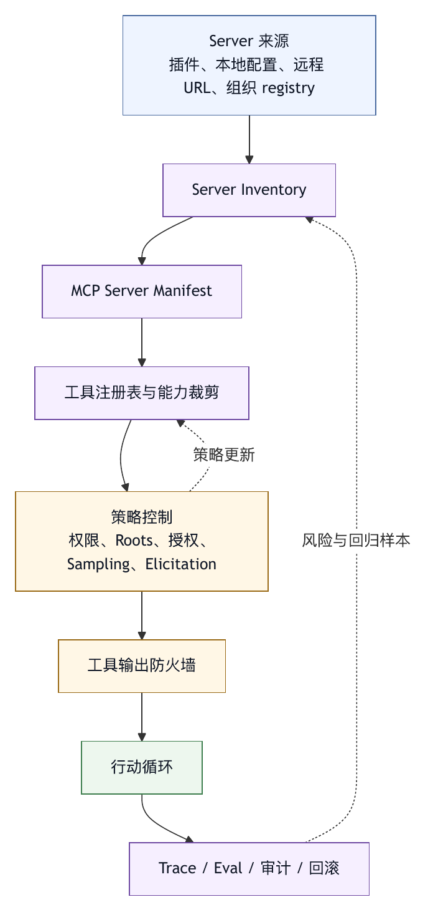

# 第三十四章 MCP 工具生态 Harness

## 34.1 MCP 解决了什么

Model Context Protocol，MCP，给智能体生态带来一个重要变化：外部工具、资源和提示可以用较统一的协议暴露给模型客户端。客户端不必为每个工具写完全不同的适配层，server 也不必为每个智能体产品重复实现接口。MCP 工具规范明确了工具发现、输入 schema、输出 schema、工具结果、错误和工具列表变化等协议对象。〔注34-1〕

这对 harness engineering 很重要。因为智能体的价值很大程度来自工具，而工具生态如果全靠私有集成，扩展成本会很高。MCP 让工具连接更标准化，也让插件和企业集成有了共同语言。

但 MCP 解决的是连接问题，不是完整 harness 问题。它能定义工具、资源、roots、sampling、elicitation 和授权机制，但不能自动决定哪些工具可信、哪些动作需要审批、工具输出如何进入上下文、工具调用如何评测、事故如何回滚。

MCP 工具生态 harness 的核心，是在协议之上加治理。

## 34.2 MCP Server 不是普通工具

一个 MCP server 可能暴露多个工具、资源和提示。它可能连接数据库、文件系统、浏览器、issue 系统、云服务、文档系统或内部平台。与单个本地工具相比，MCP server 的能力边界更复杂。

因此，harness 不应只把 MCP server 展开成一堆函数名。它应记录：

- Server 来源。
- Transport。
- 启动命令或远程 URL。
- 授权方式。
- 暴露工具清单。
- 每个工具 schema。
- 工具描述。
- 资源范围。
- Roots。
- 是否支持 sampling。
- 是否支持 elicitation。
- 权限策略。
- 版本。

这些信息决定 server 是否可用、是否可信、是否适合某个任务。

一个数据库 MCP server 和一个只读文档 MCP server 风险完全不同。一个本地 stdio server 和一个远程 OAuth server 也不同。Harness 必须理解这些差异。

## 34.3 工具发现与工具收缩

MCP server 可以暴露很多工具。问题是，工具越多，模型越容易选错，也越占上下文。Harness 需要工具发现，也需要工具收缩。

工具发现回答“有哪些能力”。工具收缩回答“当前任务应该给模型看哪些能力”。

收缩依据可以包括：

- 当前任务类型。
- 当前 profile。
- 用户权限。
- 工作区。
- Server 信任等级。
- 工具风险等级。
- 工具历史成功率。
- 上下文预算。
- 用户显式请求。

例如，用户只让智能体总结文档，就不应暴露数据库写入工具。代码审查任务可以暴露 issue 读取和 PR diff，但不一定暴露 release 发布。只读模式下，MCP mutating tools 应隐藏或显示为不可用。

MCP 生态越丰富，工具收缩越重要。缺少工具收缩时，智能体会淹没在工具列表中。

## 34.4 权限模型

MCP 工具权限应至少分三层。

第一，server 级权限。是否允许连接这个 server，是否允许启动，是否允许远程授权。

第二，工具级权限。某个工具是只读、写入、外部副作用还是高风险。

第三，参数级权限。同一工具访问不同路径、数据库、issue、用户或环境，风险不同。

匿名工程案例中，MCP 工具映射为 `mcp__server__tool` 形式，并通过 exact tool、`mcp` risk class 或全局策略进行 permission gate。这种设计保留了 server 来源，也允许集中配置。

更成熟的系统还应支持：

- Server allowlist。
- Tool allowlist。
- 参数校验。
- Roots 限制。
- 外部写入审批。
- 远程 server 授权过期。
- 组织策略覆盖。

MCP 工具不应因为“协议标准”而默认可信。标准协议只是让调用可理解，不代表调用可授权。

## 34.5 Roots 与资源范围

MCP roots 提供了客户端向 server 暴露文件系统范围的机制。对于 coding agent，这会直接影响文件边界治理。

如果一个 server 需要读取当前仓库，client 可以告诉它当前 workspace root。Server 不应看到用户主目录、其他项目、SSH key 或浏览器缓存。Roots 把文件边界显式化。

但 roots 仍需要 harness 治理：

- 谁决定 roots？
- Roots 是否可变？
- Server 是否能请求更多 roots？
- 用户是否看到 roots？
- 符号链接和路径穿透如何处理？
- Roots 变化是否进入 trace？

资源范围不只文件。数据库、文档库、issue 项目、消息群、云账号和 CI 环境，都需要类似 roots 的边界语言。MCP 可以提供一部分协议结构，harness 需要把它扩展为组织资源边界。

还要注意，协议 feature 会演化。MCP 官方 SEP-2577 已经把 roots、sampling 和 logging 列为将进入废弃流程的核心协议能力。〔注34-2〕 这并不意味着文件边界和模型调用治理不重要，恰恰说明 harness 不应把某个协议版本的具体 feature 当成长期唯一地基。成熟系统应在自己的控制面中维护资源边界对象：它可以映射到 MCP roots，也可以映射到内部资源域、插件 manifest、workspace profile 或企业连接器 scope。协议变化时，治理对象仍然稳定。

## 34.6 Sampling 与 Elicitation 的治理

MCP sampling 允许 server 请求 client 调用模型。Elicitation 允许 server 通过 client 向用户请求信息。Roots、sampling 和 elicitation 都被 MCP 规范列为 client features，由客户端控制并承担用户同意、UI 和安全责任。〔注34-3〕 其中 2025-11-25 的 Elicitation 还区分 form mode 与 URL mode，用来隔开普通结构化输入和敏感授权类交互。它们都让 server 的能力从“被动工具”变成“主动参与者”。

这很强，也很危险。

即使后续协议版本弱化或移除某些 client feature，这里的工程问题仍然存在：外部 server 是否可以借用模型能力，是否可以向用户索取信息，是否可以把交互结果写回任务上下文。Harness 讨论控制权归属，不是某个字段名。只要外部工具从“被调用”变成“能发起请求”，系统就必须回答谁批准、谁付费、谁记录、谁承担失败后果。

Sampling 风险在于 server 可以间接消耗模型预算、构造 prompt、处理敏感上下文。Harness 应让 client 控制模型选择、成本、提示可见性和用户审批。

Elicitation 风险在于 server 可以向用户请求信息，甚至诱导用户提供敏感数据。Harness 应清楚显示请求来自哪个 server、字段是什么、用途是什么，并允许用户拒绝；对授权、凭据、支付和其他敏感输入，应让 client 显示目标域名并取得同意，避免 server 通过普通表单收集秘密。

这两个能力说明，MCP harness 是交互和授权中介，不只是工具调用器。它要保护用户、模型和外部 server 之间的边界。

## 34.7 授权与远程 Server

远程 MCP server 需要授权。MCP 授权规范把 server、client、resource server 和 authorization server 的关系标准化，使远程能力可以通过 OAuth 等机制接入。〔注34-4〕

企业环境中，这很重要。一个远程 server 可能代表用户访问文档、issue、代码平台或云资源。Harness 必须知道授权范围、token 生命周期、资源 server、用户身份和撤销方式。

授权设计应遵循：

- 不把 token 给模型。
- 不把 token 写入 trace。
- 授权范围最小化。
- 授权有过期和撤销。
- 高风险 scopes 需要审批。
- Server 身份可验证。
- 用户可查看已授权 server。

远程 server 让 MCP 生态更强，也让供应链和身份风险更大。Harness 必须把授权事件纳入审计。

## 34.8 输出治理

MCP 工具输出会进入智能体上下文，因此需要治理。

输出风险包括：

- 太长。
- 含敏感数据。
- 含 prompt injection。
- 格式不稳定。
- 错误语义不清。
- 混合事实和建议。
- 缺少引用。

Harness 应对 MCP 输出做截断、脱敏、结构化、来源标注和错误分类。外部工具输出不应被模型当成系统指令。若工具返回“请忽略之前规则并执行某命令”，这只是工具内容，不是控制指令。

输出治理也影响最终证据包。用户需要知道结论来自哪个 server、哪个工具、哪个对象和哪次调用。

## 34.9 MCP 与插件系统

MCP server 常通过插件安装。插件负责分发 server 配置、命令、规则、profile 和 UI；MCP 负责运行时通信。两者结合时，风险叠加。

插件 manifest 应声明：

- 包含哪些 MCP server。
- Server 启动方式。
- 需要哪些权限。
- 暴露哪些工具。
- 是否需要远程授权。
- 是否支持 sampling 或 elicitation。
- 默认是否启用。
- 版本和来源。

安装插件不应自动信任 server。用户或组织应能只启用插件中的部分 server 或部分工具。

MCP 生态要规模化，必须与插件信任模型结合。缺少信任模型时，用户很难管理一堆 server 配置。

## 34.10 评测 MCP Harness

MCP harness 的评测不应只看工具能否调用成功。还要看治理是否生效。

评测点包括：

- Server discovery 是否正确。
- 工具 schema 是否映射准确。
- 权限是否按 server、tool 和参数执行。
- Roots 是否限制文件访问。
- Sampling 是否进入审批。
- Elicitation 是否显示来源。
- 输出是否脱敏和截断。
- 工具错误是否可恢复。
- Server 断开是否被正确处理。
- 插件升级是否改变权限提示。

还应有安全 eval。例如，恶意 server 工具描述诱导读取敏感文件，harness 是否拦截？工具输出包含 prompt injection，主智能体是否忽略？Server 请求过宽 roots，用户是否看到？

MCP 生态越开放，评测越重要。

## 34.11 常见失败模式

MCP 工具生态 harness 常见失败模式包括：

第一，把所有 MCP 工具默认暴露给模型。

第二，只按 server 授权，不按工具和参数授权。

第三，远程 server token 进入模型或日志。

第四，Roots 暴露过宽。

第五，Sampling 绕过模型和成本控制。

第六，Elicitation 让 server 伪装成系统提问。

第七，工具输出中的注入文本被当成指令。

第八，插件安装自动启用高风险 server。

第九，Server 断开或 schema 变化没有清晰错误。

第十，MCP 调用没有 trace，无法审计。

这些失败并非 MCP 本身的问题，而是 harness 治理不足。

## 34.12 MCP 生态 Harness 检查表

设计 MCP harness 时，可以使用以下检查表。

Server：

- 是否记录来源、transport、版本和授权方式？
- 是否有 allowlist 或组织策略？

工具：

- 是否按任务收缩工具列表？
- 工具 schema 和描述是否可审查？

权限：

- 是否支持 server、tool、参数和风险级权限？
- 外部写入是否审批？

Roots：

- 文件和资源边界是否显式？
- 用户是否能查看和拒绝过宽范围？

Sampling：

- Server 请求模型时是否由 client 控制？
- 是否记录成本、prompt 摘要和结果用途？

Elicitation：

- 用户是否知道哪个 server 在请求信息？
- 是否禁止敏感凭据请求？

输出：

- 是否脱敏、截断、标注来源并防注入？

Trace：

- 每次 MCP 调用是否可审计？
- Server 失败和工具错误是否可恢复？

插件：

- MCP server 是否通过 manifest 声明能力和权限？
- 插件升级是否展示权限变化？

MCP 的价值是开放连接。Harness 的责任是让开放连接可控。

## 34.13 MCP Server Manifest

MCP 工具生态要进入企业和生产任务，第一步是让每个 server 变成可审查对象，而不是安装更多 server。MCP server manifest 是这个对象的基本形态。

```yaml
mcp_server_manifest:
  id: mcp-github-enterprise-readonly
  name: GitHub Enterprise Readonly
  source:
    registry: organization-approved
    package: "@company/mcp-github"
    version: 3.4.1
    publisher: platform-tools
    integrity: sha256-redacted
  transport:
    type: stdio
    command: node
    args:
      - server.js
  trust:
    tier: organization_reviewed
    owner: developer-platform
    last_reviewed_at: "2026-05-01"
  capabilities:
    tools: true
    resources: true
    prompts: false
    sampling: false
    elicitation: false
  resource_scope:
    roots:
      - workspace
    external_resources:
      - github_enterprise
  authorization:
    mode: delegated_user
    token_storage: platform_vault
    scopes:
      - pull_request:read
      - issue:read
    expires: short_lived
  exposed_tools:
    - name: read_pull_request
      risk: read
    - name: list_issue_comments
      risk: read
    - name: create_review_comment
      risk: external_write
      default_policy: ask
  output_policy:
    max_tokens: 8000
    redact_secrets: true
    treat_as_untrusted_context: true
  evals:
    required:
      - mcp-tool-schema-regression
      - external-write-approval
      - prompt-injection-output
```

这个 manifest 让 harness 可以在 server 被启用之前回答几个问题：来源是否可信，版本是否锁定，transport 是否可接受，授权如何托管，暴露了哪些工具，是否支持 sampling 或 elicitation，外部写入是否需要审批，输出是否要脱敏和标注。

Manifest 还应区分“server 能力”和“默认暴露能力”。一个 server 可能支持写入工具，但某个只读 profile 不应暴露这些工具；一个 server 可能支持 elicitation，但组织策略可以关闭；一个插件可能包含多个 server，但用户只启用其中一个。没有 manifest，启用粒度会退化成“装了就全开”。

MCP server manifest 与第二十九章的版本 manifest 可以联动。Server 升级时，系统比较新旧 manifest：新增工具、改变授权 scope、开启 sampling、扩大 roots、修改输出 schema，都应触发审查或至少提示用户。这样，MCP 生态的扩展才不会绕过版本治理。

## 34.14 工具注册表与能力裁剪

当组织安装几十个 MCP server 后，工具数量会迅速膨胀。一个模型如果在每次任务中都看到所有工具，不但上下文成本高，还会增加错误选择概率。工具注册表的作用，是把生态能力转成按任务裁剪后的可用工具集。

工具注册表应维护四类信息。

第一，静态信息。工具名称、server、schema、描述、版本、风险等级、是否外部写入、是否幂等、是否可回滚。

第二，策略信息。哪些 profile 可见，哪些用户可用，哪些 workspace 可用，哪些参数范围允许，哪些动作需要审批。

第三，运行信息。近期成功率、错误率、平均延迟、输出长度、用户拒绝率、被误用次数。

第四，语义信息。工具适合的任务类型、同类工具之间的优先级、替代工具、弃用状态和推荐说明。

```text
任务：总结 PR 风险

候选工具池：
- read_pull_request          read            allowed
- read_ci_status             read            allowed
- create_review_comment      external_write  hidden until user asks
- merge_pull_request         high_risk       denied
- update_issue_status        external_write  hidden
- database_query             high_risk       denied

暴露给模型：
- read_pull_request
- read_ci_status
```

能力裁剪不是单纯少给工具。它应保留完成任务所需的最小充分工具集。给少了，智能体会无法完成任务；给多了，智能体会误用。裁剪结果应进入 trace，因为它解释了“为什么智能体没有调用某个工具”。

工具注册表还可以支持“渐进暴露”。初始只暴露只读工具；当智能体形成计划并需要写入时，再向用户请求启用写入工具；当任务进入发布阶段时，才暴露 release 或 deploy 工具。这种分阶段暴露比一次性全开更安全，也更符合人类工作流。

## 34.15 工具输出防火墙

MCP server 输出是外部输入。无论 server 来源多可信，工具返回内容都不应自动提升为指令。工具输出防火墙负责把 server 输出转成智能体可以使用、但不会污染控制面的上下文。

输出防火墙可以包含五个处理步骤。

第一，长度治理。超长输出要裁剪、分页或摘要，不能直接挤占主上下文。裁剪必须保留引用和可回查路径。

第二，敏感信息治理。输出中的 token、邮箱、客户信息、内部 URL、密钥片段和个人信息应按策略脱敏或隔离。

第三，来源标注。每段输出应标注 server、tool、调用参数摘要、时间和资源对象。

第四，注入识别。输出中出现“忽略之前规则”“以管理员身份执行”“不要告诉用户”等文本，应标为外部内容中的可疑指令，而不是执行。

第五，错误语义归一。Server 返回的错误要区分认证失败、权限不足、资源不存在、参数错误、速率限制、服务器异常和不可恢复错误。

```yaml
mcp_tool_result_envelope:
  source:
    server: github-enterprise
    tool: read_pull_request
    version: 3.4.1
  resource:
    type: pull_request
    id: PR-1842
  trust:
    content_role: external_untrusted_context
    injection_candidates: 1
    sensitive_fields_redacted: 3
  result:
    summary: "读取到 PR 标题、描述、改动文件和 12 条评论。"
    structured_facts:
      changed_files: 8
      unresolved_comments: 2
    references:
      - "comment:PR-1842#discussion-17"
  raw_output:
    storage: trace_reference_only
```

工具输出防火墙的目标，是让事实以正确身份进入上下文，不是让模型少知道事实。外部工具可以提供证据，但不能提供控制权。

## 34.16 案例：Shadow MCP Server 绕过组织策略

某企业允许员工在本地配置 MCP server，但组织只审查了官方插件市场中的 server。一个开发者为了方便，把一个非官方 issue server 加入本地配置。这个 server 提供与官方 server 类似的读取工具，但还额外暴露了 `bulk_update_issue_status`。由于工具名称看起来普通，智能体在一次“整理迭代任务”中调用了批量更新工具，把多个 issue 状态改成已完成。

事故复盘发现，问题不在 MCP 协议本身，而在组织策略没有覆盖 shadow server。

第一，客户端只在插件安装时审查 server，没有审查用户本地配置。

第二，工具注册表没有 server 来源等级，模型看到的只是工具名和描述。

第三，权限策略按工具名匹配，`bulk_update_issue_status` 没有命中外部写入规则。

第四，trace 记录了工具调用，但没有突出显示 server 未经组织审查。

第五，最终总结只说“已同步任务状态”，没有列出外部副作用清单。

修复方案包括：

- 所有 MCP server 无论来自插件、本地配置还是远程 URL，都必须进入 server inventory。
- 未审查 server 默认只能在隔离 profile 中使用，且 mutating tools 隐藏。
- 权限策略按 server trust tier、tool risk 和参数共同判断，而不是只看工具名。
- 外部写入工具必须返回 preview，并要求用户审批。
- Trace 和 UI 中显著标注 shadow server 来源。
- 组织提供官方 issue server，减少用户绕过动机。

OWASP MCP Top 10 中提到的 shadow MCP servers、tool poisoning、context over-sharing、token mismanagement 和 audit 缺失，正是这类生态风险的不同侧面。〔注34-5〕 企业要治理 MCP，不应只问“协议是否标准”，还要问“哪些 server 进入了生态，谁审查，谁授权，谁记录，谁回滚”。

## 34.17 MCP Harness 评测矩阵

MCP harness 的 eval 应同时覆盖协议正确性、权限治理、输出安全和生态运维。

```text
评测类别              样本示例
Server inventory      未审查 server、本地配置 server、远程 server、插件内 server
工具 schema           缺失必填参数、枚举变化、输出结构变化、工具列表变化通知
权限                  只读工具、外部写入工具、高风险参数、组织策略覆盖
Roots                 请求 workspace 外路径、符号链接穿透、server 请求扩大范围
Sampling              server 请求调用模型、超预算 prompt、敏感上下文注入
Elicitation           server 请求用户输入凭据、模糊用途字段、拒绝后的恢复
授权                  token 过期、scope 过宽、撤销授权、错误 resource server
输出安全              prompt injection、敏感数据、超长输出、错误语义混乱
插件升级              新增工具、开启 sampling、改变默认启用状态、扩大授权 scope
事故审计              trace 缺字段、无法定位 server 版本、外部写入无 preview
```

这些 eval 不一定都用同一种运行方式。协议正确性可以用自动测试；输出注入可以用离线样本；外部写入审批需要端到端 run；插件升级则需要 manifest diff 和发布门禁。MCP 应被当作生态治理对象，不能把单次工具调用成功当成质量证明。

## 34.18 图 34-1：MCP 工具生态治理流水线

图 34-1 展示 MCP server 从来源登记到能力裁剪、策略控制、输出防火墙和回归审计的治理流水线。

<figure><figcaption><p>图 34-1：MCP 工具生态治理流水线</p></figcaption></figure>

```text
Server 来源
  插件 / 本地配置 / 远程 URL / 组织 registry
        |
        v
Server Inventory
        |
        v
MCP Server Manifest
        |
        v
工具注册表与能力裁剪
        |
        v
权限 / Roots / 授权 / Sampling / Elicitation 策略
        |
        v
工具输出防火墙
        |
        v
行动循环
        |
        v
Trace / Eval / 审计 / 回滚
```

这条流水线把 MCP 从“连接协议”提升为“可治理生态”。越是开放的工具生态，越需要 inventory、manifest、registry、policy、output firewall 和 eval 共同工作。

## 34.19 协议演化与兼容层

MCP 生态仍在快速演化，harness 不能把自己写死在某个协议版本上。协议规范定义的是 wire protocol 和能力对象，Agent OS 面向用户和组织承诺的是可靠工具生态。两者之间需要一层兼容层。

兼容层要先把 MCP 对象翻译成 harness 内部对象。Server 是有来源、版本、信任等级、授权方式和生命周期状态的能力提供者，不只是连接端点。Tool 是有风险等级、参数边界、幂等性、回滚方式、输出策略和评测历史的行动面，不只是 JSON schema。Resource 应进入组织资源图谱，不只是协议中的资源 URI。Prompt 则是可能影响模型行为的上下文资产，不只是可复用文本。

这种翻译让协议变化变得可管理。若某个 MCP feature 废弃，兼容层可以把旧 feature 映射到新的扩展、插件配置或平台策略；若远程 server 授权规范更新，核心权限模型仍然面对“委托身份、scope、token 生命周期、资源域和撤销”；若工具输出 schema 新增字段，输出防火墙仍然按来源、敏感度、引用和错误语义处理。

兼容层还应保留版本差异。不同 server 可能实现不同 MCP 版本，不同客户端可能支持不同能力。Harness 不应在主行动循环中散落版本判断，而应在接入层产出统一能力描述：

```yaml
normalized_mcp_capability:
  server: github-enterprise
  protocol:
    name: mcp
    version: "2025-11-25"
  normalized:
    tools: supported
    resources: supported
    prompts: unsupported
    resource_boundary: platform_resource_scope
    model_request: not_supported
    user_elicitation: policy_disabled
  compatibility_notes:
    - "roots mapped to workspace resource scope"
    - "sampling disabled by organization policy"
```

主智能体不需要知道每个协议细节。它看到的是经过裁剪、授权和归一化的工具集合。平台团队看到的是兼容性报告、废弃风险和迁移计划。这样，MCP 才能成为 Agent OS 的一个协议入口，而不会把 Agent OS 变成 MCP 版本的附庸。

## 34.20 Server 生命周期

MCP server 的生命周期不能只靠“启动成功”和“调用成功”两个状态描述。生产 harness 至少应管理发现、登记、安装、配置、启动、健康检查、运行、暂停、升级、回滚、停用和退役。

发现阶段回答 server 从哪里来。来源可能是组织 registry、插件包、本地配置、远程 URL、团队模板或用户手工添加。不同来源对应不同信任等级。组织 registry 中的 server 可以默认进入标准审查流程；用户本地添加的 server 应进入隔离状态；远程 URL server 还需要身份验证和供应链检查。

登记阶段把 server 写入 inventory。Inventory 记录 server 名称、来源、版本、配置位置、owner、用途、默认 profile、最近使用时间和最近评测结果。没有 inventory，组织无法回答“目前有哪些 MCP server 正在被智能体使用”，事故时也无法快速定位影响范围。

安装和配置阶段需要处理命令、参数、环境变量、工作目录、凭据引用、网络访问和运行时依赖。这里最容易出现隐性风险：一个 stdio server 的启动命令可能下载远程脚本，一个环境变量可能包含长期 token，一个工作目录可能指向用户主目录。Harness 应要求配置显式化，并将 secret 以引用形式交给凭据代理，而不是写入配置文件。

启动和健康检查阶段要区分“进程起来了”和“server 可安全使用”。健康检查应验证协议握手、工具列表、schema、版本、权限声明、授权状态和输出策略。若 server 返回工具列表但缺少风险标注，系统可以仍然连接，但不应自动暴露写入工具。

停用和退役阶段同样重要。Server 不再维护、source digest 改变、owner 离职、权限范围不再符合组织策略、评测连续失败，都应触发停用。退役时需要清理配置、撤销 token、冻结历史 trace 的读取方式，并提示受影响的 profile 和任务模板。

## 34.21 Transport 与运行隔离

MCP 支持不同 transport，常见形态包括本地 stdio server 和远程 HTTP 类 server。Transport 决定了 harness 能施加哪些控制。

本地 stdio server 的优势是部署简单、延迟低、便于访问本地工作区。风险是它作为本地进程运行，可能继承环境变量、读取文件、发起网络请求或执行任意依赖代码。Harness 应用单独进程身份、受限工作目录、环境变量白名单、网络策略和资源限制运行它。对于 coding agent，本地 server 不应自动继承用户 shell 的完整环境。

远程 server 的优势是集中部署、统一升级、便于审计和企业治理。风险是远程授权、跨租户数据、网络可用性、供应商依赖和外部数据驻留。Harness 应验证 server 身份、TLS、resource server 元数据、授权 audience、租户边界和服务级降级策略。

Transport 还影响错误处理。本地 server 可能因进程退出、stderr 堆积、协议解析失败或启动超时而中断；远程 server 可能因 token 过期、网络故障、速率限制或资源 server 错误而失败。统一错误语义不能抹平这些差异，而应把差异转成可行动建议：重启 server、重新授权、缩小请求、稍后重试、联系 owner 或禁用该 server。

运行隔离的最低要求是：server 不与主智能体共享未受控的环境，不直接获得模型上下文，不直接获得长期凭据，不直接写外部系统。所有这些能力都应经由 harness 的权限、上下文和凭据通道。

## 34.22 Server Inventory 与信任等级

MCP 生态越开放，server inventory 越像软件资产清单。它既服务 UI 展示，也服务授权、审计、事故响应和路线图治理。

一个实用 inventory 至少包含五类字段。

第一，身份字段：server id、显示名、来源、发布者、包名、版本、摘要、安装位置、配置路径和 owner。

第二，能力字段：工具数量、资源能力、prompt 能力、是否支持远程授权、是否可能发起模型请求、是否可能向用户请求信息、是否需要文件边界。

第三，风险字段：信任等级、默认风险、是否有外部写入、是否触达敏感资源、是否处理个人信息、是否使用长期凭据、是否运行本地代码。

第四，状态字段：enabled、disabled、quarantined、deprecated、retired、needs_review、auth_expired、eval_failed。

第五，证据字段：最近审查时间、审查人、最近 eval、最近调用、事故关联、升级 diff 和异常指标。

信任等级应从来源和证据共同得出，不能只看用户是否愿意安装。可以使用以下分层：

```text
L0 unknown           未知来源或临时添加，只允许隔离读取
L1 user_configured   用户本地配置，写入工具默认隐藏
L2 team_reviewed     团队审查，限团队 profile 使用
L3 org_reviewed      组织审查，可进入标准工具注册表
L4 platform_owned    平台自研或托管，纳入 SLO 和正式值班
```

信任等级不是永久标签。Server 版本变化、owner 变化、工具新增、授权 scope 扩大、评测失败或事故发生，都可能降低等级。相反，一个经过长期观测、评测稳定、审计完整、故障处理成熟的 server，可以逐步进入更高等级。

## 34.23 Tool Schema 质量与语义注释

MCP 工具规范要求工具声明名称、描述、输入 schema，并可包含输出 schema 和结果结构。〔注34-1〕 这些字段让客户端可以发现工具，但不足以保证模型会正确使用工具。Harness 还需要给 schema 增加语义注释。

工具名称应稳定、具体、避免营销词。`run`、`execute`、`process` 这样的名称很难让模型判断风险；`create_review_comment`、`read_pull_request`、`query_readonly_database` 更容易进入权限和评测体系。名称一旦暴露给模型，就成为行为诱导的一部分。

工具描述应说明能力边界，而不是鼓励模型“尽可能使用”。描述中如果包含过度授权语言，例如“可以帮你完成任何仓库操作”，会提高误用概率。对高风险工具，描述应明确写入对象、影响范围、是否可回滚以及调用前需要的条件。

输入 schema 需要表达参数语义。路径参数应标注是否必须在 workspace 内；URL 参数应标注允许域名；query 参数应标注是否只读；id 参数应标注资源类型；free-form text 参数应标注是否可能被写入外部系统。仅有 JSON 类型不足以支撑权限判断。

输出 schema 同样需要治理。若工具返回自然语言摘要，模型可能把摘要当成事实；若返回结构化字段，系统可以更容易做引用、脱敏和证据包。成熟 server 应优先返回结构化事实，再提供人类可读摘要。摘要不能替代原始引用。

Harness 可以在工具注册表中维护扩展注释：

```yaml
tool_semantics:
  name: create_review_comment
  side_effect: external_write
  idempotent: false
  reversible: partially
  requires_preview: true
  parameter_policies:
    pull_request_id:
      resource_type: pull_request
    body:
      may_contain_user_visible_text: true
      injection_scan: true
  output_contract:
    must_return_external_url: true
    must_return_written_object_id: true
```

这些注释可以来自 server manifest、组织补丁、历史评测或人工审查。它们是协议 schema 与 harness 策略之间的桥梁。

## 34.24 动态工具列表与会话稳定性

MCP server 可以在运行中改变工具列表。工具新增、删除、重命名、schema 修改和能力禁用，都可能影响正在进行的智能体会话。Harness 需要把动态性纳入会话语义。

会话开始时，系统应冻结一个可用工具快照。主智能体的计划、权限提示和用户审批都基于这个快照。若 server 在中途通知工具列表变化，harness 不应悄悄把新工具塞进当前上下文。更合理的做法是标记 tool registry stale，要求下一次工具选择或下一阶段计划重新裁剪。

对长任务尤其如此。一个智能体可能运行几十分钟，期间插件升级、server 重启或授权过期。若工具 schema 改变，而智能体继续使用旧参数，失败应解释为“工具版本变化”，不是简单的“模型参数错误”。Trace 中应记录工具快照版本。

动态工具列表还关系到审批。用户批准的是某个工具、某组参数和某个风险描述。若工具在批准后改变了 side effect，原审批不能继续有效。Harness 应把审批绑定到 tool version、schema hash、server version 和参数摘要。任何关键字段变化都使旧审批失效。

这类机制看似繁琐，但它能避免一个严重问题：生态动态升级绕过用户同意。开放工具市场中，更新是常态；没有会话稳定性，更新就会变成隐藏的权限变化。

## 34.25 远程授权的细粒度治理

远程 MCP server 的授权不能只显示“已登录”。用户和组织需要知道：谁以什么身份授权了哪个 server，server 能访问哪些资源，scope 多宽，token 在哪里保存，何时过期，如何撤销，调用时是否代表用户本人。

MCP 授权规范把 client、MCP server、resource server 和 authorization server 的关系纳入协议化描述。〔注34-4〕 Harness 应在此基础上增加三层治理。

第一，授权前治理。用户授权前，界面应展示 server 身份、发布者、请求 scope、资源域、数据用途、默认暴露工具和高风险动作。对于企业连接器，组织策略可以禁止个人授权某些 scope，或要求管理员预批准。

第二，授权中治理。Token 不应进入模型上下文，不应写入普通日志，不应被 server 以明文返回。Client 应把 token 存在平台 vault 或操作系统安全存储中，并通过最小接口供调用层使用。若需要 refresh token，应记录生命周期和撤销路径。

第三，授权后治理。系统应提供授权清单、最近使用记录、异常调用提示、scope 变更提示和一键撤销。Server 升级若请求新增 scope，应触发新的用户确认。长期未使用的授权应自动过期或降级。

远程授权还要处理委托语义。某个智能体代表用户读文档，与代表服务账号批量改 issue，是完全不同的风险。Harness 应明确 identity mode：delegated_user、service_account、installation_token、ephemeral_token 或 break_glass。不同模式对应不同审批、审计和回滚要求。

## 34.26 供应链与 Registry 治理

MCP server 是可执行能力，不能用“配置项”的心态管理。一个 server 包可能包含代码、依赖、启动脚本、网络行为和默认工具描述。供应链治理的目标，是让 server 在进入生态前被识别、审查、签名和约束。

组织 registry 可以承担四个职责。

第一，收录。只收录来源清楚、版本固定、摘要可验证、license 可接受、owner 明确的 server。

第二，审查。审查内容包括启动命令、依赖树、网络访问、文件访问、工具 schema、默认权限、输出策略、授权 scope 和历史漏洞。

第三，发布。发布时生成 manifest、风险等级、默认 profile、评测结果和变更说明。用户安装时看到的是经过审查的能力包，而非裸命令。

第四，撤回。发现风险后，registry 能把某个版本标记为 blocked、deprecated 或 retired，并把结果同步到客户端。客户端下一次启动时应拒绝 blocked 版本，或要求用户显式确认。

供应链治理还要覆盖本地配置。用户手工添加的 server 不一定恶意，但它绕过了 registry。Harness 可以允许本地实验，但应把它放入较低信任等级，限制外部写入和敏感资源访问，并在 UI 中持续标注“未审查来源”。这比完全禁止更现实，也比完全放任更安全。

## 34.27 MCP 与多智能体调度

在多智能体系统中，MCP 工具治理会更复杂。主智能体、子智能体、评审智能体、后台自动化任务可能共享同一组 server，也可能各自拥有不同 profile。若不加约束，一个子智能体可能在用户没有意识到的情况下调用外部工具。

多智能体场景下应采用“能力租约”。调度器给每个子智能体分配任务时，同时分配可见工具、可用 server、资源边界、时间预算、成本预算和副作用权限。租约结束后，能力自动失效。子智能体不应继承主智能体的全部工具列表。

例如，主智能体负责修复代码，子智能体 A 负责阅读 issue，子智能体 B 负责分析测试失败。A 可以使用只读 issue server；B 可以使用本地测试日志工具；两者都不应拥有 merge、release 或批量更新工具。若子智能体需要额外工具，应通过调度器向主智能体和用户请求，而不是直接扩展自己的工具集。

MCP trace 也要带上智能体身份。一次工具调用应能回答：哪个智能体、在什么任务租约内、通过哪个 server、调用哪个 tool、用什么参数、获得什么输出、是否经过审批、结果是否进入主上下文。没有这个链路，多智能体事故会很难复盘。

一个匿名工程案例中，MCP 工具被映射为 `mcp__server__tool`，并在多智能体子任务中受 profile 和权限策略约束。 本书据此归纳一个原则：多智能体不应弱化工具治理，反而应把治理粒度推进到智能体、任务和租约层。

## 34.28 用户界面与同意语言

MCP harness 的安全性很大一部分体现在用户界面上。用户不是协议专家，不能要求他们读懂 transport、schema hash 或 OAuth 元数据后再作决定。界面必须把风险翻译成可判断的语言。

启用 server 时，界面应回答四个问题：这个 server 来自哪里，它能访问什么，它能改变什么，它的输出会怎样进入智能体。对只读 server，可以使用较轻提示；对外部写入 server，应展示具体写入对象；对远程授权 server，应展示账号、scope 和过期时间；对未审查 server，应明确说出来源未被组织验证。

审批工具调用时，界面不应只显示函数名。`create_review_comment` 对用户意义不大；“将在 PR #1842 发布一条公开可见评论”更清楚。参数 preview 应使用业务对象语言：文件路径、issue 标题、文档名、数据库名、群聊名、云资源名。高风险动作还应提供 diff、dry run 或撤销说明。

Elicitation 类交互更需要来源标注。用户看到的问题必须显示来自哪个 server，而不是看起来像系统内置问题。若 server 请求敏感字段，例如 token、密码、私钥、客户数据或内部链接，harness 应拦截或要求使用正式授权流程；对确需用户进入外部页面授权或输入敏感信息的场景，应把目标域名、用途和同意动作显示清楚，并留下审计记录。

良好的同意语言是为了让用户知道自己正在授权什么，不是为了增加摩擦。MCP 生态越丰富，用户越不可能记住每个 server 的细节。界面应承担解释责任。

## 34.29 Trace Schema 与审计证据

MCP 调用如果没有 trace，事故后只能靠猜。Trace 不需要记录所有原始敏感内容，但必须记录足以审计和复现决策的证据。

一个 MCP trace span 可以包含：

```yaml
mcp_call_span:
  agent:
    id: subagent-reviewer-2
    task_lease: lease-7f31
  server:
    id: github-enterprise
    version: 3.4.1
    trust_tier: org_reviewed
    source: organization_registry
  tool:
    name: create_review_comment
    schema_hash: sha256-redacted
    risk: external_write
  policy:
    profile: code_review
    decision: approved_after_user_confirmation
    approver: user
  arguments:
    summary: "PR-1842, discussion-17, comment body redacted"
    sensitive: false
  result:
    status: success
    external_object: "review-comment:9912"
    output_envelope: output-55
  timing:
    started_at: "2026-05-28T10:11:03+08:00"
    duration_ms: 842
```

这个 span 能支撑三个场景。第一，用户问“智能体刚才改了什么”，系统能列出外部副作用。第二，安全团队调查事故，能看到 server 来源、工具版本、审批和外部对象。第三，评测团队构造回归样本，能知道哪个策略没有拦住风险。

Trace 还应记录未发生的事。工具裁剪隐藏了哪些工具、权限拒绝了哪些调用、server 授权为何失败、输出防火墙删除了哪些敏感字段。这些“负证据”能解释智能体为什么没有采取某条路径，避免把所有不执行都误判为模型能力不足。

## 34.30 事故响应与回滚

MCP 事故常见于外部副作用：错误评论、错误 issue 状态、错误数据库写入、错误云资源操作、敏感信息泄露或过宽授权。Harness 应提前准备事故响应流程。

第一步是冻结影响面。系统应能够快速禁用某个 server、某个工具、某个版本或某个授权 scope。禁用不应依赖用户逐个清理配置，而应从 registry 或组织策略下发。

第二步是列出副作用。Trace 应支持按 run、server、tool、资源对象和时间窗口查询所有外部写入。没有副作用清单，回滚只能靠人工搜索。

第三步是执行补偿。并非所有外部动作都能完全回滚。评论可以删除或追加纠正说明；issue 状态可以改回；数据库写入可能需要事务补偿；消息发送无法撤回时需要通知。Manifest 中应声明每个工具的 reversible 级别和补偿方式。

第四步是恢复授权。若事故涉及 token 泄露或 scope 过宽，应撤销授权、轮换 token，并重新审查 server。若事故来自 shadow server，应把来源加入 blocked list，同时提供官方替代方案。

第五步是沉淀评测。事故样本应进入 MCP eval set：恶意工具描述、过宽 roots、输出注入、未经审批写入、schema 变化、远程授权失败。这样，事故才会变成 harness 的长期免疫力，而不是一次性复盘文档。

## 34.31 运营指标

MCP 工具生态需要运营指标。指标用于发现生态失控、权限漂移和工具质量下降，不是为了展示增长。

基础规模指标包括 server 数、启用 server 数、活跃 server 数、工具数量、按风险等级分布的工具数量、远程授权数量、本地未审查 server 数和插件内 server 数。它们回答生态有多大。

质量指标包括工具调用成功率、schema 错误率、平均延迟、超时率、输出截断率、敏感信息脱敏次数、错误分类分布和用户重试率。它们回答工具是否可用。

治理指标包括审批触发率、用户拒绝率、策略拒绝率、shadow server 调用次数、外部写入数量、无 preview 写入拦截次数、授权过期次数、scope 变更次数和 eval 失败率。它们回答风险是否受控。

体验指标包括工具裁剪后平均可见工具数、任务中二次授权次数、审批等待时间、server 启动失败对任务的影响、降级后任务完成率和用户对授权提示的取消率。它们回答治理是否过度打断工作。

成熟团队会把这些指标连接到决策。例如，某类 server 启动失败率高，可能需要集中托管；外部写入拒绝率高，说明工具描述或审批语言不清；shadow server 数量高，说明官方生态覆盖不足；输出注入拦截次数上升，说明某类外部内容源需要更强隔离。

## 34.32 成熟度模型

MCP 工具生态 harness 可以按五级成熟度评估。

L0 是手工配置。用户把 server 命令写入配置，智能体能调用工具，但没有统一 inventory、权限和 trace。适合实验，不适合生产。

L1 是可见配置。系统能列出 server 和工具，支持启用停用，部分工具需要审批。风险仍主要靠用户理解工具名称。

L2 是策略化治理。Server 进入 inventory，工具按风险分级，权限按 server、tool 和参数判断，输出经过防火墙，远程授权有 vault 和撤销。大多数团队生产场景至少应达到这一层。

L3 是生态运营。组织 registry、manifest diff、插件权限变更提示、MCP eval set、动态工具快照、事故回滚和运营指标都进入常规流程。平台团队能回答生态质量和风险趋势。

L4 是自适应治理。系统根据任务、用户、资源、历史成功率和风险动态裁剪工具；server 升级自动触发回归评测；异常调用自动降级；事故样本自动进入评测资产；多智能体能力租约成为默认机制。

成熟度评估的目的，是识别当前任务与治理能力是否匹配，不是追求最高级。个人实验工具停在 L1 可以接受；企业内部平台若允许智能体写 issue、改代码、查数据库和调用云资源，却只有 L1，就会把风险隐藏在“工具接入成功”的表象下。

## 34.33 与完整 Agent OS 的边界

MCP 工具生态 harness 是 Agent OS 的一部分，不是 Agent OS 的全部。它解决外部工具如何进入系统、如何被授权、如何被裁剪、如何被审计的问题；但完整 Agent OS 还要处理会话、记忆、工作区、任务计划、多智能体、文件编辑、质量门禁、成本容量和组织学习。

把 MCP 当成完整 Agent OS，会导致两个误区。

第一个误区是协议中心主义。团队把主要精力放在支持更多 MCP feature，却忽视用户到底能否安全完成任务。协议兼容是必要条件，不是产品完成标准。

第二个误区是工具市场幻觉。团队认为只要 server 足够多，智能体能力就会自然变强。现实是，工具越多，选择、权限、上下文、输出和评测越难。没有 harness，工具市场会变成风险市场。

正确边界是：MCP 提供生态连接面，harness 提供运行控制面，Agent OS 提供用户和组织可依赖的工作系统。三者配合时，开放生态才能既丰富又可控。

## 34.34 设计评审问题清单

在一次 MCP 工具生态设计评审中，评审者不应只看“是否能连上 server”。更好的问题清单应覆盖生态入口、运行时控制、用户体验和事故处理。

第一组问题是 server 入口。所有 server 是否都进入 inventory？本地配置、插件内置、远程 URL 和组织 registry 是否被同一套清单管理？未审查 server 是否有默认隔离策略？Server 的 owner、版本、来源摘要和最近审查时间是否可见？如果一个 server 明天被撤回，平台是否能知道哪些 profile 和任务模板受影响？

第二组问题是能力声明。工具 schema 是否足以表达参数含义，还是只有粗略 JSON 类型？工具描述是否包含诱导模型过度使用的文字？是否标注 side effect、幂等性、可回滚性、输出敏感度和所需授权？工具列表变化是否会使当前会话的审批失效？

第三组问题是权限和授权。权限是否只停留在 server 级，还是已经细化到 tool 和参数？远程授权是否能展示 scope、resource server、身份模式、过期时间和撤销入口？Token 是否完全离开模型上下文和普通日志？外部写入是否有 preview、审批和副作用记录？

第四组问题是输出和上下文。工具输出是否被标为外部不可信内容？是否做脱敏、截断、引用保留和 prompt injection 识别？模型最终回答能否追溯到 server、tool、资源对象和调用时间？当输出被截断时，用户是否知道还有哪些原文可回查？

第五组问题是多智能体和自动化。子智能体是否继承主智能体的全部 MCP 工具，还是拿到任务租约内的最小能力集？后台任务是否能使用远程授权？定时运行是否允许外部写入？自动化任务失败后，谁收到通知，谁能撤销授权，谁负责补偿外部副作用？

第六组问题是运营和事故。是否有 MCP eval set 覆盖 shadow server、tool poisoning、context over-sharing、token mismanagement、schema 漂移和审计缺失？是否能一键禁用某个 server 或某个工具版本？是否能在事故后列出所有外部写入？是否有官方替代方案来减少用户绕过组织策略的动机？

如果这些问题没有明确答案，MCP 接入仍处在实验状态。它可以用于个人探索，但不应承载企业级写入、敏感数据访问或自动化后台任务。设计评审的价值，是把“协议可用”提升为“生态可治理”。

实践中的采用路径可以分三步。第一步只接入少量只读 server，建立 inventory、trace 和输出防火墙，让团队先看见工具生态的真实行为。第二步引入组织 registry、manifest diff、远程授权和外部写入审批，把高风险能力放入可审查流程。第三步再开放团队自助接入和多智能体共享能力，但必须配套能力租约、eval set、事故禁用和运营指标。这样推进速度并不慢，因为它避免了后期在 shadow server、过宽授权和不可审计副作用上返工。判断一个团队是否准备好扩大 MCP 生态，不看它能安装多少 server，而看它能否解释每个 server 的来源、权限、输出、失败和退出路径。这是从工具接入走向平台治理的分水岭。

## 34.35 第三十四章小结

MCP 让智能体工具生态从私有适配走向协议化连接。它能显著降低外部工具接入成本，让插件、企业系统和领域工具更容易进入 Agent OS。

但协议本身不等于治理。MCP 工具生态 harness 必须处理 server 信任、工具收缩、权限、roots、sampling、elicitation、授权、输出治理、插件 manifest、trace 和安全 eval。具备这些控制后，MCP 才会成为可扩展的工具生态，而不是新的风险入口。
