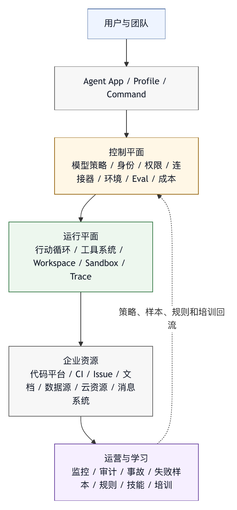

# 第三十五章 企业内部智能体平台

## 35.1 企业内部平台的定位

企业内部智能体平台不是一个“公司版聊天机器人”。它更接近组织级 Agent OS：为不同团队提供统一模型接入、工作区运行、工具连接、权限治理、审计、评测、插件、知识资产和成本管理。OpenAI Codex 的企业文档把云端 coding agent 环境、组织管理、受管配置、审批策略、sandbox 与环境治理放在同一组控制面中，可作为企业级 coding agent 产品化治理的现实例证。〔注35-1〕 本书据此归纳：企业平台不能只以模型调用为中心，还必须以组织治理为中心。

如果每个团队各自接入模型 API、各自写工具、各自保存凭据、各自处理日志，组织很快会得到一堆互不兼容的智能体脚本。它们可能都能完成小任务，但无法统一安全边界、无法复用工具、无法审计、无法控制成本，也无法从失败中共同学习。

企业内部智能体平台的价值，是把重复的 harness 能力平台化，让业务团队专注场景，让平台团队专注运行基底，让治理团队专注风险边界。

它要回答的问题包括：

- 谁可以创建智能体？
- 智能体可以访问哪些模型？
- 智能体在哪里运行？
- 哪些工具和连接器可用？
- 权限如何配置？
- 外部系统写入如何审批？
- Trace 保存在哪里？
- 数据如何脱敏和保留？
- Eval 如何运行？
- 插件如何审查和分发？
- 事故如何发现和复盘？

这些问题决定企业智能体能否规模化。

## 35.2 平台边界：不是所有场景都进核心

企业平台容易犯的错误，是把所有场景都塞进核心系统。代码智能体、数据分析智能体、客服智能体、文档智能体、运维智能体、HR 智能体、法务智能体，都要求平台直接支持。结果核心变得臃肿，升级困难，安全边界混乱。

更好的架构是核心平台加场景扩展。

核心平台负责：

- 模型网关。
- 智能体运行时。
- 工具系统。
- 身份和权限。
- 工作区与沙箱。
- Trace 和审计。
- Eval 和质量门禁。
- 插件和连接器框架。
- 组织配置。
- 成本和配额。

场景扩展负责：

- 领域工具。
- 领域 profile。
- 领域命令。
- 领域规则。
- 领域评测。
- 领域数据连接。
- 领域 UI。

例如，研发效能场景需要代码平台、CI、issue、PR 和测试工具；数据分析场景需要 SQL、表目录、Notebook、数据权限和图表工具；文档场景需要知识库、引用、版本和审批。它们共享底层 harness，但不应把所有领域逻辑写死在核心。

平台的好坏，不在于核心直接支持多少场景，而在于核心能否安全承载场景扩展。

## 35.3 身份和租户

企业平台必须从身份和租户开始设计。没有身份，权限、审计和成本都没有意义。

常见维度包括：

- 用户。
- 团队。
- 组织。
- 项目。
- 工作区。
- 智能体应用。
- 服务账号。
- 外部连接器。

平台应能区分“谁发起任务”“智能体以哪个身份行动”“工具访问哪个外部资源”“审批由谁完成”“成本归属到哪里”。

租户边界也很重要。大型企业内部不同部门可能有不同数据权限和合规要求。平台不能让一个团队的智能体访问另一个团队的知识库、代码仓库或数据源，除非显式授权。

身份系统还要支持临时授权。长期高权限服务账号容易成为风险源。更好的方式是为某次任务、某个资源、某段时间授予最小权限，并在 trace 中记录。

## 35.4 模型网关

企业平台通常需要模型网关。模型网关不是简单转发代理，它是模型契约和组织策略的执行点。

模型网关可以负责：

- 允许模型列表。
- 供应商路由。
- 数据驻留策略。
- 成本和配额。
- 速率限制。
- 请求脱敏。
- 日志策略。
- 模型版本记录。
- 工具调用支持检查。
- 多模态能力检查。
- 失败重试和降级。

对于内部平台，模型选择属于组织决策，不是用户个人偏好。某些数据不能发送到某些供应商，某些任务必须使用特定区域，某些模型只能用于低风险场景，某些高成本模型需要审批。

模型网关还应把模型行为纳入评测。新模型上线前，应在组织 eval 上验证。模型切换后，trace 中应记录模型版本，便于复盘。

## 35.5 工作区与运行环境

企业智能体需要运行环境。代码任务需要仓库、依赖、测试、构建工具和分支；数据任务需要查询环境、Notebook、数据权限；文档任务需要文件和知识库访问。

平台可以提供多种环境：

- 本地工作区。
- 远程容器。
- 临时沙箱。
- 云端 dev environment。
- 只读分析环境。
- 后台任务环境。

环境必须受治理。远程环境不应默认拥有生产凭据；沙箱不应无限联网；本地工作区不应越过路径边界；后台任务不应悄悄运行高风险工具。

环境还要可复现。一次 agent run 需要记录运行镜像、依赖版本、仓库 commit、分支、配置、网络策略和工具版本。缺少这些记录时，失败无法复盘，成功也难以重现。

## 35.6 连接器平台

企业内部平台的价值，很大部分来自连接器。连接器把代码平台、CI、issue、文档、知识库、消息、审批、数据源、监控和云资源接入智能体。

连接器应是受治理工具，不是任意 API 调用器。每个连接器应有：

- 身份和授权。
- 工具 schema。
- 权限范围。
- 参数校验。
- 输出脱敏。
- 错误语义。
- 审计记录。
- 版本。
- 测试。

连接器还应有领域动作。例如，代码平台连接器提供“读取 PR diff”“查询 CI 状态”“添加代码审查意见”，而不是“调用任意 HTTP endpoint”。数据平台连接器提供“列出可访问表”“执行只读查询”“获取表血缘”，而不是“执行任意 SQL”。

领域动作让权限更细，也让模型更容易正确使用。

## 35.7 策略中心

企业平台需要策略中心，用来管理组织级规则。

策略中心可以覆盖：

- 模型使用。
- 数据分类。
- 工具权限。
- 插件 allowlist。
- 外部系统写入。
- 审批要求。
- 远程运行。
- Trace 保留。
- 成本配额。
- 评测门禁。

策略应分层：组织、团队、项目、用户、任务。冲突时应有优先级。组织安全策略通常高于项目偏好；项目规则高于用户临时习惯；高风险任务覆盖普通默认值。

策略中心不能只给管理员看。用户在运行智能体时，也需要知道当前生效策略。例如，为什么某工具被拒绝，为什么某模型不可用，为什么某个外部写入需要审批。可解释策略能减少困惑和绕过。

## 35.8 评测与发布

内部平台每次升级都会影响多个团队。因此它需要评测和发布流程。

评测对象包括：

- 模型版本。
- 系统指令。
- 工具描述。
- 工具 schema。
- Profile。
- 插件。
- 连接器。
- 权限策略。
- 上下文装配。
- UI 审批提示。

平台应维护基础 eval、场景 eval、安全 eval 和回归 eval。业务团队可以贡献场景样本，平台团队负责运行和分析，治理团队关注高风险指标。

发布应支持灰度。新 profile 可以先对一个团队启用，新工具可以先只读，新模型可以先在影子运行中比较。平台不应把未验证的控制面改动直接推给所有用户。

## 35.9 运营能力

企业内部平台上线后，运营能力和开发能力同样重要。

平台需要：

- 使用量统计。
- 成本归因。
- 失败队列。
- 事故响应。
- 插件审查。
- 连接器健康检查。
- 模型供应商状态监控。
- 用户反馈入口。
- 文档和培训。
- 支持流程。

智能体平台一旦成为生产力基础设施，就会有服务等级问题。用户会问：为什么任务卡住，为什么工具不可用，为什么模型变慢，为什么成本变高，为什么某插件被禁用。平台团队需要可观测性和运营流程来回答。

## 35.10 常见失败模式

企业内部智能体平台常见失败模式包括：

第一，多个团队各自造智能体，最终无法治理。

第二，平台核心塞入所有场景，变得臃肿。

第三，模型网关只做转发，不做策略和审计。

第四，连接器暴露任意 API，缺少领域动作和权限。

第五，服务账号长期高权限。

第六，Trace 和审计分散，无法串起证据链。

第七，插件没有组织审查。

第八，新策略直接全量上线，没有灰度。

第九，成本无法归因到团队或任务。

第十，治理只禁止，不提供可用替代路径。

这些失败会让平台要么失控，要么没人愿意用。

## 35.11 企业内部平台检查表

设计企业智能体平台时，可以使用以下检查表。

定位：

- 核心平台与场景扩展边界是否清楚？
- 哪些能力属于平台，哪些属于业务团队？

身份：

- 用户、团队、智能体、连接器和服务账号是否可区分？
- 是否支持最小权限和临时授权？

模型：

- 模型网关是否执行 allowlist、数据策略、成本和版本记录？
- 新模型是否经过 eval？

环境：

- 工作区、沙箱和远程运行是否受策略约束？
- 环境是否可复现和审计？

连接器：

- 是否有领域化工具，而不是任意 API？
- 输出是否脱敏，动作是否审计？

策略：

- 组织、团队、项目和用户策略如何合并？
- 用户能否理解拒绝原因？

评测：

- 是否有基础、场景、安全和回归 eval？
- 发布是否灰度？

运营：

- 是否有成本、失败、事故、插件和连接器健康运营机制？

企业平台的目标，是让智能体能力在组织中安全复用，避免每个团队重复造轮子。

## 35.12 平台控制平面

企业内部智能体平台需要一个明确的控制平面。控制平面是组织用来定义、发布、执行和审计智能体行为边界的系统，不是 UI 后台或配置文件集合。

控制平面至少应管理八类对象。

第一，模型对象。包括供应商、模型版本、区域、数据策略、上下文限制、工具能力、多模态能力、成本倍率、可用团队和升级门禁。

第二，运行环境对象。包括本地工作区、远程容器、云端环境、镜像、依赖、网络策略、文件 roots、凭据注入方式和资源配额。

第三，身份对象。包括用户、团队、智能体应用、服务账号、连接器身份、委托关系、审批人和成本归属。

第四，工具和连接器对象。包括工具 schema、风险等级、授权范围、输出策略、错误语义、版本、owner、健康状态和审计事件。

第五，profile 和命令对象。包括适用场景、模型、工具集、权限策略、上下文策略、输出格式、质量门禁和发布范围。

第六，策略对象。包括模型 allowlist、数据分类、工具权限、插件 allowlist、外部写入审批、trace 保留、成本配额和例外流程。

第七，评测对象。包括基础 eval、场景 eval、安全 eval、回归 eval、评分器、样本来源、运行环境和发布门禁。

第八，学习资产对象。包括规则、技能、runbook、复盘、失败样本、培训案例和经验文档。

这些对象要能互相引用。一个 profile 引用模型、工具集、权限策略和质量门禁；一个连接器引用身份、授权 scope 和审计 schema；一个远程环境引用镜像、网络策略、仓库和凭据策略；一个 eval 引用 profile、环境和 fixture。没有对象模型，平台治理会退化成“很多页面上有很多开关”。

控制平面还应区分声明、审批、发布和生效。管理员声明一条策略，不代表所有任务立即生效；审批通过一个连接器，不代表所有 profile 默认暴露；发布一个 profile，不代表用户当前 run 已经使用。第三十四章和第二十九章讨论的 manifest、version diff 和 run record，在企业平台中都应成为控制平面的一部分。

## 35.13 Enterprise Agent App Manifest

企业平台中的每个智能体应用，都应有 manifest。它描述这个智能体面向谁、能做什么、如何运行、有哪些风险边界。

```yaml
enterprise_agent_app_manifest:
  id: app-code-review-assistant
  name: Code Review Assistant
  owner:
    team: developer-productivity
    business_owner: engineering-excellence
    risk_owner: application-security
  audience:
    organizations:
      - engineering
    repositories:
      - tier-2-and-below
  runtime:
    environment: cloud_workspace
    sandbox: workspace_write
    network: restricted
    max_duration_minutes: 45
  model:
    default: reasoning-code-large
    allowed:
      - reasoning-code-large
      - reasoning-code-fast
    sensitive_data_policy: enterprise_allowed
  tools:
    enabled:
      - repo_diff_reader
      - ci_status_reader
      - test_runner
      - issue_reader
    gated:
      - review_comment_writer
    denied:
      - merge_pull_request
      - production_deploy
  permissions:
    write_files: ask
    run_shell: ask
    external_write: ask_with_preview
    secrets_access: deny
  quality_gates:
    required:
      - evidence_package_gate
      - no_unverified_test_claim_gate
      - sensitive_file_touch_gate
  observability:
    trace_retention_days: 90
    audit_events: required
    cost_attribution: team
  rollout:
    stage: canary
    enabled_teams:
      - payments-platform
    rollback_condition:
      - critical_incident
      - approval_denial_rate_spike
      - evidence_gate_failure_rate_above_threshold
```

这个 manifest 能帮助平台避免“聊天机器人式扩散”。每个智能体应用都应有 owner、audience、runtime、model、tools、permissions、gates、observability 和 rollout。缺少这些字段时，一个看似简单的内部智能体很快会演变成没人负责、没人审计、没人知道权限边界的生产工具。

Manifest 还可以作为用户可见说明的来源。用户打开一个智能体应用时，应能看到它的任务定位、可用工具、写入边界、审批要求和数据处理方式。透明边界是企业信任的一部分。

## 35.14 资源模型：Repository、Workspace、Environment、Connector

企业智能体平台必须把资源模型做清楚。很多事故来自资源边界含混：智能体以为自己在测试环境，实际连接到生产；用户以为只读仓库，智能体拿到了写权限；平台以为连接器代表用户，实际使用长期服务账号。

四个对象尤其关键。

Repository 是代码和变更的边界。它包含仓库身份、默认分支、保护规则、敏感路径、所有者、CI 要求和允许的 agent profile。智能体对仓库的访问不应只靠 Git URL。

Workspace 是一次任务的文件边界。它包含 checkout、未提交修改、临时文件、依赖目录、生成物、checkpoint 和路径限制。Workspace 可以来自本地，也可以来自云端环境。

Environment 是运行边界。它包含镜像、依赖、CPU/内存、网络、凭据注入、可访问服务和生命周期。环境决定智能体能运行什么，也决定它不能碰什么。

Connector 是外部系统边界。它包含身份、授权 scope、工具、资源范围、速率限制、输出策略、审计事件和撤销方式。连接器是带治理的能力集合，不是“API URL”。

这些对象之间应有显式关系：

```text
Agent App
  -> Profile
  -> Repository Policy
  -> Workspace
  -> Environment
  -> Connector Set
  -> Permission Policy
  -> Trace / Audit / Cost Attribution
```

资源模型越清楚，越容易做最小权限。资源模型粗糙时，平台只能使用粗糙策略：某团队能用、某团队不能用；某工具全开、某工具全关。这种粗糙策略要么过宽，要么难用。

## 35.15 受管配置与策略分发

企业平台需要受管配置。受管配置的目标，是让组织可以集中设置安全和治理默认值，同时保留场景层的合理差异。

受管配置可以包括：

- 默认模型 allowlist。
- 默认审批策略。
- shell 和网络策略。
- 允许的 MCP server 和插件 registry。
- 禁止的工具和命令模式。
- 默认 trace 保留时间。
- 数据分类与脱敏规则。
- 成本配额。
- 远程环境模板。
- 允许的仓库和组织范围。

受管配置必须可解释。用户不应只看到“操作被拒绝”，而应看到拒绝来自哪条策略：组织级安全策略、团队级资源限制、项目级敏感路径、profile 风险等级，还是临时 incident freeze。

受管配置也需要版本和灰度。一次策略修改可能影响数千个 run。把 shell 默认从 ask 改成 deny，会降低风险，也可能打断大量合法工作流；把某个 MCP server 加入 allowlist，会提高效率，也可能带来授权和供应链风险。因此，策略发布应走 version manifest、评测、灰度和回滚。

对于多团队企业，受管配置不能只做中心化覆盖。更合理的是分层合并：

```text
组织强制策略
  > 监管域策略
  > 团队策略
  > 项目策略
  > Agent App 默认
  > 用户临时偏好
```

强制策略不可被下层放宽，但下层可以更严格。用户临时偏好只能在安全边界内调整体验。这样既能保留治理底线，又不会把所有团队压成同一种工作方式。

## 35.16 连接器生命周期

连接器一旦进入企业平台，就应有完整生命周期。

第一，申请。业务团队说明需要连接哪个系统、完成哪些动作、访问哪些资源、是否外部写入、是否涉及敏感数据。

第二，设计。平台团队把需求转成领域化工具，而不是开放任意 API。治理团队定义身份、授权、scope、审批和审计要求。

第三，评审。评审连接器 manifest、工具 schema、输出策略、错误语义、回滚方式和风险评测。

第四，灰度。连接器先在只读、低风险、少量团队中启用，收集 trace、失败样本、审批拒绝和用户反馈。

第五，推广。连接器进入组织 registry，可被更多 profile 引用，但高风险工具仍需额外审批。

第六，运营。监控连接器健康、错误率、延迟、授权过期、外部 API 变化、输出注入和成本。

第七，退役。连接器不再使用或风险不可接受时，应通知依赖方、迁移 profile、撤销授权、保留审计记录并删除凭据。

连接器生命周期可以避免“接上就没人管”。企业智能体平台的长期成本，集中在保证连接持续满足权限、合规、审计和用户体验要求。

## 35.17 案例：长期服务账号造成跨团队越权

某企业最早建设内部智能体平台时，为了快速接入文档系统，创建了一个高权限服务账号。所有文档检索智能体都用这个账号访问知识库。早期试点只有一个团队，问题不明显。平台扩展到更多部门后，智能体偶尔在回答中引用了其他团队的内部文档标题。虽然没有泄露完整内容，但已经违反数据边界。

复盘发现，平台把“智能体能访问文档系统”误解成“智能体可以用平台服务账号统一访问”。它没有区分发起用户、智能体应用、目标文档空间、连接器身份和授权范围。

修复方案包括：

- 连接器改为 delegated user identity，默认代表用户访问文档。
- 对后台任务使用短期 token，并限定文档空间和任务时间。
- Trace 记录用户、智能体应用、连接器、资源空间和授权 scope。
- 检索结果只返回用户可见文档，并在证据包中标注引用来源。
- 平台增加数据边界 eval：模拟不同团队用户查询相同问题，确认结果不跨租户。
- 高权限服务账号只保留给平台运维任务，并要求审批和单独审计。

企业平台的身份模型不能后补。只要智能体开始接触组织知识、代码、数据和外部系统，身份与授权就是第一层架构，不是安全附加项。

## 35.18 运营仪表盘与证据链

企业内部智能体平台需要运营仪表盘，但仪表盘不能只显示调用量。调用量增长不一定代表价值增长，也可能代表用户反复重试失败任务。

更有用的运营视图包括：

- 任务完成率与人工接受率。
- 质量门禁失败率。
- 审批请求数量、批准率和拒绝原因。
- 工具错误率和连接器健康。
- 模型成本、团队成本和任务成本。
- 高风险工具调用趋势。
- 外部写入 preview 与实际写入数。
- 回滚率和事故数量。
- 失败样本进入 eval 的比例。
- 用户反馈到改进关闭的周期。

这些指标应能串成证据链。例如，一个团队报告“智能体最近不好用”，平台应能查看：是否模型版本变化，是否连接器错误率上升，是否某个 profile 更新，是否审批拒绝增加，是否成本配额触顶，是否质量门禁更严格，是否某个 MCP server schema 改变。

运营仪表盘还应支持 drill-down 到 trace、版本、环境、连接器和策略。没有 drill-down，仪表盘只能描述现象，不能支持改进。

企业平台的运营目标，是让智能体能力像其他生产系统一样可观察、可诊断、可恢复。智能体平台是长期服务，不是一次性项目。

## 35.19 图 35-1：企业内部智能体平台参考架构

图 35-1 将企业内部智能体平台拆成用户体验、平台控制、运行时和企业系统几个层次。

<figure><figcaption><p>图 35-1：企业内部智能体平台参考架构</p></figcaption></figure>

```text
用户与团队
   |
   v
Agent App / Profile / Command
   |
   v
控制平面
  模型策略 / 身份 / 权限 / 连接器 / 环境 / Eval / 成本
   |
   v
运行平面
  行动循环 / 工具系统 / Workspace / Sandbox / Trace
   |
   v
企业资源
  代码平台 / CI / Issue / 文档 / 数据源 / 云资源 / 消息系统
   |
   v
运营与学习
  监控 / 审计 / 事故 / 失败样本 / 规则 / 技能 / 培训
```

参考架构以控制平面与运行平面分离为前提。控制平面决定什么可以发生，运行平面执行具体任务，企业资源提供能力，运营与学习把结果带回平台演化。若这几层混在一起，平台会难以治理、难以扩展，也难以解释。

## 35.20 治理 API 与平台自助

企业内部智能体平台如果所有变更都依赖平台团队手工操作，很快会成为瓶颈。平台需要治理 API，让业务团队可以在边界内自助创建智能体应用、申请连接器、配置 profile、提交 eval 样本、查看成本和处理反馈。

治理 API 的关键，是把自助行为放入可审查流程，不是“开放更多接口”。例如，团队可以提交一个新智能体应用 manifest，但必须声明 owner、audience、数据分类、工具集、权限边界、评测样本和回滚联系人。平台可以自动检查缺失字段、权限过宽、模型不符合数据策略、连接器未审查、质量门禁不足，然后把申请路由给相应审批人。

治理 API 还应支持只读查询。团队需要知道自己有哪些智能体、哪些 profile 正在使用某个连接器、某次策略变更会影响哪些任务、某个成本异常来自哪些 run。没有这些查询能力，平台治理会变成“找平台同学问一下”。这种口头治理无法规模化，也无法形成审计证据。

自助能力要有分级。低风险变更可以自动生效，例如新增只读知识库 profile、调整非敏感输出格式、提交 eval 样本。中风险变更需要团队 owner 审批，例如增加外部只读连接器。高风险变更需要平台或安全团队审批，例如新增写入工具、开放生产数据、扩大远程环境网络或改变 trace 保留策略。

治理 API 的输出也应是机器可读的。一个被拒绝的申请，应返回具体原因、触发规则、修复建议和可替代路径。只返回“权限不足”会鼓励绕过；返回“该智能体请求使用长期服务账号访问跨团队文档空间，建议改为 delegated user identity，并补充数据边界 eval”，才是可执行的治理。

## 35.21 平台目录与内部市场

当企业内部出现几十个智能体应用、上百个 profile 和大量连接器后，用户需要一个平台目录。目录是可发现、可比较、可审查的能力目录，不是营销页。

平台目录应展示四类对象。第一类是智能体应用，例如代码审查助手、CI 诊断助手、数据口径分析助手、知识库更新助手。第二类是连接器，例如代码平台、issue 系统、数据目录、文档库、消息系统和审批系统。第三类是技能和命令，例如生成 PR 证据包、整理事故复盘、构建 SQL 查询计划。第四类是评测和规则资产，例如某团队的回归样本、敏感路径规则、输出格式规范。

目录中的每个对象都应显示 owner、适用场景、信任等级、权限范围、最近更新时间、使用量、失败率、用户反馈和审查状态。用户选择一个智能体时，不应只看到名字和描述，还应知道它会访问哪些系统、可能写入哪些对象、需要哪些审批、输出是否可作为正式证据。

内部市场的价值在于复用，但复用必须带治理。一个团队做得好的数据分析 profile，可以被另一个团队复用；但如果它依赖特定数据源、特定口径和特定权限，目录必须把这些依赖说清楚。依赖不清时，复用会变成误用。

平台目录还可以减少影子工具。用户绕过平台，常常是因为找不到可用能力、申请流程太慢或不知道已有工具，不一定是故意违反规则。目录把“已有能力”和“申请路径”放在一起，治理就不只是限制，也成为服务。

## 35.22 数据分类与保留策略

企业内部平台处理的数据类型复杂：代码、日志、客户信息、财务数据、设计文档、会议纪要、事故报告、个人信息、模型输入输出、工具调用参数、trace 和评测样本。平台必须有数据分类和保留策略。

数据分类应进入运行时，不能停留在合规文档中。任务开始时，用户或系统应标注数据等级；上下文装配时，检索和文件读取应根据等级过滤；模型网关应根据等级选择供应商、区域和日志策略；工具输出防火墙应根据等级决定脱敏、截断和隔离；trace 保存时应根据等级决定保留期限和可见人群。

保留策略要区分四类记录。

第一，运行记录。包括任务输入摘要、模型版本、工具调用、审批、环境和结果。它支撑审计和复盘。

第二，原始内容。包括文件片段、日志、文档、数据查询结果和外部工具输出。它可能包含敏感数据，应尽量引用而不是复制。

第三，学习资产。包括失败样本、eval case、规则、技能和复盘结论。它需要长期保存，但应脱敏和抽象。

第四，用户体验记录。包括反馈、接受率、编辑行为和满意度。它支撑产品改进，但也可能涉及个人行为监控，应有清楚边界。

OpenAI Codex 企业治理文档把使用分析、结构化指标和合规日志导出放在治理能力中，用于支持日常跟踪、审计和调查。〔注35-1〕 抽象到企业内部平台，本书据此强调：“可观测”不只是工程调试，也是合规证据。平台应能说明哪些数据被保存、保存多久、谁能看、如何删除、如何导出给审计系统。

## 35.23 审计、合规与证据导出

智能体平台的审计对象比传统 SaaS 更复杂。传统系统通常审计用户点击了什么、API 改了什么；智能体平台还要审计模型看到了什么、为什么调用工具、哪个输出进入上下文、哪个审批改变了权限、哪个质量门禁允许结果交付。

一个合格审计事件至少应包含：发起用户、智能体应用、profile、模型、环境、连接器、工具、资源对象、参数摘要、审批决定、外部副作用、结果对象、trace id、数据分类和成本归属。对于被拒绝动作，也应记录拒绝原因和触发策略。

审计导出应支持两个方向。一个方向面向安全和合规系统，提供结构化日志、字段稳定、可分页、可按时间和对象查询。另一个方向面向业务 owner，提供可读证据包，说明某次智能体任务做了什么、依据是什么、改了哪些外部对象、哪些内容被人工确认。

合规审计还要处理最小披露。审计人员需要证明策略执行了，但不一定需要看到完整用户 prompt 或全部文档内容。平台可以保存内容摘要、哈希、引用和脱敏片段，把原文留在原系统中，通过权限控制回查。这样既能审计，又能减少二次数据扩散。

如果平台只保存自然语言总结，审计会失败。总结可能遗漏工具调用、审批细节和外部写入。审计必须基于结构化 trace，最终总结只是用户体验层。

## 35.24 SLO 与平台可靠性

企业内部智能体平台一旦成为生产力基础设施，就需要服务等级目标。SLO 不应只衡量接口可用性，还要衡量智能体工作流的可用性。

可以把 SLO 分为四组。

第一，平台基础 SLO。登录、启动任务、加载 profile、连接模型、创建工作区、读取配置、写入 trace，这些能力应有明确可用性和延迟目标。

第二，任务运行 SLO。任务排队时间、环境启动时间、模型响应延迟、工具调用超时、长任务恢复、后台任务完成率和并发容量，都影响用户是否愿意依赖平台。

第三，治理 SLO。审批请求送达时间、策略解释可用性、审计日志落地延迟、连接器健康检查、eval 发布门禁运行时间、事故禁用下发时间，决定平台能否安全运营。

第四，体验 SLO。用户能否看到任务进展，失败是否有可行动原因，成本是否可解释，人工接管是否顺畅，最终证据包是否完整。这些指标看似产品层，却直接影响平台信任。

智能体平台的可靠性还要处理降级。模型供应商故障时，是否切换到低能力模型；连接器故障时，是否允许只读离线证据；远程环境启动失败时，是否退回本地工作区；eval 服务不可用时，是否冻结高风险发布。降级策略应提前写入平台，而不是事故发生时临时讨论。

## 35.25 成本、配额与内部结算

企业平台必须把成本做成一等对象。智能体成本不仅来自模型 token，还来自远程环境、工具 API、存储、检索、代码执行、并行子任务、人工审批和失败重试。

成本归因至少应支持团队、项目、智能体应用、profile、模型、连接器和任务类型。一个团队成本上升，平台应能说明是任务量增加、模型切换、上下文变长、工具输出过大、失败重试增多，还是某个智能体应用被滥用。

配额不能只按总金额设置。更有用的是多维预算：每个 run 最大成本、每个任务最大轮数、每个团队每日预算、每个高成本模型的审批阈值、每个连接器的速率限制、每个后台自动化的并发上限。预算超限时，智能体应能降级、暂停或请求批准。

内部结算的目的，是让价值和成本可比较，不是惩罚使用。若一个智能体应用每月消耗很高，但减少了大量人工等待和事故风险，成本是合理的；若一个智能体反复失败、无人接受输出，却持续消耗高成本模型，平台应推动下线或重构。

成本指标还会反过来影响设计。工具输出太长，会增加上下文成本；profile 太宽，会增加误调用；没有缓存，会重复读取相同资料；没有 eval，会把失败成本转移到用户。成本治理也是 harness 质量治理。

## 35.26 内部开发者体验

企业平台要让业务团队愿意接入，必须重视内部开发者体验。过度复杂的流程会把团队推回影子脚本；过度宽松的流程会让平台失控。好的体验是让安全路径成为最省力路径。

一个团队创建新智能体应用时，平台应提供脚手架：manifest 模板、profile 模板、默认权限、示例 eval、连接器申请流程、trace 查看方式和发布清单。团队不应从空白页面开始理解所有治理概念。

连接器开发也应有 SDK 和本地测试工具。开发者需要快速验证工具 schema、参数校验、输出脱敏、错误语义和审计事件。若每次测试都必须上线到生产平台，连接器质量会下降。

Eval 贡献要简单。业务专家应能把真实失败样本、好答案、坏答案、引用要求和审批规则提交成样本，而不必理解底层评测框架。平台团队负责把样本转成可运行 eval。

文档和培训也要按角色组织。普通用户需要知道如何选择智能体、如何阅读证据包、如何审批；业务 owner 需要知道如何定义场景、评估风险和看指标；连接器开发者需要知道工具契约；管理员需要知道策略、审计和事故处理。把所有内容写成一本管理员手册，普通用户不会读。

## 35.27 平台团队组织模型

企业内部智能体平台不是单个研发小组就能长期承担的产品。它通常需要平台工程、安全、数据治理、法务合规、业务代表和支持团队共同参与。

可以把角色分为六类。

第一，平台 owner，负责整体路线图、核心架构、SLO、成本和跨团队优先级。

第二，runtime 工程师，负责行动循环、工具系统、环境、沙箱、trace、模型网关和运行可靠性。

第三，连接器 owner，负责特定企业系统的工具设计、授权、错误语义、审计和生命周期。

第四，治理 owner，负责权限策略、数据分类、审批、合规日志、风险例外和事故响应。

第五，场景 owner，代表业务团队定义智能体应用、成功标准、评测样本和采用路径。

第六，支持与 enablement 团队，负责培训、文档、用户反馈、问题分诊和实践传播。

角色边界要写进平台流程。一个连接器上线，不能只有开发者同意；一个高风险智能体应用发布，不能只有业务 owner 同意；一个策略变更，也不能只有安全团队单方面决定而不评估生产力影响。企业平台的治理难点在于权责匹配。

## 35.28 从试点到规模化

企业内部智能体平台的采用路径通常分四个阶段。

第一阶段是受控试点。选择一个高价值、低外部副作用的场景，例如只读代码理解、PR 风险总结、内部文档问答或测试失败诊断。目标是验证工作区、工具、trace、审批和用户体验，不是追求场景数量。

第二阶段是平台化复用。把试点中的通用能力抽出：模型网关、profile、连接器、证据包、eval、成本归因、受管配置。此时应开始建设平台目录和治理 API，避免每个新场景都复制一套实现。

第三阶段是高风险能力受控开放。引入文件写入、外部评论、issue 更新、数据查询、后台任务和多智能体调度。每一类外部副作用都要有 preview、审批、trace、补偿和评测样本。

第四阶段是组织级运营。平台进入常规 SLO、成本管理、事故响应、季度路线图、学习资产沉淀和技术审稿。此时智能体平台不再是创新项目，而是企业数字基础设施。

常见错误是跳过第二阶段。团队试点成功后直接扩展到大量场景，却没有抽出控制面和对象模型。结果表面上采用很快，几个月后开始出现权限不一致、连接器重复、日志分散、成本不可解释和用户反馈无法闭环。规模化的重点是把试点中被验证的 harness 能力产品化，不是把试点复制很多次。

## 35.29 常见反模式补充

除了前文列出的失败模式，企业内部智能体平台还常见几类更隐蔽的反模式。

第一，把平台做成审批系统。所有事情都要申请，所有风险都靠人看，最终平台安全但没人用。治理应尽量机器化和默认化，把人工审批留给需要判断的边界。

第二，把平台做成成本中心。只统计 token 和账单，不统计任务价值、接受率、节省等待时间和风险减少。这样会让管理层只看到费用，看不到能力建设。

第三，过度依赖供应商控制台。供应商控制台能提供一部分模型、日志和权限能力，但企业内部平台还要连接自己的资源模型、数据分类、场景 eval、组织流程和审计要求。

第四，忽视用户信任。平台强调能力很强，却不解释智能体能看到什么、会改什么、失败后如何恢复。用户不信任时，会把智能体当成玩具，或者把敏感任务偷偷交给不受管工具。

第五，把平台团队变成代工团队。业务团队提出场景，平台团队逐个实现。短期看进展快，长期看平台无法抽象通用能力。正确做法是平台提供基底和工具，业务团队拥有场景和评测。

第六，只治理生产，不治理实验。很多风险来自实验工具进入日常工作。平台应提供低摩擦实验空间，但要用隔离 profile、低信任连接器、数据边界和到期机制管理。

## 35.30 成熟度模型

企业内部智能体平台可以按五级成熟度评估。

L0 是分散脚本。各团队自行接入模型和工具，没有统一身份、审计、成本、评测和连接器治理。适合探索，不适合生产。

L1 是共享入口。组织提供统一聊天或 coding-agent 入口，有基本登录和模型配置，但工具、权限和 trace 仍然分散。用户体验改善，系统风险仍未收敛。

L2 是受治理平台。模型网关、工作区、连接器、权限、审批、trace、成本和基础 eval 进入统一控制面。多数内部生产场景应至少达到这一层。

L3 是场景生态。平台支持智能体应用 manifest、平台目录、连接器生命周期、场景 eval、灰度发布、受管配置、审计导出和运营仪表盘。业务团队可以自助接入，平台团队通过治理 API 控制边界。

L4 是学习型组织平台。运行证据自动进入失败队列，复盘沉淀为规则、技能、eval 和连接器改进；成本、质量和风险共同驱动路线图；高风险能力有自动降级和事故冻结；平台成为组织学习系统。

成熟度模型的用途，是帮助组织判断下一步投资。L1 阶段不应急着做复杂内部市场；L2 阶段应优先补齐身份、trace、连接器和评测；L3 阶段才适合大规模推广场景；L4 阶段才讨论自动化改进和组织学习闭环。

## 35.31 企业平台 Eval Set

企业内部智能体平台需要一组横跨场景的 eval set。它验证平台控制面是否可靠，不替代业务场景 eval。业务 eval 关心某个智能体是否能完成特定任务；平台 eval 关心任何智能体在组织边界内运行时，身份、权限、环境、工具、审计和成本是否按预期工作。

平台 eval set 可以分为八类。

第一，身份与租户样本。模拟不同团队、不同项目、不同数据域的用户执行相同任务，验证结果不会跨租户、不会使用错误身份、不会把服务账号权限泄露给普通用户。

第二，模型策略样本。给定不同数据分类和任务风险，验证模型网关是否选择允许的供应商、区域、模型版本和日志策略。若敏感任务被路由到不允许的模型，评测应失败。

第三，环境样本。验证远程环境是否按 profile 启动，网络是否受限，生产凭据是否不可见，workspace 是否只包含允许路径，任务结束后临时资源是否清理。

第四，连接器样本。覆盖只读查询、外部写入、授权过期、scope 过宽、资源不存在、速率限制和外部 API schema 变化。评测不仅看调用是否成功，还看错误是否可解释，审计事件是否完整。

第五，审批与副作用样本。验证评论、issue 更新、文件写入、部署触发和消息发送是否有 preview、人工确认、trace 和补偿信息。任何无审批外部写入都应被视为严重失败。

第六，数据保护样本。把 prompt injection、敏感字段、客户数据、内部链接和受限文档放入工具输出或检索结果，验证输出防火墙、上下文装配和最终回答是否正确处理。

第七，成本与容量样本。构造长上下文、多智能体并发、连接器重试和后台任务，验证预算继承、配额、降级和停止条件是否生效。

第八，审计与导出样本。运行一组任务后，检查审计日志是否能重建身份、工具、资源、审批、副作用和结果。若平台只能给出自然语言总结，而不能导出结构化证据，评测不应通过。

这些样本应在平台升级、策略变更、连接器发布、模型切换和重大 profile 调整时运行。企业平台最怕“局部看起来能用，整体边界已经漂移”。平台 eval set 的作用，是把这种漂移暴露出来。

## 35.32 自研、采购与供应商边界

企业内部智能体平台通常不会完全自研，也不会完全采购。模型、云端 coding agent、代码平台、数据平台、文档系统、身份系统、审计系统和工单系统，都可能来自不同供应商。Harness engineering 的任务，是决定哪些能力由供应商提供，哪些能力必须留在企业控制面中。

适合采购或采用外部产品的能力，包括基础模型、通用 coding-agent 运行界面、云端工作区、常见连接器、模型推理基础设施、标准审计导出和部分评测工具。这些能力需要大量工程投入，企业不一定应该重复建设。

必须掌握在企业内部的能力，包括身份与租户语义、数据分类、资源图谱、业务风险分级、场景 eval、连接器授权策略、成本归因、事故响应和学习资产。供应商可以提供机制，但企业必须定义自己的边界。外部产品不知道某个文档空间是否属于并购项目，也不知道某个 issue 状态更新是否会触发合规流程。

采购决策还要关注退出路径。若某个供应商工具成为平台核心，企业应保留 run record、profile manifest、eval 样本、连接器契约和审计数据的可迁移性。缺少可迁移性时，平台会被锁定在某个产品的对象模型里，未来无法统一治理。

因此，企业内部智能体平台的架构原则，是用内部控制面统筹外部能力，不是“全部自己做”，也不是“全部交给供应商”。供应商提供可用能力，企业定义信任、权限、数据和责任。

## 35.33 第三十五章小结

企业内部智能体平台把 harness engineering 从单工具推进到组织基础设施。它需要模型网关、运行环境、连接器、策略中心、评测发布、插件治理、审计和运营能力。

成熟平台的价值，在于提供安全、可观测、可扩展的运行基底，让不同业务场景可以在同一治理框架下发展，而不是让所有场景都进入核心。
