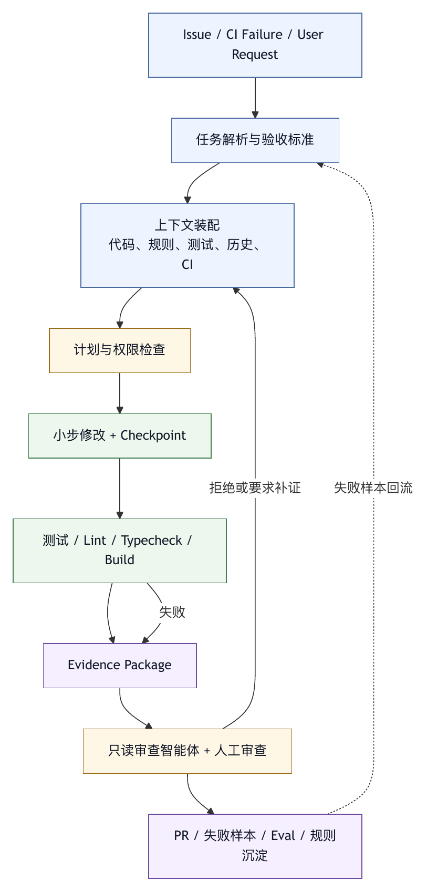

# 第三十六章 研发效能场景

## 36.1 研发效能不是写代码更快

智能体进入软件研发后，最容易被包装成“写代码更快”。这当然有价值，但研发效能远不止代码生成速度。研发效能关注从需求到交付的整体流动：理解需求、定位代码、修改实现、运行测试、审查 diff、修复 CI、合并发布、处理事故、沉淀经验。

如果智能体只让开发者更快生成补丁，却增加审查负担、引入更多回滚、扰乱 CI、制造不可信代码，那么整体效能可能下降。

因此，研发效能场景中的 harness 应围绕软件交付流程设计，而不是围绕“生成代码”设计。

它要关心：

- 任务从哪里来。
- 上下文如何获取。
- 修改如何控制。
- 测试如何运行。
- 审查如何支持。
- CI 如何接入。
- 指标如何解释。
- 失败如何沉淀。

## 36.2 从 issue 到 PR 的工作流

研发场景中，典型智能体工作流是从 issue 到 PR。

一个成熟 harness 应支持：

1. 读取 issue 和相关讨论。
2. 识别需求、约束和验收标准。
3. 搜索代码和项目规则。
4. 生成计划。
5. 小范围修改文件。
6. 运行相关测试。
7. 查看 diff。
8. 生成 PR 描述。
9. 回应审查反馈。
10. 更新证据包。

每一步都有风险。Issue 可能含外部注入；代码搜索可能漏掉重要文件；计划可能过宽；修改可能触碰无关模块；测试可能未覆盖；PR 描述可能夸大完成度。

Harness 的任务是把流程拆成可观察节点，并在关键节点设置门禁。不要让智能体一口气从 issue 读到自动提交 PR，中间没有 trace、diff、测试和人工判断。

## 36.3 上下文：代码、规则、历史和 CI

研发效能场景对上下文要求很高。代码本身只是其中一部分。

需要的上下文包括：

- 相关文件。
- 目录结构。
- 项目规则。
- 测试命令。
- 构建配置。
- 依赖版本。
- 最近 diff。
- Issue 背景。
- PR 评论。
- CI 失败日志。
- 设计文档。
- 代码所有权。
- 过往类似修复。

这些上下文来源可信度不同。代码和测试是强事实，issue 是需求输入，评论可能包含注入，设计文档可能过期，CI 日志可能含噪声。Harness 应标注来源和时间，而不是把所有文本混在一起。

IDE 智能体、终端智能体和云端智能体的上下文方式不同。IDE 更容易知道当前文件和编辑状态；终端更接近测试和 git；云端更适合后台长任务和远程环境。研发效能平台应允许多界面共享同一底层 trace 和规则。

## 36.4 修改策略：小步、可审查、可回滚

智能体修改代码时，应偏向小步。大而全的补丁难审查、难测试、难回滚，也更容易引入无关变化。

Harness 可以通过策略鼓励小步：

- 要求先计划再修改。
- 限制单次修改文件数量。
- 要求解释每个文件改动。
- 高风险路径需要审批。
- 生成文件与源文件分开处理。
- 修改后自动展示 diff 摘要。
- 每轮前建立 checkpoint。

小步策略提高可验证性，不等同于保守。研发效能的瓶颈常常不在打字速度，而在审查和验证。智能体如果能生成更小、更清楚、更有证据的补丁，就能提升效能。

## 36.5 测试和诊断工具

研发场景中的工具系统必须包含诊断。只会编辑文件的智能体不够。

诊断工具应支持：

- 发现项目测试命令。
- 运行相关测试。
- 运行 typecheck。
- 运行 lint。
- 运行 build。
- 解析失败日志。
- 复跑失败测试。
- 输出通过/失败摘要。
- 保留完整日志引用。

诊断工具需要权限。运行测试通常低风险，但可能耗时、联网、写缓存或触发服务。运行部署脚本则高风险。Harness 应区分 test、build、lint、deploy、migration。

测试结果应进入证据包。智能体最终说“已修复”时，应说明运行了什么、结果如何、哪些检查未运行。

## 36.6 审查与证据包

研发效能提升的关键之一，是降低审稿人负担。智能体不应只提交 diff，还应提交证据包。

证据包可以包括：

- 任务摘要。
- 修改文件列表。
- 关键 diff。
- 设计选择。
- 运行测试。
- 未运行检查。
- 风险和回滚。
- 对审查意见的回应。

审查智能体可以作为独立只读角色，对实现智能体的 diff 做审查。它应关注正确性、安全、无关修改、测试覆盖、项目规则和可维护性。审查智能体不应默认修改文件，否则审查边界会混乱。

人类审稿人仍然重要。智能体证据包的目标，是让人更快定位需要判断的地方，不是替代责任。

## 36.7 CI 与发布链路

CI 是研发效能场景的重要反馈面。智能体可以读取 CI 状态、失败日志和测试报告，帮助定位失败。但触发 CI、修改 CI 配置、重新运行 job、触发部署，需要不同权限。

Harness 应区分：

- 读取 CI。
- 分析失败。
- 复跑测试。
- 修改 CI 配置。
- 触发部署。
- 发布 release。

读取和分析通常低风险；部署和 release 是高风险。CI 配置也可能包含 secret、权限和供应链边界，不能被智能体随意修改。

CI 失败应进入 trace-to-eval。反复出现的失败模式可以沉淀为诊断命令、规则或评测样本。

## 36.8 指标：DORA 与本地信号

DORA 的软件交付指标为研发效能提供了重要宏观视角。DORA 早期围绕部署频率、变更前置时间、变更失败率和恢复时间观察软件交付表现；到 2024 年，DORA 进一步引入 deployment rework rate，并把指标组织为 throughput 与 instability 两个视角。〔注36-1〕 这为本书提供了指标演进的外部参照：研发效能指标不能被简化成固定仪表盘。

智能体可能让 lead time 变短，但如果审查负担上升、change failure rate 上升、回滚增加，整体质量反而变差。智能体也可能提高部署频率，但把更多小错误推向 CI。

因此，研发效能 harness 应结合本地信号：

- 智能体补丁接受率。
- 人工审查修改意见数量。
- 无关 diff 比例。
- 测试未运行比例。
- CI 首次通过率。
- 回滚率。
- 任务重新打开率。
- 平均人工介入次数。
- 从失败 trace 到 eval 的转化率。
- 用户信任评分。

指标要防止激励错位。如果只奖励智能体完成任务数量，它会倾向于给出更快但更不稳的结果。效能指标应同时看速度、质量、风险和学习。

## 36.9 常见失败模式

研发效能场景常见失败模式包括：

第一，把效能等同于代码生成速度。

第二，智能体不读项目规则就修改代码。

第三，修改范围过大，审查成本上升。

第四，测试命令猜错，但最终回答说已验证。

第五，CI 日志过长，模型被噪声淹没。

第六，PR 描述夸大完成度。

第七，审查智能体和实现智能体权限混淆。

第八，智能体自动触发发布链路。

第九，指标只看成功率和速度，不看失败率。

第十，失败没有进入回归评测。

这些问题说明，研发效能关注的是让智能体在正确边界内做可验证的事，而不是简单让智能体多做。

## 36.10 研发效能 Harness 检查表

设计研发效能场景时，可以使用以下检查表。

任务：

- Issue、PR、CI 和本地任务是否有统一入口？
- 用户目标和验收标准是否明确？

上下文：

- 是否加载项目规则、测试命令和相关文件？
- 外部评论是否标注为不可信输入？

修改：

- 是否限制范围并展示 diff？
- 是否有 checkpoint 和回滚？

诊断：

- 是否能运行相关测试、lint、typecheck 和 build？
- 输出是否摘要化并保留引用？

审查：

- 是否生成证据包？
- 是否支持只读 审查智能体？

CI：

- CI 读取、复跑、配置修改和发布是否分级权限？

指标：

- 是否同时看速度、质量、风险和学习？
- 智能体失败是否转成 eval？

研发效能的核心，是让可靠变更更快流动，而不只是让代码更快出现。

## 36.11 Delivery Flow Manifest

研发效能场景要避免“只看一次 agent run”。更好的做法，是把从任务到交付的流程建模为 delivery flow。每个 flow 都描述任务来源、允许动作、验证要求、交付物和指标归属。

```yaml
delivery_flow_manifest:
  id: bugfix-to-pr
  owner: developer-productivity
  task_sources:
    - issue
    - ci_failure
    - local_user_request
  allowed_profiles:
    - code-change-agent
    - readonly-review-agent
  context_requirements:
    required:
      - project_rules
      - relevant_files
      - test_commands
      - git_status
    optional:
      - issue_thread
      - recent_ci_logs
      - similar_patches
  mutation_policy:
    max_files_without_approval: 5
    sensitive_paths:
      - auth/
      - payment/
      - migration/
    generated_files_policy: separate_review
  verification:
    required_for_completion:
      - diff_summary
      - test_or_reason_not_run
      - risk_assessment
      - rollback_note
  handoff:
    pr_description_template: evidence_package_v2
    reviewer_mode: readonly
  metrics:
    attribution:
      team: owning_team
      workflow: bugfix
    collect:
      - agent_patch_acceptance
      - review_rework
      - ci_first_pass
      - rollback
```

这个 manifest 的价值，是让智能体在流程中工作，而不是只在聊天中工作。用户提出“修复这个 bug”时，harness 能知道这属于 bugfix-to-pr flow：需要加载规则和测试命令，需要限制修改范围，需要输出证据包，需要把结果归因到研发效能指标。

Delivery flow 也能帮助平台做差异化控制。修复文档拼写可以低门槛；修改认证逻辑必须高审批；分析 CI 失败可以只读；触发发布必须进入发布 flow。研发效能是一组不同风险的流程，不是一个单一场景。

## 36.12 Evidence Package for PR

智能体生成 PR 时，最重要的交付物是代码加证据，不只是代码本身。一个可审查 PR evidence package 可以包含：

```yaml
pr_evidence_package:
  task:
    source: issue-1842
    goal: "修复空配置导致的启动失败"
    non_goals:
      - "不重构配置加载框架"
  changes:
    files:
      - path: src/config/load.ts
        reason: "为缺失字段添加默认值"
      - path: tests/config/load.test.ts
        reason: "覆盖空配置输入"
    generated_files: []
  validation:
    commands:
      - command: "npm test -- config/load"
        result: passed
      - command: "npm run typecheck"
        result: not_run
        reason: "本地依赖未安装，未请求安装"
  risks:
    - "默认值可能影响旧配置兼容性"
  rollback:
    method: "revert PR or restore checkpoint cp-731"
  open_questions:
    - "是否需要迁移历史配置文件"
```

证据包应尽量由 trace 自动生成，再让智能体补充解释。若完全靠模型在最后总结，很容易遗漏未验证项或夸大成功。证据包应区分事实、推断和未完成事项。运行过测试是事实；“风险很低”是判断；“typecheck 未运行”是未完成事项。

审查智能体可以读取 evidence package 做二次审查。它不需要重新猜测智能体做了什么，而是检查证据是否充分、修改是否过宽、风险是否真实、未验证项是否可接受。

## 36.13 案例：CI 日志噪声让智能体修错方向

某团队把 CI 失败分析交给智能体。一次 PR 中，CI 日志超过十万行，包含依赖安装 warning、测试并发输出、缓存提示和最终失败堆栈。薄 harness 把截断后的末尾日志直接塞给模型。模型看到最后的 warning，判断是依赖版本问题，修改了 package 配置。实际失败点在更早的单元测试断言，末尾 warning 只是噪声。

这类事故很常见。CI 日志应被看作一组事件：阶段、命令、退出码、失败测试、堆栈、环境、artifact、重试记录。把日志当 prompt，会让模型被噪声带偏。

修复应从 harness 侧做：

- CI 连接器把 job、step、command、exit code、failed test、artifact 分成结构化字段。
- 日志裁剪优先保留失败 step、错误堆栈和最近代码变更相关片段。
- 智能体需要列出“失败证据”，不能只说“看起来是依赖问题”。
- 对依赖配置、CI 配置、构建脚本等高影响修改要求额外确认。
- CI 失败样本进入 eval，测试智能体是否能区分 warning 和 root cause。

研发效能 harness 的关键是让智能体读对日志，而不是读更多日志。可观测数据需要结构化，诊断结论需要证据，修复动作需要权限边界。

## 36.14 研发效能指标栈

智能体进入研发流程后，指标栈应分三层。

第一层是交付结果指标。包括 DORA 相关 throughput、instability 和 reliability 指标，以及团队本地的 lead time、首次 CI 通过率、回滚率、reopen 率。

第二层是智能体工作质量指标。包括补丁接受率、无关 diff 比例、证据包完整率、未验证声明拦截率、审查返工、人工介入次数、工具失败率。

第三层是学习指标。包括失败 trace 转 eval 比例、重复失败下降、规则复用率、诊断命令沉淀数、事故复盘关闭周期。

```text
交付结果
  lead time / deployment frequency / change fail / recovery / rework
        ^
        |
智能体工作质量
  patch acceptance / evidence completeness / 审查返工 / CI first pass
        ^
        |
学习闭环
  trace-to-eval / rules / diagnostic commands / postmortem actions
```

这三层要一起看。只看交付结果，难以判断智能体是否贡献价值；只看智能体工作质量，可能优化局部体验但不影响交付；只看学习指标，又可能变成平台内部自嗨。研发效能的真实改进，是更可靠的变更以更短反馈周期流动。

## 36.15 图 36-1：从 Issue 到 PR 的 Harness 流水线

图 36-1 将 issue、CI 失败或用户请求转成受控 PR 流程中的证据链。

<figure><figcaption><p>图 36-1：从 Issue 到 PR 的 Harness 流水线</p></figcaption></figure>

```text
Issue / CI Failure / User Request
        |
        v
任务解析与验收标准
        |
        v
上下文装配
  代码 / 规则 / 测试 / 历史 / CI
        |
        v
计划与权限检查
        |
        v
小步修改 + Checkpoint
        |
        v
测试 / Lint / Typecheck / Build
        |
        v
Evidence Package
        |
        v
只读审查智能体 + 人工审查
        |
        v
PR / 失败样本 / Eval / 规则沉淀
```

这条流水线把智能体放进软件交付，而不是放在软件交付旁边。每个节点都产生证据，每个失败都可以进入学习闭环。

## 36.16 研发任务对象模型

研发效能场景不能只把用户输入当作一段自然语言。一个研发任务至少应被建模为 task object。它包含来源、目标、验收标准、资源范围、风险等级、状态、证据和交付物。

```yaml
engineering_task:
  id: eng-task-1842
  source:
    type: issue
    system: github-enterprise
    object: issue-1842
  intent:
    category: bugfix
    goal: "修复空配置导致服务启动失败"
    acceptance:
      - "空配置文件不再抛出未捕获异常"
      - "保留现有配置兼容性"
  scope:
    repositories:
      - billing-service
    allowed_paths:
      - src/config/
      - tests/config/
    sensitive_paths:
      - src/auth/
      - migrations/
  risk:
    external_side_effect: none
    production_impact: medium
    requires_human_review: true
  evidence:
    required:
      - diff_summary
      - test_or_reason_not_run
      - risk_assessment
```

这个对象让 harness 可以把任务放入正确流程。Bugfix、重构、依赖升级、CI 诊断、代码审查、文档更新和安全修复，需要不同的上下文、权限、测试和证据。若所有任务都只是“帮我改一下”，智能体只能靠语言猜测流程边界。

任务对象还应支持状态迁移。一个任务可以从 triaged 进入 planned，再进入 editing、validating、reviewing、blocked、ready_for_pr 或 closed。状态变化要进入 trace，因为它解释智能体为什么停止、为什么请求审批、为什么未运行某项检查。

研发任务对象的目标是减少含混，不是增加表单。越是复杂的研发环境，越需要把“要做什么、能碰哪里、怎样算完成”结构化。

## 36.17 代码上下文检索与所有权

研发智能体的上下文检索不能只靠关键词搜索。真实仓库中，相关代码可能分散在调用链、配置、测试、类型定义、文档和生成代码中。Harness 需要组合多种上下文来源。

第一类是结构上下文。包括目录树、模块边界、依赖图、导入关系、符号定义、调用关系、测试文件映射和代码所有权。结构上下文帮助智能体判断改动范围。

第二类是文本上下文。包括 issue 描述、代码注释、README、设计文档、PR 讨论和历史修复。文本上下文帮助智能体理解人类意图，但可信度需要标注。

第三类是运行上下文。包括测试失败、CI 日志、构建输出、运行时错误、性能采样、监控告警和用户报告。运行上下文帮助智能体定位事实。

第四类是组织上下文。包括仓库规则、代码审查规范、敏感路径、发布节奏、owner、服务等级和安全要求。组织上下文决定哪些改动需要额外审查。

上下文检索应输出 Context Manifest，而不是直接把内容塞进 prompt。Manifest 应说明每段上下文的来源、时间、可信度、选择原因和遗漏风险。对于大型仓库，智能体还应能解释为什么没有读取某些路径。上下文不足时，正确行为是请求更多信息或降低完成声明，而不是自信地修改。

代码所有权尤其重要。某个文件属于支付、安全、数据平台或基础设施团队，风险完全不同。Harness 可以把 owner 作为策略输入：修改敏感 owner 的文件时，要求更严格测试、更详细证据包和特定审稿人。

## 36.18 计划、变更集与 Patch Queue

研发效能场景中的计划不应是装饰性文本。计划应约束后续修改，并与变更集对应。

一个实用计划至少包含：目标、非目标、将修改的文件或模块、验证方式、风险、回滚方式和需要人工确认的点。计划通过后，智能体的修改应被组织成 patch queue。每个 patch 有明确目的、涉及文件、前置条件和验证结果。

```yaml
patch_queue:
  task: eng-task-1842
  patches:
    - id: patch-1
      purpose: "为空配置输入补默认值"
      files:
        - src/config/load.ts
      expected_validation:
        - "config load unit test"
    - id: patch-2
      purpose: "增加回归测试"
      files:
        - tests/config/load.test.ts
      expected_validation:
        - "npm test -- config/load"
```

Patch queue 可以降低审查成本。审稿人不必从一个大 diff 中猜测意图，而是看到每组变更的目的和证据。若某个 patch 失败，也可以只回滚这一组，而不是放弃整个任务。

变更集还应处理用户未提交修改。研发智能体常在真实工作区中运行，用户可能已有本地改动。Harness 必须区分 user change 和智能体 change，避免覆盖用户工作。对于云端任务，也要记录基准 commit、分支和生成 diff。没有这些边界，智能体的补丁很难被信任。

## 36.19 测试选择与验证层级

研发智能体最常见的不可靠声明，是“已验证”。很多时候它只运行了一个窄测试，甚至没有运行测试，却在总结里暗示完成。Harness 应把验证分层。

第一层是静态验证。包括格式化、lint、typecheck、依赖解析、配置校验和安全扫描。它们能快速发现低级错误。

第二层是局部测试。包括与修改文件直接相关的单元测试、快照测试、组件测试和小范围集成测试。它们反馈快，适合智能体每轮自查。

第三层是场景测试。包括端到端流程、数据库依赖、消息队列、真实服务 mock 和跨模块用例。它们成本更高，但能验证业务路径。

第四层是 CI 验证。包括完整构建、矩阵测试、兼容性测试、平台测试和发布前门禁。它们更接近团队正式交付标准。

第五层是生产后信号。包括回滚、告警、错误率、性能、用户反馈和任务 reopen。它们证明变更在真实环境中的表现。

智能体的完成声明必须绑定验证层级。它可以说“局部单元测试通过，未运行完整 CI”，不能说“全部修复”。若验证缺失，证据包应保留缺口。质量门禁可以要求：触碰关键路径时必须至少到第三层，触碰配置和依赖时必须运行静态验证，触碰发布链路时必须等待 CI。

SWE-bench 把真实 GitHub issue、代码库和测试验证结合起来，提醒我们软件工程任务需要在环境中生成并验证补丁，而非静态问答。〔注36-2〕 企业内部场景还要进一步补齐权限、审查、组织规则和外部系统边界。

## 36.20 CI 诊断 Pipeline

CI 诊断适合智能体，但前提是 harness 先把 CI 结果结构化。原始日志太长、太杂、太容易误导。一个 CI 诊断 pipeline 可以分为五步。

第一步，收集。连接器读取 workflow、job、step、命令、退出码、失败测试、artifact、环境变量摘要、重试信息和关联 commit。

第二步，归因。系统把失败归入依赖安装、编译、类型检查、测试断言、快照、超时、资源不足、网络、权限、flake 或基础设施异常。归因可以先由规则完成，再由模型补充解释。

第三步，裁剪。日志裁剪优先保留失败 step、错误堆栈、相关文件、最近 diff 和历史相似失败。无关 warning、下载进度和重复输出应降权。

第四步，诊断。智能体生成候选根因，并列出证据。没有证据的根因只能作为假设。若候选根因涉及依赖版本、CI 配置、构建脚本或环境镜像，修改前应要求更高审批。

第五步，验证。修复后运行最小复现测试，必要时触发 CI 复跑。复跑结果应与原失败对象关联，避免“另一个 job 通过”被误解成“原问题解决”。

```yaml
ci_failure_digest:
  workflow: pull-request
  job: unit-tests
  failed_step: "npm test"
  exit_code: 1
  failed_tests:
    - "config load handles empty file"
  likely_category: test_assertion
  noisy_sections_removed:
    - dependency_warning
    - cache_restore
  evidence:
    - "tests/config/load.test.ts: expected default port"
  suggested_next_action:
    - "inspect config defaulting logic"
```

CI 诊断 pipeline 的价值，是让模型面对结构化事实，而不是面对日志洪水。

## 36.21 审查智能体与人类审稿人的分工

审查智能体的价值，是提前发现机械性、证据性和一致性问题，不是替代人类审稿人。它适合检查：diff 是否超出计划、是否触碰敏感路径、是否缺测试、PR 描述是否夸大、证据包是否缺失、是否违反项目规则、是否有明显安全风险。

人类审稿人更适合判断业务语义、架构取舍、长期维护成本、团队约定和风险接受。Harness 应把两者分工写进流程。

一种可靠模式是三段式审查。

第一段，智能体自审。实现智能体在提交前检查自己的 diff、测试和证据包，修正明显问题。

第二段，只读审查智能体审查。它不能改文件，只能输出 findings、风险、缺口和建议。这样可以避免“审查者偷偷重写实现”的边界混乱。

第三段，人类审稿人判断。人类看到的是 diff、证据包、审查智能体 findings 和未验证项。若人类要求修改，反馈进入下一轮任务对象。

审查智能体的输出也应有质量门禁。它不能泛泛说“代码质量良好”，而应引用具体文件、规则和证据。若它未读取关键上下文，应说明限制。审查本身也是智能体行为，也需要 trace 和评测。

## 36.22 安全敏感代码与发布边界

研发效能场景很容易碰到安全敏感代码：认证、授权、支付、加密、数据迁移、权限策略、CI/CD、基础设施、审计、日志脱敏、客户数据和生产配置。Harness 应把这些路径和动作显式标出。

敏感路径策略可以包括：

- 修改前要求计划审批。
- 修改后要求更高级别测试。
- 必须生成风险说明。
- 必须指定 code owner 审查。
- 禁止自动合并。
- 禁止智能体直接触发发布。
- 需要安全 eval 或静态扫描。

发布边界也要分清。创建 PR、更新 PR 描述、添加审查意见、重新运行 CI、修改 release note、触发 staging 部署、触发生产部署，是不同风险等级。智能体可以辅助准备发布材料，但不应在没有明确授权的情况下进入生产发布链路。

GitHub Apps、审计日志和 Actions OIDC 这类企业代码平台能力提供了应用身份、审计和短期凭据模式的产品例证。〔注36-3〕 智能体接入这条链路时，应继承这些治理原则，而不是把发布权限藏在一个工具调用里。

## 36.23 多智能体协作的研发流水线

复杂研发任务常需要多智能体协作。一个智能体负责理解需求，一个智能体负责定位代码，一个智能体负责实现，一个智能体负责测试诊断，一个智能体负责审查。多智能体能提高并行度，但也会放大上下文不一致和并发编辑风险。

研发流水线中的多智能体协作应遵守三个原则。

第一，角色能力最小化。需求分析智能体只读 issue 和文档；定位智能体只读代码；实现智能体可写工作区；测试智能体可运行诊断命令；审查智能体只读 diff。不要让所有子智能体都拥有全部工具。

第二，交接对象结构化。子智能体不应只写一段自由文本总结，而应交付 evidence、file candidates、risk notes、test suggestions 或审查发现。结构化交接能被主智能体和人类检查。

第三，变更合并集中化。多个实现智能体不应同时直接写同一工作区。调度器可以让它们生成候选 patch，再由主流程合并、冲突检测和验证。

SWE-agent 对 Agent-Computer Interface 的强调，提供了一个重要参照：软件工程智能体的能力还取决于环境、shell、命令、历史处理和轨迹，模型只是其中一部分。〔注36-4〕 多智能体研发流水线更需要把这些环境行动变成可审计轨迹。

## 36.24 开发者体验：IDE、终端与云端任务

研发效能 harness 往往有多个入口：IDE、终端、Web、代码平台评论和云端后台任务。入口不同，用户期待也不同。

IDE 入口适合短反馈。用户正在看代码，智能体应尊重当前文件、选择范围、未保存修改和编辑器诊断。IDE 中的智能体应少打断、多解释 diff，并允许用户快速接受或拒绝局部改动。

终端入口适合诊断和验证。用户关心命令、输出、退出码、工作区状态和 git diff。终端智能体应清楚区分读命令、写命令、测试命令和危险命令，并保留可复制的验证证据。

云端任务适合后台长任务。它可以从 issue 或 PR 启动，在远程环境中运行，完成后提交 diff 或 PR。云端任务必须记录环境、仓库 commit、依赖安装、网络策略和所有外部写入。

代码平台评论入口适合窄任务，例如“解释这个失败”“补测试”“回应这条审查意见”。这种入口需要把评论、diff hunk、文件上下文和权限范围一并传入，避免智能体脱离评论上下文大范围修改。

不同入口应共享底层任务对象、trace、规则和证据包。否则同一任务在 IDE、终端和云端各有一套状态，用户会失去控制感。

## 36.25 研发效能数据模型

要衡量智能体对研发效能的影响，必须先定义数据模型。没有统一事件语言，指标会变成不可比较的统计。

研发效能数据可以从五类事件构建。

第一，任务事件。Issue 创建、任务分派、agent run 开始、计划生成、人工确认、阻塞、完成、关闭、重新打开。

第二，变更事件。文件修改、diff 生成、patch 应用、checkpoint 创建、回滚、PR 创建、审查意见、merge。

第三，验证事件。测试运行、lint、typecheck、build、CI job、失败分类、复跑、验证缺口。

第四，协作事件。人工审批、审查智能体 findings、人工审查、反馈处理、handoff、冲突解决。

第五，学习事件。失败样本入库、eval 运行、规则更新、诊断命令新增、复盘行动关闭。

Four Keys 项目从开发环境事件汇总软件交付指标，可作为“指标来自工具链事件，而不是来自主观回忆”的工程例证。〔注36-1〕 智能体场景也一样。平台应把智能体行为纳入同一事件模型，才能回答：某类任务是否更快了，质量是否下降了，返工是否减少了，失败是否沉淀成资产。

## 36.26 指标防误用

研发效能指标很容易被误用。引入智能体后，这个风险更大。

第一种误用，是把 agent run 数量当生产力。Run 多可能只是失败多、重试多、任务拆得碎。它只能说明使用量，不能说明价值。

第二种误用，是把补丁生成速度当 lead time 改进。完整 lead time 包括理解、验证、审查、CI、等待和发布。智能体只缩短编辑时间，不一定缩短交付时间。

第三种误用，是把测试通过当质量。测试可能覆盖不足，智能体可能只运行了容易通过的子集，或误把未运行检查说成已完成。

第四种误用，是把人类修改减少当信任提高。人类可能因为疲劳而少审，也可能因为 diff 过大而放弃细看。应结合 defect、rollback、reopen 和审稿人反馈。

第五种误用，是把 DORA 指标直接归因给智能体。DORA 是组织交付能力指标，受团队结构、部署架构、测试体系、产品节奏和流程影响。智能体是其中一个干预因素，不应被单独夸大。

2024 年 DORA 报告对 AI 的讨论提示了这种复杂性：AI 采纳与文档质量、代码质量和代码审查速度（review speed）的改善相关，但也可能伴随交付吞吐和稳定性的下降。〔注36-1〕 因此，研发效能 harness 要用指标做学习，避免把指标变成单向宣传。

## 36.27 失败样本到 Eval 的闭环

研发效能平台的长期价值，来自失败样本沉淀。每一次智能体修错方向、误读 CI、漏跑测试、触碰敏感路径、生成不可信 PR 描述，都应成为改进候选。

失败样本进入 eval 前，需要整理成稳定对象：

- 输入任务。
- 初始上下文。
- 智能体行为轨迹。
- 错误输出或错误补丁。
- 正确期望。
- 失败分类。
- 触发的 harness 边界。
- 回归检查方式。

例如，CI 日志噪声事故可以转成 eval：给智能体一段结构化 CI digest 和若干噪声日志，要求它识别失败测试、拒绝无证据依赖升级，并提出最小修复路径。若未来某次工具描述修改让智能体又被 warning 带偏，eval 会提前暴露。

失败样本也可以沉淀为规则、工具改进或界面改进。若智能体经常忘记说明未运行检查，可以改 evidence package 模板；若经常误读某类测试日志，可以改 CI digest；若经常请求过宽权限，可以改 delivery flow 的默认策略。

从失败到 eval 的闭环，是研发效能和 harness engineering 的交汇处。没有闭环，智能体只是更快地产生下一次失败。

## 36.28 研发效能 Eval Set

研发效能场景需要专门 eval set，不能只依赖公开 benchmark。公开 benchmark 对模型能力很有价值，但企业场景还包含私有代码、内部工具、权限、协作和流程。

一个研发效能 eval set 可以包含：

第一，issue-to-patch 样本。验证智能体是否能理解需求、定位文件、生成小补丁、补测试并说明风险。

第二，CI-diagnosis 样本。验证智能体是否能从结构化 CI digest 中找到根因，区分 warning、flake、环境故障和真实断言失败。

第三，审查意见回应样本。验证智能体是否能理解审查意见，做最小修改，并在证据包中回应反馈。

第四，context-boundary 样本。验证智能体是否能遵守仓库规则、敏感路径、用户未提交修改和只读模式。

第五，security-sensitive 样本。验证智能体触碰认证、权限、支付、迁移和 CI/CD 时是否请求审批、运行更强验证并避免自动发布。

第六，evidence-quality 样本。验证最终 PR 描述是否区分事实、推断和未验证项，是否引用测试和 diff。

第七，multi-agent 样本。验证多智能体之间是否结构化交接、是否避免并发编辑冲突、是否保留每个角色的 trace。

这些 eval 应来自真实失败和真实任务的脱敏版本。合成样本可以补覆盖，但不能替代生产 trace。研发效能 eval 的目标，是验证“可靠交付流动”，不是单题得分。

## 36.29 采用路径

研发效能智能体的采用应从低风险、高反馈场景开始。

第一阶段，理解和诊断。让智能体做代码解释、issue 总结、CI 失败摘要、测试命令发现和 PR 风险提示。此阶段只读为主，重点建立上下文装配、trace 和证据包。

第二阶段，小范围修改。允许智能体修文档、补测试、小 bugfix 和局部重构。要求 checkpoint、diff 摘要、测试或未测试说明，以及人工审查。

第三阶段，工作流接入。把智能体接入 issue、PR、CI 和代码平台，支持从 issue 到 PR 的 delivery flow，建立 审查智能体、失败样本和研发效能指标。

第四阶段，平台化运营。对不同团队提供 profile、场景 eval、成本归因、连接器治理和组织学习机制。此时智能体不再是个人工具，而是研发平台的一部分。

采用路径应避免过早自动化发布和合并。合并、部署、发布和生产变更代表组织责任，不应因为智能体在局部任务上表现良好就立即开放。先让智能体成为可靠的助手，再让它进入更高风险链路。

## 36.30 成熟度模型

研发效能 harness 可以按五级成熟度评估。

L0 是代码生成助手。智能体能生成片段或回答代码问题，但不理解仓库规则、测试、CI 和代码审查。

L1 是工作区助手。智能体能读写文件、搜索代码、运行部分命令和展示 diff，但证据包、权限和 trace 较弱。

L2 是可验证补丁系统。智能体能按 delivery flow 修改、运行相关测试、生成 PR evidence package、保留 checkpoint，并接受 审查智能体和人类审查。

L3 是研发流程平台。智能体与 issue、PR、CI、代码所有权、连接器、指标和 eval 联动，失败样本进入学习闭环，团队可以按场景配置 profile。

L4 是组织学习型研发系统。平台能从跨团队 trace 中发现重复失败，自动生成诊断工具和 eval，按指标调整 harness，形成规则、技能、测试和培训资产。

成熟度评估能帮助团队避免错配。一个 L1 系统不应承担自动修复生产事故；一个 L2 系统可以承担低风险 bugfix；一个 L3 系统才适合大规模接入研发流程；L4 则需要组织学习机制支撑。

## 36.31 设计评审问题清单

设计研发效能场景时，可以用以下问题检查是否已经进入工程体系。

任务入口方面：任务来源是否结构化？验收标准是否明确？Issue、PR 评论和 CI 日志是否被标注为不同可信度的输入？

上下文方面：是否加载项目规则、测试命令、代码所有权和相关历史？是否能解释上下文选择与遗漏？

修改方面：是否有计划、变更集、checkpoint、diff 摘要和回滚方式？是否区分用户修改与智能体修改？

验证方面：是否定义了验证层级？完成声明是否绑定具体测试、lint、typecheck、build 或 CI 证据？

评审方面：是否生成证据包？审查智能体是否只读？人类审稿人是否能快速看到风险和未验证项？

权限方面：CI、发布、敏感路径、外部评论、合并和部署是否分级治理？

指标方面：是否同时看速度、质量、风险、成本和学习？是否防止把 run 数量当作生产力？

学习方面：失败是否能进入 eval、规则、诊断工具和培训材料？重复失败是否下降？

若这些问题没有明确答案，研发智能体很可能只是在局部提高编辑速度，还没有提升研发效能。

## 36.32 产品界面：让研发人员看见边界

研发效能 harness 最终要落在产品界面上。开发者不应只看到一个聊天框和一段最终总结，而应看到智能体正在使用哪些上下文、准备修改哪些文件、运行了哪些检查、哪些风险仍然存在。

在 IDE 中，界面应突出 diff 和局部意图。每个文件改动旁边最好能看到“为什么改”“对应哪个验收标准”“是否有测试覆盖”。对于生成代码和源代码修改，应有不同标识。用户接受改动时，接受的是一个可理解变更集，而不是一整块不可分辨的模型输出。

在终端中，界面应突出命令和证据。命令应按读取、诊断、修改、外部副作用分级。测试输出应摘要化，但完整日志要可回查。若智能体因权限或预算停止，终端不应只显示失败，而应说明下一步可以由用户确认、降级或手动处理。

在代码平台中，界面应突出 PR evidence package。审稿人打开 PR 时，先看到任务来源、非目标、修改范围、验证结果、未验证项、风险和回滚方式，再进入 diff。审查智能体的 findings 应与人类评论分开显示，避免模型意见伪装成团队结论。

在管理视图中，界面应突出流动和学习。团队负责人需要看到哪些任务使用智能体、接受率如何、审查负担是否下降、CI 首次通过是否改善、哪些失败进入 eval、哪些规则最近更新。没有这种视图，研发效能只能停留在个体感受。

界面设计的核心，是让智能体行为不神秘。开发者越能看清边界、证据和风险，越愿意把智能体放进真实工作流。

## 36.33 研发组织流程接口

研发效能不是单人效率问题。智能体进入团队后，会改变需求拆分、代码审查、CI 维护、发布节奏和事故处理。Harness 需要与组织流程对接。

第一，需求入口要可操作。Issue 应尽量包含问题、预期行为、复现方式、影响范围和验收标准。若 issue 模糊，智能体应进入澄清状态，而不是猜测实现。平台可以提供 issue readiness gate，判断任务是否适合交给智能体。

第二，代码审查责任要清楚。智能体可以准备证据、回应评论、修复小问题，但最终合并责任仍属于人类 owner 或团队流程。若组织决定允许某些低风险自动合并，也必须明确定义风险范围、回滚条件和审计。

第三，CI 维护要有 owner。智能体诊断 CI 失败时，可能发现测试 flaky、环境不稳定或脚本过旧。它可以提出修复建议，但 CI 平台 owner 需要决定是否修改基础设施。否则每个业务团队的智能体都可能对 CI 配置做局部修补，长期造成更大混乱。

第四，安全和合规要前置。敏感路径、数据处理、依赖升级、许可证、供应链和发布权限，不应在 PR 最后一刻才审查。Delivery flow manifest 应把这些边界提前放进任务对象。

第五，经验沉淀要有节奏。团队可以每周查看智能体失败队列，每月更新 eval 和规则，每季度评估研发效能指标。没有节奏，失败样本会堆积成日志；有节奏，失败才会变成组织学习。

组织流程接口的目标，是让智能体进入现有软件工程系统，而不是在系统之外制造一条无人负责的捷径。

## 36.34 案例：自动补测试造成覆盖幻觉

某团队使用智能体修复小 bug，并要求“顺便补测试”。智能体根据实现代码生成了一个单元测试，测试确实通过，PR evidence package 也显示“新增测试已通过”。审稿人因为看到测试通过，快速批准。几天后线上又出现类似问题，复盘发现新增测试只是验证了实现中的默认分支，没有覆盖真实输入组合。

这类问题不止是“智能体不会写测试”，更常见的是测试目标没有进入 harness。智能体补测试时，必须知道测试要防止哪类回归、覆盖哪个行为、是否来自 issue 复现、是否能在旧代码上失败。如果测试在旧代码上也能通过，它就不能证明修复有效。

修复方案包括：

- Evidence package 中增加 test intent 字段，说明每个测试对应的行为风险。
- 对 bugfix flow 要求至少一个回归测试能在修复前失败，或说明为何无法验证。
- 审查智能体检查测试是否只覆盖实现细节，而不是用户可观察行为。
- 对关键缺陷保留最小复现输入，并进入 eval set。
- 测试生成工具返回覆盖说明，而不只返回“测试通过”。

研发效能 harness 不应把“有测试”当作终点。测试必须与需求、失败、行为和回归风险连接。缺少这种连接时，智能体可能更快地产生看似完整、实则脆弱的交付物。

## 36.35 ROI 与投资判断

研发效能智能体的投资回报不能只用节省工时计算。很多价值来自更短反馈、更少上下文切换、更稳定的证据包、更快的失败学习和更低的审查不确定性。

可以从四个维度评估 ROI。

第一，时间维度。智能体是否减少定位时间、测试诊断时间、PR 描述时间、CI 失败分析时间和审查往返时间。这里要区分“开发者感觉更快”和“交付链路真实变短”。

第二，质量维度。智能体生成的补丁是否更小、更符合规则、测试更完整、回滚更少、reopen 更少。质量下降会抵消所有速度收益。

第三，风险维度。智能体是否把高风险修改提前暴露，是否减少未验证声明，是否让外部副作用可审计，是否让敏感路径改动更可控。

第四，学习维度。失败是否进入 eval，规则是否更新，诊断工具是否沉淀，重复问题是否减少。没有学习维度，平台只能靠不断增加人工支持维持。

ROI 还应考虑负成本：审稿人疲劳、CI 资源消耗、误修改恢复、平台维护、连接器治理和用户培训。成熟研发效能平台会把这些成本显性化，而不是只展示成功案例。

投资判断可以采用阶段门禁。只有当只读诊断阶段证明用户信任和证据质量足够，再开放小范围修改；只有当小范围修改证明回滚和测试可靠，再接入 PR 工作流；只有当 PR 工作流证明质量和指标稳定，再讨论更高风险自动化。这样，研发效能建设不会被单次演示效果牵着走。

## 36.36 与前文能力层的对应关系

第三十六章是场景章，也在综合使用前文所有 harness 能力。

从第二编看，它依赖模型契约、上下文装配、行动循环、工具系统、工作区和记忆。研发智能体的每一次行动，都需要知道模型能做什么、上下文从哪里来、工具如何调用、文件如何修改、历史经验如何进入任务。

从第三编看，它依赖权限、sandbox、人工审批、guardrail 和回滚恢复。研发场景中的 shell、git、CI、外部评论、敏感路径和发布链路，都不能靠一句“请小心”治理。

从第四编看，它依赖 trace、eval、软件工程评测、成本容量和质量门禁。研发效能是否真实提升，只能通过运行证据、测试、审查、指标和回归样本判断。

从第五编和第六编看，它依赖 Agent OS、终端式智能体、多智能体调度、插件协议、企业集成、观测演化、自动改进、学习资产和版本迁移。研发效能对应完整 Agent OS 在软件工程领域的投影，不能按孤立功能设计。

这种对应关系提醒读者：场景落地不能把通用智能体换个提示词。每个场景都要重新组合模型、工具、权限、评测、交互和组织流程。研发效能场景之所以重要，是因为它把这些要素压缩在一个高频、高风险、证据充分的环境里。

## 36.37 最小可行实施清单

一个团队若要把研发效能智能体从试用推进到可依赖的内部工具，可以先完成一组最小实施清单。

第一，定义两个 delivery flow：只读诊断 flow 和小范围 bugfix-to-pr flow。前者只能读取 issue、代码和 CI；后者允许修改有限文件并要求证据包。

第二，建立项目规则入口。至少包括测试命令、代码风格、敏感路径、生成文件策略、审查要求和完成声明格式。规则应由仓库 owner 维护，而不是写死在智能体提示词中。

第三，接入三个连接器：代码仓库、CI 和 issue/PR 系统。连接器必须返回结构化对象，而不是把网页或日志原文直接交给模型。

第四，启用 checkpoint、diff 摘要和 PR evidence package。任何写入都要能解释来源、目的、验证和回滚。

第五，建设第一批 eval。样本不需要多，但要覆盖真实失败：误读 CI、漏跑测试、PR 描述夸大、无关 diff、敏感路径修改和审查反馈误解。

第六，建立每周改进节奏。查看失败队列，选择少量高价值样本，更新规则、工具或 eval。研发效能智能体的质量无法靠一次上线取得，需要在真实任务中持续校准。

这组清单不追求一步到位，却能把团队从“试试看智能体能不能写代码”带到“用证据管理智能体如何参与交付”。这是研发效能场景最重要的转变。

验收这组清单时，可以选择十个真实历史任务回放：五个成功修复，五个失败或返工案例。若智能体能在不扩大权限的前提下复现上下文、给出可审查计划、生成较小变更、明确验证缺口，并把失败转成样本，说明团队已经具备继续扩大场景的基础。若只能完成成功案例，却无法解释失败和权限边界，就还停留在演示阶段。采用应从可复盘和可度量开始，再在真实任务中持续校准。

## 36.38 第三十六章小结

研发效能场景是 coding-agent harness 最直接的落点。它要求智能体进入从 issue 到 PR、从本地测试到 CI、从 diff 到审查的完整软件交付流程。

成熟 harness 会把上下文、修改、诊断、审查、CI、指标和经验沉淀连接起来。它不追求生成最多代码，而追求更短反馈、更少返工、更清楚证据和更可靠交付。
