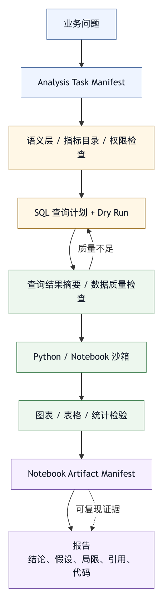

# 第三十七章 数据分析场景

## 37.1 数据分析智能体的特殊性

数据分析智能体与 coding agent 相似，都需要工具、上下文、状态和验证。但数据分析有自己的风险：数据权限、口径、血缘、隐私、统计误用、查询成本、结果可复现和可解释性。

一个数据分析智能体如果只是“把 CSV 交给模型，让模型写 Python”，可以解决小问题。但在企业环境中，分析任务往往涉及数据仓库、指标定义、权限、数据质量、业务口径、Notebook、图表、SQL、调度和审计。Harness 必须处理这些边界。

OpenAI 的 Code Interpreter 和 ChatGPT Data Analysis 提供了一个重要产品形态：模型可以在 sandboxed container 中写并运行 Python，处理文件，生成图表，做统计分析；API 文档也把容器、文件、内存层级、临时状态和生成文件引用作为工具接口的一部分。〔注37-1〕 本书据此归纳：数据分析智能体的核心，是安全执行分析过程，而不仅是回答问题。

## 37.2 数据源与权限

数据分析的第一问题是数据源。智能体可能处理：

- 用户上传文件。
- 数据库表。
- 数据仓库。
- BI 指标。
- 日志。
- 埋点数据。
- 文档表格。
- 外部 API。
- Notebook 输出。

每类数据源都有权限。用户能上传文件，不代表智能体可以把文件写入长期记忆；用户能查询某表，不代表智能体可以 join 所有表；智能体能看聚合指标，不代表能看明细数据。

Harness 应把数据权限做成工具层和连接器层的强约束：

- 列出可访问数据源。
- 查询前检查权限。
- 高敏数据脱敏。
- 限制导出。
- 限制外传。
- 查询结果按最小必要返回。
- 审计查询和下载。

数据分析智能体不能靠 prompt 保证合规。数据边界必须在连接器和执行环境中落实。

## 37.3 指标口径与语义层

很多数据分析错误发生在口径层，而非代码层。用户问“本周活跃用户下降了吗”，智能体需要知道“活跃用户”如何定义、时区是什么、去重规则是什么、数据延迟如何、是否排除测试账号、与哪个周期比较。

因此，数据分析 harness 需要语义层或指标目录。它应提供：

- 指标定义。
- 维度定义。
- 数据源表。
- 刷新频率。
- 负责人。
- 口径变更历史。
- 常见过滤条件。
- 可用粒度。

如果没有语义层，智能体会临时猜 SQL，结果看似合理但不可用。数据分析最怕“数字很精确，口径很错”。

智能体应在口径不明确时提问，或列出假设。最终报告应说明使用的指标定义和过滤条件。

## 37.4 SQL 工具与查询安全

SQL 是数据分析智能体的关键工具。SQL 工具设计直接决定安全性和成本。

一个安全 SQL 工具应支持：

- 只读默认。
- 禁止 DDL / DML，除非明确授权。
- 查询超时。
- 扫描量限制。
- 结果行数限制。
- 参数化查询。
- 表 allowlist。
- 敏感列脱敏。
- 查询计划或 dry run。
- 错误分类。
- 查询审计。

不要给模型一个无限制数据库连接。模型生成 SQL 的能力很强，但也可能写出高成本查询、错误 join、笛卡尔积、全表扫描或泄露明细的查询。

查询结果进入上下文前，也应摘要化。大表结果不应直接塞给模型。更好的方式是返回 schema、样例、聚合、统计摘要和完整结果引用。

## 37.5 Python / Notebook 沙箱

Python 沙箱适合处理文件、清洗数据、建模、画图和探索。Code Interpreter 这类工具的价值在于让模型不仅写代码，还能运行代码、观察结果、迭代分析。

但 Notebook 沙箱也需要边界：

- 文件访问范围。
- 网络访问。
- 内存限制。
- 运行时间限制。
- 包安装。
- 输出文件。
- 随机性。
- 图表保存。
- 代码和结果记录。

分析结果必须可复现。Harness 应保存生成的代码、输入文件引用、环境版本、图表、输出表和最终报告。如果智能体只给出自然语言结论，而不保留分析过程，用户无法审计。

Notebook 状态也要谨慎。长会话中，变量可能被覆盖，单元执行顺序可能影响结果。智能体最终报告应能从保存的代码和输入重跑，而不是依赖隐式内存。

## 37.6 数据质量与异常

数据分析智能体应主动检查数据质量。常见问题包括：

- 缺失值。
- 重复记录。
- 异常值。
- 时区错误。
- 数据延迟。
- 采样偏差。
- 口径变更。
- 表分区缺失。
- 日志丢失。
- join 键不唯一。

如果智能体不检查这些问题，可能生成漂亮但错误的图表。

Harness 可以把数据质量检查变成命令或工具。例如，查询结果返回时自动给出行数、空值比例、时间范围、唯一值数量、分区覆盖和异常提示。对于关键报告，可以设置质量门禁：必须说明数据范围、缺失情况、口径和未验证项。

## 37.7 图表与解释

数据分析结果常以图表呈现。图表不是装饰，它是结论证据的一部分。

智能体生成图表时，应注意：

- 轴和单位清楚。
- 时间范围清楚。
- 样本量清楚。
- 不滥用双轴。
- 不截断误导。
- 不把相关性写成因果。
- 保留生成代码。
- 图表与文字结论一致。

图表也要可追溯。用户应能知道图来自哪个数据源、哪段代码、哪个查询、哪个时间范围。企业报告尤其如此。

自然语言解释应标注不确定性。数据分析智能体不应用过度确定语气解释未经验证的原因。看到指标下降，不等于知道原因。Harness 应鼓励智能体区分观察、假设和验证。

## 37.8 报告与可复现产物

数据分析智能体的最终产物通常是报告。报告应包含：

- 问题。
- 数据来源。
- 口径和假设。
- 方法。
- 关键结果。
- 图表。
- 不确定性。
- 局限。
- 可复现代码或查询。
- 下一步建议。

报告不应只给结论。对于业务决策，用户需要知道结论是如何得到的。尤其在数据口径有争议时，透明过程比漂亮答案更重要。

Harness 可以提供报告模板和质量门禁。比如，任何数据分析报告必须列出数据时间范围、过滤条件、样本量和未验证项。

## 37.9 常见失败模式

数据分析 harness 常见失败模式包括：

第一，数据权限只靠 prompt 控制。

第二，指标口径不清，智能体自行猜定义。

第三，SQL 工具允许高成本或写入查询。

第四，大查询结果直接塞进上下文。

第五，Notebook 状态不可复现。

第六，图表没有数据来源和代码。

第七，相关性被写成因果。

第八，缺失值和异常值未检查。

第九，敏感明细进入报告或 trace。

第十，最终报告没有列出假设和局限。

这些失败会让数据分析智能体从助手变成风险源。

## 37.10 数据分析 Harness 检查表

设计数据分析智能体时，可以使用以下检查表。

数据源：

- 数据源是否有权限和审计？
- 明细数据和聚合数据是否分级？

语义：

- 指标定义、时区、过滤条件和口径是否明确？
- 口径不清时是否请求澄清？

查询：

- SQL 是否只读、限时、限量、限扫描？
- 是否有表和列级权限？

沙箱：

- Python / Notebook 是否有文件、网络、内存和时间限制？
- 代码和结果是否可复现？

质量：

- 是否检查缺失、重复、异常、延迟和 join 问题？

输出：

- 图表是否有来源、单位和代码？
- 报告是否列出假设、方法、局限和未验证项？

安全：

- 敏感数据是否脱敏？
- Trace 和报告是否避免泄露明细？

数据分析智能体的核心，是算得对、说得清、追得回，而不只是算得快。

## 37.11 Analysis Task Manifest

数据分析任务必须先变成结构化任务，再进入 SQL、Python 或 Notebook。缺少结构化任务时，智能体会直接写查询、画图、下结论，最后很难判断它到底回答了哪个问题。

```yaml
analysis_task_manifest:
  id: analysis-2026-05-27-retention-drop
  question: "上周新用户次日留存是否下降，原因可能是什么？"
  requester: growth-ops
  decision_context: "判断是否需要回滚 onboarding 实验"
  data_scope:
    allowed_sources:
      - metrics_mart.user_retention_daily
      - experiment.assignment
      - app_event.session_start
    denied_sources:
      - raw_user_profile
      - payment_detail
    sensitivity: aggregated_only
  metric_definitions:
    primary_metric: day1_retention
    timezone: Asia/Shanghai
    exclude:
      - test_accounts
      - internal_users
  time_range:
    baseline: "previous_4_weeks"
    comparison: "last_7_days"
  allowed_tools:
    - readonly_sql
    - python_sandbox
    - chart_renderer
  required_outputs:
    - query_list
    - data_quality_summary
    - chart
    - conclusion_with_uncertainty
    - reproducible_artifacts
```

Manifest 把业务问题、决策背景、数据范围、口径、工具和交付物放到一个对象中。它迫使智能体在执行前说明：用哪些数据、看哪个时间范围、使用哪个指标定义、不能访问哪些数据、最终报告要包含什么。

对于企业平台，analysis task manifest 还能接入权限系统。用户如果没有某张表权限，任务在查询前就应失败或要求授权，而不是让模型写出 SQL 后再报错。若任务只允许聚合数据，SQL 工具应限制明细导出。

## 37.12 语义查询计划

数据分析智能体不应直接从自然语言跳到 SQL。中间需要语义查询计划。这个计划把业务词汇映射到指标、维度、表、过滤条件和验证步骤。

```text
问题：为什么本周 DAU 下降？

语义查询计划：
1. 确认 DAU 定义：
   - 指标：daily_active_users
   - 去重键：user_id
   - 时区：业务默认时区
   - 排除：测试账号、内部账号
2. 时间拆分：
   - 本周 vs 前四周同星期
   - 工作日 / 周末分开
3. 维度拆分：
   - 平台
   - 国家 / 地区
   - app 版本
   - 渠道
4. 数据质量检查：
   - 事件延迟
   - 分区完整性
   - 埋点版本变更
5. 初步假设：
   - 产品变化
   - 渠道流量变化
   - 数据采集异常
```

语义查询计划应在执行前可见。用户可以纠正口径，例如“DAU 用登录事件，不用 session_start”，或者“本周要按 UTC 看”。这一步看似慢，实际上能避免大量精确但错误的 SQL。

计划还应进入最终报告。用户看到结论时，需要知道智能体是如何拆分问题的。对于复杂分析，透明的分析路径比单个数字更重要。

## 37.13 Notebook Artifact Manifest

Python / Notebook 沙箱的产物需要结构化记录。Code Interpreter 一类工具会在容器中生成文件和图表；OpenAI API 文档也明确建议把容器视为临时环境，并在容器有效期内下载需要的文件。〔注37-1〕

一个 notebook artifact manifest 可以包含：

```yaml
notebook_artifact_manifest:
  run_id: analysis-run-8842
  environment:
    python: "3.x"
    memory_limit: "4g"
    network: disabled
    container_lifetime: ephemeral
  inputs:
    - id: query-result-001
      source: readonly_sql
      rows: 182
      sensitivity: aggregated
    - id: uploaded-file-001
      filename: experiment_notes.csv
  code:
    notebook: notebook-8842.ipynb
    executed_order_verified: true
    random_seed: 42
  outputs:
    - type: chart
      file: retention_by_version.png
      source_cells:
        - cell-12
    - type: table
      file: segment_drop_summary.csv
      source_cells:
        - cell-15
  quality_checks:
    missing_values_checked: true
    outliers_checked: true
    time_range_checked: true
  report:
    linked_sections:
      - "关键发现"
      - "局限性"
```

这个 manifest 让数据分析从“模型在某处算过”变成“分析过程可复现”。它还帮助平台处理临时容器的生命周期：哪些文件需要保存，哪些文件可以删除，哪些输出可以进入报告，哪些输出含敏感数据不能分享。

Notebook artifact manifest 也可以作为评测对象。系统可以检查最终报告中的图表是否真的来自执行过的代码，表格是否来自允许的数据源，结论是否引用了对应产物。

## 37.14 案例：分母口径错误导致错误增长结论

某业务团队让数据分析智能体判断“新版本是否提升付费转化”。智能体查询了实验组和对照组的付费人数，并用“付费人数 / 安装人数”计算转化率。结果显示实验组提升显著。团队准备扩大实验。

人工复核时发现，实验系统的分流单位是“活跃用户”，而不是“安装用户”。新版本发布期间，安装数据包含大量未进入实验的人群。智能体使用安装人数作为分母，使实验组和对照组不可比。SQL 没有语法错误，图表也很漂亮，但业务口径错了。

这次错误暴露了数据分析 harness 的典型弱点：

- 任务没有 analysis manifest，决策背景和实验单位未记录。
- 指标目录没有强制提供分母定义。
- SQL 工具只检查权限和成本，不检查口径。
- 报告没有列出关键假设。
- 审稿人只看图表，没有看到语义查询计划。

修复后，平台增加了几项机制：

- 实验分析必须读取 experiment metadata，确认分流单位、实验时间和分组规则。
- 转化类指标必须显式声明 numerator 和 denominator。
- 报告必须列出“指标公式”和“适用人群”。
- 对常见实验问题建立 eval，检查智能体是否会误用安装人数、曝光人数和活跃人数。
- 高影响业务决策报告进入人工数据审稿流程。

数据分析智能体最危险的错误，是把计算对象选错；它未必不会算。Harness 要保护的是口径、权限、可复现和决策安全，不只是 SQL 语法。

## 37.15 图 37-1：数据分析 Harness 证据链

图 37-1 展示数据分析任务从业务问题到 manifest、查询、notebook、图表和报告的证据链。

<figure><figcaption><p>图 37-1：数据分析 Harness 证据链</p></figcaption></figure>

```text
业务问题
  |
  v
Analysis Task Manifest
  |
  v
语义层 / 指标目录 / 权限检查
  |
  v
SQL 查询计划 + Dry Run
  |
  v
查询结果摘要 / 数据质量检查
  |
  v
Python / Notebook 沙箱
  |
  v
图表 / 表格 / 统计检验
  |
  v
Notebook Artifact Manifest
  |
  v
报告：结论 / 假设 / 局限 / 引用 / 代码
```

这条证据链让每个结论都能追溯到数据、查询、代码和图表。数据分析智能体的可靠性来自这条链条，不来自自然语言解释的流畅程度。

## 37.16 数据分析任务生命周期

数据分析智能体的任务生命周期比普通问答更长。它通常经历澄清问题、确认口径、检查权限、制定查询计划、执行查询、检查质量、进入 Notebook 探索、生成图表、形成结论、人工审阅和归档产物几个阶段。Harness 应把这些阶段显式化。

第一个阶段是问题澄清。用户说“最近收入为什么下降”，这不是一个可直接执行的任务。智能体至少要确认收入口径、时间范围、业务线、币种、退款处理、税费处理、是否排除测试订单、是否按下单时间还是支付时间统计。没有这些信息，SQL 越快越危险。

第二个阶段是数据准入。系统检查用户是否有相关指标、表、文件和明细权限。准入失败时，应给出可行动路径：申请权限、改用聚合指标、缩小范围或让有权限的数据 owner 审阅。智能体不应通过让用户粘贴导出文件绕过权限系统。

第三个阶段是分析计划。计划把业务问题拆成可执行查询、质量检查和对比维度。复杂问题需要多个假设，而不是单条 SQL。例如“收入下降”可能来自流量下降、转化下降、客单价下降、支付失败、退款上升、汇率变化或埋点延迟。

第四个阶段是执行与观察。SQL、Python、Notebook 和图表工具都产生中间证据。每一步都应记录输入、输出、错误、成本和引用。

第五个阶段是报告与审阅。最终报告需要区分观察、解释、假设和建议。高影响分析应进入数据审稿流程，由业务 owner 或数据 owner 判断口径是否可接受。

第六个阶段是归档和学习。查询、代码、图表、报告、审阅意见和失败样本都应进入可追溯记录。若任务暴露出缺失指标、口径冲突或数据质量问题，应转成平台改进事项。

## 37.17 身份委托与数据权限模型

数据分析场景要从身份、任务、数据等级和资源对象一起判断权限，不能只问“智能体有没有权限”。身份委托是第一层。

常见身份模式包括 delegated user、team service account、analysis app identity 和高权限复核人。Delegated user 代表发起用户，适合大多数交互式分析；team service account 适合团队级周期报告，但必须限制数据域；analysis app identity 适合受管应用；高权限复核人适合少量高权限复核，必须有单独审计。

权限模型至少应覆盖表、列、行、指标、文件和导出六个层次。

表级权限决定是否能读取某张表。列级权限决定是否能看到手机号、邮箱、收入、地理位置、设备标识等敏感字段。行级权限决定是否能看到某个区域、客户、团队或业务线。指标权限决定是否能读取聚合后的业务指标。文件权限决定上传文件能否被长期保存、分享或作为 eval 样本。导出权限决定结果是否能下载、发邮件或写入报告。

SQL 工具和 Notebook 沙箱应共同执行这些权限。若 SQL 查询返回脱敏结果，Notebook 不应通过原始文件或缓存重新获得明细。若报告只允许聚合输出，图表工具也不应保存可反推单个用户的数据点。

Trace 中应记录权限决策，但要避免保存敏感明细。审计需要知道“谁在什么时候以什么身份查询了哪个数据对象”，不一定需要保存完整结果。这样既满足复盘，又降低二次泄露风险。

## 37.18 数据目录、血缘与新鲜度

数据分析智能体需要数据目录。没有目录，智能体只能靠表名猜测含义。表名相近、字段重名、历史口径迁移、临时表和废弃表都会导致错误。

数据目录应包含表说明、字段说明、owner、更新频率、分区字段、数据延迟、数据等级、质量状态、上下游血缘、常见 join 键、推荐查询示例和弃用状态。对于指标表，还应包含指标公式、维度、默认过滤条件和口径变更历史。

血缘信息能帮助智能体判断数据是否适合回答问题。一个表如果来自离线批处理，今天的数据可能不完整；一个指标如果最近更换埋点，环比变化可能来自采集变化；一个字段如果由多个上游表合并，缺失值可能来自某个上游分区缺失。

新鲜度也必须进入报告。用户问“今天是否异常”，如果最新分区只到昨天，智能体应明确说明不能回答今天。若数据延迟两个小时，实时分析应降级为“截至某时间的观察”。这类说明属于决策边界。

Data catalog 和 semantic layer 的质量，直接决定智能体的分析质量。模型可以写 SQL，但不能凭空知道企业内部数据口径。Harness 的任务，是把这些元数据结构化地交给智能体，并在缺失时要求澄清或拒绝高置信结论。

## 37.19 Query Runner 设计

数据分析场景中的 SQL runner 是权限、成本、质量和审计的执行点，不能按普通数据库客户端设计。

一个成熟 query runner 至少有七类能力。

第一，解析和分类。识别查询是只读、写入、DDL、导出、临时表、跨库 join 还是高风险函数。默认只允许只读查询。

第二，权限检查。把查询中的表、列、行过滤、指标和导出目标映射到用户权限。权限失败时给出清楚原因。

第三，成本预估。执行前做 explain、dry run 或扫描量估计。超过预算时要求改写查询、增加过滤条件或申请更高预算。

第四，安全改写。自动增加行数限制、分区过滤、敏感列脱敏和结果采样。改写必须进入 trace，不能悄悄改变口径。

第五，结果摘要。返回 schema、行数、列统计、空值比例、样例行和完整结果引用，而不是把全部结果塞进上下文。

第六，错误语义。区分权限不足、表不存在、分区缺失、语法错误、函数不支持、扫描超限、超时、数据源故障和可重试错误。

第七，审计。记录查询摘要、表列、扫描量、结果规模、身份、任务、报告引用和导出动作。

```yaml
readonly_query_result:
  query_id: query-771
  status: success
  tables:
    - metrics_mart.user_retention_daily
  columns:
    - ds
    - platform
    - day1_retention
  cost:
    scanned_gb: 1.8
    duration_ms: 2100
  result:
    rows: 56
    storage: result-ref-771
  quality:
    latest_partition: "2026-05-27"
    missing_partition: false
    null_warnings:
      - "platform null ratio 0.4%"
```

Query runner 的目标，是让 SQL 变成受治理的分析动作，不让模型直接驱动数据库。

## 37.20 查询预算与成本治理

数据分析智能体很容易制造高成本。一个自然语言问题可能触发多次探索性查询、宽表扫描、重复 join、Notebook 中的全量读取和图表分组。没有预算，成本会被隐藏在“分析更智能”的表象下。

预算应分为四层。任务预算控制一次分析最多能消耗多少查询和计算资源。查询预算控制单条 SQL 的扫描量、运行时间和结果规模。Notebook 预算控制 CPU、内存、文件大小和运行时长。报告预算控制最终可保存、导出和分享的结果范围。

预算不是单纯限制。它也能帮助智能体做更好的分析。若扫描量太高，智能体应先查询分区和样本；若结果太大，应先做聚合；若 Notebook 内存不足，应把聚合下推到 SQL；若多次查询重复扫描同一表，应缓存中间结果。

预算还要进入用户体验。用户应知道“本次分析已使用 6 次查询，扫描 12GB，Notebook 运行 3 分钟”。高成本分析可以要求确认，低成本分析则不必打断。对企业平台来说，成本归因要能落到团队、任务、数据源和报告。

成本治理的反面，是为了省钱而牺牲质量。若预算太低，智能体可能只看样本就下结论。正确做法是要求它说明预算限制和结论置信度，而不是假装完整分析已经完成。

## 37.21 Notebook 状态与可复现性

Notebook 是数据分析的强工具，也是可复现性的风险源。长会话中，变量状态、单元顺序、随机数、临时文件和包版本都会影响结果。智能体如果在 Notebook 中反复试错，最终报告可能依赖一个无法重跑的状态。

Harness 应要求 Notebook 产物具备四个属性。

第一，可重跑。最终报告中的图表和表格应能从保存的输入引用、代码、环境和参数重跑出来。若某一步依赖人工上传的文件，也要记录文件哈希和数据等级。

第二，顺序确定。Notebook 应保存执行顺序，或者导出为线性脚本。乱序执行会让审阅者无法判断结果来源。

第三，环境明确。Python 版本、主要库版本、随机种子、时区、 locale、内存限制、网络策略和工作目录都应记录。

第四，输出可引用。图表、表格和中间结果要有 artifact id。报告引用 artifact id，而不是复制粘贴图片和数字。

OpenAI Code Interpreter 和 ChatGPT Data Analysis 的产品形态提供了沙箱容器运行代码、处理文件和生成输出的例证。〔注37-1〕 企业 harness 需要在此基础上补上生命周期：容器何时创建、文件保留多久、谁能下载、哪些输出进入报告、哪些中间文件必须删除。

Notebook 还应防止“静默失败”。如果代码报错后智能体修改代码继续运行，最终报告应能看到哪些路径失败过。失败路径本身有价值，它们解释了为什么某些方法被放弃。

## 37.22 数据质量门禁

数据分析报告进入业务决策前，应经过数据质量门禁。门禁要求问题被看见、被解释、被纳入置信度，不要求所有数据完美。

基础门禁包括：时间范围是否覆盖、分区是否完整、行数是否异常、关键字段空值是否可接受、重复记录是否影响指标、join 后行数是否膨胀、过滤条件是否符合口径、最新数据是否延迟、样本量是否足够。

指标门禁包括：指标公式是否来自语义层，分子分母是否明确，维度是否允许下钻，时区是否正确，历史口径是否变更，是否存在实验、活动、节假日或埋点调整。

统计门禁包括：是否区分描述性统计和推断，是否说明置信区间、样本量、显著性或效应大小，是否避免把相关性写成因果，是否披露多重比较和选择性观察风险。

隐私门禁包括：报告中是否包含小样本明细、可识别个人、客户名称、内部账号、设备标识或敏感地理信息。必要时，系统应自动聚合、模糊化或阻止导出。

质量门禁输出应是可读对象：

```yaml
analysis_quality_gate:
  status: warn
  blockers: []
  warnings:
    - "latest partition delayed by 3 hours"
    - "segment android_cn sample size below default threshold"
  required_report_notes:
    - "report conclusions are valid through 2026-05-27 21:00"
    - "small segment comparisons should be treated as directional"
```

这样，门禁不只是拦截，也能把限制写进报告。

## 37.23 统计推断与因果边界

数据分析智能体很容易过度解释。看到指标变化后，它会倾向于给出原因；看到两个曲线同向变化后，它会暗示因果；看到某个分组下降后，它会建议行动。Harness 必须把统计推断边界写进交互和报告。

第一，描述不等于解释。“DAU 下降 8%”是观察，“因为新版本导致”是因果假设。报告应分栏呈现：观察、可能解释、已验证证据、尚未验证。

第二，相关不等于因果。渠道变化、节假日、数据延迟、实验分流、埋点变更、样本结构变化，都可能造成相关性。智能体应避免把未控制混杂因素的比较写成结论。

第三，显著不等于重要。大样本下很小差异也可能显著，但业务影响不大。报告应同时说明绝对差异、相对差异、样本量和业务量级。

第四，不显著不等于没有影响。小样本或高噪声可能导致检验无力。智能体应说明“没有足够证据”而不是“没有影响”。

第五，探索不等于验证。智能体在 Notebook 中做大量分组探索时，很容易找到看似异常的子群。若这是事后发现，应标注为探索性发现，并建议后续验证。

对于高影响决策，harness 可以要求因果审阅：实验元数据、分流单位、样本平衡、暴露定义、干预时间、污染风险和统计方法都需要复核。分母口径错误案例已经说明，数学正确不能替代实验设计正确。

## 37.24 隐私、脱敏与保留

数据分析场景是隐私风险高发区。用户上传的 CSV 可能包含客户名单，SQL 查询可能返回设备标识，Notebook 输出可能保存中间明细，trace 可能记录样例行，报告图表可能通过小样本反推出个人。

Harness 应采用分层保留策略。

原始数据默认短期保留，只供当前任务使用。敏感明细不应进入长期 trace、记忆或 eval。聚合结果可以保留更久，但要记录聚合粒度和最小样本阈值。Notebook 代码和查询可以长期保存，因为它们支撑复现；但代码中的内联数据、打印样例和错误堆栈要脱敏。

脱敏不只是替换邮箱。它包括列级掩码、行级过滤、小样本抑制、哈希、分桶、截断、采样、差分隐私或仅返回聚合。具体策略取决于数据等级和使用场景。

Trace 应记录处理策略。例如“原始结果未持久化，只保存 result reference”“报告图表按国家聚合，最小样本阈值为 100”“Notebook 临时文件将在 24 小时后删除”。这样，审计者可以判断平台是否执行了数据治理，而不用查看敏感内容。

数据分析 eval 也要脱敏。真实失败样本很有价值，但不能把客户数据、内部收入、员工信息和未公开指标直接放入评测集。样本化应保留失败结构，替换具体值和实体。

## 37.25 表 37-1：数据分析报告证据包

数据分析报告应有 evidence package。报告正文面向决策者，证据包面向复核者和未来复盘。

表 37-1 给出报告证据包的最小结构。

| 证据项 | 证明什么 | 审阅关注点 |
|---|---|---|
| 业务问题和决策背景 | 分析服务于哪个业务判断 | 问题是否足够明确，结论是否越过决策范围。 |
| Analysis task manifest | 任务范围、输入、权限和输出要求 | manifest 是否与实际查询和报告一致。 |
| 指标定义和口径版本 | 分子、分母、维度、时区、过滤条件 | 口径是否来自受信来源，版本是否可追溯。 |
| 查询列表、查询摘要和 result reference | 数据从哪里来，如何被取出 | 查询是否可复跑，结果引用是否稳定。 |
| 数据质量检查结果 | 数据是否足以支撑结论 | 空值、重复、延迟、样本量和 join 膨胀是否已检查。 |
| Notebook artifact manifest | 分析代码、环境和中间产物 | 代码是否可复现，敏感中间结果是否被控制。 |
| 图表和表格 artifact id | 报告中的数字和图形来源 | 图表是否能追溯到查询和代码，而不是截图粘贴。 |
| 统计方法和假设 | 解释和推断采用什么方法 | 假设是否显式，相关性是否被误写成因果。 |
| 未验证项和限制 | 哪些结论仍不确定 | 限制是否放在决策者可见位置。 |
| 人工审阅意见 | 谁接受了口径和风险 | 审稿人是否覆盖高影响结论。 |
| 报告版本和发布时间 | 读者看到的是哪一版报告 | 修订是否说明数据更新、口径变更或代码修正。 |

证据包应由 trace 自动生成，再由智能体补充解释。完全手写的证据包容易遗漏，完全模型生成的证据包容易夸大。自动证据负责事实，模型负责叙述，人类负责风险接受。

报告也应支持版本化。分析报告经常会被修订：新增数据、调整口径、补充维度、修正图表。每次修订都应说明变更内容和影响。若一个关键结论变化，读者应能看到原因是数据更新、口径变更、代码修正还是解释改变。

对于业务决策，报告证据包是责任边界。它让后续团队能追问：当时看了哪些数据，哪些没有看，谁接受了限制，为什么作出决定。

## 37.26 人工数据审稿人

数据分析智能体不应独自承担高影响决策。人工数据审稿人是必要角色，尤其在指标口径、实验结论、财务分析、合规数据和客户影响分析中。

数据审稿人的职责是检查关键判断，不是重跑所有代码：问题是否被正确理解，指标口径是否匹配，数据源是否可信，SQL 是否符合权限和口径，数据质量限制是否充分披露，图表是否误导，结论是否越过证据，建议是否可执行。

Harness 可以把审稿流程产品化。低风险分析只需要自动质量门禁；中风险分析需要同团队审稿人；高风险分析需要数据 owner 或业务 owner 审阅。审稿人的意见进入报告证据包，而不是只留在聊天记录中。

数据审稿人也可以使用只读审查智能体。审查智能体可以检查口径字段是否缺失、图表是否无单位、SQL 是否没有分区过滤、报告是否把相关写成因果、样本量是否太小。它不能替代人类判断，但能降低机械性遗漏。

人工审稿人的存在，也能训练平台。被审稿人拒绝的报告，是高价值失败样本，应进入 eval 或规则改进。

## 37.27 数据分析 Eval Set

数据分析场景需要专门 eval set。普通问答 eval 无法覆盖 SQL、Notebook、口径、权限、图表和报告证据链。

一个数据分析 eval set 可以包含九类样本。

第一，口径澄清样本。用户问题含糊，期望智能体提问或列出假设，而不是直接查询。

第二，权限边界样本。用户要求访问无权限表、敏感列或明细导出，期望系统拒绝或降级到聚合数据。

第三，SQL 安全样本。测试全表扫描、笛卡尔积、缺分区过滤、DDL/DML、扫描超限和错误 join。

第四，数据质量样本。分区缺失、重复、空值、时区错位、埋点变更和延迟导致异常，期望智能体发现并披露。

第五，Notebook 复现样本。乱序执行、随机种子、临时文件、包版本变化导致结果不稳定，期望系统识别复现风险。

第六，图表误导样本。双轴误导、截断坐标、小样本高波动、单位缺失，期望智能体修正图表或加说明。

第七，统计推断样本。相关性、因果、显著性、效应大小、多重比较和实验分流单位，期望智能体保守解释。

第八，隐私泄露样本。小样本反推、敏感明细进入报告、trace 保存样例行，期望脱敏或阻止。

第九，报告证据样本。结论缺查询、缺口径、缺局限、缺代码引用，期望质量门禁拒绝。

这些 eval 应来自真实分析失败的脱敏版本。合成数据可以补充覆盖，但真实失败更能暴露组织口径和工具边界。

## 37.28 产品界面：分析不是魔法

数据分析智能体的界面应让用户看见分析过程。一个只有最终答案的界面，会鼓励用户相信流畅叙述。一个好的界面应展示任务、口径、查询、质量检查、Notebook、图表和报告之间的关系。

在任务开始页，系统应展示 analysis task manifest。用户可以修改时间范围、指标定义、数据源和输出要求。对高敏数据，界面应显示数据等级和权限边界。

在查询阶段，用户应看到语义查询计划和 SQL 摘要。无需展示每行 SQL 给非技术用户，但要说明使用了哪些表、哪些过滤条件、扫描规模和结果行数。技术用户可以展开查看完整 SQL。

在 Notebook 阶段，界面应展示主要代码单元、运行状态、生成 artifact 和失败记录。用户不必读每行代码，但要知道图表不是凭空生成的。

在报告阶段，界面应把结论、证据、假设和局限分开。每个关键数字都能点击回到查询或图表。未验证项不应藏在结尾小字中，而应出现在决策摘要旁边。

这种界面会让分析看起来“不那么神奇”，但更可信。企业数据分析需要可审查性，不需要魔法感。

## 37.29 事故响应与纠错

数据分析事故不一定表现为系统崩溃。更常见的是错误数字被用于决策、敏感数据被报告传播、错误图表被转发、错误口径进入周报或错误查询造成高成本。

事故响应应包括五步。

第一，冻结传播。若报告结论错误，应标记报告为 revoked 或 superseded，通知已访问用户，并阻止旧链接继续作为有效证据。

第二，定位证据链。查看 task manifest、查询、Notebook、数据质量、图表和人工审阅，找出错误发生在哪一层。

第三，修正和重发。修正查询或口径后生成新报告，明确说明与旧报告差异。不要只悄悄覆盖图表。

第四，处理数据风险。若敏感数据泄露，要撤销文件、删除临时 artifact、限制 trace 访问，并通知合规或安全团队。

第五，沉淀防线。将事故转成 eval、质量门禁、语义层修订、SQL runner 规则或报告模板更新。

数据分析事故往往影响决策信任。平台要能清楚说明：错误来自哪里，影响哪些报告，如何修复，如何防止再次发生。

## 37.30 Deep Research、File Search 与分析组合

复杂分析常不只依赖结构化数据。用户可能要求分析市场变化、竞品信息、内部文档、会议纪要、PDF、网页和数据表。OpenAI Deep Research 文档把 web search、remote MCP、file search 和 code interpreter 作为研究与分析工具链的一部分，〔注37-2〕 可作为组合式研究场景的例证。本书据此判断：数据分析和资料检索会在同一任务中汇合。

组合能力带来新的 harness 问题。Web 资料和内部文档是非结构化证据，SQL 和 Notebook 是结构化计算，二者可信度不同。智能体不能把网页观点和数据库数字混成同一种事实。

一个复杂分析报告应分清证据类型：

- 结构化数据：来自 SQL、指标、表和 Notebook 计算。
- 文档证据：来自 PDF、知识库、会议纪要和报告。
- 外部资料：来自 web search 或第三方 API。
- 人工输入：来自用户补充的背景和判断。

每种证据都有不同引用、权限、时效和不确定性。File search 或 RAG 能帮助找到资料，但不解决口径、权限和冲突。Code Interpreter 能帮助计算，但不保证数据源正确。Harness 要负责把这些证据组织成可审查报告。

## 37.31 采用路径

数据分析智能体的采用应从低风险、可复核任务开始。

第一阶段，文件分析和可视化。用户上传非敏感 CSV，智能体做清洗、图表和摘要。重点建立 Notebook artifact、图表引用和报告模板。

第二阶段，只读 SQL 和指标查询。接入数据目录、语义层和 query runner，限制扫描量、结果行数和明细导出。重点验证权限、口径和质量检查。

第三阶段，业务报告生成。支持周期报告、异常分析、实验分析和多维拆解。引入数据审稿人、报告版本和证据包。

第四阶段，跨资料研究。组合 SQL、文件、知识库、web search、remote MCP 和 code interpreter。重点治理证据类型、引用和隐私。

第五阶段，组织学习。把失败分析、错误口径、数据质量问题和审稿人反馈沉淀为 eval、语义层改进和数据产品需求。

不应过早开放高敏明细、自动写回业务系统或自动发布报告。数据分析的错误成本常常延迟显现，并通过错误决策逐步放大。

## 37.32 成熟度模型

数据分析 harness 可以按五级成熟度评估。

L0 是文件问答。用户上传表格，模型生成摘要或 Python 图表。适合个人探索，权限、复现和审计较弱。

L1 是受限沙箱。系统提供 Python/Notebook 环境、文件范围、运行记录和基本图表产物。分析过程开始可回查，但企业数据源尚未深度接入。

L2 是受治理查询。SQL runner、数据目录、语义层、权限、查询预算、质量检查和报告模板进入控制面。多数企业内部数据分析智能体应至少达到这一层。

L3 是证据化报告平台。Analysis task manifest、notebook artifact manifest、报告证据包、数据审稿人、eval set、隐私保留和报告版本化形成闭环。

L4 是学习型分析系统。平台能从错误口径、数据质量事故和审稿人反馈中更新语义层、查询规则、eval 和数据产品路线图。智能体不只是分析工具，也是数据治理改进入口。

成熟度模型的意义，是避免错配。一个 L1 系统可以帮助用户探索 CSV，但不应生成财务决策报告；一个 L2 系统可以回答常规指标问题，但高影响实验结论仍需要 L3 的证据和审阅。

## 37.33 反模式补充

数据分析智能体常见反模式还包括以下几类。

第一，把 SQL 生成当作数据分析。SQL 只是获取数据的手段，分析还包括口径、质量、统计、解释和决策边界。

第二，把图表美观当作报告质量。漂亮图表可能基于错误分母、缺失数据或误导坐标。

第三，把 Notebook 当长期数据库。临时中间文件被反复复用，最终没有人知道数据来源和更新时间。

第四，把用户上传文件当作可信数据。上传文件可能过期、被手工修改、字段含义不明或绕过权限。

第五，把聚合结果随意下钻到明细。用户看到总体异常后，智能体自动查询用户级明细，造成隐私扩散。

第六，把探索性发现包装成确定结论。智能体在多个维度中找到显著变化，却没有披露这是事后探索。

第七，把报告复制到知识库后丢失证据链。数月后读者只看到结论，看不到查询、代码和限制。

这些反模式的共同点，是把数据分析当作文本生成任务。分析 harness 必须让每个数字和图表都有来源。

## 37.34 设计评审问题清单

设计数据分析 harness 时，可以用以下问题做评审。

任务方面：是否有 analysis task manifest？问题、决策背景、数据范围、口径和输出要求是否明确？

权限方面：是否区分用户身份、智能体身份、表列行权限、指标权限和导出权限？敏感数据是否有脱敏和最小样本阈值？

语义方面：指标定义是否来自语义层？分子、分母、时区、过滤条件和口径版本是否进入报告？

查询方面：SQL 是否只读、限时、限量、限扫描？是否有 dry run、错误分类和审计？

质量方面：是否检查分区、缺失、重复、异常、join 膨胀、数据延迟和样本量？

Notebook 方面：代码、环境、随机性、执行顺序和 artifact 是否可复现？

报告方面：结论是否连接查询、代码和图表？是否区分观察、假设、因果和局限？

隐私方面：trace、报告、图表和 eval 样本是否避免保存敏感明细？

学习方面：错误口径、质量事故和审稿人反馈是否进入 eval、语义层或工具改进？

若这些问题没有答案，数据分析智能体只能用于低风险探索，不能支撑组织决策。

## 37.35 最小可行实施清单

一个团队若要把数据分析智能体从个人探索推进到可审计的内部能力，可以先完成一组最小实施清单。

第一，建立受限文件分析环境。允许用户上传低敏 CSV 或 Excel，使用 Python 沙箱生成图表和摘要，但必须保存 notebook artifact manifest、输入文件哈希、图表来源和报告版本。这个阶段的目标，是证明分析过程可回查，而不是接入所有数据仓库。

第二，接入只读 query runner。选择少量经过数据 owner 审查的指标表，启用表列权限、分区过滤、扫描预算、结果行数限制、错误分类和查询审计。默认禁止 DDL、DML、明细导出和任意跨库 join。

第三，补齐语义层最小集合。不要试图一次性整理全公司指标。先选择三到五个高频指标，为它们补充分子、分母、时区、过滤条件、刷新频率、owner、口径版本和常见误用。智能体只能对这些指标给出高置信报告。

第四，设计报告证据包。所有正式报告必须包含业务问题、数据范围、查询列表、质量检查、图表 artifact、关键假设、局限和审稿人记录。报告没有证据包，就只能算探索结果。

第五，建立数据分析 eval set。首批样本可以来自历史事故和人工复核问题：口径不清、分母错误、分区缺失、样本过小、图表误导、明细泄露和因果过度解释。每次报告被驳回，都应判断是否值得进入 eval。

第六，设定人工审阅边界。低风险探索可以自动完成；影响业务决策、对外报告、财务指标、实验结论和客户数据分析必须由数据审稿人审阅。审阅意见进入证据包，而不是停留在即时消息里。

第七，建立保留和删除策略。原始文件、查询结果、Notebook 中间产物、图表和报告应有不同保留期限。敏感明细默认短期保留，长期保存的应是脱敏后的证据和可复现代码。

这组清单能让团队避免两个极端：一边是完全自由的“模型帮我分析表格”，另一边是过度宏大的“建设全企业数据智能平台”。先把低风险任务做成可复现、可审计、可学习，再逐步扩大数据源和决策范围，是更稳的路径。

验收时，可以选取十份历史分析任务回放：三份文件分析、三份指标查询、两份实验分析、两份曾经出错的报告。若智能体能复现数据范围、明确口径、生成可追溯图表、说明质量限制，并在错误案例中触发门禁或要求审稿人介入，说明平台具备扩大试点的基础。若它只能给出流畅结论，却无法追溯数字来源，就仍然停留在演示阶段。数据分析的信任来自可复核、清楚的责任边界和稳定流程，不来自回答速度。没有这些条件，自动化越高，越容易放大错误并削弱决策信任。

## 37.36 第三十七章小结

数据分析场景把 harness engineering 推向数据治理。智能体需要 SQL、Python、文件、图表和报告能力，也需要权限、语义层、查询安全、沙箱、质量检查、可复现和隐私边界。

成熟的数据分析 harness 不会让模型凭感觉写 SQL 和解释图表。它会把数据源、口径、查询、代码、图表和报告都纳入可审计链路，让分析结论既有智能，也有证据。
