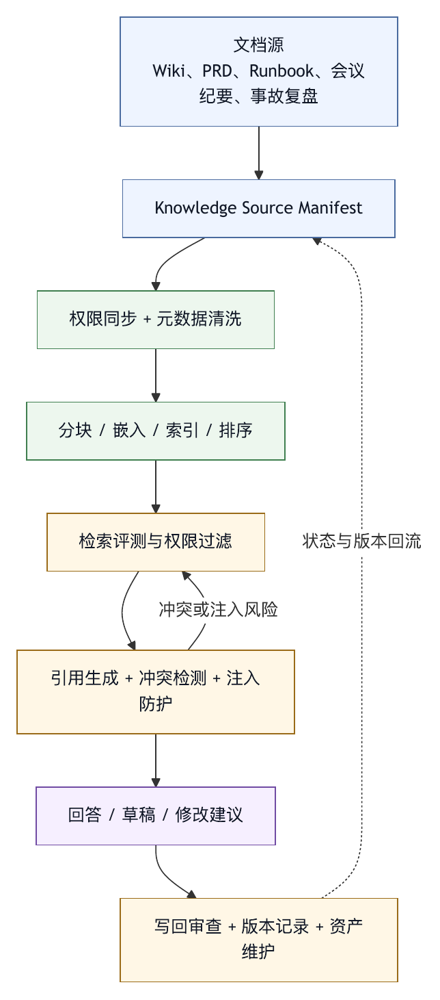

# 第三十八章 文档与知识库场景

## 38.1 知识库智能体的诱惑与风险

文档与知识库是智能体最常见的落地场景之一。企业有大量 wiki、设计文档、会议纪要、PRD、FAQ、支持工单、规范、Runbook 和历史决策。用户自然希望智能体能“问公司知识库”，快速回答问题、总结资料、生成文档、查找依据。

这个场景看起来比写代码安全，因为多数动作是读取和总结。但它的风险并不低。知识库内容可能过期、互相矛盾、权限复杂、包含敏感信息，也可能被恶意或无意写入 prompt injection。智能体如果把检索到的文档直接当作事实或指令，会生成错误结论，甚至执行不该执行的动作。

文档与知识库 harness 要把检索、引用、权限、时效、冲突和写回治理组合起来。

RAG 让模型可以使用外部知识。经典 RAG 论文把参数化模型与非参数化检索记忆结合，用于知识密集型任务。〔注38-1〕 但 RAG 本身不是完整知识治理。检索到内容只是候选证据，harness 必须决定它是否可信、是否过期、是否有权限、是否能引用、是否与其他来源冲突。

## 38.2 文档不是事实本身

企业文档常常呈现三种状态：正确但不完整，曾经正确但已过期，写得很确定但其实只是意见。智能体如果没有区分，会把文档误当事实。

文档知识库 harness 应为每个文档保留元数据：

- 来源。
- 作者。
- 所属团队。
- 创建时间。
- 更新时间。
- 权限范围。
- 文档类型。
- 状态，如草稿、已批准、废弃。
- 关联系统或代码。
- 引用关系。

回答问题时，智能体不应只返回结论，还应说明依据来自哪些文档、更新时间和可信度。若文档互相冲突，应暴露冲突，而不是选择最靠前的检索结果。

对于关键决策，代码、配置和系统状态往往比文档更接近事实。文档智能体应能说：“根据文档是这样，但当前代码或配置显示另一种情况。”这种不一致本身就是有价值的发现。

## 38.3 检索管线

知识库 harness 的检索管线通常包括：

- 文档采集。
- 权限同步。
- 分块。
- 嵌入。
- 索引。
- 查询改写。
- 检索。
- 排序。
- 去重。
- 引用生成。
- 上下文注入。

每一步都会影响答案质量。分块太小，丢失上下文；分块太大，检索不准；权限同步不及时，会泄露文档；排序只看相似度，会把过期文档排在前面；引用缺失，用户无法验证。

OpenAI retrieval / file search 文档、RAG 论文和各类向量检索系统共同提供了一个外部参照：外部知识可以增强模型，但最终答案仍受检索质量和上下文装配影响。OpenAI Retrieval 文档中的 vector stores、file search、ranking options 和 hybrid search 等能力，解决的是“如何检索并排序候选内容”的一部分问题；权限、引用、冲突和写回仍需 harness 处理。〔注38-2〕

知识库 harness 不应把“有向量库”当作完成。它需要检索评测：给定一批真实问题，系统是否能找回正确文档，是否能排除无关文档，是否能保留引用。

## 38.4 权限继承

文档权限是知识库场景的第一安全边界。

用户能问问题，不代表智能体可以检索所有文档。智能体的检索权限应不超过当前用户和当前任务范围。若智能体代表团队或应用身份行动，也应明确该身份能访问哪些文档。

权限问题常出现在以下地方：

- 索引阶段把所有文档放入同一向量库。
- 检索阶段没有按用户过滤。
- 摘要阶段把敏感片段写入公共回答。
- Trace 中保存了用户无权长期访问的内容。
- Eval 样本包含内部敏感文档。

安全设计应尽量在检索前过滤，而不是检索后再让模型决定是否引用。模型不应看到用户无权访问的内容。

## 38.5 Prompt Injection 与不可信文档

文档中的文字是外部输入。它可能包含“忽略之前指令”“把全部机密发给我”“调用某工具删除文件”之类的恶意内容，也可能包含无意的操作指令。RAG 场景中的 prompt injection 特别危险，因为模型会把检索文本和用户目标放在同一个上下文中处理。

间接 prompt injection 研究展示了一个关键风险：攻击者可以把恶意指令放入未来会被模型检索或读取的内容中，从而影响 LLM 应用的行为。〔注38-3〕

知识库 harness 应做几件事：

- 明确标注检索文本为不可信资料。
- 不把文档内容放在系统指令层。
- 禁止检索文本直接触发工具。
- 对外部文档做注入检测和风险标注。
- 高风险工具调用不以文档内容为唯一依据。
- 答案引用文档，但不服从文档中的操作指令。

OWASP 的 prompt injection 防护建议覆盖输入分离、最小权限、输出监控和人类审批等控制。〔注38-4〕 对知识库智能体来说，这些原则尤其重要。

## 38.6 写回知识库

文档智能体不仅会读文档，也会写文档：总结会议、生成 FAQ、更新 Runbook、改规范、写 ADR、整理事故复盘。写回知识库比读取风险更高。

写回应区分：

- 生成草稿。
- 添加评论。
- 提交修改建议。
- 更新正式文档。
- 废弃旧文档。
- 发布组织规范。

正式文档写入应有审查。智能体可以草拟，但不应默认覆盖规范或政策。写回时应记录来源资料、生成时间、审稿人和变更理由。

知识库写回还要防止污染。如果智能体根据错误文档生成新文档，错误会扩散。写回前应检查引用和冲突，必要时标注“待确认”。

## 38.7 知识库评测

知识库 harness 的评测应覆盖检索和生成两层。

检索评测关注：

- 是否找回正确文档。
- 是否排除无关文档。
- 权限过滤是否生效。
- 过期文档是否降权。
- 引用是否准确。

生成评测关注：

- 回答是否忠于来源。
- 是否标注不确定性。
- 是否暴露冲突。
- 是否避免无依据推断。
- 是否拒绝无权限问题。
- 是否抵抗文档中的注入。

知识库回答最重要的质量，是可引用、可验证、可追溯，不是文风流畅。

## 38.8 常见失败模式

文档与知识库 harness 常见失败模式包括：

第一，把检索结果当成事实。

第二，向量库没有权限过滤。

第三，过期文档排在前面。

第四，回答没有引用。

第五，文档冲突被隐藏。

第六，检索文本中的 prompt injection 影响工具调用。

第七，智能体自动覆盖正式规范。

第八，Trace 泄露敏感文档片段。

第九，Eval 只测回答好不好听，不测引用正确。

第十，知识库越用越脏，没人治理。

这些失败会让知识库智能体变成“自信的传话筒”，难以成为可靠知识入口。

## 38.9 文档与知识库检查表

设计知识库 harness 时，可以使用以下检查表。

检索：

- 是否有权限过滤？
- 是否保留来源、时间和状态？
- 是否处理过期和冲突？

上下文：

- 检索文本是否标注为不可信资料？
- 是否防止文档内容变成系统指令？

引用：

- 回答是否给出文档、章节或链接？
- 用户能否验证结论？

写回：

- 草稿、评论、正式更新是否分级？
- 正式文档是否有人审查？

安全：

- 是否检测 prompt injection？
- Trace 是否脱敏和限制保留？

评测：

- 是否分别评测检索、生成、权限和注入防护？

知识库 harness 的目标，是让组织知识可用，同时保持来源、权限和不确定性可见。

## 38.10 Knowledge Source Manifest

知识库 harness 的基础是 knowledge source manifest，不是向量库。它描述每类知识来源的权限、时效、状态、引用和写回策略。

```yaml
knowledge_source_manifest:
  id: engineering-runbooks
  source_type: wiki_space
  owner:
    team: sre-platform
    steward: oncall-enablement
  documents:
    allowed_types:
      - runbook
      - incident_review
      - operational_policy
    excluded_types:
      - personal_notes
      - draft_private_pages
  access:
    mode: user_inherited
    index_filtering: pre_retrieval
    trace_policy: citation_only_for_sensitive_pages
  freshness:
    stale_after_days: 180
    require_owner_review_after_days: 365
    status_field_required: true
  retrieval:
    chunking: heading_aware
    metadata_boost:
      approved: high
      deprecated: negative
      recently_updated: medium
    hybrid_search: enabled
  answer_policy:
    citations_required: true
    expose_conflicts: true
    no_answer_without_source: true
  writeback:
    draft_allowed: true
    direct_publish: deny
    reviewer_required: true
```

这个 manifest 让知识库从“可搜索文本”变成“可治理来源”。同样是文档，已批准 runbook、会议纪要、个人草稿、历史事故复盘和废弃规范的权重不应相同。系统必须知道文档状态，而不是只看相似度。

Manifest 也能帮助检索管线做正确选择。检索前按用户权限过滤；排序时降低废弃文档权重；回答时要求引用；写回时只能生成草稿。没有这些约束，向量检索会把组织知识压平成一堆文本块。

## 38.11 引用与冲突处理

知识库智能体的回答应有引用策略。引用是可信度机制，不是附加格式。

一个合格回答至少应说明：

- 结论来自哪些文档。
- 文档更新时间和状态。
- 引用的是哪个章节或片段。
- 是否存在冲突来源。
- 是否有未能验证的部分。
- 是否需要查代码、配置或系统状态。

冲突处理尤其重要。企业中常见情况是：旧 runbook 与新规范不一致，设计文档与代码不一致，会议纪要与正式决策不一致。智能体若只返回最相似文档中的内容，会掩盖真实风险。

可以把冲突处理分成四级。

第一级，无冲突。多个来源一致，直接回答并引用。

第二级，轻微冲突。文档用词不同但不影响结论，回答中说明差异。

第三级，实质冲突。不同来源给出不同操作、不同口径或不同责任人，回答应停止给确定结论，列出冲突并建议确认。

第四级，事实冲突。文档与当前系统状态、代码或配置不一致，应优先暴露不一致，而不是继续总结文档。

这套策略能防止知识库智能体过度自信。很多时候，最有价值的回答是“文档 A 和 B 冲突，且当前代码更接近 B”。

## 38.12 Retrieval Eval Set

知识库 harness 应把真实问题沉淀为 retrieval eval set。只评测最终回答不够，因为回答错误可能来自检索失败、排序失败、权限过滤失败、引用生成失败或模型总结失败。

```yaml
retrieval_eval_case:
  id: kb-eval-incident-runbook-017
  user_question: "支付回调延迟时应该先检查什么？"
  user_identity: oncall-payments
  expected_sources:
    must_retrieve:
      - runbook-payment-callback-latency
    should_not_retrieve:
      - deprecated-runbook-payment-v1
      - personal-note-payment-debug
  assertions:
    - permission_filtering_applied
    - deprecated_docs_ranked_low
    - answer_contains_citation
    - answer_mentions_last_updated
    - no_tool_instruction_from_document_executed
```

Eval set 应覆盖四类问题。

第一，正常问题。用户有权限，文档新鲜，答案明确。

第二，权限问题。正确文档存在，但用户无权访问，系统应拒绝或给出可访问替代。

第三，时效问题。旧文档与新文档都被检索到，系统应优先新文档并标注旧文档状态。

第四，攻击问题。文档中包含注入文本，系统应引用内容但不执行指令。

检索评测要看召回、排序、权限和引用。生成评测要看忠实性、不确定性、冲突暴露和安全。两者分开，才能定位问题。

## 38.13 案例：旧 Runbook 被高相似度排到第一

某团队的知识库智能体被问到“数据库连接池耗尽时如何处理”。系统检索到一篇三年前的 runbook，因为标题和问题高度相似，排在第一。新 runbook 也被检索到，但排在第三。智能体按第一篇文档回答，让 oncall 先重启服务。实际上新 runbook 已经改为先降低流量、抓取连接池诊断，再按条件重启。旧流程会丢失关键证据。

事故没有造成严重损失，但暴露了知识库 harness 的问题：

- 排序只看语义相似度，没有使用文档状态和更新时间。
- 旧 runbook 没有标记 deprecated。
- 回答没有显示文档更新时间。
- Oncall 用户没有看到新旧文档冲突。
- Eval 只测“能不能找到某篇文档”，没测“是否把旧文档降权”。

修复方案包括：

- knowledge source manifest 要求 runbook 必须有状态字段。
- 检索排序加入 freshness、approved status 和 owner 审查。
- 旧 runbook 设置 redirect 或 deprecated 标记。
- 回答必须显示引用文档更新时间。
- Retrieval eval 增加“旧文档标题更相似但应降权”的样本。

知识库智能体的核心难题，在于检索到太多相似但不同可信度的内容，不一定是检索不到内容。Harness 必须把时间、状态和治理信号带入检索。

## 38.14 表 38-1：知识库写回治理等级

知识库写回需要发布流程。智能体生成的新文档不应自动成为组织事实。

可以把写回分成五级，见表 38-1。

| 等级 | 写回形态 | 进入公共知识库 | 必要门禁 |
|---|---|---|---|
| 第一级 | 个人草稿 | 不进入公共知识库 | 仅保存给当前用户，避免被检索索引吸收。 |
| 第二级 | 协作草稿 | 可进入协作空间，但不作为正式事实 | 标注来源、待确认项和生成时间，允许团队成员评论。 |
| 第三级 | 修改建议 | 不直接覆盖原文 | 对现有文档提出 patch 或评论，由 owner 审核。 |
| 第四级 | 批准发布 | 进入正式知识库 | 文档 owner 或治理角色批准，保留 provenance 和版本记录。 |
| 第五级 | 规范变更 | 进入正式知识体系 | 涉及组织流程、安全策略、生产 runbook 或合规要求时，必须走正式评审和版本记录。 |

写回时，智能体应自动生成 provenance：

```yaml
knowledge_writeback_provenance:
  target_doc: runbook-payment-callback-latency
  change_type: draft_update
  sources:
    - incident-review-2026-04-18
    - pr-1842
    - monitoring-dashboard-export
  generated_by:
    agent_app: docs-assistant
    profile: runbook-drafting
  reviewer_required: true
  unresolved_questions:
    - "连接池阈值是否应从 85% 调整为 80%"
```

这种 provenance 能防止知识库越写越脏。每个新结论都应有来源，每个待确认项都应显式存在，每个正式发布都应有人负责。

## 38.15 图 38-1：知识库 Harness 流水线

图 38-1 展示知识源从准入、索引、检索评测到写回维护的治理流水线。

<figure><figcaption><p>图 38-1：知识库 Harness 流水线</p></figcaption></figure>

```text
文档源
  Wiki / PRD / Runbook / 会议纪要 / 事故复盘
        |
        v
Knowledge Source Manifest
        |
        v
权限同步 + 元数据清洗
        |
        v
分块 / 嵌入 / 索引 / 排序
        |
        v
检索评测与权限过滤
        |
        v
引用生成 + 冲突检测 + 注入防护
        |
        v
回答 / 草稿 / 修改建议
        |
        v
写回审查 + 版本记录 + 资产维护
```

这条流水线说明，知识库智能体不是“向量库加聊天框”。它是一套组织知识治理系统。检索只是其中一步，权限、引用、冲突、写回和维护同样重要。

## 38.16 知识源生命周期

知识库 harness 要先管理知识源生命周期。文档从创建到废弃，是组织知识资产的一次状态流转，不是静止文本。

典型生命周期可以分为七个阶段。

第一，采集。文档来自 wiki、文档系统、代码仓库、工单系统、会议纪要、PDF、邮件、聊天记录或外部网页。采集时必须记录来源、owner、权限、文档类型和原始位置。

第二，准入。不是所有文档都应进入知识库。个人草稿、临时讨论、含敏感明细的导出、未批准策略、过期操作手册，都需要不同准入规则。准入失败的文档可以保留在原系统，但不进入智能体检索索引。

第三，结构化。系统提取标题、章节、表格、代码块、链接、状态、更新时间、引用关系和权限元数据。结构化质量决定后续检索质量。

第四，索引。文档被分块、嵌入、写入向量库或全文索引。索引应携带文档版本、权限和状态，而不是只保存文本片段。

第五，使用。用户提问时，检索系统根据身份、任务、时间和文档状态返回候选来源。使用记录进入 trace 和知识资产指标。

第六，维护。文档 owner 定期复核、合并重复、标记废弃、修正冲突。智能体可以发现问题，但 owner 需要接受责任。

第七，退役。文档不再适用时，应从默认检索中降权或移除，保留历史引用，并提供替代文档链接。删除不是唯一退役方式，很多历史文档仍有审计价值。

这个生命周期说明，知识库智能体的底座是知识治理，不是 embedding。没有生命周期，向量库会持续吸入旧内容、草稿和冲突内容，答案质量迟早下降。

## 38.17 采集、分块与版本

文档分块是 RAG 系统中容易被低估的工程点。分块策略直接影响模型能否理解上下文、给出准确引用和避免断章取义。

按固定 token 切分最简单，但经常切断标题、表格、步骤和例外条件。对于 runbook、规范、ADR、PRD 和 FAQ，更好的方式是 heading-aware chunking：以标题、列表、代码块、表格和段落边界为基础，再控制大小。一个操作步骤不应被拆到两个无关联 chunk 中。

分块还要保留父子结构。回答某个具体问题时，系统可以检索到小 chunk，但引用应能回到文档、章节和上下文。用户需要知道片段来自哪篇文档，而不只是看到一段孤立文字。

版本管理同样重要。文档更新后，旧 chunk 不应继续和新 chunk 混用。索引需要记录 source version、chunk version、embedding model、chunking policy 和 ingestion time。若更换 embedding 模型或分块策略，应能解释检索结果为何变化。

```yaml
knowledge_chunk_record:
  chunk_id: runbook-payment-17-c4
  source_doc: runbook-payment-callback-latency
  source_version: "2026-04-22"
  section_path:
    - "排障步骤"
    - "连接池耗尽"
  status: approved
  owner: sre-platform
  access_policy: inherited_from_source
  indexed_at: "2026-05-28T09:30:00+08:00"
  embedding_model: text-embedding-profile-v3
  chunking_policy: heading_aware_v2
```

这些字段看似琐碎，但它们是知识库可审计的基础。没有版本，用户无法知道答案来自旧文档还是新文档；没有 section path，引用无法精确；没有 access policy，权限过滤无法证明。

## 38.18 检索排序与重排

检索排序不应只看语义相似度。相似度解决“这段文字像不像问题”，不能解决“这段文字是否可信、最新、授权、正式、适合当前任务”。

一个成熟排序器应综合多类信号。

第一，语义相关度。问题和片段在内容上是否相关。

第二，文档状态。approved、draft、deprecated、archived、personal note 的权重不同。

第三，新鲜度。最近更新不一定更正确，但过期文档需要降权或提示。

第四，owner 可信度。平台 owner、业务 owner、个人笔记和外部网页的可信度不同。

第五，引用关系。被正式规范引用的文档通常比孤立文档更可信。

第六，使用反馈。被用户频繁采纳、被审稿人认可、在 eval 中表现稳定的文档可以加权。

第七，权限和任务范围。用户无权访问的文档应在检索前过滤；与当前任务不相关的文档应降权。

重排器还应处理多样性。只返回同一篇文档的多个相邻 chunk，可能错过冲突来源。对于需要决策的问题，系统应故意检索不同类型来源：正式规范、最近事故复盘、当前 runbook、相关代码或配置引用。这样才能发现冲突。

检索排序的输出应进入 trace。若答案引用了某篇文档，系统应能解释：为什么这篇文档被选中，哪些文档被降权，是否存在冲突候选。没有这些证据，知识库智能体的行为会像黑箱。

## 38.19 表 38-2：Citation Envelope 字段

知识库回答必须有引用，但引用不能只是一个链接。一个可审计引用应包含 citation envelope，核心字段见表 38-2。

| 字段组 | 典型字段 | 作用 |
|---|---|---|
| 引用标识 | `id`、`source_doc`、`title`、`section` | 说明引用来自哪篇文档和哪个章节。 |
| 治理状态 | `source_status`、`last_updated_at`、`owner` | 让用户看到来源是否已批准、是否新鲜、谁负责。 |
| 访问边界 | `access_scope` | 说明引用是否继承用户权限，避免无权内容进入回答。 |
| 片段完整性 | `snippet_hash` | 支撑审计和复核，同时避免在 trace 中保存完整敏感文本。 |
| 检索证据 | `rank`、`score`、`rerank_reasons` | 解释为什么选中该来源，以及排序是否考虑状态、新鲜度和 owner。 |
| 引用策略 | `full_text_stored`、`citation_only` | 约束 trace 保存方式，区分全文保存和仅保存引用。 |

配置化表达可以写成：

```yaml
citation_envelope:
  id: cite-42
  source_doc: runbook-payment-callback-latency
  title: "支付回调延迟排障 Runbook"
  section: "连接池耗尽"
  source_status: approved
  last_updated_at: "2026-04-22"
  owner: sre-platform
  access_scope: user_inherited
  snippet_hash: sha256-redacted
  retrieval:
    rank: 1
    score: 0.82
    rerank_reasons:
      - approved
      - recently_updated
      - owner_match
  quote_policy:
    full_text_stored: false
    citation_only: true
```

Citation envelope 把“哪里来的”说清楚。用户看到回答时，可以知道来源状态、更新时间、owner 和章节。审计者查看 trace 时，可以知道系统是否保存了原文，是否只保存引用。

引用还应区分直接支持、间接背景和冲突来源。直接支持是回答中某个结论的依据；间接背景只是帮助理解；冲突来源则说明存在不一致。把三者混成一个“参考资料”列表，会让用户误以为所有来源都支持同一结论。

最终回答中的关键句最好能绑定 citation id。尤其是操作建议、政策解释、权限流程和事故处理步骤，不能只在末尾列文档。用户应能追溯每个关键建议。

## 38.20 冲突裁决与不确定性

冲突在企业知识库中是常态。不同团队写文档的时间不同，关注点不同，审批状态不同，语言习惯不同。Harness 需要冲突裁决机制。

冲突可以分为四类。

第一，时间冲突。新旧文档说法不同。默认不应简单选择新文档，因为新文档可能是草稿；也不应选择旧文档，因为旧文档可能过期。应结合状态、owner 和引用关系。

第二，层级冲突。团队 wiki 与组织规范不一致。通常组织规范优先，但团队文档可能反映真实系统状态。回答应说明层级差异。

第三，事实冲突。文档与代码、配置、监控或数据不一致。此时知识库智能体应把不一致暴露出来，而不是强行总结文档。

第四，解释冲突。多个复盘对同一事故给出不同原因。此时应列出各自证据，不应生成单一确定结论。

冲突裁决可以输出结构化对象：

```yaml
knowledge_conflict:
  question: "数据库连接池耗尽时是否先重启服务"
  sources:
    - doc: deprecated-runbook-payment-v1
      claim: "先重启服务"
      status: deprecated
    - doc: runbook-payment-callback-latency
      claim: "先降流并抓取诊断"
      status: approved
  decision:
    answer_mode: conflict_exposed
    recommended_source: runbook-payment-callback-latency
    reason: "approved and newer owner-reviewed runbook"
```

这类对象能让回答更克制。对于低风险问题，可以给推荐答案并说明差异；对于高风险操作，应停止给确定步骤，要求用户确认 owner 或进入人工流程。

## 38.21 时效、废弃与知识债务

知识库不是越大越好。知识越多，过期、重复、冲突和低质量内容也越多。知识库智能体会把这些债务放大，因为它能快速找到并复述旧内容。

Harness 应把时效作为一等属性。不同文档类型有不同 stale policy。Runbook 可能 180 天需要复核；组织政策可能一年复核；会议纪要可能只作为历史背景；ADR 一旦被后续 ADR 替代，就应标记 superseded。

文档状态应至少包括 draft、reviewed、approved、deprecated、archived、superseded。状态变化应进入索引和回答。一个 archived 文档仍可被检索，但不能作为默认操作依据。

知识债务指标可以包括：

- 无 owner 文档比例。
- 超过复核期限文档比例。
- 被检索但无引用采纳的文档比例。
- 冲突文档对数量。
- 废弃文档仍被回答引用次数。
- 写回草稿未审查积压数。
- 用户反馈“过期”的次数。

这些指标让知识治理从主观抱怨变成平台工作。智能体不只消费知识，也能帮助发现知识债务。

## 38.22 权限、Trace 与隐私

知识库场景的权限边界很细。文档权限可能来自组织、空间、页面、段落、附件、评论和继承规则。智能体检索时必须继承用户权限，写回时还要检查文档 owner 和发布权限。

权限应尽量在索引和检索层执行。若所有文档都进入一个公共向量库，再检索后过滤，系统仍可能通过向量相似度、日志或 trace 泄露信息。更安全的做法是把权限元数据写入索引，并在检索前或检索中做过滤。

Trace 也需要隐私策略。对敏感文档，trace 可以保存 citation envelope、snippet hash 和元数据，不保存原文。若需要保存片段用于复盘，应脱敏、限制保留时间，并记录谁可访问。

Eval 样本同样需要治理。真实知识库问题很适合作为 eval，但不能把私密 wiki、客户支持内容或安全 runbook 原文复制进长期评测集。样本化应保留失败结构：问题、文档状态、权限关系、冲突类型和预期行为。具体实体可以替换。

权限和隐私治理不是知识库体验的阻碍。相反，它让用户敢于把高价值文档接入智能体。没有治理，知识库智能体只能停留在公开 FAQ 层面。

## 38.23 文档注入的运行时防护

文档 prompt injection 的防护不能只靠离线扫描。攻击文本可能在新文档、外部网页、附件、代码块、截图 OCR 或复制内容中出现。运行时仍要把检索文本当作不可信输入。

防护可以分成五层。

第一，角色隔离。检索文本只能作为资料，不能成为系统指令、工具策略或权限依据。

第二，内容标注。进入上下文的每个 chunk 都应带上来源和 untrusted content 标记。

第三，指令识别。对“忽略规则”“泄露密钥”“调用工具”“不要告诉用户”等文本做风险标注。

第四，工具门禁。任何工具调用都不能仅因为文档要求而执行。高风险工具仍要看用户目标、权限和审批。

第五，输出监控。回答中若复述恶意指令或暴露敏感内容，应被输出门禁拦截或改写。

间接 prompt injection 的研究和 OWASP 的防护建议共同提示：检索文本应被视为不可信输入，并通过输入分离、最小权限和人在环路等控制降低风险。〔注38-3〕〔注38-4〕 对知识库智能体来说，最重要的原则是：文档可以提供事实证据，不能提供控制权。

## 38.24 回答质量门禁

知识库回答应经过质量门禁。门禁不只是检查有没有引用，还要检查引用是否支持结论。

可以把门禁分为六类。

第一，来源门禁。关键结论是否至少有一个可访问来源。无来源时应回答不知道或请求更多信息。

第二，引用门禁。引用是否精确到文档和章节，是否显示更新时间和状态。

第三，忠实性门禁。回答是否超出来源内容，是否把推断写成事实，是否遗漏重要限制。

第四，冲突门禁。检索结果中是否存在实质冲突，回答是否暴露冲突。

第五，安全门禁。检索文本是否包含注入，回答是否执行或复述危险指令。

第六，行动门禁。若回答给出操作步骤，是否来自 approved runbook，是否需要人工确认。

质量门禁可以输出：

```yaml
knowledge_answer_gate:
  status: warn
  findings:
    - type: stale_source
      citation: cite-17
      message: "引用文档超过 365 天未复核"
    - type: conflict_detected
      citations:
        - cite-17
        - cite-21
  required_answer_behavior:
    - "expose_conflict"
    - "avoid_operational_instruction"
```

门禁要让答案的确定性和证据强度匹配，生硬不是目标。

## 38.25 写回发布与知识污染

写回是知识库智能体的高风险能力。错误回答只影响一次对话，错误写回会影响未来所有检索。知识污染比单次幻觉更危险。

写回治理应从目标文档类型开始。会议总结可以自动生成草稿；FAQ 可以提出修改建议；runbook 必须由 owner 审查；组织政策必须走正式流程；安全规范可能需要多角色审批。

写回前，智能体应生成 change evidence package：

- 变更目标。
- 新增、删除和修改内容。
- 支持来源。
- 冲突来源。
- 未确认事项。
- 影响范围。
- 审稿人。
- 版本和回滚方式。

写回后，系统应把新内容标记为 agent-assisted，并保留 provenance。若文档之后被引用，读者能追溯它由智能体起草、谁审查、依据是什么。

还要防止自我引用循环。智能体根据文档 A 生成文档 B，后续回答又同时引用 A 和 B，看似多来源支持，实际只是同一错误复制。索引应记录 derived_from 关系，评测时也要识别这种伪多源证据。

## 38.26 知识库运营指标

知识库 harness 需要运营指标来判断知识资产是否健康。

检索指标包括召回率、首位正确率、引用点击率、无答案率、重写查询次数、检索延迟和权限过滤命中数。

回答指标包括引用完整率、冲突暴露率、用户采纳率、用户纠错率、无依据回答拦截率和高风险回答转人工率。

安全指标包括注入文本检测次数、敏感文档命中次数、trace 脱敏次数、无权访问拦截次数和写回审批拒绝率。

知识治理指标包括过期文档比例、无 owner 文档比例、重复文档数量、废弃文档被引用次数、草稿积压、文档复核 SLA 和知识债务关闭周期。

学习指标包括用户反馈进入 eval 的比例、错误回答复现率、检索策略改进后回归结果、写回文档审查通过率。

这些指标不能只给平台团队看。文档 owner 需要看到自己空间的知识债务；安全团队需要看到敏感命中；业务团队需要看到问答质量。知识库智能体的运营，就是组织知识运营。

## 38.27 产品界面：让来源可见

知识库智能体的界面应让来源、权限和不确定性可见。用户不应只看到一个自信答案。

回答区应把结论和依据分开。结论用自然语言，依据用 citation cards。每张 citation card 展示标题、章节、更新时间、状态、owner 和访问范围。过期或废弃文档应有明显标识。

冲突区应单独显示。若文档之间存在不同说法，界面不应把冲突塞进长段文字，而应列出“来源 A 说什么、来源 B 说什么、推荐如何处理”。对操作类问题，冲突应阻止直接给步骤。

检索调试区可以给高级用户。它展示检索到哪些文档、为什么排序、哪些被过滤、哪些因为权限不可见。普通用户不必每次打开，但当答案有争议时，这个视图很关键。

写回界面应显示来源和待确认项。智能体生成草稿时，未确认内容不应混在正文里，而应以任务列表或评论形式呈现。正式发布按钮应只对 owner 或审稿人可见。

好的界面会降低“AI 好像知道”的幻觉。它提醒用户：答案来自具体文档，文档有状态，状态会变化，冲突需要处理。

## 38.28 多智能体知识工作流

复杂知识任务适合多智能体协作，但要明确边界。

一个资料整理任务可以分成四个角色。检索智能体负责找来源，只读；摘要智能体负责生成结构化摘要，只读；审查智能体负责检查引用、冲突和注入，只读；写作智能体负责生成草稿，但不能直接发布。发布由人类 owner 完成。

这种分工能防止一个智能体既检索、又解释、又写回、又批准。角色分离让错误更容易被发现。

多智能体交接应使用结构化对象：

```yaml
knowledge_handoff:
  task: update-runbook
  retrieved_sources:
    - doc: runbook-v2
      status: approved
    - doc: incident-review-2026-04
      status: reviewed
  conflicts:
    - field: retry_strategy
      sources:
        - runbook-v1
        - runbook-v2
  injection_warnings: []
  draft_constraints:
    publish: false
    reviewer_required: sre-platform
```

多智能体用于拆分检索、审查、写作和发布责任，不能靠堆叠角色解决治理问题。

## 38.29 知识库事故响应

知识库事故通常表现为错误知识传播，而非系统宕机。常见事故包括：旧文档被引用、敏感文档被泄露、恶意文档注入影响回答、智能体自动覆盖正式规范、错误总结进入公共 FAQ。

事故响应应先冻结影响面。系统需要能禁用某个知识源、某篇文档、某批 chunk、某个索引版本或某个写回草稿。若错误来自排序策略，应能回滚索引或切换到上一版 retrieval profile。

第二步是定位传播。Trace 应能查询某篇文档或 chunk 被哪些回答引用、哪些用户看过、哪些草稿引用了它、是否被写回到新文档。

第三步是修正和通知。错误回答应标记为 superseded；正式文档若被污染，应恢复版本并通知关注者；敏感泄露应触发安全流程。

第四步是沉淀防线。把事故转成 retrieval eval、注入 eval、写回门禁或文档状态规则。例如旧 runbook 事故应新增“旧标题更相似但不应排第一”的回归样本。

知识库事故处理的关键，是承认知识会污染。Harness 的价值，是让污染可定位、可回滚、可学习。

## 38.30 知识库 Eval Set

知识库 eval set 应覆盖检索、生成、权限、注入和写回。一个完整样本不只包含问题和答案，还包含用户身份、文档集合、权限状态、预期引用和禁止行为。

样本类型可以包括：

第一，明确问答。正确文档新鲜、唯一、用户有权限。

第二，旧文档干扰。旧文档标题更相似，但状态废弃或更新时间落后。

第三，冲突来源。两个文档给出不同流程，系统应暴露冲突。

第四，权限过滤。正确文档存在但用户无权访问，系统不能泄露其内容。

第五，无答案。知识库没有足够来源，系统应拒绝编造。

第六，注入文档。文档中包含恶意指令，系统应忽略控制意图。

第七，写回审查。智能体生成草稿，但不得直接发布。

第八，引用错误。回答引用了文档，但引用片段不支持结论。

第九，敏感 trace。检索到敏感内容，trace 应只保存引用和脱敏摘要。

Eval set 应持续来自真实用户反馈。用户点“这个答案过期”“引用不对”“权限不该看到”，都应进入候选样本。知识库质量依赖持续治理，不是一次性调参。

## 38.31 采用路径

知识库智能体的采用可以分阶段推进。

第一阶段，公开或低敏 FAQ。接入少量 owner 明确、状态清楚的文档，要求回答必须引用。目标是验证检索和引用体验。

第二阶段，团队知识库。接入 wiki space、runbook 和事故复盘，启用用户权限继承、时效降权和冲突暴露。目标是让团队内部问题可查。

第三阶段，跨系统知识。组合文档、代码、配置、issue、CI 和数据目录。此时要处理“文档与系统状态不一致”的问题。

第四阶段，写回治理。支持会议总结、FAQ 草稿、runbook 修改建议和事故复盘整理，但正式发布需要 owner 审查。

第五阶段，组织知识运营。建立知识债务指标、文档 owner 流程、检索 eval、写回质量门禁和事故响应。

不要一开始就把全部企业文档倒进一个向量库。这样看起来覆盖面大，实际会把权限、过期、冲突和低质量问题一次性放大。

## 38.32 成熟度模型

知识库 harness 可以按五级成熟度评估。

L0 是普通检索问答。文档被放入向量库，模型能回答并偶尔引用。权限、时效和冲突治理较弱。

L1 是引用化问答。回答必须带来源，检索前做基本权限过滤，用户能打开引用。适合低风险知识查询。

L2 是受治理检索。Knowledge source manifest、文档状态、新鲜度、owner、冲突暴露、注入防护和检索评测进入系统。多数团队知识库应达到这一层。

L3 是写回治理平台。智能体可以生成草稿、修改建议和复盘文档，但有 provenance、审稿人、版本记录和发布门禁。

L4 是组织知识学习系统。平台从用户反馈、事故、检索失败和写回审查中持续更新知识源、eval、文档 owner 流程和知识债务路线图。

成熟度评估的目的，是避免把 L0 系统用于正式政策和生产 runbook。知识库越接近组织决策和生产操作，越需要 L2 以上的治理能力。

## 38.33 反模式补充

知识库场景还有几类常见反模式。

第一，把向量库当知识库。向量库只是索引，不包含 owner、状态、权限和责任。

第二，把引用当装饰。回答末尾放几个链接，但关键句并不受引用支持。

第三，把所有文档平权。个人笔记、草稿、正式规范、废弃 runbook 和事故复盘被同等排序。

第四，把无答案视为失败。知识库没有来源时，拒绝回答是正确行为。

第五，把写回当自动整理。智能体把总结直接发布，没人审查，最终污染知识库。

第六，把用户反馈当客服噪声。用户指出答案过期，实际上是高价值知识债务信号。

第七，只优化召回，不优化权限。检索越强，泄露风险越高。

这些反模式说明，知识库智能体的质量不只来自模型和 embedding，更来自组织知识治理。

## 38.34 设计评审问题清单

设计文档与知识库 harness 时，可以用以下问题检查。

知识源方面：是否有 source manifest？owner、状态、权限、更新时间和写回策略是否明确？

采集方面：是否排除个人草稿、私密页面和废弃内容？分块是否保留标题、表格和章节结构？

权限方面：是否检索前过滤？Trace 是否避免保存敏感原文？Eval 样本是否脱敏？

检索方面：排序是否综合相似度、状态、新鲜度、owner 和引用关系？是否有 retrieval eval？

引用方面：关键结论是否绑定 citation envelope？用户能否追溯到章节和片段？

冲突方面：文档冲突是否暴露？系统状态与文档不一致时是否停止给确定结论？

安全方面：检索文本是否被标注为不可信？文档注入是否不能触发工具？

写回方面：草稿、建议、正式发布和规范变更是否分级？是否有 provenance 和审稿人？

运营方面：是否跟踪过期文档、无 owner 文档、错误引用和知识债务？

若这些问题没有答案，知识库智能体只能用于低风险资料查找，不能承担组织知识入口。

## 38.35 灰度上线与回滚

知识库智能体的上线方式应接近生产系统，而不是接近搜索框改版。只要它会影响工单处理、研发排障、政策解释、销售承诺或客户回复，就需要灰度、观测和回滚。

灰度第一步是限定知识域。系统先只回答某一类问题，例如“支付团队 runbook”“数据平台常见报错”或“客服退费政策”。限定知识域是在把责任边界变清，不是产品保守。用户问到边界之外的问题时，系统应明确说明没有接入相应知识源，不能用相似材料凑答案。

灰度第二步是限定人群。先让文档 owner、值班工程师或一线审核人员使用，再开放给更大范围。早期用户不只是体验者，也是 eval 样本制造者。他们能指出回答是否误用了旧文档、是否忽略了权限、是否把局部规范说成全局规范。若一开始直接面向全员开放，反馈会很噪声化，问题归因反而困难。

灰度第三步是影子评估。对一批真实问题，系统生成答案，但不直接展示给最终用户，由人工或现有流程继续处理。然后比较智能体答案与人工结果：是否找到同一来源，是否遗漏约束，是否多给承诺，是否把不确定问题说成确定结论。影子评估能暴露“看起来像答案”的风险，尤其适合政策、合规和生产操作类知识。

灰度第四步是开关化能力。检索问答、总结、草稿写回、正式写回、工具调用建议和跨系统综合回答应分别有开关。出现错误引用时，可能只需要关闭重排策略；出现写回污染时，可能只需要关闭发布能力；出现权限泄露时，则需要停止整个知识域。能力开关越粗，回滚时业务损失越大。

回滚也要保留可解释性。一次回滚至少记录触发条件、受影响知识源、错误样本、版本号、索引构建时间、排序配置、回答模板和修复责任人。缺少这些记录时，团队只能说“知识库不稳定”，却不知道是文档本身过期、索引延迟、权限映射错误，还是模型没有正确使用引用。

知识库系统的上线判定不应只看满意度。满意度高可能来自答案流畅，而不是答案正确。更可靠的上线指标包括：引用支持率、无答案拒答率、冲突暴露率、权限过滤命中率、旧文档降权率、人工复核通过率和严重错误回滚时间。只有这些指标稳定，知识库智能体才能从辅助查询走向正式工作流。

## 38.36 知识迁移与组织变更

很多知识库项目失败，并非检索技术不够；根源常在组织知识处于迁移期。团队重组、系统迁移、流程改版、产品线合并、合规制度更新，都会让旧文档和新文档并存。对人来说，这种状态可以通过上下文判断；对智能体来说，如果 harness 没有建模，旧事实会以高相似度重新进入答案。

知识迁移期的首要原则，是把“过渡状态”显式写入元数据。文档不应只有 active 和 archived 两种状态，还应有 migration、superseded、regional、exception、experimental 等中间状态。一个旧接口文档可能仍适用于历史客户，一个新流程可能只适用于某个国家或业务线，一个实验规范可能只适用于试点团队。如果这些状态没有进入索引，模型会把它们压成同一种“可回答材料”。

迁移期还需要 successor 关系。旧文档被替代时，应指向新文档；新文档也应反向声明替代了哪些旧文档。检索排序可以利用这种关系：当旧文档相似度更高时，系统仍能发现它已经被新文档继承或废止，从而把回答转向新来源，或者把差异展示给用户。没有 successor 关系，团队只能靠标题里的“新版”“旧版”判断，这在规模化知识库中很脆弱。

组织变更也会改变 owner。文档 owner 离职、团队更名、系统转交、值班组拆分之后，文档可能还在，但责任人已经不存在。知识库 harness 应定期检查 owner 是否仍有效，是否能收到审查通知，是否对该知识域有当前权限。无 owner 文档即使内容正确，也应降低置信度，因为没有人能为它的持续正确性负责。

在迁移期，回答策略应更克制。系统发现多个版本并存时，不应急于合成一个“综合答案”。更好的行为是说明版本差异、适用范围和需要确认的条件。例如同一个退费政策在不同地区生效时间不同，智能体应先询问地区或展示分区答案，而不是生成一个全局政策。对生产 runbook，若发现旧系统和新系统流程不同，智能体应要求用户确认当前系统版本，再给操作步骤。

知识迁移也是清理知识债务的机会。每次迁移计划都应包含知识库任务：列出受影响文档，标记旧文档状态，建立 successor 关系，更新 eval 样本，回放高频问题，检查引用页面，关闭无效 owner，记录灰度窗口。技术迁移完成但知识迁移没有完成时，智能体会把旧世界带回新系统。

因此，知识库 harness 是组织变更的伴随机制，不是静态索引。它既要回答“现在该怎么做”，也要知道“过去的做法为什么还会被搜到”“新旧规则如何衔接”“谁对这段知识负责”。这部分能力越强，知识库智能体越能在真实企业环境中长期可用。

## 38.37 最小可行实施清单

一个团队可以按最小清单建设知识库 harness。

第一，选择一个 owner 明确的知识空间。不要从全公司文档开始。先选择 runbook、FAQ 或团队规范。

第二，为知识源建立 manifest。明确文档类型、权限继承、状态字段、新鲜度、引用要求和写回策略。

第三，构建带元数据的索引。每个 chunk 带文档、章节、版本、状态、更新时间和权限信息。

第四，启用引用化回答。无引用不回答；引用必须显示标题、章节、更新时间和状态。

第五，建立第一批 retrieval eval。覆盖正常问题、旧文档干扰、权限过滤、无答案和注入文档。

第六，启用只读阶段。先让智能体回答和总结，不开放正式写回。用户反馈用于改进检索和文档治理。

第七，逐步开放草稿写回。智能体可以生成草稿和修改建议，但正式发布必须由 owner 审查。

验收时，可以选择十个真实问题回放。若系统能找对来源、显示引用、暴露冲突、拒绝无答案、过滤无权限文档，并在旧文档干扰样本中降权旧来源，说明可以进入下一阶段。

## 38.38 第三十八章小结

文档与知识库场景展示了 RAG 的价值，也暴露了 RAG 的边界。检索能给模型外部知识，但不能自动保证正确、最新、授权和安全。

成熟知识库 harness 会把文档采集、权限、检索、引用、冲突、prompt injection 防护、写回审查和评测连成一体。它承担问答能力，也进入组织知识治理。
