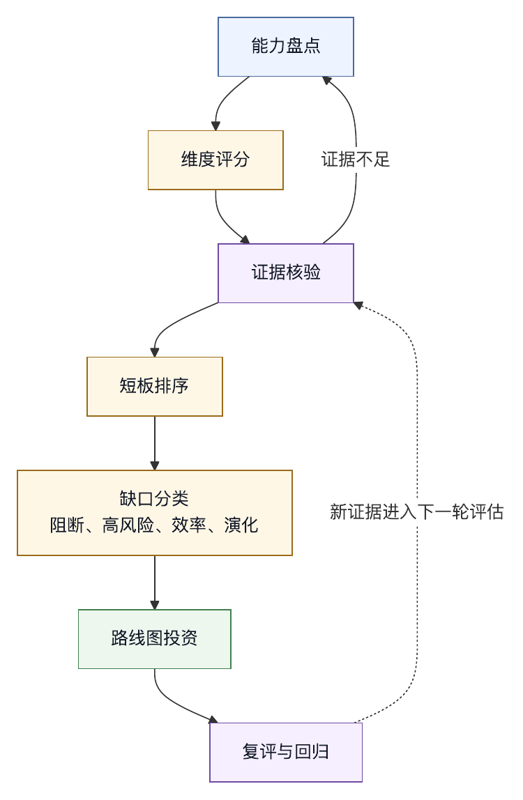

# 第四十章 Harness 成熟度模型

## 40.1 为什么需要成熟度模型

前面章节讨论了许多能力：模型契约、工具、权限、沙箱、trace、eval、Agent OS、插件、企业集成、持续演化和案例。团队阅读后很容易问：我们现在处在哪个阶段？下一步最应该补什么？

成熟度模型的作用，是把复杂能力组织成可评估路径。它不是认证标准，也不是所有团队必须按顺序走的教条。它帮助团队识别当前短板，避免在基础边界薄弱时追求高级功能。

NIST AI RMF 提供了把可信度、组织目标、风险识别、度量和管理动作结合起来的风险管理框架，并明确其自愿采用属性。〔注40-1〕 Harness 成熟度模型也应如此：它帮助团队持续决定下一笔工程投入，避免把成熟度评估做成一次性打分。

本书提出六级 harness 成熟度：

- L0：模型调用。
- L1：薄工具 CLI。
- L2：Harness Core。
- L3：Agent OS。
- L4：企业级平台。
- L5：自演化治理系统。

六个层级从 L0 到 L5，是为了强调 L0 也常被误认为智能体。生产级 harness 通常至少需要达到 L2。

## 40.2 L0：模型调用

L0 是直接调用模型 API。系统有 prompt、模型参数和输出。它可以回答问题、生成文本、写代码片段，但没有工具、状态、权限和评测。

特征：

- 无工作区。
- 无工具系统。
- 无权限。
- 无 trace。
- 无回滚。
- 无 eval。

适用场景是低风险文本生成和实验。它不应被称为智能体，也不应承担真实环境动作。

## 40.3 L1：薄工具 CLI

L1 在模型调用基础上增加简单 CLI、文件读取、编辑或 shell。它能辅助个人完成小任务。

特征：

- 有少量工具。
- 上下文主要靠用户手动提供。
- 权限较粗。
- 日志多为终端输出。
- 依赖用户人工检查。

主要风险是工具过宽、状态不可追踪、上下文不完整。L1 可以有价值，但应明确边界。

## 40.4 L2：Harness Core

L2 具备生产级 agent run 的核心结构。

特征：

- 模型契约。
- 上下文装配。
- 结构化工具系统。
- 权限和审批。
- 工作区限制。
- Session trace。
- Checkpoint / rollback。
- 质量门禁。
- 基础 eval。

达到 L2 后，系统才有资格在真实任务中较稳定地运行。它仍可能缺少完整产品化 UI、插件和组织治理，但已经具备可执行、可验证、可恢复的基础。

## 40.5 L3：Agent OS

L3 把 harness core 产品化。

特征：

- 持久会话。
- 命令系统。
- Profile。
- 多智能体调度。
- 插件。
- MCP 生命周期。
- TUI / IDE / Web 控制面。
- 任务队列和后台运行。
- 成本和状态可见。

L3 的目标是让智能体成为用户日常工作环境，而不是单次任务执行器。它强调可发现性、可复用流程和扩展生态。

## 40.6 L4：企业级平台

L4 把 Agent OS 纳入组织治理。

特征：

- 身份和租户。
- 组织策略。
- 企业连接器。
- 审计日志。
- 数据分类。
- 插件审查。
- 组织 eval。
- 灰度发布。
- 成本归因。
- 事故响应。

L4 关注规模化和责任边界。它适合多团队、多项目、多数据源、多外部系统的企业环境。

## 40.7 L5：自演化治理系统

L5 是证据驱动的半自动演化，不等于完全自治。

特征：

- Trace-to-eval。
- 失败聚类。
- 自动生成改进候选。
- 影子运行。
- 安全 eval。
- 自动化回归分析。
- 改进队列。
- 人工审查高风险变更。
- 持续组织学习。

L5 表示系统能从真实使用中变强，同时不失控。它让 harness engineering 进入证据化、实验化和治理化循环，不让智能体随意改自己。

## 40.8 维度评分

除总体等级外，团队还应按维度评分。

核心维度包括：

- 模型契约。
- 上下文。
- 工具。
- 权限。
- 沙箱。
- 可观测性。
- 评测。
- 回滚。
- UI。
- 插件。
- 企业集成。
- 持续演化。

一个系统可能工具很强，但评测很弱；UI 很好，但权限粗糙；企业连接器很多，但 trace 不完整。总体等级不能掩盖局部短板。

成熟度评估应找出最低关键维度。生产风险通常来自短板，而不是平均分。

## 40.9 升级路径

常见升级路径如下：

从 L0 到 L1：增加明确工具，但保持人工控制。

从 L1 到 L2：补权限、trace、上下文装配和回滚。

从 L2 到 L3：补会话、命令、profile、UI、插件和任务队列。

从 L3 到 L4：补身份、组织策略、企业连接器、审计和数据治理。

从 L4 到 L5：补 trace-to-eval、失败队列、自动改进候选和灰度实验。

升级不应跳过安全边界。例如，不应在 L1 阶段直接做插件市场；不应在没有 trace 的情况下做自动化改进；不应在没有组织身份的情况下做企业外部写入。

## 40.10 成熟度检查表

评估系统时，可以使用以下问题：

L0/L1：

- 系统是否只是模型加少量工具？
- 用户是否清楚风险和边界？

L2：

- 是否有结构化工具和权限？
- 是否能记录 trace 和回滚？
- 是否有基础 eval 和质量门禁？

L3：

- 是否有会话、命令、profile、插件和 UI 控制面？
- 用户是否能长期复用工作流？

L4：

- 是否接入身份、审计、策略和企业连接器？
- 是否能支持多团队治理？

L5：

- 真实失败是否进入 eval？
- 系统是否能生成和验证改进候选？
- 高风险变更是否仍由人审查？

成熟度模型的价值在于决定下一笔工程投入，不是给自己贴标签。

## 40.11 成熟度评估表

成熟度评估应有结构化表格。下面是一份可执行的 assessment template。

```yaml
harness_maturity_assessment:
  system: internal-coding-agent
  date: "2026-05-27"
  assessors:
    - platform-owner
    - security-owner
    - scenario-owner
  overall_level: L2
  dimensions:
    model_contract:
      score: L2
      evidence:
        - model allowlist
        - context and output budgets
      gap:
        - model upgrade eval incomplete
    tool_system:
      score: L2
      evidence:
        - structured file/search/shell tools
        - tool risk classes
      gap:
        - MCP server inventory missing
    permission:
      score: L2
      evidence:
        - ask-on-write
        - shell approval
      gap:
        - parameter-level external write policy incomplete
    trace_eval:
      score: L1
      evidence:
        - terminal transcript
        - partial run log
      gap:
        - no structured trace-to-eval pipeline
    enterprise_governance:
      score: L0
      evidence: []
      gap:
        - no identity, audit, or organization policy
  priority_gaps:
    - structured trace
    - eval regression suite
    - external connector permissions
  next_investments:
    - build run trace envelope
    - create 20 regression eval cases
    - add connector manifest and approval preview
```

评估表必须要求 evidence。团队不能只说“我们大概是 L3”，而要指出证据：有哪些 manifest、哪些 trace、哪些 eval、哪些审批、哪些事故复盘、哪些运营指标。没有证据的成熟度分数没有管理价值。

## 40.12 表 40-1：权限与上下文维度评分准则（Rubric）

总体等级容易掩盖短板，因此需要维度评分准则。表 40-1 以权限维度和上下文维度为例。

| 等级 | 权限维度 | 上下文维度 |
|---|---|---|
| L0 | 没有系统权限，靠 prompt 或用户自觉。 | 只有用户 prompt。 |
| L1 | 有粗粒度开关，如只读 / 可写 / 自动执行。 | 用户手动贴文件或日志。 |
| L2 | 按工具、风险级、工作区路径执行权限；高风险动作审批。 | 有项目规则、repo map、检索、工具输出裁剪和来源标注。 |
| L3 | 权限与 profile、命令、插件、MCP server、UI 状态联动。 | profile / 命令驱动上下文装配，支持多轮压缩和任务状态。 |
| L4 | 接入企业身份、租户、组织策略、审计和临时授权。 | 企业知识库、代码平台、权限过滤和数据分类接入上下文。 |
| L5 | 权限策略根据事故、trace、eval 和组织风险持续演化。 | 真实失败驱动上下文策略优化，并通过 eval 验证。 |

这套评分准则的目标不是追求所有维度都到 L5。不同场景有不同要求。一个只读知识库智能体可以不需要复杂写入权限，但必须有高成熟度的权限过滤、引用和检索评测；一个 coding agent 可以先不接企业连接器，但必须有工作区、diff、回滚和测试证据。

## 40.13 案例：功能 L3，治理 L1

某团队自评 Agent OS 已经达到 L3：有漂亮 TUI、命令面板、profile、多智能体、插件和后台任务。用户体验很好，演示效果也强。但一次企业安全评审发现，它的治理维度只有 L1。

具体问题包括：

- 插件安装后默认启用所有工具。
- Shell 审批只显示“是否运行命令”，不显示风险解释。
- Trace 只是终端日志，没有结构化工具参数。
- 外部写入没有 preview。
- 没有安全 eval。
- 成本归因只到个人，不到团队和任务。

这个系统在产品功能上接近 L3，但在企业治理上不适合进入 L4。如果团队只看总体功能，会误以为可以推广；按维度评估后，下一步应补权限、trace、审批和安全回归，不是继续做更多插件。

成熟度模型的核心判断正是：不要用强项掩盖短板。智能体系统的事故往往沿着最薄弱维度发生。

## 40.14 成熟度与投资决策

成熟度评估应直接连接投资决策。评估结束后，应把缺口分为四类。

第一，阻断性缺口。没有它就不能进入目标场景。例如没有外部写入审批，就不能允许智能体写 issue、发消息或改知识库正式文档。

第二，高风险缺口。当前可以有限试点，但必须限制范围。例如 trace 不完整，可以只做个人低风险任务，不能进入企业审计场景。

第三，效率缺口。不会立即造成安全事故，但影响体验和规模。例如缺少命令系统、profile、上下文缓存。

第四，演化缺口。短期可用，但长期难以变好。例如没有 trace-to-eval、失败样本队列和改进候选管理。

投资顺序通常应是：先补阻断性缺口，再补高风险缺口，然后补效率缺口，最后补演化缺口。但如果平台已经广泛使用，演化缺口也会变成高风险，因为失败无法系统性修复。

成熟度评估不应一年做一次。每次进入新场景、引入新工具、开放新外部写入、安装新插件、切换模型或扩大用户范围，都应重新评估相关维度。

## 40.15 图 40-1：成熟度评估到路线图

图 40-1 展示成熟度评估如何从能力盘点进入证据核验、短板排序和路线图投资。

<figure><figcaption><p>图 40-1：成熟度评估到路线图</p></figcaption></figure>

```text
能力盘点
   |
   v
维度评分
   |
   v
证据核验
   |
   v
短板排序
   |
   v
阻断 / 高风险 / 效率 / 演化 缺口分类
   |
   v
路线图投资
   |
   v
复评与回归
```

成熟度模型有用的地方在于把“我们该先做什么”变成有证据的工程判断，不是分数本身。

## 40.16 成熟度的证据原则

成熟度评估最容易变成自我描述。团队说“我们有权限系统”“我们有 eval”“我们有企业治理”，但这些句子如果没有证据，就不能支撑等级判断。成熟度模型的第一原则，是每个分数必须绑定证据。

证据可以分为五类。第一类是设计证据，例如架构图、manifest、策略文档、工具 schema、权限矩阵和 threat model。它证明团队知道系统应该如何工作。第二类是运行证据，例如 trace、审批记录、工具调用日志、eval 报告、发布门禁和事故复盘。它证明系统在真实运行中确实按设计工作。第三类是组织证据，例如 owner、值班表、审查流程、风险接受记录和复评节奏。它证明责任不是落在个人记忆里。第四类是用户证据，例如产品界面、提示文案、拒绝状态、回滚入口和反馈队列。它证明用户能理解并干预智能体行为。第五类是演化证据，例如失败样本进入 eval、规则变更有回归、插件更新有审查、模型升级有灰度。它证明系统能从事实中变强。

证据还要有新鲜度。一个一年前的安全评审不能证明今天的权限策略仍然有效；一次演示 trace 不能证明线上 trace 完整；一次手工 eval 不能证明模型升级后仍然安全。成熟度评估应记录证据时间、适用范围和最近一次回放结果。

证据也要可复核。评估会不能只听平台团队口头说明，而应能打开某个 run record、某个 eval case、某个审批样例、某个连接器 manifest 或某个事故复盘，看到具体字段和具体行为。成熟度越高，越需要把“相信团队做了”变成“任何审稿人都能核验”。

## 40.17 维度权重与目标场景

成熟度不是平均分。不同场景对维度的权重不同。一个团队如果把所有维度简单相加，很可能得出误导性结论。

个人 coding assistant 的关键维度是工作区、diff、shell 权限、测试证据、上下文装配和回滚。它可以暂时没有复杂企业租户，也可以没有跨组织成本结算，但不能没有文件边界和执行证据。

知识库智能体的关键维度是权限过滤、引用、文档状态、检索评测、写回治理和知识债务。它可以不需要 shell，也可以不需要复杂 patch queue，但不能把向量库当事实源，不能让无 owner 文档和旧 runbook 与正式规范平权。

数据分析智能体的关键维度是数据目录、身份委托、明细权限、查询预算、可复现 notebook、统计边界和报告证据包。它可以没有插件市场，但必须能说明口径、来源、新鲜度和敏感字段处理。

企业内部智能体平台的关键维度是身份、租户、组织策略、审计、受管配置、连接器生命周期、成本归因和事故响应。它的功能体验即使还不华丽，也必须先有治理边界。

因此，成熟度评估应先写目标场景，再写维度权重。目标场景包括用户、任务、数据敏感度、外部副作用、并发规模、组织责任和失败后果。没有目标场景的成熟度分数，最多只能说明系统功能丰富，不能说明系统适合承担什么责任。

## 40.18 场景准入门槛

成熟度模型应能回答一个实际问题：某个智能体是否可以进入某个场景。为此，需要把等级转成准入门槛。

低风险文本辅助场景可以允许 L0 或 L1，但必须限制为无外部副作用、无敏感数据、无自动执行。用户应知道输出需要人工判断。

个人研发辅助场景至少需要 L1，并在文件修改、shell 命令和外部网络上有明确审批。若系统要自动修改多文件、运行测试或生成 PR，至少应达到 L2 的工作区、trace、checkpoint 和基础 eval。

团队级研发效能场景至少需要 L2。原因是团队任务会涉及 shared repository、CI、代码 owner、代码审查、测试证据和未提交修改协作。没有结构化 trace 和质量门禁，团队很难信任结果。

企业连接器和外部写入场景至少需要 L3 到 L4。写 issue、发消息、改知识库、操作 CRM、更新项目状态和触发工作流都属于外部副作用。只靠个人确认不足以覆盖企业责任，必须有组织身份、审计、审批预览和补偿路径。

敏感数据分析、生产 runbook 和安全响应场景通常需要 L4。它们涉及数据分类、权限委托、审计保留、事故响应和合规责任。若要让智能体参与自动化修复或策略改进，则还需要 L5 的 trace-to-eval、影子运行和高风险人工审查。

准入门槛用于避免错配，不是阻止使用智能体。L1 工具可以在个人任务中创造价值；问题在于把 L1 当成企业平台，把演示能力当成生产承诺。

## 40.19 成熟度评估会议

成熟度评估最好以会议形式完成，但它不是普通汇报会。会议应围绕证据、缺口和决策，而不是围绕愿景。

一次有效评估会需要五类参与者。平台 owner 解释系统能力和限制；安全 owner 检查权限、sandbox、prompt injection、供应链和事故响应；场景 owner 说明真实任务、失败后果和用户流程；数据或企业系统 owner 判断数据分类和外部副作用；产品或运营 owner 判断用户是否能理解控制点。

会议输入包括系统清单、目标场景、最新架构图、能力 manifest、近三个月事故和近失事件、关键 eval 报告、代表性 trace、审批样例、连接器清单、成本报表和用户反馈。没有这些材料，会议只能产生印象分。

会议过程可以分三步。第一步逐维度核验证据，给出当前分数。第二步列出目标场景要求，找出阻断性缺口。第三步形成路线图，明确 owner、截止时间、验收证据和复评日期。

会议输出不应是“当前 L2.5”这种模糊标签，而应是具体决策。例如：允许在两个团队试点只读 coding assistant；禁止开启外部写入；三周内补 trace envelope；一个月内建立 30 个 eval 样本；插件能力只允许 allowlist。成熟度模型的价值在于改变接下来的工程行为。

## 40.20 成熟度评估报告

评估会结束后，应生成一份结构化报告。报告是组织记忆的一部分，也是后续复评的基线。

报告可以包含以下结构。

```yaml
maturity_report:
  scope:
    system: "enterprise-agent-platform"
    scenario: "team coding assistant with issue comments"
    date: "2026-05-28"
  target_commitment:
    users: "three engineering teams"
    allowed_actions:
      - read_repository
      - propose_patch
      - run_tests_with_approval
    disallowed_actions:
      - external_issue_write_without_preview
      - production_secret_access
  level_summary:
    overall: L2
    target_required: L3
  dimension_scores:
    workspace: L2
    permission: L2
    trace: L1
    eval: L1
    enterprise_governance: L0
  blocking_gaps:
    - "external connector preview missing"
    - "structured trace incomplete"
  risk_acceptance:
    accepted: false
  decision:
    rollout: "limited pilot"
    next_review: "2026-06-28"
```

报告中的每个分数都应指向证据。若 trace 是 L1，就要指向具体缺失：没有工具参数字段、没有审批摘要、没有上下文来源标签，还是没有 run id。若权限是 L2，就要指向哪些工具按策略执行，哪些工具仍然只有粗粒度开关。

报告还应记录争议。平台团队可能认为某能力已经够用，安全团队可能认为证据不足，业务 owner 可能愿意接受某些风险。争议如果不记录，后续事故发生时很难还原当时的判断。成熟度评估要让分歧变成可管理的决策，而不是追求表面一致。

## 40.21 成熟度与产品形态

同样的技术能力，放在不同产品形态中，成熟度不同。一个终端 CLI、一个 IDE 插件、一个 Web 控制台、一个后台自动化服务，对用户可见性、审批、回滚和审计的要求并不一样。

终端式智能体的优势是接近工程师工作流，用户能看到命令、diff 和测试输出。它的弱点是信息密度高，新用户容易忽略风险提示，长任务中间状态也容易被滚动输出淹没。因此终端形态的成熟度评估要特别看审批摘要、timeline、工作区状态和完成证据。

IDE 插件的优势是上下文丰富，能自然接入代码导航、diagnostics、diff 和审查。它的风险是过度读取 workspace、误用编辑器缓存、把建议和实际修改混在一起。IDE 形态需要更强的文件边界、未保存内容处理和用户确认。

Web 控制台适合企业平台、后台任务和管理视图。它的风险是用户离真实工作区更远，容易批准看不见细节的外部副作用。因此 Web 形态需要更好的预览、对象列表、旧值新值、审计导出和任务回放。

后台自动化服务成熟度门槛最高。它没有实时人类陪伴，必须依赖 profile、门禁、预算、告警、回滚和责任人。若一个系统只在交互式场景达到 L2，不能直接把它改成夜间自动运行服务。

成熟度评估必须写明产品形态。否则团队可能用 CLI 中的人类监督证据，证明后台自动化也安全；或者用企业平台的审计能力，证明个人本地工具也可恢复。这些证据不能跨形态无条件迁移。

## 40.22 横向维度一：模型与供应商

模型维度不只是“用了哪个模型”。成熟度要看团队是否理解模型能力、限制、版本、成本、数据边界和升级风险。

L0 的模型使用通常只有模型名和 prompt。L1 可能有少量参数配置。L2 开始需要 model contract：允许模型列表、上下文窗口、输出预算、工具调用能力、结构化输出能力、失败模式和降级策略。L3 需要 model registry，支持不同 profile 的路由、灰度和回滚。L4 需要供应商治理、数据处理边界、企业配置和审计。L5 则需要模型升级自动触发 eval、线上指标监控和改进候选。

供应商抽象也要纳入成熟度。一个系统若为了“多供应商”隐藏了工具调用语义、推理字段、上下文约束和计费差异，成熟度并没有提高。成熟模型治理要把差异显式纳入契约，不是把供应商差异抹平。

模型维度的关键证据包括：model registry、能力证明、升级记录、路由规则、降级方案、模型故障演练、成本报告和模型相关 eval。没有这些证据，团队只是“能调用模型”，还不是成熟的模型治理。

## 40.23 横向维度二：上下文与记忆

上下文成熟度决定智能体是否知道该知道的东西，也决定它是否被不该进入的内容污染。

L0 只有用户 prompt。L1 依赖用户粘贴文件和日志。L2 有项目规则、repo map、检索、工具输出裁剪、来源标签和上下文预算。L3 将上下文与 profile、命令、任务状态、会话、压缩摘要和多智能体 handoff 结合。L4 接入企业知识库、数据分类、权限过滤和跨系统上下文。L5 根据真实失败持续优化装配策略，并用 eval 验证压缩和检索质量。

成熟上下文系统必须处理冲突。项目规则与组织规则冲突，旧文档与新文档冲突，用户请求与权限策略冲突，工具输出与系统状态冲突。低成熟系统会把所有内容堆进上下文，高成熟系统会标注来源、优先级、时效、权限和不确定性。

记忆也不是越多越成熟。成熟度看的是记忆写入门禁、遗忘机制、作用域、冲突裁决和隐私保留。跨项目记忆污染、旧偏好长期生效、用户无法查看和删除记忆，都是成熟度不足的表现。

## 40.24 横向维度三：工具与执行

工具维度是 harness 与真实世界连接的地方。工具越强，成熟度要求越高。

L1 工具通常是少量文件和 shell。L2 需要工具 registry、schema、risk class、参数校验、输出防火墙和权限策略。L3 需要插件生命周期、MCP server 管理、命令系统、工具 UI 和任务队列。L4 需要企业连接器、身份委托、审计、数据驻留和外部副作用补偿。L5 需要工具失败进入 eval、工具描述变更触发回归、工具权限随事故证据演化。

MCP 等协议能降低工具连接成本，但协议本身不等于治理。MCP tools 规范定义工具发现、输入 schema、输出和错误处理等机制，〔注40-2〕 但工具是否应该暴露、权限如何映射、输出是否可信、server 是否可审计，仍属于 harness 成熟度问题。

工具维度的证据应包括工具清单、工具 schema、风险等级、参数限制、调用 trace、输出清洗、插件审查、连接器 manifest、dry run 能力和补偿路径。只要工具能改变外部状态，成熟度评估就必须检查预览、审批和可撤销性。

## 40.25 横向维度四：权限与安全

权限与安全维度是生产准入的核心。一个智能体功能再强，如果权限边界模糊，就不能承担高风险任务。

低成熟权限系统依赖 prompt：“不要做危险操作”。稍高一点的系统有 allow/ask/deny 开关，但仍缺少工具参数、路径、外部对象和数据列层级的控制。成熟权限系统应按用户、任务、profile、工具、参数、环境、数据分类和外部对象共同决策。

安全维度还包括 sandbox、网络 egress、secret broker、prompt injection 防护、供应链审查、MCP server 信任等级、红队推演和事故响应。安全是穿透所有维度的横向要求，不是单独章节里的能力。

成熟度评估中，权限维度不能被平均分稀释。若一个系统没有外部写入审批，即使 UI、插件和上下文都达到 L3，也不能进入企业写入场景。若没有敏感数据脱敏，即使查询能力很强，也不能进入数据分析场景。

## 40.26 横向维度五：Trace、Eval 与门禁

Trace、eval 和门禁构成 harness 的证据系统。没有证据系统，团队无法知道智能体为什么成功、为什么失败，也无法安全演化。

L1 的 trace 往往只是终端输出或聊天记录。L2 应有结构化 run trace，记录上下文、工具、权限、审批、模型输出、错误和最终声明。L3 应有 timeline、跨 run 关联、多智能体 trace 和用户可理解的证据视图。L4 应有组织审计、隐私分层、导出和合规保留。L5 应实现 trace-to-eval，把真实失败转成回归样本。

Eval 也有成熟度。低成熟 eval 只问“模型答得像不像”。成熟 eval 评估系统行为：是否使用正确工具，是否遵守权限，是否引用来源，是否运行测试，是否回滚，是否拒绝无证据完成声明。对智能体来说，eval 的对象是系统，不只是模型。

门禁把 trace 和 eval 转成发布控制。模型升级、工具变更、权限策略修改、插件更新、连接器上线和 UI 审批文案变化，都应触发相关门禁。成熟度越高，越少依赖人工记忆，越多依赖可复现的证据链。

## 40.27 横向维度六：组织治理

组织治理决定 harness 能否跨团队长期运行。很多系统技术上接近 L3，但组织治理仍停留在 L1：没有 owner，没有审计，没有策略，没有成本归因，没有事故流程。

成熟组织治理包括身份与租户、角色权限、受管配置、策略分发、连接器审批、插件审查、审计导出、数据分类、成本预算、支持流程、培训认证和事故响应。OpenAI Codex 企业治理文档中的环境、权限、组织配置和治理控制，可作为这类平台化能力的现实案例之一。〔注40-3〕

治理不是把所有权收回平台团队。成熟平台应让团队能自助配置低风险能力，同时把高风险能力纳入组织策略。自助和治理不是对立关系；没有自助，平台难以规模化；没有治理，规模化会放大事故。

组织治理的证据包括：组织策略、租户模型、受管配置、审计样例、连接器审批记录、平台目录、成本报表、支持 SLA、事故复盘和培训材料。没有这些证据，系统还只是一个强工具，不是企业平台。

## 40.28 成熟度雷达图

成熟度报告可以使用雷达图，但要小心使用。雷达图适合展示维度差异，不适合计算一个漂亮总分。

一个成熟度雷达图可以包含十二个轴：模型契约、上下文、工具、权限、sandbox、trace、eval、质量门禁、UI、插件、企业治理、持续演化。每个轴从 L0 到 L5 标分。图形的凹陷处，就是风险和投资方向。

雷达图应与目标场景叠加。例如当前系统的权限是 L2，目标场景要求 L4；当前 eval 是 L1，目标场景要求 L3。这样团队能看到差距，而不是只看到当前形状。

雷达图还应保留历史版本。若系统本月插件维度从 L1 升到 L3，但权限维度没有变化，说明能力扩展快于治理；若 trace 从 L2 降到 L1，可能是新架构绕过了原有日志；若企业治理提高但开发者体验下降，路线图需要平衡。

雷达图不应被用于团队排名。成熟度模型用于判断系统与责任是否匹配，不用于制造指标竞争。把成熟度当排名，会诱导团队美化分数、隐藏缺口。

## 40.29 阶段门与路线图

成熟度评估必须连接阶段门。阶段门定义“达到什么证据，才能进入下一个使用范围”。

从个人试点到团队试点，阶段门可以要求：工作区限制、文件 diff、shell 审批、基础 trace、十个真实任务 eval 和回滚说明。

从团队试点到组织推广，阶段门可以要求：profile registry、命令系统、结构化 trace、质量门禁、插件 allowlist、成本归因、支持流程和安全推演。

从组织推广到企业平台，阶段门可以要求：身份租户、受管配置、企业连接器 manifest、审计导出、数据分类、连接器审批、事故响应和合规保留。

从企业平台到自演化治理，阶段门可以要求：trace-to-eval、失败聚类、改进候选、影子运行、自动回归、风险接受和人工审查队列。

阶段门必须可验收。不能写“提高安全性”，而要写“外部写入必须有 preview、旧值新值、对象列表和审批摘要，并通过 20 个安全 eval 样本”。不能写“增强观测”，而要写“trace 必须包含 run id、tool call id、permission decision、approval summary、context source 和 artifact id”。

## 40.30 投资组合：补短板还是做新能力

成熟度模型常常会引发资源争论。产品团队想做新能力，平台团队想补架构，安全团队想补门禁，业务团队想尽快推广。成熟度评估应帮助这些争论变得具体。

补短板的收益是降低事故概率、提高可维护性、减少支持成本。新能力的收益是扩大场景、提升用户价值、形成竞争优势。二者都重要，问题是顺序。

可以用一个简单矩阵判断投资优先级。若某缺口阻断目标场景或可能导致高严重度事故，应优先补短板。若某新能力只服务演示，但会绕过现有权限、trace 或 eval，应延后。若某新能力同时能沉淀通用控制点，例如连接器 manifest、dry run 框架或 trace envelope，则可以优先做，因为它既扩展能力又提高成熟度。

成熟度低时，投资应偏向基础控制面。成熟度中等时，投资可以在场景扩展与治理补齐之间交替。成熟度高时，投资重点转向自动化演化、组织学习和效率优化。

最危险的投资模式，是在 L1 基础上堆 L3 功能：插件市场、多智能体、后台任务、企业连接器、自动写回。它会让系统看起来先进，但事故路径越来越长、越来越难复盘。

## 40.31 案例：成熟度错配导致推广失败

某公司内部做了一个 coding agent，初期在平台团队内部使用效果很好。它能读取仓库、修改文件、运行测试、生成总结，还支持几个常用命令。团队于是决定推广给全公司。

推广后问题很快出现。不同团队的仓库结构差异很大，智能体经常读错文档；shell 审批只有命令文本，没有风险分类，新用户不敢点；trace 只保存在本地，平台团队无法远程诊断；插件安装由个人决定，出现了多个未审查 MCP server；成本按个人账号统计，部门无法管理预算；一次错误 issue 评论导致智能体生成了误导性的修改计划。

问题不在模型突然变差，而在成熟度错配。系统在平台团队内部可以视为 L2，因为使用者熟悉边界，能人工补齐很多控制；但面向全公司时，目标要求接近 L4，需要身份、审计、组织策略、插件治理、支持流程和成本归因。

修复路线先收缩范围，而不是马上更换模型：暂停全公司推广，保留少数团队试点；建立 repo profile；补结构化 trace；工具和插件改为 allowlist；审批提示增加风险说明；建立最小 eval；成本按团队归因。三个月后，系统才重新扩大范围。

这个案例用于说明本书的核心判断：成熟度是系统、用户、场景和责任边界的匹配关系，不是系统的绝对属性。

## 40.32 常见误判

成熟度评估中有几类误判很常见。

第一，把功能丰富当成熟。支持更多工具、更多模型、更多插件，并不等于更成熟。没有权限和 trace，能力越多风险越大。

第二，把演示成功当生产可用。一次 demo 通常路径短、数据干净、用户熟悉系统，不能证明长尾场景安全。

第三，把企业登录当企业治理。有单点登录只是身份入口，不代表有组织策略、审计、数据分类和连接器生命周期。

第四，把日志当 trace。日志可能只是文本流，无法还原上下文、工具、权限、审批和外部副作用之间的关系。

第五，把 eval 当 benchmark。公开 benchmark 能提供参考，但企业场景需要自己的任务、数据、权限和失败样本。

第六，把模型升级当成熟度升级。更强模型可以提升任务完成率，但也可能更积极地调用工具，带来新的权限和安全问题。

第七，把人类审批当治理终点。审批只是控制点之一，还需要可理解文案、证据记录、拒绝处理、回滚和审计。

第八，把路线图写成愿望清单。没有证据、owner、门槛和复评日期的路线图，不会提高成熟度。

## 40.33 组织角色与责任矩阵

成熟度提升需要角色分工。若所有责任都落在“平台团队”，成熟度很难持续。

平台 owner 负责 harness core、运行时、工具系统、trace、门禁、插件框架和平台可靠性。安全 owner 负责权限模型、sandbox、供应链、红队推演、事故响应和风险接受标准。数据 owner 负责数据分类、权限委托、脱敏、保留和查询边界。场景 owner 负责真实任务、用户流程、验收样本和业务风险。产品 owner 负责界面、审批体验、反馈入口和用户教育。领导者负责投资优先级和风险承诺。

可以用 RACI 矩阵记录责任。每个成熟度缺口都应有 responsible、accountable、consulted 和 informed。比如“外部写入 preview”可能由平台团队实现，产品团队负责体验，安全团队审核风险字段，业务 owner 验收对象清单，领导者决定是否阻断发布。

责任矩阵还要覆盖运维期。谁处理用户反馈，谁 triage 失败样本，谁审查插件更新，谁批准例外，谁复盘事故，谁维护 eval，谁决定模型升级。这些问题如果没有答案，系统上线后会退化。

## 40.34 成熟度指标

成熟度指标应服务判断，不能制造负担。好的指标能提示短板和趋势。

能力覆盖类指标包括：受管工具占比、连接器 manifest 覆盖率、profile 覆盖率、审批 preview 覆盖率、trace 字段完整率、eval 场景覆盖率、插件 allowlist 覆盖率。

风险控制类指标包括：高风险动作审批率、审批拒绝后绕行率、权限拒绝命中率、敏感信息拦截率、外部写入 dry run 使用率、安全 eval 失败率、事故平均发现时间和回滚时间。

质量演化类指标包括：失败样本进入 eval 的比例、eval 回归修复时间、模型升级回归通过率、工具变更触发 eval 的比例、用户负反馈转化为改进候选的比例。

运营效率类指标包括：任务完成时间、人工等待时间、成本按团队归因比例、队列拥塞、支持工单重复率、常见失败闭环率。

指标必须防误用。高审批通过率不一定好，可能说明用户疲劳；低权限拒绝率不一定好，可能说明权限过宽；高任务完成率不一定好，可能隐藏错误完成；低成本不一定好，可能来自过度裁剪上下文。成熟度指标需要结合 trace 和抽样审查解释。

指标还应绑定行动阈值。比如安全 eval 连续两次失败，就暂停相关模型或工具升级；外部写入回滚时间超过目标，就降低写入能力范围；trace 字段完整率低于阈值，就不允许扩大试点；用户拒绝高风险审批的比例突然下降，就检查审批疲劳和文案质量。没有行动阈值的指标只是仪表盘装饰，不能提高成熟度。

## 40.35 复评与降级

成熟度不是只升不降。系统能力、组织范围、用户群体和外部依赖都会变化，成熟度应定期复评，也应允许降级。

复评触发条件包括：模型升级、工具新增、权限策略变化、插件更新、企业连接器上线、用户范围扩大、事故发生、合规要求变化、架构重构和产品形态变化。每个触发条件都可能改变某个维度的证据。

降级表示诚实，不表示失败。若新架构上线后 trace 字段缺失，trace 维度就应从 L3 降到 L2；若新插件绕过审查，插件治理就应降级；若组织推广到新业务线而数据分类未覆盖，企业治理成熟度也应重新评估。

降级应触发范围收缩或补救计划。例如外部写入审批出现缺口，可以暂时关闭正式写入，只保留草稿；安全 eval 失败，可以暂停模型升级；审计导出异常，可以限制企业客户试点。成熟度模型只有能影响范围，才具备治理作用。

再晋级也要有证据。系统因为 trace 缺失从 L3 降到 L2 后，不能只因为代码补了字段就恢复 L3，而要用真实 run 或回放样本证明字段完整、查询可用、权限正确、脱敏有效、审稿人能读懂。成熟度恢复应经过同一套验收，而不是靠修复声明。

复评还应区分局部恢复和全局恢复。某个团队补齐了知识库引用和权限过滤，不代表整个企业知识库场景都达到同一等级；某个连接器完成审计，不代表所有连接器都具备相同治理。成熟度报告应记录适用范围，避免局部证据被外推成平台承诺。

成熟度降级的信息也要进入用户沟通。若某项能力从自动执行退回人工审批，用户需要知道原因和替代路径；若外部写入临时关闭，用户需要看到草稿模式或导出路径；若模型升级被暂停，业务团队需要知道受影响能力。降级表示系统在负责任地控制风险，并不等于平台失败。

复评周期可以与组织节奏结合。高风险场景按月复评，普通团队工具按季度复评，低风险只读能力可以半年复评；但任何重大能力变化都应立即触发专项复评。这样成熟度模型既不会变成天天开会的负担，也不会退化成年度仪式。

最后，成熟度记录应保留历史。团队需要知道某维度为什么曾经降级、什么证据支持恢复、哪些例外到期、哪些风险反复出现。历史记录能帮助领导者判断：某个缺口是一次性技术债，还是组织能力长期不足。后者需要改变预算、职责和流程，而不只是安排一次修复。

## 40.36 反模式补充

成熟度模型也会被误用。

第一，把 L5 当目标口号。很多团队并不需要 L5，至少不需要所有维度 L5。盲目追求最高级，会浪费资源，也会过度复杂化。

第二，用平均分掩盖红线。权限 L1、UI L5，平均到 L3，没有任何意义。高风险场景看最低关键维度。

第三，把评估做成年度仪式。智能体能力变化很快，年度评估跟不上模型、工具、插件和组织范围变化。

第四，缺口只进入文档，不进入工程队列。没有 owner、截止时间和验收证据，成熟度评估不会改变现实。

第五，把成熟度作为销售话术。对外宣称 L4，但内部没有审计、数据分类和事故响应，会制造责任风险。

第六，把成熟度与团队绩效硬绑定。团队会优化分数而不是优化安全和可靠性。

第七，忽略用户视角。控制点只在后台存在，用户看不懂、找不到、不会用，成熟度仍然不足。

## 40.37 设计评审问题清单

使用成熟度模型时，可以用以下问题检查。

目标场景是什么？用户是谁，任务是什么，数据敏感度如何，外部副作用是什么，失败后果是什么？

当前分数的证据在哪里？每个维度是否有设计证据、运行证据、组织证据和演化证据？

最低关键维度是什么？它是否阻断目标场景？

是否存在功能成熟但治理薄弱的错配？例如插件、后台任务、多智能体或外部写入是否早于权限和 trace？

评估是否区分产品形态？CLI、IDE、Web 控制台和后台自动化是否分别判断？

阶段门是否可验收？是否写清字段、样本、门禁、owner 和复评时间？

风险接受是否有到期时间？是否保留失败 eval，而不是删除样本？

指标是否可能被误读？是否有抽样审查和 trace 证据解释指标？

成熟度是否允许降级？架构变化、模型升级和用户范围扩大后是否重新评估？

这些问题能把成熟度模型从“漂亮分层图”拉回工程决策。

## 40.38 最小可行实施清单

一个团队可以用最小清单启动成熟度评估。

第一，选定一个目标场景。不要评估“整个智能体平台”，先评估“团队 coding assistant”“知识库问答”“数据分析智能体”或“企业连接器写入”。

第二，列出十二个维度：模型、上下文、工具、权限、sandbox、trace、eval、门禁、UI、插件、企业治理和持续演化。

第三，为每个维度写当前证据。没有证据就按缺失处理，不用口头补分。

第四，写目标场景要求。标出每个维度最低要求，尤其是权限、trace、eval、外部副作用和组织治理。

第五，找出阻断性缺口。只列三到五个，避免路线图膨胀。

第六，为每个缺口定义验收证据。例如新增 trace 字段、通过多少 eval、审批界面展示哪些对象、连接器 manifest 覆盖哪些系统。

第七，决定使用范围。可以推广、限制试点、只读开放、关闭写入，还是暂缓上线。

第八，设定复评时间和触发条件。模型升级、工具新增、插件更新、用户范围扩大和事故发生都应触发复评。

完成这八步后，团队就有了一个可执行的成熟度基线。它未必精致，但足以避免最常见的错误：把强模型当成熟系统，把功能演示当生产能力，把一次评估当长期保证。

使用这份清单时，还要记住成熟度模型只是决策工具，不是替代判断的制度外壳。小团队可以用轻量证据完成评估，大企业需要更完整的审计和风险接受；低风险内部工具可以快速迭代，高风险外部写入必须慢下来。评估应让能力、证据、风险和责任对齐，而不是让每个团队填写同样厚的表格。

## 40.39 第四十章小结

Harness 成熟度从模型调用开始，经过薄 CLI、harness core、Agent OS、企业平台，最终进入自演化治理系统。每一级都对应不同能力、风险和适用场景。

团队应诚实评估自己所处层级，优先补短板。成熟的 harness 在当前任务和组织边界下，具备足够的可执行性、可观测性、可治理性和可演化性，不以功能数量取胜。

成熟度的最终用途，是帮助团队在扩张前先确认自己能承担相应组织责任。
