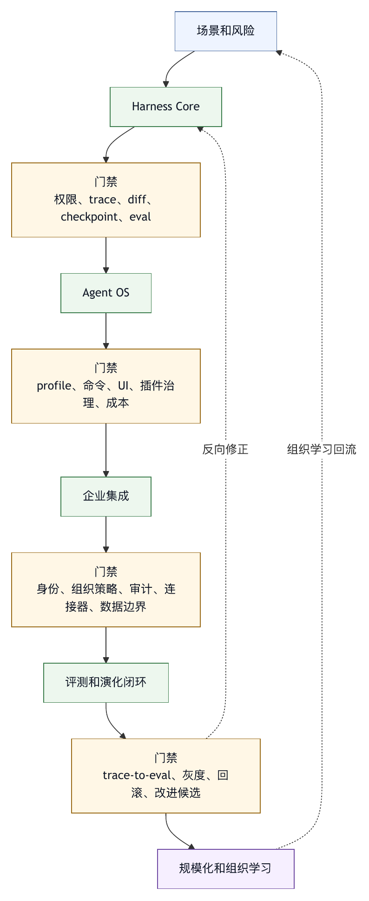

# 第四十一章 建设路线图

## 41.1 从哪里开始

建设 harness 时，最难的常常是决定先做什么，不是写第一版代码。团队很容易被高级能力吸引：多智能体、插件市场、远程任务、自动改进、企业控制台。但如果基础工具、权限、trace 和评测还没有做好，高级能力只会放大风险。

建设路线图是工程优先级参考，不是固定项目计划。不同团队可以根据场景调整，但不应跳过关键安全和可观测边界。

路线图分为六个阶段：

1. 明确场景和风险。
2. 建立 harness core。
3. 产品化为 Agent OS。
4. 接入企业系统。
5. 建立评测和演化闭环。
6. 规模化和组织学习。

## 41.2 阶段一：明确场景和风险

第一阶段不要急着写工具。先明确：

- 目标用户是谁。
- 任务类型是什么。
- 是否需要修改环境。
- 是否涉及敏感数据。
- 是否有外部副作用。
- 成功如何验证。
- 失败代价是什么。

低风险文档总结和高风险生产变更需要完全不同的 harness。若场景不清，系统会在权限、UI 和评测上摇摆。

此阶段产物应包括：场景列表、风险分类、最小成功指标、禁止动作和初始评测样本。

## 41.3 阶段二：建立 Harness Core

第二阶段建设最小可用运行基底。

优先能力包括：

- 模型契约。
- 上下文装配。
- 文件读取和搜索。
- 精确编辑。
- Shell 风险控制。
- 权限模式。
- 工作区限制。
- Trace。
- Diff。
- Checkpoint。
- 基础测试工具。
- 最终证据包。

这一阶段的目标是让一次 agent run 可理解、可控制、可恢复，不是功能丰富。

最常见错误是先做更多工具，却没有先做权限和 trace。没有权限和 trace，工具越多越危险。

## 41.4 阶段三：产品化为 Agent OS

当 harness core 稳定后，可以进入产品化。

重点能力包括：

- 持久会话。
- 命令系统。
- Profile。
- 命令面板。
- TUI / IDE 控制面。
- 多智能体调度。
- MCP 生命周期。
- 插件 manifest。
- 后台任务。
- 成本和上下文状态。

产品化依赖复用和可见性。用户不应每次重新解释流程，也不应看不见智能体正在做什么。

这一阶段要避免“功能市场化”过早。插件和多智能体必须接入权限、trace 和版本治理。

## 41.5 阶段四：企业集成

企业集成阶段把平台接入组织工作流。

重点能力包括：

- 身份。
- 租户。
- 组织策略。
- 代码平台连接器。
- CI 连接器。
- 文档和知识库连接器。
- 消息和审批连接器。
- 审计日志。
- 数据分类。
- 插件审查。
- 成本归因。

这一阶段的目标，是让智能体能在组织边界内行动。团队要确认动作是否有主体、权限、证据和审计，而不是只看是否连接 API。

## 41.6 阶段五：评测和演化闭环

平台进入真实使用后，必须建立演化闭环。

重点能力包括：

- 失败样本队列。
- Trace-to-eval。
- 安全 eval。
- 场景 eval。
- 回归 eval。
- 用户反馈结构化。
- 改进候选。
- 影子运行。
- 灰度发布。
- 回滚。

这一阶段决定平台是否越用越强。没有 eval 和反馈闭环，平台只能靠经验修补。

## 41.7 阶段六：规模化和组织学习

最后是规模化。规模化是在共同治理下扩展场景，不等于让所有团队立刻使用智能体。

重点能力包括：

- 学习资产库。
- 培训。
- 审稿文化。
- 事故复盘。
- 治理委员会或轻量审查机制。
- 平台运营。
- 插件生态。
- 成本管理。
- 场景模板。

规模化阶段要关注人的负担。审稿人是否被压垮？用户是否理解审批？安全团队是否参与设计？平台团队是否有运营能力？这些问题决定长期成败。

## 41.8 优先级原则

建设路线图可以用几个原则指导。

第一，先控制副作用，再扩大能力。

第二，先记录证据，再自动优化。

第三，先做场景 eval，再比较模型。

第四，先让用户看懂，再让系统自治。

第五，先支持回滚，再允许高风险动作。

第六，先沉淀规则，再做组织推广。

这些原则可以避免很多弯路。Harness 是控制系统，控制面永远优先于炫技功能。

## 41.9 路线图检查表

制定路线图时，可以使用以下检查表。

场景：

- 任务和风险是否清楚？
- 成功标准是否可验证？

核心：

- 是否有权限、trace、diff 和回滚？
- 工具是否结构化？

产品：

- 用户是否能复用命令和 profile？
- UI 是否展示状态和审批？

企业：

- 身份、连接器、审计和策略是否到位？

演化：

- 失败是否进入 eval？
- 改进是否有灰度和回滚？

组织：

- 是否有培训、复盘和学习资产？
- 是否有成本和运营机制？

路线图需要随失败样本和组织目标持续调整，不会一次写完。

## 41.10 Roadmap Charter

路线图的第一份产物应是 roadmap charter。它把建设目标、约束、风险和阶段性交付写清楚。

```yaml
harness_roadmap_charter:
  program: coding-agent-platform
  horizon: 12_months
  target_scenarios:
    - code_review_assist
    - ci_failure_diagnosis
    - small_bugfix_to_pr
  non_goals:
    - autonomous_production_deploy
    - unrestricted_shell_agent
    - public_plugin_marketplace
  guiding_principles:
    - control_side_effects_before_expanding_tools
    - evidence_before_autonomy
    - eval_before_model_switching
    - rollback_before_high_risk_actions
  risk_thresholds:
    external_write: ask_with_preview
    sensitive_paths: require_approval
    production_credentials: deny
  success_metrics:
    - evidence_package_completeness
    - review_rework_reduction
    - ci_diagnosis_accuracy
    - trace_to_eval_conversion
  release_gates:
    - permission_gate
    - trace_gate
    - eval_gate
    - incident_response_gate
```

Charter 的作用，是防止路线图被功能欲望牵着走。写清 non-goals 尤其重要。很多平台的失败来自过早承诺无人值守、跨系统写入、插件生态和自动发布，结果基础控制面还没建好。

## 41.11 前 90 天计划

对于多数团队，前 90 天不应追求完整 Agent OS，而应做一个可控的 harness core 试点。

前 30 天：确定场景和最小运行基底。

- 选 1 到 2 个低到中风险场景，如代码审查辅助和 CI 失败分析。
- 定义禁止动作，如生产部署、外部写入、敏感文件读取。
- 建立模型契约、工作区边界、只读工具和 diff 展示。
- 设计 trace envelope，至少记录任务、上下文、工具、审批、修改和验证。
- 收集 20 到 50 个真实样本作为初始 eval。

第 31 到 60 天：加入受控修改和验证。

- 增加精确编辑工具和 checkpoint。
- 建立 shell 风险分类和审批。
- 接入项目规则和测试命令发现。
- 生成 evidence package。
- 运行小规模用户试点，记录失败样本。
- 建立安全推演样本，覆盖 prompt injection、危险 shell 和无证据总结。

第 61 到 90 天：形成闭环。

- 把失败样本转成 eval。
- 建立质量门禁和最终总结约束。
- 形成 profile 和命令，而不是靠用户 prompt。
- 建立每周 triage：失败、成本、审批拒绝、用户反馈。
- 决定是否进入下一阶段：更多场景、更多用户或更多工具。

90 天计划的关键，是产出可验证基底，不是追求演示效果。一个能可靠处理少数场景的 harness，比一个能演示所有场景但没有证据链的平台更有价值。

## 41.12 表 41-1：路线图阶段门禁

每个路线图阶段都应有进入门禁和退出门禁，阶段迁移条件见表 41-1。

| 阶段迁移 | 最低门禁 |
|---|---|
| 阶段二到阶段三：从 harness core 到 Agent OS | 主要工具都有 schema、权限和 trace；<br/>文件修改可 diff、可 checkpoint、可回滚；<br/>shell 风险分类可执行；<br/>最终证据包能区分已验证和未验证；<br/>至少有一组回归 eval；<br/>用户能理解审批提示。 |
| 阶段三到阶段四：从 Agent OS 到企业集成 | 有身份和团队归属；<br/>有组织策略覆盖能力；<br/>有审计日志；<br/>连接器支持最小权限和外部写入 preview；<br/>插件或 MCP server 有 manifest 和审查；<br/>trace 保留和脱敏策略明确。 |
| 阶段四到阶段五：从企业平台到演化闭环 | 失败样本可以进入队列；<br/>trace 能转成 eval；<br/>支持灰度发布和回滚；<br/>改进候选有 owner、证据和门禁；<br/>安全 eval 不被成功率指标稀释。 |

阶段门禁让路线图更诚实。未满足门禁时，继续加功能只会堆高风险。

## 41.13 案例：先做插件生态导致返工

某团队在第一年就决定建设插件市场，希望让业务团队自行扩展智能体能力。平台很快支持插件安装、工具注册和命令分发。业务团队积极接入 issue、文档、数据库和云资源插件。表面上生态繁荣，问题也快速出现。

第一个问题是权限模型不统一。每个插件自己定义工具风险，审批文案风格不同。

第二个问题是 trace 不统一。某些插件只记录自然语言日志，某些记录完整参数，审计无法横向比较。

第三个问题是版本治理不足。插件升级后新增外部写入工具，用户没有得到清晰提示。

第四个问题是安全 eval 缺失。Shadow server、输出注入和过宽 roots 都只能靠人工发现。

最后平台不得不暂停插件扩展，补做 server manifest、工具注册表、权限策略、输出防火墙和插件发布门禁。返工成本比一开始先建治理框架高得多。

这个案例把路线图顺序问题暴露出来。插件生态属于放大器。基础 harness 没有权限、trace、版本和 eval 时，生态越活跃，风险越难收束。

## 41.14 路线图指标

路线图也需要指标。指标不应只看“发布了多少功能”，而应看平台能力是否更稳。

可以使用四类指标。

第一，能力交付指标。完成了哪些工具、profile、trace、eval、连接器、UI 控制面。

第二，质量指标。证据包完整率、审查返工、工具错误率、审批拒绝原因、无关 diff 比例。

第三，风险指标。高风险工具调用、外部写入、敏感路径触碰、安全 eval 失败、事故和回滚。

第四，学习指标。失败样本进入 eval 的比例、改进候选关闭周期、规则复用率、重复事故下降。

路线图评审应同时看四类指标。只看能力交付，会把平台做成工具堆；只看风险，会把平台做成禁用系统；只看质量，会忽略学习速度。Harness 建设的难点，是同时提高能力、降低风险、增加证据和加快学习。

## 41.15 图 41-1：建设路线图与门禁

图 41-1 将建设路线图按阶段门禁展开，说明每一步能力扩展都需要控制和证据。

<figure><figcaption><p>图 41-1：建设路线图与门禁</p></figcaption></figure>

```text
场景和风险
   |
   v
Harness Core
   |  门禁：权限 / trace / diff / checkpoint / eval
   v
Agent OS
   |  门禁：profile / 命令 / UI / 插件治理 / 成本
   v
企业集成
   |  门禁：身份 / 组织策略 / 审计 / 连接器 / 数据边界
   v
评测和演化闭环
   |  门禁：trace-to-eval / 灰度 / 回滚 / 改进候选
   v
规模化和组织学习
```

路线图不是线性瀑布。每一阶段都会反向修正前一阶段。但如果门禁缺失，反向修正会变成事故后的返工。

## 41.16 路线图治理模型

建设路线图本身也需要治理。很多团队第一次写路线图时，会把它写成产品功能列表：支持更多模型、支持更多工具、支持更多插件、支持更多场景。这样的列表无法回答一个关键问题：每个能力上线前，系统需要具备哪些控制、证据和组织责任。

路线图治理模型应包含四个层次。

第一层是方向治理。它回答为什么建设 harness：是为了提高研发效率、降低运维事故、规范企业智能体使用，还是为了建立统一平台。方向不同，优先级不同。若目标是企业治理，身份、审计和受管配置会早于炫目的多智能体；若目标是研发效能，工作区、测试证据和代码审查流程会早于知识库写回。

第二层是阶段治理。每个阶段必须有进入条件、退出条件、风险边界和可交付证据。阶段是能力承诺，不是时间标签。一个团队可以在两个月内达到 L2，也可能一年仍停在 L1，关键看证据是否成立。

第三层是变更治理。模型升级、工具新增、权限放宽、插件接入、连接器上线和用户范围扩大，都应被视为路线图变更。变更不能只由功能 owner 决定，还要经过安全、数据、运营和场景 owner 的评估。

第四层是复评治理。路线图不是写完后锁定一年。真实使用会产生失败样本、用户反馈、成本异常、审批疲劳和安全推演结果。每一次复评都可能改变阶段顺序。NIST AI RMF 与 Playbook 提供了治理、映射、度量和管理风险的持续活动参照，Playbook 也更适合作为自愿采用的实践指南，而不是逐项硬性清单。〔注41-1〕 Harness 路线图也应沿着这个思路运行。

## 41.17 场景组合与投资排序

路线图起点是“哪些场景最值得先做”，不是“平台应该有哪些能力”。场景组合决定投资顺序。

可以把场景按价值和风险放入四象限。高价值低风险场景适合先做，例如代码审查辅助、CI 失败摘要、文档问答和测试建议。它们能快速验证用户价值，同时外部副作用较少。高价值高风险场景需要更强控制，例如自动修复生产 runbook、外部系统写入、数据分析报告发布和安全响应。低价值低风险场景可以作为学习材料，但不应占用主路线图。低价值高风险场景应明确列入 non-goals。

投资排序还要考虑“通用控制点”。例如连接器 manifest、trace envelope、审批 preview、eval case schema、tool risk class、profile registry 这些能力本身不直接产生业务 demo，却能支撑多个场景。路线图应优先建设能复用的控制点，而不是为每个场景写一次性胶水代码。

一个常见错误，是先选最炫的场景。比如“自动从 issue 到 PR 到发布”，看起来完整，但同时涉及代码修改、测试、CI、外部写入、审批、发布、回滚和事故响应。若团队刚起步，这类场景会把所有短板一次性暴露出来。更合理的做法是选择同一价值链中的窄切片：从 CI 失败诊断开始，逐步进入小补丁建议、受控 PR 草稿，再考虑更高自动化。

## 41.18 Roadmap Backlog

路线图需要 backlog，但这个 backlog 不应只记录功能需求。Harness roadmap backlog 至少应包含六类条目。

第一类是能力条目，例如文件编辑、shell 审批、MCP server 管理、知识库检索、企业连接器和多智能体调度。

第二类是控制条目，例如权限策略、sandbox profile、secret broker、输出防火墙、外部写入 preview 和补偿路径。

第三类是证据条目，例如 trace 字段、evidence package、eval 报告、审批摘要、run record 和审计导出。

第四类是场景条目，例如代码审查、CI 诊断、数据分析、知识库问答、安全推演和企业任务自动化。

第五类是组织条目，例如 owner、培训、支持流程、事故响应、风险接受和插件审查机制。

第六类是债务条目，例如旧工具缺 schema、trace 不完整、审批文案不一致、eval 样本不足、连接器权限过宽。

Backlog 中每个条目都应标注依赖和风险。多智能体调度依赖 trace 和调度锁；插件生态依赖 server manifest 和权限映射；自动改进依赖 eval、影子运行和回滚。若依赖未完成，条目只能进入准备状态，不能强行排入发布。

## 41.19 工作流拆解

建设路线图应按工作流拆解，而不是按团队组织结构拆解。用户关心的是任务能否完整完成，事故也发生在端到端链路上。

以“从 issue 到 PR 草稿”为例，工作流可以拆成：读取 issue、识别任务、装配代码上下文、生成计划、读取相关文件、提出 patch、运行验证、生成证据包、请求人工审查、更新 PR 描述。每一步都有不同控制点。读取 issue 涉及外部文本可信度；装配代码上下文涉及 repo map 和权限；生成 patch 涉及编辑事务；运行验证涉及 shell 风险；更新 PR 描述涉及外部写入。

路线图如果只写“支持 issue 到 PR”，会掩盖这些控制差异。更好的写法是逐步上线工作流切片：第一版只读 issue 并生成计划；第二版生成 patch 但不写外部系统；第三版允许创建 PR 草稿；第四版才允许自动更新部分字段。每个切片都有自己的门禁。

工作流拆解还能帮助团队发现缺失能力。若某一步无法记录证据，就说明 trace 需要补；若某一步无法撤销，就说明补偿路径需要补；若某一步需要用户判断但 UI 看不懂，就说明审批体验需要补。

## 41.20 组织角色与 RACI

路线图需要组织角色。没有角色分工，路线图会变成平台团队的孤军推进。

平台负责人对 harness core、工具系统、trace、eval、运行时可靠性负责。安全负责人对权限、sandbox、prompt injection、供应链、红队推演和风险接受标准负责。数据负责人对数据分类、脱敏、保留、查询权限和敏感字段治理负责。场景负责人对真实任务、验收样本和业务影响负责。产品负责人对用户界面、审批体验、反馈入口和可理解性负责。运营负责人对支持流程、SLO、成本和用户培训负责。

每个路线图条目都应有 RACI。Responsible 是实际执行者；Accountable 是最终负责决策的人；Consulted 是必须参与评审的人；Informed 是需要同步的人。例如“上线知识库写回”这个条目，平台团队负责写回机制，知识库 owner 对发布责任负责，安全团队参与权限和注入评审，业务团队被告知变更范围。

RACI 的价值，是让路线图从“谁有空谁做”变成“谁有责任谁决策”。智能体平台跨越模型、工具、数据和组织流程，若责任不清，问题会在事故发生后才暴露。

## 41.21 技术架构切片

路线图还应按技术架构切片。一个可持续的 harness 不应由一组临时脚本堆起来，而应有稳定的分层。

第一层是模型与供应商层，包含 model registry、model contract、路由、降级、成本预算和升级评测。

第二层是上下文层，包含项目规则、检索、repo map、知识源、压缩、来源标签和权限过滤。

第三层是工具与执行层，包含工具 registry、schema、risk class、sandbox、shell runner、文件编辑、连接器和 MCP server。

第四层是控制层，包含权限、审批、guardrail、质量门禁、预算、回滚和事故响应。

第五层是证据层，包含 trace、audit log、evidence package、eval、run record 和报告。

第六层是产品层，包含 CLI、TUI、IDE、Web 控制台、命令、profile、timeline 和管理后台。

路线图应避免只推进产品层。界面做得越早，越容易给用户一种“系统已经成熟”的错觉。技术架构切片能提醒团队：每个漂亮能力背后，都要有控制层和证据层支撑。

## 41.22 风险驱动计划

路线图应该风险驱动，不能只功能驱动。功能驱动问“用户想要什么”；风险驱动还要问“这个能力失败时会造成什么”。

可以为每个条目打风险标签：本地文件副作用、shell 执行、外部系统写入、敏感数据、长期记忆、插件供应链、模型升级、自动化改进、多智能体并发、成本放大。风险标签决定门禁。

低风险只读能力可以快速试点。中风险本地修改需要 diff、checkpoint、测试证据和完成门禁。高风险外部写入需要 preview、审批、审计、补偿路径和安全 eval。涉及敏感数据的能力需要数据分类、脱敏、保留策略和访问审计。涉及插件和 MCP 的能力需要 server inventory、版本治理和输出防火墙。

风险驱动计划还有一个好处：它能解释为什么某些功能暂时不做。用户可能想要自动关闭工单、自动发布知识库、自动提交代码。路线图可以明确说明：暂时不做，是因为外部写入、审批预览、审计和回滚还没有达到门禁。

## 41.23 自研、采购与集成边界

建设路线图必须回答自研和采购边界。团队不一定要自己实现所有能力，但必须自己承担治理责任。

可以采购模型、托管运行环境、企业连接器、代码平台集成、日志系统、评测工具和安全扫描工具。但采购并不自动带来适配本组织的权限模型、数据分类、场景 eval 和事故响应。外部产品提供能力，内部 harness 需要定义如何使用这些能力。

OpenAI Codex 企业相关文档展示了环境、权限、组织配置和治理控制等企业化能力，可作为路线图采购与集成讨论中的产品参照。〔注41-2〕 这类产品能力可以成为路线图中的一部分，但路线图仍要明确本组织如何映射身份、仓库、审批策略、敏感数据、审计保留和连接器权限。

自研边界通常落在场景差异和组织责任上。通用模型调用可以采购；特定 repo profile、内部知识库状态、业务审批规则、事故复盘格式和组织学习资产，往往需要内部定义。采购能加速建设，但不能替代清晰的责任边界。

## 41.24 试点策略

试点不是小范围上线这么简单。好的试点要有明确假设、范围、样本和退出条件。

试点范围应选择愿意反馈、任务真实、风险可控的团队。不要只选最懂平台的核心团队，也不要一开始选择最复杂的业务线。最合适的试点团队，既有真实痛点，也有能力参与复盘。

试点假设要具体。例如“CI 失败诊断能减少审稿人初筛时间”“代码审查辅助能提高问题发现率”“知识库问答能减少重复咨询”。若假设不具体，试点结束后很难判断是否继续投资。

试点样本要真实。内部 demo 样本太干净，无法暴露上下文缺失、权限不一致、文档过期、测试 flaky 和用户误解。试点应收集真实 run、真实失败、真实拒绝和真实用户反馈。

试点退出条件也要提前写清。达到哪些指标可以扩大范围，出现哪些失败必须暂停，哪些能力只能保持只读，哪些问题必须修复后进入下一阶段。没有退出条件，试点会长期停在灰色状态。

## 41.25 用户体验落地

路线图不能把 UI 当最后包装。agent harness 的用户体验本身就是控制面。

第一，用户需要看到智能体当前阶段：在理解任务、读取上下文、计划修改、执行工具、等待审批、运行验证，还是生成总结。阶段不可见，用户无法判断是否该介入。

第二，用户需要看到风险和证据。审批不能只显示工具名，最终总结不能只说“完成”。用户要看到文件 diff、命令、测试、引用、外部对象、未验证事项和拒绝原因。

第三，用户需要能收窄范围。一个成熟界面应允许用户只批准某个文件、只运行某个测试、只创建草稿、只读取某个目录，而不是在全局允许和全局拒绝之间选择。

第四，用户需要能恢复。撤销、回滚、checkpoint、重新运行 eval、导出证据包、查看 trace，都应进入产品体验。恢复能力藏在后台，等于没有给用户使用。

因此，路线图中的 UI 任务应与权限、trace、回滚和门禁一起规划。界面不是装饰，它是 harness 控制系统的一部分。

## 41.26 研发流程接入

对于 coding-agent harness，研发流程接入通常是第一批高价值路线图。它包括 issue、代码、测试、CI、代码审查、PR、release note 和事故复盘。

接入研发流程时应避免绕过现有工程纪律。智能体可以生成 patch，但仍要遵守代码 owner、测试策略、CI、代码审查和发布流程。智能体可以总结 CI 失败，但不能把未验证假设写成确定结论。智能体可以创建 PR 草稿，但不能替代审稿人的责任。

路线图可以按三步推进。第一步是只读辅助：issue 理解、代码定位、CI 诊断、审查建议。第二步是受控修改：小 patch、测试运行、证据包、PR 草稿。第三步是流程协作：自动更新 PR 描述、关联 issue、生成 release note、沉淀失败样本。

每一步都要有门禁。只读辅助看引用和证据；受控修改看 diff、测试和回滚；流程协作看外部写入 preview、审计和补偿路径。

## 41.27 企业连接器治理

企业连接器是路线图中最容易低估的部分。连接一个 API 很快，治理一个连接器很慢。

每个连接器都应有 connector manifest，说明身份模式、权限范围、可读对象、可写对象、数据分类、审计字段、速率限制、错误语义、补偿路径和 owner。没有 manifest 的连接器不应进入正式路线图。

连接器上线应分级。只读查询先于草稿写入，草稿写入先于正式写入，单对象写入先于批量写入，低风险对象先于高风险对象。每升一级，都要补审批、trace、eval 和事故响应。

连接器还要有退役计划。企业系统会升级、API 会变化、权限模型会调整、团队 owner 会变更。路线图应包含连接器版本监控、兼容层、迁移窗口和下线流程。否则连接器越多，平台越脆弱。

## 41.28 数据治理与合规节奏

一旦路线图涉及企业数据，就不能只看功能进度。数据治理需要跟路线图同步。

第一阶段要建立数据分类。哪些数据可以进入模型上下文，哪些只能聚合，哪些需要脱敏，哪些不能进入第三方服务，哪些不能写入 trace。没有分类，权限策略就没有依据。

第二阶段要建立数据流图。用户输入、文件、知识库、数据库、工具输出、模型请求、trace、eval 样本、人工审核队列和导出报告之间如何流动，必须可见。很多泄露发生在辅助系统，而不是最终回答。

第三阶段要建立保留和删除策略。Trace 保存多久，eval 样本是否脱敏，用户能否删除会话，事故复盘如何共享，审计日志如何导出。路线图中的观测能力越强，数据保留责任越重。

第四阶段要接入合规评审。不是所有团队都需要重型合规，但涉及客户数据、生产系统、财务、医疗、未成年人或跨境数据时，路线图必须预留评审时间。临近上线才找合规，会导致返工。

## 41.29 Eval 与安全样本建设

Eval 不应等平台成熟后再做。它应该从前 30 天就进入路线图。

初始 eval 可以很小，但必须真实。每个目标场景至少收集 20 到 50 个代表性样本，覆盖成功路径、失败路径、无答案、权限拒绝、上下文缺失和用户误解。样本不必一开始自动化全部评分，但要有输入、预期行为、禁止行为和证据要求。

安全样本应与功能样本并行建设。文档注入、危险 shell、敏感路径、外部误写入、数据泄露、插件投毒和多智能体上下文污染，都应有最小可复现场景。安全样本不能在事故后才补。

Eval 建设也要有路线图。第一阶段是手工评审样本；第二阶段是自动回放；第三阶段是门禁集；第四阶段是线上失败回流；第五阶段是从 trace 自动生成候选样本。每一步都要处理数据脱敏和样本 owner。

## 41.30 运营模型与 SLO

平台进入真实使用后，路线图必须包含运营模型。没有运营模型，平台团队会被支持请求吞没。

运营模型首先要定义服务边界。哪些任务平台支持，哪些任务用户自担风险，哪些连接器由平台维护，哪些由业务团队维护，哪些问题进入安全响应，哪些问题进入普通支持。

其次要定义 SLO。智能体任务排队时间、运行成功率、trace 可用性、审批服务可用性、连接器错误率、成本预算告警、事故响应时间，都可以成为 SLO。SLO 不必一开始很严格，但必须能反映用户依赖程度。

还要定义支持分层。普通使用问题由场景 owner 或一线支持处理；平台运行问题由平台团队处理；权限和数据问题由安全与数据 owner 处理；事故进入响应流程。没有分层，所有问题都会流向少数核心工程师。

运营指标应进入路线图评审。若支持工单增长快于能力建设，说明平台推广过快；若重复问题很多，说明文档、培训或产品体验不足；若高风险审批拒绝率异常，说明权限或文案需要调整。

## 41.31 版本、迁移与兼容

路线图不是只建设新能力，还要管理旧能力。Harness 一旦被多个团队使用，版本迁移就成为长期任务。

模型版本、工具 schema、trace schema、profile、插件协议、审批文案、连接器 API 和 eval case 都会变化。每种变化都可能影响历史 run、历史审计、用户习惯和自动化流程。

路线图应定义兼容策略。哪些变更可以向后兼容，哪些需要迁移工具，哪些需要用户确认，哪些需要冻结窗口，哪些可以灰度。没有兼容策略，平台每次升级都会变成小型事故。

迁移计划应包含回滚。新工具 schema 失败时能否回到旧版本；新模型表现不稳定时能否切回旧模型；新审批 UI 导致误解时能否恢复；新连接器权限策略误拦时如何处理例外。路线图中的“升级”必须配套“降级”。

## 41.32 成本预算与容量

成本和容量要在路线图阶段设计，不能等上线后再交给财务处理。智能体平台的成本来自模型 token、工具调用、检索、存储、trace、eval、子智能体、长任务和人工等待。

前期路线图应建立成本可见性。每个 run 至少能估算模型成本、工具耗时、上下文大小和失败重试。团队不知道成本结构，就无法判断哪些能力值得推广。

中期路线图应建立预算控制。按用户、团队、项目、场景和 profile 设置预算；长任务、批量任务和多智能体任务需要更严格预算。预算用于防止失控，不是为了省钱。

后期路线图应建立容量规划。队列、并发、供应商配额、连接器限流、数据库查询、CI 资源和人工审稿人都是容量。多智能体能力会放大容量消耗，不能只看单次任务。

路线图评审应同时看成本和质量。一个低成本智能体如果频繁漏掉上下文，可能造成更高人工返工；一个高成本智能体如果显著减少事故和审查时间，也可能值得。成本指标必须与业务价值和风险控制一起判断。

## 41.33 培训与变更管理

智能体平台上线会改变人的工作方式。路线图若只规划技术，不规划培训和变更管理，会让用户在不理解边界的情况下使用系统。

培训内容应按角色分层。普通用户学习如何描述任务、查看 diff、理解审批、判断证据包和反馈失败。审稿人学习如何审查智能体产物、识别虚假完成、要求补证据。平台管理员学习 profile、权限、连接器和审计。安全与数据 owner 学习安全样本、风险接受和事故响应。

变更管理还包括沟通节奏。每次重要能力上线，应说明新增能力、默认关闭或开启状态、风险边界、已知限制、回滚方式和反馈渠道。不要让用户从界面变化中猜测平台策略。

培训材料也要进入学习资产库。优秀任务样例、失败案例、审批解释、证据包样例、常见误区和复盘摘要，都可以沉淀为组织学习资产。路线图越往后，人的学习越重要。

## 41.34 路线图复盘

路线图需要定期复盘。复盘要检查路线图假设是否成立，而不只是看是否按期完成。

复盘可以问十个问题。目标场景是否仍然正确？用户是否真的获得价值？风险是否比预期高？哪些门禁阻断了错误？哪些事故说明门禁不足？哪些功能没人用？哪些控制点被绕过？哪些支持问题重复出现？哪些投资产生了复用能力？下一阶段是否需要收缩范围？

复盘还要区分延期原因。有些延期来自工程低估，有些来自风险边界不清，有些来自组织 owner 缺失，有些来自外部系统依赖。不同原因对应不同改法。不能把所有延期都归为“开发慢”。

路线图复盘应产生三类输出：继续推进的条目、暂停或取消的条目、必须补的控制点。取消条目不是失败，它说明团队学到了新的边界。

## 41.35 反模式补充

建设路线图中有几类反模式。

第一，先做全能平台。全能平台往往什么都能演示，什么都不够可靠。

第二，先做插件生态。没有权限、trace、版本和 eval，插件生态会放大不可控能力。

第三，先接企业系统。身份、审计、数据分类和补偿路径没准备好时，企业连接器会把个人工具风险升级为组织风险。

第四，先追求自治。没有证据、回滚和安全 eval，自治只是无人看管的自动化。

第五，路线图没有 non-goals。没有明确不做什么，团队会被所有需求拖走。

第六，试点没有退出条件。试点长期存在，既不扩大，也不关闭，最终变成没人负责的半成品。

第七，把成功案例当普遍规律。某团队用得好，不代表所有团队都具备相同上下文、纪律和风险承受能力。

第八，忽略运营。平台上线后没有支持、SLO、成本和培训，最终会被日常问题消耗。

## 41.36 设计评审问题清单

制定 harness 路线图时，可以用以下问题检查。

目标场景是否明确？是否按价值、风险和可复用控制点排序？

Roadmap charter 是否写清 non-goals、风险阈值、成功指标和发布门禁？

前 90 天计划是否聚焦少数真实场景，而不是完整平台？

每个阶段是否有进入门禁和退出门禁？门禁是否有可验收证据？

Backlog 是否同时包含能力、控制、证据、场景、组织和债务？

试点是否有真实样本、清晰假设、退出条件和反馈机制？

企业连接器是否有 manifest、最小权限、审计和补偿路径？

Eval、安全样本和 trace-to-eval 是否从早期就进入路线图？

运营模型是否定义 SLO、支持分层、成本预算和事故响应？

路线图是否定期复盘，并允许暂停、取消和降级？

若这些问题没有答案，路线图很可能只是功能清单，而不是建设计划。

## 41.37 最小可行实施清单

一个团队可以用以下清单启动建设。

第一，选定一个高价值低风险场景和一个中风险场景。前者验证价值，后者暴露控制需求。

第二，写 roadmap charter。明确目标、non-goals、风险阈值、成功指标和阶段门禁。

第三，建立最小 harness core。包括模型契约、上下文装配、文件工具、diff、权限、trace、checkpoint 和 evidence package。

第四，收集真实 eval 样本。每个场景至少 20 个样本，覆盖成功、失败、拒绝和安全边界。

第五，做小范围试点。选择愿意反馈的团队，限制工具和外部副作用，记录每次失败。

第六，建立每周 triage。看失败样本、成本、审批、用户反馈、安全风险和路线图阻塞。

第七，补控制点再扩场景。先补权限、trace、eval、回滚、审批和事故响应，再增加插件、多智能体、连接器和后台任务。

第八，形成复评机制。每月检查路线图假设，每季度复评成熟度，重大能力变更随时触发专项评估。

这份清单的价值，是让团队从第一天就把 harness 当作工程系统，而不是把它当作模型能力展示。

## 41.38 十二个月样例路线图

下面是一份可参考的十二个月路线图，用来说明能力和治理如何并行推进，不作为固定模板。

第 1 到 2 个月：场景与 harness core。选定代码审查辅助和 CI 诊断，建立模型契约、工作区边界、只读工具、diff、trace envelope 和初始 eval。

第 3 到 4 个月：受控修改。加入精确编辑、checkpoint、shell 风险分类、测试发现、evidence package 和完成门禁。开放小规模试点。

第 5 到 6 个月：产品化入口。建立 profile、命令、timeline、审批体验、用户反馈和成本可见性。把失败样本进入 eval。

第 7 到 8 个月：插件和连接器治理。上线工具 registry、插件 manifest、MCP server inventory、连接器 manifest、外部写入 preview 和审计字段。

第 9 到 10 个月：企业集成。接入身份、团队策略、受管配置、数据分类、审计导出、成本归因和支持流程。扩大到多个团队。

第 11 到 12 个月：演化闭环。建立 trace-to-eval、失败聚类、改进候选、影子运行、灰度发布和安全推演。形成季度成熟度复评。

这条路线重视顺序，不在 12 个月这个数字：先让系统可控，再让用户复用；先让证据完整，再让范围扩大；先让失败进入学习，再让平台自我改进。

## 41.39 路线图会议节奏

路线图需要固定节奏。没有节奏，路线图会在忙碌中失效；节奏过重，又会变成会议负担。合适的做法是把不同层级的问题放入不同频率的会议。

每周应有一次运行 triage。它关注近一周的失败样本、用户反馈、审批拒绝、成本异常、连接器错误、eval 回归和高风险工具调用。每周会不讨论宏大路线，只处理可行动问题：哪些样本进入 eval，哪些 bug 进入修复，哪些审批文案需要调整，哪些工具需要暂时降级。

每月应有一次路线图评审。它关注阶段目标是否仍然正确，关键门禁是否满足，试点是否扩大或收缩，风险是否变化，下一月投入是否需要调整。月度评审应看 evidence，而不是听进度口头汇报。Trace 报告、eval 报告、事故复盘、成本报表和用户反馈都应成为输入。

每季度应有一次成熟度复评。它关注系统是否仍适合当前责任边界：是否进入了更高风险场景，是否接入了新企业系统，是否扩大了用户群，是否有能力降级或范围收缩的需要。季度复评应连接第四十章的成熟度模型，而不是只看路线图完成率。

每次重大变更还应触发专项评审。重大变更包括模型升级、权限放宽、连接器新增、插件生态开放、后台自动化上线、数据源扩大和组织范围扩大。专项评审不必等待月度会议，因为风险不会按日历出现。

## 41.40 依赖管理与关键路径

Harness 路线图的依赖关系往往比普通产品复杂。一个看似简单的功能，可能依赖模型契约、上下文、权限、trace、UI、eval 和组织流程。若不显式管理依赖，团队会在最后一刻发现“功能写完了，但不能上线”。

可以把依赖分为三类。第一类是技术依赖，例如外部写入依赖连接器 manifest、审批 preview、审计字段和补偿路径。第二类是证据依赖，例如模型升级依赖回归 eval、影子运行和失败诊断。第三类是组织依赖，例如企业推广依赖身份、租户、支持流程、培训和风险接受机制。

关键路径通常不在最难写的代码上，而在最晚被发现的控制点上。很多团队能很快做出工具调用，却迟迟没有审计；能很快做出插件安装，却迟迟没有版本治理；能很快做出自动修改，却迟迟没有完成证据。路线图应把这些控制点提前放到关键路径，而不是上线前补。

依赖管理还要允许替代路径。如果正式企业连接器暂时无法上线，可以先做只读导入；如果自动写回门禁未通过，可以先做草稿导出；如果完整 trace 平台没准备好，可以先定义稳定 trace envelope 并保存到本地或受控对象存储。替代路径是在不破坏边界的情况下保持学习速度，不是降低标准。

路线图评审时，应特别检查“被阻塞的功能是否正在诱导团队绕过控制”。如果为了赶进度把审批改成宽授权，把 trace 改成自然语言日志，把 eval 改成手工印象，路线图虽然看起来推进了，成熟度却倒退了。

## 41.41 暂停、退出与范围收缩

成熟路线图必须允许暂停和退出。只会扩张的路线图是功能堆叠，不是路线图。

暂停条件应提前写入 charter。例如安全 eval 出现 S3 级失败、外部写入补偿路径不可用、trace 字段完整率低于门槛、连接器 owner 缺失、用户审批误解率升高、成本超过预算、事故复盘无法还原关键链路，都可以触发暂停。

暂停后的动作也要明确。低风险能力可以继续只读运行，高风险写入可以降级为草稿，后台自动化可以退回人工触发，插件可以进入 allowlist 模式，连接器可以限制到测试租户。暂停是把能力退回有证据支撑的范围，不是把系统关掉。

退出机制同样重要。某个场景长期没有用户价值、支持成本过高、风险超过收益，或者需要的组织责任没人承担，就应从路线图中退出。退出要保留学习：记录为什么退出，哪些能力可复用，哪些 eval 样本保留，哪些连接器或 profile 下线。会退出的路线图，才有精力投入最值得建设的场景。

## 41.42 第四十一章小结

建设 harness 应从明确场景和风险开始，形成可控制、可观测、可恢复的 harness core，再产品化为 Agent OS，并接入企业系统，建立评测演化闭环，逐步规模化为组织能力。

成熟路线图不会跳过基础边界。它把每一阶段都当作下一阶段的地基。只有地基稳，高级智能体能力才不会变成风险放大器。

建设路线图也是治理路线图：它决定能力何时扩大、风险何时收缩、证据何时成为下一阶段的入场券。

能被复盘和暂停的路线图，才可执行。

这也是平台信任和治理能力的来源。
