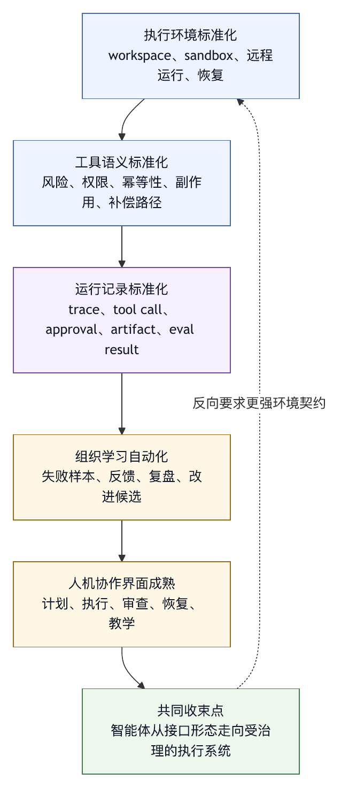

# 第四十二章 未来：模型、工具与软件工程的新边界

## 42.1 结束不是终点

本书从一个问题开始：为什么更强模型并不会自动带来可靠智能体系统？答案贯穿全书：模型能力需要运行基底。这个运行基底就是 harness。

进入最后一章，我们可以把视角放远。未来几年，模型会更强，工具协议会更统一，软件工程会更自动化，企业会更依赖智能体。很多今天需要复杂 harness 才能做到的事，未来可能变成模型或平台的默认能力。

但这并不意味着 harness engineering 会消失。恰恰相反，模型越能行动，harness 越重要。因为行动能力带来真实影响，真实影响需要边界、证据和治理。

## 42.2 模型会吸收一部分 Harness 能力

未来模型会吸收一些今天由 harness 提供的能力。例如，更好的工具选择、更稳定的长上下文、更强多模态理解、更可靠代码修改、更好的自我纠错、更低幻觉率。

这会减少一部分外部工程负担。系统不需要为每个简单任务构造复杂提示，也不需要为某些常见工具调用写很多补丁。

但模型不会吸收所有 harness 能力。权限、凭据、审计、组织策略、数据边界、外部副作用、成本归因、评测、回滚和人类责任，仍然属于系统和组织。模型可以建议，不能成为自己的监管者。

未来的 harness 可能更薄，但不会消失。它会从“弥补模型能力不足”转向“治理模型行动能力”。

## 42.3 工具会协议化

MCP 等协议表明，工具生态正在协议化。未来智能体连接工具、资源、提示、数据源和外部系统会更容易。企业内部也会出现更多标准连接器和插件市场。与此同时，协议本身也会演化。MCP SEP-2577 提出废弃 roots、sampling 和 logging，可作为早期协议能力因安全、复杂度和协议核心边界而被重新调整的案例。〔注42-1〕

这会显著降低接入成本，但也会放大治理问题。工具越容易接入，越需要信任、权限、版本、输出治理和安全评测。协议化解决“如何连接”，不会自动解决“是否应该连接”。

未来 harness 的一项核心能力，是成为工具生态的治理平面。它需要知道每个工具来自哪里，能做什么，风险如何，谁批准，如何审计，如何撤销。

## 42.4 软件工程会改变分工

Coding agent 会改变软件工程分工。开发者不再只写代码，还要设计任务、审查 diff、维护规则、评测智能体、治理工具和沉淀经验。

一些工作会被加速：

- 搜索代码。
- 生成测试。
- 修复简单 bug。
- 总结 PR。
- 分析 CI。
- 迁移样板代码。
- 生成文档。

一些工作会变得更重要：

- 架构判断。
- 需求澄清。
- 风险评估。
- 审稿。
- 评测设计。
- 事故复盘。
- 规则维护。

未来优秀工程师不仅会用智能体，还懂得如何把智能体放进可靠工作流。

## 42.5 组织会形成智能体平台职能

随着智能体使用规模扩大，组织会出现专门职能：智能体平台、AI platform、developer intelligence、automation governance。它们负责模型接入、工具平台、评测、权限、插件、成本、合规和学习资产。

这类似过去云平台、DevOps、SRE 和数据平台的发展。起初是个人脚本，后来变成团队工具，最终成为组织基础设施。

智能体平台需要同时支持业务团队快速创新，并防止每个团队重复踩安全和质量坑。它需要平台能力，也需要治理能力。

## 42.6 人的角色不会消失

智能体越强，越有人担心人的角色被替代。但从 harness engineering 的视角看，人的角色会变化，不会简单消失。

人仍然负责：

- 定义目标。
- 判断价值。
- 接受风险。
- 审查高影响结果。
- 处理伦理和组织责任。
- 维护规则和评测。
- 做跨系统权衡。
- 决定何时不该自动化。

人在环路是控制系统的一部分，不是低效率遗留。成熟 harness 会让人只在必要处介入，并提供足够证据让人高质量判断。

## 42.7 最大风险：看似可靠

未来智能体最大风险之一，是看似可靠。模型输出越来越流畅，工具调用越来越自然，UI 越来越像真实同事。系统可能在大多数普通任务中表现很好，于是用户降低警惕。

危险的失败往往发生在边界场景：权限冲突、过期文档、恶意输入、高风险工具、数据泄露、评测盲区、组织流程例外。Harness engineering 的价值，就是为这些边界场景设计防线。

不要因为平均表现好，就取消 trace、审批、评测和回滚。生产系统的可信度来自边界行为，而不是演示效果。

## 42.8 本书的核心命题

全书可以压缩成几个命题：

第一，模型不是系统。模型需要 harness 才能在真实环境中行动。

第二，工具不是函数。工具是受治理的环境接口。

第三，上下文不是聊天记录。上下文是控制面。

第四，权限不是提示词。权限必须由系统执行。

第五，评测不是榜单。评测是改进 harness 的反馈机制。

第六，UI 不是装饰。UI 是用户理解和控制智能体的界面。

第七，插件不是自由扩展。插件是能力和风险的分发机制。

第八，组织学习不是培训材料。它是让智能体能力持续可靠的制度。

这些命题构成 harness engineering 的基本世界观。

## 42.9 给建设者的建议

如果你正在建设智能体系统，可以从几条建议开始：

- 不要急于做自治，先做好证据。
- 不要急于接所有工具，先做好权限。
- 不要急于换更强模型，先找出失败根因。
- 不要只优化 prompt，检查工具和上下文。
- 不要只看成功案例，收集失败样本。
- 不要把用户审批当阻碍，改进审批信息。
- 不要让插件绕过治理。
- 不要让评测和生产脱节。
- 不要把组织经验留在聊天记录里。

这些建议朴素，但能避免许多昂贵错误。

## 42.10 未来边界

未来值得关注的边界包括：

- 模型如何安全代表人行动？
- 工具生态如何开放而不失控？
- 组织如何评测智能体系统？
- 经验如何沉淀为规则和测试？
- 智能体如何参与软件生命周期？
- 人如何在更高杠杆位置做判断？

Harness engineering 正是在这些边界上工作。

## 42.11 未来 Harness 的四种形态

未来的 harness 不会只有一种形态。至少会出现四类。

第一类是模型内生 harness。模型本身会更擅长工具选择、上下文保持、自我检查和多模态理解。这会让一些今天依赖外部 prompt 和规则的能力变成模型默认能力。但模型内生能力仍然需要外部系统验证。

第二类是平台内生 harness。云端 coding agent、企业 AI 平台、IDE、数据平台和知识库系统会把权限、环境、trace、eval、审批、连接器做成内置能力。用户不一定看到 harness 这个词，但会使用它的控制面。

第三类是协议化 harness。MCP、函数工具、插件 manifest、OpenTelemetry 语义约定、评测格式等会让不同系统之间更容易共享工具、证据和运行记录。协议化会降低接入成本，也会要求更清晰的信任模型。

第四类是组织内生 harness。规则、技能、runbook、事故复盘、评测样本、培训和治理节奏会成为组织知识的一部分。它不一定存在于某个代码库里，却决定智能体在组织中如何被使用。

这四类会互相叠加。未来成熟的 Agent OS，很可能同时依赖更强模型、平台控制面、协议生态和组织制度。

## 42.12 不会消失的控制问题

无论模型多强，以下问题不会由模型单独解决。

谁授权。模型不能自己决定代表谁访问什么资源。

谁负责。模型不能承担组织责任、法律责任和业务风险。

什么可以执行。工具、路径、外部系统、数据源和环境边界必须由系统执行。

什么算完成。验证标准、质量门禁、验收标准和未验证项必须显式存在。

如何复盘。Trace、版本、证据包和事故记录必须在模型之外可审计。

如何改进。失败样本、eval、灰度和回滚需要工程流程，而不是单次回答。

这些问题构成 harness engineering 的长期边界。模型能力越强，它们越重要，因为强模型更容易跨越人类原本会停下来判断的边界。

## 42.13 软件工程师的新职责

未来的软件工程师需要掌握三类能力。

第一，任务设计能力。工程师要能把模糊需求拆成智能体可执行、可验证、可回滚的任务。好的任务描述依赖清晰目标、约束、验收标准和证据要求，不是更长 prompt。

第二，系统审查能力。工程师要能审查智能体产出的 diff、trace、工具调用、测试结果和风险说明。审查对象包括代码，也包括智能体的行动过程。

第三，harness 改进能力。工程师要能把一次失败沉淀为规则、eval、工具 schema、审批文案、上下文策略或 runbook。未来高效团队的优势，不来自每个人手工写得更快，而来自组织让智能体越用越可靠。

这并不意味着每个工程师都要成为平台专家。但每个工程师都需要理解：智能体是进入软件工程系统的新执行者，不是外包劳动力。执行者越强，工作流设计越重要。

## 42.14 未来风险：自治幻觉与治理滞后

未来最大风险之一，是自治幻觉。系统看起来能独立完成任务，于是组织把它当作自治。实际上，它可能只是在常见路径上表现很好，在边界条件下仍然需要严格控制。

另一个风险是治理滞后。业务团队接入工具、写插件、开放外部系统、构建后台智能体的速度，可能快于平台团队建立权限、trace、eval 和事故响应的速度。治理让创新不把组织推入不可见风险，不是阻止创新。

第三个风险是评测错位。团队可能用简单 benchmark 证明模型变强，却没有测试自己的工具、数据、权限、UI 和组织流程。模型能力提升不等于系统风险下降。

第四个风险是知识污染。智能体生成越来越多文档、规则、代码和报告。如果写回治理不足，组织知识库可能被半真半假的内容污染，未来智能体又检索这些内容，形成错误循环。

这些风险都指向同一个结论：未来更需要把 harness 做成基础设施。

## 42.15 给读者的最终检查表

读完本书，如果你要回到自己的系统中检查，可以先问十个问题。

1. 我们的智能体到底能做哪些外部动作？
2. 每个动作由谁授权，谁承担责任？
3. 工具输出、文档、网页和用户输入是否都按来源分层？
4. 高风险动作是否有可理解的审批？
5. 每次 run 是否能还原上下文、工具、版本和证据？
6. 最终回答是否区分已验证、未验证和推断？
7. 失败是否进入 eval，而不是留在聊天记录里？
8. 插件和 MCP server 是否有 manifest、权限和审查？
9. 组织是否有学习资产库和复盘节奏？
10. 下一步建设是否在补短板，而不是追逐演示功能？

这十个问题比任何具体技术栈都更持久。工具会变，模型会变，协议会变，但这些问题会反复出现。

## 42.16 结语：把智能放进工程

Harness engineering 要做的是把智能放进工程。模型提供概率性的生成、推理和行动建议；工程提供边界、证据、状态、恢复、评测和组织责任。二者缺一不可。

如果只有模型，系统会聪明但不可靠。如果只有工程，系统会可控但缺少智能。Harness engineering 试图把二者连接起来：让模型在真实环境中行动，又让这种行动可观察、可审查、可恢复、可改进。

这也是本书标题的含义。Harness 是让智能能够安全承载重量的结构，不是束缚智能。工程的工作是设计让能力可用的连接、边界和反馈，而不是把模型关起来或盲目放开。

未来几年，很多术语会变化。智能体、copilot、assistant、workflow、tool use、MCP、eval、guardrail，都可能被新的产品语言替代。但只要模型要在真实系统中代表人行动，harness engineering 的问题就会存在。

成熟系统让人放心地说：“我们知道它做了什么，为什么做，做到了哪里，哪里没有做，出了问题如何恢复，下一次如何变好。”它不靠“模型居然会做这么多”的惊叹建立信任。

## 42.17 模型内生能力与系统外责任

未来模型会继续吸收一部分工程能力。更强的推理、更长上下文、更稳定的工具调用、更好的多模态理解、更可靠的代码修改，都会让一些今天由外部 harness 补上的能力变成模型默认能力。很多 prompt 技巧会消失，很多显式规则会内化，很多简单任务会更少依赖复杂编排。

但这不等于责任也进入模型。模型可以更会判断，但不能获得组织授权；模型可以更会调用工具，但不能自己决定哪些工具应该开放；模型可以更会写测试，但不能自己定义什么风险可接受；模型可以更会总结 trace，但不能替组织承担事故责任。

未来的边界会从“模型是否能做”转向“模型做成之后是否可负责”。今天很多讨论仍停留在能力问题：模型能否修 bug，能否写测试，能否操作浏览器。未来更重要的问题是责任问题：这个动作代表谁，影响谁，证据在哪里，失败如何恢复，谁可以复核，下一次如何防止同类错误。

这也是 harness engineering 不会被模型吞没的原因。模型能力越强，越需要一个外部系统来管理授权、环境、证据、审计、成本、数据和组织责任。模型内生能力会让 harness 的某些实现变薄，但会让 harness 的治理意义变重。

## 42.18 Agent OS 会成为开发环境的一层

未来软件工程环境会多出一层 Agent OS。它会成为介于人、模型、代码库、工具、CI、issue、文档和组织策略之间的运行层，不只是聊天框或 IDE 插件。

传统开发环境主要管理文件、编辑器、终端、调试器和版本控制。Agent OS 还要管理任务、上下文、工具、权限、计划、trace、eval、profile、插件、成本和审查。开发者面对的是一条可持续运行、可暂停、可复用、可回放的任务流，不只是一个单次回答。

OpenAI Agents SDK 中的 tracing、handoff、多智能体 orchestration、guardrail 和 eval 等抽象，提供了智能体应用从“调用模型”走向“运行系统”的 SDK 侧例证。〔注42-2〕 Codex enterprise controls 这类平台能力也可作为 coding agent 进入环境、组织策略、审批和治理控制组合阶段的产品参照。〔注42-3〕

Agent OS 的未来，是把 IDE、终端和代码平台编排成更高层的工作面，不是替代它们。它知道当前任务是什么，哪些文件被修改，哪些测试运行过，哪些权限被拒绝，哪些结论仍未验证，哪些失败已经进入 eval。对用户来说，这会像一个更主动的工作环境；对组织来说，这会是新的控制平面。

## 42.19 协议生态会开放，也会收缩

工具协议化会继续发展。MCP、函数工具、插件 manifest、智能体技能、OpenTelemetry、eval schema 等，会让工具和运行记录更容易跨系统流动。开放协议的价值，是降低连接成本，避免每个产品都重新发明工具接入方式。

但协议也会收缩。任何协议早期都可能尝试放进更多能力，随后再把不适合核心协议的部分移出。MCP SEP-2577 对 roots、sampling 和 logging 的废弃规划，可作为协议核心保持简洁、部分能力被重新放置的现实案例。〔注42-1〕

这对 harness 有一个长期启示：不要把协议某一版的功能当作永久架构前提。今天协议支持的能力，明天可能进入扩展；今天协议没有的治理字段，组织仍然需要自己实现。稳定的是治理问题，不是某个字段名。

未来成熟平台会同时支持协议开放和治理收口。对外，它允许团队接入工具生态；对内，它要求每个工具有 manifest、owner、权限、版本、输出策略、审计和 eval。协议负责连接，harness 负责承担连接后的责任。

## 42.20 评测会从榜单走向组织资产

软件工程智能体的评测会继续演化。SWE-bench 这类基于真实 GitHub issue 的 benchmark，把评测从代码补全推进到真实软件维护任务，要求模型面对仓库、依赖、测试和补丁验证。〔注42-4〕 这类公开评测会继续重要，因为它给行业提供共同参考。

但企业依赖智能体时，公开 benchmark 只是一部分。组织需要自己的 eval：自己的代码风格、自己的 CI、自己的安全边界、自己的数据权限、自己的知识库、自己的产品流程和自己的事故样本。没有组织 eval，平台无法知道某次模型升级是否适合自己的真实工作流。

未来 eval 会成为组织资产，像测试套件、runbook 和监控规则一样被维护。失败样本会有 owner，eval 会有版本，评分标准会被审查，数据会脱敏，回归结果会进入发布门禁。OpenAI 的 agent evals 和 agent improvement loop 资料提供了 trace、eval 与改进闭环结合的产品与 cookbook 参照。〔注42-5〕

这会改变工程文化。过去团队可能把一次智能体失败当作“模型今天不行”；未来成熟团队会问：这个失败是否已有样本？是否该进入 eval？是上下文缺失、工具描述错误、权限策略问题、还是模型能力不足？评测不再是采购模型时看的榜单，而是组织学习的基础设施。

## 42.21 Trace 会成为新的工程材料

未来软件工程不只审查代码，也会审查智能体的行动过程。Trace 会成为新的工程材料。

一个完整 trace 需要记录模型输出、用户目标、上下文来源、工具调用、权限决策、审批摘要、shell 命令、文件 diff、测试结果、外部写入、guardrail 触发、成本、模型版本和最终证据包。它让团队能回答“系统为什么这样做”。

随着智能体参与更多任务，trace 会进入多个流程。代码审查会查看智能体生成 patch 前读了哪些文件；事故复盘会查看智能体是否遵守权限；安全评审会查看敏感数据是否进入上下文；成本治理会查看长任务为什么重试；eval triage 会从 trace 中抽取失败样本。

未来 trace 的挑战在语义统一，不只在采集。不同工具、模型、插件、连接器和 UI 都需要用可比较的事件语言描述行动。没有统一语义，trace 只是大段日志；有了统一语义，trace 才能变成改进、审计和学习的材料。

## 42.22 多智能体会成为架构问题

多智能体不会只是“多几个角色”。它会成为系统架构问题。未来任务会被拆给规划、研究、编码、审查、测试、安全审查、文档写作、发布辅助等不同智能体。它们可能并行工作，可能通过 handoff 交接，可能以 agent-as-tool 的方式被管理者调用。

多智能体的价值是专业化和并行化。不同智能体可以有不同上下文、工具、权限和输出格式。一个智能体负责生成 patch，另一个负责审查风险，另一个负责运行验证，另一个负责整理证据。

但多智能体的风险也更高。上下文会丢失，责任会模糊，权限会传递，成本会放大，多个智能体可能同时修改同一对象，handoff 摘要可能污染后续决策。OpenAI Agents SDK 对 orchestration via LLM 与 orchestration via code 的区分，提供了“灵活性与确定性需要权衡”的实现参照；本书据此判断，这会成为未来系统设计中的持续问题。〔注42-2〕

未来 multi-agent harness 的核心不在角色命名，而在调度器、权限继承、上下文同步、锁与租约、fan-in 审查、trace 关联和失败传播。多智能体是组织分工进入软件系统，不是提示词表演。

## 42.23 代码库会为智能体重构

未来代码库本身会变得更 agent-friendly。目标是让人和智能体都更容易理解、验证和修改系统，不是讨好模型。

一方面，仓库会有更明确的指令文件、模块边界、测试入口、生成物说明和架构记录。AGENTS.md 已经提供了项目规则文件的公开样例；本书判断，这类文件会随着智能体协作增加而更常见，因为智能体需要知道本仓库的构建、测试、风格、安全边界和协作习惯。〔注42-6〕

其次，代码库会更重视可局部验证。大型单体测试、隐式环境变量、脆弱脚本和未记录依赖，会让智能体很难安全修改。可预测的测试、清晰的 module owner、稳定的 CLI、可复现的开发环境，会成为智能体时代的工程质量。

再次，代码审查会要求智能体提供过程证据。一个 patch 不只要看 diff，还要看它根据哪些文件做判断，运行了哪些测试，哪些风险未验证，是否修改了生成文件，是否触碰安全敏感模块。

未来“适合智能体的代码库”也会是更适合人维护的代码库。智能体迫使团队把隐性知识显性化，把局部验证做扎实，把运行环境标准化。这是智能体带来的反向工程收益。

## 42.24 软件交付流水线会变成协作流水线

未来的软件交付流水线不会只是 CI/CD，也会包含智能体协作。Issue、设计文档、代码修改、测试、代码审查、release note、知识库和事故复盘都会有智能体参与。

这条流水线会从“人提交代码，机器跑测试”变成“人定义目标，智能体提议变更，机器验证，人在高风险处审查，系统沉淀失败”。人、智能体、CI、审稿人和治理系统共同组成交付流水线。

这会改变流水线门禁。传统门禁看测试是否通过、代码是否经过审查、依赖是否安全。未来门禁还会看智能体是否有证据包，是否越权读取，是否运行了合适测试，是否把外部输入当事实，是否清楚标注未验证结论，是否把失败样本回流 eval。

软件交付不会因为智能体变得不需要纪律。恰恰相反，智能体会让纪律更可执行。以前团队靠文档要求“写清楚测试”；未来 harness 可以要求最终回答必须绑定测试证据。以前团队靠审稿人记得风险；未来 harness 可以在敏感模块触发额外审查。

## 42.25 产品边界会从功能转向承诺

未来智能体产品竞争不只在功能数量，而在承诺边界。用户不会只问“能不能改代码”，还会问“改错了怎么办”“是否会读秘密”“是否能审计”“能否遵守团队规则”“成本如何控制”“能否在企业策略下运行”。

产品边界会更像合同：这个智能体在什么环境中运行，默认有哪些工具，哪些动作需要审批，哪些数据会进入模型，trace 保留多久，谁能查看，如何删除，如何回滚，如何导出证据，如何处理插件。

这会推动产品语言改变。单纯宣传“全自动”“自主完成”“像同事一样工作”会变得不够专业。成熟产品会更准确地描述控制：只读、草稿、审批、外部写入、受管配置、组织策略、审计、回滚、eval。

对建设者来说，这是一种机会。能够清晰承诺边界的系统，会比只展示能力的系统更容易进入企业核心工作流。

## 42.26 企业智能体平台会成为内部基础设施

未来很多企业会拥有内部智能体平台，像今天拥有云平台、数据平台和 DevOps 平台一样。这个平台不一定完全自研，也可能由多个外部产品、内部连接器和治理系统组合而成。

它会提供共享能力：模型接入、工具 registry、连接器、权限、审计、trace、eval、profile、插件审查、成本归因、数据分类、风险接受和事故响应。业务团队在这个平台上构建自己的智能体应用，避免每个团队从零开始接模型和工具。

企业智能体平台的关键挑战，是在速度和治理之间找到结构化平衡。太松，会形成 shadow 智能体和 shadow MCP server；太紧，业务团队会绕开平台自建脚本。成熟平台会提供自助能力，同时把高风险动作纳入组织策略。

这也是智能体平台职能会出现的原因。它是智能执行能力的基础设施团队，不是“AI 工具管理员”。它需要懂模型、工具、软件工程、安全、数据治理、产品体验和组织变更。

## 42.27 本地、云端与混合运行会长期共存

未来智能体不会只运行在云端，也不会只运行在本地。二者会长期共存。

本地运行的优势是接近用户工作区、低延迟、能使用本地工具、容易融入终端和 IDE。它适合个人开发、快速修复、局部探索和需要用户实时监督的任务。它的挑战是环境差异大、审计困难、组织策略分发复杂。

云端运行的优势是环境可控、资源可调度、审计集中、适合后台任务和企业管理。它适合长任务、批量任务、组织级策略、远程 workspace 和团队协作。它的挑战是数据边界、凭据托管、环境重现和用户可见性。

混合模式会很常见：本地智能体负责交互和轻量修改，云端智能体负责长任务和受控环境；本地生成计划，云端跑验证；云端准备 PR，用户本地审查 diff。Harness 要解决的，是这两类运行环境之间的身份、上下文、证据和回滚一致性。

## 42.28 安全治理会进入默认配置

今天很多安全配置仍像高级选项。未来，安全治理会越来越多地成为默认配置：工作区隔离、敏感路径拒绝、外部写入审批、网络 egress 控制、插件 allowlist、trace 脱敏、安全 eval 和风险提示。

原因在于智能体的行动能力会进入更多真实系统，不是所有组织都变保守。默认安全边界能降低每个团队重复踩坑的成本。就像云平台默认提供 IAM、日志、密钥管理和网络策略，智能体平台也会默认提供权限、sandbox、审批和审计。

但默认安全不等于所有场景都一样。不同团队仍然需要 profile：只读研究 profile、个人 coding profile、企业连接器 profile、数据分析 profile、安全红队 profile。未来平台的成熟度，在于能按场景分发合适边界，不是一个全局开关。

## 42.29 成本会成为架构约束

未来模型成本可能下降，能力可能上升，但成本不会消失。更强智能体会运行更长任务、调用更多工具、产生更多 trace、跑更多 eval、启动更多子智能体。成本会从单次 token 价格，转向系统总拥有成本。

智能体系统的成本包括模型调用、检索、代码执行、CI 资源、外部 API、存储、trace、人工审查、事故处理和支持成本。只看 token 成本，会低估平台真实开销。

成本也会影响架构选择。哪些任务适合实时交互，哪些适合后台队列；哪些任务用强模型，哪些用小模型；哪些上下文值得保留，哪些应裁剪；哪些 eval 每次提交都跑，哪些周期性跑；哪些子智能体可以并行，哪些必须串行。

未来优秀 harness 会把成本作为运行时对象，不只是财务报表。Run budget、tool budget、model routing、queue priority、cost attribution 和异常检测会成为基础能力。

## 42.30 数据与知识写回会成为核心责任

未来智能体不只消费知识，也会生产知识。它会写设计文档、事故复盘、代码注释、测试说明、FAQ、会议纪要、runbook、release note 和决策记录。组织知识库中的内容，会越来越多地由智能体起草或改写。

这会带来新的责任。知识一旦被写回，就会进入下一轮检索、下一次回答、下一次决策。错误知识不会停留在一次回答里，而可能成为组织事实的一部分。一个半正确的 runbook、一个缺少适用范围的政策摘要、一个没有 owner 的复盘结论，都可能在未来被智能体当作可靠来源。

未来写回治理会和代码审查一样重要。智能体可以生成草稿，但正式知识需要 owner、引用、版本、状态、适用范围、审查记录和废弃机制。知识库不再只是文档存储，而是人机共同维护的组织记忆。

这也会改变“文档质量”的定义。过去文档主要给人读；未来文档还会进入检索、上下文装配和智能体决策。清晰标题、结构化元数据、时效状态、权限标签、引用关系和冲突说明，会成为文档工程的一部分。

## 42.31 “完成”的定义会更严格

未来智能体越能自动执行，越需要重新定义“完成”。一个任务不能因为模型说“完成了”就算完成，也不能因为生成了 diff 就算完成。

对 coding agent 来说，完成至少包括：目标已被理解，相关上下文已被读取，修改范围可解释，测试或验证已运行，未验证项已标注，风险已说明，证据包可复查，外部副作用可追踪。对数据分析智能体来说，完成还要包括口径、数据来源、新鲜度、权限、统计边界和可复现 notebook。对知识库智能体来说，完成还要包括引用、文档状态、冲突和写回审查。

未来系统会把完成声明结构化。最终回答不再只是自然语言总结，而会包含 completion manifest：哪些动作执行了，哪些证据支持，哪些动作被拒绝，哪些假设未验证，哪些后续需要人类判断。质量门禁会检查这个 manifest，不只是读一段漂亮结论。

这会让智能体的工作更像工程交付，不只是对话回复。完成是一种可审计状态，不是一种语气。越是强大的智能体，越不能靠自信表达替代证据。

## 42.32 人类审查会变成高杠杆工作

人类审查不会消失，但会改变位置。未来人类不应审查每一个低风险步骤，而应审查目标、计划、边界、高风险动作和证据。

这要求审查界面升级。审稿人需要看到最终 diff，也要看到智能体的计划、上下文来源、工具调用、测试结果、风险标注、未验证项和替代方案。审查从“读代码”扩展到“读行动过程”。

高质量审查会成为组织竞争力。一个团队如果能把审查意见转成规则、eval、工具 schema 和文档，它的智能体会越来越可靠。一个团队如果只在聊天里说“这次不对”，失败就会反复发生。

未来工程师的高级能力，可能是设计可以被智能体执行和被系统验证的工作流，而不是亲自写每一行代码。这是在把工程判断放到更高杠杆位置，不是降低工程要求。

## 42.33 教育会从“学会使用”转向“学会治理”

智能体教育最初会教人如何提问、如何写 prompt、如何调用工具。但长期看，教育要培养治理能力。

新工程师需要学习如何给智能体定义任务边界，如何写验收标准，如何读 trace，如何判断证据是否足够，如何识别高风险工具，如何把失败沉淀为 eval。平台工程师需要学习如何设计权限、profile、连接器、trace schema 和门禁。管理者需要学习如何接受风险、安排投资和评估成熟度。

教育内容会从“技巧”转向“工程素养”。会用智能体很快会变成基本能力；会建设可靠智能体工作流，才是长期能力。

学校、企业培训和内部文档也会变化。软件工程课程可能会加入智能体评测、工具安全、代码审查证据、AI-assisted debugging 和组织学习。企业 onboarding 也会包含如何与内部智能体协作、如何审查智能体产物、如何上报失败。

## 42.34 开源生态与企业生态会互相塑形

未来 open-source 智能体、企业平台和协议生态会互相影响。开源项目会快速探索新的行动循环、工具接口、评测方式和 UI；企业平台会把身份、审计、策略、合规和规模化经验带入生态；协议会在二者之间寻找共同抽象。

开源生态的优势是速度和透明。很多新模式会先在开源工具中出现：终端智能体、repo map、patch workflow、sandbox、MCP server、eval harness。企业生态的优势是约束真实：权限、数据、审计、成本、支持、合规和事故响应。这些约束会把好玩的 demo 推向可运营系统。

未来有生命力的抽象，会同时满足两边：开源开发者能快速接入，企业平台能治理。太复杂的协议会难以采用，太松散的协议又无法承载责任。Harness engineering 会在这种张力中继续演化。

## 42.35 标准化会从接口走向证据

早期标准化往往从接口开始：工具如何声明，参数如何传递，资源如何发现，授权如何握手。这很必要，因为没有接口标准，生态无法扩展。

但未来更重要的标准化会转向证据。一个 agent run 如何描述自己的上下文、工具、审批、版本、成本、风险和结果？一个 eval case 如何描述禁止行为和证据要求？一个外部写入如何描述旧值、新值、对象、操作者和补偿路径？一个插件如何声明供应链、权限、数据保留和审计字段？

接口标准解决“系统之间能不能说话”。证据标准解决“说完之后能不能负责”。当智能体进入企业核心流程，后者会变得同样重要。没有证据标准，组织很难跨模型、跨工具、跨平台复盘一次行动。

这并不意味着会出现一个统一标准覆盖所有场景。更可能出现一组松散但可互映的规范：工具 schema、trace schema、eval schema、audit event、connector manifest、knowledge source manifest。Harness engineering 要做的，是把这些规范组织成可执行的控制面。

## 42.36 本书的边界声明

本书没有试图预测哪一个模型、哪一个协议、哪一个产品会长期领先。这样的预测很快会过期。书中更关心那些不容易过期的问题：行动如何授权，工具如何治理，上下文如何装配，证据如何记录，失败如何学习，组织如何承担责任。

本书也没有把智能体描述成单一技术类别。Coding agent、数据分析智能体、知识库智能体、企业流程智能体、研究智能体和多模态智能体会有不同形态。它们共享的是 harness 问题，不是界面：模型要在真实环境中行动，就需要边界、状态、证据和反馈。

最后，本书没有主张所有系统都要做成重型平台。很多个人工具可以很轻，很多只读场景也不需要完整企业治理。Harness engineering 的判断，是责任越重，控制越不能薄，不是越厚越好。工程成熟度来自能力与责任匹配。

## 42.37 未来的失败会更隐蔽

随着模型输出更自然、工具调用更稳定，失败会变得更隐蔽。早期失败很明显：答非所问、命令报错、代码无法运行。未来失败可能更像专业判断错误：引用了过期文档，少跑了关键测试，权限范围略微过宽，合成报告口径不一致，审批文案让用户误解。

这类失败最危险，因为它们看起来合理。用户可能在很久之后才发现问题，或者根本不知道某个结论缺少证据。平均质量越高，边界失败越容易被忽视。

未来系统需要更强的负空间表达：明确说不知道，明确标注未验证，明确展示没有运行哪些测试，明确说明引用冲突，明确列出被拒绝权限，明确提示外部副作用。成熟智能体既会回答，也会诚实展示边界。

## 42.38 反趋势：有些地方会慢下来

技术叙事常强调更快，但智能体时代有些地方会刻意慢下来。

高风险审批会慢下来。系统会要求更多预览、更多证据、更清楚的责任确认。

模型升级会慢下来。升级不再只是换一个 model name，而要跑回归 eval、安全样本、成本评估和灰度。

插件接入会慢下来。未审查工具不能随意进入组织环境，server 更新也要评估权限和输出风险。

知识写回会慢下来。智能体生成的文档、规则和 runbook 需要 owner 审查、引用和版本记录。

这些“慢”服务于更大范围的安全自动化。控制面让智能系统能承担更重任务。

## 42.39 图 42-1：未来十年的技术主题

图 42-1 把未来十年的几个技术主题收束到受治理执行系统这一方向。

<figure><figcaption><p>图 42-1：未来十年的技术主题</p></figcaption></figure>

如果把时间拉长，未来十年的 harness engineering 可能围绕几个主题展开。

第一是执行环境标准化。智能体需要可复现、可审计、可恢复的 workspace。容器、远程 sandbox、本地隔离、云端环境和开发者机器之间会形成更清晰的契约。

第二是工具语义标准化。工具不只声明参数，还要声明风险、权限、幂等性、外部副作用、数据分类和补偿路径。

第三是运行记录标准化。Trace、span、tool call、approval、artifact、eval result 和 incident record 会逐渐形成可交换语义。

第四是组织学习自动化。失败样本、用户反馈、事故复盘和改进候选会连接起来，形成持续学习系统。

第五是人机协作界面成熟。用户会更自然地在计划、执行、审查、恢复和教学之间切换，而不是只在聊天框里输入请求。

这些主题背后的共同方向，是把智能体从“聪明的接口”推进为“受治理的执行系统”。

可以把这些主题放在同一张边界图中：

```text
执行环境标准化
  workspace、sandbox、远程运行、恢复
        |
        v
工具语义标准化
  风险、权限、幂等性、副作用、补偿路径
        |
        v
运行记录标准化
  trace、tool call、approval、artifact、eval result
        |
        v
组织学习自动化
  失败样本、反馈、复盘、改进候选
        |
        v
人机协作界面成熟
  计划、执行、审查、恢复、教学

共同收束点：智能体从接口形态走向受治理的执行系统。
```

## 42.40 未来常见反模式

未来也会出现新的反模式。

第一，把模型升级当作治理替代。更强模型减少某些错误，但不会自动补齐权限、审计和回滚。

第二，把协议接入当作平台成熟。能接 MCP server，不等于有工具治理。

第三，把多智能体当作组织结构复制。把每个岗位都变成一个智能体名称，不会自动形成可靠调度。

第四，把自动改进当作自愈。没有 eval、影子运行和人工审查，自动改进可能把问题固化。

第五，把 trace 当作存档。Trace 只有进入诊断、eval、审计和学习，才有价值。

第六，把人类从环路中完全移除。低风险任务可以高度自动化，但高影响决策仍需要人类承担责任。

第七，把未来预测当路线图。未来会变，但路线图应从当前证据、当前场景和当前风险开始。

## 42.41 给不同读者的最后建议

给平台工程师：不要只封装模型 API。你正在建设的是运行时、控制面和组织证据系统。先把边界、trace、权限、eval 和回滚做好，再追逐更复杂的智能体编排。

给软件工程师：把智能体当作新的执行者，不要只把它当作新的搜索框。你需要学会写可执行任务、审查过程证据、沉淀失败样本，并参与改进工作流。

给安全工程师：不要只拦 prompt。智能体风险跨越文档、工具、身份、插件、数据、审批和外部副作用。安全样本、红队环境、权限策略和 trace 审计会成为核心工作。

给工程管理者：不要用演示效果判断平台成熟度。问清楚目标场景、失败代价、证据链、风险接受、支持模型和投资顺序。

给产品设计者：把用户理解当作安全能力。审批、timeline、证据包、未验证项、拒绝和回滚，都是产品体验的一部分。

## 42.42 可信赖不是拟人化

未来产品会越来越擅长让智能体显得像人：会解释、会道歉、会主动建议、会记住偏好、会在长任务中汇报进展。这会改善体验，但也会带来误导。像人不等于可靠，语气真诚不等于证据充分，主动性强不等于边界清楚。

可信赖的智能体主要依靠可验证行为建立信任，而不是依靠拟人化。它能说明自己用了哪些来源，执行了哪些工具，哪些权限被拒绝，哪些测试通过，哪些地方没有验证，哪些动作需要人类负责。它不需要假装成同事，而需要像一个受治理的执行系统。

这一区别会影响产品设计。友好的语气可以保留，但关键界面必须展示证据、状态和责任。用户最终信任的，应是“我能知道它做了什么，也能在必要时阻止、审查和恢复”，不应只是“它听起来很懂”。

## 42.43 最后一张检查表

如果只能带走一张检查表，可以保留以下问题。

第一，智能体能接触哪些真实资源？

第二，它代表谁行动？

第三，哪些输入是不可信的？

第四，哪些动作会改变外部状态？

第五，哪些证据证明任务已经完成？

第六，哪些失败会进入 eval？

第七，哪些动作需要人类承担风险？

第八，哪些知识会被写回组织系统？

第九，哪些能力可以暂停或回滚？

第十，平台如何从每次失败中变得更可靠？

这十个问题横跨模型、工具、上下文、权限、trace、eval、UI 和组织。它们是智能系统进入真实世界后的基本工程问题，不是某个时期的技巧。

如果未来模型能完成更多任务，这十个问题只会更重要。能力越接近真实行动，系统越需要解释、约束、验证和恢复。Harness engineering 的价值，在于为能力增长和责任增长之间建立可工作的结构。

这套结构需要长期维护。

## 42.44 第四十二章小结

模型会继续变强，工具会继续协议化，Agent OS 会继续产品化，企业也会继续把智能体放进核心工作流。越是这样，越需要 harness engineering。

本书关心的目标，是让模型驱动的系统在真实环境中安全、稳定、可验证、可治理、可演化地完成任务，而不只是让模型说得更像专家。这也是本书从第一章到最后一章坚持的主题。

这会成为未来软件工程的基本底线之一。
